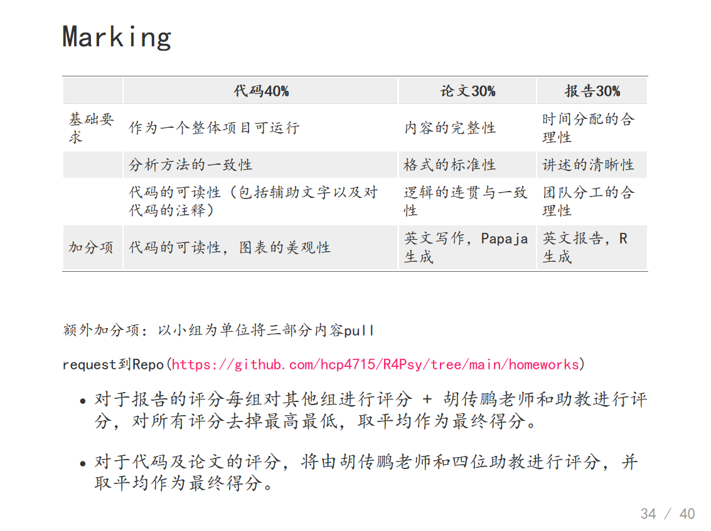

# 第四讲：如何导入数据

## 正式开始前的Tips

今天我们正式开始使用R语言来接触我们的数据。我们之前做了很多准备工作，我看这两天，绝大部分人已经提交了第一次作业。我不知道是否还有人没有提交。从大家的完成情况来看，绝大部分人还是可以的。大家可能会在GitHub的登录这个地方出一点小问题，但绝大部分都能够解决。大家应该也可以获得最新的课件，上课的所有代码都可以通过GitHub同步。既然我们要开始接触数据，这是有可能会在开始使用R之前遇到问题。例如，去年上这门课的时候，有同学遇到一个问题，就是报错时出现乱码，无法被识别出来，看不到具体内容。大家可以把自己的报错语言设置为英文，这样就不会出现乱码了。也就是说，如果你报错时使用的是系统默认的语言，有可能是中文，那么中文输出时可能会有一些乱码无法被识别出来。

```{r local,echo=TRUE, eval=FALSE}
# set local encoding to English（将当前系统编码设为英文）
if (.Platform$OS.type == 'windows') {
  Sys.setlocale(category = 'LC_ALL','English_United States.1250')
} else {
  Sys.setlocale(category = 'LC_ALL','en_US.UTF-8')
}
# set the feedback language to English（将报错语言设为英文）
Sys.setenv(LANG = "en") 
```

另外，在整个课程中，我们推荐大家使用一种方式来装载自己的包，就是使用叫做pacman的管理包。使用这个`p_load`，它会帮助你自动安装那些你没有安装的包。所以我们现在推荐大家使用这个包，非常方便。

```{r message=FALSE, warning=FALSE}
if (!requireNamespace('pacman', quietly = TRUE)) {
    install.packages('pacman')
}
pacman::p_load(bruceR)
```

## 回顾与问题

之前提到，R作为一个工具，是帮助我们解决数据分析问题的关键。我们需要将R整合到，或者说使用R来完成我们整个数据分析的流程。实际上，在一个正常的数据分析流程中，第一步应该是获得数据。获得数据的途径在不同情境下是多样的。对于我们心理学的同学来说，大部分人获得数据的方式是通过自己做实验、发问卷来收集数据，然后数据通过问卷平台或实验收集工具将这些数据收集起来。在其他情况下，获得数据的方式可能不同。比如说，大家毕业后，大家可能会去不同的地方工作，那时你们遇到的数据可能不是通过实验收集的，而是需要通过网络或其他方式来收集，或者是别人提供的一些杂乱无章的数据。所以在拿到数据之前，可能还需要一些额外的步骤，比如通过网络爬虫来爬取数据，这是一种可能的数据获取方式。现在假设大家手头上已经有一些数据了，那么拿到数据后，接下来就是如何将其导入到数据分析软件中。大家在做本科毕业论文时，应该都使用过SPSS，那么SPSS是如何导入数据的呢？

我们其实也可以试一下，在RStudio里面我们是不是也可以用这种方式。比方说我们现在看到的这个R语言的RStudio界面，它这里有一个文件（file）选项，可以选择导入数据（import
dataset）。这里有很多个选项，比如从Excel、SPSS、SAS和Stata等不同的软件里面导入数据。比如说，我们假定大家用的是txt格式的数据，然后我们现在想导入其中的一个数据。我们用这个人类企鹅计划（Human
Penguin
Project）的数据，我们实际上是可以做这个操作的对吧。大家可以看到这个时候，因为我们的数据文件是TXT格式，然后通过逗号进行分隔的，上面有输入（input），每一列对应着数字。这个时候，系统会询问你这个文件是否包含头文件（heading），也就是列名称（column
name）。如果你选择“否”（no），系统会默认给每一列加上V1、V2、V3等列名，一直到V5，将第一行数据作为数据行处理。但如果你选择“是”（yes），系统会将第一行识别为列名称（column
names），这样你的第一行就变成了列标题（headings），这里默认使用逗号进行分割。理论上，你可以直接这样导入数据，数据就会导入进来。这种情况可能让人觉得不需要学习代码。

我们再来看另一种情况，如果你遇到有20、30个的实验数据，一个个点显然是不现实的。所以我们首先可以看到，刚才我们点击导入数据后，系统会在控制台自动显示一行代码。它会告诉我们，我们刚才的点击操作实际上是在做什么。这样，系统自动地写出了一行代码，即使用文件名称作为一个变量，然后使用read.csv函数将其读入。这节课的主要目的就是要理解R这行代码是如何工作的。我们不仅要用鼠标点击，还要理解这个命令，然后让我们更加熟练地把它应用在更广泛的情形下。比如，当我们有很多个文件需要导入时，我们应该怎么办。

我们之前提到，在整个课程中，我们会使用两个数据集：一个是人类企鹅计划项目的数据，另一个是认知实验的数据。比如我们刚才通过点击操作导入的数据，然后查看数据的大致结构。那么，我们如何通过代码来完成这个操作？包括我们是否能尝试选择一些变量进行初步的统计，这就是我们在数据分析中遇到的第一个问题。这节课的主要内容就是解决数据导入这个问题。

## 数据导入

### 数据的“住址”——路径 (以Mac系统为例)

要解决这个问题，如果我们回到刚才的点击操作，我们会发现`read.csv`函数中有一串很长的字符，这串字符代表了导入数据时使用的一些参数和选项。在读取文件时，R语言需要知道文件所在的路径。当我们通过点击的方式打开文件时，会弹出一个窗口，我们可以一层层地选择文件夹。但当我们写代码时，我们需要自己找出文件夹或文件所在的位置，并使用代码来指定这个路径。这就涉及到了一个重要概念，即数据所在的路径，或者可以说是数据在电脑中的“住址”（address）。我们需要告诉R语言从哪里找到这个数据，如何定位它。

如果我们查看文件夹结构，在我们的R4Psy的文件中，它里面有一个名为“data”的文件夹。在这个“data”文件夹里面，有一个名为“penguin”的文件夹。我们想要找到的CSV文件就位于这个“penguin”文件夹内（见下图）。


也就是说，将这个顺序形成一个路径，它基本上可以说是“data”的一个斜线（或斜杠），然后是“Penguin”，接着是“Penguin”文件夹中的“rawdata.csv”文件。（"data/penguin/penguin_rawdata.csv"）但是，跟我们前面看到的在R里面显示的路径相比，它好像更长一些。为什么会更长呢？因为对于这个数据而言，它的完整路径是非常长的。这里，大家可能会了解到，不同的操作系统对文件的挂载或者说文件夹的组织方式是不一样的。在Mac系统下，它只有一个盘，在这个根目录下有几个文件夹，比如“users”——用户文件夹。然后在这个“users”里面，有一个以你自己的用户名为文件名的文件夹。在这个用户文件夹里面，通常会有一个名为“Documents”的文件夹。如果你是mac用户，那么绝大部分默认的文件和文件夹都会放在这个用户名下的“Documents”文件夹里，或者放在一个名为“home”的文件夹下面。然后，你再向下层层递进进行组织。比如说，我们把文件放在user文件夹下面自己的document的文件夹中，然后我们自己又起了个名字“Github”。想把所有的相关文件夹都放在里面。在这里面，就有一个名为“R4Psy”的文件夹，就是我们直接从“GitHub”里面克隆下来的。然后在这个“R4Psy”文件夹里面，就有我们刚才提到的完整路径。

文件我们电脑上的一个完整路径，实际上是从硬盘的根目录开始的。这个路径会包括从根目录开始，一直到我们想要访问的文件为止的所有文件夹和子文件夹。比如，"/Users/cz\*\*\*/Documents/github/R4Psy/data/penguin/penguin_rawdata.csv"。在Mac系统下，我们通常只有一个硬盘，不会分多个盘。所以在这个硬盘的根目录下，就直接是目录结构，不会有盘符的概念。在这个根目录下，你会看到“用户”（Users）文件夹，然后是你的用户名字。这样一来，完整的路径就会变得非常地长、而且非常地复杂。

### 绝对路径/相对路径

这里涉及到两种展现路径的方式：（1）一种是“R4Psy”文件夹里面去看我们的数据所在的位置，我们称之为**相对路径**。相对路径是相对于你当前的工作目录（或父文件夹）来说的。你所在的这个父文件下可能有很多子文件夹，比如“data”、“homework”等。实际上，我们是相对“R4Psy”这个文件夹来说的。


例如，相对路径： "data/penguin/penguin_rawdata.csv"
或"./data/penguin/penguin_rawdata.csv"（"./"表示当前所在文件夹）。

（2）另一种是**绝对路径**，它是相对在整个硬盘中的位置。从硬盘的根目录开始，一直到文件所在的具体位置的完整路径。例如，"/Users/cz\*\*\*/Documents/github/R4Psy/data/penguin/penguin_rawdata.csv"。


对于第一次接触代码和路径的同学来说，可能需要练习如何找到文件夹的相对路径和绝对路径，并且能够区分这两者。在Mac系统下，因为通常只有一个硬盘，会比较好找。使用相对路径会比较方便，因为你可以忽略掉前面的路径，只关注当前工作目录下的文件位置。如果我们把所有东西都放在一个特定的文件夹里面，比如“R4Psy”，并且在这里面保存和读取文件，这个文件夹就可以称为工作目录（working
directory）。在英文中，这个工作目录也可以被称为“parent
folder”，即父文件夹。

在R语言中，你可以使用`getwd()`命令来查看当前的工作目录是什么位置，以及使用`setwd()`命令来设置一个新的工作目录路径。此外，在RStudio中，你可以在“全局选项”（Global
Options）中进行设置，指定每次打开RStudio时自动打开的文件夹作为工作目录。你可以在RStudio的设置中进行修改，选择一个合适的文件夹作为默认工作目录。需要注意的是，**文件路径和文件夹名称应避免使用中文**，因为不同的操作系统和编码方式可能会导致兼容性问题。建议使用拼音或英文来命名文件夹和文件，以确保跨平台的一致性和可靠性。比如说，将“学习”文件夹命名为“courses”或“learning”，然后在后面加上“r”，比如“learning_r”，这样每次打开RStudio时，它会自动打开这个文件夹。


（图. 在全局模式中设置默认工作目录）

大家可能不太明白我在说什么，那我们操作一下来演示。我们现在有一个RStudio窗口，如果我们想打开一个新的RStudio窗口，可以在session里面打开一个新的窗口。这时我们使用刚才提到的`getwd()`命令看看我们现在所在的工作目录是哪里，发现它还是在之前的路径里面。有可能虽然打开了一个新的窗口，但实际上它还是在原来的项目里面。我们可以把这个整个项目关掉（file-close
project），关掉之后再查看当前工作目录，这个时候它就已经不再是之前的目录了。我们打开两个RStudio窗口进行对比一下。一个是在Onedrive里面，另外一个打开的时候，它是在用户名文件下的一个默认文件夹，即我的用户名加上“Documents”。这个地方就是我们之前提到的可以在全局变量中修改的默认工作目录（default
working
directory），在R的通用设置（general）里面。一般我们可能不会修改它，它默认就在用户名下面的“Documents”文件夹里。

大家也可以看到，我刚才打开了一个名为“R
project”的项目，它就自动打开了这个项目所在的文件夹。这就是我们之前提到的，当大家使用GitHub上的RStudio仓库时，里面会有一个以“.rproj”结尾的文件。大家要使用GitHub上的仓库最方便的方式就是直接点击那个仓库（repository），选择打开方式为Rstudio。

打开RStudio时，比如在“R4Psy”这个文件夹里，有一个以“.rproj”结尾的文件。这个文件表示它是一个RStudio的项目文件，它把“project”后面的几个字母缩掉了。如果我们现在关闭所有的RStudio窗口，然后直接打开这个项目文件，它会将当前的文件夹设置为工作目录，这是一种很方便的方式。如果你有一个固定的项目，你可以在该文件夹中创建一个“.rproj”文件，这是最方便的方式。

我们刚才讨论的是在Mac系统下的情况。实际上，在Windows系统下，路径通常是可见的，你可以通过在文件夹上面点击来显示完整的路径（如下图）。


在这里需要注意一点，就是斜杠（/）的使用。在Windows系统中，路径是按照逆时针方向组织的，即从左到右（）；而在Mac和Linux系统中，路径是按照顺时针方向组织的，即从右到左（/）。如果你直接复制了Windows下的路径并粘贴到Mac或Linux系统中，可能会出现问题。**因此注意不要直接复制Windows地址栏中的地址。**
为了解决这个问题，你也可以通过某种方式，比如使用`normalized_path`，来转换路径格式。

```{r path_differencial,echo=TRUE, eval=FALSE}
######  Run in WinOS !!! #####
# r语言中的地址
first_path <- getwd()
cat(first_path,"\n")

# Windows的地址
normalized_path <- normalizePath(first_path, winslash = "\\")
cat(normalized_path)
```

上面这种方式是将其反转，即将逆时针方向的斜杠转换为顺时针方向。另外，我个人使用较多的一种方式是直接让代码处理这个问题，而不去关心斜杠的方向。这实际上是一个字符识别的问题，无论是顺时针的斜杠还是逆时针的反斜杠，都可以让代码来处理。我通常使用一个名为`here`的包来处理路径问题。例如，在打开项目后，我可以直接使用here包来查看。

```{r using here, echo=TRUE, message=FALSE, warning=FALSE,results='hide'}
pacman::p_load(here)

# here::here()
here::here("Book","data","penguin","penguin_rawdata.csv")
```

[注：在Python及大多数编程语言中，路径都支持斜杠（/）]

在R中，两个冒号（::）表示包里面的一个函数。在这个包里面，它会找到名为data、Penguin的数据，然后将其所有的路径连起来，不管你在Windows、Mac还是Linux系统上，它都会自动找到正确的路径。因此，你不需要手动编写完整的和正确的路径。

### 设定工作目录 -- 手动挡与自动挡

**手动档**

通常，我们在编写代码时，会手动设定自己的具体路径。例如，使用`setwd()`函数，或者在Windows系统上使用两个反斜杠（\\\\）。还有一种方式就是使用here包。还有一种方式是直接使用Rproject来设定你的工作目录。我推荐使用Rproject，因为它非常方便。

**使用 setwd输入具体路径，例如：**

```{r echo=TRUE, eval=FALSE}
# setwd('D:/R4Psy/data/penguin/')
# or 
# setwd('D:\\R4Psy\\data\\penguin')
```

**半自动档**
另外，还有Brucer这个包，它提供了一个半自动的方式。你可以在Brucer的`WD`函数中加上一个参数`argument`，值为`ask = T`，它会弹出一个交互窗口，让你选择你希望哪个文件夹作为你的工作目录。

```{r echo=TRUE, eval=FALSE}
# 两个函数等价，ask = T设置弹出交互式窗口选择文件夹
bruceR::set.wd(ask = T)
bruceR::set_wd(ask = T)
```

**手动点击**
还有一种方式是直接手动点击RStudio窗口中的齿轮图标，进入设置，然后选择“复制”（Copy）或“打开”（Open）等功能，手动设置工作目录。这种方法是可行的，但我们不太推荐。在RStudio的设置中，有许多选项，你可以选择将当前文件夹的目录复制起来，或者打开文件夹等。很多时候，我们使用代码能够完成的事情，RStudio现在也通过点击的方式帮助我们实现。当然，我们的目的还是让大家能够用代码来编写。


我推荐将所有的数据、代码等放在一个工作目录下。这样，你后面读取时只需读取相对路径，不需要读取绝对路径。这种做法的好处是，你可以随意复制粘贴这个文件夹。比如，你在C盘底下创建了这样一个工作目录，然后你所有的代码都放在这个工作目录中，使用相对路径。当你把这个文件夹复制到D盘、E盘，或者复制到另一个同学的电脑上时，你打开这个文件夹，他还是可以继续读取这个相对路径里面的数据，不会出错。如果你写的是绝对路径，那么当你换一个地方时，这个绝对路径前面的部分就会发生变化，这会导致找不到文件。

## 读取数据

### 读取数据——手动档

OK，我们前面演示了如何通过点击的方式读取数据。那么我们自己能不能直接写代码来解决这个问题呢？其实也不难。我们给它命名为“penguin_data”，然后使用`import`函数，使用`here`包这种方式。这个`import`函数是我们之前提到的一个函数，用于读取特定目录下的文件。在这里，我们实际上使用的是Bruce包中的一个`import`函数。在点击导入时，我们也在RStudio中看到了它自动给出的是读取CSV（read.csv）函数。我们将完整的绝对路径写出来，然后它可以通过这个函数来读取CSV文件，并将其导入到我们的环境中。

```{r echo=TRUE, eval=FALSE}
# 读取数据,命名为penguin_data
penguin_data = import(here::here("Book",'data', 'penguin', 'penguin_rawdata.csv'))
# 查看头(head) 5 行，有头就有尾(tail)
# head(penguin_data,n = 3)
# tail(penguin_data,n = 3)
```

我们使用的这个函数是`Brucer`包中的`import`函数。为什么要用这个呢？因为它非常好用。`read.csv`函数只能读取CSV文件，或者类似的以逗号、点、或空格分隔的TXT文件。但是对于SPSS保存文件或Excel文件等，它可能无法读取，因为`read.csv`是专门为读取CSV文件而开发的函数。

在BruceR包中，它会整合多个读取文件的函数。它会根据文件的后缀和内容自动识别最适合的函数来读取文件。因此，我们通常推荐心理学同学直接使用BruceR包的`import`函数。至于路径，我们刚刚说到的，最好使用相对路径的写法。而且，使用`here`这个包可以避免一些小细节的问题，比如决定是使用两个反斜杠还是一个正斜杠这样让人头疼的细节。读取数据之后，我们实际上可以对它进行一些基本的查看，比如查看有多少行和多少列。

**查看有多少列（column）、多少行（row)：**

```{r echo=TRUE, eval=FALSE}
ncol(penguin_data)
```

```{r echo=TRUE, eval=FALSE}
nrow(penguin_data)
```

我们通常使用一个已经加载的R包中的函数来进行这些操作。在上节课，我们讲过R包，即R里面有很多函数。这些函数的来源有两个：一个是`base`包提供的一些函数，另一个是各种各样的`package`包提供的函数。当我们需要使用某个特定包中的函数时，我们首先需要加载该包。我们使用`library`函数，后面跟上包的名字，这样就可以将函数加载出来。理论上，一旦加载了一个包，我们就可以使用该包中的所有函数。这是我们上节课涉及到的内容。

当我们已经import了某个包，例如BruceR包以后，该包中的所有函数都可以直接使用。因此，我们就可以直接这么写bruceR::import()可以简写为import()。我个人推荐，当涉及到使用较多的包时，最好将包的名字加到函数前面，而不是省略。这样做的好处是，当你写了几百行甚至上千行代码，并且使用了十几个包之后，你可能记不清某个函数是从哪个包中来的。你可能在编写时非常清楚，因为你可能几分钟前刚刚从搜索引擎或大语言模型中找到了这个函数。但可能半年后，你可能已经不记得了。通过这种方式，你可以知道每个函数是从哪个包中来的，这对于检查代码的可重复性性是非常有帮助的。

读取完数据之后，我们可以在R的environment环境中看到我们刚刚读取的数据。当我们给读取的数据打上标签时，这个标签通常是我们在之前定义的，例如“penguin_data”。这样，我们就可以在environment中找到它。如果我们回到刚才的操作中，假设我们刚开始打开的是一个空的environment，里面什么都没有。然后我们可能想要通过刚才介绍的方式去读取数据。考虑到我们仍然使用一个相对简单的方式来读取数据，我们仍然直接使用import函数。只要我们通过任何方式读取数据后，它都会出现在environment中。在开始时，environment是空的，但现在出现了一个名为“data”的目录，在“data”目录下有一个名为“penguin_data”的数据集。那么我们就相当于地将数据从我们的硬盘里读取到了R里面。这个过程相当于是我们在SPSS中打开Excel文件，并将数据读取到SPSS中。但是，在R读取之后，它不像SPSS那样直接显示所有数据。有时候，你可能无法立即看到数据。如果我们仔细看一下刚才的代码，实际上有两行。第一行是读取数据的代码，第二行是`view`函数，用于查看数据。当我们自己编写代码时，直接使用`bruceR`包的`import`函数来import某个CSV文件，它只会告诉我们已经import了数据，我们可以观察到的变化是在右上角的environment中的变化。

如果我们想要查看数据，我们必须要使用两种方式之一：（1）一种方式是手动的方式，即点击环境（environment）中的数据，鼠标放在数据上时，它会变成一个手形图标，点击一下就可以打开数据。（2）另一种方式是，当你点击了数据之后，RStudio会将`view`函数的代码显示出来。这有点像在SPSS中查看数据，你在这里面可以看到每一行有多少个数据，以及一些基本的数据。但这里有一个不同，你可能无法直接点击某个操作栏来进行数据的操作。在这种情况下，你必须理解数据是如何存放在R中的，以及R中有哪些数据，然后通过什么代码去操纵这些数据，以及进行什么样的统计分析。

例如，我们在PPT中显示了查看数据的基本信息。我们查看读取后的数据，看看它是否与我们的预期完全一样，行和列的信息是否对得上。我们在environment可以看到这个数据有1,523个观测值（observation），有247个变量（variables），这些变量在R中实际上相当于有247列。再比如，当你收集数据时，你收集了100个人，但读取出来时只有88个人，那可能就是某个地方出了问题。有时候会出现这种情况。

在R中，查看数据的一个常用方法是使用`head()`函数，它查看数据的前几行。现在RStudio的一个好处是，当你想要读取某个存在于环境中的变量名时，你输入前几个名字，它就会自动给出可能存在的变量名。然后你按下Tab键，它就会自动输入完整的变量名。

由于我们有247个列，只看`head()`也没什么太大意义。我们后面会告诉大家使用一些更有效的包来直接对这种较大的数据进行快速的探索。这就是我们最基本的读取数据的方法。

### 读取数据——自动挡(GUI点击操作)

这个地方就是我们前面说的，你自动去GUI点击操作。我们刚刚已经讲过了，它实际上跟代码基本上是一一对应的。


## 数据类型

那么我们读取到了这个数据后，接下来想要做什么？肯定不可能读取完了就完了，我们肯定要对他进行一些操作。操作的话，你就要知道，这个我们到底读取的一个什么东西。所以这个时候你可能需要了解一点，关于r里面如何存取数据的一些最基本的知识。那么这里面就会涉及到数据的类型。比方说我们在Excel里面处理数据的时候，我们会有一些，比方说它到底是常规的还是数字类型，还是货币，还是日期等等。那么在SPSS里面的话，我们应该也有不同的这种数据类型，到底是数字还是字符串，等等。实际上,为什么大家喜欢用SPSS，就是它跟我们心理统计上讲离散型数据、连续型数据都差不多。R里面它也有自己的规则，我们接下来可能会讲一下它的规则。


在这个我们刚才说了，就是说把数据导入给进去之后，我们就要对数据进行操作对吧。既然要操作这个数据的话，我们肯定要知道这个数据它有什么样的特点。那么在R里面的话，其实我们可能会有两类基本的数据类型。一个就是最简单的，这种叫做所谓的基本的数据类型，它非常简单的不能再简单的，就单个的东西，它不是由多个元素组成，它就只有一个元素。我们可以直接在这个Rstudio里面进行操作。比方说，在R这个命令窗框里面，你可以把R当做一个简单的计算器，直接在R这个窗框里面进行简单的一些运算，比方说，输入123乘以5，R就可以给你返回一个数字结果。那么其实这里面的123和5都是一个单独的一个元素，那么R会把它识别为一种特殊的数据类型，就是数字。

数值类又包括两种类型，一个就是包含小数点，一个是不包含小数点。包含小数点的类型在其他计算机语言里又被称之为浮点数据，叫double。然后还有一个就整形的数据，就是像12345678没有小数点的这种叫做integer。然后另外的话，单个的这个数字它有可能是一个字母，或者一个特殊的符号，那像这种的话，就是一般在其他的计算机语言里面可能叫string（字符串）。在R里面，字符串数据类型叫做character。然后是逻辑值。看它是“是”还是“否”。


使用`class()`函数可以查看数据类型。例如，查看当前工作目录的数据类型，其中，`getwd`是返回当前工作目录：

```{r echo=TRUE, eval=FALSE}
#getwd 返回当前工作目录，返回的数据类型是？
class(getwd())
```

再例如，查看导入的penguin_data的数据类型：

```{r echo=TRUE, eval=FALSE}
# 查看导入数据的类型
class(penguin_data)
```

| 结果显示：[1] "data.frame"

**字符串的数字与数值型的数字，区分的关键在于引号的使用。**加了引号就表示是字符串的数字（例如，“1”），而没有加引号的则带包数值型的数字（例如，1）。

```{r echo=TRUE, eval=FALSE}
# 字符串的数字与数值型的数字；
# 注意区别== 与 =
class('1' == 1)
```

在R语言中，`==`和`=`是两种不同的操作符，分别用于不同的目的：

（1）`==`：这是比较操作符，用于比较两个同类对象的值是否相等。如果相等，返回`TRUE`，否则返回`FALSE`。例如：

```{r echo=TRUE, eval=FALSE}
#判断1和2是否相等。
1 == 2
```

（2）`=`：这是赋值操作符，用于将一个值或表达式的结果赋给一个变量。例如：

```{r echo=TRUE, eval=FALSE}
#`x`被赋值为10，`y`被赋值为"text"。
x = 10 
y = "text"
```

总的来说，`==`用于比较，而`=`用于赋值。在编写R代码时，需要根据上下文正确使用这两个操作符。

## 数据结构

我们的数据很多时候是有很多不同的类型的。不同数据类型组合了之后，就会形成R里面比较复杂的一个数据结构。大家可以这么理解，如果数据类型由单个元素构成，那么就相当于是把R当一个计算器使用了，因为只需要再单个元素之间进行相互比较和运算。但是，如果有更加复杂的数据结构之后，我们就可以同时对各种组合的数据进行存储和运算。这样才能够满足我们对于比较复杂数据处理的需求。那么我们这里的在R里面，经常会碰到的几种复合的这种数据类型呢？就是向量（Vector）、矩阵（Matrix）、数组（Array），还有数据框（dataframe），我们刚刚看到的数据penguin_data就属于是dataframe。最后一个就是列表（List）。

在向量（vector）型数据中，逻辑型（logical）、字符串（character）、数值型（double和integer）这些称之为原子（Atomic），即基本的数据类型。把完全相同的基本的数据类型放到一起，多个元素叠加到一起，就形成了一个Vector（向量）数据。比方说,多个数字放在一起，就形成了一个数字向量；多个字符放在一起，就形成了一个字符向量。那么我们这个很多向量，它可以通过各种其他的方式进行组合，就形成我们更加复杂的这种数据结构。然后我们把有多个向量在一起的时候，它就可以形成一个矩阵（Matrix）。然后多个矩阵放到一起的时候，它就会形成一个数组（array）。


数据结构里面的每一个元素，都是用同一个颜色表示，这就意味着它在数据类型上面是属于同一个类型。一个向量里，每一个元素都是相通的。比方说，第一个元素是数值的话，那么第二个元素也必须是数值的，它不能说是一个字符的，它可以是逻辑的，它可以是强行转成一个数值的。这里面也涉及到字符的"1"和数字的1返回相等。像R这种高级的计算机语言，它会在内部会做一些自动化的处理。那么有时候这个自动化的处理是有帮助的，但有时候需要去避免这种自动化处理带来的问题，因为自动化处理有可能并不符合你的要求。


（图片来源： <http://venus.ifca.unican.es/Rintro/dataStruct.html>）

这里的向量（Vector）和矩阵（Matrix）和数组（Array），它都必须是同一个数据类型的。然后呢，它组成了这种不同的比较复杂的结构之后，它就形成了这样的一个类型。在dataframe数据中，每一个列使用的颜色不同（见上图）。这就表示每一个列可以是不同的数据类型。例如，第一列可以是数值，第二列可以是字符串，第三列可以是其他类型的。这样给我们提供了很大的自由度，有点相当于Excel。在Excel里，比方说，一列是数字，另一列可以是完全不同的东西。所以，这其实给我们提供了很大的一个灵活处理数据的自由度。列表（List）是更加灵活的一个数据类型。我们会发现，很多模型的结果，特别是那种比较复杂的模型的结果，一般都是以这种列表的方式来存储的，因为list里面可以存储各种各样很复杂的信息，也可以把我们的数据完全装进去。

我们最常碰到的这个数据类型是Dataframe，dataframe数据应该是在心理学研究当中最常出现的，也是最符合心理学研究的实际需求的。我们可以查看数据的每一行每一列的元素是什么，比方说，变量"anxiety"实际上就是不一样的一个数据类型，它属于有小数点的数值类型。当然我们这里还可以比方说，在我们自己处理的时候，我们可能还有被试编号，被试编号如果说我们是字母加数字的组合，那么这个时候它就变成了一个字符串了。

当处理复杂的数据时，有时候不仅仅需要知道数据类型是什么，还要把它提取出来。拿最常用的问卷数据来说，假如说我们得到了每个条目的一个分数之后，如果我们想要得到这个问卷的总分或者均值，然后把它进行下一步的处理。这个时候就意味着我们的第一步是提取出每一个条目（item）所对应的列。第二步，进行运算。

## 数据索引

### 数据索引(中括号)

所以第一点，我们首先要知道如何把需要的东西找出来，在数据处理里面，称之为index（索引），即在复杂数据结构里定位特殊的、感兴趣的变量或数据。基本上所有的这个数据处理的编程软件，都会涉及到索引的问题，不管是用Python还是用这个R，还是用MATLAB。在R里面，我们是用这个**中括号**这种方式来进行索引的。例如，dataframe的数据里有行和列，在中括号通过逗号分隔两个部分，逗号前面是行的信息，后面是列的信息。我们可以直接用行的数字提取它们。

```{r echo=TRUE, eval=FALSE}
# 选取前 2 行以及前 3 列数据
penguin_data[1:2,1:3]
```

结果显示：

| Site age sex 1
| Tsinghua 1922 2 2
| Oxford 1940 1

那么关于如何去提取、提取几行或几列、以及如何索引，大家可以后面去进一步搜索其它的方法，上面这种方法是一个最基本的索引方式，也就是直接用行和列的编号来定位索引。还有一种情况是，如果你在作为主试的过程中发现第100个被试（编号在第100行）的数据可能有问题，你想单独把他的数据提出来。那么，你可以直接把第100行提取出来，前面写100，后面直接不写，就表示把所有的列都提出来，看这一行的整个数据怎么样。

```{r echo=TRUE, eval=FALSE}
# 提取第100行的整个数据：
penguin_data[100,]
```

另外一种方式是，可以用`ncol`函数和减号（-）提取dataframe数据的倒数几列。`ncol`是查看数据有多少个列。

```{r echo=TRUE, eval=FALSE}
# 提取penguin_data的最后4列数据的2行：
penguin_data[1:2,-c(4:ncol(penguin_data))]
```

这是一种用传统的这种方式来提取某一个dataframe里面细节的例子，也是是最经典的方法。但有时候，你其实不知道想要的数据在多少行多少列，但是你知道这个数据的其他信息，比方，你知道被试的编号。而被试编号并不完全和行的数字编号对应。这是为什么呢？因为有可能你中间缺失了或者作废了一些编号，比如从第50个直接到了第53个，中间的51、52号根本都没有输入进去。这就是说被试的编号，并不是和行数完全对应的。定位可以通过一种挑选的方法实现，也就是说，找到被试编号等于某一个特定数值的数据。这里涉及到一个逻辑选择的问题。这里的代码会比较复杂，用tidyverse可以更简单地实现，等我们讲到数据清理的时候再说这个方法。

另外一种方式是，我们可以直接用**列的名字**提取。比如说，我们知道有哪些列需要提取出来，刚才是用序号来提，这里可以用列的名字直接来提取。

```{r echo=TRUE, eval=FALSE}
# 选取前 2 行以及前 4 列数据：：
penguin_data[1:2,c('age','ALEX1','ALEX2')]
```

结果显示：

| age ALEX1 ALEX2
| 1 1922 2 2
| 2 1940 1 1

还有一个小tips，就是用BruceR里面的一个CC帮助省略每次使用字符串的时候都需要打的引号。使用bruceR::cc()，只需在首尾写引号：

```{r echo=TRUE, eval=FALSE}
c('age','ALEX1','ALEX2') == cc('age,ALEX1,ALEX2')
```

### 数据索引(\$)

另外一个常见的方法是使用美元符号（\$）。当我直接去提取出某一列时，由于每一列都有自己的名字，R语言提供了一个特殊的方法，就是使用美元符号。在输入dataframe后按下美元符号，RStudio就会自动弹出所有列名的提示，您可以选择您想提取的列名，比如我们想要提取site列，直接输入site即可。这样您就可以提取出所有的site名称。如果您这样操作，就会得到很多site的名字。但是如果您不想查看所有的内容，只想看前面的一些，这个时候可以使用`head`函数，这是可行的。

这样做的好处是可以快速查看数据，比如对某一列进行精确的定位和运算。比如，如果想知道某个特定列，比如`anxious`（焦虑）的均值，我们就可以直接用美元符号提取这个`anxious`列。因为焦虑得分可能是在200多列中的某一项，可能不知道它的具体位置，如果一个个数又太慢了。通过使用美元符号，我们可以快速进行定位。

```{r echo=TRUE, eval=FALSE}
## 根据列名进行索引
head(penguin_data$age)
```

结果显示：[1] 1922 1940 1945 1948 1948 1951

```{r echo=TRUE, eval=FALSE}
## 如果数据类型的格式是 ***data.frame***
## 则使用$提取和中括号提取是等价的
class(penguin_data$age)
```

```{r echo=TRUE, eval=FALSE}
class(penguin_data[,1])
```

这里面又会涉及到我们如何处理缺失值的问题。当你去提取某一列、对它做运算的时候，如果里面有一个缺失值，比如，有一个NA（缺失值）的话，那么系统就会默认把整个数据都把当做缺失值了。在这种情况下，需要加一些额外的对于缺失值的处理。比方说，需要把这些缺失值去掉，就相当于如果说他某一行缺失的话，你就不把他算入均值里面。这样的话你就能够快速地获得均值。这也是一种个人的使用经验，其实应该是最常见的一种提取列的方式。

### 数据索引(逻辑值)

还有一种就是根据逻辑值进行索引。当你只筛选特定的、符合某一个条件的一些数据出来。那么这个已经变成了数据预处理的部分，就是我们需要通过一个逻辑值挑选出一部分的数据，然后对它进行一些后续的处理。比方说，在做实验数据处理的时候，通常会有不同的实验条件。我们可能会想把不同实验条件的数据以及不同被试的数据分开进行处理，分别求他们的均值或者进行其他分析。这个时候我们就需要采用逻辑值进行索引与筛选。

首先，我们要输出逻辑词。比方说.我们想要提取出所有年龄大于1980年的数据，也就是1980年以后出生的人。如果我们采用这种方式操作，实际上会返回一串逻辑值，对于每一个年龄，比如1500多个数据点的年龄，它都会对应有一个`TRUE`或`FALSE`，表示这个年龄是否大于1980年。如果大于1980年，它会返回`TRUE`，如果不是，就会返回`FALSE`。然后，我们可以根据这一串`TRUE`和`FALSE`将它们作为一个筛选工具，用来提取数据。也就是说，我们可以只提取那些逻辑值为`TRUE`的数据。

```{r echo=TRUE, eval=FALSE}
## 输出逻辑值
head(penguin_data$age >1980)
```

比方说，在下面这个代码的中括号里，前面部分的代码实际上就是在做判断，判断在这个`DataFrame`数据里，出生年份（age）大于1980年并且小于1990年的数据，即1981年到1989年间出生的人的数据，这就是我们想要筛选出来的数据。此时，我们进行了两个逻辑判断。第一个是年龄大于1980，第二个是小于1990，然后用一个逻辑值AND连接，同时满足这两个条件的数据，就把它判断出来。然后，把这个逻辑值放到前面，把它作为挑选行的一个标准。中括号前面是挑选行，后面是挑选列。

```{r echo=TRUE, eval=FALSE}
## 筛选出生年份大于 1980 且(&)小于 1990 的数据
agedata = penguin_data[
  penguin_data$age >1980 & 
  penguin_data$age < 1990 ,]
unique(agedata$age)
```

`{## 逻辑运算： 且(&)、或(|)、非(!)、%in%(属于)}`

这个操作相当于是先生成了一个索引（index），然后提取索引。索引根据我们对年龄的逻辑判断生成。我们把年龄通过逻辑判断出来，也就是把所有符合“同时大于1980并且小于1990”这一年龄特征的行标识出来。比方说，第一行如果不在这个范围，它就变成`FALSE`。第二个是`TRUE`。于是，就会生成1,500多个`TRUE`和`FALSE`。如果我们把逻辑判断值放在行里作为挑选的索引时，那么它就会只把那些等于`TRUE`的保留下来，等于`FALSE`就全部被去掉了。这样一来，我们就可以按照逻辑的规则把我们感兴趣的数据挑选出来。

挑选出来之后，可以看一下挑选是否正确。此时，需要用到了一个函数，查看我们所挑选出来的数据的年龄的独特元素，这里用函数`unique`。`unique`是在检查数据时非常常用、非常好用的一个工具，它的功能是查看某一个对象（可能是一行，可能是一列）里有多少个独特的元素。在我们这个例子里，我们想要提取的就是大于1980、小于1990的这批人的年龄。我们提取完了之后，需要看看提取的内容有没有错误。比方说，我们想确保只有大于1980且小于1990的年龄被提取出来，而不希望大于1990或小于1980的年龄被包含在内。我们使用`unique`函数来查看提取的结果，就会发现基本上所有的年龄都在我们设定的提取范围之内。当然，如果有缺失值（NA），它们也可能被纳入进来，这也是一种提取的方式。

当然，我们也可以通过多种条件进行组合。比方说，我们不仅要对年龄进行筛选，还要对地点（site）进行筛选，比如，我们只想要来自中国的数据。这时，我们还可以在这个逻辑判断里面继续加入其他条件，不仅仅是加年龄的条件，也可以加其他条件。逻辑判断会针对每一行生成一个`TRUE`或`FALSE`，如果有1,500多行，它就会生成1,500多个`TRUE`和`FALSE`。根据生成的`TRUE`和`FALSE`进行后续的数据提取。

我们可以尝试一下提取全部在牛津收集的数据，然后我们再用`unique`来看数据是不是全部来自牛津（“oxford”）。我们可以用一个`temp`的数据。先打一个中括号，然后一个逗号，表示我们在前面这个地方提取。我们首先要去选择用哪一个（这里是site列）作为挑选的标准，然后让它等于“oxford”。这等于是在“oxford”的被试的数据全部提取出来。这里因为我们生产了一个临时变量，所以在environment里面又增加了一个新变量，就是叫`temp`，表示临时的一个数据。

然后，我们用`unique`函数去检查刚才提取得是否正确。如果我们提取的全部都是“oxford”的，那么这里是“site”就应该只有一个元素。如果结果不是只有一个的话，就说明提取有误。**这种（代码运行后的）检查在我个人的经验当中是非常重要的**，因为有时候，当我们我们自己写两行命令时，它并没有报错，我们可能会以为它做了我们想要做的事情，但实际上可能不一定。也就是说，在数据分析的时候，你一定要确认，你做的这个操作是不是真的得到了你想做的东西。所以你要有一个办法能够把它检测出来，这时候就可以用`unique`函数去确认。这是一定要经常去检查的。因为很容易就会出现没有报错，但他做的东西并不是你想要做的。

```{r echo=TRUE, eval=FALSE}
#示例，提取site为Oxford的数据，并判断是否为单一元素：
temp= penguin_rawdata[penguin_rawdata\$site==“oxford”,]
unique(temp\$site)
```

## 对象（object）

我们刚才所有说的这些东西，在R里面都是一个object（对象）。

那么大家可以想象，就是说我们在环境（environment）当中看到的对象，实际上就是我们在临时操纵、不断生成、不断变化的一个又一个object。比方说，我们现在用这个`temp`，临时地提取和检查一下刚刚用来检查提取是否正确的。可能很快地，我们又把`temp`赋值为另外一个值，比方说123。那么这个时候，在这个标签之下，大家可以看到，temp就已经变成了另外一个内容了，它变成了一个values（值）。然后这个"temp_123"跟刚才（penguin_data）就不一样了。

所有的这些临时存储数据、对象，还可以理解为，我们心理学当中的一个工作记忆。对R来说，R也需要工作记忆。在工作记忆里，我们对这些对象不断的进行操纵。那么每一个容器，或者每一个对象，它们就像是一个盒子，这个盒子上有个标签。但是你把什么东西扔进去，这取决于你最近的操作是什么。比方说，我们刚才做了两个操作。第一个是`temp`，我们从这个DataFrame里面提取出来的，属于所有在Oxford收集的数据。大家可以想象，我们刚刚作的操作实际上就是在R的工作记忆里找了一个叫做temp的盒子，把所有符合条件的数据，一整个dataframe都放进去了。我们的第二个操作是赋值给temp，把它叫"123"。这是我们把原来的那个扔掉了，又重新放了一个新的一个值，就是123这个数字。我们可能一会儿又要做别的操作，那么这个变量，就是这个盒子，它的标签虽然叫做`temp`，但它内容可能随时在变。所以这个时候，也是我们在后面处理数据的时候要注意的点，**变量的命名要注意**。因为一旦你的代码写长了之后，你原来的变量在中间经过很多操作之后，它有可能就变成了一个你不想要的内容，但是它又带着这个内容可以做后续操作，也不报错。这个时候，可能最后你的结果就很奇怪了。

那我们今天要讲的内容，差不多就是这么多。我们也没有把这个所有的知识点讲完了，因为这里面涉及到的知识点非常多。那么为什么我们没有讲呢？因为感觉其实讲了之后，大家可能听完了也忘记了。那么大家只有在自己在实际的过程中操作的时候，才能不断地去练习。我最近测试了一下，大语言模型的讲解非常的完善，就大家如果对R里面的某一个知识点，比如，在R里面向量是什么，在R里面Matrix是什么，大语言模型都会给出解释。这样的话，大家就可能更快地去了解这些细节性的知识。那么在我们课程上的话，我们主要就是以数据分析的整个流程为主。

## 其它注意事项

### 变量命名

-   大小写敏感

-   不能有空格，可以用下划线代替空格

-   开头不能是数字和一些特殊符号(如+-\*/)

-   关于"."：R语言是允许变量名中带"."的，比如将数据命名为penguin.rawdata是合法的，但是"."在许多编程语言中都具有特殊含义(如Python)，所以更建议使用_来代替.。

-   如果一定要使用非法的变量名的话：将变量名使用il≤galvarname括起来：

```{r echo=TRUE, eval=FALSE}
# 比如变量名以数字开头且包含空格：
`1 首先` = 1
print(`1 首先`)
```

```{r echo=TRUE, eval=FALSE}
# 从环境中删除该变量
rm(`1 首先`)
```

### 缺失值（NA） 空值（NULL）

-   NA：代表缺失值，任何数值与NA进行计算都会得到NA，因此在计算或绘图中，需要移除缺失值或对其进行填补

```{r echo=TRUE, eval=FALSE}
unique(penguin_data$ALEX1)
```

```{r echo=TRUE, eval=FALSE}
#直接计算会得到 NA
mean(penguin_data$ALEX1)
```

```{r echo=TRUE, eval=FALSE}
# 因此计算时需要移除 NA(remove)：
mean(penguin_data$ALEX1,na.rm = T)
```

-   NULL表示空值，没有任何数据或内容，比如penguin_data\$ALEX1 =
    NULL。会直接删除 ALEX1 这一列（注意：该操作不可逆）

### 数据类型的转换

R 语言中有一类函数以
as.开头，如as.numeric()、as.data.frame()，会对数据类型进行转换，比如：

```{r echo=TRUE, eval=FALSE}
x = TRUE
x = as.numeric(x)
class(x)
```

```{r echo=TRUE, eval=FALSE}
x = as.character(x)
class(x)
```

类似地，也存在一类函数以is.开头，判断对象是否属于某一类型，返回逻辑值：

```{r echo=TRUE, eval=FALSE}
is.character(x)
```

### 目录和文件管理函数:

-   getwd()—返回当前工作目录。 setwd()—设置当前工作目录。

-   list.files()或dir()—查看目录中内容。

    list.files(pattern=’.\*[.]r\$’)可以列出所有以“.r”结尾的文件。

-   file.path()—把目录和文件名组合得到文件路径。
    file.info(filenames)—显示文件的详细信息。

-   file.exists()—查看文件是否存在。

-   file.access()—考察文件的访问权限。

-   create.dir()—新建目录。

-   file.create()—生成文件。

-   file.remove()或unlink()—删除文件。

    unlink()可以删除目录。

-   file.rename()—为文件改名。

-   file.append()—把两个文件相连。

-   file.copy()—复制文件。

-   basename()和dirname()- 从一个全路径文件名获取文件名和目录。

### 对象与变量名

关于对象更加细节的内容，可以参考《R
语言入门与实践》（[点击这里](https://rstudio-education.github.io/hopr/r-objects.html)）。

R语言中，对象就是存储数据的容器，而变量名相当于容器的标签，通过标签来找到对应的数据：比如x
= 1，y = x，y 的值也为 1，而'x'和'y'只是数值 1
的两个标签，二者访问的计算机内存地址相同；

但 R 语言中所使用的复制为浅拷贝(shallow copy)：当对
y进行更改的时候并不会影响原本 x 的值（在 R 3.1.0之前为deep copies），而
y这个标签也被“贴在”了新的内存地址上（copy-on-modify）。

```{r echo=TRUE, eval=FALSE}
x = 1;y = x
address(x)
```

```{r echo=TRUE, eval=FALSE}
address(y)
```

```{r echo=TRUE, eval=FALSE}
y = 2
address(y)
```

## final project（期末作业）

最后的大作业，也就是说大家要做的东西，需要形成文字的，或者说要写的东西。一个是代码，最好是用R
Markdown来写。然后呢，你可以比方说生成一个，如果你用这个R
Markdown，就是我们心理学推荐的那个包的话，那么你就写markdown。它最后会什么呢，就直接给你生成一个文档。
第二个我们要交的东西就是文档，要么是PDF要么是word文档。那么还有一个就是第三个，就是你这个PPT，就是你最后做完了之后，你不仅仅要提交内容，你还要去展示。

**对已发表论文的数据分析进行复现：**

1、展示：待定，每小组约8分钟+2分钟提问

2、代码及报告提交：2024.6.30(待定)

3、需要上交如下内容：

-   代码（RMD格式，最好使用papaja进行准备）

-   文档（PDF或者Word，采用APA格式撰写,推荐由Papaja生成）

-   报告（PPT或者HTML在课堂上展示）

4、选题范围，以下期刊上发表有公开数据的论文：

Nature Human Behaviour; Nature communications; elife; Psychological
Science, Cognition, JEG:General; Collabra: Psychology; Communications
Psychology

### Requirements

#### 代码要求：

1、数据预处理流程

2、完整的数据分析流程，包括：

-   描述性统计结果 + 可视化（集中量数，离散量数，相关等）

-   对原文数据分析结果的计算可重复性的评估(按照模板回答问题)

-   检验结果可视化

#### 文档要求：

-   标题《对XXX的可重复性研究》及作者

-   小组成员与分工

-   引言（对选取研究的简述，包含其假设、数据、方法、结果等）

-   研究复现思路及流程

-   复现结果

-   对结果的讨论及结论

-   参考文献

-   附件：对计算可重复性模板中问题的逐条回复

#### 报告要求：

-   标题，作者

-   成员信息、分工

-   所选研究简介，包含其前言、方法、结果三个部分

-   研究复现思路及流程

-   复现结果

-   对结果的讨论及结论

### 评分标准



好的，如果有什么问题的话，现在不问的话可以在群里随时问。我们今天就到这里，谢谢大家。
