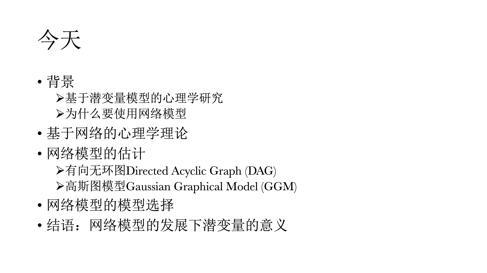
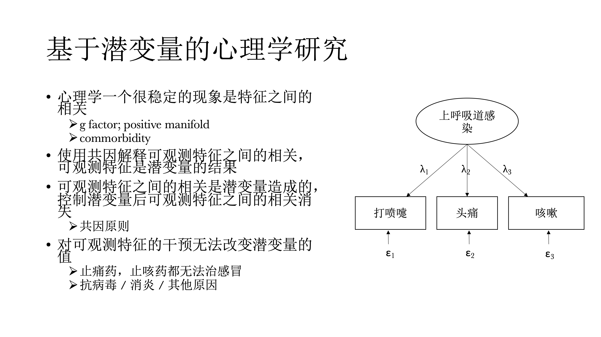
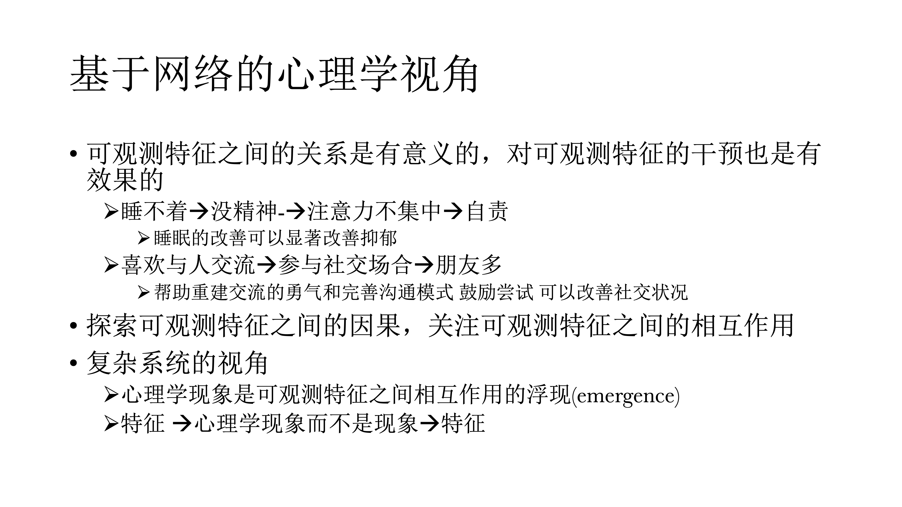
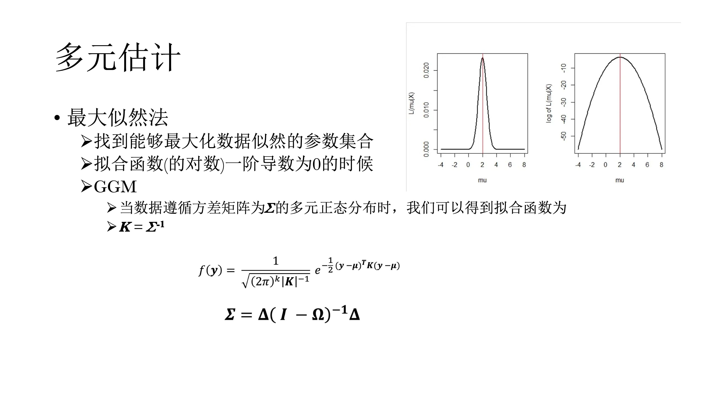
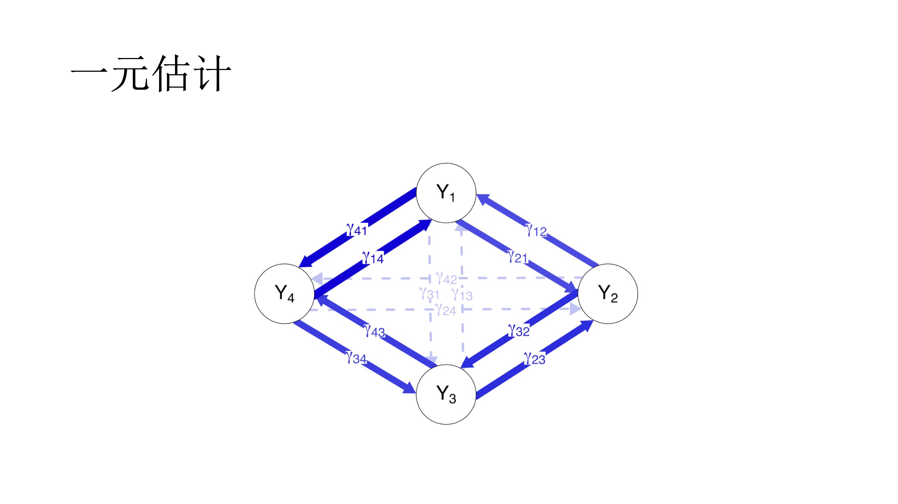
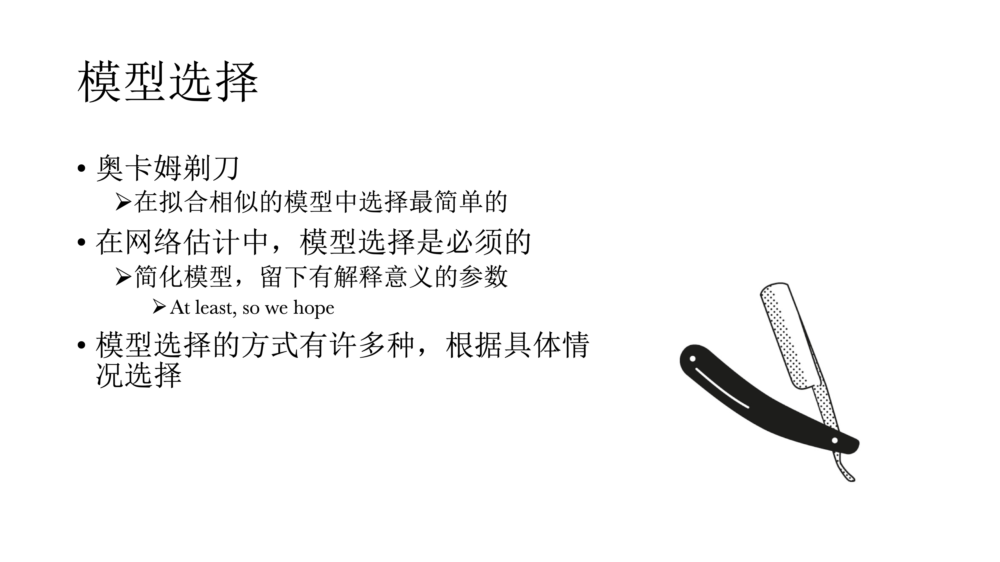
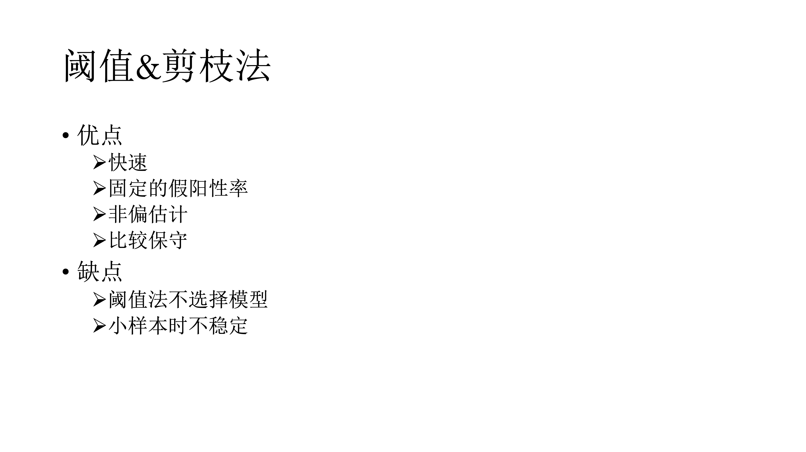
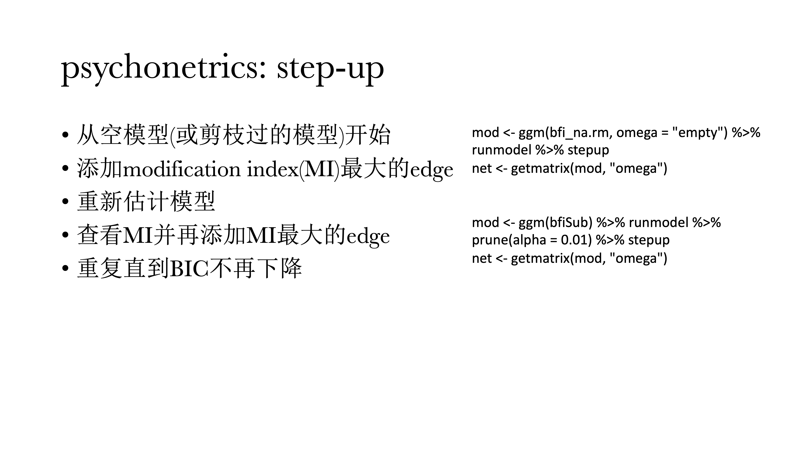
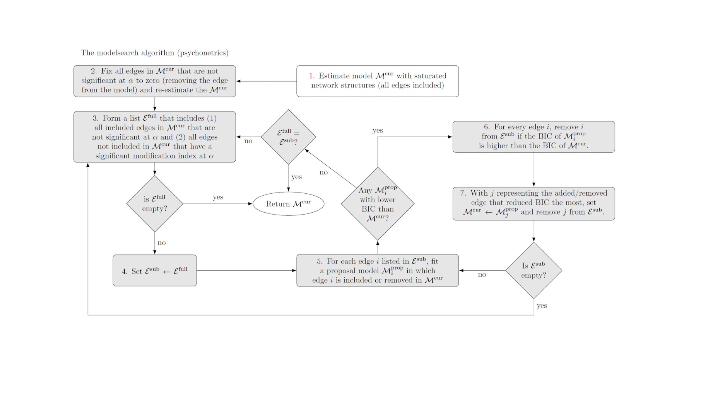
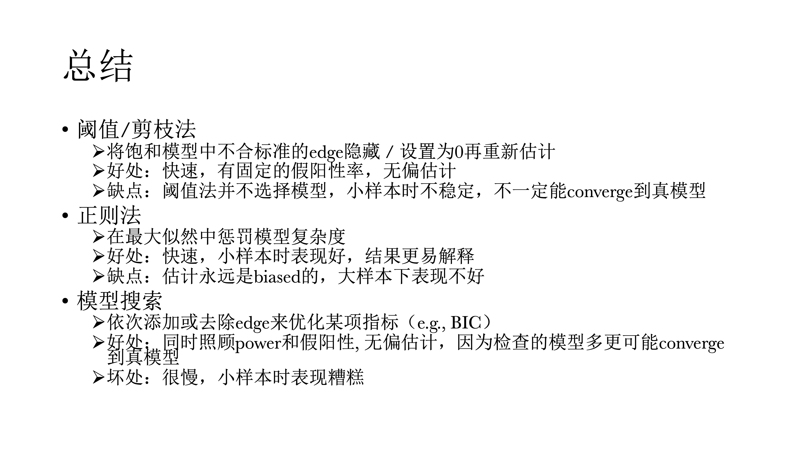

# 第十三讲：基于网络模型的心理学研究

**讲者：**杜新楷

[Google Scholar](https://scholar.google.com/citations?user=S6T6kY4AAAAJ&hl=en)
[ResearchGate](https://www.researchgate.net/profile/Xinkai-Du)
[BlueSky](https://web-cdn.bsky.app/profile/xinkaidu.bsky.social)

**简介：**杜新楷于Modum Bad Psychiatric Hospital和奥斯陆大学就读博士研究生。硕士就读于阿姆斯特丹大学学习心理方法学。研究兴趣为网络分析，时序数据分析和深度学习。

**代表作：**

- **Du, X.,** Skjerdingstad, N., Freichel, R., Ebrahimi, O. V., Hoekstra, R. H. A., & Epskamp, S. (2025, February 7). Moving from exploratory to confirmatory network analysis: An evaluation of SEM fit indices and cutoff values in network psychometrics. [10.31234/osf.io/d76ab_v2](https://www.researchgate.net/publication/382294290_Moving_from_exploratory_to_confirmatory_network_analysis_An_evaluation_of_SEM_fit_indices_and_cutoff_values_in_network_psychometrics).

- **Du, X.,** Johnson, S. U., Epskamp, S. [(in prep)](https://github.com/xinkaidupsy/IVPP) The Invariance Partial Pruning Approach to The Network Comparison in Longitudinal Data.

- **Du, X.,** Epskamp, S. (in prep) Likelihood-free estimation of Gaussian Graphical Models.

- **Du, X.,** Epskamp, S. (in prep) Dynamic fit index in Gaussian Graphical Models.

本章主要围绕基于网络模型的心理学研究。

首先，会讨论基于潜变量模型的心理学研究。经过长时间发展，潜变量模型已经相对成熟，为什么我们还要使用一种新的模型——网络模型，他可以给我们带来什么新的视角和独特的思路？然后介绍基于网络的心理学理论，如何估计、选择网络模型，以及在R中如何将其实现。最后介绍在网络模型发展的情况下，潜变量模型的意义。
```{r}

```


##  基于潜变量的心理学研究

首先，心理学有一个稳定的现象，什么东西之间都有相关的。比如，在智力的研究中，有一个非常稳定的现象positive manifold，是在探讨，测量智力的所有东西，哪怕测量的是不同的东西，比如测量数学能力、英语能力，他们之间也会有正相关，而且这个正相关非常普遍，他们也是在解释这些潜变量，低阶的潜变量之后还会发现一些没有被解释的变异，因而就提出了一个潜变量模型，就是g factor model。

在精神病理学中，也有一种非常常见的现象，commorbidity，是指并发症的意思，指精神科病人往往不只有一个病，有抑郁的人往往有焦虑，而有焦虑的人往往有抑郁，很少说一个人只有焦虑或抑郁，单一的诊断其实非常少见。过去基于潜变量的心理学使用共因来解释观测到的特征之间的相关，认为这些可观测的特征是潜变量的结果；可观测特征之间的相关是潜变量造成的，在控制潜变量之后，这些可观测特征之间的相关应该是消失的，这个是根据因果推断中的共因原则。

另外对可观测特征的干预是没有办法改变潜变量的值的。比如在感冒的时候，我们往往会打喷嚏还头疼，还咳嗽，这个时候我们不能说吃止痛药或者是吃止咳药，他们都无法治疗感冒，这些只能减轻症状，但不能让感冒好起来，最终还是需要通过诊断来确定感冒是病毒性感冒还是其他原因，然后针对具体的感冒类型选择治疗方案，如抗病毒或是消炎。这是我们不需要治疗打喷嚏或咳嗽，研究打喷嚏、咳嗽等可观测的特征是没有意义的。


```{r}

```


## 潜变量模型在心理学的困境

潜变量模型在心理学研究中的困境是，心理学研究对象往往是概念，比如人格等，如果依据潜变量定义的话，他们是看不见摸不到的。

事实上，在可观测的潜变量特征之间存在有意义的因果关系，才导致他们之间存在相关。比如说睡不着会导致没精神，而没精神又会导致注意力不集中，而注意力不集中又导致自责，而自责之后又导致睡不着，然后又没精神......周而复始、恶性循环，最终可能会导致抑郁。上述即是网络模型的视角。

```{r}
knitr::include_graphics('pic/chp13/page 5.png')
```


## 基于网络的心理学视角

在网络模型的视角下，可观测特征之间的关系是有意义的，对可观测特征的干预也是有效果的。比如在对病人的分析时发现，病人很多疾病或症状的源头是睡不着觉，就可以给病人开安眠药，在服了药睡眠质量提升一周后，可能发现他的其他症状也会有明显改善。类似的，有些人难以建立友谊或恋爱关系，这时鼓励他和别人交流，多参加社交场合，从而有机会认识更多的人。

所以，基于网络的心理学视角，会更着眼于可观测的问题，然后探索他们之间的因果，关注可观测特征之间的相互作用。网络分析中可观测特征和心理学概念之间的关系与潜变量是相反的：潜变量的因果方向是从潜变量到可观测的特征，但是在网络分析的视角中，则是可观测变量间相互作用，然后浮现、上升到具体的心理学现象。


```{r}

```


## 如果寻找可观测特征的因果关系

那么我们如何寻找可观测特征之间的因果关系呢？这方面的研究则要归功于Judea Pearl，他做了非常多的有关因果推断的工作，发现我们可以从变量之间的偏相关中推断变量间因果关系，这个方法被称为d-separation rule。并且，他发现了三种原始因果图示，所有的偏相关来推断因果都可以归结为三种基本的图式（共因、链、对撞因子）。


```{r}
knitr::include_graphics('pic/chp13/page 7.png')
```


### d-separation

第一种图式是共因（Common cause），是指两个变量A和C具有一个共同原因B：如果在没有B的情况下，A和C之间存在相关，但一旦引入并控制B时，A和C的相关就会消失。B还有另外一个名字叫干扰变量(confounding factor)，和心理学中很多的“假发现”有关系。我们可能发现两个变量之间存在“虚假相关（Spurious relationship）”，这是由于没有控制另外一个变量（B）导致的。例如，一个村子中小孩的数量和鸟的数量存在正相关，但这不是因为孩子会生鸟或鸟会生孩子，这是因为无论鸟的数量还是孩子的数量都与村子大小有关——村子更大会使得孩子和鸟都会更多。此外，B到A或C之间的箭头方向，反应了因果的方向（见图）。


第二种图式是链（Chain，也叫中介（Mediation））。我们以吸烟会导致癌症为例，吸烟本身不会导致癌症，而是烟中的焦油致癌，因此如将烟中的焦油进行过滤，那么吸烟的致癌率会大大降低。在上述过程中控制焦油的操作，也是我们在做中介分析中会做的事。在中介分析种，首先会分析A和C之间的相关，随后引入B，观察A和C之间相关关系的变化，会不会消失或变小。


第三种图式是对撞(Collider)，是指A和C之间本来不相关，但是在引入B之后会产生相关，并且这种相关永远是负相关。举一个例子，A和C两个人去射击，如果已知A开枪或没开抢，这个信息对于知道C是否开枪是没有任何帮助的；但如果A和C是要处决B，且B已经死亡，即控制第三个变量（即B是否死亡），这个时候就可以通过C是否开枪来判断A是否开枪，因为这时如果不是C开的枪那么就一定是A开的枪，此时A和C之间就会产生负相关。


```{r}
knitr::include_graphics('pic/chp13/page 8.png')
```


## DAG（贝叶斯网络）

上述三种图示体现了有向无环图(Directed Acyclic Graph, DAG)中的基本建构。在网络中，圆圈内的字母表示某一可观测的特征，称之为节点(node)，而不同圆圈（可观测特征）之间的连接线称之为连边(edge)，连边上的箭头则表示因果关系的方向，DAG通过拼接因果关系的图示来寻找边，他们的起点永远是一个偏相关网络。

此外，Collider具有唯一解。如果A和C之间没有相关，但是引入B之后存在相关，就可以推断这一定是一个Collider，也一定知道方向一定是从A到B，从C到B。但如果是Common Cause或Chain的时候，这两个偏相关模式是一样的，没有办法进行区分。A和C之间本来有相关，引入B之后没有相关，B到A和A到B在统计上是没有办法区分的，这也会导致DAG有非常多等价模型的问题，但好处是在模型有唯一解的情况下，可以很直接的看到因果关系的方向。同时，我们也可以通过总结的方式来进行观察，在多少个循环里、或在多少个样本里的方向到底如何，但具体确认还是很困难。

DAG在R中可以使用bnlearn进行实现，教程见引用文献。
 

```{r}
knitr::include_graphics('pic/chp13/page 11.png')
```

贝叶斯网络除了等价模型的问题，还有一个无环假设，因为如果在模型中引入双向因果，则模型无法识别，必须无环假设来对模型进行估计。但这是一个强假设，在心理学中正反馈与负反馈是非常常见的，这也对探索性研究非常不利。刚才提到，由于只能通过collider来确定因果方向，其他图示无法判断。并且如果模型中的节点越多，其等价模型也就越多，几乎没有办法进行判断应选择哪个模型


```{r}
knitr::include_graphics('pic/chp13/page 9.png')
knitr::include_graphics('pic/chp13/page 12.png')
```


## 高斯图模型（GGM）
因此，我们经常退一步，选择偏相关矩阵代表网络，这也是PC-algorithm的起点；在高斯图模型中，我们放弃了因果推断的方向，而使用理论或常识来自行判断来做探索性的研究。由于放弃了因果方向，因而模型有唯一解，同时没有无环假设，可以以此来指导哪两个变量之间存在正反馈或负反馈的关系。同时它也有一个很fancy的名字叫马尔科夫随机场，因为偏相关矩阵具有马尔科夫特性。


```{r}
knitr::include_graphics('pic/chp13/page 13.png')
```


## 易辛模型Ising model
另外一个是易辛模型，适用于变量为二元变量。它实际上是一个物理模型，用来判断电磁场的能量，现在也被应用于心理学中来做模型推演和理论推导和数据分析。

```{r}
knitr::include_graphics('pic/chp13/page 14.png')
```

易辛模型在数学上与IRT模型是等价的。即网络模型和潜变量模型在数学上是等价的，它的好处在于可以复现同样的数据，也少了潜变量的假设。


## 心理网络的估计

### 高斯图模型
对于高斯图模型，有两种估计方式，多元估计与医院估计。
在网络中，一个一个的圈圈叫做节点，他们之间的相关或关系叫做连边。如果一次性将网络中所有的点和边都估计出来，叫做多元估计（Multivariate estimation），通常使用最大似然法。  如果一个一个的估计，即使用多个多元回归，一次使用一个节点作为因变量，其他所有节点作为自变量，最后对结果取平均数，即一元估计(Univariate estiamtion)。


```{r}
knitr::include_graphics('pic/chp13/page 17.png')
```


### 多元估计

#### 最大似然估计
对于多元估计，一种方法是最大似然法。最大似然法简单来说，就是尝试各种参数的组合，看哪个参数组合能与数据相匹配的概率。似然可以用方程表示，最大似然即寻找方程的最大值（计算一阶导并等于0求解）。当数据遵循方差矩阵为∑的多元正态分布时，拟合函数如下图。 


```{r}

```


最大似然法的优势在于可以使用Full information maximum likelihood处理缺失值，而无需删除样本；还有一个是不需要先验分布，可以省去很多麻烦事情，也不会得到有偏估计。

```{r}
knitr::include_graphics('pic/chp13/page 19.png')
```

 
#### 贝叶斯估计

贝叶斯估计也是一种多元估计的方法（使用包BGGM）。基于马尔科夫链蒙特卡洛（MCMC）对参数后验分布取样，这就如同一个人走路，人往左走往右走的概率是由后验来决定的，他每走一个地方就在脚底垫一块砖，走的次数多的地方砖就比较高；最后走完了之后，砖就会摞成一个分布，这其实就是MCMC。这种方法也有很多优点：首先速度快；其次可以使用先验分布，如果有之前的也研究，可以基于之前研究的分布继续进行；最后，由于基于贝叶斯，可以进行非常多样的比较，贝叶斯的假设检验非常灵活，这一点是频率估计是无法做到的。BGMM的教程可参考图中链接。


```{r}
knitr::include_graphics('pic/chp13/page 20.png')
```


### 一元估计

一元估计就是先估计Y1，然后把Y2、Y3、Y4作为自变量，以此类推，每个连接都有两个估计，最后根据AND/OR 的规则进行总结。


```{r}

```


### 代码实现
#### bootnet包

```{r eval=FALSE,echo=TRUE}
# load libraries
pacman::p_load(bootnet, qgraph, psychonetrics, tidyverse, BGGM)

# load data
data("bfi")

# preprocessing -----------------------------------------------------------

# only use the first 25 items
bfi <- bfi[, 1:25]

bfi_na.rm <- na.omit(bfi)

# estimate unconstrained networks -----------------------------------------

##-----------
##  bootnet  
##-----------

# estimate
net_boot <- bootnet::estimateNetwork(data = bfi_na.rm, default = "pcor")

## defalut 为估计网络的方法，这里使用偏相关，别的方法可参考帮助文档


# store the ggm
graph_boot <- net_boot$graph

# Item descriptions
Names <- scan("http://sachaepskamp.com/files/BFIitems.txt",
              what = "character", sep = "\n")

# Form item clusters
Traits <- rep(c(
  'Agreeableness',
  'Conscientiousness',
  'Extraversion',
  'Neuroticism',
  'Opennness' ),each=5)

# plot the network
qgraph(graph_boot,
     layout = "spring", 
     theme = "colorblind", 
     groups = Traits, 
     nodeNames = Names, 
     legend.cex = 0.4) 

```

#### psychonetrics包

```{r eval=FALSE,echo=TRUE}

##-----------------
##  psychonetrics  
##-----------------

# FIML(full information likelihood maximum) 
# FIML handles missing data 

net_psy <- psychonetrics::ggm(bfi, estimator = "FIML") %>% runmodel
### 注意这里typeof(net_psy) 为S4对象，提取信息不用$，而是用@
### 比如net_psy@submodel查看使用什么模型


# store ggm
graph_psy <- psychonetrics::getmatrix(net_psy, "omega")

# plot the network
qgraph(graph_psy,
       layout = "spring", 
       theme = "colorblind", 
       groups = Traits, 
       nodeNames = Names, 
       legend.cex = 0.4)

```


#### BGGM

```{r eval=FALSE,echo=TRUE}

##--------
##  BGGM  
##--------

# handles missing data with mice imputation by default
net_bggm <- BGGM::explore(bfi)
## 也可使用estimate


graph_bggm <- net_bggm$pcor_mat

qgraph(graph_bggm,
       layout = "spring", 
       theme = "colorblind", 
       groups = Traits, 
       nodeNames = Names, 
       legend.cex = 0.4)

# compare the three networks
L <- averageLayout(graph_boot, graph_psy, graph_bggm) 
layout(t(1:3)) 

qgraph(graph_boot, title = "bootnet", layout = L) 
qgraph(graph_psy, title = "psychonetrics", layout = L)
qgraph(graph_bggm, title = "bggm", layout = L)


dev.off()


# compare parameter estimations 
plot(c(graph_boot), c(graph_psy), xlab = "bootnet", ylab = "psychonetrics")

abline(coef(lm(c(graph_boot) ~ c(graph_psy)))[1], coef(lm(c(graph_boot) ~ c(graph_psy)))[2])


plot(c(graph_bggm), c(graph_psy), xlab = "bggm", ylab = "psychonetrics")

abline(coef(lm(c(graph_bggm) ~ c(graph_psy)))[1], coef(lm(c(graph_boot) ~ c(graph_psy)))[2])


```


## 模型选择


以上模型都是饱和模型，都没有经过选择，即每一个观测都有一个对应的参数，不仅很难解释，而且会导致过多的假阳性，很多的相关都不显著，因而需要对模型进行选择。

```{r}
knitr::include_graphics('pic/chp13/page 30.png')
```


在模型选择中有一个原则称为奥卡姆剃刀，即在拟合相似模型中选择最简单的，因为其推广性最好，也容易解释。在网络模型中基本上都要去做模型选择来简化模型，留下有解释意义的参数。

```{r}

```


### 模型选择的方式

模型选择有很多方式：阈值法（thresholding）、剪枝法（pruning）、正则法（regularization）和模型搜索法（model search）

#### 阈值法&剪枝法

阈值法与剪枝法比较像，但是有一些区别。

阈值法是将某些不符合标准的连接直接给藏起来，但也仅仅只是藏起来，并不会重新估计这个模型；而剪枝法会将不符合标准的连接设置为0，并对模型进行重新估计。

而对标准来说，可以是bootstrapped的P值，或是false discovery rates(FDR)，或是贝叶斯因子；在一元估计中的AND/OR规则也可以用与模型选择。

```{r}
knitr::include_graphics('pic/chp13/page 33.png')
```

### 代码实现

#### 阈值法&剪枝法
```{r eval=FALSE,echo=TRUE}
##----------------
##  Thresholding  （阈值法）
##----------------


#------------------- bootnet -----------------------#

# bootnet: sig(依据p值选择，具体threshold参数见帮助文档)
net_boot_thresh_sig <- estimateNetwork(bfi, 
                                       default = "pcor", 
                                       threshold = "sig", 
                                       alpha = 0.01)

qgraph(net_boot_thresh_sig$graph, 
       layout = L, 
       title = "threshold alpha = .01")
qgraph(net_boot$graph, layout = L)

## 或者可以先估计，再选择

# bootnet: boot
## nCores设置使用CPU核心数，nBoots设置重抽样数量，默认1000
net_boot_booted <- bootnet::bootnet(net_boot,
                                    nCores = parallel::detectCores(),
                                    nBoots = 100)

net_boot_thresh_boot <- bootnet::bootThreshold(net_boot_booted, alpha = 0.01)

qgraph(net_boot_thresh_boot$graph,
       layout = L,
       title = "threshold boot .01")


#------------------- BGGM -----------------------#

# BGGM: threshold with credible interval(使用select函数)
net_bggm_thresh_ci <- BGGM::estimate(bfi) %>% select

qgraph(net_bggm_thresh_ci$pcor_adj,
       layout = L,
       title = "bggm threshold ci")

## 注意select.estimate和select.explore不一样
## select.estimate 根据95%CI进行选择，即删去包含0的边
## select.explore根据贝叶斯因子小于3的标准进行排除

# BGGM: threshold with BF
net_bggm_thresh_bf <- BGGM::explore(bfi) %>% select

qgraph(net_bggm_thresh_bf$pcor_mat,
       layout = L,
       title = "bggm threshold bf")


##-----------
##  pruning  （剪枝法）
##-----------

net_psy_prune <- psychonetrics::ggm(bfi, estimator = "FIML") %>%
  ## recursive 可以设置是否迭代进行
  psychonetrics::prune(alpha = 0.01, recursive = TRUE) %>%
  runmodel

qgraph(getmatrix(net_psy_prune, "omega"),
       layout = L,
       title = "psychonetrics pruned")

```

不同标准的模型选择结果会有一些不同，大家在解释的时候可以看一看哪一些发现比较稳定。阈值与剪枝的有点在于速度快，不需要估算很多的模型；可以有固定的假阳性率，是实际可控的（与正则法相比）；其估计值是无偏的，即期望值等于真值；比较保守，假阳性率不高。

缺点在于：阈值法本身不是一种模型选择，只是把边给藏起来了；在小样本时不够精确。

```{r}

```

#### 正则法
正则法在似然函数中添加罚项$\lambda$，会把很大的偏相关给惩罚掉(即LASSO，Least Absolute Shrinkage and Selection Operator)，让0多一点。而控制惩罚程度(罚项)的参数$\lambda$也可以使用EBIC(Extended Bayesian Information Criterion)来选择，即$\lambda$控制罚项，而$\gamma$控制$\lambda$，$\gamma$越大，对模型复杂度的惩罚越大，网络也就越稀疏（EBICglasso）。

在一元回归的时候，同样可以使用LASSO回归来惩罚偏相关；也可以使用交叉验证的方法，推荐阅读mgm的手册。

```{r}
knitr::include_graphics('pic/chp13/page 36.png')
```


### 代码实现
#### 正则化(EBICglasso)
```{r eval=FALSE,echo=TRUE}
##------------------
##  regularization  
##------------------

net_boot_reg <- estimateNetwork(bfi_na.rm, 
                                default = "EBICglasso", 
                                tuning = 0.5)
## 注：对于不同的模型估计时tuning默认值不同，见帮助文档
## 这里运行时提示Warning，提示选择了密集网络
## EBICglasso会假设网络是稀疏网络，但也可能真实网络确实是密集的

qgraph(net_boot_reg$graph, 
       layout = L, 
       title = "bootnet EBICglasso")
```

正则法的优点是同样很快；另外一个独特的优点是非常适合小样本，阈值与剪枝两种方法并不适合小样本，在模拟数据中，N = 50时就能还原出很不错的网络；结果也很清晰，将不太显著的边直接压缩为0。

但是这种方法在大样本时表现差；同样正则法假设网络本身是稀疏的，如果使用正则法，它永远会将一些连边压缩为0，哪怕这些连边的真值不为0，如果我们的理论假设是这个网络应该是密集网络，这时就不应该使用正则法；最后，正则法没有固定的假阳性率，不同于前面两种方法，具体假阳性率是未知的。


```{r}
knitr::include_graphics('pic/chp13/page 38.png')
```


#### 模型搜索

模型搜索的方法应该是最好的方法，但也是最慢的。其逻辑是使用不带正则的最大似然估计不停调整并重新估计模型，直到选择最优解。比如简单的step-up方法，如下图所示，首先从空模型开始，然后加一个modification index（结构方程模型中的调整系数），每次把调整系数最大的连接给加上，然后再重新估算一次模型，并且比较模型拟合是否有提升；然后再在新的模型中找到新的调整系数，再计算、比较模型，直到模型拟合不再提升。

```{r}
knitr::include_graphics('pic/chp13/page 39.png')
```
```{r}

```


`psychonetrics::modelsearch`更加麻烦，具体见下图。

```{r}

```
```{r}
knitr::include_graphics('pic/chp13/page 41.png')
```


`qgraph::ggmModSelect`与modelsearch很相似，但是是从正则化网络出发的。

```{r}
knitr::include_graphics('pic/chp13/page 43.png')
```
```{r}
knitr::include_graphics('pic/chp13/page 44.png')
```


### 代码实现
#### 模型选择

```{r eval=FALSE,echo=TRUE}
## 从零模型开始搜索(step-up)
mod <-  psychonetrics::ggm(bfi_na.rm, omega = "zero") %>% 
  runmodel %>% 
  stepup
net <-  getmatrix(mod,"omega")

## 从被剪枝后的模型开始搜索(modelsearch)
mod <-  psychonetrics::ggm(bfi_na.rm) %>% 
  runmodel %>%
  prune(alpha = .01) %>% 
  stepup

## ggModSelect
net_ggmModSelect <- estimateNetwork(bfi_na.rm,
                                    default = 'ggmModSelect',
                                    corMethod = 'spearman')
```


### 总结

阈值和剪枝法就是将饱和模型里不合标准的连结给隐藏起来，或者是设置为0再重新估计。好处是速度快，拥有固定的假阳性率，同时是一个无偏估计。但缺点是它并不选择模型，在小样本中表现不好，尤其在小样本的时候可能发现不了真模型。

  
正则法就是在最大似然里惩罚模型复杂度，好处也是比较快，但它是适合小样本的，结果更容易解释。但缺点是它的估计永远是有偏的，这是正则估计的特性，因为他的表现不规律，它最后估计的期望不一定是真值。但在网络中，我们不解释连结的weight（表现为连边的粗细），仅说明是正连边还是负连边。
  

模型搜索，使用反复的方式来优化指标，一个个搜索反复添加、删除，直到找到最优的模型。好处是同时照顾power与假阳性的概率，是一个无偏估计。因为模型搜索检查的模型更多，所以它更可能converge到真模型。坏处是，速度很慢，在小样本中表现不好。

总而言之，小样本使用正则法，大样本使用模型搜索。Isvoranu和Epskamp(2023)的文章中有对样本大小的说明，以及其他更全面的解释。

```{r}

```


## 心理网络的挑战

心理网络本身也面临一些挑战。

-   首先，网络理论不等于网络模型，心理学理论和模型之间的关系也有很多值得讨论的。DAG与GGM，二者谁才是最符合网络理论的网络模型？还是近期的新模型，一种有向有环的模型，它可能更好的符合网络理论的统计模型。

-   此外，Collider比较麻烦，它会在网络里面表现出一些虚假的负连结，因此如果网络里面如果出现一些负连接一定要小心，在解释的时候要看它符不符合逻辑。

还有在选择样本的时候，一定不能使用提前选择后的样本，比如只看有精神疾病的对象（e.g.只选取量表中得分超过10分的人），这会人为的引入collider effect。但最近有文章在估计时可以纠正这种Berkon's bias，因此这么做也可以。

-   心理网络的中心度存在问题的，它在社会网路中中心度有着比较可靠的解释或数据基础，但在心理网络中，中心度并不好解释，如betweenness 和 closeness的可重复性并不太好，唯一一个比较好的可能就是degree centrality。

-   使用高斯图因果推断也存在问题，因为在使用时并不知道GGM对应的真正的因果产生机制(真模型)是什么——由于GGM牺牲了方向，因而真正的因果方向是不知道的。近期也有一些替代GGM的办法，但其可靠性值得进一步研究。


```{r}
knitr::include_graphics('pic/chp13/page 48.png')
```


## 我们是否还需要潜变量模型

答案是确定的。很多人觉得使用网络模型就很讨厌潜变量模型，这其实是一个很不好的刻板印象。

-   潜变量模型首先对测量误差的估计是无可替代的，可以在研究时控制住测量误差，其他任何方法都不行，只有基于潜变量模型才可以。

-   同时，潜变量模型需要更小的样本，而网络模型需要的样本量就大多了。

-   对于IRT，对于量表中题项的评估也是无法被代替的；同样，基于IRT的计算机自适应测验的方式在网络模型中也没有被发展出来。

-   基于Network的心理测量其实也不是很全面，大家可以看看下面两个人的文章（见下图）——基于网络的心理测量应该怎么做，定义是什么样，其实都不太一样。基于网络模型的量表，跟基于潜变量模型的量表也不太一样。


什么时候用网络模型：

-   在数据探索时，试图想要发现一些稳定的现象时，网络分析是一个不需要前提理论的探索性方法。

-   当研究对象是可观测特征之间的动态关系时，如做临床中可以通过网络模型，可以直接看出治疗效果在哪一个症状上体现出来，这种动态的关系是否发生改变。这时网络分析所显示出的结果要比潜变量模型要多很多。

-   当有理论来支持可观测特征之间的因果关系时，这时候用网络模型更好

```{r}
knitr::include_graphics('pic/chp13/page 49.png')
```
