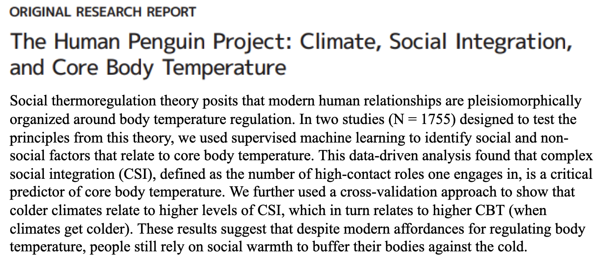
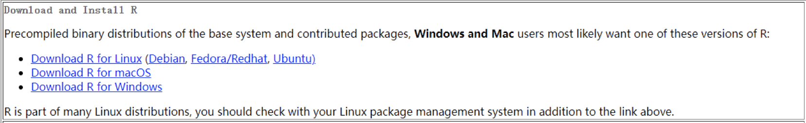
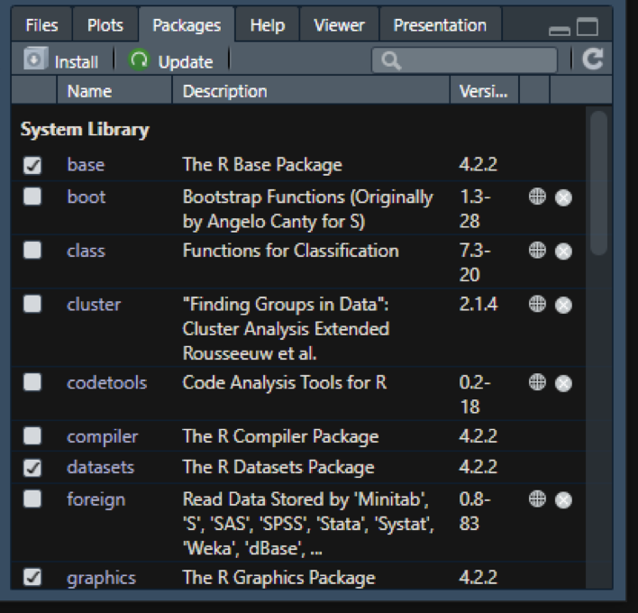

# 第二讲：如何开始使用R {#lesson-2}

```{r setup, include=FALSE}
knitr::opts_chunk$set(echo = TRUE)
##library(tidyverse) # Wickham的数据整理的整套工具
pdf.options(height=10/2.54, width=10/2.54, family="GB1") # 注意：此设置要放在最后
```

**前言**

数据分析的出发点是解决问题。也就是说，我们数据分析的过程都应该是问题导向的。因此，数据分析中的一个关键在于明确地知道自己要解决什么问题，要有强烈的问题意识，这对科研工作者来说尤为重要。无论是学习R语言或其他计算机语言，还是进行一系列的数据分析，其目的都是为了回答一个特定的问题。问题本身的重要性最终决定了数据分析的价值。

问题可以是科研中的理论问题，也可以是现实生活中的实践问题。例如，交通分流、道路设计、产品质量等的分析。实践问题也可以是收集证据来辅助决策。比如，在新冠疫情期间，行为科学(behavioral
science)在公共决策中的作用受到了重视，通过大量的行为数据，可以帮助政府或决策者进行更好地决策。因此，数据分析的出发点是解决问题，这也是学习数据分析中首先需要明确的。让数据分析变得严谨和可重复，是为了更好地解决问题。我们必须时刻牢记这个最根本的出发点。

## 要解决的数据分析问题简介 {#2-data-for-lesson}



### 第一个数据: 人类企鹅计划数据 {#2-data-1}

为了帮助大家更好地学习如何使用R语言解决问题，我们提供了两个示例问题。这两个问题是我本人在先前的研究中遇到的，因此有心理学背景的读者可能会比较熟悉。

第一个问题是有关人类社会关系和体温调节之间的关系。我在读博期间参与了[Hans
IJzerman](https://www.lippc2s.fr/archives/person/ijzerman-hans/)博士的这个项目。他关心的问题是人类的体温和社会关系之间的关系。从演化的角度讲，哺乳动物的生存需要苛刻的环境：身体的核心温度必须要维持在很窄的范围之内，哺乳动物才能够生存。作为哺乳动物，人类要在相对恒温的条件下才能生存。生物学的研究发现，哺乳动物会形成一个社群，通过这一社群来帮助其中的每个个体调节体温。由此，Hans对"人类身上是否也存在这种机制？"这一问题产生了兴趣，人们的社会网络本身，是否能够帮助我们去调节体温呢？Hans提出了自己的理论假设([IJzerman
& Hogerzeil,
2018](https://papers.ssrn.com/sol3/papers.cfm?abstract_id=2844963))，并试图验证社交网络是否能够调节体温，于是进行了一项大规模的跨国实验，收集了来自十几个国家的数据。

Hans首先进行了一个预实验，随后收集了横跨12个国家的数据，包含了1,500多个人的信息，其中包括怀旧程度、对家的依恋、主观压力、新陈代谢和社交网络质量等多个问卷。这个数据集最初是通过Qualtrics在线收集，现在已经公开可以使用([Hu
et al., 2019, sci
data](https://www.nature.com/articles/s41597-019-0029-2))。

请您设想自己是Hans课题组的成员，置身其中地思考如何从数据导入开始一步一步进行后续的数据分析。我们可能最终想要解决的问题是如何预测核心体温，其中一个重要的分析方法是有监督的机器学习(条件随机森林,
conditional random
forest)，我们将寻找能够预测核心体温的变量。在下图中，红色线以上的变量对预测核心体温有很强的相关性，反之则预测效果较弱。换句话说，虽然我们测量了很多变量，但通过机器学习算法，可以发现只有部分变量与核心体温有较强的相关：complex
social integration
(CSI)，CSI是社交网络的一个指标。在Hans的研究中，也使用了一些传统的问卷分析方法，比如调节分析。他发现是否处于亲密关系对CSI与体温之间的关系是存在调节作用的。

要进行整套分析的研究，首先需要将原始数据输入到R语言中，然后进行数据清理和描述性统计，例如数据质量、问卷信度、均值、标准差等统计指标。此外，也可以进行探索性的数据分析，例如相关矩阵，来探索变量之间的关系。最后，我们需要呈现研究结果，包括condition
random
forest的结果和mediation的结果，并将其整合到可视化报告中。原研究实际上并没有将数据分析和结果报告整合到一个完整的RMD文件中，而是采用传统的方式来准备手稿。在我们的课程中，将使用Rmarkdown来完成整个数据分析，并生成PDF文稿。

我们所提供的是一个大致的数据分析流程，其中还存在一些细节值得更多关注，例如如何去假定变量之间的关系。我们所进行的是别人研究的复现，通过复现去了解使用R语言进行数据分析的流程，以提高自己的技术。


### 第二个数据: 知觉匹配任务数据 {#2-data-2}


这个实验是一项简单的认知实验。在认知心理学中，我们通常会在实验室中进行，让被试进行一些简单的按键反应。这个任务可以分为几个阶段：首先是学习阶段，在这一阶段我们会呈现几何图形（正方形、三角形和圆形）和三个人物标签（好人、普通人和坏人)，然后让被试在图形与人物标签之间建立联系，例如将三角形和好人联系起来。随后，我们会在电脑屏幕上呈现一个图形和一个标签，被试需要判断屏幕上呈现的图形和人物标签是否匹配。这是一个非常简单的任务，被试练习了二三十次后，就能够熟练地完成这个任务。

接下来，我们会让被试完成两个任务：匹配任务和分类任务。匹配任务需要被试做出一个决策，即图形和标签是否匹配，它的反应窗口非常短，大约在800到1100毫秒之间。分类任务需要被试判断图形是好人还是坏人，然后进行相应的按键操作，此任务也需要在非常快速的时间内进行反应。

我们的实验设计是一个2\*2的被试内实验设计，自变量包括人物标签（自我 vs
他人）和效价（valence）。

在分类任务中，采用两种分类的标准：自我vs他人，好人vs坏人。在学习过程中，记住了四个人物标签和四个几何图形之间的配对关系，并训练匹配任务和分类任务。分类任务包括按身份和效价进行分类。


在研究中，我们想要了解即时学习到的社会意义是否会影响对几何图形的反应。我们发现，给几何图形打上社会标签后，会影响到反应时间。虽然总体上来说，好的自我反应最快，好的他人的反应也不错，但是坏的自我和他人都比较慢。这是一个总体的趋势，但并不是每个几何图形都是这样的。我们使用这种方式来绘制图形，既能看到总体水平上的结果，也能看到个体差异。这可以避免我们的过度推断。

上图右边是d
prime，是信号检测论中的一个指标。在心理物理学中，信号检测论是一种常用的数据分析方法，用于认知心理学研究。它可以计算d
prime，即敏感性，这比准确率更能判断信号是否敏感。在匹配的任务中，我们将匹配条件视为信号，不匹配条件视为噪音，以此来计算信号检测论。对于非匹配任务，如分类任务，我们也可以计算类似的标准和数据。我们还使用了一个名为Drift
Diffusion
Model的计算模型来分析数据，它是用Python工具包HDDM完成的，但也可以在R中使用。在这个数据中，导入数据可能有些复杂，因为每个被试的数据都有三个文件，需要进行合并和清理数据的预处理；在数据分析部分，我们进行数据清理和可视化。

如果使用传统的方式，我们需要使用Excel进行数据预处理，使用SPSS进行统计分析，使用Excel或PS进行图形绘制和美化，最后使用Word文档进行写作。如果使用R语言，我们可以在R语言中完成所有工作，从Tidyverse开始进行数据清洗和工具分析，使用GGPlot2进行图形绘制。我们将使用Markdown或papaja来输出。在BruceR中，我们特别关注T-test、方差分析和多重比较等内容。由于BruceR对心理学数据分析进行优化，因此非常方便。正如我们之前提到的，使用R进行分析可以保留所有分析过程，并且可以通过代码直接重复分析。而分析采用的代码和方法也非常灵活，新的方法也容易共享。

## 如何安装 {#2-install-R}

首先是安装过程，可以在必应(bing.com)中搜索R语言官方网站，然后在该网站中下载安装程序（[点击这里](https://mirrors.tuna.tsinghua.edu.cn/CRAN/)跳转到清华镜像下载）。该程序适用于不同的操作系统和版本。对于Windows系统而言，安装过程比较简单。但对于Mac系统，安装过程可能会稍微复杂一些。Mac系统可能会有两个版本，分别为arm64版本（苹果M系列芯片）和
x86_64版本（英特尔芯片），可根据自身情况下载。




使用中文语言安装R语言会更加方便，可以避免编码问题。下载完成后，运行安装程序。在安装过程中，你可以选择是否自定义一些安装选项，但是默认选项通常已经足够了。但为避免以后的使用中出现问题，**请确保选择英文路径作为安装目录**。安装完成之后，你可以开始实际学习操作。在此我也想提醒大家要**把安装目录放在英文文件夹里**，避免中文路径可能会出现的编码问题；对于
Windows
用户来说，应当尽量将电脑的用户名也改为英文，因为有时在绘图时会调用一个存在于用户名下的某个文件夹，一旦无法识别中文，那么就无法对该文件夹进行识别进而导致出错。


在上图你可以看到，此处默认选择了中文作为系统显示语言，主要是由于系统语言为中文，安装时自动采用中文显示。安装时可能看到了一些警告(warnings)，猜测是语言设置引起的，在R语言中也会遇到这种情况。这里有两种类型的警告：一种是称为"警告（warnings）"，另一种是"错误（errors）"。对于那些被警告的代码，我们需要仔细检查，看看是否会对我们的运行造成严重的影响。如果没有明显的影响，那么就可以忽略。

在读取一些文件的时候，我们可能会遇到一些问题。例如，遇到一些非UTF-8编码的语言编码。这意味着我们不是使用Unicode编码方式。为了解决这些问题，我们通常使用UTF-8编码方式，这是中文中非常常见的编码方式。在大部分计算机系统中，我们都可以使用UTF-8这一国际通用的编码方式。

## 如何方便使用？Rstudio的安装与界面介绍 {#2-Rstudio}

大家都已经成功安装了R语言，现在看到的是console控制台界面。早期的R语言使用这个控制台进行输入和操作。比如，我们可以输入一个简单的命令，例如：

```{r}
a <- rnorm(100)
plot(a)
```

第一行命令即随机生成 100 个服从正态分布的数据（rnorm，即random
generation for the normal distribution的缩写），并贴个“标签”叫
a，然后绘制散点图。在控制台中，我们可以使用代码与计算机进行交互，即这个窗口会对所输入的内容做出即时的反馈，当然也包括对代码中错误的反馈。


对于没有编程经验的同学来说，可能会对控制台感到非常陌生：为什么有些输入会被计算机执行，但是有些不会？还有，为什么有些输入会产生图形效果，有些则不会？这正是我们通过代码与计算机交互的方式。这种方式与图形界面的软件（如SPSS）有所不同。在使用SPSS软件时，我们通过点击屏幕来进行交互，并从菜单中选择选项；然而，在使用R语言或其他语言时，我们则是通过输入代码与计算机交互。对于其他计算机语言也是一样。


这样的交互方式也存在缺点：我们不知道哪些变量保留在内存中。当进行一系列操作时，我们不知道哪些操作是我们刚才输入的。它们存在于计算机的缓存之中。如果输入了许多变量，如a、b、c、d等，我们可无法回忆起这些变量的细节。因此，当我们学习R语言时，我们希望有一个更清晰、高效的地方来编写代码，而不是一次只写一行代码，然后再运行。因此，我们需要一个更友好的代码编辑器，而不仅仅是控制台。虽然控制台是与R进行交互的窗口，但功能还不够强大。

### Rstudio的安装与界面介绍 {#2-Rstudio-install}

幸运的是，我们可以使用RStudio来完成这项任务。在安装完R后，我们可以安装RStudio，有两个版本可以选择：Windows版和Mac版。安装时，我们需要将其安装在**非中文目录**下。安装后，我们可以选择64位系统。


打开RStudio后，显示出的是一个白色背景的界面，我们可以通过更改外观中的主题来改变界面颜色。在这个工具中有一个全局选项，然后选择外观，可以把界面改成你想要的样式。将界面背景改成灰色可以省些电，因为不用一直发亮光。

接下来讲讲界面的调整。我们的界面是由四个面板组成的，但是在刚安装RStudio时，我们看到的是三个面板的界面，界面可能还有点不一样。我们可以新建一个project来呈现一个新的面板。


现在我们有4个窗口。这4个窗口分别是脚本编辑区、控制台、环境和文件。
现在我们可以看到5个部分。1是顶部的菜单栏以及快捷方式栏。2是左上角的脚本编辑区，3是左下角的控制台，4是右上角的环境/历史/链接区，5是右下角的文件/图片/程序包/帮助/预览区。

**脚本编辑区**

脚本编辑区可以记录下我们想要写的代码，并且可以选择性地运行。我们也可以直接创建一个R脚本，然后输入代码。在输入代码的时候，RStudio会提示我们，根据我们之前输入的字符来预测我们可能想要输入的代码。这样的话，我们就不用记住很多代码，可以更方便地完成代码。我们可以将所有的代码放到一起，形成一个脚本文件，一般以
.R作为文件后缀。我们可以用RStudio打开它，这样可以更好地编写R代码。
数据对象的具体内容也将显示在脚本编辑区域。


右上角这个地方，实际上它不是一个窗口，而是多个窗口，第一个选项卡，这是一个被称作environment的窗口，类似于人的工作记忆一样，会存储我们运行中的所有的数据和变量。现在这块区域是空白的，因为我们没有进行过任何的数据的操作和读取。如果我们运行了一些有关变量的R指令，涉及的变量就会在这块区域中出现。
我们最好经常留意环境区域的变化，如查看新生成的对象是否正确等。


第二个窗口是history,我们所有运行过的代码会在这里被列出，就像我们刚才输入的指令，都会保存在里面。可以命令运行历史。

第三个窗口是链接（connections），可以建立与外部数据库、脚本的链接。

**控制台**


Console，即控制台，展示了所有程序的交互结果。代码的运行结果与报错都会在该窗口展示。在Rstudio中不仅有Console控制台，还有一个teminal，这是一个与windows系统进行交互的界面。在Mac
OS中也有相同的Termianl终端。我们可以让它进行在后台安装软件之类的工作，不过我们使用的不多。
Console，即控制台，展示了命令运行的结果，包括计算出的值、提示、报错等信息。也可以在这个区域直接缩写命令行，按回车键运行。但此区的命令为即使命令，无法保存。点击清扫按钮即可将当前的内容清除。

在后面我们使用github的时候，我们可能会较多的涉及到Teminal相关的内容。

**右下角窗口集**



右下角有许多子窗口，我们一般会频繁地用到其中的两三个，一个是files，一个是plot，可能还有一个help。

当我们对某个指令的具体功能和提供的参数不是很了解的时候，我们可以在help中进行输入和搜索，它就会提供给我们一些相应的解释和说明，我们可以详细的了解相关的函数和包。

file窗口是我们的文件浏览器，我们可以看到我们打开的文件夹里有什么文件。并且可以进行打开。因为我们打开的是一个R
project文件，它会自动将工作目录关联起来。

plot界面是我们画出来的图的展示的地方，我们使用plot等指令绘制的图表将会在这个界面中呈现。我们可以通过手动拖拽窗口的大小来调整输出图片的大小，并且可以进行保存等操作。
若想保存图片，可点击窗口上的export按钮，选择想要保存的格式，最好是保存为pdf，可以保证图片的分辨率。


除此之外，我们还有packges选项卡，在其中我们能看到我们安装的包，并且对其进行管理。

### 测试Rstudio {#2-Rstudio-test}

现在，我们可以对我们的安装过程进行一个检查，如果我们能够在Rstudio中正常的输出这样的图表的话，就说明我们的安装不存在问题。


**典型问题**

由于大家的输入都是以中文为主，所以输入法很多时候会保持在一个中文输入的状态，这个时候你的标点符号也会是中文的，**但是所有R的指令需要的都是英文的标点符号**。如果你输错了，可能就会发生问题，比如出现unexpected
input这样的报错。

### R语言中的包 {#2-packges}


包（package）是R中非常重要的一个概念，我们在前面提到过package窗口，它管理的对象就是我们的包。


Packages
是一种模块化的方式，用于扩展R的基本功能。Package包含了函数、数据集、文档和其他需要扩展R的元素，这些元素按照特定的结构和命名方式进行组织和存储，方便用户引用和使用。它能够以类似R的方法对R的功能进行扩展。有了各种各样的包，才能让R语言的生态变得丰富。

包里一般会包含一些有特定功能的函数，有些也包括一些数据集，能够让你去方便的测试它的一些函数；也包含了说明文档，来解释包和各个函数的功能。

#### 包的介绍与调用 {#2-packges-cat}

R包的基本分类大概包括：

-   Base:（安装R时自带的包）

-   其他:由社区所贡献的、内容丰富、领域特异性（数据可视化、统计分析、机器学习、深度学习、自然语言处理、图像处理）的包。

-   R报系统：有些相关的包会朝着同一个风格进行开发，形成一个系统，例如tidyverse;
    easystats。他们有自己特殊的语法风格。

使用包通常需要先安装，可以通过 install.packages() 函数进行安装，然后使用
library() 函数加载包。例如：

```{r eval=FALSE}
install.packages('tidyverse')
library(tidyverse)
```

**注意：在使用install.packages()
时，括号内要加引号！括号、引号均为英文输入状态下的半角符号！**

由于 tidyverse
是一系列包的集合，因此在安装时会下载多个包；有时在安装一些包时，这些包的运行又依赖于其他的包，因此下载时会将这些包都下载下来。

#### 镜像的选择

有些安装包安装起来会比较慢，这可能是因为用了国外的镜像网站。镜像网站是一个将完全相同的网站放到了国内的服务器，每个网站都有自己的网址。一般默认使用的是
CRAN镜像（R
语言的官方包管理库）；如果想要加快下载速度，就需要切换镜像网站地址（[点击这里](https://mirrors.tuna.tsinghua.edu.cn/CRAN/index.html)查看），如切换到清华镜像：

```{r}
# 查看当前默认使用的镜像：
getOption("repos")
# 切换清华镜像
options(repos = c(CRAN = "https://mirrors.tuna.tsinghua.edu.cn/CRAN/"))
```
