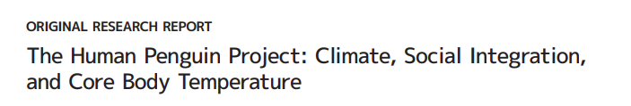
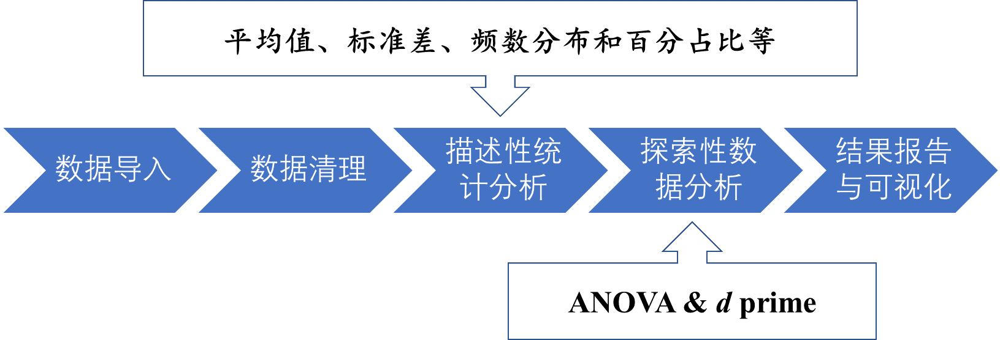
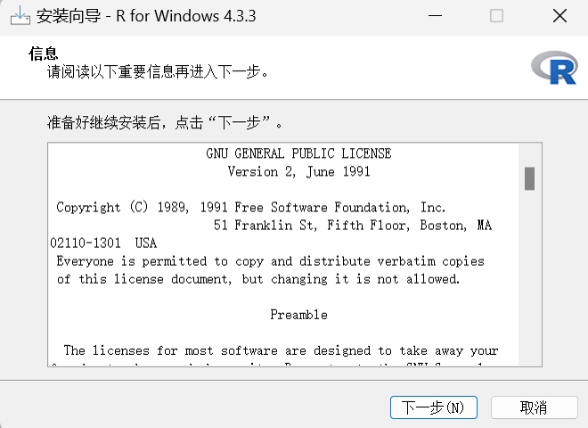

# 第二讲：如何开始使用R

大家好，下午好晚上好。现在我们开始第二节课。看起来上一节课还是起到了一些效果，人数减少了一些。我觉得这很好，这说明大家开始明白自己真正想要学习的是什么，这是一个非常好的开始。无论你们学得怎么样，最重要的是首先要知道自己是否真的想要这个。上一节课我们作为科普，讲解了为什么要学习，这是我们的核心目的。我们希望从零基础开始，让大家从完全不知道的状态，通过我们的课程开始了解并逐渐使用。今天这节课我们将从最基础的内容开始，讲解Rstudio的安装。我们之前已经把PPT发到群里了，所以大家可能都已经下载了。但今天我们还会简单地过一遍R的安装步骤和可能遇到的一些问题。那么，我们今天就开始使用它吧。

## 数据分析的出发点——问题

虽然我们这是一门介绍R语言的课程，但我们不能忘记我们为什么要学习数据分析。对吧，上次也有同学和老师在关注统计之都的公众号时，看到了他们最近发布的一篇关于统计学未来的文章，讨论了在人工智能发展的背景下，统计学应该如何发展。我们学习的心理统计学或者数据分析，都是与统计学密切相关的问题。我们的应用也是心理学的问题，在当今这个时代，心理学和数据分析应该如何教授和学习，这是一个值得思考的问题。

最近，我注意到越来越多的数据分析师、统计学家，甚至是各个领域的专家，都开始强调一个观点：做数据分析不仅仅是为了完成统计分析，它实际上是一个完整的工作过程。这个过程的起点是我们有一个问题，我们为什么要去分析数据。在我们的科研过程中，我们通常是因为要通过统计分析来帮助检验假设、估计我们感兴趣的效应量，或者探测某个效应是否存在。在心理学研究中，我们大部分情况下都在进行假设检验，我们都在使用p值。但最近有些反思认为，我们可能过于依赖假设检验，我们应该去做一些其他的事情，比如预测或者估计的工作。

在其他领域，比如医学，医学统计学也是非常重要的方法学部分。在医学中，更注重的是治疗效果本身量的大小，比如新的治疗方案是否有效，效果有多大，在多少人身上有效，以及它的成本和效益比是多少，这些是一个非常实用的、医学研究中需要关注的问题。与我们心理学非常接近的教育学，在进行干预时也需要关注效应量。例如，当我们提出一个新的教育干预手段或者一个新的教学方法的时候，我们需要评估它是否真的能提高学生的学习能力。我们最终关注的也是提升的效应量的大小，实际上就是一个估计的问题。有些同学或老师可能将来会进入企业工作，在那里，数据分析将用于帮助上司或公司做出决策，在企业中，数据分析通常用于解决决策性的问题。

因此，我们进行数据分析的出发点或起点，通常是我们面临的问题，无论是研究问题、实践问题，还是辅助决策的问题。由于我们是在心理学院，我们遇到的问题大多数是传统的问题。在整个课程中，我们会在课堂上使用两种常见的数据类型，这是心理学中经常遇到的两种类型：一种是问卷数据，另一种是在进行认知实验时收集的反应时间和反应选择的数据。

### 问题一: 人类企鹅计划（问卷数据）

问卷数据采用的是我之前参与过的一个项目中的数据。我上节课也跟大家提到过，是[Hans
IJzerman](https://www.lippc2s.fr/archives/person/ijzerman-hans/%22Rocha%20IJzerman%20Hans%22)在2018年主持了一个大规模的合作项目。他研究的问题是关于人类的社交网络关系是否与我们的身体体温调节有关。下面这是这篇文章的信息：



（参考文献：IJzerman, H., et al. (2018). The Human Penguin Project:
Climate, Social Integration, and Core Body Temperature. Collabra:
Psychology, 4(1): 37. DOI: <https://doi.org/10.1525/collabra.165>）

下面是这篇文章的数据。一般来说，我们做问卷调查都是在网上进行的，现在已经很少有人会拿着一堆问卷一个个发放了。基本上，我们都是在网络上收集问卷，然后导出的格式通常是CSV或者SAS格式。CSV是全文本格式，使用逗号分隔，而SAS是SAS格式的数据。所以我们可能会拿到这样的数据。

这两个数据我们后面都可以在课程资源里找到，我们课程的git
hub上也直接放上去了。这个数据集最初是通过Qualtrics在线收集，现在已经公开可以使用(Hu
et al., 2019, [sci
data](https://www.nature.com/articles/s41597-019-0029-2“Data%20from%20the%20Human%20Penguin%20Project,%20a%20cross-national%20dataset%20testing%20social%20thermoregulation%20principles”))。

最后我们拿到了1,523条数据，这些数据可能会形成我们心理学常用的数据格式——每一行代表一个被试的数据，每一列代表这个被试在不同变量上的信息。比如说，我们有1,523个被试的数据，最后我们加上开头（title）、列的名字、或者变量名，就会有1,524行，最后形成一个很大的CSV文件。我们现在需要以它这个数据作为输入，然后去检验我们的假设，或者探讨我们想要探索的关系，就是人的社交网络与身体体温之间的关系。

这就涉及到很多变量，这里也会涉及到我们要用什么样的方法去探测。与机器学习相比，哦我们的变量谈不上大量，那么，在变量比较多的情况下，如何能够探测到或找到一个比较稳定的关系，可以作为我们学习的问题之一。

那么当我们拿到这个数据之后，我们可能还要经过一系列的预处理，我们要把它导入到R中进行清洗，把它变成干净的数据。当我们在做问卷的时候，通常拿到的分数实际上是对应于问卷条目上的一个得分。为了得到一个变量，或者说被试在某种心理变量上的得分，我们通常需要将这些得分转换成问卷得分，而问卷得分的计算方式可能有多种，最简单的方法就是计算总分或者平均分。我们是否能够在R中实现所有这些工作，如果可以的话，那就意味着我们可以在R中完成我们的所有分析工作。

在Hans（2018）的这篇论文中，作者构建了一个中介模型，研究了所处地理位置与赤道距离对体温的影响。这个距离代表了与赤道的距离，一般来说，你离赤道越远，你的地方的温度可能会有更大的变化，比如在冬季更冷，夏季更热。如果你的位置更靠近北方，比如北欧，那么全年温度通常都会比较低。物理环境的温度肯定会影响你的核心体温，也就是core
body
temperature（CBT）。研究发现，物理距离，或者说你所处环境的温度对身体温度的影响，实际上受到社会关系的调节。如果你的社交网络很强大、有多样的社交网络时，即使你处在寒冷的北方，你的核心温度也会很高。这说明社交网络在调节体温方面起到了作用，验证了研究开始的假设。

我们在课程中是否能够从原始数据中读取并解决这个问题，这也是我们课程想要实现的目标。

如果我们把这个流程看作一个整体，要解决这个问题，我们可能需要经过多个步骤。首先，我们需要把数据读取到R中，然后对数据进行清理。比如，去除那些只填写了一半的问卷。数据清理干净后，我们可能需要进行进一步的整理工作。比如，我们可能需要将每个被试的单一得分转换成变量的得分。在这个过程中，我们可能还需要查看描述性统计的一些统计值，比如问卷的信效度，特别是内部一致性指标，如Cronbach's
alpha系数。我们还需要检查问卷的结构效度，即使我们使用的问卷是比较成熟的，也有可能在这批被试上不适用。因此，我们也需要对问卷的结构进行检验。最近的一些心理学家提出了比较严谨的说法，我们在使用任何一个工具的时候，都需要报告它的信度、效度，以此来看测量工具合不合理。这就意味着我们要去对问卷本身的这个心理学的心理测量的特性进行报告，此外，一般还需要描述一些特定的统计数据指标，比如被试的平均年龄、年龄范围、男女比例等。问题1的解决流程思路图如下：


这样的话，我们可能需要做一些描述性统计。有时候，我们甚至需要进行数据可视化，帮助我们更清楚地看到数据的模式是什么。这就涉及到了探索性数据分析，我们通过可视化，通过各种各样的图表，让我们了解到底哪些变量之间存在关系，哪些变量可能不太可能有关系。这个时候，我们其实就已经开始涉及到数据的可视化了。因为这个研究本身就有一定的探索性，最后我们可能需要通过一些机器学习的方法来探索和找到变量之间的内部关系。

比如说，假如我们要完全按照Hans的研究当中的做法，我们去探索哪些变量与我们的体温有密切的关系。这个时候，因为你设计了探索性分析，就可能有假阳性的存在。为了避免假阳性的存在，他当时采取了一个在机器学习中常用的做法，就是把数据分成两半，用一半的数据来探索变量之间是否有关系，然后在另一半的数据中进行验证。我甚至可以不断地重复这个过程，这就是在机器学习中称为N-Fold
Cross，即N折交叉验证。这个过程就会涉及到我们需要对数据进行随机的取样，将它们进行分组，然后把我们数据做一遍，再重复。这里面就会涉及到很多这种需要重复的、批量处理的一些工作。如果你手工做的话，就会非常的繁琐。

假如说你最后探索出了一个比较稳定的关系，而且在另一半的数据当中也能够得到充分的验证，你这个时候需要对这个结果进行报告。你需要对那些最能反映你结论的一些数据进行可视化，需要报告关键的统计指标，以及对这个结果的一些比较美观的可视化。所以我们可以认为，在这个过程中，可视化是一个操作，至少在两个步骤中涉及到：一个是探索，另外一个就是报告结果。这就是我们在这个简单的问题中可能会涉及到的流程。

当我们完成结果报告后，基本上就可以将其放入我们的文章中。当我们把文章整理好并提交出去时，我们的数据分析工作实际上就已经完成了。因此，从数据的导入到最后的可视化报告，我们基本上可以在R中完成整个过程，不需要借助第三方的工具。这是一个常见的问卷数据的分析。

### 问题二：认知决策任务（反应时和反应选择数据）

另一方面，我们还有行为任务的数据。通常，每个被试在完成实验后都会有一个自己的数据文件，比如E-Prime,Matlab,Psychopy或其他软件记录的数据,你需要做的是将这些结果文件合并。同样地，需要进行预处理。比如，在2020年的一个工作中，我们进行了一个简单的认知实验（下图是数据的形式）。研究假设是人们是否对自己相关的事情有更快、更优先的处理。心理学中已经有大量研究发现了这一点，从上世纪七十年代的研究就已经表明，如果将外界刺激与个人相关联，对这个刺激的记忆效果会比深度的记忆加工或加工他的物理知识等其他编码方式更好。之后也有大量的研究发现，如果你把一个自己跟自己关联后，你其实会更快地注意到。

我的博士导师也做了大量相关的工作。我在读博的时候，我对法律、道德比较感兴趣，所以当时我提出，实际上人的自我概念是否只有好的一面？我们大部分人其实都是普通人，有好的和坏的一面，但是当我们想到自我概念时，我们实际上可能只想到了自己好的一面。


（参考文献：Hu, C.-P., et al. (2020). Good Me Bad Me: Prioritization of
the Good-Self During Perceptual Decision-Making. Collabra: Psychology,
6(1): 20. DOI: <https://doi.org/10.1525/collabra.301>）

因此，我做了一个简单的实验，将人们好的一面和坏的一面与不同的几何图形进行关联，然后让他们完成一个匹配任务，比如，圆形代表好的一面，正方形代表坏的一面，三角形代表另外好的一面，菱形代表另外一个坏的一面，等等。任务很简单，就是判断上方的图形和下方的文字标签是否匹配。匹配按一个键，不匹配按另一个键。我们做了一个分类任务，比如只展示一个图形，让人们判断它属于自我还是他人，或者判断它是好是坏。实验流程图如下：


这是实验所做的工作。通过这个实验我们想要通过不同条件之间的比较，我们想要验证的假设是，是否只有中性的刺激与好的自我概念连接时，人们才会对它进行又快又准的反应。最后，我们拿到了被试的反应时数据和正确率数据。通过正确率，我们还可以计算出d
prime的数据，所以相当于我们最后有三种不同的因变量数据。最后，我们可能对这些数据进行一个多变量分析，并绘制结果。当然，由于这是一个被试内设计的实验，我们不仅需要使用传统的分析方法，还应该使用混合线性模型，这样更能将被试的个体差异纳入考虑。我们当时只使用了重复测量方差分析的方法，并对结果进行了可视化。

这就是我那篇文章中的一个图表，现在我们课题组对它进行了一些改进，比如让闪点在中间这条线的两边稍微有些偏离，这样可以看到点并不是完全重叠的。我们还使用了一些计算建模的方法，进行了一些参数估计。

在认知实验中，我们进行数据分析的流程基本上是相同的：数据导入、数据清理、描述性统计，这时我们可能更加关注的是平均值，比如，每个被试在不同条件下反应时的平均值和标准差，以及频次分布或百分比等。我们也会进行一些常规的统计分析，比如重复测量的方差分析，计算出信号检测论中的d
prime。如果交互作用显著，我们还要进行简单效应分析。同样地，从数据的导入到分析，我们完整的流程都可以在R中完成。问题2的解决流程思路图如下：



我们把R和传统的方式比较一下：在我读硕士和博士的早期，基本上都是采用传统的方式，首先在Excel中手动清理数据，筛选并删除不需要的行，然后保存为新的文件。然后，我们在SPSS中进行分析，绘制结果时基本上是Excel加上Photoshop，或者使用Illustrator等软件。在心理学中，主要使用的可能还是Excel，我当年用excel画error
bar（误差线）还挺熟的。在excel中绘制的误差线比在SPSS中更好看。有时候需要对图形进行拼接时，可能需要借助Photoshop。这是我们以前的工具套装。最后，我们在Word中撰写报告。


但如果我们有信心，或者有决心，我们可以在R中完成全套工作，不需要借助其他任何工具。R中已经有一个非常完备的工具套件，包括数据清洗（用tidyverse）、各种统计分析工具（有bruceR），以及非常多的其它的统计包。个人认为，最近比较好的、有系统的包是easystats，有可能成为和tidyverse一样的R包体系。Easystats的主要开发者现在在新加坡，应该是一个法国的研究者。

至于绘图，我们会花很多时间专门讲解ggplot2，它与tidyverse都是同一个体系，都属于tidy。输出方面，我们使用markdown，上节课已经展示过，它可以输出PDF文件，也可以输出Word文档。需要注意的一点，因为R语言的开发主要是以英文开发者为主，对中文的兼容存在一些问题。在使用R语言时，特别是在文字输出时，如果你有很强的debug能力，你可以选择使用中文，不然使用英文是很好的选择，这样会减少很多错误。

对于统计分析来说，R语言的长处就在统计。对于基础的统计方法，它有多个函数来实现，比如bruceR里的t-test（t检验），各种各样的t-test它可以一次性解决，各种各样的方差分析它也可以一次性解决。简单效应和多重效应的比较就是EMMEANS()。最近也有一些新的包专门用于查看回归模型中的交互作用。

如果我们想要解决心理学问题，无论是问卷还是实验数据作为输入，我们都可以在R中完整地实现整个分析流程。使用R的好处之一就是它可以保留完整的分析过程，包括数据的预处理。也就是说，从读取原始数据，将大量数据用代码进行预处理，直到完成数据分析，这些过程记录都可以被保存下来，保证每次读取原始数据和每次分析的结果都与第一次相同。另一个好处是你的代码可以复用。这是学习使用计算机语言来处理和分析数据的最大好处之一。刚开始学习时可能会觉得浪费时间，但一旦学会，后面会节省很多时间。每次你只需要做一点点小的改动，就可以将代码很好地衔接到其他的数据之中了。

既然大家已经选择了这门课程，那就证明大家希望能够采用R语言进行数据分析。那我们就开始了！

## 如何安装R

### R的下载与安装

大家都安装R了吗？我们从最简单的内容开始。如果还没有安装R，就在Bing浏览器中直接在搜索栏输入R进行搜索。不推荐使用百度，因为R主要是英文开发者开发的，所以你可以在英文互联网上找到更好的结果。这里显示的是在[清华的tuna镜像网站](https://mirrors.tuna.tsinghua.edu.cn/CRAN/)上下载R语言
），下载以后你可以进行安装。对于苹果电脑系统，它也有相应的apple芯片（比如M1到M3芯片）的独立安装包。这也是R非常好的一点。因为它不像python的某些旧软件包，可能找不到苹果芯片兼容的版本，这就很麻烦。


安装时，一路点击“下一步”即可。但是，需要注意的是，如果你是Windows老用户，都会对硬盘进行分区，比如C\\D\\E\\F这样分，大家都希望不要将软件安装在C盘。如果你习惯这样，那么**在安装R的时候路径中千万不要有中文目录**，也不要把R安装在某一个中文的文件夹中里，否则可能会出现问题，因为R目前对中文的识别存在问题。另外，也不要将自己的window系统名字设置为中文，因为这也可能会有问题。比如，R在画图的时候需要调用系统名下面的一个文件，如果你的系统名设置的是中文，它有可能会因为无法找到对应的程序文件而出错。



一般来说，现在大部分计算机都是64位比特的CPU，所以安装64位的R就足够了。安装时全部采用默认选择，安装完成后，你就可以看到下面这个界面。我的电脑上也没有安装R，所以我会直接给大家演示一遍R的安装过程。这是一个比较老的Windows机器，我习惯将其设置为英文界面，因为有时候如果设置为中文，可能会出现一些问题。现在，我将演示安装R的过程。首先，我会直接选择安装路径，确保路径中没有中文名称。然后，安装过程很快，完成后，我们会看到R的Logo，点击它就可以打开R的界面。

### R console（控制台）

对于那些习惯图形界面的用户来说，看到控制台这个界面可能会感到困惑，不知道接下来该做什么。因为在这个界面中，我们没有太多可以点击的地方。如下：


在控制台界面中，它上面显示R的版本信息，下面是输入代码的地方。我们需要使用原生态的控制台的话，就意味着我们需要知道很多东西。但这和之前说的不太一样，前面说R社区的开发者开发了很多配套使用的包。这就好比，如果一个东西不好用的话，就会有很多人给它修饰和功能，让它变得好用起来。

## 如何安装Rstudio

### Rstuio的下载与安装

目前，使用最多的是Rstudio。其实我刚开始使用R的时候，大约在2015或2016年，Rstudio还没有这么绝对的统治地位。当时还有Red
R，以及各种各样的为R提供额外功能的软件。但现在，基本上都是Rstudio一家独大。

安装完成后，我们会看到一个包含四个面板的界面：


1\. 左上角（panel
1）：这是代码编辑区域，也被称为面板一，实际上它是一个文本编辑器，我们可以在这里编写R代码。

2\. 右上角（panel
2）：这个区域包含一些标签，用于显示程序中被调用和创建的数据、运行代码的历史记录等。默认的标签是“environment”（环境），它表示你打开了R以后有没有一些临时的变量或文件保存在工作记忆（缓存）里；“history”（历史）表示过去在R中输入的命令留下的痕迹；
“connection”是R和其它后台的一些连接；“tutorial”绝大多数时候都用不到，因为我们的tutorial一般是在网上找的。

3\. 左下角（panel
3）：这是控制台（Console），我们在这里输入R代码并运行它，R的输出结果和报错信息也会在这里显示。

4\. 右下角（panel
4）：这个区域包含了一些其他标签，如“Files”（文件）、“Plots”（画图）、“Packages”（安装包）和“Help”（帮助），还有“presentation”（演示），比如，我们之后的课件都是运用html文件呈现，也可以在这里展现出来。

### 测试Rstudio

安装了Rstudio后，可以用一个简单的函数测试一下是否会因为用户名中文导致做不出图。在R的命令行输入下面的函数代码运行（按面板一的“run”键或“Ctrl+Enter”，这与在面板三的控制台上输入代码按“Enter”键是一个效果）：

> x \<- rnorm(1000, mean = 0, sd = 1) hist(x, breaks = 30, main =
> "Normal Distribution", xlab = "Value", ylab = "Frequency")

运行完之后可以看到右上角的environment多了一个x，有一千多个变量。这样可以看到左上角是写代码，左下角是交互结果——即左上角代码运行的结果，右上角是运行之后临时变量和数据的存放，右下角是输出的结果——图表展示。如果Rstudio安装配置成功，运行上面的函数命令后你将同样生成一个随机的正态数组，并且结果将显示在相同的地方。如下：


刚刚说到我们安装了Rstudio之后可以帮助我们更好地使用R。那么我们刚介绍了Rstudio打开之后的四个界面。大家可能会有个疑问，就说我打开之后怎么只有三个界面，对吧？我们刚刚说在这个地方，其实左上角，应该有一个脚本编辑的地方。所以一般来说，我们写代码的时候不会直接在这个控制台里面写脚本。而是会用R的脚本（script），我们后面会提到的rmarkdown，那么就在这个地方写代码，把你代码的全部能够保存下来。那当你新建一个脚本之后，这个时候他就会有一个我们刚才看到的四个窗口的界面。如果你有强迫症的话，就会把他拉得跟他一模一样的。

另外，大家可能看到有些人的Rstudio是黑色的。怎么设置呢？在工具栏里面有个
global options（全局选项），然后有个
appearance（外观），那么在这个外观里面，你可以选择这种黑色主题，这样看着更专业。然后我现在就随便选一个，那是不是觉得看起来更黑了？

这里是一个文本编辑器，每一行都对应着一个代码。在Rstudio界面中，你可以看到一个“run”按钮。将光标放在某一行上，点击“run”，就会在这一行的代码在工作台运行。这类似于将代码复制粘贴到工作台（console）按一下回车（Enter）。

我们这里进行的一个简单操作是：从一个均值为0、标准差为1的标准正态分布中随机抽取1,000个数据点，通过“rnorm”
函数生成1000个随机的数据点，然后将它们赋值给一个名为“x”的变量。在界面的右上角environment，你可以看到新出现的变量“x”。我们将在后面讨论RStudio的对象（object），但现在你可以至少完成这个操作。接下来，我们可以进行数据可视化，比如选择第二个代码并运行。如果你的画图功能正常，你应该能够看到一个频次分布图，看起来是比较正态分布的。

### 创建新项目

进行一个完整的数据分析通常涉及多个步骤，这意味着可能需要不同的脚本。如果你有很多脚本和不同的数据，你可能希望将所有相关的东西放在一个文件夹中，这样每次打开Rstudio时，它都会直接挑回到你上次工作的地方，这样你就可以接着往下工作。这在R
studio里面，它提供了一个“项目”（project）的功能。

当你在一个新的工作环境中创建一个项目时，你可以选择在一个已经存在的文件夹中创建一个新的项目，或者在电脑上创建一个新的文件夹来存放你的数据和之前的工作。创建项目后，它会生成一个后缀名为“.Rproj”的文件。这个文件会在每次打开时加载你的整个项目，包括之前的工作，并设置为工作目录。这个功能非常方便，这也是为什么我要在这里插入讲一下新建项目。

那么，测试成功后，大家可能会好奇：这些代码代表什么意思？这些函数是从哪里来的呢？比如，我们在前面讲的，假如你运行测试代码——rnorm函数，它可以直接从正态分布中随机抽取1000个数据点，绘图的histgram这个函数从哪里来？包括还有t检验。那么，这些函数都从哪里来呢？

如果我们想要对两个随机生成的变量进行t检验，我们可能会想直接在R环境中输入“t.test(V1,
V2)”。然而，它可能会告诉你没有这个函数。这时候你想，如果变成大写的TTEST会不会有，你会发现，这里还是没有这个（大写的）函数。但是，如果你是小写的，它这个地方就会有。所以你可能会困惑：我们的函数到底从哪里来？所以，这就涉及到我们在R中调用函数。很多使用R的人都是“调包侠”。我们调用各种各样的函数，而我们不需要自己开发这些包，那么，我们调的这些函数从哪里来呢？例如，如果我们想要找到“t.test”函数来自哪个包，我们可以使用“?t.test”来查看其帮助文档（在R的右下角的help）。在R的帮助文档中，我们可以看到“t.test”函数的详细介绍，包括大括号里说明了它来自“stats”包，还有description（描述）、usage（用法）和argument（参数对象）。

### 包(packages)的介绍与调用

这里涉及到之前说过的R的生态。之所以学习R语言，是因为我们不需要从头开始编写所有这些函数。回想一下在我们学习心理统计方法时，比如t
test，我们需要学习T检验的计算公式。而在R中，这些经典的方法已经被包装成易于使用的函数，我们可以直接调用它们，而不需要手动完成计算过程。这就是很多函数的来源——大量存在的包（packages）。
我们在使用R的时候，不仅需要安装基础的R，比如Rstudio，R
base，我们还需要安装很多其它的packages。在R语言中，packages把大量的函数（function）模块化方便大家的调用。

一般来说，packages里包含了函数，有输入，做了一定的处理后，给一个输出，还包括数据集、文档等其它元素。所有的packages都是依照一定的规范开发的，这样的话用户就能够比较好的来引用和使用package。我们所有前面说的这个说R有很强的功能都是在packages里实现的。

R包（package）大概可以分为两类：第一类是基础包，这些包在安装R时就已经自带了。比如我们之前提到的stats，它就是是R
base软件里面自带的一个包，里面包含了一些基本函数；第二类是由整个R社区贡献的包，比如我们之后会大量使用的tidyverse，这些包通常是由一系列研究者遵循相同的风格和方式开发的一系列用来开发数据分析的。每一个包可能具有其他包无法替代的独特功能，因此它们可能会被特定的用户群体使用。每个包都可能只提供部分功能，但当它们结合在一起时，就形成了一个生态系统，可以完成包括数据可视化、数据分析方法（比如机器学习、自然语言处理、数据质量分析等）在内的各种任务。
我们之前推荐的两个系统，Tidyverse和easystats，都是遵循相同风格开发的包系列。Tidyverse包括了ggplot和DPLYR等包，这些在我们进行数据清洗时会大量使用。此外，还有其他专门处理特定任务的包，比如用于处理字符串的String包。

这个easystats在过去的三年到四年时间里，有很多社会科学、心理学和神经科学领域的开发者使用R语言进行数据分析,它非常适合我们心理学领域的研究。因为它解决了很多常见的问题，基本就是我们会常用的一些功能。例如，effect
size
是用于计算效应大小的包，reports是用于生成报告的包，它可以将分析结果整理成文档形式。还有see，用于数据可视化的包，以及model
base和model
performance进行模型基础分析和模型评估与比较的包。还有correlation包，它几乎囊括了我们能够找到的所有计算相关的方法，比如要计算两个数列相关的时候，可以让它将各种各样的相关方法的结果输出，获得丰富而全面的分析结果。

还有一个R包列表，叫CRAN Task
View。它是一个官方维护R包的系统，其中包含了关于特定统计分析或数据分析主题的包，这些包对于解决特定问题非常有帮助。比如，有的同学可能会做元分析，R语言提供了丰富多样的包来支持这种分析，包括基于平均值的、贝叶斯的、基于模型的SEM方法、常规的基于CONSE的方法，以及混合线性模型（mix
model）等方法。此外，R语言还有处理缺失值的包、心理测量（psychometrics）的包，以及贝叶斯统计的。大家可以看到在task
view里面其实有很多跟心理学相关的包，如果你要做某个特定主题的话，就可以在里面寻找适合解决自己问题的包。

学习这个包的使用，一开始是在课堂上模仿他人。你看到同学用了什么，课堂上用了什么，觉得可以拿过去用，就以这里为起点，后面能够用R解决一些基本的问题。碰到一些小的问题没办法解决的时候再进行搜索。

既然R包由社区所开发，就意味着也需要安装才能使用。一般的时候，首先需要去安装这些包。因此，这里涉及两个函数，一个是通过install.packages()安装包，一个是library()加载包。R是高级编程语言，函数与自然语言相似，我们说的自然语言一般指英语。比如，安装ggplot这个画图的工具包，包ggpplt放到函数的括号里——install.packages()，然后用library()加载这个包。如果说把一个包当作一个工具箱的话，那么library加载包意味着你要打开工具箱，可以使用里面各种各样的工具。每个工具都有自己独特的标签，使用标签时调用工具包里的函数。

> install.packages('tidyverse') library(tidyverse)

**注意，使用R时一定要用英文符号，括号、引号必须是半角符号**，这是初学者容易出错的点。比如，当你应该用英文的逗号时，你用的中文的，他们看起来还很像，可能你找半天也找不到错在哪儿。

在Panel 4的package界面中，你可以看到已安装的包：

{style="display: block; margin: auto:"
width="427"}

### 镜像的选择

安装包时，如果发现安装特别慢，可以选择镜像。通常选择国内镜像安装会比较快，选择国外的会比较慢。一般来说，国内的镜像都比较稳定。有两种做法：

（1）一种是可以使用如下代码更改全局镜像地址，以清华地址为例：

> options(repos = c(CRAN =
> "<https://mirrors.tuna.tsinghua.edu.cn/CRAN/>"))

如果需要查询当前默认全局镜像，可以使用以下代码：

> getOption("repos")

（2）还有一种做法是，在R的install语句中用额外的命令指定镜像。怎么使用在之后的打开Rstudio的时候我们再看（详见下一节3.6）。

### 安装Rtools（windows）

有些包需要Rtools，它是在windows下面的一个工具，因为有些包不是官方可以通过install
package安装的，它需要重新编译，这时需要使用特定的工具。安装的办法有两种：第一种是直接在R里面用install语句安装。另外一种办法更简单些，直接下载Rtools43进行安装。其实你只要全部选择默认路径的话，那么其它地方都不需要修改。如果你是Mac系统的话，需要安装Xcode。Xcode是开发者的一个大工具包，如果你做任何的编程，包括github，可能都需要用到它。

```r
install.packages(“installr”) 
library(installr) 
install.Rtools()
```
回到
Rstudio的界面，在右下角你会看到一个package的选项。点击它，你就能看到安装了哪些工具包。由于我的
Rstudio
是刚刚安装的，所以这里的包并不多。这些包是在安装Rstudio的基础包时自动带过来的。

在 studio
环境中，你会注意到它提供了一个很好的自动补全功能。比如，当你开始输入一个函数名的前几个字符时，它会自动显示以这些字符开头的所有函数名。这时，你只需要输入前几个字符，然后按
Tab 键，它就会自动补全剩余的部分。例如，我们一般都会安装
"tidyverse"这个包。如果你仔细观察，可以看到安装是从哪个地方进行的。你会注意到它从
"grand r studio .com" ，实际上，它是从这个 R 的官方包网址下载所有包。

另外，值得注意的是，当我们安装一个包时，虽然我这里只安装了一个，但实际上它会安装一系列相关的包。这是因为很多包的开发依赖于其他已经存在的包，要使这个包正常运行，必须安装这些依赖的包。当我们采用默认方式安装某个包时，它会安装所有依赖的包。通常情况下，在windows系统不会出错，但在某些特定的环境配置下，比如使用
Linuxs 作为数据配置环境，可能需要对系统打一些补丁才能安装某些包。

安装完成后，我们可以查看或更改 "install package"
里面的参数设置。现在我们这里的包已经安装完成了。当你使用install package
安装包时，你可能注意到了我们只输入了一个参数。如果你想了解这个函数或包的更多信息，可以在函数前面加上一个问号，这样就可以查询帮助文件，了解这个包的具体功能。

> ？install.packages

例如，我们可以看到这个包属于 [utils]
这个包，它是专门用来安装R包的。这个函数的第一个参数是
"package"，即包的名称，第二个参数是
"library"，也是一个特定的参数。还有其他参数，比如
"repos"，它指定了安装的来源，比如可能需要从清华的镜像源安装，这个时候需要把这个参数也输入进来才能选择镜像：
\>install.packages(pkgs, lib, repos = getOption("repos")

虽然这个函数有很多参数，但作为新手，大多数情况下，可能不需要使用所有这些灵活的参数，只需要使用最简单的参数，大多数默认参数对于新手来说已经足够使用。关于在不同系统下安装Rtools的具体步骤，我们这里就不详细讲解了。如果你在使用过程中遇到任何问题，可以在群里随时交流、讨论。

## 如何通过和鲸（Model Whale）使用R

另外，关于提交作业，为了方便我们批改，今年我们采用了和鲸的云计算平台。下面我会简单演示如何在和鲸云计算平台上操作。

假如你已经注册一个和鲸的用户账户。注册并登录后，进入社区界面，在右上角会看到一个工作台的下拉菜单。点击这个三角形的下拉标志，选择**基础版**工作台。进入工作台后，你会看到一个界面，其中有一个加号按钮，用于新建项目。点击这个加号就可以建立一个新项目。比如，建一个名为
"test"的项目。


**初始的数据语言设置十分重要。**和鲸提供了三种开源的数学分析语言可供选择——Python、R
和
Julia。我们在这里选择R。不需要上传数据，就可以直接创建项目。创建完成后，就可以开始运行项目。点击进入项目，右上角有一个运行按钮。在运行前，你需要选择计算环境和计算时间。在设置中，选择合适的计算资源，比如一个两核
8G
内存的计算资源。这个计算资源相当于是一个远程的计算机硬件，而软件系统则是你所选择的运行环境。如果使用
R 语言，平台提供了多种公开的 R 环境供你选择，比如
R4.3.1的tidyverse的分析镜像。直接选择所需的环境，然后就可以开始运行你的项目了。


点击开始后，和鲸系统需要一点点时间拉取这个时间镜像。相当于它即时地给你生成一个工作环境。这个环境会包含
R、tidyverse。准备就绪后，你可以直接在这个环境中编写和运行代码。然后你也可以生成不同的版本。大家需要慢慢熟悉一下和鲸的平台。在和鲸云计算平台上写代码比自己搭建环境要简单，因为你只需要敲代码就可以了，其它的都不用管了。

我在这里给大家演示一下：注册账号并登录后，你会在右上角看到工作台选项。选择基础版工作台，你会看到一个界面，其中有一个加号按钮用于创建新项目。将鼠标放在加号上，可以看到新建项目的选项。创建一个名为
"test 2"
的项目，并进入该项目。项目默认是展开的，你可以将其关闭。如果没有特殊数据需求，可以直接创建。创建后，项目会自动打开。你也可以回到首页，在最新项目中找到
"test 2"，点击进入，浏览项目。

它实际上提供了一个
Notebook，在notebook里面，文字和代码可以混合编写。这里有一个“欢迎进入ModelWhale
Notebook”的标题，双击标题符号可以编辑内容。如果发现无法编辑，可能是因为还没有运行项目的镜像。需要点击运行按钮来启动项目。在运行前，你可以点击齿轮图标进行设置，比如选择计算资源和时间。选择好后点击运行，那么它就开始给你打开一个云端的服务器，它需要一点的等待时间。当它可以用的时候，它上面会显示一个R、空心的圆，表示你可以用这个计算机资源了，计算机语言是R语言。


我们可以把刚刚在Rstudio里面运行的代码复制、粘贴到和鲸来，看看会不会得到一样的结果。在和鲸中新建一个代码框，点一下三角符号运行复制、粘贴过来的代码，得到一个跟刚刚类似的分布图。所以，和鲸这个平台就是为了避免大家自己管理工作环境而创建的，它适合一些特定的情境，比如不同的人需要完全一模一样的工作环境时，不同的人就可以在和鲸云计算平台上运行。

由于和鲸是一个商业组织，使用计算资源是需要付费的。对于我们班上的同学来说，因为大家后面要完成作业。和鲸有一个与我们心理学院合作的统计教学工作台，这是之前课程的平台，我们后面会邀请大家加入。还有，对于使用Windows系统的同学，如果发现很难将用户名从中文改为英文，但你又想学习R、尝试一下，你也可以使用和鲸系统来编写 R 代码。如果你需要改变计算环境，助教将会帮助大家配置。

刚刚在运行之前，我们会选择硬件——计算资源，另外一个选择是工作的环境——数据分析的镜像。相当于这里有一个打包好的系统，其中包含了各种数据分析工具，包括R、base
和各种package。如果课程需要的工具在镜像中缺失，我们会在镜像中安装并分享给大家，这是我们的助教会帮助来做的。

也就是说，在课程中，大家可以选择两种途径来学习：一种是在自己的电脑上安装
R 和
Rstudio，然后下载课件进行学习；另一种是只想学习R语言本身，不想学习各种各样的包，那么你可以选择在和鲸的云计算平台上使用和学习代码。它会有一些区别，因为我们的课件本身使用的是Rstudio里面的东西。OK！这节课相当于我们开始上路了！上R语言学习的路！下节课，我们会告诉大家如何使用我们提供的课程资源。除了前两节课使用的是PPT，后面的几章都是用的Rmarkdown。Rmarkdown就意味着我们所有使用的代码都可以直接拿去复用。那么，怎么才能最充分地使用这些公开分享的东西呢？推荐大家学会Github。所以下节课，我们会教会大家如何最基础地使用Github、如何运用我们的课件资源，以及在当中如何协作、贡献。比如，最后我们需要使用GitHub做小作业，如何运用GitHub协作，每个人都写一部分代码而不出错，等等。所以下节课，我们先把基础性的工作做好，教大家学会使用GitHub、如何使用我们的课件，然后开始正式地介绍R里面做数据分析的东西。前奏有点长，节奏现在比较舒缓，而一旦开始了可能就比较快了。

今天的课就到这里，谢谢大家。
