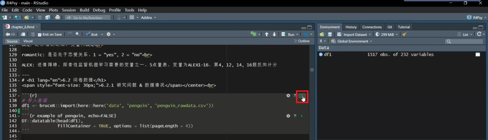
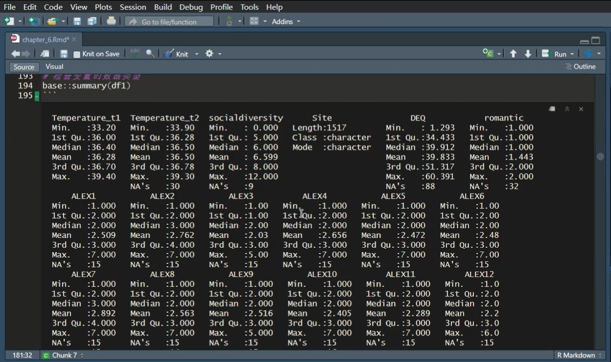
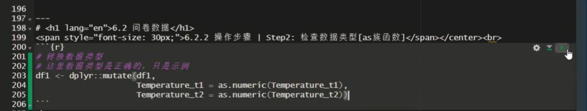
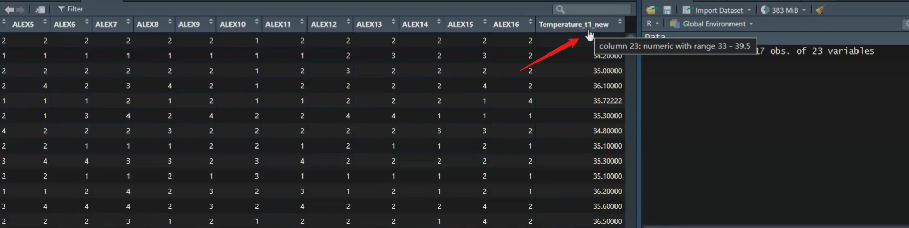
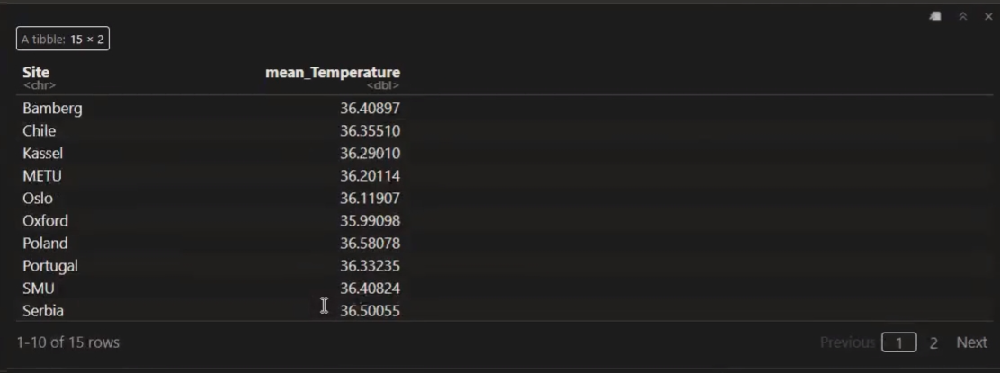
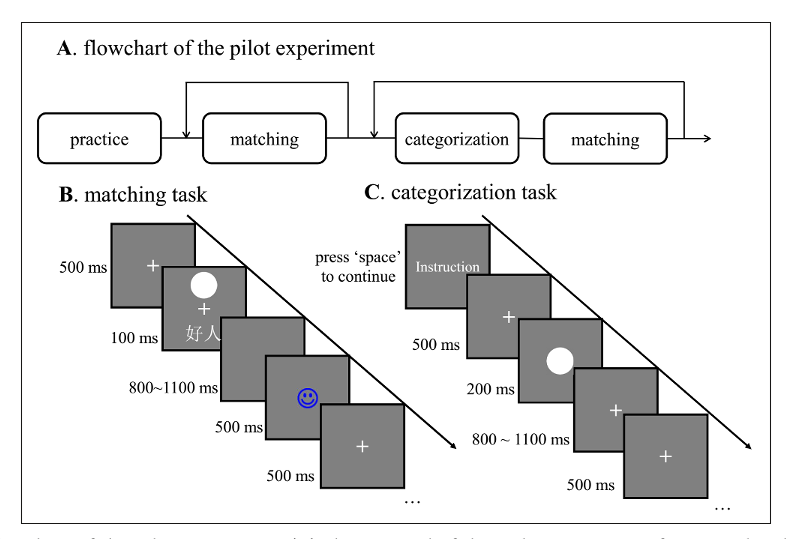

# 第六讲：数据预处理

大家晚上好，我们开始上课。在上节课，我们基本上介绍了如何将数据导入，以及导入后的一些基础知识。从纯粹的数据分析角度来看，主要是读取数据，然后查看数据的基本类型，这两节课的内容都是相对简单的，对吧？了解了这些基础知识之后，我们才能进行后续我们想要做的很多内容。
那么，今天我们将讲解一个非常重要的内容，就是数据的预处理。

这节课的内容相对较多，希望大家能够及时更新最新的课件，从`GitHub`上下载下来。我们将会进行一些代码演示。
首先，我们需要理解，数据在进入统计分析之前，必须经过一系列的处理，以使其成为较为干净的数据。在心理学领域，以前进行数据分析时，我们常常需要手动在Excel中进行数据清理，清理完毕后，再导入到SPSS进行后续的统计分析。
而当我们使用R语言时，从数据的最原始状态到清理的每一个步骤，我们都可以通过代码记录下来，这有助于提高分析的可重复性。这就是我们所说的数据预处理。
另一个关于数据预处理的重要知识点是，在数据分析过程中，可能超过60%的时间都花在了数据预处理上，而纯粹进行统计分析的时间相对较少。其是当数据量较大时，用于预处理的时间会更长。对于心理学领域来说，可能并不像听起来那么吓人，因为我们的原始数据通常相对容易清理。

## **Tidyverse**

那么，在这一课中，我们将主要讲解三个方面的内容。首先，我们会介绍`Tidyverse`这个生态。当然，我们只会介绍一些最基本的知识，尤其是我们常用到的一些知识。在对`Tidyverse`进行介绍之后，我们将以两个问卷数据的分析作为实例进行演示。这在心理学以及可能的社会学研究中，也是一个经常遇到的情况。

首先，`Tidyverse`是一个生态系统，它基本上就是帮助我们进行数据处理的。在上节课，我们学习了如何导入数据，`Tidyverse`中也有一个包，专门用于读取数据。当你将数据读取到R中后，接下来就需要进行一系列操作，包括数据的转换、选择，然后将其整理成一个较为干净的数据框。此外，还包括对数据的整理和串行的操作等。Tidyverse中的各个包都是为了适应各种各样的预处理需求。
对于那些需要处理大量数据的情况，你可能需要重复执行相同的步骤多次。Tidyverse中的`purrr`包可以帮你进行批量处理。最后，你还可以通过`ggplot2`进行可视化。关于可视化，我们会在后续的课程中单独讲解。


今天我们要讲的核心内容就是数据的预处理。
当然，我们所说的`Tidyverse`是目前比较流行或者说最流行的整个生态系统。但这并不意味着我们直接使用`base R`就无法完成所有这些功能。理论上，你也可以通过`base R`完成所有这些功能。但我们之前一直强调的理念是，当我们作为心理学的研究生使用R时，最重要的是解决问题。现在已经有这么多人开发出了这么多好用的工具，我们就可以用它们来帮助我们解决问题。在解决问题的过程中，如果你对它们的原理更感兴趣，可以慢慢进行挖掘。

那么，我们可以说`Tidyverse`是一个非常成熟的一个包，也是一个系统。因此，它里面已经有很多类似的东西，我们称之为“文档”或者“手册”。它到底有哪些功能，这个在网络上应该也能找到。在这里，我们仅仅做一个展示。

**如果大家对这个话题感兴趣，可以下载课件之后，直接访问这个网址：**<https://rstudio.github.io/cheatsheets/>

那么，`Tidyverse`的优势是什么呢？

-   **优势：共享一个底层设计哲学、语法和数据结构，具有高度的一致性**

    `Tidyverse`被一些人认为是整个生态系统中非常独立的一个系统，也有人称它为“邪教”。当然，它是有一套自己的底层设计、语法和数据结构的。`Tidyverse`内部具有高度的一致性。目前的一个趋势是，很多以前不是按照`Tidyverse`的设计理念开发的包，也想将其转换为使用`Tidyverse`来重新编写或更新，这样可以让更多的人更方便地使用。它们就融入到了`Tidyverse`这个系统里面。
    如果你去搜索一下与`Tidy`相关的包，你会发现它有一个很大的生态，不仅仅是前面提到的几个包。

-   **"整洁数据(tidy)"：每行代表一个观察值，每列代表一个变量的值(再看)**

-   **函数的第一个参数总是一个数据框**

    `Tidyverse`的一个好处是，在数据清理中，它的输入通常是一个参数，即函数的第一个参数是一个数据框。也就是说，无论函数的排列顺序如何，第一个参数始终是一个数据框，作为输入对象。后面就是对这个数据框进行处理。

-   **管道操作符：连接独立代码，省去中间变量，流水线
    最常用的管道操作符为%\>%，它将一个函数的输出作为下一个函数的输入**

    另一个好处是管道操作。通过管道操作符，可以将很多中间步骤串联起来，就像流水线一样。你前面操作完了之后，然后直接通过管道操作符送到下一个操作的环节，然后作为输入，经过下一个处理之后，再直接进入下一个处理。这样的话，你的整个流程不管有多么复杂，只要你能够通过管道把它写下来，最后就只有一个输入和一个输出。你的整个代码，包括你的结果，你的环境（Rstudio环境），都会非常干净。

**我们这里举了一个例子：**

比如你需要对一个数据进行筛选，然后再进行排序。一般来说，传统的思路是先有一个中间变量，对数据进行筛选后，将其保存为中间变量，然后再对这个保存的变量进行排序，排序完成后，再保存为另一个新的变量。这样的话，实际上中间就产生了多个中间变量。这样就会占用我们的内存。

假设需找到data中age大于30的所有行，并排序，代码如下:

``` r
filtered_data <- filter(data,age>30)
filtered_sorted_data <- arrange(filtered_data,age)
```

如果我们使用管道操作的话，它就是直接以这个`data`作为输入，经过`filter`之后，然后再经过`arrange`排序之后，它会返回到这个`filtered_sorted_data`。这样的话，我们就省掉了一些中间的步骤。如果你的中间步骤非常长的话，那你省掉的中间变量就非常多。这样的话，你的代码就不会占用过多的内存，也会很整洁。

使用管道操作符后，代码变为：

``` r
filtered_sorted_data <- data %>%
filter(age >30) %>%
arrange(age)
```

以下是查看变量名的结果：

大家可能现在还没有这个感受，使用过后慢慢会感受到。接下来，我们会在例子中展示给大家看。

**Tidyverse常见的管道符如表所示(依赖于magrittr包):**


在`Tidyverse`中，管道操作符有多个，但我们通常使用最多的是第一个，即`%>%`。这个操作符的中间部分是`>`，最后是`%`。一般来说，它是向右操作的，将左边的数据传递到右边。然后你可以反过来，将右边的数据传递到左边，但这种用法比较少见。还有一个复合赋值操作符`%<>%`，我们也不常用。

一般来说，大家最常使用的是`%>%`这个管道操作符。另外，值得一提的是，在R
4.1版本之后，R语言原生提供了一个管道操作符`|>`。例如，在`base`包中，它自带了这样的工具，不需要再使用`Tidyverse`中的工具包来实现这个功能。
这就是关于`Tidyverse`的基本介绍。如果大家对这个感兴趣，可以在课后进一步了解。

## 问卷数据

### 研究问题&数据情况

-   **研究问题:**
    社交复杂度(CSI)是否影响核心体温(CBT)，特别是在离赤道比较远的
    (低温)地区(DEQ)下

这节课的重点是教授如何使用`Tidyverse`进行数据预处理。我们之前提到，学习数据处理是为了解决研究问题。我们今天的研究问题采用了IJzerman等人在2018年的研究，我们要对这一心理学研究进行重复分析。本课程接下来会以重复IJzerman
et al (2018)的分析进行问卷数据分析的示例。

下面是简要介绍：

该研究由IJzerman进行，是一个典型的心理学研究问题，涉及较大的数据量。2015年，IJzerman在Frontier上发表了一篇论文，提出了一个理论，他们认为在哺乳动物群体中，核心温度非常重要。因为恒温动物对温度有苛刻的生存条件，当温度过低或过高时，动物就会受到影响。人类也是如此。在野外环境中，动物如何调节自己的体温是一个问题。对于人类的祖先来说，可能也采用类似的方式来调节体温。研究发现，多个动物在一起时，保持相同核心温度所需的能量比一个动物保持相同体温所需的能量要低得多。因此，动物可以通过相互聚集形成群体来调节体温。人类在漫长的进化历史中可能也是这样。现在我们有了很多外部条件来帮助我们调节体温，如空调。在进化过程中，通过社交交往调节体温的机制是否会在人类身上留下一点点痕迹？这就是IJzerman的一个理论。他们认为，我们可以找到这种痕迹的，这种痕迹可以通过研究社交关系和身体核心温度之间的关系来找到。因此，他们的研究问题是：社交关系是否会影响核心温度，特别是在离赤道较远的低温地区？因为在温度较低的地方，可能更需要调节体温。在高温的地方，可能不需要体温调节。

-   **研究假设:**
    对于在低温环境中的人来说，(在众多的变量中)社交网络复杂度能够影响个体的核心体温。这一效应受个体的恋爱状态(romantic)调节。

因此，他们的研究假设是，在较冷的地区，社交网络的某些变量是否与我们的核心温度密切相关，并且这种效应是否受到亲密关系状态的影响。

-   **研究方法:** 路径模型，探索性监督机器学习

该研究采用了路径模型来检验这些调节作用，并通过有监督的机器学习方法来探索不同变量之间是否存在关系。


这是他们主要的研究结果。如果大家感兴趣，可以进一步查阅相关资料。这里展示的是一个中介分析的图形。

另一个目的是判断CSI和其他变量与身体温度之间是否存在关联。


左边的图形实际上是用众多问卷数据来预测核心身体温度，即所谓的core body
temperature。右边则是用身体温度来预测其他变量。我们主要关注的是左边的数据，如果大家能够看到的话，在这个地方有一个CSI，这表明社交关系网络的复杂度是一个重要的预测身体核心温度的变量。当然，还有一些其他非心理因素的变量，比如所在站点的最低温度，即与赤道的距离等，对核心温度的预测作用更强。

从心理变量的角度来看，研究发现身体的社会关系复杂度确实是一个重要变量。这与很多同学可能想要进行的研究具有相似之处，即探索不同变量之间的关系，并建立中介或路径模型，更广泛地说，就是结构方程模型。对于这类数据，我们肯定需要进行大量的问卷调查数据收集。

在这个数据库中，我们实际上有很多数据，包括身体温度，这个是通过测量口腔温度来进行的，还有一些生理条件信息，比如用药情况等，以及基本信息，如人口学信息，包括出生年份、性别、性取向等。有些变量可能需要向数据拥有者那样申请ID后才能使用，有些则是完全开放的。我们使用的是完全开放的数据，包括当地的地址和信息、社交网络信息，以及一些常见的心理学变量。

那么，当时为什么他做了这么多的问卷调查呢？因为他也不确定社交网络信息是否真的能够预测核心体温。因此，他尽可能地纳入了更多的变量，这种做法与我们很多探索性研究的高度一致。那么，如果我们这节课要处理这些数据，进行类似于他的分析，我们可能需要提取数据中相关的信息，并对一些问卷数据进行预处理。
例如，每个问卷都可能测量了某一维度的得分，我们需要计算这些维度的因子得分。这可能包括进行反向计分、计算因子得分，或者使用更简单的方法，如直接计算平均分或总分作为问卷得分。这意味着我们需要对问卷进行一些处理。接下来，我们将看一下如何使用Tidyverse来处理这些数据。

**数据情况(Hu et al., 2019):**

通过data/penguin文件夹下的penguin_full_codebook可以查看详细情况


首先，我们需要读取数据。和上节课一样，我们直接使用`bruceR::import`函数来读取数据，这是目前我们最推荐的读取数据的方法。

```{r}
# 导入数据
df1 <- bruceR::import(here::here('data', 'penguin', 'penguin_rawdata.csv'))
```

下面是被读取的数据文件：


读取数据之后，我们可以使用`View`函数查看数据结构，包括站点、年龄等各种变量。我们还可以用`colnames`查看变量，因为可能需要选择一些我们认为比较重要的变量，比如有一些我们可能不需要的变量，就可以直接将其筛选掉。

``` {r}
#查看变量名（列名）
colnames(df1) 
```

另外，当我们需要进行问卷得分的计算时，我们可能需要选择与特定问卷相关的条目，然后对其进行预处理，以得到问卷得分。因此，我们必须要了解数据的当前结构，例如每个列的名称。我们得到的数据是比较干净的，每个名字基本上都可以反映出其大致信息，例如`scontrol1`、`scontrol2`等代表自我控制问卷的各个条目。这里的命名本身就是比较规范的。如果数据的列名不是这么清晰，可能还需要进行额外的处理步骤，比如重新命名问卷等。我们就不再一一赘述了。

那么，我们在这里的主要目标是什么，假设我们选择这几个变量，作为数据预处理的练习，我们把身体温度选出来，然后求一个平均的温度。

**●研究核心变量:**

1.  CBT: 核心体温，测量两次，变量为Temperature_t1, Temperature_t2

2.  CSI: 变量为social diversity

3.  Site: 数据源站点

4.  DEQ: 距赤道的距离，变量为DEQ

5.  romantic: 是否处于恋爱关系，1="yes", 2 = "no"

6.  ALEX: 述情障碍，探索性监督机器学习需要的变量之一，5点量表，变量为
    ALEX1-16，第4,12,14,16题反向计分

根据上述信息，我们需要计算一个关键变量，即“social diversity
”，它是文章中最核心的变量之一。同时，我们也将保留全球不同站点的信息(Site:
数据源站点
)，以便观察各地信息是否存在差异。另一个重要信息是距离赤道的距离，我们称之为“distance
from equate”。此外，我们还需要记录参与者是否处于恋爱关系。

接下来，我们将从所有问卷中挑选出一个进行预处理，其他问卷的预处理可以依照相同规则进行。我们选出的问卷是关于“述情障碍”的，它旨在评估个体是否能够意识到并表达自己的情绪。这个量表在数据收集时已被纳入。


需要注意的是，量表中有些题目是反向计分的，在预处理时，我们必须将这些题目的得分反过来。这样，在计算总分时，我们可以直接通过相加的方式得到。

因此，我们的第一步是选择需要预处理的变量。第二步是检查这些数据类型是否符合我们的预期，并纠正任何偏差。然后，对于缺失值，我们可能需要决定是否删除或采取其他处理方式。在这里，我们可能会采取较为直接的方法，即直接删除缺失值。之后，我们将进行必要的运算，例如，选出与“述情障碍”量表相关的所有条目得分后，计算量表的总分。最后，如果我们对某个分组变量感兴趣，比如不同站点，我们可以通过分组的方式来快速计算一些统计量，例如均值、标准差等，以便快速掌握数据的一些基本信息。

好的，这就是我们现在给大家演示的几个数据预处理步骤。但大家可以看到，在不同的数据分析项目中，我们可能需要执行的步骤是不一样的，或者可能需要组合各种不同的步骤。总的来说，这里的几个步骤提供了一个基本框架。当大家实际进行数据处理时，可能需要根据自己的具体需求进行灵活的选择。
这里的好处在于，我们把步骤列出来，大家可以清晰地看到，在进行数据预处理时，我们首先需要明确我们的目标是什么，以及我们将采取哪些步骤来实现这些目标。这一点非常重要。如果我们不能清晰地思考这些步骤，那么我们就无法将它们转换成代码，也无法完成数据预处理。因此，在进行数据预处理时，最好是能够先明确你的目标是什么，你的第一步要做什么，第二步、第三步要做什么，你一定要把这些步骤思考得非常清楚。
当然，你可以边思考边尝试，尝试之后如果发现结果不符合预期，那么你就需要回头去修改你的步骤。但最终，你想要做好数据预处理，这些步骤肯定是需要清晰的。

好的，接下来我们将使用 `Tidyverse` 来对数据进行处理。首先，我们需要加载
`Tidyverse` 包。

```{r, message=FALSE,warning=FALSE}
# 不要忘记加载包 
library(tidyverse)
## Warning:程辑包'tidyverse'是用R版本4.3.3来建造的
```

第一步我们已经提到过，就是选择变量。我们只选择与我们感兴趣的变量相关的部分，这里我们选择的是
Temperature_t1,Temperature_t2（两次测量的温度）、social
diversity这个变量、site、DQ、romantic，以及ALEX1-16，这些代表述情障碍量表的条目。

在处理具有相同命名规则的数据或列名时，我们可以使用一个快速的方法，我们不需要把ALX1、ALX2、ALX3...一直到ALX16都写出来，我们只需要使用冒号来选择一个范围内的所有列，例如
"ALX1:ALX16"，这样 R 语言会自动为我们补全这个范围内的所有列名。

下面是在R中的代码：

```{r}
# 加载包后函数前不需要注明包，此处只是为了提示函数属于哪个包 
# 选择我们需要的变量：Temperature_t1, Temperature_t2, SNI28-32, DEQ, romantic, ALEX1-16 
df1 <- dplyr::select(df1,
                     Temperature_t1,Temperature_t2,
                     socialdiversity,
                     Site, DEQ,
                     romantic,
                     ALEX1:ALEX16)
```

-   **select()函数会按照提供的参数顺序选择列**

    在我们使用的函数中，第一个参数通常是数据框(data
    frame)，在这里我们已经将其读入并命名为 Beta
    frame。我们将使用的函数是 `Tidyverse` 中的一个包，叫做
    `dplyr`，这是进行数据处理时最常用的包之一。我们用的是它里面的
    `select` 函数，这个函数的使用非常直观，基本上可以理解为自然语言。

-   **可以使用列名、范围（例如
    starts_with()、ends_with()、contains()、matches() 等），或者使用
    everything() 来选择所有列**

    在这个函数中，我们首先指定要从哪个数据框中选择，然后列出我们要选择的列名。在选择列时，我们可以使用列名，也可以使用其他方式来指定列名，比如列名的开头、结尾、包含的特定字符，或者是匹配模式。此外，我们还可以使用列的位置编号（1、2、3、4、5、6、7、8、9）来筛选，但这种方法不太常见，因为我们通常更关注列的名字，而不是它们的编号，尤其是当列的数量很多时，很难记住每个列的编号。

-   **注意需要将函数结果赋值给一个新的变量/原始变量完成保存**

    需要注意的是，如果我们只写了`dplyr::select`
    函数的后面部分，比如我们选中了`DRR select`，但没有将其结果赋值到一个新的变量中，那么这个选择操作虽然完成了，但没有被保存。在我们这里的例子中，我们选择完变量后将它们保存到了一个新的变量
    `df1` 中，这样我们就把选择的结果存储到了 `df1`
    这个变量名下。这时，数据框 `df1`
    的内容就发生了变化，它不再包含之前那么多的列。

另外，我们可以直接使用 `summary` 函数来查看 `df1`的结果，这个函数可以帮助我们快速查看每个变量的基本情况，比如最小值、最大值等。
`summary` 函数是 R 语言基础包中的一个函数，我们通过它可以快速检查数据的一些基本统计特征。例如，我们在`summary` 函数的结果中发现 temperature 的最大值是1,000，我们立刻就能识别出这是一个异常值，因为人体的核心温度不可能达到这么高。此外，`summary`函数还会告诉我们每个变量有多少个缺失值(NA)，这样我们可以快速了解数据的质量。

如果我们发现某些数据类型不正确，比如我们希望某个变量是数值型(numeric)，但它实际上被读取为字符型(character)，我们就需要进行数据类型的转换。上节课我们讲过，数据类型转换时我们使用
`as.numeric` 函数，将字符型数据转换为数值型。

在进行数据类型转换时，我们需要使用另一个在数据处理中常用的函数，即
`mutate` 函数。

```{r}
# 转换数据类型 
# 这里数据类型是正确的，只是示例 
df1 <- dplyr::mutate(df1,
                     Temperature_t1_new = as.numeric(Temperature_t1),                                   Temperature_t2 = as.numeric(Temperature_t2))
```

-   **`mutate()`函数常用于创建新的变量或修改现有变量**

    在 `mutate`
    函数中，我们首先指定数据框，然后进行所需的操作。例如，我们可以将
    temperature_t1 变量通过 `as.numeric`
    函数转换为数值型，然后再将转换后的数据复制回原来的列中。这样，整个数据框的列名保持不变，但数据类型已经发生了变化。

-   **存在多种变式，如`mutate_at()`通过列名、位置或者列的类型进行选择，`mutate_if()`对数据框中满足条件的列应用指定的函数**

    那么，`mutate`函数我们可以理解为是一个函数家族，它包含了一系列类似的函数。例如，`mutate_at`函数允许我们通过指定的列名进行有选择性的变换，而`mutate_if`函数则是通过条件来决定是否进行变换。在`mutate`函数的内部，我们可以使用各种函数来对数据进行操作。比如，我们在这里将`temperature_t1`变量通过`as.numeric`函数转换为数值型，这个`as.numeric`就是我们在这个函数内部，在变换的时候所使用的一个函数。

-   **`mutate()`内使用函数时，同样需要注意缺失值的问题**

    在这个时候，我们需要注意的是，原始函数中的一些注意事项在我们使用`mutate`的时候仍然适用。例如，通常在求均值或者进行其他计算时，如果遇到缺失值，函数可能无法处理，或者处理结果会与预期不同。因此，在使用`mutate`时，如果内部使用的函数遇到缺失值，它仍然可能无法处理，可能会报错，或者得到的结果不符合预期。所以，所有在`mutate`内部使用的函数，我们都必须特别注意它们对缺失值的处理方式。

-   **注意`mutate()`进行转换之后需要进行核查：是否符合预期**

    还有一个重要的注意事项是，在完成数据类型转换之后，需要进行检查，以确保数据已经转换成了你期望的样子。有时候，即使没有报错，转换的结果也可能并不是你所预期的。在这种情况下，你可以检查数据，以确定哪个地方出了问题。

-   **注意需要将函数结果赋值给一个新的变量/原始变量完成保存**

    同样，如果我们只进行了转换操作，而没有将结果赋值到一个新的变量中，那么这个操作虽然完成了，但结果并没有被保存下来。您可以看到，在这里我们直接将转换后的结果赋值到了原来的变量名中，这样就替换了原来的变量。我们这里没有保存中间变量，但通常来说，我们可能会将结果保存到一个新的变量中，例如
    `df_new`，以保留中间结果。在我们上面的例子中，还没有这样做。

稍等一下，我还是操作一下，不然就只是纯讲代码了。

这是我们第六课的notebook，我们可以从这里开始，从导入数据开始。



在这个notebook里面，右上角有一个绿色的小三角形，你点击一下，它就会运行整个代码框。

大家可以看到，这里的三个间号(...)加上一个r，这里表示代码框的起始点，下面再跟三个间号(...)表示代码框的终点。这样它只会运行这里的R代码，而且一定要加上r，表示这是R代码。
我们导入数据之后，这里有一个`df1`，它有1,517行、232列，这里叫做variables。我们可以查看一下它的情况。


我们前面说在studio里面有可能显示不全，在课件里面也可能显示不全。但在这里，它会显示得非常全，我们可以拖着看，它有两页。我们也可以去查看它的列名，在这里我们可以非常全地看到它的列名。**(前面的...需要再确认，每个代码都需要加上)**

```{r}
# 查看变量名(列名)
colnames(df1)
```

然后加入`Tidyverse`的包。

```{r, message=FALSE}
# 不要忘记加载包
library(tidyverse)
```

好的，这里就是我们第一步。


然后我们运行`dplyr::select`选择需要变量。

大家可以看到，我们刚才在数据集中有232个变量。通过选择之后，因为我们没有保存中间变量，所以这里只保留了我们所选择的22个变量。这意味着其他200多个变量已经被直接丢弃了。当然，在R中这并不是一个大问题。只要我们没有从原始数据中删除这些变量，我们就可以重新读取数据，继续处理那些被排除在外的变量。在R中，数据的处理是灵活的，我们可以根据需要随时对数据集进行操作和变换。

然后我们可以在这一步使用`summary`函数来查看数据集的概要。



虽然在课件里面我们可能没有看到完整的概要信息，但在这里我们可以看到每个变量都会有一个对应的概要输出。
通过运行`summary`函数，我们可以快速了解每个变量的基本统计信息，如变量的数量、缺失值的数量、变量的最小值、最大值、中位数等。这对于初步的数据探索和异常值检查非常有帮助。

然后，关于`mutate`函数，我们可以看到，由于这里的数据原本就是正确的，例如，它能够给出均值，这表明它原本就是数值型的(numeric)。而对于站点(site)来说，大家可以看到它是字符型的(character)。在这里，我们还是可以进行一些示例操作，比如将某些变量转换为数值型。



我们在这里直接添加了一个new，这是作为一个示例，表示我们正在生成一个新的变量。


我们刚刚提到，`mutate`函数不仅可以修改原始变量，还可以生成新的变量。我们可以通过这种方式来修改数据。

那么，`mutate`函数不仅能够修改原始变量，也可以生成新的变量。



在这里，我们添加了一个new，表示我们正在创建一个新的变量。因此，即使我们没有保存中间变量，我们仍然可以生成新的变量。

对于处理缺失值的问题，例如，有些地方确实存在缺失值。由于有缺失值，我们需要将其删除。

```{r}
# 按照Temperature, DEQ处理缺失值
df1 <- filter(df1, !is.na(Temperature_t1)
              & !is.na(Temperature_t2) & !is.na(DEQ))
```

-   `filter()`函数用于从数据框中筛选行（观测值），可以通过逻辑运算符组合多个条件

    在这里，我们可以使用`filter`函数来进行行过滤。`filter`函数与`select`函数不同，`select`函数是选择列，而`filter`函数是选择行。在这个函数中，我们是通过逻辑判断来筛选行，例如，对于某个变量，我们只保留那些不是缺失值(NA)的行。
    例如，对于`temperature_t1`，我们想要保留所有第一次测量温度时不是缺失值的行。我们使用`!is.na()`函数来进行逻辑判断，其中`!`表示逻辑上的"非"，即不是缺失值。通过这样的处理，我们可以筛选出符合特定条件的行，以便进行进一步的数据分析。

-   **运算逻辑：遍历每一行，将给定的条件应用于该行，条件为真则保留，保留的行被组成一个新的数据框作为函数的返回值**

    我们得到了一个与我们的`temperature_t1`列函数长度相同的新向量。这个新向量中全是"true"和"false"。例如，如果它是第一个值，它是有数值的，那么这个时候它就不是NA，所以它就是"true"。然后以此类推，一直到1,517行，它都会进行一次判断，形成一个向量，这个向量里面全都是"true"和"false"。我们之前说过，实际上我们也可以通过"true"和"false"来进行选择。选择时，它会自动保留那些"true"的行，把那些"false"的行去掉。

    这里的"filter"其实就是这个作用，但我们这里的筛选条件可能不止一个。我们需要不仅仅第一次的体温测量是有数值的，第二次的也需要有，而且我们还需要有地区的，跟赤道的距离的一个数据。实际上，我们是把三个逻辑的条件进行的一个用"and"(且)的关系连接起来。相当于是我们每一个逻辑判断都会得到一个新向量，得到一个适合去和"false"进行比较的一个向量。三个项通过"and"(且)的关系连起来之后，就是说三个都是等于"false"的时候，那么这一行它才是"false"。如果三个判断当中有一个是"false"的话，那么它最终的这个逻辑判断结果就是"false"。
    所以，通过这种方式，我们就得到了一个非常符合我们条件的一个向量。它是一个"true"和"false"的向量。然后，我们通过`filter`这个函数，对我们的数据框`df1`进行一个筛选。

-   **注意需要将函数结果赋值给一个新的变量/原始变量完成保存**

    同样，我们筛选完了之后，我们要把它保存起来。

    大家可以看到，我们现在的`df1`有1,517行。如果我只运行后面这个，大家可以看到我选中了`filter`后面的这些代码，然后用Ctrl加Enter的话，那么它只是把这个结果打到了我们下面这个输出这个地方。

    

    大家可以看到，它这里显示叫做description，然后`df1`是1,517行乘以23。也就是说，实际上如果我们只运行这个`filter`这个函数本身的话，它就给我们一个输出，但是它没有把它复制到任何一个变量。因为我们只运行后面一半，所以它没有把它复制到`df1`。所以`df1`这里还是1517行。大家注意到这个区别。

-   所以，我们一定要把它整个运行一下，就是从`df1`然后加上赋值符号，一直到最后。然后我们这样运行的话，就把它赋值到`df1`。

    

    大家可以看到，这个时候刚才的是1,517，现在就变成了1,427，也就是它筛掉了一些有缺失值的数据。OK，那么我们就筛选出来了我们想要的数据，而且我们也选择出了我们想要的变量。那么接下来的话，我们就可以进行一些运算了。那么运算的过程中，其实我们就是要生成一个新的一个变量。

例如，如果我们想要计算`temperature_t1`和`temperature_t2`的均值，那么这个时候我们实际上是对每个个体的这两列进行均值计算，而不是对`temperature_t1`的所有个体求均值。这两个操作是不一样的：一个是每个个体有两列数据，我们以"行"为单位进行求均值；另一个是求`temperature_t1这`列的均值。一般来说，我们的数据框是以"行"为单位的，所以我们需要用某个变量来以"行"为单位进行求均值。

```{r}
# 计算每个被试两次核心温度的均值，保存为Temperature 
df1 <- dplyr::mutate(df1,
                     Temperature = rowMeans(select(df1, starts_with("Temperature"))))
```

-   `mean()`函数用于计算向量或数组的平均值，`colMeans()`函数用于计算矩阵或数据框的每一列的平均值，`rowMeans()`函数用于计算矩阵或数据框的每一行的平均值
-   数据类型需为numeric
-   `starts_with()`用于在数据框中选择列名以特定字符串开头的列

在这个函数中，我们又有一个函数嵌套了一个函数，即select函数。select函数是我们前面讲过的，用于选择哪些列作为输入来求均值。我们通过这个选择，选择出了以temperature开头的这些变量，这里只有两个变量，即`temperature_t1`和`temperature_t2`。然后，我们来求`rowMeans`，即以"行"为单位来求均值。求完了之后，得到了一个向量，我们把这个向量赋值到一个叫做Temperature的新变量里面。然后，这样的话他就得到了一个新的变量。我们可以演示一下。

这个就是两次temperature的一个均值Temperature，右边也对应地多了一个变量。


```{r}
# 将4, 12, 14, 16题反向计分，计算ALEX，保存为ALEX 
df1 <- mutate(df1,
              ALEX4 = case_when(
                TRUE ~ 6 - ALEX4# 反向计分：6减去原始值
                ),
              ALEX12 = case_when(TRUE ~ 6 - ALEX12),
              ALEX14 = case_when(TRUE ~ 6 - ALEX14),
              ALEX16 = case_when(TRUE ~ 6 - ALEX16)
              )
#也可以写成 case_when(ALEX4 == '1' ~ '5',ALEX4 == '2' ~ '4', ALEX4 == '3' ~ '3', ALEX4 == '4' ~ '2', ALEX4 == '5' ~ '1',TRUE ~ as.character(ALEX4))
```

-   `case_when()`函数是一个强大的条件判断函数，通常用于根据不同的条件生成新的变量或对现有变量进行转换
-   运算逻辑：逐行评估每个条件，并根据条件的结果来确定新值，若条件为真，则用‘\~’后的值替换原始值
-   有多个条件时，按照条件的顺序逐个进行判断，一旦有条件满足，则返回对应的值并停止继续判断其他条件
-   使用 `TRUE ~` 或者
    `TRUE ~ NA`处理未匹配到任何条件的情况，这样可以确保即使所有条件都不满足时，函数也会返回一个默认值，避免产生错误

接下来，我们在下一步可能会使用的一个常见操作就是进行反向计分。反向计分有多种方式，我们在这里介绍的是一个比较通用的方法，称为`case_when()`。首先，我们可能都是在`mutate`函数里面进行操作的，因为我们要修改原来的变量。所以，我们会在`mutate`里面进行操作。然后，我们使用例如`ALEX`的12、14和16这几个条目进行反向计分。这个时候有几种方式都可以，比如我们这里使用`case_when()`。
在`case_when()`函数中，我们首先设定条件判断，对于每一页的数据，只要有这个数值存在，我们就通过减去原始分数的方式来反向计分。这个条件判断函数可以对很多条件进行判断，然后用波浪号(`~`)来表示如果符合这个条件，我们就执行波浪号后面的操作。大家可以看到，我们这个地方直接就是用`TRUE ~ 6`，`TRUE`表示我们对于这一点，我们都要做后面的操作，即用这个反向计分的方式。

我们可以看一下转换之后的结果。例如，原来的2分通过反向计分后变成了4分，原来的1分变成了5分。这是心理学中常用的反向计分方法。


对于`case_when`，实际上也可以采用其他条件，比如对年龄进行操作，如果年龄小于18岁，就将其修改为`"Child"`；如果年龄在18岁到65岁之间，就修改为`"Adult"`；如果年龄大于65岁，就改为`"Senior"`。这样也是可以的。

``` r
# age为num 
case_when(
  age < 18 ~ "Child",
  age >= 18 & age < 65 ~ "Adult",
  age >= 65 ~ "Senior" 
  )
# age为chr
case_when(
  age < "18" ~ "Child",
  age >= "18" & age < "65" ~ "Adult",
  age >= "65" ~ "Senior"
  )
```

大家还记得我们在上节课讲解数据操作时所做的逻辑判断吗？实际上，在很多情况下我们都可以使用这种逻辑判断。因此，我们可以认为`case_when()`是一个通用的数据操作方式。另外一个通用的方法就是`ifelse()`。当然，我们在上节课讲到的那个条件判断`if (condition) { do_this; } else { do_that; }`，在`mutate`函数里面也有类似的用法，就是将`if`和`else`连在一起写。
在`mutate`函数中，第一个参数是条件，第二个参数是条件为真时要执行的操作，第三个参数是条件为假时要执行的操作。如果我没有记错的话，它应该是`ifelse(condition, do_this, do_that)`。这里，第一个和第二个参数是条件，然后第三个参数是当条件为真时要执行的操作，第四个参数是当条件为假时要执行的操作。
大家可以看到，`ifelse()`也是一种常用的数据转换方式，用于对符合条件的数据进行转换。但是，如果我们需要判断多个条件，我们就要写很长的一串条件判断语句，就像是一串钥匙。在这种情况下，`case_when()`就是一个更好的选择，因为它允许我们更清晰地定义多个条件，并针对每个条件指定不同的操作。

-   另外，如果我们想要进行反向计分，实际上我们也可以通过这个`bruceR`来实现。

```{r, eval=FALSE}
# 创建一个包含需要反向计分的变量的列表
vars_to_reverse <- c("ALEX4", "ALEX12", "ALEX14", "ALEX16")
# 对列表中的变量进行反向计分 
df1$ALEX <- bruceR::SUM(df1,
                        varrange = "ALEX1:ALEX16",
                        rev = vars_to_reverse,
                        likert = 1:5)
```

因为之前提到过`bruceR`是专门针对心理学的一个软件包，在`bruceR`这个软件包中，它实际上有自己的更符合我们思维方式的反向计分方式。所以，如果有哪些需要进行反向计分，我们直接在求问卷总分的时候就可以有一个`rev()`的操作`rev = vars_to_reverse`，我们知道我们的变量名是从`ALEX1`到`ALEX16`，那么在求总分的时候，我们就可以直接把这些需要反向计分的分数写到这里，同时也可以把这个分数范围记录方式也算上:`likert = 1:5`，它就可以自己帮你完全操作。也就是说，你甚至不需要先把它反向计分，然后再求和，而是只要告诉`broomR`，在求总分的时候你需要哪些条目进行反向计分就可以了。这种方式比较符合我们心理学这个思维方式。

但实际上我们自己要算的就是第一步，就是通过`case_when()`或者其他的方式，或者以`filter()`等方式，去把这个条目的分数反过来，然后是1-5分，我们反向基本就是6减去这个原始的分数，然后我们再去求这个总分。那么我们求总分和跟之前实际上是一样的，就是用`summarise()`。然后再加上选择以`ALEX`开头的这些所有的行。


然后我们最后一个操作，比如我们想要进行这个分组的比较或者是分组的查看，比如我们想看在这个数据里面不同的站点，他们的平均分数是否有所区别，那么我们就可以，比如以站点作为分组的一个条件，首先把数据框分成不同的组，然后在不同的组里面，我们就求这个描述性的数据。

```{r}
# 按Site计算Temperature的平均值
df1 <- dplyr::group_by(df1, Site)
df2 <- dplyr::summarise(df1, mean_Temperature = mean(Temperature), n = n())
df1 <- dplyr::ungroup(df1)
```

-   `group_by()`函数将数据框按照指定的分组变量进行分组，然后可以对每个分组进行单独的操作，如汇总、计算统计量等。

    这里会涉及到几个函数，第一个就是分组，我们把这个数据框按照某个变量进行分组，那么也就是说这个站点里面它有几个独特的值，我们就把它分成几个组。然后这个site里面我们应该是有12个还是15个独特的值，比如有一个中国的站点，有一个英国的站点，有一个德国站点。那么我们就会按照这个站点的名字把它分成不同的组。

-   在完成分组操作后，建议使用`ungroup()`函数取消数据框的分组状态

-   `summarise()`函数用于对数据框进行汇总操作，常与`group_by()`连用

    然后第二个就是`summarise()`，就是说我们去求这个数据框里面的做一些运算，然后把它运算完了之后，返回成一个列。然后我们这里就是把这个两次体温测量的均值按照站点做一个求平均。因为我们前面有一个分组，所以通过这个`summarize()`之后，我们把它赋值到`df1`。那么这个时候`df1`里面，它就会自动的有一个分组的标签。那么当你做第三个`group_by()`的时候，它会自动的分组来做你要做的这个运算，也就是说，比如我们这个`size`里面有十几个`size`，它就会对每一个`size`的数据都去求这个温度的平均值。然后有15个站点，我们最后就得到15个站点和每个站点的平均体温。

-   `在summarise()`函数中，可以使用各种统计函数来计算汇总统计量，例如`n()、mean()、sum()、median()、min()、max()、sd()`等

    最后一个就是`group_by()`，就是我们用完了`group_by()`之后，即便我们求了这个`summarize()`，它这个分组标签还在里面，我们一般来说要把这个分组标签给去掉，就用`ungroup()`这个函数。如果不做这个函数的话，它后面就会一直要求保留这个分组变量在这个数据框里面，可能到后面你希望把这个分组变量不要了，但是如果你不把它去掉的话，它可能会一直保持在里面，会引起一些很奇怪的结果。所以这是分组进行一个数据描述，就是有两个主要的函数，一个是`group_by()`，第二个就是`summarize()`，我们通过`summarize()`这个函数对数据框里面进行汇总的操作。在这个汇总操作里面，有常用的这种统计的函数，比如有`n()`，因为心理学有的时候我们想要知道某个条件之下有多少个人，那么我们希望之后就是`n()`，然后就是`mean()`，`sum()`,还有`median()`，就是我们常用的一些统计量。

然后，运行一下代码没有问题。然后这个地方也是一个`case_when()`的演示。这个地方我们跳过了注册的部分，因为后面还有很多内容。那么这个地方是求Alex这个问卷得分的和，问卷得分叫做问卷得分。然后这个地方，我们可以用`bruceR`的方式来求。然后这个地方，就是我们刚才讲`group_by()`之后的一个特点。我们这里可以先看一下，在`group_by()`之前和`group_by()`之后，我们可以看一下。比如我们可以看这个地方，我们直接选中`df1`，然后它有一个description，然后我们把它分组之后重新赋予它。然后我们再查看一下，大家可以看到，这里的话，它跟之前就不太一样了。它这里有个groups，然后有个set
15，就表示它打成了一个分组的标签。如果你不用`ungroup()`的话，后面这个标签会一直在。

我们现在比如说用这个`group_by()`的值对吧，去求一个值。那么我们把这个`summarize()`之后的赋予到了一个新的一个变量，变量名叫做`def2`。我们可以看一下`def2`的话，它其实只有两个variables，第一个就是site，第二个就是main
temperature。也就是说，它这个summarize就是我先根据你的分组这个标签，每一组球运算出你要得的东西，然后呢就把它返回。就形成了一个你分组的这个变量和你要求的这个结果这个描述性统计放在一起。然后你再增加一个，比方说你n等于n。我们要求一下它的这个多少个样本。那么这个时候大家可以看到，这个时候这个table就变成了除了site以外又增加了一个变量。它不仅有main
temperature，还有一个`n`，就是我们关心的这个样本量。这个时候我们看到，每个site的样本量都是不一样的。那么这个对我们去描述数据的时候，或者是你要想把这个数据当中的一些描述性统计提取出来之后，是非常有帮助的。
那么我们也可以看一下`df2`，它会是这样的一个table。然后`df2`的话，它还是有这个group的这个标签的。那么如果我们把它`ungroup()`之后再来看的话，它这个`group`标签就应该就没有了。OK，前面我们讲的是分组。

### 操作步骤\|完整的管道操作

我们之前跟大家说过，实际上我们可以通过Tidyverse的管道操作来进行数据处理。这样的话，没有任何的中间步骤，我们就可以直接从某个数据框的输入开始，最后得到我们整个一系列处理之后的结果。通过管道进行操作，我们就可以直接把它连起来。

```{r}
# 用管道操作符合并以上代码 
# 使用管道操作符时建议先单独查看变量的数据类型，转换完毕后在进行操作 
# dplyr::glimpse(penguin_data)
df2 <- df1 %>%
dplyr::select(Temperature_t1, Temperature_t2, socialdiversity, Site, DEQ, romantic, ALEX1:ALEX16) %>%
  dplyr::filter(!is.na(Temperature_t1) & !is.na(Temperature_t2) & !is.na(DEQ)) %>%   dplyr::mutate(Temperature = rowMeans(select(., starts_with("Temperature"))),                 ALEX4 = case_when(TRUE ~ 6 - ALEX4),                                               ALEX12 = case_when(TRUE ~ 6 - ALEX12),
            ALEX14 = case_when(TRUE ~ 6 - ALEX14),
            ALEX16 = case_when(TRUE ~ 6 - ALEX16),
            ALEX = rowSums(select(., starts_with("ALEX")))) %>%
  dplyr::group_by(Site) %>%   
  dplyr::summarise(mean_Temperature = mean(Temperature)) %>%
  dplyr::ungroup()  
# 查看数据 df2
```

大家可以看到，这里有一个值得注意的地方，就是我们原始数据直接通过这个管道输入到后面这个函数周围，作为它的一个输入。那么我们第一个`argument`就是这个`dataframe`，就可以省掉了。比如说我们之前做操作的时候，跟`select()`对吧，第一个参数就是`df1`，然后后面再连我们要选的这些内容。

在这个管道里面，我们可以直接把它省略掉，也可以我们用一个点逗号来表示，用一个点来表示是管道输过来的这个变量。一般来说，如果是这样一个管道操作的话，你把它做这个函数的第一个`argument`的话，就可以省略了。就是我们尽量把前面的完全连起来，最后就直接就变成了我们想要的这个结果了。

大家可以看到，在管道操作当中的话，看起来整个数据就是比较简洁的。从输入，到整个操作，完了之后就输出。


就是我们刚才看到的这个内容。我们这里这是原来的这个代码，因为没有加上`n`，所以说还是只有这个`mean_Temperature`。



那么我们可以看一下对问题系数的这个统计。

### 小结

数据的预处理主要依赖`dplyr`包，常见函数总结如下

-   **`filter()` 选择符合某个条件的行（可能代表一个被试的数据）**

    我们常常用的函数有`filter()`，就是选择行，`select()`就是选择列

-   **`mutate()` 创建新的变量或修改现有变量**

    对变量进行操作之后生成新的变量或者是修改现有的变量

-   **`case when()` 重新编码变量**

    还有`case_when()`就是在这个`mutate()`组里面通过条件来重新编码

-   **`group_by()` 依据某些变量产生的条件，给数据分组**

    如果使用 "`group_by`", 一定要在`summarise`后使用 "`ungroup`"

    `group_by()`和`summarise()`还有`ungroup`这三个通常一起来使用，来进行分组做一些运算

-   **`summarise()` 进行某些加减乘除的运算**

-   **`ungroup()` 取消刚刚进行的分组**

-   **`select()`
    选择进行分析时需要用到的变量，同时也起到了为所有变量排序的功能**

-   **`arrange()` 某一列的值，按照某个顺序排列（其他列也会随之变动）**

还有一个常用的函数，因为我们描述了一个比较干净的数据，所以我们没有用到它，就是`rename()`，就是重新命名。你刚开始拿到的数据，可能这个列的名字你一看，哇，非常不规范。比如是S1、S2一直到SN，你觉得这个对你来说没有任何意义，你想把它修改一下，那你就可以用`rename()`这个函数。这个不难，就是操作跟我们这里的都是类似的，大家可以搜索一下。

大家如果后面想要强化一下这一小节学的内容的话，你们可以去这个上面里面做一下。

-   **练习**

1.  **分步骤使用`bruceR`计算ALEX的值，保留ALEX在30-50间的被试，按照`langfamily`进行分组，计算Temperature均值**

2.  **使用管道操作符合并上述代码**

3.  **按照`langfamily`进行分组计算DEQ, CSI的均值**

比如去算这个得分，然后保留特定得分的缺失值，然后按照`langfamily`的分组，然后计算`campage`均值，然后用管道进行操作。那么最后，你可以分组计算它的这个DEQ和CSI的均值。

**大家如果想要对这一节内容进行更加深入的掌握，最好是进行一些练习，因为要提高编程能力，没有其他的捷径，就是多写、多敲、多犯错。**

我们还有一个研究内容，那就是反应时间的数据，这也是心理学经常会碰到的问题。

## 反应时数据

### 研究问题 & 数据情况

课程将重复Hu et al.,2020作为反应时数据分析的示例

-   **研究问题:** 探究人们对自我相关刺激的优先加工是否仅在某些条件下发生

-   **研究假设:**
    无论参与何种任务，与积极概念(好我)建立联结的自我形状会在反
    应时间和准确性上表现更快更准确

我们这里简单地说，就是探讨个体是否会对自我相关的刺激进行优先加工。这是很多之前的研究都发现了的。那么我们可以探讨的是，这个优先加工是否只与特定的自我相关内容相关，而其他的虽然也跟自己相关，但可能不会被优先加工。

例如，在社会心理学中有一个概念叫做自我提升（self-enhancement），即大家都会觉得自己特别好、特别积极、特别幸运，前途一片光明。这是我们在一九八几年社会心理学中发现的一个积极的自我优势。那么在这个认知性项目中，是否也会存在这个优势呢？也就是说，跟我自己相关的信息中，有的是好的，有的是不好的，有的是我喜欢的，有的是我不喜欢的。那么跟我自己喜欢的这些信息，我才进行优先处理；跟我自己没有那么喜欢的，我可能不会那么优先处理。

我们做一个简单的实验，就是将几何图形和非常简单的出现概念进行连接。



例如，好的自己——好我，好的他人——好人、坏的自己——坏我，坏的他人——坏人等进行连接。然后，我们做一个简单的匹配任务，就是在上面呈现一个图形，下面呈现一个文字标签，然后去判断这个图形和标签是否符合你刚才学习的那种关系。我们的假设是，可能只有当这个图形和好的自己相联系的时候，我们的反应才会又快又准。这是我们的研究假设。


研究确实发现，绿色的条件代表自我的条件。大家一定要记住，good代表好的，bad代表坏的。那么，good的条件下，我们反应的时间是非常快的；而相对的，bad条件下，即坏我的时候，反应的时间就变慢了。
当然，我们主要关注的是这个数据。在其他实验中，我们也得到了一致的结论。我们主要就是关于这个matching
touch的数据。那么我们来看一下这个数据，它是保存在这个data/match中。

**数据情况：**

-   数据保存于data/match文件夹下

-   N(被试) = 44, N(files) = 44

-   形状标签匹配任务数据命名为`data_exp7_rep_match_*.out`


下面这个文件夹，我们看一下，它这里有一堆以".out"结尾的文件。对吧，它有一个基本的命名规则，就是`data_experiment_7`.然后是`rap`，然后是`match`，然后是下划线，后面就是编号。那么这里的前面部分实际上是对这个实验的一个描述。然后是`Mac`，表示matching
task，就是我们关注的匹配任务。后面这个编号就是这个被试的编号。总共有44个被试，所以有44个这样的文件。

我们主要的变量就是这个标签，就是一个图形和一个标签，他们所代表的概念以及他们之间的关系。我们关注的因变量就是被试的反应是否正确。是不是有两个，它符合原来关系的时候，被试的判断是匹配；不符合原来他学习的关系的时候，他直接就反应不匹配。
我们还有两个变量，一个是-1，表示按了6键；一个是2，表示按了两个键或者按了别的键。然后这个是属于错误的反应。然后呢，对被试的反应时间，我们比如说要把这个小于200毫秒的，比如40毫秒的都去掉，因为人的这个反应不可能小于200毫秒。

接下来，我们将查看数据，并了解其结构。

-   **主要变量：**

Shape/Label: 屏幕呈现的图形代表的概念

Match: 图形与呈现的标签是否匹配

ACC: 被试的判断是否正确，1 = "正确", 0 = "错误", -1,
2表示未按键或按了两个键的情况，属于无效作答

RT: 被试做出判断的反应时，[200,1500]的反应时纳入分析

```{r example of singal rawdata_matchtask DT, echo=FALSE}
a1 <- utils::read.table("data/match/data_exp7_rep_match_7302.out", header = TRUE) 
DT::datatable(head(a1), fillContainer = TRUE, options = list(pageLength = 4))
```

这些数据看起来是这样的，对吧？如果我们打开这些文件，我们现在需要计算自我优势效应，即在匹配效应下，好的我和好的他人之间的差异。在这种情况下，好的我和好的他人都是好的，但是我的反应速度比他人快，这表明我们对自身的信息有一个优势效应。因此，我们需要批量读取数据，但由于有44个文件，我们不可能手动输入每个文件。我们必须使用代码来提高效率。

接下来，我们需要拆分变量，了解如何对字符进行拆分，以及如何将长数据转换为宽数据。我们将稍后讨论这些操作。

### 操作步骤

数据预处理目标：计算实验条件为Match-Moral时RT的SPE。

-   **Step1: 批量读取并合并数据[for loop]**

-   Step2: 选择变量[`select`]

-   Step3: 处理缺失值[`drop_na`, `filter`]

-   Step4: 分实验条件计算变量[`group_by`, `summarise`]

-   **Step5: 拆分变量[`extract`, `filter`]**

-   **Step6: 将长数据转为宽数据[`pivot_wide`]**

-   Step7: 计算实验条件为Match-Moral时RT的自我优势效应[`mutate`,
    `select`]

最后，我们将计算差异。在这种情况下，我们可以使用`mutate`函数来进行计算。
虽然这里还有一半的内容，但很多内容都是我们之前在数据顺序中讲过的。我们将重点讲解之前未讲过的内容。

**Step1: 批量读取并合并数据[for loop]**

-   在选用读取数据的函数时要注意函数默认的分隔符（参数`sep`），如read.csv默认为",",
    read.table默认为" "

-   .out文件是以空格或制表符分隔的文本文件

``` {r}
# 查看单个被试的数据 
# 查看数据时要注意所需变量的数据类型，如果存在问题需要提前转换 
p1 <- utils::read.table("data/match/data_exp7_rep_match_7302.out", header = TRUE) 
p2 <- utils::read.table("data/match/data_exp7_rep_match_7303.out", header = TRUE)  
```

首先，我们将批量读取数据。我们刚刚提到有40个被试的数据。我们可以先读取一两个被试的数据，以查看其结构。在这里，我们将读取P1和P2。
我们使用的是`read.table`函数。为什么推荐使用这个函数呢？因为它实际上可以读取所有以`.txt`结尾的文本文件。它还可以设置分隔符，这是相当灵活的。如果我们开始尝试读取CSV文件，发现效果不理想，我们也可以使用`read.csv`。当然，你也可以使用`readxl`包，它能够自动识别文件类型。
当我们读取一个文件后，我们就可以看到它包含了日期、是否是练习或正式实验、被试编号、年龄等信息。

如果我们读取了两个文件后，我们可能想要将它们合并。通常，我们会通过行合并（`rbind`）来完成这个操作。当然，我们也可以使用`dplyr`包中的`bind_rows`函数。

```{r}
# 将两个被试的数据合并 
df3 <- base::rbind(p1, p2)  
df3 <- dplyr::bind_rows(p1, p2)
```

-   `rbind()`函数，用于合并两个或多个数据框、矩阵、数组或列表，并将它们按行连接成一个新的对象，其中的
    "r" 代表 "row"。
-   通常情况下，`rbind`会返回一个矩阵，但输入对象的特性（如列名、列属性等）也可能导致`rbind()`返回数据框。想要获得数据框最好使用`bind_rows()`函数。
-   合并数据框时，要确保被合并的数据框具有相同的列数和列名。如果列名不同，`bind_rows()`会尝试按照列名的顺序进行合并。如果无法自动匹配列名，则会产生错误。

还有一个问题，如果我们有40个被试的数据，我们不可能手动从P1到P40进行合并。这会非常累，而且`bind_rows`函数也会越写越长。我们肯定不希望以这种方式解决问题，尤其是当我们有更好的循环结构时。
`for`循环是一个很好的解决方案。它可以按照某个预设的序列重复执行某个操作。基本的语法是`for (i in 1:10) { ... }`，其中`i`在1到10的序列中依次进行迭代。

-   虽然可以通过逐个导入数据并逐个合并得到最终的数据，但这样费时费力，且代码冗余。

-   编程中常用迭代结构执行重复操作，如`for loop`。

-   `for loop`的基本语法如下：for (variable in sequence) { \#
    在这里执行循环体操作 }

```{r}
# 单个操作循环，打印i + 1
for (i in 1:10) {   
  print(i + 1)
  }
```


每次迭代时，它会将`i`加1的结果打印出来。例如，如果`i`的值是1，它会打印出2；如果`i`的值是2，它会打印出3，依此类推。
使用`for`循环，我们可以轻松地读取并合并所有的被试数据，而不需要手动操作或编写冗长的代码。

{width="464"}

所以，这就是为什么它被称为循环，因为它在一个特定的序列下进行循环。`for`循环就这么简单。我们用`i <- 1:5`，它就会打印出1到5。

```{r}
# variable in sequence   
for (i in 1:5)  
{print(i)}
```

还有其他方式，比如`i <- seq(1, 5)`，它也会打印出1到5。

```{r}
for (i in seq(1, 5))
{print(i) }
```

例如，如果你使用`Vector 12345`，它也会打印出来。

```{r}
my_vector <- c(1, 2, 3, 4, 5)
for (i in my_vector)
{print(i) }
```

对于list也是如此：

```{r}
my_list <- list(a = 1, b = 2, c = 3)
for (element in my_list)
{print(element) }
```

还有一种方式，比如我们可以对字符串进行循环，打印出字符串中的每一个字母。

关于string的循环：

```{r}
my_string <- "world" 
for (i in 1:nchar(my_string)) 
{print(substr(my_string, i, i)) }
```

这里想要展示的就是`for`循环是一个非常强大的工具，我们可以用在很多循环中，完成我们想要做的事情。
这意味着什么呢？就是`for`循环也可以与我们前面讲的条件语句结合。我们前面讲条件语句的时候，就说达到某个条件然后做什么。如果我把这个`for`循环与条件语句结合起来，这就意味着我可以根据不同条件做不同的事情。在这里，我只对`i`大于5的时候打印出`i + 1`。这意味着当`i`不大于5的时候，什么事情都不做。所以我们可以看到，它打印出来的就是6，因为`i`大于5的时候就是6、7、8、9、0，它只会打印出后面的这些数字。
我们也可以将`for`循环与前面学到的语句，甚至与函数进行各种组合，以达到我们的任务。

```{r}
# 加简单条件
for (i in 1:10){
  if (i > 5) {
    print(i + 1)
  }
} 
```

当然，刚开始的时候，你可以去模仿或者做一些简单的事情。等你熟练之后，你会发现`for loop`非常有帮助，结合函数和条件语句。

那么，我们讲完`for`循环之后，我们刚刚提到的，其实整个文件夹中的文件是非常有规律的。我们能否将所有的文件名先读到一个列表中，变成一个字符串的向量？然后我们就依次去读这个向量的名字，对吧，然后把它放在一个`for`循环里面，就依次去读每一个文件名，然后再在这个里面跟它们进行合并？这样的话，即便我们有100个、1000个被试，我们也不怕，我们也不需要手动编写代码。一个`for`循环就解决了这个问题。

-   **那么要如何利用for loop批量导入数据呢？**

```{r for loop list.files, error=FALSE}
# 把所有符合某种标题的文件全部读取到一个list中 
# 使用 full.names 参数获取完整路径的文件列表
files <- list.files(here::here("data", "match"), pattern = "data_exp7_rep_match_.*\\.out$", full.names = TRUE)  
head(files, n = 10L)  
str(files)
```

*P.S.尽管函数叫list.files，但它得到的变量的属性是value，而不是list*

所以，这里我们可能需要有一个函数，就是我们要把符合我们条件的这些文件名都列出来。在R语言中，有一个函数叫做`list.files()`，这个实际上在各个编程语言中都有这样的功能，因为找到一个文件夹里面所有特定符合特定命名规则的文件名基本上是所有编程语言中经常做的事情。在Python中也有，在MATLAB中也有，在SPSS中也有。
在这里，`list.files()`的第一个参数就是我们的路径，因为我们已经不在根目录了，我们的根目录是我们课件的目录。那个数据是在名为`match`的子文件夹里面的。所以，我们这个时候就用`here::here()`来解决路径的问题，避免不同操作系统之间的转换。

然后第二个参数就是它指定说你需要什么，如果你不加参数或者什么都不加的话，它就会把这个文件夹里面所有的文件都列出来，但这并不是我们想要的。我们想要的是以`data_exp7_rep_match`开头的文件，因为这些才是我们要的匹配任务下的数据。我们还有非匹配的数据和其他任务的数据。然后我们用通配符，就是一个#号，然后以`out`作为结尾，这里就是\$，以这个作为结尾。
像是我们通过这种前面讲字符操作匹配的时候，这种叫做正则表达式的方式去找到符合这种条件的所有的文件。然后我们用这个`full.names = TRUE`，就是说把它整个完整路径都列出来。

这样做有什么好处呢？就是我们得到的就是文件以及它的整个路径，这样的话，我们就可以直接去把整个字符串放到我们的`read.table`里面去了，我们就不需要再做其他的，比如给它补路径什么的。

我们可以看前面的10个，大家如果运行这个代码的话，应该这个东西肯定是跟这里不一样的，它会根据大家自己的电脑放置我们这个课件的地址而改变。


然后我们这里是C:/users/，从R4psy/data/match/开始应该是一样的。
我们这里就这个花钥匙就得到了一串这个一个项链，里面的每一个元素都是我们对应我们想要的这些文件的名字以及他们的完整路径。我们也可以看一下，它是有44个这个元素，就表示它有44个文件名，那正好跟我们的44个被试是对上的。

然后，在我们读取数据之前，我们先定义一个小的函数，这个函数就是我们刚才在上面处理这个问题时用到的，就是用各种`as`什么什么的。

```{r df.mt.out.fl}
# 定义函数用于数据类型转换 
convert_data_types = function(df) {
  df <- df %>%
    dplyr::mutate(Date = as.character(Date),
                  Prac = as.character(Prac),
                  Sub = as.numeric(Sub),
                  Age = as.numeric(Age),
                  Sex = as.character(Sex),
                  Hand = as.character(Hand),
                  Block = as.numeric(Block),
                  Bin = as.numeric(Bin),
                  Trial = as.numeric(Trial),
                  Shape = as.character(Shape),
                  Label = as.character(Label),
                  Match = as.character(Match),
                  CorrResp = as.character(CorrResp),
                  Resp = as.character(Resp),
                  ACC = as.numeric(ACC),
                  RT = as.numeric(RT))
  return(df) 
  }
```

为什么我们要定义这个东西呢？就是要去保证每一个列，它的数据类型就是我们想要的，因为你在数据的这个`load`或者`read`的时候，如果你的数据类型不一样的话，它也是合并不了的，也可能会出错，或者会给你强行转换。但是，我们这里就先强制给它进行一个转换。例如，我们把应该是数值型的，像年龄、被试编号转成数值型，`RT`转成数值型，还有这个`ACC`转成数值型，然后其它的字符型转成字符型。转换了之后返回的就是第二个。
这里第一个是为了后面，让我们这个`for`循环比较简单一点。

```{r}
# 创建一个空的数据框来存储读取的数据
df3 <- data.frame()
# 循环读取每个文件，处理数据并添加到数据框中
for (i in seq_along(files)) { # 重复"读取到的.out个数"的次数   
  # 读取数据文件
  df <- read.table(files[i], header = TRUE)       
  # 使用 filter 函数过滤掉 Date 列值为 "Date" 的行
  df <- dplyr::filter(df, Date != "Date")
  # 调用函数进行数据类型转换   
  df <- convert_data_types(df)      
  # 使用 bind_rows() 函数将当前数据框与之前的数据框合并
  df3 <- dplyr::bind_rows(df3, df) 
  }  # rbind合并后是matrics，需要转换
# df3 <- as.data.frame(do.call(rbind, df_list))
# 清除中间变量
rm(df, files, i)
```

那么我们怎么写这个`for`循环？首先我们要创建一个新一个空的一个数据框，用来抓我们最终读取的数据，并且把各个被试的数据合并到一起之后的一个总的数据。然后，我们就开始写这个`for`循环，从1到`n`，就是沿着这个`file`变量进行依次往后面迭代。然后大家可以看到`df`它是一个临时的变量，对吧，它读取这个`table`，然后读取的这个`table`的文件名就是我们这个`files`里面的这个第`i`个元素，也就是说，它会依次从第一个依次读取到第44个。那么这个`i`不断的变化，然后读取完了之后，我们可以就是过滤掉它这个数据，呃这个叫什么，第一个就是日期不等于日期的这个名字的，呃这个行，这个就是这里是一个特殊数据，而且跟我们这个数据是特别相关的。

因为我们这个数据文件进入的时候，有一些特殊的标识，我们需要进行一些过滤。但大家自己的数据可能不需要做这个操作，这是一个额外的操作，是为了我们处理这个数据而进行的特殊操作。然后，我们调用我们刚才定义的函数，对它进行一个数据转换。转换之后，我们可以看到，这里有一个很关键的操作，就是我们把原来的这个定义的`df3`，把它和我们刚才读取的这个`df`进行合并。
大家想想，当`i = 2`的时候，它会读取第一个被试的文件，读取到`df`里面，然后对`df`做了一系列的预处理之后，我们把它和`df3`进行一个合并。刚开始的时候，第一次操作的时候`df3`是空的，对吧？因为我们在前面是把它定义成一个空的数据框。所以当我们这个循环刚开始的时候，第一次的`df`读取第一个被试数据，然后第二次`i = 3`的时候，`df3`这个时候是空的，那么它是空的。然后它和第一个被试的数据进行结合之后，它实际上就是变成第一个被试数据了，对吧？然后这个时候循环到了它结束的时候，然后我们看第二次循环`i = 2`的时候，它就开始读取第二个被试的数据，然后这个时候`df`就是等于第二个被试数据，对吧？然后也同样进行了一番操作之后，然后到这个时候`df3`，它刚才已经替换成了第一个被试数据，对不对？所以他又和第二个被试数据进行结合，之后这个时候再复制到`df3`，也就是我们把`df3`进行了一次更新。这个时候的`df3`等于第一个被试和第二个被试进行结合的结果了。
然后我们再进行第三次操作，第三次操作的时候`i = 3`，`df`就直接被替换成第三个被试数据。然后再到这里，我们再把`df3`和`df`进行结合的时候，这个时候`df`就变成把前三个被试数据结合的一个数据，对吧？然后呢，依次不断叠带，最后把所有的四个被试的数据全部都往后不断加到`df3`这个数据框后面去。也就说，它最后这个循环完了之后，`df3`就是我们的一个完整的合并之后的一个数据了。

这个可能大家一下子无法完全理解，我看到大家好像有些迷茫。因为我的讲解还没有结束，我就接着讲，大家后面可以看一下视频，就是我刚才举了三个例子，一是什么，二是什么，三是什么。大家可以仔细再去纸上画一画，用铅笔什么的箭头画一画，看他的循环逻辑。然后你可以把这个`i`的序列减少一点，你自己看一看他每次的结果是什么。

刚才说的是一个`forloop`，就是我们自己不断地去迭代的逻辑。那么还有另外一个，就是我可以通过这个`lapply`函数，就是直接定型的，把所有的一次性的做完。

-   **使用`lapply`也能完成批量导入与合并。`lapply`思维难度更高，但代码更简洁。**

```{r error=FALSE}
# 获取所有的.out文件名
files <- list.files(here::here("data", "match"), pattern = "data_exp7_rep_match_.*\\.out$", full.names = TRUE)  
# 读取每个.out文件，并进行数据清洗 
df3 <- lapply(files, function(file) {
  df <- read.table(file, header = TRUE)
  df <- dplyr::filter(df, Date != "Date") # 过滤掉 Date 列值为 "Date" 的行
  df <- mutate(df,                 
               convert_data_types(df)               
               ) # 进行数据类型转换和数据清洗   
  return(df)
  })  
# 合并所有数据框 
df3 <- dplyr::bind_rows(df3)
# 清除中间变量 
rm(files)
```

当然这个就是比较高度压缩的一个代码，然后需要大家去理解自己的这个里面这个逻辑。他先就是把这个函数进行的一个高度的整合。我这里就不展开了吧。如果大家去想要理解的话，可能你先理解的`for`之后，然后再去再看这个`lapply`，这样的话会更好一点。

OK，假定大家都理解了这个`forloop`，那就我们就能够把这个`df3`就读取出来，然后得到了一个数据，就是把所有44个被试的数据都合并了。合并了之后我们可以把它保存下来，因为我不想再重复这个工作。或者因为每次搜索的话也会帮助你，数据量很大的时候，你也比较浪费时间。然后你这样的话，就可以直接把它就是存在某一个地方，比方说我们把它存成叫做`match_row`的一个CSV的文件，然后也是存在刚才一模一样的这个文件夹。

-   **保存合并的数据文件**

```{r error=FALSE}
#for loop 或 lapply的都可以
write.csv(df3,
          file = here::here("data", "match","match_raw.csv"),
          row.names = FALSE)
```

这个地方有一个稍微值得注意点，就是这个
`row.names`等于`FALSE`，就是不要保存这个行的名字。你保存的话它会给你增加一行，增加一列就是这个行的名字，123456789...直到所有的这个行数。这个没有对我们来说一般来说没有意义，所以我们把这个一般会写成`FALSE`。

其实对于我们数据操作来说，就是一个一个被试的数据，当它是分开的时候，就假如说我们有这个就是有很多被试的分开文件的话。对于我们书写来说，第一步可能就是`forloop`是最最难的，后面都是我们前面讲过的。

-   处理缺失值[`drop_na`, `filter`]

```{r example of total part2 rawdata_matchtask,message=FALSE}
# 删除缺失值，选择符合标准的被试 
df4 <- tidyr::drop_na(df3) 
# 删除含有缺失值的行 
df4 <- dplyr::filter(df3, Hand == "R", # 选择右利手被试
                     ACC == 0 | ACC == 1 , # 排除无效应答（ACC = -1 OR 2) 
RT >= 0.2 & RT <= 1.5)  # 选择RT属于[200,1500]
```

当然选择变量，然后处理这个缺失值，用`filter`，然后这里有一个`tidyr`里面的有一个很好用的一个函数叫做`drop_na`，用的时候要谨慎一点，因为它是一个比较粗暴的方法，就是把任何一行只要它有缺失值的话就直接给扔掉了。那么有的时候你可能知道，就比方说某一个数据里面，只要他任何一行里面有一个缺失值，那个数据你就完全你知道你不会用了。那你就可以用`drop_na`，要不然的话这个会丢掉太多的数据。这个好用，但是要谨慎的使用。

然后你可以进行一些其他的选择，比如你只选择这个右利手的被试，因为大家都是右利手的，然后你选择这个反应时间的范围，比如它小于0.2，那你就不要，因为你觉得这个数据是没有用的，反应过快。还有就是把那些比如说是无效的反应，你可以把它排除掉，它是-1的，或者是2的。这些都是说，我们通过多种方法来进行一个选择。然后分条件描述的话，跟之前是一样的。然后我们这里描述就是`ACC`。我们可以通过这个条件来进行一个描述。

这里有一个比较有意思的操作，就是拆分变量。

```{r}
# 分实验条件计算
df4 <- dplyr::group_by(df4, Sub, Shape, Label, Match)
df4 <- dplyr::summarise(df4, mean_ACC = mean(ACC), mean_RT = mean(RT))
df4 <- dplyr::ungroup(df4)
```

-   **拆分变量[`extract`, `filter`]**

```{r example of total part4 rawdata_matchtask}
# 将Shape变量拆分
df4 <- tidyr::extract(df4, Shape, into = c("Valence", "Identity"),
                      regex = "(moral|immoral)(Self|Other)", remove = FALSE) 
df4 <- dplyr::filter(df4, Match == "match" & Valence == "moral")  
```

比如我们原来它是这样的，就是它是有一个长格子`Shape`，就是它的图形是什么，``` moral-Self、``moral-Other``、immoral-Self ```,
``` immoral-``Other ```。它实际上表示的是两个自变量，一个是它的这个`valence`，到底是积极的还是消极的，另外一个就是它的这个`identity`，到底是自我还是他人。所以我们可以通过这种字符拆分的方法，把它拆分成为把线拆分成为两个变量。
拆分的方式就是前面的要么是`moral`，要么是`immoral`，后面的要么是`Self`，要么是`Other`。比如说我们这里`extract`就是对`shift`对吧，对`shift`这个变量把它提取出两个列出来，一个叫做`Valence`，一个叫做`Identity`。提取的方式是按照这种方式进行提取。然后最后这个目的就是说，是不是要把原来的这个`shape`给去掉。我们这里选择没有去掉，对吧。

所以大家可以看到，我们做完这个操作之后，`shape`不在这里，但是同时又增加了`Valence`和`Identity`这两个变量。
我们可以进行数据选择，然后我们就想看一下`match条件下`，自我和他人之间的一个区别。

那么这个时候，我们就要做一个长短宽的一个操作。

-   **将数据长转宽[`pivot_wide`]**

```{r example of total part5 rawdata_matchtask}
# 将长数据转为宽数据 
df4 <- dplyr::select(df4, Sub, Identity, mean_RT)
df4 <- tidyr::pivot_wider(df4, names_from = "Identity", values_from = "mean_RT")
```

什么叫长转宽？就是比方说在我们的SPSS当中，每一个行代表的是什么，一个被试对吧，每一列代表的是一个条件。但是如果我们看前面的这个操作的话，我们发现，比方说，前面那个条件，每个被试它有两列，而且还是我们筛选之后的数据。那么它有`Valence`和`Identity`对吧，这个是我们选择过了。但它大概`单体里`还有两个，就实际上在这个里面是一个`column`对吧，一列它专门来表示这个变量。然后它在不断的重复，对于每个被试来说，它都有一个`other`，一个`self`。那么它就不太像我们常说的那个数据，那个那种数据叫做宽数据，就是说每个被试代表一个行，那么我们用增加列的方式来去表示不同的变量。那么它的这个方式就是说，我们对于每一个变量的不同的水平，我们就把它放在一单独的一列，然后我们这个`Identity`它有两个水平，我们就重复这两个水平，对每个被试我们都重复两次。

比方说`Valence`，如果说我们看原来数据的话，它有两个数据，比方说`Moral`和`Immoral`。那么我们也不断的重复它，这样的话其实每个被试就会有有几行,就会有4行的对吧，就是有`Moral-self`、`moral-other`、`Immoral-self`、`Immoral-other`这样的一个情况。那么像这种每一个被试它有多个行的这种情况，我们叫做长的数据。宽数据就是每个被试只有一行，我们把它转成多个列，不同的列代表不同的数据。那这样的话，这个数据就相比原来数据变宽了对吧，这就是宽数据。我们SPSS传统上面就是用宽的数据的形式。那么我们一般来说，我们可以，我们要进行下一步的运算的时候，进行不同条件之间比较的时候，我们肯定要把它转成宽数据对吧，这样的话，就可以更好的进行一个比较。

然后我们这里就在数据里面选择`Sub`, `Identity`,
`mean_RT`，这三个感兴趣的变量。然后我们的`pivot_wider`这个函数也非常符合我们的需要，它有两个函数，有一个姊妹的函数`pivot_longer`，就是长把它变得更宽，或者反过来，宽的变得更长。那么这里就是它的数据，然后`names_from`就是说你不是要把它变宽吗？变宽的意思就是你的列要增加对吧？那你的列要增加的话，你的名字从哪来？你的列的名字从哪来？你的列的名字从原来的这个`data_frame_4`的这个`identity`这里过来，然后你的`values_from`
的这个值从哪里来？就是从`mean_RT`这里来对吧。

所以大家看到`pivot_wider`，其实让我们这个长短宽的数据变得更圆扁的。就是你转换之后，你增加了列。那么你增加了这个列的名字从哪来，你增加了列的这个数值从哪来。当然，你可能现在记不住，但是你如果说你就是真的要用长短宽或者宽短长的时候，你最好的方法就是去看这个教程，他会告诉你用可转化的方式告诉你怎么转的。我们照着葫芦画瓢就行了。然后`mutate`就是转换了之后你检查一下对不对，因为如果要记它们到底是什么意思的话其实非常琐碎，我们也没有必要记。你就到时候有什么需求你就就转对吧。
比方说，你可能不止有`identity`一个变量，你可能也有`moral`这个变量的时候，你有两个`列`对吧，你要把它一下子转成一个，就是增加到四列的时候怎么转这个。这个教程网上有非常多的。

这个地方是稍微会有一点点细节的地方。

```{r example of total part6 rawdata_matchtask}
# 计算SPE
df4 <- dplyr::mutate(df4, moral_SPE = Self - Other)
df4 <- dplyr::select(df4, Sub, moral_SPE) 
```

那么最后这个操作的话就比较简单对吧，就是我们转完了之后的话，转换之后呢，有`subject`对吧，有`moral_SPE`。那么它就是只有这三个列，我们把`Self - Other`的话，就得到我们感兴趣的自我优势效应。所以我们这里就是直接就要说用`mutate`，然后生成一个新的我们感兴趣的变量。
将上面所有的合并的话，那就是可以用长串代码对吧。当我们读取了数据之后，那这个大家可以后面去，基本上这里面每一个我们都讲过了，每一个操作我们都讲过。

大家可能后面如果对某一个不太懂的话，可能再回过头来再看一下这个视频，或者是问我们的助教。大家要积极主动地向助教提问，这样的话会能够学习的更快一点。

好，最后就是一个小结。

### 小结

-   `separate()` 把一个变量的单元格内的字符串拆成两份，变成两个变量
    更适合用于按固定分隔符分割字符串，如将“2022-02-25”分成“2022”、“02”和“25”三列

-   `extract()` 类似于`separate`
    更适合用于从字符串中提取特定的信息，如将“John
    Smith”分成“John”和“Smith”两列

-   `unite()` 把多个列（字符串）整合为一列

-   `pivot_longer()` 把宽数据转化为长数据

-   `pivot_wider()` 把长数据转化为宽数据

-   `drop_na()` 删除缺失值

就是我们在用到`tidyr`的时候，用了一些跟前面不一样的一些操作。比如提取字符串，还有这里有一个没有讲的，就是我们可以把字母进行一个拆分，`separate`这个也非常好用。然后还有`unit`，就是我们把几列，我们把它合并成一列，这个也是很好用的一个函数。还有就是`pivot_wider`，就是宽转长，`pipit_wide`长转宽，还有`drop_na`。这就是我们常用的需要操作的函数。

另外，基本上大家能够想到的这些预数据处理，只要大家能够用语言描述出来，基本上都能够找到这种相应的代码的操作。

那么最后是一个练习，大家可以下面练习一下。

-   **练习**

计算不同Shape情况下(immoral-self，moral-self，immoral-other，moral-other)
基于信号检测论match与mismatch之间的d'(match为信号，mismatch噪音)

以下是计算信号检测论d'的代码

```{r, eval=FALSE}
dplyr::summarise(
  hit = length(ACC[Match == "match" & ACC == 1]),
  fa = length(ACC[Match == "mismatch" & ACC == 0]),
  miss = length(ACC[Match == "match" & ACC == 0]),
  cr = length(ACC[Match == "mismatch" & ACC == 1]),
  Dprime = qnorm(
    ifelse(hit / (hit + miss) < 1,
           hit / (hit + miss),
           1 - 1 / (2 * (hit + miss))
           )
    )
         - qnorm(
    ifelse(fa / (fa + cr) > 0,
           fa / (fa + cr),
           1 / (2 * (fa + cr))
           )                     
                    )       
  )
```

我们在学习里面，突然有一个信号检测论，对吧，我们把一个作为信号，另外一个做一个噪音的话，那么我们就会有这个，比方说hit,
fa,miss,
cr。那么根据这四个类型的话，我们可以计算出这个信号检测量的这个敏感度Dprime。那么实际上我们可以用在tidyvers里面，对吧，一行代码就一个一拍plan就可以完成下来，你不需要单独定义函数什么的。那么大家可以考虑一下如何把每个条件下每个被试的`Dprime`计算出来。

那么大家，我们这里提供了一个类似的思路和最后解题的一个大致方案。

-   **练习思路**

Step1: 选择需要的变量

Step2: 基于Sub，Block，Bin和Shape分组

Step3: 使用计算公式

Step4: 删除击中、虚报、误报、正确拒绝

Step5: 按Sub和Shape分组

Step6: 长转宽，得到每个Shape情况下的信号检测论d值

最后你可能得到四种条件，每个条件下面都有一个自己的数据，然后每一行的被试，然后最后就是44个被试的`Dprime`数据。好，最后还有一句话，首先我们其实不是说告诉大家怎么用，而是给大家提供一个大家可用的的一些代码。第二个就是告诉大家我们预数理的一个思路是什么。然后大家真的在心态上面，如果真的你的原始数据没有那么好，没有那么整洁的话，要做好心理准备，就是说这个数据预处理实际上是你数据分析中占比比较多的一个部分。当你发现你这个数据不好处理的时候，大家要有耐心一点，然后多去问，每个人都是这么过来的。所以说呢，不要觉得好像只有你那么痛苦，人在知道大家都很痛苦的时候，你会发现好很多。
