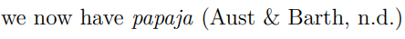

# 第十二讲：从分析到手稿{#lesson-12}


## **通过Papaja撰写论文**

经过之前的学习，同学们熟悉了R markdown格式的书写和使用，并了解其保存形式为.rmd文件。markdown包含文字、代码以及对代码的编译，能够方便的记录很多内容。正因为.rmd有上述优势，有人就想到将其输出为pdf或者是word文档，在文档中排版符合发表要求。本节课即将讲到的**Papaja**包适用于心理学手稿的准备，符合APA第6版的版式标准。

### **Part1-Papaja包的安装**


我们为本堂课准备了一个.rmd文件，papaja包安装成功后打开文件点击**knit**按钮，在相同工作目录下将生成一个与.rmd相同文件名的pdf文件，该文件即为APA论文格式的例子。

安装时普遍存在的几个问题：
（1）安装速度过慢
解决方法：开启梯子下载
（2）knit过程中提示需要更新包，点击确认后仍存在相同提示
解决方法：手动更新，例如找到该包卸载后重新下载等
（3）有些包需要安装在用户名下的某个文件夹，出现了中文目录
解决方法：将Windows用户名改成英文

安装完成后我们进入Papaja语法的学习。

### **Part2-Papaja语法格式**
（1）YAML头文件
在所有RMarkdown文件中的头部都会有一个YAML头模块，利用---分隔开，包含标题、作者、摘要等各种信息，同时该部分支持markdown语法进行编写。
在Papaja的模板中，通讯作者默认数量为一个。**affiliation**在作者栏中编号，在下方统一存放。**authornote**为APA格式风格内容，用于展示该论文之前的故事（如参与哪些报告、是否为毕业论文等）。
关于参考文献，本例包含了两个.bib文件，**chapter_12-r-references.bib**与**chapter_12-citation.bib**，可以从文献管理软件中导出，papaja将在你引用参考文献时自动从这些文件中查找并使用。
**linenumbers**属性是一个较为常用的属性，能够为文献提供行标，方便审稿人指出需要修改的位置。
---
title             : "Lecture 12: Preparing journal artical with *papaja*"
shorttitle        : "papaja"

author: 
  - name          : "Hu Chuan-Peng"
    affiliation   : "1"
    corresponding : yes    # Define only one corresponding author
    address       : "#122 Ninghai Rd, Gulou District, Nanjing"
    email         : "hcp4715@hotmail.com"
    role:         # Contributorship roles (e.g., CRediT, https://casrai.org/credit/)
      - "Conceptualization"
      - "Writing - Original Draft Preparation"
      - "Supervision"
  - name          : "All Students"
    affiliation   : "1,2"
    role:
      - "Writing - Original Draft Preparation"
      - "Writing - Review & Editing"

affiliation:
  - id            : "1"
    institution   : "Nanjing Normal Unviersity"
  - id            : "2"
    institution   : "Collaborators' Affiliations"

authornote: |
  Add complete departmental affiliations for each author here. Each new line herein must be indented, like this line.

  Author Note: This is for demonstration only.

abstract: |
  Psychological science has encountered a serious replication crisis. 
  
  To make self-correction of the field, researchers actively reform the current practices and increase the opennes, transparency, and reproducibility of studies in the field. Using R language for data analyses is recommended by many. With increasingly emphases on computational reproduciblity, *papaja* was developed to combine data analysis and manuscript preparation.
  
  The current chapter aims to demonstrate how to use *papaja*. 
  
  We will introduce the package and key elements of the it.
  
  After the lecture, we expected students able to create an example APA manuscript using open data or examplary data we had provided at the beginning of the class.
  
  This demo and practice will further enhance the student's experience in computational reproducibility.
  
  By spreading the ideas of reproducbility and teaching papaja, this class will increase the computational reprodcubility.
  
  <!-- https://tinyurl.com/ybremelq -->
  
keywords          : "Reproducibility, R, Teaching, Demonstration"
wordcount         : "X"

bibliography      : 
  - "chapter_12-r-references.bib"
  - "chapter_12-citation.bib"

floatsintext      : no
linenumbers       : yes
draft             : no
mask              : no

figurelist        : no
tablelist         : no
footnotelist      : no

classoption       : "man"
output            : papaja::apa6_pdf
---
（2）包和文件的调用
在定义YAML头文件之后，需要进行检查是否该文件已经调用了需要使用的包，以及是否包含了需要的文件（例如.bib格式文件）。
（3）参考文献的引用方式
如例子中**[@R-papaja]**，这是Papaja的引用格式，包含中括号[]、@符号以及参考文献标识。参考文献标识为.bib文件中@后面的内容。这种标识转换后为APA标准引用，以括号的形式引用文献.

还有我们通常使用的另一种引用，即在句子中直接引用文章作者，此时只需要略去大括号即可，如@Hu_2020


### **Part3-正文的撰写**
了解并添加了YAML头文件和参考文献后，就开始撰写正文。

（1）数据的处理：
在markdown中创建chunks来存放数据处理代码
推荐命令，用于清理环境变量

```r
# empty the global env
rm(list = ls())
df.m.basic <- read.csv('./1012-lesson12/data.csv',
                       header = T, sep=",", stringsAsFactors = FALSE)
```


