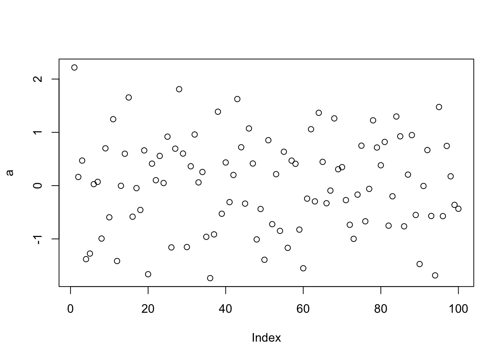
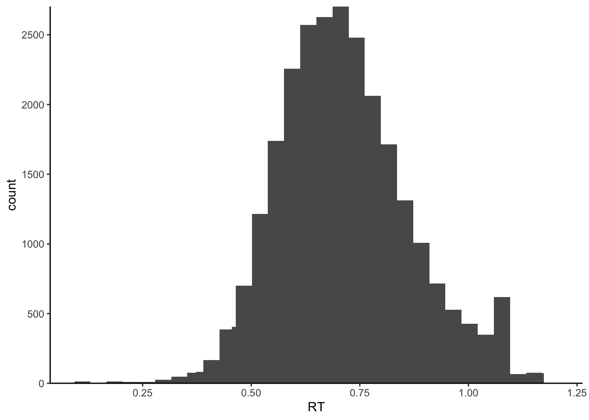
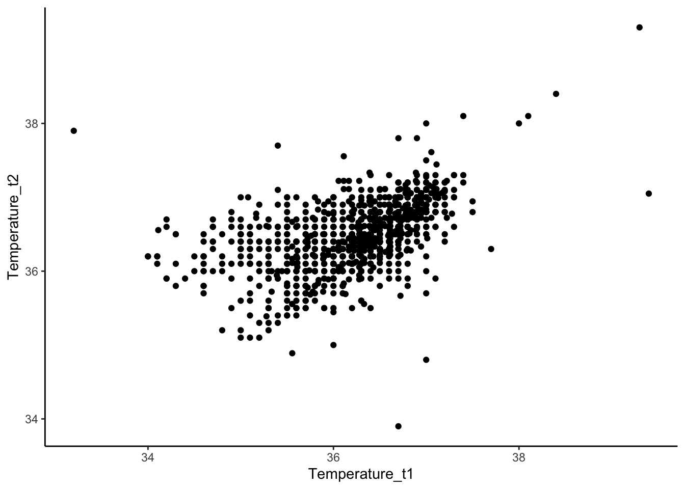
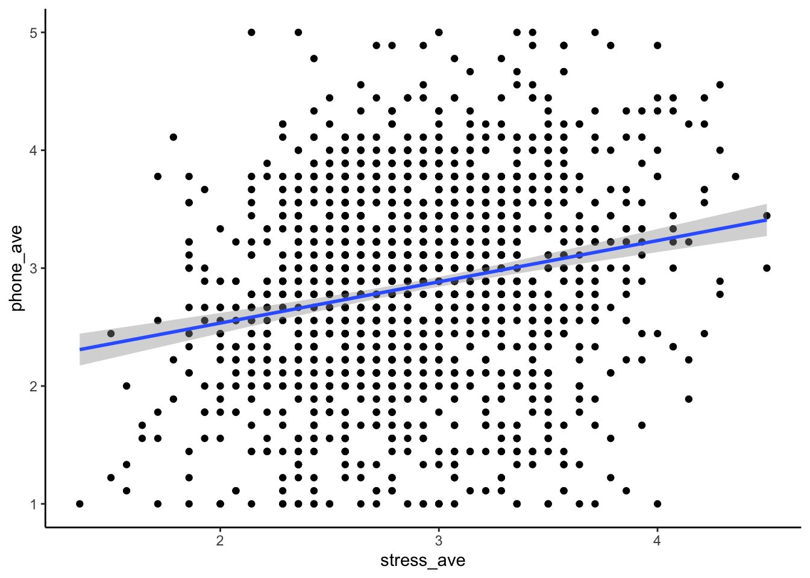
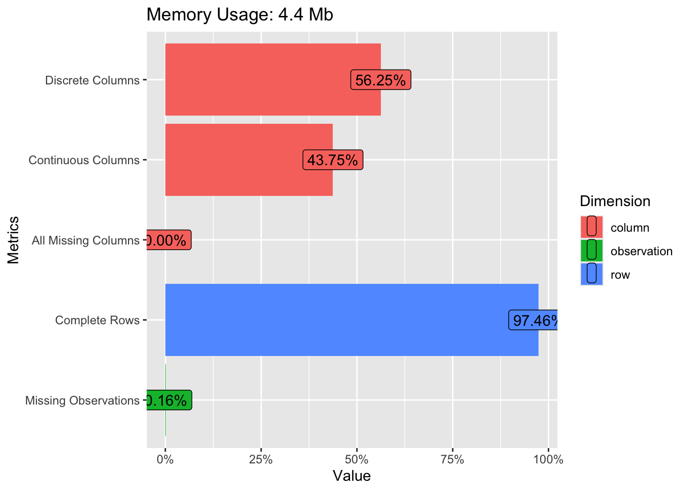
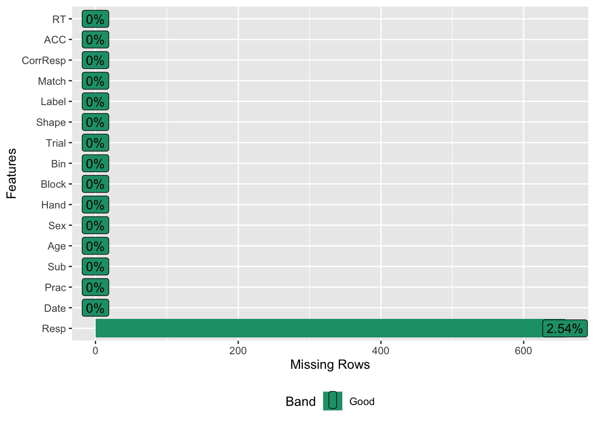
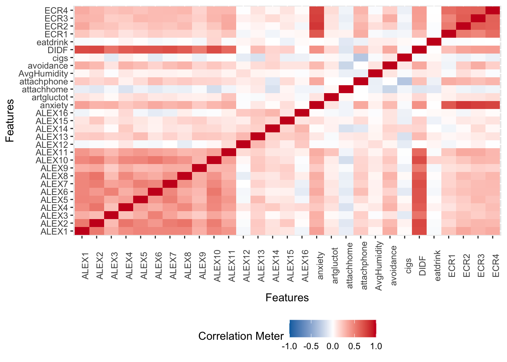

# 教学内容与课时{#0-index}

## 目录

第一讲：为什么要学习R\
1.1 R在心理科学及社会科学中的运用\
1.2 R语言使用的示例展示\
1.3 课程安排\
1.4 如何学好这门课\

第二讲：如何开始使用R\
2.1 要解决的数据分析问题简介[介绍我们的数据和拟解决的问题，对比R和传统flow]\
2.1 如何安装？\
2.2 如何方便使用？Rstudio的安装与界面介绍\

第三章：如何使用本课件/电子书资源\
3.1 Git与Github\
3.2 项目、文件与代码的规范化\

第四章：如何导入数据\
4.1 路径与工作目录\
4.2 读取数据\
4.3 了解R里的数据 （R语言中的对象）\

第五章：如何清理数据一 R语言编程基础 \
5.1 R对象的操控\
5.2 逻辑运算\
5.3 函数\

第六章：如何清理数据二 数据的预处理 \
6.1 Tidyverse简介\
6.2 问卷数据的预处理:基本 \
6.3 实验数据的预处理:提高 \

第七章：探索数据: 描述性统计与数据可视化基础\
7.1 描述性统计\
7.2 探索性数据分析(DataExplorer)\
7.3 ggplot2基础\

第八章：R语言中的统计分析: 线性模型1 (t-test、anova等) \
8.1 语法实现\
8.2 分析的流程\

第九章：R语言中的统计分析: 线性模型2(rm-anova、层级模型)\
9.1 语法实现\
9.2 分析的流程\

第十章：R语言中的统计分析: 线性模型3(GLM)\
10.1 语法实现\
10.2 分析的流程\

第十一章：R语言中的统计分析: 线性模型4(中介效应模型)\
11.1. 多种分析方法的实现\
11.2 代码整合与规范化\

第十二章: 如何得到可发表的图像: 数据可视化进阶（3学时）\
12.1 ggplot2的图层与面板控制\
12.2 ggplot2与其他工具的结合\

第十三章：待定 \

第十四章：待定 \

第十五章：待定 \

第十六章： 大作业\

<!--chapter:end:index.Rmd-->

---
editor_options: 
  markdown: 
    wrap: 72
---

# 第一讲：为什么要学习R {#lesson-1}


**序**

本课程主要面向具有心理学背景的学生，包括教育学、社会学等相近领域的同学。今天的第一堂课旨在让南师大心理学的同学们了解这门课程的性质，判断它是否适合自己。我知道在开学初期，大家仍有机会退选课程。这里我想提醒大家，虽然R语言编程语言非常有趣，但它并不适合所有人。有些同学上完课后，在处理数据时仍然使用SPSS，这说明本课程对他们来说没有太大意义。如果只是因为学分而选择这门课，我认为没有必要，你完全可以选择一些更有趣的课程。在本课程的学习中，你可能会遇到一些情绪上的起伏，因为这与我们以前学习的知识不同，需要我们改变思考问题的方式。如果你不打算采用R语言进行数据分析，那就没有必要选择这门课。当然，我也希望通过这门课程，向大家展示学习R语言编程语言的价值，让大家认为经历情绪的起伏是有值得的。

我也希望大家更多地使用开源软件，放弃使用商业软件，尤其是在国内存在盗版泛滥的情况下。学完课程可以帮助你逐渐转向使用开源软件。此外，现在学习R语言比几年前更加轻松，因为现在有很多在线资料和脚本可以参考。完成这门课程后，你可能至少会接触一些代码，这些代码可以直接应用于分析某些数据。

本次课的主要目的在于帮助大家了解本课程的基本情况，为本课程做好心理准备。所以接下来，我们主要介绍为什么要开设这门课程、课程的内容是什么、需要做什么样的准备以及能收获什么。


## R在心理科学及社会科学中的运用

### 数据科学 {#1-data-science}

这门课的开设有其时代的大背景。作为在心理学院的课程，我们将这门课称为《R语言在心理学研究当中的应用》。但实际上，R语言是当前数据科学（data science）中主流的计算机语言之一。 正是数据科学在各种学科中的渗透和普及，让我们开设这门课程显得非常重要。那么什么是data science呢？

**数据科学是什么**？ 

在科学研究中有人认为，科学的革命是经过了几次范式转换的（[参考链接](https://www.perfcloud.cn/blog/post/81)）。最早期的是"实验"科学，研究者通过设计和完成实验，一个一个地去检验假设。随后是理论科学，在实验基础上进行归纳。随着计算机越来越发达，我们进入了"计算"时代，通过用各种计算模型模拟的方法，帮助我们去理解世界。但是现在，随着数据越来越多，通过数据驱动的方式就能发现很多新的东西。最近这些年，很多在科技领域尤其是在计算机领域取得的重大突破和进展都是依赖于大量数据的，也就是通过对数据进行“提炼”从而得到新的发现。比如说2023年初非常火的ChatGPT。作为现在全球最火的科技界产品之一，它背后的模型叫做LLM，Large Language Model，就是一个大语言模型，它依靠的就是大量语言材料的训练。

**数据科学的内容**

大概10多年前，数据科学就已经出现。大家也许对“数据科学”这个术语已经不再陌生。数据科学里面既涉及到计算机编程，也包括数理统计。当讨论具体应用领域的数据科学，比如心理学的科研领域，数据科学也需要domain-specific的知识，也就是这个领域的特殊性知识。

[此处插入关于数据科学的Venn图]

这意味着什么？
意味着如果你仅仅懂计算机，那你不一定能懂data science的；如果你仅仅是懂数学和统计，那也不意味这你能解决一个data science的问题。必须要将计算、统计和领域特殊的知识进行结合。在心理学研究中，这对研究生提出一个新的要求。


### 数据科学的诞生------数字化时代 {#1-data-science-born}

为什么会有data science？
大家应该能直观地感受到：随着个人电脑的普及，互联网越来越发达，整个社会所产生的数据呈现爆炸式的增长。下图是一个可视化的例子。我们可以看到，在计算机出现之前人类产生的数据是非常少的，而计算机出现之后产生的数据越来越多。


我们也有了越来越多的个人电子设备以及其他的先进设备，它们所观察到的、产生的数据也是非常大的。这个图片相信很多人在朋友圈都被刷屏过。这是人类所能观察到的一个划时代的新的图像，尽管我们作为外行可能不知道它具体的内涵是什么，但是都知道它很酷。


此外，我们国家是互联网普及最高的国家之一，我们现在有百分之七十四（可能现在有更多了）的人都已经开始接入到互联网。这么多的人接入到互联网，所产生的数据可想而知，一定是海量的。所以现在我们很多电商，像淘宝这样的各类购物平台，它们在中国做的是非常好的，这也得益于海量的数据。包括最近像拼多多，听说在美国也是势如破竹，态势很猛。还有像TikTok，就是字节跳动，前一段时间在美国甚至要被封杀了，原因就是年青人都很喜欢用它。字节跳动的一个特点就是它很好地利用了中国大量的网民产生的海量数据，通过网民不断地使用它们的产品，不断地进行迭代。所以当它能出海的时候，去给海外的用户提供服务的时候，它的迭代已经非常成熟了。当然迭代的过程中需要大量数据的产生和调试，产品才能越来越成熟。


**数字化对心理学研究的影响**

近年来，随着人工智能的兴起，数据科学变得越来越重要。我们生活在大数据时代，心理学或心理科学也在这个时代中发展起来。我们收集的数据越来越多，我们的生活方式也在逐渐数字化。因此，数字化成为了新时代的重要组成部分。在数字化时代，心理学不可避免地会受到数据化的影响。

其实很早就有人关注数字化我们心理学的影响了，国内的研究者也经常会提到心理学和大数据。我们这里做一个不完全的概括，主要是这三个方面的显著变化。


**Big n (sample size)**

首先就是样本量很大。现在的数字化平台生产的数据非常大。我们传统的行为学实验可能只有几十、几百人的数据，上千已经是很不错的了，上万就比较费劲了。但是如果说我们能从互联网上抓取数据的话，那动辄就是上万甚至是百万级别的。
例如，与企业合作或者使用可穿戴设备，我们可以收集到大量的心理健康数据，这已经超越了传统心理学研究的范畴。

**Big v (variables)**

其次，我们现在面对的数据不仅仅是数量上的增加，还有数据维度的增加。以前我们可能只关注反应时间和准确率等少数几个变量，但现在我们可能需要处理大量的参数，比如个人的购物记录、聊天记录、身体活动数据等。比如我们使用手机，那其实我们产生了非常多的数据。你一天使用多久、点击多少次、点击了什么、在哪个地方、用的是什么APP，甚至包括你所处的地址，你在地球上的经纬度、当地的气温、湿度这些数据信息。这些数据的维度非常多，每个变量都可能对我们的研究产生影响。

**Big t (time)**

还有就是时间的跨度比较长。现在很多的APP一旦用户开始使用之后就会长期使用，如果能用于收集心理学的数据，就可以在很长的一段时间里记录很多的数据(Experience Sampling Method, ESM, or Ecological  Momentary  Assessment, EMA)。我们现在有了新的研究设备，比如通过手机应用程序不断追踪个体的心理状态，可能一天收集五六次，连续追踪一个月，这样就会收集到大量的数据。这些数据为我们提供了新的分析挑战，我们需要新的方法来处理这些数据。
这对于了解人类的心理和行为的规律来说其实是非常好的。对于发展心理学家来说，有这样的一个例子：有一个做语言发展的一个研究者他从自己的孩子出生开始就一直用视频记录孩子的成长（见science最近的[文章](https://www.science.org/doi/10.1126/science.adi1374)）。儿童产生语言目前对于人类来说还是一个不能够完全理解的过程，从语言学上看这是一个很大的跳跃。这位研究者完全记录了孩子生长的过程，积累了大量的数据，并通过对视频数据的全方位分析，得到了以前心理语言学比较少能够得到的东西。


**数字化时代的心理学研究**

这里有几个例子。比如这个是利用手机里的数据预测人格，我们这里看到的纵轴就是人格的类型，不同的颜色表示使用不同的方法进行预测，横轴是相关系数。可以发现说手机里的一些数据和人格的倾向是密切相关的。


另外，像我们心理学的顶刊*Psychological Science*，上面也不定期的有研究是探索我们在数字的视觉中留下的痕迹跟我们的行为之间的关系。比如这篇文章发现我们个体在使用手机的行为上是非常的一致的。研究者通过大量的数据是得到了一个比较强的一个结论，尽管这个结论比较简单，但是基于数据量比较大，说服力是比较强的。


我们也可以利用互联网的平台来收集行为的数据。传统上我们是把被试带到实验室做实验，但现在由于互联网的发达，我们可以进行线上实验。在疫情期间，不少同学可能尝试过JsPsych或者巴普洛夫这样的平台，把实验编写好放在网上，并通过链接给被试发放被试费。这样我们在短时间内可以收到比传统实验室更大量的数据。同时，因为我们使用的其实还是传统的实验任务，只要事先验证过在线的实验和实验室实验的可比性，就可以利用互联网在线去收集更大量的数据来研究我们感兴趣的问题。

比如这里列举的实验，去年的R课上我们以此作为了示例。它就是通过在线的平台收集的数据，收集到了很多变量。它的研究一个目的是为了探测self regulation，自我控制或者自我调节，不同的测量方法是不是一致的，哪一个能更好地预测生活中的一些行为，比方说这里就是看哪一些与饮食控制有更强的相关。


**数字化时代心理学研究方式的变化**

数字化时代不仅给心理学提供了新的数据，实际上也变革了我们做研究的方式。比如说合作。在疫情以前，研究者建立国际合作主要是通过导师的联系、邀请讲座或者是开会时建立联系。但在疫情期间，因为大家都困在家里同时又都使用很发达的互联网，所以就有研究者直接在社交媒体上发起合作的倡议。比如有的人说我有个想法需要在不同国家收数据，想要有人和我一起收集数据，最后可以一起发表文章。在疫情期间很多研究就是这么展开的，并且因为这样的研究往往样本量比较大，也能发到很好的期刊上去。同时，除了个人的发起，研究者们也成立了更多的学术组织，比方说Psychological
Science Accelerator (https://psysciacc.org/)心理科学加速器，这个组织就是专门组织在全球范围通过互联网进行合作研究。

此外，以前研究者需要去线下开会或者是参加工作坊，现在即便是疫情过去了，大家还是越来越习惯和更多地采用在线的方式进行学术讲座或是工作坊。所以呢互联网实际上是改变了我们心理学的方方面面。

### 为什么要学习R语言？{1-why-learn-R}

我个人总结了一些我们学习R语言或者说学习R，而不是Matlab或者python的理由。

首先，学习R是一个大的背景。R语言是一个开源的一个软件，它跟python、junior一样，基本绝大部分的基于R语言的工具都是开源的免费的，也说你基本上都能够（只要你的互联网是畅通的话）免费得到所有的内容。

第二，它是一个高级的语言，不需要和计算机的硬件直接进行交流，和我们日常的语言差不多。

第三，它有一个强大的community。我们在选择工具时，不仅要考虑工具本身的功能，还要考虑使用这个工具的社区和支持。因为一个好的社区可以提供大量的资源和经验，帮助我们更好地使用这个工具。因为现在的所有的开源的语言，它依赖于有多少人在使用它、有多少人在不断的进行开发，尤其是谁在开发这些新的东西。对于我们心理学或者是社会科学而言，绝大部分是使用R做数据分析。简单来讲，我们一开始作为新手肯定不会去开发什么工具的，就必须要把别人开发的工具拿过来。那谁为我们开发呢？肯定是这个community里的人，这就需要我们有一个比较成熟和强大的社区。而R语言本身就是由统计学家所开发的，所以它就是为了做数据分析而生的一门语言。同时，在这么多年的发展当中有大量的研究者，尤其是社会科学的研究者不断加入这个community，从初学者变成使用者最后变成开发者。

从做研究的角度来说，R可以在这三个方面提供强大的支持。

**科学性**

使用R有助于增强计算的可重复性。如果我们能够精确地重复我们的分析，并且得到相同的结果，那么我们的研究就更加可信。在讨论心理学研究的可重复性时，我们发现即使是有了公开的数据和代码，也很难保证研究的精确重复。一个研究发现，在14篇文章中，只有一篇能够完全精确地重复出来(https://doi.org/10.1177/09567976221140828)。这表明我们在数据分析的过程中，很多微小的步骤如果没有被完整记录下来，就很难保证研究的可重复性。为了解决这个问题，现在越来越多的人鼓励使用编程语言，如R语言，来记录数据分析的每一步。这样，我们可以从原始数据开始，记录下所有的数据处理步骤，从而确保研究的可重复性。例如，我与合作者2020年发表的一篇文章中(https://doi.org/10.1525/collabra.301)，我们公开了所有的数据和代码，并且有小组检查了这些数据和代码，发现能够得到与我们报告中大致相同的结果。

R会提供新的统计方法。IJzerman2018年的Collabra这篇文章(https://doi.org/10.1525/collabra.165)，我也是合作者之一，当时也通过互联网来合作收集的数据。在这个文章当中，他就使用了机器学习的方法，叫做（条件）随机森林，叫做conditional random forest。它实际上是在机器学习里面非常常见的一个方法。它的特点就是说即便只有比较少的数据，也能够得到比较稳健的结果。当然这个**小**数据是相对于机器学习里面的小的数据，因为机器学习里面可能动则就是上十万百万的数据。相比而言，我们的数据其实每一个都是很小的，就几百人上千人。所以当拿到这1,000多人的数据之后，他想去探索这么多变量之间到底哪些变量之间有一个比较稳定的关系，他就采用了随机森林的方法，最后也发现他感兴趣的那个变量，就是身体的温度和这个社交网络的复杂程度是有关系的。


R会提供更合适的方法。比方说我们实验室实验当中非常常用的反应时间，它基本上都是偏态的分布，对于这种偏态分布的数据到底应该采用什么样的一个模型，到底是用传统的线性模型还是应该用广义的线性模型。如果使用r，那我们可以很灵活的使用r里面比较新的一些回归模型的包。在这包里面我们可以使用最适合这个模型的，比方说GLM。我们甚至可以通过模型比较的方式找到哪一个模型是最适合的。也就是说正是因为在R有一个很强大的community，然后这里面有众多可以选择的r的工具包。这样我们就能够不仅仅是使用新的方法，它也可以帮助我们不断的去选出更加适合的方法。


**美观**

R语言提供了强大的绘图功能，便于调整细节，可以帮助我们在数据分析的每个阶段进行可视化。如ggplot2，它允许用户调整图表的每一个细节，以更直观、美观的方式展示数据。
我们后面会讲可视化的进阶，那一章的时候我们会把ggplot这个最常见的画图软件里面的每一个细节都掰开讲，这里我们只是稍微展示一下。我们可以把原始数据和group level数据结合到一起，然后再把每个被试的数据，把它的分布画出来。


最近几年非常流行的雨云图。当然我们还可以把多个（图）进行叠加，像这种被试类的实验设计我们可以把每个点都连到一起，可以看到在不同之间的一个变化，它是不是完全具有一致性的。然后我们把把这个box plot也加上去，这样的话我们能够看到极端点。我们同时还把这个分布加上去，当然这个分布目前的α值比较高，我们还可以把它调的低一点，就是说让他透明度再低一点，让我们看到这个分布之间的一个叠加。这样我们就可以在一个图上看到非常丰富的信息。


当然还有一个叫做ggridges的一个图，这个上面我们不仅仅看到可视化的效果，还可以直接把值标到上面。这样一个图给我们的信息量就非常大，当然在画图的时候我们不是单纯的追求这个信息量很大，我们要美观。要有足够的信息量同时也能够让大家不会一看到之后就不想看了，而是说看到之后能够立刻get到你想要传达一个什么样的想法，这个是很重要的。所以可视化这一点上面说实话我们即便在这个课上有两次课，但是我们只能教大家一些方法，大家最后画图的实际效果要依赖自己的taste，就是自己的一个口味和不断提升的感觉。


我们也可以画地图。我们可以把一些相关的数据在地图上进行映射，随着我们越来越多的能够得到不同地区的数据，把这些数据映射到地图上的时候，我们就会发现很有价值的信息。这个图是我最近画的一个图，就是我们在分析大团队科学中的样本被试到底是不是真的具有代表性(https://psyarxiv.com/avcsp/)。因为很多做这种就是跨国的研究的研究者总是会claim我们的这个研究从几十个国家来的，那么这个数据是能够推广到全人类的。是不是真的如此呢？我们看一下被试在我们这个图当中（的位置），我们就这边是中国的人口的一个（分布）那边就是他的那个被试的群体在不同省份的一个分布图，我们可以看到其实他选取的样本主要就集中在这两个地方，一个是广西一个是上海，其他地方的话其实数据量非常少。


当然我们还可以从其他的维度对他的样本代表性分析，这里主要是展示我们可以把数据映射到地图上面，这样一眼就看到他的数据到底行不行。现在把数据映射到地图上是越来越多的使用在心理学的理念当中。


**实用性**

R的实用性之一：适用于数据分析的各个阶段。首先，几乎科研每个阶段中涉及到的数据处理，均有对应的R包：计算样本量、读取数据、清理数据、处理缺失值、可视化、统计分析、生成PDF、甚至生成PPT。当然要掌握这里面的每一个流程的话其实是要花很多时间的，但是呢我们可以找到一个对心理学研究者来说最快的（方式）。比方说我们这个课上就会把整个过程中所有心理学的数据整个演示一遍。大家就可以照着这个流程去走，就不需要再去重新探索，这是我们这门课的意义。
此外，R语言还支持将数据处理和分析过程自动化，从而直接生成报告或演示文稿，甚至建个人网站。这意味着从原始数据到最终结果的展示，都可以通过R语言来完成。


R的实用性之二：适应数字化时代的需求。我们现在越来越多的大的数据，所以我们要使用一些更加fashion的一些方法，机器学习、深度学习什么的。那么r语言现在已经有很多这种框架了，如果我们能够掌握r的知识以后我们后面去拓展到这些部分相对来说是容易的。因为里面已经有一些比较成熟的框架。那么就像我们能够调用Tidyverse，我们同样也能够去调用这些机器学习的包，只不过我们要真正的合理的使用还是需要去了解了解背后的一些知识，不能盲目的使用R语言。

R的实用性之三：代码复用。一旦你编写了一段处理数据的代码，你可以轻松地在不同的数据集上重复使用这段代码，只需要对代码进行少量的修改。这大大提高了工作效率，特别是当你需要处理大量数据时。

R的实用性之四：强大的社区、众多的教程。我们选择R而不是Python的原因之一就是，更多的心理学研究者在使用R。我们有一个非常强大的社区。意味着有很多人教你做各种各样的事情，也就是说你如果你想做什么东西，99.9%的情况下你不需要自己去真的去从原理到到实现全部实现全部去做一遍。而是去搜索前人是怎么解决的。比如说你要就要做meta analysis你就搜索meta analysis视频，然后你能得到很多的教程，这时候你就去找一个好的教程就可以了。或者比方说我们要做混合线性模型，你就搜索一下肯定又会得到很多教程。
 


#### 心理学的可重复性危机

在我们心理学领域从2011年开始出现了一个比较大的问题，就是可重复性的问题。大量发表的研究的结果无法被其他的研究者独立重复。那这个问题到底有多严重呢？最有代表性的应该就是这篇文章。在2015年的时候，一篇Science的文章专门报道了整个心理学领域的可重复性的问题。Science是跨领域的多学科的一个综合的期刊，能够发表到Science这个期刊的文章都是能够引起广泛的兴趣的，也是对整个科学界来说都很重要的。在这个文章中当中100个团队重复了2008年发表在心理学顶刊上的100个研究。他们的分析的发现大概只有36%的结果是能够被重复出来的。2015年这个结果是引起了非常大的震撼也被nature评价为2015年的年度的十大重要的论文之一。因为这个问题出现，研究者就做了很多的反思。当然我也是被这个问题所深深的震撼，现在还是在一直在寻求能够去做到更加严谨、可重复的透明的这种研究。这个是我在2016年的时候跟我们课题组的同学一起写的一篇对可重复性问题的一个介绍和思考，大家有兴趣的话可以看一下。


我这里没有去把这些心理学的计算上可重复的研究拿过来，有人对心理科学在science这个期刊上面有公开数据的文章进行了计算的可重复性的检验，也就是说按照研究者描述的方法去做一遍分析，看能不能得到跟研究者一模一样的结果。大家猜一下这个比例大概有多高。做一个区间吧30%以下、30%到50%、50%到80%、还是80%到百分之百。约为30%以下的举手，30%-50%呢，50%到80%呢。大家都很乐观啊，80%我就不问了吧。如果说我们考虑完全能够重复的话，他们在14篇文章里面只有1篇能够重复，是1篇还是2篇能够完全重复。然后有的是在作者的协助之下都得不到原来的结果，所以这个问题并没有那么简单。

#### 利用R语言增强计算的可重复性

既然他是这么大的一个问题，那么为什么说r语言可以帮助我们解决计算的可重复性呢？首先是说可重复性它是有多个层面的。大家可以可以想一下，如果说你的这个结果是可以重复的，那么最简单的一个可重复是什么？就是计算的可输入性对吧。computational reproducibility，这个computation reproducibility说的是什么？假如你有一个数据，然后你做了一套分析，你把它报告出来了，我拿到你这个数据，我按照你描述的方法，我能不能得到跟你一模一样的结果。假如说你的计算的过程当中，没有一些随机的生成的过程，全部都是说我们用的这种可以求到解析解的这种这种算法的话，那就意味着我不仅仅要跟你的结论是一致的，而且是在数值上应该是一模一样的。你原来得到比方说t等于2.1，那我应该也得到就是t等于2.1，或者你得到的是f等于10，我应该也得到f值等于10，不然就说明什么计算上他是他是不可重复的。

##### **记录数据分析的全过程**

你们现在可能绝大部分是研一的同学，那么你们自己有做过数据分析吗？有的举手。做过数据分析吗？你们做毕业论文应该做过数据分析吧，都不举手，没有做过毕业论文？做个数据分析大家都是用的什么软件，SPSS？那你们都要通过手点击吧，你们现在还记得怎么点击的吗，一步一步的怎么点击过来的。

所以我们实际上按照传统的做数据分析的方法，都是用手动点击实现分析的对吧，尤其是前面那一部分。我们不是说你把数据录入到SPSS是以后的那部分，（说的是）比方说你用你在问卷上面，用问卷星收一批问卷，那里面可能有一些不太认真的吧，你要把它给删除掉对吧？有可能你会删除一些你认为是比较极端的也确实可能是极端的数据对吧？有可能你就是100个人里面或者是300个人里面你把某一两个（极端数据）你当时看到你就删除掉了，然后你最后认为你得到了一个干净的数据，你把它存起来以final或者是以最终数据作为后缀对吧，然后你就会基于那个数据把它打到SPSS里面对吧。但是如果说你要重复的话从前面到你那个最终数据你能够（重复出来吗？）可能一个月之后你就不一定记得为什么你删除某个数据了。那么这是很普遍的一个（原因）导致我们最后结果无法得到（重复结果）。如果我们用R语言编程语言来记录数据分析流程的话，就可以把我们整个数据分析的过程全部记录下来，也就说任何一个步骤出错了我们都可以找到，因为我们代码全部在那里。

我们这门课会从原始数据出发，从数据的预处理到后续的统计分析。我们会展示如何把每一个步骤都用代码记录下来，这样一个好处就是即便过了一两年之后，即便我们已完全忘记了当时是怎么处理的，但是代码还是可以告诉我们当时怎么做的，这一点就可以帮助我们去保证计算的可重复性。

##### **跨机器的一致结果**

另外一点，可以帮助我们达到跨系统或者是跨机器的结果。这个其实是在我们心理学的数据当中比如行为学的数据当中是不是很大的问题。为什么呢？因为我们行为数据的处理涉及到的步骤很少，即便里面包括一些随机化的过程，他的错误不会累积和放大。但是如果你们要去处理一些分析流程更长的一些数据，比方说像fMRI的数据，那么你在不同的机器之间的随机性或者浮点数据导致的这个差异，他就会随着你研究的步骤慢慢积累起来，也就是说即便你的这个系统刚开始的时候输了原始数据。经过了不同的系统不同的机器有不同的随机的非常微小的差异，经过一段时间之后也会累积成为很大的一个差异。我们后面会讲如何控制这种随机性导致的这个结果，如果我们使用比较好的使用包括像pandas？或其他的一些软件，我们实际上是能够达到某种程度上跨机器的一致性的。当然到了一个精度非常高的程度的话，其实就不是我们心理学家能够解决的问题，因为他涉及到一些计算机内部如何去控制浮点的精确度等一些技术细节的问题。但是我们可以怎么样呢？当我们学习了这些编程语言之后，我们能够去把计算机科学家在这方面做的改进纳入到我们的分析当中从而去改进我们自己的分析的结果。

那么在这个记录分析的全过程中我自己有一个例子。就是我们在2020年有一篇文章当中公开了数据。但是呢最后其实我们的数据跟统计的结果稍微有一点不一致，有一个读者他读了我们文章之后给我发邮件，我们后来是追溯到内部。之所以出问题就是我们用Excel来操作的，然后我们用Excel操作的时候不小心删除了几行。所以如果我们使用R做全部的数据分析的话，应该就不会出现这个问题，这是说R可以做全过程的一个记录。

那么另外一个例子就是我自己在2020年另外一篇文章当中，因为他的数据和代码全部是公开的，所以有一个叫做reproducible的团队，他们去对已经发表的这个文章的结果的可重复性进行评估。他们就对我的这个数据和代码尝试进行了一次重复。那么他们就是说行为的这个结果绝大部分是能够重复出来的，但是有一部分是没有重复出来，原因是因为他安不安装不了那个软件。这不是一个很小的问题啊，我后来花了两年的时间去专门把那个软件打了一个docker的包，我们后面会学到的这个docker就是为了去让我们能够保证跨机器的一致性。这个看起来是个很简单的问题，你发了一个文章，然后你做了某一个分析，结果别人连你的软件都装不上。那么我们如何去提高自己的研究结果的可重复性，那当然就是我们把软件让它变得更好安装。那个重复的它是用python写的，不是用r语言写的。他重复这个R语言部分呢，他的comments都是非常好的，就是说即便他没有在他自己的工作中没有使用R，但他也能够很好的读到我的（注释），他也能够知道我在做什么，非常详细。大家以后能够比较好的比较规范的写自己的r代码的话，那么同行的反应也是类似的，他会发现你的这个数据，第一个结构非常清晰，第二个你的代码非常清晰易懂，他很很快就知道你在干什么，他也能够很快的重复你的一个结果。至少这样的话，你就保证了自己的结果是非常的稳定的也非常靠谱的。


## R语言使用的示例展示

我们已经讲完了第一部分关于为什么要学习的内容，希望大家在听完后仍然能够有学习的动力。接下来，我们将简单展示一些使用R语言的代表性情况。你现在看到的是其中最具代表性的情况之一，即遇到错误的情况。例如，在使用R语言时，实际上碰到错误的概率几乎是百分之百的，而即使你非常熟练，仍然可能出现很低级的错误，比如漏掉一个字符或者反引号。我们将在之后讲到数据类型时介绍不同数据类型需要对应的一些符号。

### 数据清洗

在数据清洗方面，我们一般会使用dplyr，
它是Data science里面非常常用的一个功能，需要进行各种数据转换、分组等等操作。但是数据清洗通常是数据分析中耗时最长的一个过程，即使是简单的数据也需要花费相对较长的时间进行清洗。虽然在使用SPSS的过程中，我们已经形成了一个非常快速的数据分析思维，但是在使用计算机语言进行数据分析时，这个过程完全不同，需要花费大量时间进行数据清洗。即使是行为学数据，甚至是简单的反应时数据，也需要进行相对较长时间的数据清洗。

这里面可能有几个图没有截过来，在数据科学中，无论你从事哪个领域，完成一个数据分析项目的时间通常会包括从数据清洗到最终分析以及报告撰写。其中，数据清洗通常会占用至少60%的时间，这个过程可能需要反复查看和修改。传统的做研究的方式并不习惯分享数据，因为整理和清洗数据需要很长时间。即使你的文章已经发表，清洗数据所花费的时间也可能会被认为是浪费的，尽管有时会带来间接的回报，如其他人可能会重新使用你的数据或发现你的分析的可重复性很高。

### ggplot2画图

另一个耗时的任务是画图，尽管这些图看起来很漂亮，但需要不断地调整和修改。有时，研究者会花很长时间去完美地绘制图表，而这些时间可以用来完成其他任务。经常会有研究在这个社交媒体上，他自己比方说做统计分析发了一分钟，然后画图画了两天的时间，就是不断的去调，并不是他不会画图，而是他总是觉得画出来这个图不满意，然后就不断的调整，不断调整最后发现，时间就没了，并且呢你也会发现呢，就是当你掌握了不同的这个，画图的这个方法以后呢你会不断的去想，我能不能找到一个更合适的方法，去对他进行更好的一个可视化，我没有来得及把我自己之前的一个画的图的这个历程贴上去，我刚开始就是最简单的这个，跟我们在，Excel里面画的那个图是一样的，就是一个直方图上面加一个error
bar，这是我一开始用来画的用APA的格式，后来就变成那个带散点的，再后来变成了那个raincloud，然后就是raincloud加box，然后加这个distribution，然后最后又回到了这个散点的，加上这个主题，就是groups这些。所以其实这个画图的时间需要大家当你熟练了以后也需要适可而止，差不多能够传达你的这个信息就可以停止了，要不然的话，这个画图的提高是没有止境的，有的也可能可以看有的时候也看到，就比方说一些好的期刊，比如像经济学人他们涉及到数据的时候，像比方说，
我们说Nature、Science或者PS对吧，nature Communications，当他们涉及到数据的图的时候，那都是非常漂亮的，包括他们配色包括的比例各方面，他实际上都是经过了，就是专业的人士进行调试的。那么有的时候其实我们要想要达到这个类似的效果的话，也需要花很长的时间去做这些细节的工作。但假如我们只是按照心理学传统的做法，Excel的那种一个bar图加一个error bar的那种非常快基本上几行代码就可以搞定。

### 心理学数据分析与结果汇报

针对于各种各样学科、心理学的这个数据的分析的包，也有心理学的研究者开发的包，例如蔡华杰老师的PLUS包，该包专门针对心理学数据分析，并包含很多有用的功能，非常适合心理学学生使用。例如，对于做T检验的研究，可以使用该包的功能，我们可以用他的这个T-test对吧,它可以将结果输出成为一个简单的三线表格，并且可以直接在命令中加入指令将结果输出成为一个Word。这个word文档里面就有这么一个表。你就可以直接复制打开到你的文档里面，这个是非简单的。他也告诉你，你的零假设是什么，我们这个是单样本的t检验，那么他告诉你这个假设就是双侧的，然后这个叫做均值，他不等于700，那么类似的可能我们还有其他的，比方说我们用这种配对样本t检验对吧，他同样的也可以得到这种非常适合我们输出的这个结果，而且他最近也把这个face back进去了，所以我们大家可以看到这里报告的信息肯定是比spss更加全面的。

### Regression

那么另外就是关于这个regression这里面我们其实没有使用BruceR，如果我们使用BruceR的话，他有一些专门的回归模型，然后我们这里有个简单的回归模型，把回归模型直接做一个这样的输出，Bruce也是可以的。还有这种，这里应该也是一个简单的回归模型，还有就是我们也可以使用这个SEM，这个地方的话，我们可能要使用一个新的包，就不是bruceR，当然bruceR他也把那个，如果没有记错的话，把SPSS那个process整合进去了，这里我还没有尝试过，可能我们后面可以一起来探索。

## 现场运行代码

在今天的课程中，我们向大家展示了一段R语言代码。我之前在公众号或群组中提到过，所有的课件都会放在github同一个地方，供大家查看。比如，我最近在一个小时前更新的内容，包括第一节课的PPT。我通常会在上课前更新课件，以确保大家能够获取最新的信息。

去年的课程PPT，也就是2023年的课堂PPT，已经不再使用。虽然这些代码和PPT可能仍然有用，但与我们的课程配套的内容是我们当前每次课的课件，大家可以自己下载最新的课件。我刚才展示了一个简单的rmd，让大家看到如何进行简单的展示。如果你已经下载了，可以直接打开并查看。

我使用的电脑是我的助教提供的。在课程开始前，很多人还没有安装课件和代码，但我通过一个工具，将代码和课件下载到另一台电脑上，并成功打开。通过这个工具，我们可以看到各种信息，包括代码和文字信息。这些信息和代码可以混合编写，最终可以生成一个可以直接在电脑上运行的演示文稿。

在运行中，可能会遇到一些问题，比如某些包未安装。需要注意的是，R中的很多包看似独立，但实际上是基于其他包构建的。这意味着你需要安装所有依赖的包才能正常使用。特定的R包甚至可以帮助我们按照特定的排版格式生成符合学术标准的论文排版，符合一些学术杂志的要求。这个工具可以处理很多细节，比如作者信息、摘要、关键词、材料和方法等部分。你可以编写所有的细节，包括实验设计和数据处理过程。通过这种方式，我们可以确保我们的文档既符合学术标准，又能以一种清晰、易于理解的方式展示我们的研究内容和数据分析过程。

## 课程安排

我们这学期的课程的有三个原则：第一个就是**即学即用**，我希望我们在课堂上教的这些代码，大家都能够在自己的数据分析中使用而不是我们在这里学了一遍之后，自己还需要重新去学，或者这里面学的代码，都是大家用不上的，这个我们尽量避免。因为大家时间都很有限，如果能够帮助大家省一点时间的话我觉得或者少走一点弯路的话，减轻大家的心理负担。

第二个就是**在做的过程中学习**，我们会教大家怎么去安装，然后去了解这个里面的各种各样的功能，以及数据导入，以及各种各样的情况，基本上第二节课以后，我们就开始就直接就给大家讲这个代码。我们需要在做的过程中学习。

然后第三个就是**逆向学习**，逆向学习就是你先做，你先能够在哪里面实现这个东西，然后我在这个我演示的过程中，我用一个命令，比方说就是t test或者f test对吧，我能够得到这样的结果，大家首先说的就是你在你自己电脑上面，或者说你在这个云计算平台上面你能够实现这个功能，你能把这个代码抄下来，然后得到跟我一模一样的结果。然后你后面再去理解它，你先会做然后再去理解，这个是对于学习代码来说，我觉得是很好的一个做法。因为如果你看到一两本书之后，却没有写过几行代码，这个实际上是非常的浪费时间的一个事情，尤其现在大家的这个时间也比较紧张，我们的一个目标就是想要去压平这个学习曲线。因为如果大家知道学习，就是说以前大家认为这个R语言的学习曲线是非常陡峭的，就刚开始特别难，你要进步的话很慢，就是很难，也花很多时间。我们希望他尽量的快一点，然后可以慢慢的去后面的不断的学习。

那么参考教程的话，英文版的有这个（Naverro, Learning statistics with R: A tutorial for psychology students and other beginners. (Version0.6.1),<https://learningstatisticswithr-bookdown.netlify.app>），然后中文版的话，有一个叫做王敏杰老师的《数据科学中的r语言》，他实际上是一个公开的一个教程，那么大家可以把它当做参考书，因为这个书里面讲到了非常多的一些知识点。但是我们不会按照他的这个知识点进行讲解。然后另外一个叫做Tidyverse，张敬信老师的书(https://www.epubit.com/bookDetails?id=UB7db2c0db9f537)，这个我最近也买了。那他实际上跟我们的课堂的这个内容契合度是非常高的，因为Tidyverse就是我们最常使用的一个工具包，那么课程的安排的话我们就是，我们课程的内容的话其实就基本上跟我们的研究密切相关，因为大家都是研究生对吧，所以我们是希望：首先是跟数据分析这部分密切相关，然后等我把这部分解决之后，我们看到后面进阶的话，在设计实验的时候怎么把这个部分做好，那么在数据分析的过程中的话，我们就会有一个完整的流程：我们从原始数据到清理，然后到数据的探索，统一分析，然后分析完了之后统一推断，然后把它结果去验证，然后撰写一个报告。

我自己本人也非常喜欢可重复性和开放科学，因为我觉得它是科研中很重要的一个方面，我们后面也整合了一些有关我们如何跟他人进行协作的内容，帮助他人一起共同的合作来完成任务。还有如何保证我们的可重复性，如何采用一些更加先进的计算机技术，来帮助我们更好的保证我们的这个计算的可重复性。然后以及如何直接能够从代码到数据，生成一个PDF文件或者word文档，能够生成一个直接可以提交的一个版本。

### 课程大纲

我们不会按照传统的这种方法介绍R：先介绍R里面有什么数据，有什么对象，有什么语法规则，这些通通都不介绍。就是直接数据拿过来，我们要怎么用，怎么分析，第一步做什么。我们从第二章开始，就是安装，假如我们现在有了一个数据，我们需要用r语言，我们第一个问题就是把r安装到自己的电脑上面去，如果使用的是windows系统的话，最好把自己的用户名改成英文或者是拼音，不要用中文作为用户名，因为R语言它是英语的使用者开发的，所以说他的这个编码可能会对中文不是很友好。我们之前碰到过一个问题，就是当我们使用中文作用户名的时候，可能没有办法画图。

然后我们会后面会帮助大家解决一些安装中的问题，我们会介绍安装之后的各个界面，我们也会介绍如何更加方便的使用r，如果我们是使用原生态的r的话会非常的难用，相当于只是给我们提供了一个引擎就是做R计算的一个引擎。我们还要需要有一个写代码的一个界面，更加方便我们进行交互，那么我们会使用Rstudio，那目前的话，Rstudio应该是使用最广泛的，当然越来越多的人也使用Microsoft的那个VS code，但是我们使用R语言，其实也是挺方便的。

然后我们介绍各个界面以及如何开始我们的数据分析。我们现在拿到一个数据之后，首先要把这个数据导入进去，那么在SPSS里面大家知道，就是一个File导入，那么在里面呢我们除了这种方式以外，我们有其他的方式，我们也会进行批量的导入，我们不仅要导入一个数据，我们可能需要导入多个数据，导入完数据之后呢我们就有东西了。

我们的数据进入到里面了，那么我们从现在就开始认识R里面的这些数据，就是R里面的这个对象，然后我们会以这个为基础来讲解R里面的各个对象有什么特点。

首先我们要讲解数据和处理，因为这个过程有点复杂，所以我们会分成两次来讲解。我们会首先讲解单个对象在R中如何操作，一个一个的我们在Rstuido中都是可以看到的，然后讲解一些运算规则。这时候，我们就把R的一些基础知识放在这里了。然后我们讲解每个对象的特点之后，会展开介绍一些函数和规则等等。然后我们就可以开始自己的处理工作了。我们会按照tidyverse的风格进行基本的操作，或者我们叫做比较管道的操作。在这个过程中，我们可能需要给大家演示一下。如果大家能理解了，我们就可以进入下一个阶段。但是，如果有些同学对编程没有基础的话，第四章和第五章可能会比较难理解。所以我们会多停留一段时间，确保大家能够理解。

然后我们已经导入了数据，接下来就可以进行一些探索。看一下我们数据长什么样，他有什么样的一个模式，特点，我们应该对他进行什么样的一些分析，这就是这就是去了解我们的数据。在传统的心理统计学和SPSS中，不知道老师有没有要求大家查看原始数据。实际上在我们用做数据分析的时候，我们一定要去看，并且是在开始的时多的去看原始数据他到底是什么样子。我们不能只看统计指标，我们一定要看数据他到底是什么样子，这样的话就避免让我们发生一些非常非常基本的错误。

那么这个数据探索的话其实他包括两个部分。一个部分就是进行描述。第二个部分就是进行一些基础的一些可视化，所以探索数据部分其实已经包含了我们两个部分的一个知识点：一个是描述统计，另一部分就是最粗糙的可视化。因为这个时候，我们只需要自己看就行了，我们不需要给别人看，我们也不需要去把它做的非常精美，所以这个时候是最基础的这个可视化，然后的话我们就会接下来几章我们就会告诉大家如何用r语言实现大家常用的一些统计分析，因为这个可能是我们心理学常用的。

所以我们先展示一下，然后他的这个分析的流程是什么样的。这几个部分呢，其实应该是可以并行展开的，但是我们没法进行并行展开，所以我们只能依次的介绍。

然后呢，介绍完了之后呢我们会介绍一个目前来说在国际心理学界比较流行的一个做法，或者说大家在推荐的一个做法，就是看我们的这个结果是不是稳健的，那么这个时候比如说我们同样一批数据，我们采用多个方法来分析它，最后我们得到的结论是不是一致的，这个称之为Multivese。在心理科学进展上最近有一个文章，介绍这个Multivese的。大家有兴趣话可以去看一下。

那么到这个时候的话，其实我们基本上统计分析就基本上，如果我们只做传统的这个数据分析的话，我们就其实就已经做完了。那么我们接下来就是，我们汇报结果，这个时候我们如何得到一个可发表的图像，或者可发表的是一个插图，那么这个时候我们会进一步的讲我们如何进行拼图，如何操作每一个每一个这个元素然后，如何把多个图拼到一起，让他更加的美观，以及他的比例等等。然后呢我们会讲一下，这个叫做文学编程literature program就是，实际上他就是把我们前面讲到------就是在这一章以前，我们讲代码，所有的都是直接代码，那么我们在这个地方的话我们就开始介绍如何把r代码和文字进行混合，也就是说我们同一个文档里面既有文字描述也有代码，这个代码还是可以运行的对吧，他生成的图片还可以直接插到这个文档里面。

我们就要介绍这个Rmarkdown,它是用LaTex的语法,所以我们会介绍一些最基本的LaTex的语法，帮助大家进行排版，还有公式的撰写等等，然后到这里的话基本上就是我们主流的部分，一个人干活的话基本上就差不多了。但是我们知道，现在的已经都不是一个人干活对吧？所以我们要经常跟他人进行协作，所以我们后面介绍就是如何跟合作者或者导师进行协作那么这个地方就涉及到两个，一个是版本控制------其实一个人干活的话你版本控制也很重要，为什么呢？因为你可能前后代码有很多迭代对吧，你有的时候可能删除一个功能，但是你后来发现，这个删除功能它是有用的，但是如果你直接删除的话，你就找不到了，那么如何我们能够找到以前的版本，这个其实是，当大家写代码越来越多的时候很重要的，另外一个就是多人协作对吧，通过这个Github来进行多个人进行同时，完成一个数据分析，你完成这个t test，我完成f test，最后我们两个人，进行一起合并，这样的话我们能够更加快速，更加有效的进行协调。
然后，我们相当于是一个研究做完了，可以计划下一个研究，这里我们会介绍一些心理学常用的方法，包括meta-analysis元分析。元分析实际上就是我们把多个研究的这个效应量进行综合，综合起来之后我们就有一个用来估计样本量的一个东西，那么我们接下来就是做这个power analysis。以及我们如何在没有任何数据的情况之下，我们就可以把自己的分析数据的代码先写出来，那么这就涉及到这个假的数据对吧，fake data或者叫做simulator data。

如果我们涉及到这个数据非常复杂的话，我们可能会考虑如何进行变形处理。就是说我们的数据量比较大的话，如果我们做模拟的话有可能他要花很长的时间。但是我们的CPU有多个核对吧，我们是不是能够把多个核都用上来，让他更加快速有效的进行这个模拟，当然这个可能是我们看情况啊，如果说有时间的话，最后大家自己去搜索就可以了，因为对于传统的行为学的这个研究来说，除非我们用贝叶斯的这个混合线性模型，要不然的话基本上都是在可预期的时间内能够完成的。然后最后的话，我们基本上完成了整个分析。我们全部做完了对吧，然后可能，假如我毕业了，那么师弟师妹他们如何来重复我的研究？或者导师如何能够重复我的研究？那我可能过了一段时间之后，这个版本有不断的更新的，那么别人如何能够还能够重复我的研究？这个时候我们如何把这个版本，这个包给记录下来发布？现在比较主流的这种计算机的方法就是容器技术。用这个帮助我们来更好的达到这个computational reproduce  ability，当然这个地方我可能只会做点介绍，大家如果真的要去完成这一点的话，可能也需要花点时间去琢磨。因为R语言他有的一些包可能会涉及到比较系统里面比较底层的软件的交互，所以呢他可能------就是说依赖于你使用的什么包，如果你使用的包是比较主流的，比较常规的，那可能，你把它打到docker里面是很容易的，如果你涉及到的包可能是比较新的，有可能会他有很复杂的一个底层的一个编译的话，那你有可能会就没有那么容易打包。

所以如果我们再回过头看一下，就是说我们整个教学大纲就是按照我们一个研究生，拿到数据之后会做什么一步一步的往下走，所以我们不会说很系统的去介绍R语言里的知识，我们就是碰到了什么我们就讲什么，那么我们会用什么数据呢？我们的数据就是我之前的公开数据。这里面包括了2019年在scientific data发表了一个数据，那么它的数据呢以问卷为主，那么还有原研究，我们后面会把这个发给大家。另外一个是实验数据，也是我2020年发表的一篇文章，我们就会从这些数据开始，然后一步一步的进行处理。

那么当然如果大家说OK，我想就在这个学习的过程中，顺便把我的数据给处理了，那我就把我自己的数据拿过来可不可以呢？也是可以的，你可以尝试，然后你碰到什么错误。如果说需要问的话呢也可以问，但是不能太超纲了。

我们这里面大家可以注意到一点，就是我们对统计方法的讲解没有涉及到很深，因为我们是R语言课对吧，所以是以R语言本身的操作为主，就是比方说大家这个里面设计的很复杂，我有一个链式中介模型要试试，或者什么调节模型。如果说你碰到那种技术性的问题，我们可能不会回答因为这个完全超纲了，但你说我碰到了一个数据导入的问题，这个没有问题，我们可以解答。因为现在是说一个是知识一个是操作，我们教的主要是操作，因为实际上如果你懂了，这种比较复杂的SEM的知识的话呢，你要操作起来很简单，可能就一两行代码就能够解决了或者复杂一点就是十几行代码就能够解决了，但是，如何设置这个模型，如何解读模型的输出，这个不属于我们R课的内容，而是属于你的统计知识的内容，大家清楚了吗？所以我们这个课，你可以把自己数据拿过来，但是如果你的数据非常specific分析的话，我们可能不在我们这个课程所覆盖的范围之内，但是可以帮助大家去把前面这个部分解决。你可能原来完全不知道怎么使用R，那么我们现在就教你怎么把这个数据导入怎么使用，做基本的数据分析。

那么到后面，你可能很容易就找到适合你的这个数据分析的工具包，那么你需要去阅读这个工具包相关的知识点，去把它用于自己的数据。有时候我们会以这个原始数据------两个原始数据，一个是问卷数据，一个是反应时的数据为基础，然后一步一步的去走完整的过程，那么中间大家可能会有一些要抄写代码的地方，这个是就是大家可以在课堂上实现。那么我们可能会需要，为了保证大家能够不断的进行这个讨论和反馈，我们需要分组。那我们可以加到群里面，然后后面需要进行分组，大家小组长最好能够负责带一些插线板之类的，这样的话就保证每个人都能够有电，在上课的时候有电来进行后续的操作。

我的想法就是最开始的时候我们就分组，那么大家可以比方说根据自己的兴趣，或者是我没有兴趣的话，我们可以由助教来进行随机的分组，那么分组之后呢大家比方说碰到了问题大家相互讨论，我不知道大家以前在做数据分析的时候是不是相互讨论，但是在写代码的时候，相互讨论是一个非常有用的一个东西，为什么呢？可能你写了一段代码之后你犯了一个非常小的错误，然后导致你的代码没办法运行，你自己看不出来为什么，因为你太熟悉了这个代码，但是别人来看的话可能一眼就看出来了。

所以呢大家可能就可以形成小组，在上课的时候练习的阶段，大家就可以相互来进行这个相互进行检查，同时呢我们也有几位助教，我们分组讨论的时候呢，助教就会跟我们一起来解决。

我们会后面会有一个我们课程的PPT，完成之后会把它上传到这个Github，为什么我有这么多助教呢？有一部分助教是会把我们上课的录音进行一个，就讲的这个东西进行一个文字的整理，然后让他更加的符合逻辑，把它变成文字稿。

有些同学或者老师，特别想学，但是好像没有时间过来，你觉得参加小组讨论也太麻烦了，后面就可以看这个文字稿。或者这个书也可以电子书也也是可以的。这大概就是我们这个课程的安排。

这个课程的整个大纲啊，大家跟我就一起体验。如果大家感觉很很糟糕的话，也可以继续跟我反馈，我后面在不断的改进。我们每年的结构都是有调整的。
我们每一节课希望能够解决一个问题，那么在这个解决问题中的话，有的时候我PPT讲的内容不一定能够完全解决你的问题，因为你有可能在你的电脑上去解决这个问题的过程中你碰到了新的问题，那么这个时候我们有很重要就是小组讨论。我和助教来一起帮助大家解答疑惑，这个基本上就是我们这个课的安排。

### 成绩分配

那么选课的同学，可能就会涉及到这个成绩的问题了。首先是出勤，只要大家来的话，就有10%的分数；第二个的话就是3个小作业，是单人任务，占比15%*3；第三个是一次大作业，分组完成，占比45%。大作业要求学生找到一篇顶级期刊上发表的文章，该文章应公开数据，最好是原始数据，然后按照文章中描述的方法使用R语言进行数据分析，并制作一个报告。对于线上学习的学生，如果对大作业感兴趣，也可以尝试。我们会通过在线平台进行评估和反馈。

在课程中，我们还会教授如何使用云平台（和鲸）来提交作业。这样，我们就可以直接从平台上运行学生的作业，避免了下载和路径问题。对于线上和线下学生来说，使用云平台可以更方便地提交和评估作业。

## 如何学好这门课

最关键的就是不要害怕这个课程，这课程其实没有大家想象的那么难，为什么呢？因为我们不需要成为r开发者，我们也不需要懂很多很多r里面代码，我们只需要成为一个合格的调包侠就可以了。别人开发的包我们能够合理的使用，这就是我们这门课的目的，大家如果说有志于要成为大神，比方说我要开发某一个包，或者是我要后面所有的东西都用R解决，包括给自己建一个网站什么的，这个东西不在我们的这个课程范围之内，也说大家能够用r语言，第一个就是消除r语言的畏难心理。能够用r的这个生态里面的一些包帮助大家解决问题，这就是我们这门课要达到的一个，让大家入门的一个目标那么当然我们也希望通过这个入门让更多的人，能够成为长期的这个R语言的使用者，能够长期的在这个community里面活跃。甚至有一天能够为他人答疑解惑，或者是明年的时候来给我当助教。

第二个就是敢于尝试，一个就是说大家一定要去不断的犯错，另外一个就是说你可以借助一些比较新的一些东西来去帮助你解决这个问题，我们有些助教就是,非常熟练的使用ChatGPT。假如你没办法使用ChatGpt，是不是还可以使用Bing的相关功能？它也非常的强大。我们最好是用英文进行搜索，因为相对而言，英文的这个社区要比中文的社区要强大很多，把你的问题用英文描述出来，然后在Bing里面搜索，99.9%的这个情况之下你都能够找到答案，如果你的问题描述是正确的话。你也可以很简单就把那个报错最关键的地方放到这个搜索框里面，基本上你也能够找到答案。R语言他再怎么统计，他也本质上也是一门计算机的编程语所以他还是有编程的这些成分在里面，那么编程他最大的一个特点就是你要需要去勇敢的尝试，不断的犯错，犯的错越多的话，学习的越多，尤其在课上。假如说你犯了200个错误300个错误，那么你后面自己分析数据的时候可能还是会碰到这些错误，但你就知道怎么解决了。所以只有多犯错才能多学习。
我们需要以计算机的这种思维方式思考，就是计算机他是非常非常机械的，你告诉他什么，你输入什么指令，他就给你什么结果。所以如果出了错误，一定是我们的指令或者是哪个地方出错了，所以很多时候你需要把这个逻辑想清楚。特别是你有一个比较复杂的分析问题，你要想我第一步做什么，第二步做什么，第一步的这个输入变量是什么，输出变量是什么，这个输出的变量，他能不能进入到下一步作为输入。简单的这种机械的操作的思考，能够帮助我们去使用这个R语言。

第三个当然就是我们在小组的讨论中一定要相互的帮助，我有一些朋友，他是学习计算机本科的，他们的快乐之一就是上课的时候，相互debug，相互帮助，因为写代码写多了之后你会发现他是一个非常有及时反馈的一个事情，你输入一行代码，他给你一个正确反应非常开心，输一行代码错了，能够解决了也非常开心。但有一种情况对于初学者来说，就是你犯了一个错误，结果你两三天解决不了，就非常的头疼。那这种情况的话，如果是有人能够帮你的话呢，就能够其实极大的促进正反馈。还有一个就是，遇到比较复杂的代码的话他确实有可能起作用了，但是你可能也不知道为什么，他不起作用你也不知道为什么，但是我们需要尽量减少这种情况。

在学习R语言的过程中，我们鼓励大家即学即用，将学到的知识和技能应用到自己的研究中。这不仅有助于巩固学习成果，还能够提高数据分析的效率和准确性。对于那些刚开始接触R语言的同学，可能会觉得很难。但是，通过不断的练习和使用，你会逐渐熟悉R语言的语法和结构，从而能够更加高效地处理数据。

此外，我们鼓励大家在使用R语言时，不仅要学会如何使用各种函数和包，还要理解这些函数和包背后的原理。这样，你不仅能够解决问题，还能够更好地理解数据分析的过程和方法。

## 课程总结与期望
总的来说，R语言是一个强大的工具，它可以帮助我们更有效地进行数据处理和分析。通过学习和使用R语言，我们可以提高自己的数据分析能力，更好地服务于我们的研究和工作。
学习R语言并不是一件可怕的事情。每个人都能学会，只要你有足够的练习和尝试。在学习过程中，你可能会遇到一些挑战，比如数据预处理和统计思维的培养，但这些都可以通过持续的训练和实践来克服。
我们这门课的最主要意义在于让初学者从完全不会到能够不害怕使用R。在心理学研究当中R语言也是慢慢地变得越来越流行，一些比较新的期刊会发表很多教程性的文章，就是专门教大家如何去使用各种各样的新的方法。其中有多篇关于R语言的使用的。
数据分析是一个需要长期训练和实践的过程。我们需要学会用计算机的方式去思考问题，这需要我们有很强的逻辑思维能力。同时，我们也需要相互帮助和支持，共同进步。


## 推荐
公众号：统计之都，它提供了很多关于统计学的科普内容和思维方式，这对于数据分析的学习非常有帮助。
书籍：statistical rethinking


<!--chapter:end:1001-lesson1.Rmd-->


editor_options: 
  markdown: 
    wrap: 72

# 以下是课堂语音转文字

大家下午好晚上好
我们第二节课
呃看来上节课还是有点效果啊
人少了一些
呃
我觉得挺好
就是大家
这说明大家知道自己想要学什么
我觉得这是一个很好的开始
呃无论就是说你要不要学的好不好
不管对吧
你首先知道自己是这个
是不是你想要的
呃我们上节课给大家讲了一个
作为一个科普
就是为什么要学习啊
对吧那么我们这个
这门课的一个最最主要的
一个核心的目的
就是让大家去能够从小白
就是说你可能在上课之前
你完全都不知道啊原是什么
那么通过我们的课程
就开始知道它
然后慢慢开始使用
所以我们今天这节课呢
呃就是从最基础的开始讲解
就是阿宇的一些安装
我们之前把那个呃
PPT已经放到群里了
对吧啊
所以大家可能都已经下载了
但是
我们今天还是跟大家简单的过一下
呃
他的安装
以及他的一些鉴别一些问题
所以我们今天就是开始使用啊
呃
但我们虽然说是一门介绍而语言的课
我们不能忘记了
我们为什么要做数据分析
对吧那么上次呢
也有同学和同学老师来关注
关注
这个统计之都的那个公众号的时候呢
就发了一个
呃这个
他们最近的一个非文的学习比较好
就是讲统计学科的未来
在这个人工智能发展这个情况下
统计学科应该怎么办
像我们心理统计学
或者说数据分析的话
也是跟统计学关注的问题相关的
不过说我们的应用
也是呃心理学的问题
也就说在现在这个时代
我们的心心理学学我们这个数据分析
对吧他到底应该怎么教
应该怎么学
呃最近越来越多
至少我关注了
越来越多的呃数据分析的
或者说新一统计学家
或者是各个领域的统计学家啊
都开始强调一个观点
就是说我们做数据分析
他并不是说做完一个统计分析
它实际上是一个完整的
一个一个完整的walk Pro
那么这个walk Pro的起点
就是我们要有一个问题
我们为什么要去分析数据
对吧那么在我们做科研的过程中
我们我们的呃问题
往往就是因为我们要通过统计分断
帮助我们去检验假设
或者估计我们感兴趣的一个效应量
对吧
或者或者去呃能够探测某一个效应
它是不是存在
那么
我们把它一辈子转化成为一个讲解
对吧
那在我们的呃心理学的研究中
呃他是绝大部分情况下
我们都在检验一下
是吧对吧
我们都在使用peace
最近有些反思
认为我们可能检验讲太多了
我们应该去做点别的事情对吧
然后做点预设或者做一点经济的事情
那么在其他的领域
比方说在医学
在医学的话
医学层级
对是非常重要的一个呃
方法的一个部分吧
那么在医学里面
他可能就更注重的
就是关注这个效果本身的量的大小
对吧
主要是我说这个新的一个治疗方案
他他有效
那么他到底效果有多大
对吧在在多少人身上有效呢
那么它的成本跟它的效益比起来多大
对吧啊
这些实验呢
是在一个非常实用的医学
心理中需要关注的
那么跟我们心理学非常接近的
这个教育学
呃有的时候做干预
也会需要关注这个效应量
比如说
我们提出一个新的教育干预的手段
包括怎么样的一个新的教育方法
那么他会不会真的提高学
学生的这个学习能力
那么最终我们关注的
也是提升的这个效应的量的大小
对吧它现在是一个估计的问题
那么有有的同学或者是老师
后面可能会去啊这个企业
对吧那么在企业当中
你可能就是要通过数据去帮助啊
然后你的品格上去做决策
或者你的这个公司整体做决策
那么在企业当中
数据分析
往往就是要去做一些决策性的问题
先继续啊
呃所以我们数据分析的出发点啊
这个起点
基本上就是我们要有一个问题出现
对吧要么是研究的问题
要么是实践的问题
要么是我们辅助做的一个设备
那么因为我们是在心理学的这个呃
心理学院
所以呢
我们我们呃使用的问题和碰到的问题
绝大部分都是我们传统的问题
那么在我们整个一门课程当中
我们在课堂
都可以一贯词的使用两个数据
那么是我们常见的两种呃数
就是在心理学中最常碰到的一种
就是问觉数据
一种呢
就是我们在呃做这个认知实验的时候
碰到的这个反应数据和反应数据
那么这个问题的数据呢
呃采用的是我之前参与过的
我上节课也跟大家提到过这个呃
是汉斯孩子们在2018年
他所主导的一个大规模合作的项目
那么他研究一个他感兴趣的问题呢
就是说呃
人类的社交网络这个关系对吧
他会不会跟呃我们的呃
这个这个身体的体温调节有关系
那么这是这个文章的信息
那么这个文章的数据呢
呃它其实我们是
一般来说我们做问卷者
大家都是在网络做
我觉得吧
现在已经很少有人拿着一堆问卷
个体去一个一个发的
对吧
现在基本上都在网络上去搜集问卷
那么网络上收集好问卷之后
导出的格式
基本上就是
现在一般的这个问题
平台
都会提供这种CSB或者是SAB的选择
CSB的话它就是全文本格式
用逗号进行分割
那么SAB的话就是SBS的这个
这个数据对吧
所以
有可能我们拿到的就是这样的数据
那么我们这两个数据的话
我们后面都直接在那个OS上面
可以找到
我们在呃这个课程的b top里直接放
那么最后我们有1,500多的数据对吧
他就可能会形成我们心理学常用的啊
这种经常做到的一个数据格式
每一行代表代表什么
哈
一个贝氏的数据对吧
然后每一列都代表这个贝氏
在不同的电量上的信息
或者不同档部上的信息对吧
所以比方说我们有1,500
呃 1,523个倍数啊
那这个我们可能加上开头对吧
加上迷茫的这个
这个这个叫什么
call me就是列的名字或者月亮名对吧
那么还有1,5302224号
那他是最新的一个很大的一个CS
那么我们现在
最后可能就是要以他这个作为输入
对吧然后你去做一个什么问题
去检验我们的假设
或者探索我们的这个想要探索的关系
就是人的这个社交网络
跟身体体温
跟体温的身体的温度
时间到底有没有关系
那么这就这就涉及到很多变量对吧
然后这里也会涉及到
我们要用什么样的方法去探
去探测对吧
在大面积的
在比较多的变量
我们也不能做大量
可以呃跟机器学习啊
或者是计算机理相比的话
我们这个数据量是很小的数据
那么在比较多的这个变量情况下
我们如如何能够探索到
找到一个比较稳定的关系的话
啊这就是我们
然后我们可以
可以作为我们呃学习的
或者说呃演示的问题
那么当我们拿到这个数据之后
我们可能还要经过一系列的预处理
对吧
我们要把它涂到这个R.5多基本进行去
然后把它分析
把它变成干净的数据
那么比方说大家在做问卷的时候
通常你拿到的分数
实际上是对线的
一个条目上的一个得分
对吧那么你再把它变成一个变量
或者说背时
在某一个心理的变量的得分的时候
你通常要把它变成这个呃
问卷得分对吧
问卷得分的话可能又有几种
可能有多种计算的方式对吧
最简单粗暴的就是我们成为总和
或成为君子
那么这些我们是
不是都能够在哪里面把它全部实现
那么如果说我们能够实现的话
当然就是表明
我们可以在哪里面做我们所有工作
对吧
然后呢
在这个s的这个论文里面
他也做了一个呃
就是中介的模型
就是说呃
你所处的这个呃
这个这个DEP啊
就是你所处的这个位置
和赤道的一个距离啊
那么它是代表你跟市场距离越远的话
你这个地方的一般来说
你的温度它可能就会呃
有变化的
至少在冬季的时候是比较冷的
在夏季的时候肯定比较热
那么你的越远比较像北欧的话
它其实常年都是比较冷的那么
一般来说
你的所处的物理环境
它肯定会影响你的身体的体温的
这个CBT就表示这个
呃
core body temperature
就是你的核心的身体温度
那么他就发现呃
这个物理的距离
就是你的物理所处的物理环境的温度
对吧
就是他用的是这个跟赤道的距离
对身体温度的影响
他实际上受到我们的社会关系的调节
也就是
当你的社会关系比较强大的时候
有很很多样的这个社交网络的时候
即便你处在很寒冷的这个北方
那么你的核心温度也是很高的
那这说明一个什么问题啊
就是说社交网络
它是帮助你在蕴含这个
直白点说就是这么一个
当然这就是检验了
或说这是验证了
那是他一开始的这个研究角色
那么我们表示在案里面
是不是能够全靠的从原数据读取
对吧意识到解决这个问
题那么
这也是我们在这个课程里
想要去实现的
那么如果说我们把它看这个流程的话
那么要解决这个问题的话
大致上我们可能会要经过这么多步骤
对吧一个就是把数据读取到按钮去
然后呢我们要对数据进行清理
因为有可能比方说有些背时
他就填了一半
他最后没有填了对吧
那你要把这些教的背时去除掉对吧
那么你把数据清理干净了之后
你可能要做进一步的这个整理的工作
对吧然后我们刚刚说的
你的刚开始看到的这个数据
是每一个位面只有一个图的条
这个时候你把它变成电量的来回对吧
然后在这个过程中
你可能还要比方说
要看一下
这个描述性的统计的一些统计值
比方说你想看一下啊
这个问卷的
在我们这批数据当中的信效度怎么样
对吧尤其是瑞拉格的进度怎么样
千万不要说
我会算一些库尔巴哈阿法系数
或者是欧米伽系数对吧
然后呢我们也看一下
比方说这个结构效果怎么样
呃虽然说我们用的一些问卷
可能是比较成熟的问卷对吧
但是有可能在这批问卷
有没有可能在我们这批被子上面
他会他会不适用对吧
所以这个结构的我们要进行一些检验
当然这是最近的一些心理测量
比较提出了一些比较严谨的方法
就是我们在使用任何一个工具的时候
我们要报告他的姓名
要报告他的结构效果等等对吧
这样的话才知道我们的工具到底有
多困那么这部分的话
就意味着
我们要去对问卷本身的
这个心理学的心理测量的特性
进行报告
我们要去然后说
我们还要描述一些特定的统计的数据
的这个指标
是吧然后我们肯定要算
我们这批背时的平均年龄是多少
对吧他的年龄的范围是多少
然后男女的比例是多少
等等等等
那这样的话
我们会需要做一些良知的
我们有的时候甚至要做些可视化对吧
帮助我们去看到
这个数据的模式是什么
那么这个地方
就是涉及到了一个探索性数据分析
就我们通过可视化
通过这种各种各样的画图对吧
让我们去了解
到底哪些必然之间存在关系
呃然后呢
哪些变量之间他可能会呃
没可能就说不太不太可能有关系吧
呃这个时候的话
我们其实呃
就已经要开始涉及到
这个数据的可视化了
然后呢因为这个研究本身
他就是有这个一定的探索
对吧那么最后呢
我们可能要通过这种
比方说继续学习你们的一些方法
来探索
找到这个属于内部的之间的一些关系
对吧
那比方说我们
呃假如啊
假如我们就要完全按照呃
house那个研究当中的做法
那么我们去探索什么变量对吧
跟我们的身体的温度有密切的关系
那么这个时候因为你设计了探索
那么你就是
有可能会有这个假阳性的存在
那么为了避免这个假阳性的存在呢
他当时做了一个
在积雪学习中常用的做法
就是把数据分成
两半
然后我用一半的数据来探索
变量之间是不是有这个关系
然后我在另一半的这个数据中
再进行验证
对吧
我甚至可以不断的重复这个过程
那么这就是在计学题里面的叫做呃
n for的对吧
就是叫n则的这个呃
叫做PROS交叉验证
那么这个问题就会涉及到什么
我们需要跟数据进行随机的取样子
把它们进行分组
然后把我们水杯做一遍
然后再重复对吧
这里面就会涉及到很多这种
我们说的这个呃
这是你需要重复的批量处理的一些
那么这个时候如果你手工做的话
就非常的繁琐
那么假如说你最后探
探索出了一个比较稳定的这个关系
而而且呢
在另一半的这个数据当中
你也能够得到充分的验证对吧
你这个时候需要对这个结果进行报告
那么需要进行
对
那些最能反映你这个结论的一些数据
进行一个可视化对吧
那么这个时候的话
你需要报告的统计关键统计指标
以及对这个结果的一些比较美观的图
啊
那么所以我们可以认为在这个过程中
这就是可视化这个一个操作对吧
有可能至少在两个步骤中涉及到
一个是探索
另外一个就是报告结构
说的一个呃
完整的一个汇报
那么这就是我们
在这个一个简单的问题中
对吧我们可能会涉及到一个流程
那么大家想想
我们到汇报结果完了之后
基本上就可以把它放到我们文章当中
对吧当我们把文章调
出去的时候
基本上我们这个数据分析的工作
就已经完成了
所以我们从数据的导入
一直到最后结果报告
很可视化
我们基本上整个都可以在它里面完成
我们不需要去
就是说再借助第三方的工具
这是一个常见的呃
呃数据问题
数据的一个位置
那么另外一个呢
就是呃这个行为任务的一个数据
那么行为任务的数据
我们通常是一个背时
它有一个数据的呃文件对吧
比方说我们用EPRAM啊
用epram呃
基本上每一个背时
他做完实验之后
都会有一个自己的epram结果文件对吧
或者你用其他Mandar
或者你用signpire或者其他的软件记录
基本上每个背景
都会有一个自己的结果文件
那么你需要做的就是把这些结果文件
可能要进行合并
对吧然后同样也要经过预处理
然后同样也要经过时间
那么比方说我这里面的数据就是呃
我在2020年的一个一个工作
那么在这个研究当中呢
我们是做了一个呃
非常简单的一个认知的实验啊
这是数据长得什么样
那么我们的这个研究假设就是说呃
人是不是对自己对吧
对自己相关的事情呢
是非常快速的优先的处理的
那么其实心理学里面
已经大量的研究发现了这一点
对吧从七几年
那么洛克斯
他们就在这个记忆的研究中发现
如果你把一个外界的刺激
跟刺激有关联的话
那么你对这个刺激
它的记忆效果
会比其他的任何的编码方式比
方说你去对他进行深度的比例加工
或者仅仅加工他的物理知识
要记得更好
那么后面呢
也有很大的研究观念呢
就是说你把一个自己呃
跟自己观点观念后呢
其实会更快的来进行注意
那么这就是呃
我博士的导师
学习老师
他做了大量工作
那么我我在读博士呢
我就因为我对这个法律道德感兴趣啊
所以我当时就讲
其实人其实他的自我概念
是不是只有好的一部分
对吧
就是即便我们每个人
大部分人
不能说每个人
我们大部分都是都是凡夫俗子对吧
那么我们会有好的
也有坏的
也有很普通的对吧
很忠实的一面
那么当我们想到自我的概念的时候
我们实际上就是想要自己好的一面
对吧
那么我我当时做了一个简单的实验呢
就是说假如你认为呃
每个人都有自己好的一面坏一面
那我把你的好的一面和坏一面呃
跟不同的几何图形进行连接
对吧那么完了之后呢
再让你去做一个这个这个匹配任务
就是比方说这个图形对吧
然后圆形代表你好的一面
那么然后正方形代表好坏的一面对吧
三角形代表另外一个好的一面
然后一个菱形代表另外一个坏的一面
对吧当然
这个图形和人物的标签之间
是可以匹配
可以这个呃平衡的
那么最后你做的任务就很简单
就是一个注视点上方的一个图形
和下方的这个文字标签是不是匹配的
对吧那么匹配的话你就按一个键
不如按另外
一个键
这是一个很简单的一个一个判断任务
对吧
呃当然我们也可以做另外一个任务
就是说呃
我只给你看一个图形对吧
让你对它进行分类
归类它是属于自我还是他人比较多
呃或者说是好人还是坏人对吧
是好的还是坏人
那么这样的话
每个图形
它可以根据不同的这个分类标准的话
可以进行不同的分类
那这就是我们这个实验主要做的工作
那么对于这个一个问题来说
我们就想通过不同条件之间的比较
对吧然后去判断
去推断比方说
是不是只有这个一个中性的刺激
和好的自自我概念进行连接的时候
人们才会对他进行又快又敏的反应
那这就是我们想要去验证的一个假设
那么我们最后呢
因为我们拿到了背时的反义词的数据
正确率的数据对吧
那么通过正确率呢
我们还可以算出这个Depram的数据
所以说
我们有相当于3种不同的这个应变量
那么我们最后
可能就对他进行一个方法分析
然后呢对他进行一个汇集结果对吧
当然我们也可以说呃
因为它是背式类的实验设计
那么我们可以不仅仅要用同步向
阳光的分析
我们也要用
我们更合适的应该是用这个呃
混合陷阱模型对吧
呃
这样的话
更能够把这个背式的个体差异
包括进来
呃但是
我们当时使用了重复赛的方式分析
然后呢我们也对结果进行的实化
那这就是我当时那个文章中的一个呃
图
呃这个图
呢其实我们现在呃
我们克里斯
就对他进行了一个进一步的
就是改良啊
就是这个闪点他可以在在这个中间
这条线两边稍微有一点点偏离
这样的话
你能够看到这个点他不是完全重叠的
这是里面的一些结果的图
然后我们也做了一些这个
用呃计算建模的一些方法
做了一点点这个参数估计的做法对吧
那么要解决这个问题
或者在一个认知的实验当中
我们其实解决做数据分析
流程基本上是大致相同的
对吧
就是数据导入然后描述性的统计对吧
那么这个时候
我们可能更加关注的是平均
平均值比方说反映每个倍式
每种条件下对吧
每种条件下它的反应是平均值
标准差是多少
还有比方说这个频次分布
或是百分比等等
那么我们也会对它进行一些呃
常规的统计分析
对吧然后我们从这两方面分析
那么我们要计算出信号
简称论讲的这个degram
对吧然后我们要如果加工作用
写就我们要进行这个简单效益分析
对吧就是我们常规的这个做法
但是我们同样就从数据的导入
一直到这个常规数据分析
我们完整的都可以在马里面完成
只要上节课我跟大家演示过对吧
我们实际上就可以直接在Umar上面
全部完成
然后输出的这个最后的结果
那么最后呢
就是结果的报告和口述啊
那这就是我们在呃
认知实验的最基本的数据分析当中
的时候
我们全流程都可以在哪里面完
成那么
呃
我们可以简单的比较一下
假如说我们用传统的方式来处理对吧
我我我读硕士的时候
包括我读博士的老年
基本上都是采用传统的方式对吧
首先数据清理
就是手动的在Excel里面清理
大家都做过吧
对吧我们去筛选
然后去把那些一些行删除掉
然后再把它保存为一个新的文件
对不对
然后完了之后
我们就在这个SPS SBS里面做笔记分析
对吧然后绘制结果的时候呢
基本上就是Excel加上PS
对吧或者加了那个叫做EMC的对吧
啊但这就是我们比较常用的
然后也有人会用其他的绘图软件
像origin对吧
或者其他的
但是我觉得在心理学里面
好像用的比较少
主要的可能还是用的这个呃Excel
我记得我当时也Excel画everyone什么的
也还挺熟的
我建议大家都大家都能画吧
用Excel画的那个everybody
就是说画那个那个呃
磁光图上面有光差的
标准差的那个对吧
这个都是在Excel里面实现
而且它会比SM里面好看
这是为什么
我在会描述画图的时候
还是说你回到Excel
但有的时候你还要对图形拼接的时候
就是要借助PS对吧
反正这是我们以前的套件
最后输出的时候
你就在word里面写对吧
那么如果说我们呃
就假如说你有这个信心对吧
或者你有这个决心就讲
我们就不借助其他任何工具
我们就在碗里面一套
碗里面坐下
那基本上全
套的工具都已经非常完备了
数据信息就是tivers
一个套件里面各种各样的工具
然后统计分析的话
就是比方说图啥
我们后面会着重讲解的
那么当时除了读书阿姨外
其实有非常多的其他的这个统计包
呃最近有一个非常好的
也我认为也是成为系统的一个统计包
就是叫做easy space
呃那么它有有可能成为
跟凯里边是一样的东西
就是阿邦的一个体系
我觉得它整体来说做的是非常好
它的主要开发者现在在新加坡
呃应该是一个反驳的研究者
那么画图的话
基基托
我们后面会花很多时间专门讲这个
基基托那么基基博
他其实跟这个Tiver是一个体相
都叫做Tily
呃这个Tily这个风格呢
然后呢输出的话
我们用model对吧
我们上节课已经展示过了
那model我们上节课展示的
输出这个PDF
那么也可以输出word文档
这里稍微需要修剪啊
因为整个r语言
它的开发主要是以英文的开发者为主
所以它其实对中文的兼容是有问题的
大家在使用r语言的时候
如果呃
特别是在文字输出的时候
你想申请一些PDF或者word文章的时候
呃如果你有很强能力啊
就是能够立bug
大家就可以完全肆无忌惮的使用中文
呃要么是德文
使用英文会是一个更好的选择
因为这样的话可以少出很多错误
那么对统计分析来说的话
呃我们基本上二元里面所
有的
这个我们其其实上一个说了这个
而且它的长处就在就在土地
那么基本上对于呃
我们嫦娥这个土地方法
它有很多个函数来实现
比如说Pro啥里面的呃这个
这个test个人家题材
是可以全部一个命令解决的
然后个人要拉着分开
一个一个命令解决对吧
然后最后这个简单效率的题标
和多数题标就是mix啊
然后现在还有一些新的
比方说这种在回归模型里面
这个交互作用啊
最近也有些新的包装
专门去查看这个交互作用
所以假如我们
我们就是想要去解决心理学的问题
对吧
一个问卷或者实验的数据作为输入
我们要解决这个问题
那么我们能够完整的在盘里面
去实现它整个飞行流程
那么当然大家就是说
我们为什么要用划算
对吧这就是我们上面讲过的因为
而它能够保留完整的分析过程
就包括这个数据的艺术理解
就说你直接拿原始的数据作为读取的
就把原数据读到哪里去
然后你把大量的这个数据与数据
全部都带来
完成的话
你最后能够保证
你每次读取这个原始数据
然后每次的分析的结果
都跟第一次都是一样
那么另外一个就是你的代码可以复用
我觉得这个其实是我们学习用呃
计算机语言来处理
所以来分析处理最大的一个好处就是
刚开始学的时候
我们会觉得很浪费时间
但是一旦学会学会的话
那后面是非常的省时间的
你每次只需要做一点点小的改动
那你就可以把它呃就非常好的
如果衔接到其他的这个数据配置当中
那么其他的话我们就不说了
呃OK
那既然大家已经选择这个上课对吧
那就证明大家其实是希望能够采用
阿源那我们就开始了
大家都安装r了吧
我们从最简单开始啊
如果还没安装r
就在在这个b应的这个搜索引擎里面
直接在这个搜索栏里面敲r
然后进行搜索
不推荐用百度啊
因为这个我刚才说了
因为而且它主要是英文的开发者
所以你很多东西找的话
是在英文的这个互联网上
能够找到更好的结果
呃然后我们这里显示的是在呃
清华的这个出版的迹象上面
呃下载ID对吧
那么下载之后你就可以进行安装对吧
那么对于苹果的这个系统的话
呃也有相应的
比方说呃这个apple芯片对吧
就是M1到M3的这种芯片的
它有特还有最属于的安装包
这个其实也是非常好的点
就是说他不像拍档的一些比较老的包
其实找不到
找不到这个
呃苹果芯片兼容版本
这个也很好的
然后按住r的时候就一路next对吧
一路下一步
然后但是这里需要注意点
呃一般来说
我们很就比较老的Windows用户啊
都会对硬盘进行分分区对吧
就是C d e f这样分很多区域
然后呢
大家都希望把这个软件不要放到c盘
对吧
那么大家如果有这个
习惯呢那你安装的时候
一定不要这个安装路径里面
一定不要有中文的目录
也就说你不要把安装在某一个
中文的文件夹里
你儿子在这里面的话
有可能就后面就出问题了
一个啊他其实对中文的这个识别
目前来说是有问题的
没有完全解决啊
因为现在中文的开发者
可能要解决这个问题的人
可能也不太多
所以说这个问题就没有解决
然后还有一点呢
就是大家如果是Windows用户啊
最好不要把自己的用户名
设置成为中文
这个也可能会有问题
就是他在画图的时候
他会调用一个
存在你的这个用户名下面的
某一个指文件夹里面的一个位置
那么如果你的右边中文的话
他就识别不了你这个中文名的
这个文件名的话
他就就会找不到这个东西了
你话筒就会出错
那么一般的话
我们现在可能绝大部分的计算机
都是64比特的这种
呃
这个这个CPU我们安装这个就可以了
然后我们全部才默认
然后就安装完成了
那么这安装完之后
我们就可以看到这个对吧
那我这个电脑呢
正好也没有
也没有r
所以呢
我可以给大家直接演示一遍r的安装
这是一个比较老的一个Windows的机器
我的习惯是把它改成英文的
因为有的时候就你把它改成中文的话
它又很暴
这个语言也
大家可以看到这里安装的东西
我就直接采东西
一路在此这个地方一
定要不要有这个呃中文名啊
就是安装路径
然后
这个是很快的
安装完成之后
我们看到这个logo对吧
然后点击它打开
就是这样一个东西对吧
如果我们以前是特别习惯
图形界面的话
看到这个东西之后
我们也不知道干什么对不对
对我们来说好像没有地方可以点对吧
我刚开始的时候
然后点这个文件
这文件点啥呢
好像也不知道干什么对吧
就刚开始的时候
当我们不习不习惯采用这个命令
呃就是来进行执行
我们想完成任务的时候
看到这个界面其实很懵的呀
所以就是看到这个界面
大概是这么一个表情就是
那么在这个表情里面
在这个这里面呢
我们可以告诉他
这这就是我们所说的这个控制台对吧
那么它上面就是告诉一下
r的版本的信息
我们上面又框框出来了
然后下面就是你出现了
也就是说你必须要你用这个原生态的
这个意味着你需要知道很多东西对吧
但是好像这跟我们说的
前面说的不太一样的吧
好像说前面他们说有很多这种包
对吧特别好用等等等等
好像跟我们之前展示这个
阿巴达那个界面也不太一样
对吧为什么呢
就是因为这个阿的这个
这个控制台他太简单了
所以呢后面大家就有很多这个啊
社区的开发者开发出的
其他的配套使用东西
对吧以下为我们什么呀就是
呃有个东西不好用的话
你可能就给他加很多这个夹壳对
吧或者这种slag
给他加一些附属功能
那么让他变得好用起来
那么目前来说呢
呃用的最多的就是RSGU了
其实我刚开始用r的时候
应该大概是2015年2016年左右
RSGU还没有这么绝对的地位啊
当时还有什么red r
还有各种各样的这种
就是呃给你r价格的这个这个软件
但是现在基本上就是RSGU一家不大
那么RSV6的话
也是直接去这个RSV6
如果我们在定义里面对吧
搜索RSV6的话
我们很快就能够找到安装的这个呃
界面那么他这里会提示啊
就是说第一步要安装安装
然后第二步的话就安装了Siri
那么他的下载安装都是很简单的
OK那安装完了之后呢
大家就会看到这么一个界面
对吧我们也是移动next呃
这个时候大家可以看到
我们呃就有4个面板对吧
我们看到这个安装界面的话
左下角的这个
跟我们刚才看到的其实是一样的
对吧
然后它也是告诉你这个阿拉达米信息
然后这个地方有一个呃
一个小的尖尖号对吧
这个这个小的尖号对吧
它就代表你在这里可以输入
这是个监控号这么一个符号
它就代表你在这里可以输入代码
然后呢看看其他的地方
我们可以这里面有4个键啊
那么这个地方对吧
右上角这个地方就是
所以说我们来创建他的这个呃文件
就像他说
我们不仅仅可以在下面这个地方
写代码然后让他运行对吧
我们还可以
先写很多代码
把它一种很呃
这些代码是可以完整的
完成我们一个任务
对吧然后呢
我们把它保存下来
这样的话不用全部都记在
记在大脑里面呃
那么要做到这一点的话
我们就要创建一个脚本
那么就在阿sir里面这个
呃
这个ice里面的一个file
对吧文件
然后在这个文件里面一点这个new file
就可以创建一个新的
这里好像直接告诉大家创建
创建项目
我们跳到这里吧
创建项目
我们一会过来讲
我们先熟悉一下这个r Stu的界面
那么RC的界面的左上角就是Tano这个
Tano好像听错了
少了一个l
哈哈
应该是看是面板一对吧
面板一的话表示是写代码的
写小本的区域啊
我们放大家看的话
它实际上就是一个文本编辑器对吧
就可以在这里写很多文字
我待会会把这个地方讲解完之后
我们会直接演示一下
然后下呃
右上角对吧
右上角的话
它这里面其实有几个
有几个标签
那么末日的标签呢
叫做worry环境对吧
它实际上就表示你
这个时候你打开了这个RSU这个窗口
之后你开始运行r了
之后你有没有有一些临时的变量
有些临时的东西保存在工作记忆保存
保存在这个缓存里面
那我们现在因为什么都没有做啊
所以这里是空的对吧
那它这里呢
还有其他的一些界面标志
please就表示你在过去对吧
啊你输入了什么
r的mini它都会在这里留下痕迹
然后这个connection的话
就是他和其他的这个呃
后台进行一些连接
iPhone to torch啊
这个地方
我们绝大部分情况可能都不会用得到
因为我们to torch一般就在网上找
然后右下角
左下角的话就是控制台哎
这个地方的话就是我们输入啊命令
然后让他运行对吧
然后他直接代码运行
结果报错他都在这里显示
那么右下角呢
就是也有很多这个窗口对吧
他这里有文件
然后有画图
有这个package
就是你目前的啊包
然后帮助文件
然后有查看图片的一些对吧
还有类型
就是比方说你你运行出来的一个呃
s t m l对吧
就像我们后面
我们后面的那个课件
都是用s t m l来实现的
那么它也会在这里呃
展现出来
那么如果说我们
安装拿出去的时候对吧
我们要看一下我们前面讲的
就是说你的这个呃
用户名会不会导致问题
比如说你的这个用户名
会不会因为用中文
导致你没有办法呃
能够使用这个话筒功能
我们给你一个简单的函数来测试一下
那么这个时候的话
你就在那个迷你行里面
把它完整的输入这些东西
然后我们一按点
应该会得到啊右边
或者说右下角或者内饰这么一个图
那么我们在上面
或者
我们也可以把命令放在一个脚本里面
对吧那么请编辑
那么我们按这个地方
当我们有脚本的时候
这个地方会有
一个我们这里圈我们来
有一个叫做运行roll这种
你把它选中之后roll一下
实际上就跟你在下面这个控制台这里
输入代码
然后超回车是一个效果
那么你运行完这行代码之后
你会发现右左应该是右上角
右上角这个环境这个地方呢
多了一个x对吧
那么它有1,000个变量
那么这样呢
我们可以看到
左上角这个是鞋带码
左下角呢就是交互对吧
就是你这个代码运行啊
它运行结果是什么
然后右上角呢
就表示你运行了之后
这些临时的变量数据对吧
存在哪叫什么名字
如何去调用它
然后右下角呢
就表示你输出的这个结果
就是浮现的展示
如果你的这个RS6安装成了对吧
然后也成功运行这个代码的话
应该能够得到和我们这一样的
这个结果
那我现在课间的时间我展示一下
大家如果要休息的话
可以就直接去休息
那我现在安装一下Rstudio
因为我这里其实也没有Rstudio


啊我们继续啊
刚才呃说到了
就是说安装了RC 9之后呢
它可以帮助我们更好的循环对吧
那么我们也介绍了
RC 9打开之后四个界面
在大家可能会有个疑问是吧
就说我打开之后怎么只有三个界面
对吧
我们刚刚说在这个地方
其实呃左上角
应该有一个脚本编辑的这个地方
那么也是我们首先要有一个脚本对吧
所以一般来说我们写代码的时候不会
当你是一个有一些经验的
这个他的使用者
之后你就不会
直接在这个控制台里面写销文
他说你就一个啊啊的脚本对吧
啊或者就是阿曼达
我们后面会提到的这个文件
那么就在这个地方写写代码
把你代码的就全部能够呃保存下来
那当你新建一个角落之后的话
这个时候他就会有一个
就就是我们刚才看到的呃
这个四个窗口
这个界面
如果你强迫症的话
就会把他拉的跟他一模一样的
哈哈哈
嗯呃然后呢
还有就是
大家可能看到有些有些人的这个RUU
啊是黑色的对吧
呃怎么设置呢
在这个tours里面工具里面有global options
垂直的然后有个appearance
那么在这个外观里面
你可以选择这种黑色主题对吧
再看着你更专业
哈哈哈
然后我现在就随便选一个
那么
那是不是觉得看起来更更加黑
哈哈哈
那我把刚才的这个比方说
我们当时银行贷好对吧
我们可以把它复制
粘贴到这个缴款里面去
大家可以看到我们这里
它是一个文本编辑器对吧
然后每一行是呃
每一行它对应哪一代呢
我们可以看到这个地方就有点小啊
但是呃
如果大家打开自己的这个RC的话
应该能看到这个地方它有一个run
对吧
然后我们选择
或者我们就把光标放到这一行对吧
然后我们就按这个放的话
他就会把这一行带上
在这个呃工作台这个地方进行运行
这个他其实有点类似于
就是你把这行代码复制
粘贴到这个工作台这里
然后按一下
我们这里做的是一个简单的操作
就是我们从一个呃均值为0
然后标准差为一的一个标准资产分布
里面随机抽取出1,000个数据点来
那么就通过r one这个函数呢
抽取1,000个数据点
或者生成1,000个数据数字点
然后把它复制到
一个叫做x的一个变量
那么大家可以看到
这个时候我们右上角多了一个x对吧
呃我们后面会讲这个马里云的呃
这个对象office
但是我们现在可以就是可以
至少可以把它完成这个操作的
然后我们就可以进行一个可视化
比如说我们选中第二个代码啊
看一下运行
那么如果你的画图的功能是正常的话
这个时候你应该能够呃
就是说成功的画出一个这么一个呃
形式的平均装模图
出来的
它看起来是基本上是比较像正常风格
OK那这个的话
大家可能如果你碰到了问题的话
后面可能就要想办法说我们到底
如何进行这个安装
这个
试一下控制模式
啊
那么假如说你你大家可以看到
我们刚才那个
做一个完整的数据分析的话
其实我们有很多的步骤对吧
那么不同的步骤的话
其实就意味着呃
你需要有不同的脚本
如果你有很多的脚本
然后你有不同的数据的话
这个时候你可能希望呃
就是你能够把一些
所有跟这个问题相关的东西
都放在一个文件夹
对吧然后你需要你每次打开这个
拿去扭的时候
他就直接回到
就跳回到你上次工作的那个
那个地方
你就可以接着直接往下工作对吧
那么这时候呢
一般我们r里面
r里面提供这么一个功能
就叫做project
就是说你在新建的文
你在新建的这个地方
你可以新建一个project
然后呢在你的电脑的
或者你给创再新创建一个文件夹对吧
或者已经把你的数据啊
或者你之前那些东西
都放到某一个文件夹
对吧你就可以选择一个已经有的
这么一个文件夹
然后你创建完了之后呢
他就会有一个叫做uploadject的一个东西
那么这个uploadject工具呢
一打开每次打开它就会是同样的
比方说呃
我们
然后对于我们这个r克的这个
这个项目来说
是吧其实我们这里有一个up Pro up project
呃它是以点
r up project就是点RP R O J
这个地方没有显示后退平啊
大家可以看到这里有个拓
他的拓展
名就是这个RPS的一个后退对吧
那么如果你双击它的话
它其实就直接打开了
你的整个以上项目
所从事的一些呃
所做过一些工作
然后
他也可以直接进入到你的这个文件夹
作为你的工作步入
所以他就会很方便
这就是为什么我们要这里插入
就是说介绍一下这个project
啊比方说
我们一会会介绍一下这个第二章
这些辅助的这个
OK那我们先回到PPT啊
测试成功之后
那么大家可能会想哎
你这里这些抄的这些代码
到底是什么意思
对吧到底呃
呃都代表什么
什么意思
对吧都
都都为为什么会有这些东西啊
包括我们在前面讲
就是说假如你在运行我们这个呃
并且我们这个测试代码对吧
我们这个r
我们这个函数
那么它可以直接生成呃
从一个正态分布里面对吧
呃
抽取出一个1,000个学习的数据点出来
然后我们有一个意思对吧
呃就是isrum
就是画一个直方图
那么这个isrum
这个函数从哪来
包括我们来做t test对吧
这里都会设计
就是说我们在哪里面
你最后我们说
用这个函数或者什么地方
而帮助我们做什么东西
对吧
实际上就是我们调一个一个函数
然后呢
并且读取一些数据之后
把这些数据都放到这些函数里面对吧
把这些函数对这个数据都一定的处理
处理完了之后得到我们想要的结果
那么这个函数从哪来呢
比如说我们就可以随
便的就像我们在这个PP上显示对吧
假如你随机的生成了两个这个
两个这个变量对吧
比方说就像我们刚才一样V1是
呃
从这个分布里面进入了330数据对吧
V2呢也是
另外30
你想对这两个进行一个t检验对吧
那就直接讲哎
那我是不是就t
然后V1 V2对吧
那这个时候他会告诉你
没有这个题材是个函数
那你想我是不是大写的话
那就会有
或者中间加一个点会不会有对吧
这可能你都会发现这里没有这个函数
那么但是如果你是小写的
这个点他就会有
所以看这个地方
结果刚开始我们就会有一点
有一点这个余步对吧
那这里我们在写的这些函数对吧
我们调到这里到底是从哪来
所以这就涉及到我们
这个在r
就是我们通常说我们绝大部分的这个
使用r的这个呃
用的很多是调包产对吧
就是我们调用各种各样的函数
我们自己不一定要开发这个OK调
那么这些调的这些东西从哪来呢
我们可以去找一找
比方说我们刚才发现这个t点test
它是可以的
那么我们可以用一个问号
然后t点test
然后我们就可以看到
在这个看就是我们啊
这个右下角这个地方
我们可以看到他相关的一些解释
那么这里就会知道它是从哪个包
比如test有个大括号对吧
做space啊
就表示它是从space这个包里面来的
然后它做的是什
么就是虚的test
然后这是关于它的一些描述
它的用法
然后它里面的一些输入的参数对吧
IGN意思
那这里就会涉及到我们之前提到过的
一个呃r的生态对吧
就是为什么我们学习r语言
是因为
我们自己不需要去写很多这种函数
但想想我们在呃学新统计学的时候
我们去哲学的test
我们是不是学的是最开始计算公式
对吧计怎么计算出来的
那么假如说
你就是说你要借助一个高级的呃
你你认为啊
就是一个简单的一个计算机的话
那你可能要把这个计算过程完成
再写下来对吧
但是现在我们之所以用它
就是因为有很多这种经典的
常用的功能
大家都已把它写下来包装好
你就可以直接用
然后你把它输进去
它就帮你算好
那么这这就是我们说的
这个很多的函数的来源
就是大量储存的这个包
也就是说我们在使用r的时候
不仅要安装这个
安装这个包呃
安装这个基础的r对吧
就是我们先安装两个东西
一个叫r base
还有一个r studio
我们可能还要安装很多其他的
这个carriage就是很多r包
那么在哪一笔当中啊
这个开笔就是它
就是模块化的呃这种呃一种方式
把大量的这个呃函数方形对吧
有人翻译成功能对吧
把它就是呃模块化
然后大家方便的调用
那么一般来说
他一直是里面就包含了一些函数
就是这些函数
就是我要给
有输入然后做一个数理之后
然后把它给一个输出对吧
然后这是这是函数
那么还要包含这个数据题
还要包含文档
还有等等一些其他的一些元素
那么所有的package
它基本都是按照一定的规范
进行开发的
这样的话使用用户呢
就能够比较好的来引用和使用package
我们所有前面说的这个说
还有很强的功能
对吧
一般呢都是在这个package里面实现的
那么r的分类
它的包里面大概可以分成这么两类啊
一类就是基础的这个包
就是你安装那个r的那个工具
那个给exe那个包的时候
它自带了很多这个包
那么比方说我们刚才那个space对吧
它就是一个office这个软件
里面自带的一个包
这个包里面呢就会有一些函数
然后另外呢
就是整个一个社区所贡献的
我们后面会呃
大量使用的两个泰迪克的这个系列
那么它是呃一系列的研究者
他们追寻相同的风格和方式
开发了一系列的
这个用来做数据分析的包
那么每一个包包
它有可能有自己非常独特的呃
有可能是其他的包没有办法替代
这些功能
它有它自己的独特性
所以它会
比方说为一定的用户群体所使用
它的功能呢会涉及到
就是因为每一个包
它可能只是制造部分的功能对吧
但是作为一个整体的包
那么这些包做一个生态系统
它就可以完成各种各样的任务
包括数据可视化
各种各样的数据分析的
方法对吧
包括机器学习
自然点数据
质量数据等等
那么我们前面推荐过的两个系统对吧
就是Tivers
它就是遵循相同风格来开发的
一系列的包
还有一个misplace
那么Tiver是不是上面呈现的g box
在里面对吧
还有DPR YR
那么这是我们后面会
数据清晰的时候
大量的使用的
那么还有其他的
还有这个试卷啊
对吧就是用来处理这个字母
创意
海上的这个east days
应该大概就最近过去的三三
4年时间吧
呃呃有很多社会科学心理学开发的
包括神经科学开发的
用RS艺术名
呃他非常适合
我觉得他是非常适合我们这个女人
因为他的解决了
解决了很多问题
基本上就是我们会常用的一些功能
然后大家可以看到
这里面有一个就叫effect size对吧
然后还有这个reports
就是把你的结果报告成为一个呃
文档的形式
然后还有这个c
就是进行可视化
还有比如说这个model base
还有这个model performance
这个就是就是进行模模型的比较
还有correlation
我应该记得它对于correlation这个包
它基本上把我们目前能够找到的
所有的基本相关的方法都放在里面
呃而且就比如说
你要计算两个数据线相关
对吧你给他
把所有的各种各样的相关的方法
都给去除
所以这样的话
你可以得到非常丰富的全面的节目
那么还有一个就是啊阿宝的一个列表
它叫做prime costing就
是说呃prime
这个这个这个呃系统
它就是将它维护
阿宝的这个官方的一个系统
那么它这里面这个叫做它是可以用的
就是说关于某一类特定的统计分析
或数据分析的主题
那里面有一系列的高分了
那么我们都可以把它计算起来
那么对于我们要解决
某一个方面的问题来说
那么这个他是又是非常有帮助的
比方说呃
有的同学可能会做market是吧
做元分析
那么元分析的话
它实际上在哪里
有非常丰富非常多的包
包括你用平均学习的方法
你们背时吧
对吧你做这个ICM的
或者是做常规的基于这个方式定律
对吧
还有像mix model对吧
我们后面有很多涉及到的
混合接力模型
还有关于数理缺失值的
还有心理
呃这个心理上扬的psychometrics对吧
还有这个前面的basing就是呃VS5系统
然后大家可以看到就是在这个
它是view里面
其实就有很多跟我们的心理学相关的
这个包
如果你要做这个主题的话
就可以在这里去找啊
我的这里面
是不是特别适合解决我的问题的
这个包
当然学习这个包的使用啊
一开始就是呃
在课堂上背着别人对吧
然后你看到你同学用了什么啊
我们课堂用了什么
觉得可以拿过去用
就以这里为起点
你后面能够用来
解决一些很基本的问题
然后碰到一些小的问题没办法解决
这里再进行搜索
那么同样
既然r包它是由社区所开发的话
就意味着你也需要安装才能使用对吧
所以说呢
一般的时候
我们首先需要去安装这些包
那么所以我们这里面设置了两个函数
一个就是一是做拍点
大家可以看到
虽然说我们阿里元是个计算
是个编程语言对吧
但我们在这里说
它是个高级的编程语言
就是它的这个函数
基本上跟自然语言没有什么区别
我们这里的自然语言就是
一般就是英语啊
那么大家可以看到
就是安装这个包就是Instagrams
然后呢
你后面就是这个cash的名字对吧
大家可以看好呃
我们比方说要安装这个机器包too
对吧这就是话术的工具
我们就安装这个工具
然后呢呃
memory呃
然后把这个包的名字放在里面
他就会加载这个包
加载这个包是什么意思
就是说你把
如果说
你可以把一个包
当作一个工具箱的话呢
那么memory加这个工具包里面就一个
你把这工箱盒打开
你现在可以随时使用它
这里面各种的工具
然后每一个工具
肯定都要自己注册标签
对吧那么你使用这个标签的时候
你开始调用这个工具包
里面的一些函数
这里需要注意
就是说呃
使用这个艺术air解释的时候
这个一定要用字符
那么这里面的括号引号啊
基本上都必须要是英文的
这个伴角符号
这也是我们在审查的时候
一定要注意点
就是初学者很容易犯的错误
就是呃符号
然后你应该用中文
你应该用英文逗号
但是你用一个
中文对吧
你就看起来还很像
你找了半天不知道错了
所以这个是很容易出错的一个点
然后在这个APP里面的话
你就可以看到你安装的书包
这是我们之前说的这个
呃然后呢
这里有一个小技巧
就是说你在安装包的时候
你发现有的安装特别慢对吧
那你你实际上是可以选择镜像的
那么你选择国内的镜像的时候呢
安装包就会比较快
你选择国外的话
就安装比较慢
一般来说国内的这些包
这些迹象都是比较稳定的
呃
有两种做法
一种做法呢
就是你使用全局的这个地气
就是说你通过这高品质对吧
然后运行
这样
把前面这个地方的地址贴到这个地方
对吧贴到这里之后的话
你后面所有下载包
都会直接从精华这个地方进行下来
然后你孩子的做法
就是你在install package的时候
在这个地方你可以加一个参数
就是说你装这个包的时候
你选择新网这个迹象
这里有一个额外的呃
秘密怎么去使用
我们可以后面再打开的时候
打开Siri
点击一下
然后有一些包装的话
他需要用这个upchoose呃
它是在温度下面的一个工具啊
就是说有一些包它不是官方的那种
就是你直接可以通过一手啊
拍给安装的
那么它需要进行就重新编译
这个时候的话
你需要用这个up这个工具
那么这个时候呢
我们
呃
就相当于是说你需要去安装这个包
那么前面这个包呢
这个是在哪里面直接
装啊那么另外一个办法呢
其实更简单一点
你就直接下载这个
拿出4张
然后进行安装
其实你只要全部默认的这个路径的话
后面我们这个地方都不用改
然后如果你是Mac的话
你需要安装这个SX code SDO
这个是啊
相对是开发者的一个大的一个工具包
如果你做任何编程的
你看都需要
包括手机号
你都需要用这个安装这个SDO
好我们在这里简单的看一下
就是说在这个RCU里面
首先
比方说回到我们这个RCU的界面对吧
那么右下角这个地方有开点就是对吧
你就可以看到
我们这里面有哪些工具包
因为我这个是刚刚安装的对吧
大家可以看到
这里的这里包并不是很多
他就是安装这个爬的技术包的时候
所自带的一些
然后
假如说我这个时候能安装Tiger是吧
我就可以直接在这里install
大家可以看到在studio里面
为什么说它是一个很好的i e
就是当你敲这个函数的时候
你敲了前面几个对吧
它就自动会开始啊
你这个开头的
这些函数的名字就显示出来
然后你想按照这个时候
你敲了前面几个
那么你后面的话
你直接按这个cat键就可以了
你后面就不用再它就可以自动股权了
比方说我们一基本上都完成type VERSE了
那我们就选择这个type VERSE
那么如果说我们仔细观察的话
你这个时候可以看到
他是从什么地方在安装的
那么
大家可以看到是这个叫做grand r studio .com
对吧
实际上
它就是从这个r的这个官方的包
就是说他的官方的这个
这个网址上面来下载所有的包
然后另外一个大家也值得注意
就是说当我们真正去安装的时候
然后我我在这里只是安装开一个是吧
但他这里还有一系列的这个
这个包在给我安装
来看
也就说在拿到这个系统里面
有很多的这个包的开发
它是依赖于已经存在的一些其他的包
就你这个包要正常运行
必须要把其他包装安装下来
当我们采用默认的这种方式
去安装某一个包的时候
他会把他所有的这个呃所一带的
包括形象中
那么这个时候的话有可能会呃
一般在温度下面好像不会出错
但是在其他的线路下面呃
有可能会出错
比方说如果你让一个人使用Links
作为自己的数据配置的环境
如果你使用Links的话
这个时候就可能会有一些包
它需要你给这个系统本身打一些鼓励
才行
那么等他安装完了之后
我们再可以
比方说看怎么在insto package里面
我们直接去改变这个
或者查看这个insto package
它的一个呃可以改变一些参数
但是如果带电脑
也可以直接就像我这样
去尝试安装一下hikeboards瞧一瞧
然后我们这里的包已经安装了
对吧那假如说你想大家有没有发现
我们在使用这个ISO package的时候
我们只有只输入了一个parking对吧
就是输只输入一个参数
我们可以在这个函数前面加个问号
然后把这个括号去掉
就表示我们去查询对吧
我们就在系统里面查询这个
寻找一个帮助文件
这个包到底是什么
那么我们可以看到它是在
它是属于这个叫做vikis
这个呃这个包对吧
然后它就是专门用来安装
安装这个牌包的
那么他这里第一个参数就是package
对吧就是就是这个名字
package的名字
然后第二个就是他的这个
这个library对吧
也是一个grape
然后呢还有比方说他的这个posture
就是说你这个你要从哪里安装对吧
比方说我们呃要从新往哪里安装对吧
我们这个手
就是要把这个参数
也输入到我们这个代码平台
这样我们才能够进行进行计量选择
那这里大家可以发现
它这里还是有很多这个差距的
但是绝大部分对我们来说呃用不到
呃这里可以这么说一下
也是还原另外一个特点就是
虽然说他的这个功能很强大对吧
但是我们平时作为新手的时候
我们绝大部分
我们并不需要使用他们的参数
他那么多灵活的这些参数
我们都不会管
我们只有把它最简单
比方说install package是对的
它这里有这么多参数
我们其实只需要输入
那个package的名字
它很多默认的值都是
对我们的新手来说都是够用的
那么在各个系统下面安装
这个我们就不讲了
大家如果后面呃就是说使用的话
我们可以有碰到问
题
我们可以在群里面随时交流和讨论
然后还有一个就是我们要提交作业啊
提交作业的时候我们需要呃
呃为了方便我们批改作业对吧
我们今年采用这个合金的云计算平台
我们自己给大家看
那么使用这个云计算平台的话呢
我们如何使用啊
这里也做一个简单的演示
我们现在具体讲一下
就假如说你创建一个呃
你注册一个合金的一个用户对吧
那么你这个时候选
进入到这个社区的时候呢
右上角它会有一个工作台
那么你点下这个三角向下的这个标志
这个就会有一个基础版的工作台
基础版的工作台之后呢
你可以看到就是大概是这么一个界面
就是我们下面的一个界面
那么我们可以看到
它这里有个加号对吧
就表示新建项目
如果你点这个加号之后呢
就可以新建一个项目
比方说我们建一个测试项目对吧
它的名字叫test
短的描述叫test
那么初始的设置这个
这个时候就比较重要
我们在呃这个语言的选择的时候
和其他情况三种选择
一个是开导
一个是r
一个是优点
这是三种比较好的
开源的数学分析的语言啊
我们这里就选择啊
然后我们也不用上传数据对吧
我们就可以创建
创建完了之后呢
我们就可以开始逆袭他
呃
点开我们点开这个项目对吧
然后呢他的右上右上角有个运行
那么这个时候呢
你可能需要去选择
他对应的这个计算啊
叫做计算环境和你的这个
嗯
叫什么呀
计算与时间吧
我们大家可以看一看
在这个设置里面
你要选择这个计算资源对吧
这个就相当于说
你通过合金给你提供了这个计算资源
倒计时呃
两核的8G内存的这个CD资源
还有15秒都差了对吧
那么这个这个计算机
也就是说
相对是给你提供了一个远远端的
一个计算机的硬件
对吧那么有了这个硬件之后
你还有一个软件的系统
就是我们做这个飞行的环境
那么飞行的环境的话
使用r的话
它有很多已经公开的这个飞行的环境
比方说我们可以就使用这个R4.3.1的
这个cadivers数据分析的这个迹象
那么这个时候我们直接选择它
那就可以开始
那么1.1开始之后呢
它就会要需要一点点时间
去mash这个迹象
将就是说
给你生成一个及时的工作的环境
你这个工作环境里面有r
有tiding verse
然后呢也有一个
比方说有一个两盒8G的
一个CPU的资源对吧
那么这个时候你就可以开始
开始直接在这里面敲罚单
那然后呢
你也可以学生成功的版本
我在这里给大家演示一下
大家可能也需要慢慢的熟悉一下
稍微熟悉一下这个核心的平台
因为我们后面可能需要他去交作业
它的这个好处啊
其实核心平台上写蛋白
要比我们自己儿代码上写蛋呃
RCU里面写蛋白要简单一点
因为它本身就是一个呃
就是你只用掐带管
就可以其他都不用管对吧
那你看到
假如说你注册了一个账号之后
你你点击这里
然后这里右上角对吧
就是工作台
那么工作台的话
比方说我们就有最基础版
技术团里面
我们看到就这么一个妙对吧
这里有个加号
然后说加号的话
我们可以把鼠标放这里面
就可以看到有这个项目对吧
项目我们然后就是叫他test啊
我们先进入test
这个地方
他默认的是散开的
那我们可以把它改成啊
然后我们有UT的数据线对吧
什么也不用管
然后就创建就行
创建之后它就自动打开了对吧
其实我们可以也可以不用打开
我们可以比方说回到这个首页
这个时候我们可以看到最新的项目
有test r或者你点这个项目
这里有test r
你点击这个test r这个名字之后
就进入到这个项目的
你在浏览这个项目
那么它实际上是提供了一个Notebook呃
也就是说
在这个Notebook里面的文字和代码
是可以混合编写的
然后大家可以看到它会有个简介对吧
就欢迎进入model or Notebook
可以写文档
可以写代码对吧
然后我们把鼠标看到放到这里时候
他会有一个这个标标题的一个符号
我们先双击一下
真就是运行之后双击还是可以编辑的
那么这个项目我们现在大家可以看到
我们想编辑是编辑不了的对不对
为什么呢
因为我们没有开始打开
没有运行这个镜像
所以没有运行这个项目
所以这个地方有运行
那么运行的话
你可以点击这个齿轮对吧
就表示你采用什么样的计算资源
和什么样的一个技术
一个环境
我刚刚说
我们比方说选择这个R4.3.1的这个呃
数据分析镜像对吧
然后使用这个量和呃
8G的这个计算资源
然后点击运行之后
那么他就开始给你打开了
一个相当于一个云端的一个服务器
那么他会需要一点点等待的时间
大家可以看到右上角在等待资源
那么当它可以用的时候呢
它往下面吸有一个r
并且是个空气的圆
表示你这个呃有CPU可以供给使用啊
我们可以把这个下面的笔尖部给融化
那我们可以现在可以看到
就是说呃
他这里的话就是可以连接对吧
然后我们现在看到的是欢迎进入Boogle
然后你在这里可以什么什么
如果你点击下它的话
你双击下它对吧
你会发现它是就是可以编辑的
比方说我在这里最后再加一个对吧
呃我就模仿他进行选择对吧
然后我就把它复制下来
然后粘贴
然后后面加一个开始对吧
然后再点其他地方的话
他应该就可以生成
那么我们可以看到最后一行
就是我们刚才添加的这个
那这个地方就是编写文字的
那么像这种地方
它就是编写代码
编写代码的这个地方
当你鼠标没有放到上面时候
它这里有一个呃
中括号对吧
空的表示没有运行
其实当你把鼠标点到这里时候
它这里有个三角符号
表示你可以运行这个地方
比如说我这个这个手看到右上角
他已经拿取完对吧
他有一个空心的一个圆
然后呢还有r就表示呢
你现在可以用这个计算机资源
然后呢你的这个计算机语言是r云
那这样我们比方说
可以把刚才我们在r studio里面
演示这个代码
对吧它复制粘贴过来
它在这里面是得到一样
我们新建了一个代码的一个代码框
对吧然后我们在这个代码框里面
我们把代码
刚才在阿西的代码直接复制粘贴过来
然后点一下这个三角符号
大家可以看到他就有一个转圈
转的小伙对吧
转的小伙之后他就得到这么一个视频
跟我们答案就是类似的
所以呢呃
就像是合金
他这个平台呢
就是为了避免大家自己去
呃
就是说管理这个工作环境啊创建的
那么他适合呃一些情景啊
比方说你不同的人
他要有同样的
完全一模一样的工作环境的时候
对吧那么你就可以在上面运行
但因为他是一个商业的这个组织啊
所以呢他的这个计算资源使用
他也是要收费的
呃对于我们那个我们班上同学啊
因为大家后面学课都可以
你们后面要完成作业
我们这里有个工作台嗯
希望我们跟他们合作
有一个就是心理学院的
这个统计的教学工作台
这是我们之前的这个课程在里面
呃然后呢
我们会后面会邀请大家加入到里面
之后呢
会给大家一定的完成大会的基石
然后呢
还有就是说对于部分同学来说
你可能发现你就是Windows用户对吧
你最后发现你这个呃
很难去把你的用户名从中文改成英文
然后呢你就想去学习r对吧
你想尝试一下
那么你也可以使用合金的这个系统
那么他就直接你直接写写r代码就行
那么如果说你碰到了这种
需要去改变计算环境的时候
我们后面呃
助教会帮忙大家去呃
配置这个计算环境
也就说回到这两单具体指的是什么
呃
我们刚才运运行之前
我们说我们要选择对吧
一个是选择硬件就是计算资源
另外一个是选择是这个工作的环境
呃它叫做数据分析的迹象
就是说
像是这里面有一个打包好的一个系统
这里面有各种各样
你所需要的数据分析的工具
包括office和各种的package
哎有可能我们课上需要的一些开始
这里面没有
那么
我们需要在这个镜像里面进行安装
并且保存
并且分享给大家
所以呢这个呢
是我们我们助教会帮助来做的啊
大家如果搞不定这个地方
其实我们主教
我们这个教学会帮大家搞定
比如说我们在这个课上
大家后面学习电脑时
可以选择两种途径
一种是我就在自己电脑上安装RR
然后再自己去下载这个课件
然后在自己电脑上做一切东西
另外一个就是我只想学习韩语本身
我不想学习安装各种的包
那怎么办
你可以
你可以选择在这个呃合金的这个零
基础平台上面来使用
谢谢大家
他会有一点点区别
因为我们课件本身
使用的是RSU里面的一个东西
OK
那这节课的话就是给大家
现在是我们开始上路了呃
上上传这个学习打野的这个路
呃这个中文的
中文的语言非常的丰富啊
可能还有一些其他的东西啊
呃我们可能好像只有一两分钟了
是吧我们讲完了
然后下节课呢
但是在开始说
像是我们现在知道我们用什么对吧
用r和r studio
然后我们有可能还装个r数字
然后呢
如果说大家自己的电脑搞不定对吧
你的中你的用户就是中文的
你要改变它特别难
你肯定得重装系统
然后整的特别麻烦
因为我们之前的这个教育的过程
碰到过这种情况
呃要把自己的用户名
从中文改成用户特点
那么大家可以选择用核心
我们也提供了这个选择
然后下节课呢
我们要告诉大家简的一个问题
就是如何去使用我们现在的这个
呃整个课程资源
因为我们整个除了这节课
大家可以看到
我们的刚才就说
我们这个教学的一个整个管理问题啊
对吧
在这个文件夹里面呢
基本上只有前两张
首先是这节课和上一节课呢
我们用的是兵器
从此以后呢
我们就基本全部都是用阿曼大
那么阿曼大呢
就意味着我们的所有代码
大家都可以直接拿去用
都可以复用
那么怎么才能去最好的
最充分的去发挥
这个我们公开分享给大
家的这个东西呢
给大家学会使用这个吉他
所以我们下节课呢
会先教大家如何去呃
最基础的使用这个编号
然后呢
如何能够用我们的这个课件的
这个资源
如何能够去并且贡献
就比方说你最后你可能需要
我们会让大家做一些小作业
就是去使用guitar
让大家通过get up
能够跟其他人进行协作
对吧你写一部分代表
我写一部分代表
最后大家能够怎么合并解答
而且不出错
对吧对对对
所以我们下节课呢
先把这个基础题的工作讲好
教大家怎么用get up
如何使用我们的课件
然后我们才开始介绍啊
里面真正的就是大家要去读书
学东西因为前奏有点长啊
好节奏比较舒缓
现在比较舒缓
可能一旦一旦开始呢
可能就比较呃
节奏比较快
那我们今天就先到这
谢谢大家


# 以下是代码部分

# 1 初识R里的数据 （R语言中的对象）


## 1.1 从计算器说起 —— 数值(numeric)


```r
2*2
```

```
## [1] 4
```

```r
3^3
```

```
## [1] 27
```

```r
log2(4)
```

```
## [1] 2
```

```r
# 整除
10 %/% 3
```

```
## [1] 3
```

```r
# 求余
10 %% 3
```

```
## [1] 1
```


```r
# 求余
10 %% 3
```

```
## [1] 1
```

```r
# 四舍五入
round(3.1415926)
```

```
## [1] 3
```

```r
# 问问神奇的 R：“这是什么”
class(3.1415926)
```

```
## [1] "numeric"
```
 结论：

R $≈$ 计算器]


## 1.1.1 赋值
赋值可以简单理解为给数值贴了一个标签（准确说叫变量名），通过这个标签就可以找到具体的数值，这样就可以使用变量名来代替具体数值进行计算；赋值本身不会显示输出（除非计算出错了），想要知道变量代表什么内容，直接输入变量名即可：


```r
# 赋值
x = 1
y = 2*2 + 3^3 + round(3.14)
z = x + y
# 查看变量
x
```

```
## [1] 1
```

```r
y
```

```
## [1] 34
```

```r
z
```

```
## [1] 35
```

```r
# 
```


## 1.2 比大小 —— 逻辑值（logical）


```r
1 < 2
```

```
## [1] TRUE
```

```r
3.1415926 < round(3.1415926)
```

```
## [1] FALSE
```

```r
1 == 1
```

```
## [1] TRUE
```

```r
class(1 == 1)
```

```
## [1] "logical"
```

```r
class(TRUE)
```

```
## [1] "logical"
```

但对于逻辑值来说，也有一些奇怪的特性：


```r
1 == TRUE
```

```
## [1] TRUE
```

```r
0 == FALSE
```

```
## [1] TRUE
```


收集数据中，遇到性别（'男','女'），或者民族（'汉族','回族'....）等汉字（或者英文）显然不能直接用数字，应该怎么表示？


```r
##  直接输入试试？
男
my_darling
```
\#\# Error: object '男' not found

\#\# Error: object 'my_darling' not found

直接输入上面的内容，R语言会认为你在根据某个变量名找某个对象（比如数值），但显然，我们并没有给男或 my_darling进行赋值，所以会报错：找不到对象！

## 1.3 字符串（character）
对于文字类的数据，R 语言中使用字符串来记录，前后加上引号即可（单引号、双引号都可以，但一定一定一定是英文符号！！！）：


```r
'男'
```

```
## [1] "男"
```

```r
"汉族"
```

```
## [1] "汉族"
```

```r
## 也可以输入数字
'666'
```

```
## [1] "666"
```

```r
## 也可以胡言乱语不说人话
'鍙︿竴$涓ø˚ß≈˙▼搴忔ß∂鍦ㄤ娇鐢ㄦ鏂囦欢锛岃繘绋嬫棤娉曡闂@'
```

```
## [1] "鍙︿竴$涓ø˚ß≈˙▼搴忔ß∂鍦ㄤ娇鐢ㄦ鏂囦欢锛岃繘绋嬫棤娉曡闂@"
```


```r
## 再问问神奇的 R：
class('鍙︿竴$涓ø˚ß≈˙▼搴忔ß∂鍦ㄤ娇鐢ㄦ')
```

```
## [1] "character"
```

```r
## 虽然字符串和数值型都能表示数字
## 但字符串的数字并不能直接进行运算
'1' + '2'
```
\#\# `Error in "1" + "2" : non-numeric argument to binary operator`

# 2 R 语言中的数据类型


## 2.1 向量（vector）
- 如果要记录一系列的数据，比如记录5 个同学的数学成绩，就需要把多个数值“捆绑起来”：


```r
math = c(40,99,100,88,71)
math
```

```
## [1]  40  99 100  88  71
```
c()可以理解为 combine，即把各个元素“绑在一起”（就成了向量），然后贴了个标签叫“math”；
 **注意： c()中的逗号一定一定一定是英文符号!!!**


- 之前我们谈到了数值、逻辑值和字符串，但向量里要求元素必须相同，否则：

```r
class(c(1:3,'haha',TRUE))
```

```
## [1] "character"
```

```r
# 注： c(1:3)是c(1,2,3)的简写
# 输出将数值型、字符串、逻辑值都强制转换成了字符串
```


## 2.2 数据框（data.frame）
实际上，不仅要记录数学成绩，可能还要记录别的科目：语数英物化政史地生……单个向量就显得不够用了；所以需要想办法把多个向量“绑起来”，绑起来后就叫数据框了：


```r
# 定义语、数、英成绩
chinese = c(1,44,90,80,100)
math = c(40,99,100,88,71)
english = c(3,42,56,14,68)
# 进行“捆绑”
scores = data.frame(
  '语文' = chinese,
  '数学' = math,
  '英语' = english)
```
data.frame 即数据框，通过这个函数可以把前面创建的 chinese等变量进行捆绑，这里向量就相当于 Excel 中的一列，而'语文'、'数学'、'英语'就是列名；捆绑成的数据框命名为scores


```r
# 查看数据框内容
scores
```

```
##   语文 数学 英语
## 1    1   40    3
## 2   44   99   42
## 3   90  100   56
## 4   80   88   14
## 5  100   71   68
```

```r
# 查看变量的数据类型
class(scores)
```

```
## [1] "data.frame"
```


<!--chapter:end:1002-lesson2_2024.Rmd-->

---
editor_options: 
  markdown: 
    wrap: 72
---

# 第二讲：如何开始使用R {#lesson-2}


**前言**

数据分析的出发点是解决问题。也就是说，我们数据分析的过程都应该是问题导向的。因此，数据分析中的一个关键在于明确地知道自己要解决什么问题，要有强烈的问题意识，这对科研工作者来说尤为重要。无论是学习R语言或其他计算机语言，还是进行一系列的数据分析，其目的都是为了回答一个特定的问题。问题本身的重要性最终决定了数据分析的价值。

问题可以是科研中的理论问题，也可以是现实生活中的实践问题。例如，交通分流、道路设计、产品质量等的分析。实践问题也可以是收集证据来辅助决策。比如，在新冠疫情期间，行为科学(behavioral
science)在公共决策中的作用受到了重视，通过大量的行为数据，可以帮助政府或决策者进行更好地决策。因此，数据分析的出发点是解决问题，这也是学习数据分析中首先需要明确的。让数据分析变得严谨和可重复，是为了更好地解决问题。我们必须时刻牢记这个最根本的出发点。

## 要解决的数据分析问题简介 {#2-data-for-lesson}


### 第一个数据: 人类企鹅计划数据 {#2-data-1}

为了帮助大家更好地学习如何使用R语言解决问题，我们提供了两个示例问题。这两个问题是我本人在先前的研究中遇到的，因此有心理学背景的读者可能会比较熟悉。

第一个问题是有关人类社会关系和体温调节之间的关系。我在读博期间参与了[Hans
IJzerman](https://www.lippc2s.fr/archives/person/ijzerman-hans/)博士的这个项目。他关心的问题是人类的体温和社会关系之间的关系。从演化的角度讲，哺乳动物的生存需要苛刻的环境：身体的核心温度必须要维持在很窄的范围之内，哺乳动物才能够生存。作为哺乳动物，人类要在相对恒温的条件下才能生存。生物学的研究发现，哺乳动物会形成一个社群，通过这一社群来帮助其中的每个个体调节体温。由此，Hans对"人类身上是否也存在这种机制？"这一问题产生了兴趣，人们的社会网络本身，是否能够帮助我们去调节体温呢？Hans提出了自己的理论假设([IJzerman
& Hogerzeil,
2018](https://papers.ssrn.com/sol3/papers.cfm?abstract_id=2844963))，并试图验证社交网络是否能够调节体温，于是进行了一项大规模的跨国实验，收集了来自十几个国家的数据。

Hans首先进行了一个预实验，随后收集了横跨12个国家的数据，包含了1,500多个人的信息，其中包括怀旧程度、对家的依恋、主观压力、新陈代谢和社交网络质量等多个问卷。这个数据集最初是通过Qualtrics在线收集，现在已经公开可以使用([Hu
et al., 2019, sci
data](https://www.nature.com/articles/s41597-019-0029-2))。

请您设想自己是Hans课题组的成员，置身其中地思考如何从数据导入开始一步一步进行后续的数据分析。我们可能最终想要解决的问题是如何预测核心体温，其中一个重要的分析方法是有监督的机器学习(条件随机森林,
conditional random
forest)，我们将寻找能够预测核心体温的变量。在下图中，红色线以上的变量对预测核心体温有很强的相关性，反之则预测效果较弱。换句话说，虽然我们测量了很多变量，但通过机器学习算法，可以发现只有部分变量与核心体温有较强的相关：complex
social integration
(CSI)，CSI是社交网络的一个指标。在Hans的研究中，也使用了一些传统的问卷分析方法，比如调节分析。他发现是否处于亲密关系对CSI与体温之间的关系是存在调节作用的。

要进行整套分析的研究，首先需要将原始数据输入到R语言中，然后进行数据清理和描述性统计，例如数据质量、问卷信度、均值、标准差等统计指标。此外，也可以进行探索性的数据分析，例如相关矩阵，来探索变量之间的关系。最后，我们需要呈现研究结果，包括condition
random
forest的结果和mediation的结果，并将其整合到可视化报告中。原研究实际上并没有将数据分析和结果报告整合到一个完整的RMD文件中，而是采用传统的方式来准备手稿。在我们的课程中，将使用Rmarkdown来完成整个数据分析，并生成PDF文稿。

我们所提供的是一个大致的数据分析流程，其中还存在一些细节值得更多关注，例如如何去假定变量之间的关系。我们所进行的是别人研究的复现，通过复现去了解使用R语言进行数据分析的流程，以提高自己的技术。


### 第二个数据: 知觉匹配任务数据 {#2-data-2}


这个实验是一项简单的认知实验。在认知心理学中，我们通常会在实验室中进行，让被试进行一些简单的按键反应。这个任务可以分为几个阶段：首先是学习阶段，在这一阶段我们会呈现几何图形（正方形、三角形和圆形）和三个人物标签（好人、普通人和坏人)，然后让被试在图形与人物标签之间建立联系，例如将三角形和好人联系起来。随后，我们会在电脑屏幕上呈现一个图形和一个标签，被试需要判断屏幕上呈现的图形和人物标签是否匹配。这是一个非常简单的任务，被试练习了二三十次后，就能够熟练地完成这个任务。

接下来，我们会让被试完成两个任务：匹配任务和分类任务。匹配任务需要被试做出一个决策，即图形和标签是否匹配，它的反应窗口非常短，大约在800到1100毫秒之间。分类任务需要被试判断图形是好人还是坏人，然后进行相应的按键操作，此任务也需要在非常快速的时间内进行反应。

我们的实验设计是一个2\*2的被试内实验设计，自变量包括人物标签（自我 vs
他人）和效价（valence）。

在分类任务中，采用两种分类的标准：自我vs他人，好人vs坏人。在学习过程中，记住了四个人物标签和四个几何图形之间的配对关系，并训练匹配任务和分类任务。分类任务包括按身份和效价进行分类。


在研究中，我们想要了解即时学习到的社会意义是否会影响对几何图形的反应。我们发现，给几何图形打上社会标签后，会影响到反应时间。虽然总体上来说，好的自我反应最快，好的他人的反应也不错，但是坏的自我和他人都比较慢。这是一个总体的趋势，但并不是每个几何图形都是这样的。我们使用这种方式来绘制图形，既能看到总体水平上的结果，也能看到个体差异。这可以避免我们的过度推断。

上图右边是d
prime，是信号检测论中的一个指标。在心理物理学中，信号检测论是一种常用的数据分析方法，用于认知心理学研究。它可以计算d
prime，即敏感性，这比准确率更能判断信号是否敏感。在匹配的任务中，我们将匹配条件视为信号，不匹配条件视为噪音，以此来计算信号检测论。对于非匹配任务，如分类任务，我们也可以计算类似的标准和数据。我们还使用了一个名为Drift
Diffusion
Model的计算模型来分析数据，它是用Python工具包HDDM完成的，但也可以在R中使用。在这个数据中，导入数据可能有些复杂，因为每个被试的数据都有三个文件，需要进行合并和清理数据的预处理；在数据分析部分，我们进行数据清理和可视化。

如果使用传统的方式，我们需要使用Excel进行数据预处理，使用SPSS进行统计分析，使用Excel或PS进行图形绘制和美化，最后使用Word文档进行写作。如果使用R语言，我们可以在R语言中完成所有工作，从Tidyverse开始进行数据清洗和工具分析，使用GGPlot2进行图形绘制。我们将使用Markdown或papaja来输出。在BruceR中，我们特别关注T-test、方差分析和多重比较等内容。由于BruceR对心理学数据分析进行优化，因此非常方便。正如我们之前提到的，使用R进行分析可以保留所有分析过程，并且可以通过代码直接重复分析。而分析采用的代码和方法也非常灵活，新的方法也容易共享。

## 如何安装 {#2-install-R}

首先是安装过程，可以在必应(bing.com)中搜索R语言官方网站，然后在该网站中下载安装程序（[点击这里](https://mirrors.tuna.tsinghua.edu.cn/CRAN/)跳转到清华镜像下载）。该程序适用于不同的操作系统和版本。对于Windows系统而言，安装过程比较简单。但对于Mac系统，安装过程可能会稍微复杂一些。Mac系统可能会有两个版本，分别为arm64版本（苹果M系列芯片）和
x86_64版本（英特尔芯片），可根据自身情况下载。


使用中文语言安装R语言会更加方便，可以避免编码问题。下载完成后，运行安装程序。在安装过程中，你可以选择是否自定义一些安装选项，但是默认选项通常已经足够了。但为避免以后的使用中出现问题，**请确保选择英文路径作为安装目录**。安装完成之后，你可以开始实际学习操作。在此我也想提醒大家要**把安装目录放在英文文件夹里**，避免中文路径可能会出现的编码问题；对于
Windows
用户来说，应当尽量将电脑的用户名也改为英文，因为有时在绘图时会调用一个存在于用户名下的某个文件夹，一旦无法识别中文，那么就无法对该文件夹进行识别进而导致出错。


在上图你可以看到，此处默认选择了中文作为系统显示语言，主要是由于系统语言为中文，安装时自动采用中文显示。安装时可能看到了一些警告(warnings)，猜测是语言设置引起的，在R语言中也会遇到这种情况。这里有两种类型的警告：一种是称为"警告（warnings）"，另一种是"错误（errors）"。对于那些被警告的代码，我们需要仔细检查，看看是否会对我们的运行造成严重的影响。如果没有明显的影响，那么就可以忽略。

在读取一些文件的时候，我们可能会遇到一些问题。例如，遇到一些非UTF-8编码的语言编码。这意味着我们不是使用Unicode编码方式。为了解决这些问题，我们通常使用UTF-8编码方式，这是中文中非常常见的编码方式。在大部分计算机系统中，我们都可以使用UTF-8这一国际通用的编码方式。

## 如何方便使用？Rstudio的安装与界面介绍 {#2-Rstudio}

大家都已经成功安装了R语言，现在看到的是console控制台界面。早期的R语言使用这个控制台进行输入和操作。比如，我们可以输入一个简单的命令，例如：


```r
a <- rnorm(100)
plot(a)
```



第一行命令即随机生成 100 个服从正态分布的数据（rnorm，即random
generation for the normal distribution的缩写），并贴个“标签”叫
a，然后绘制散点图。在控制台中，我们可以使用代码与计算机进行交互，即这个窗口会对所输入的内容做出即时的反馈，当然也包括对代码中错误的反馈。


对于没有编程经验的同学来说，可能会对控制台感到非常陌生：为什么有些输入会被计算机执行，但是有些不会？还有，为什么有些输入会产生图形效果，有些则不会？这正是我们通过代码与计算机交互的方式。这种方式与图形界面的软件（如SPSS）有所不同。在使用SPSS软件时，我们通过点击屏幕来进行交互，并从菜单中选择选项；然而，在使用R语言或其他语言时，我们则是通过输入代码与计算机交互。对于其他计算机语言也是一样。


这样的交互方式也存在缺点：我们不知道哪些变量保留在内存中。当进行一系列操作时，我们不知道哪些操作是我们刚才输入的。它们存在于计算机的缓存之中。如果输入了许多变量，如a、b、c、d等，我们可无法回忆起这些变量的细节。因此，当我们学习R语言时，我们希望有一个更清晰、高效的地方来编写代码，而不是一次只写一行代码，然后再运行。因此，我们需要一个更友好的代码编辑器，而不仅仅是控制台。虽然控制台是与R进行交互的窗口，但功能还不够强大。

### Rstudio的安装与界面介绍 {#2-Rstudio-install}

幸运的是，我们可以使用RStudio来完成这项任务。在安装完R后，我们可以安装RStudio，有两个版本可以选择：Windows版和Mac版。安装时，我们需要将其安装在**非中文目录**下。安装后，我们可以选择64位系统。


打开RStudio后，显示出的是一个白色背景的界面，我们可以通过更改外观中的主题来改变界面颜色。在这个工具中有一个全局选项，然后选择外观，可以把界面改成你想要的样式。将界面背景改成灰色可以省些电，因为不用一直发亮光。

接下来讲讲界面的调整。我们的界面是由四个面板组成的，但是在刚安装RStudio时，我们看到的是三个面板的界面，界面可能还有点不一样。我们可以新建一个project来呈现一个新的面板。


现在我们有4个窗口。这4个窗口分别是脚本编辑区、控制台、环境和文件。
现在我们可以看到5个部分。1是顶部的菜单栏以及快捷方式栏。2是左上角的脚本编辑区，3是左下角的控制台，4是右上角的环境/历史/链接区，5是右下角的文件/图片/程序包/帮助/预览区。

**脚本编辑区**

脚本编辑区可以记录下我们想要写的代码，并且可以选择性地运行。我们也可以直接创建一个R脚本，然后输入代码。在输入代码的时候，RStudio会提示我们，根据我们之前输入的字符来预测我们可能想要输入的代码。这样的话，我们就不用记住很多代码，可以更方便地完成代码。我们可以将所有的代码放到一起，形成一个脚本文件，一般以
.R作为文件后缀。我们可以用RStudio打开它，这样可以更好地编写R代码。
数据对象的具体内容也将显示在脚本编辑区域。


右上角这个地方，实际上它不是一个窗口，而是多个窗口，第一个选项卡，这是一个被称作environment的窗口，类似于人的工作记忆一样，会存储我们运行中的所有的数据和变量。现在这块区域是空白的，因为我们没有进行过任何的数据的操作和读取。如果我们运行了一些有关变量的R指令，涉及的变量就会在这块区域中出现。
我们最好经常留意环境区域的变化，如查看新生成的对象是否正确等。


第二个窗口是history,我们所有运行过的代码会在这里被列出，就像我们刚才输入的指令，都会保存在里面。可以命令运行历史。

第三个窗口是链接（connections），可以建立与外部数据库、脚本的链接。

**控制台**


Console，即控制台，展示了所有程序的交互结果。代码的运行结果与报错都会在该窗口展示。在Rstudio中不仅有Console控制台，还有一个teminal，这是一个与windows系统进行交互的界面。在Mac
OS中也有相同的Termianl终端。我们可以让它进行在后台安装软件之类的工作，不过我们使用的不多。
Console，即控制台，展示了命令运行的结果，包括计算出的值、提示、报错等信息。也可以在这个区域直接缩写命令行，按回车键运行。但此区的命令为即使命令，无法保存。点击清扫按钮即可将当前的内容清除。

在后面我们使用github的时候，我们可能会较多的涉及到Teminal相关的内容。

**右下角窗口集**


右下角有许多子窗口，我们一般会频繁地用到其中的两三个，一个是files，一个是plot，可能还有一个help。

当我们对某个指令的具体功能和提供的参数不是很了解的时候，我们可以在help中进行输入和搜索，它就会提供给我们一些相应的解释和说明，我们可以详细的了解相关的函数和包。

file窗口是我们的文件浏览器，我们可以看到我们打开的文件夹里有什么文件。并且可以进行打开。因为我们打开的是一个R
project文件，它会自动将工作目录关联起来。

plot界面是我们画出来的图的展示的地方，我们使用plot等指令绘制的图表将会在这个界面中呈现。我们可以通过手动拖拽窗口的大小来调整输出图片的大小，并且可以进行保存等操作。
若想保存图片，可点击窗口上的export按钮，选择想要保存的格式，最好是保存为pdf，可以保证图片的分辨率。


除此之外，我们还有packges选项卡，在其中我们能看到我们安装的包，并且对其进行管理。

### 测试Rstudio {#2-Rstudio-test}

现在，我们可以对我们的安装过程进行一个检查，如果我们能够在Rstudio中正常的输出这样的图表的话，就说明我们的安装不存在问题。


**典型问题**

由于大家的输入都是以中文为主，所以输入法很多时候会保持在一个中文输入的状态，这个时候你的标点符号也会是中文的，**但是所有R的指令需要的都是英文的标点符号**。如果你输错了，可能就会发生问题，比如出现unexpected
input这样的报错。

### R语言中的包 {#2-packges}


包（package）是R中非常重要的一个概念，我们在前面提到过package窗口，它管理的对象就是我们的包。


Packages
是一种模块化的方式，用于扩展R的基本功能。Package包含了函数、数据集、文档和其他需要扩展R的元素，这些元素按照特定的结构和命名方式进行组织和存储，方便用户引用和使用。它能够以类似R的方法对R的功能进行扩展。有了各种各样的包，才能让R语言的生态变得丰富。

包里一般会包含一些有特定功能的函数，有些也包括一些数据集，能够让你去方便的测试它的一些函数；也包含了说明文档，来解释包和各个函数的功能。

#### 包的介绍与调用 {#2-packges-cat}

R包的基本分类大概包括：

-   Base:（安装R时自带的包）

-   其他:由社区所贡献的、内容丰富、领域特异性（数据可视化、统计分析、机器学习、深度学习、自然语言处理、图像处理）的包。

-   R报系统：有些相关的包会朝着同一个风格进行开发，形成一个系统，例如tidyverse;
    easystats。他们有自己特殊的语法风格。

使用包通常需要先安装，可以通过 install.packages() 函数进行安装，然后使用
library() 函数加载包。例如：


```r
install.packages('tidyverse')
library(tidyverse)
```

**注意：在使用install.packages()
时，括号内要加引号！括号、引号均为英文输入状态下的半角符号！**

由于 tidyverse
是一系列包的集合，因此在安装时会下载多个包；有时在安装一些包时，这些包的运行又依赖于其他的包，因此下载时会将这些包都下载下来。

#### 镜像的选择

有些安装包安装起来会比较慢，这可能是因为用了国外的镜像网站。镜像网站是一个将完全相同的网站放到了国内的服务器，每个网站都有自己的网址。一般默认使用的是
CRAN镜像（R
语言的官方包管理库）；如果想要加快下载速度，就需要切换镜像网站地址（[点击这里](https://mirrors.tuna.tsinghua.edu.cn/CRAN/index.html)查看），如切换到清华镜像：


```r
# 查看当前默认使用的镜像：
getOption("repos")
```

```
##     CRAN 
## "@CRAN@"
```

```r
# 切换清华镜像
options(repos = c(CRAN = "https://mirrors.tuna.tsinghua.edu.cn/CRAN/"))
```

<!--chapter:end:1002-lesson2.Rmd-->


editor_options: 
  markdown: 
    wrap: 72

# 以下是课堂语音转文字

哈哈哈
呃第三件事情
我们还是记忆在入门啊呃
当然因为我们本本次课啊
它最重要一个核心
就是帮助大家开始呃
使用201
现已经开始用阿语言的同学
我们就是在通过这么个系统的
稍微呃系统学习下
那么去年我们在讲中文课的时候呢
时常把这个地址还有一个人叫记者
这个大家还能自己的习惯的发音发音
我习惯把它列为地址
呃就是进行一个版本的管理
那么上面线索呢
做去年的上课的时候
我们是把它放在了呃
这个学期比较厚的部分
因为这个时候他已经开始阶段
一定的代码
会觉得哎
我代码需要缓解对吧
这个时候我们才开始讲述这个
那今天我们还是把它提前
就是做一下话题进行讲解
为什么呢
因为我们还有一个好处
就是我们后面整个这个
这个呃PPT的更新
或者课件的更新都是放在电脑上面的
那么每次更新完之后
大家如果不会使用电脑的话
其实大家获得更
就最新的这个课件的时候
大家都反反复复的进行下载
然后删除下载
而且也不利于大家的练习这个
所以guitar的事故在我们这这边
现在把它放到了比较前列的部分
那么这个内容呢
其实我们就讲4个方面
一个是一个其实是在讲这个之前的
一个就是说我们
当我们有这个数据分析的要求之后
其实对于呃
当你的数据量稳定多了之后
我们应该采用一个什
么更好的方式进行管理
那这个其实使不使用beat对吧
都都是大家需要做的
只要你的数据量比较大
这个都不涉及到这个问题
那么后面3个知识点呢
就开始讲这个Vita了
一个呢
是介绍一下他们的基本的一个情况
然后呢我们再讲他最基本的功能
一个第一次就是一个版本控制
我们介绍一下他的版本控制原理是
然后我们再讲一下他是远程的
以本地的这个文件的版本控制
和在远程的这个云端的代码托管平台
或者是这个云平台上面发生的
如何交互
那么我们是有两个目标
第一个就是说
大家可以搞好这个项目管理
是吧学习咱们控制技能
然后学习各种协调能力啊
这个是我们想要开学会的
那也有人说我
我其实没有那么
没有那么想要学的这么乱
乱七八糟的东西对吧
可是我一个月不写那么快
那怎么办呢
我们这里的女孩子有
就是及时的下载开心课件
然后完成第一次写作业
因为我们第一次讲作业
就是让大家练习
这个给他
这个给他补习
好那我们就开始了
首先那么在我们这节课
或者大家在做研究的整个阶段
那么都会涉及到你会管理不同的文件
因为你只要开始做研究
它就不只有一个文件了
你不可能是一个
或者来搞定所有的一切
那你即便是收集数据
再问你收集数据
那你最后可能还要管理背时信息
管理方背时背的信息
管理这个问题的信息问题
材料的管理是好多版本对吧
然后最后结果来了之后
你说好多版本飞行
然后那个word文档等等
也就是我们整个文件
文档的管理发给你
就是说不是单一的
那这个时候
我们就需要去很好的来进行管理
那我们这里看到
可能就是一种比较常见的做法对吧
我们把所有的数据
把所有的就是这个文档
都没有什么规律
把它放在一个一个根目录下面
然后呢表示我们可以为了出数对吧
为了更好的方面找你的结构图表
我们用一个文件把这个图表放出来
那这个其实就像我们右边的这个
这个图片一样的
就是各种地方都是乱七八糟的
那么一个好说法
就是说你把这个文件夹本身
按照它的这个不同目的使用的方式
进行一个分类
那么很重要的是你要加一个VB对吧
就是你要告诉你自己
或者你告诉你半年之后的自己
我这个文件到底是怎么组织的
那么它有哪些功能
然后我有这个分析的代码对吧
我有数据
然后这个分析的这个
它的一个结尾包括
那这个呢
实际上是大家可能在自己研究中
需要去学习的
那我是在自己做研究的很后期
才慢慢学会使用这个规范化的一个呃
文学家管理
那么我们自己个人所采用的
这个国家管理的模式有两个
一个是对于实践研究的这个呃
国家的管理
另外一个呢
就是对于这种ninenation
设施的一个管理
那么这个在我们的iPad上面就
有这个模板
大家可以在在后面找到
那么我们是通过这样一个网站上面
去借鉴的
他的这种回力加的结构的模式
呃那么还有什么好处呢
我自己的个人体会啊
尤尤其是呃
大家也可以向自己的导师去推荐
我想一定跟这组导师讲过两句话
就比方说像我自己
我们会组成有一些同学
他呃做某一项目开始开始
后来他的这个职业生涯发展变化
他说他毕业了
他找工作了
或者他去复合了
离开了这里
那这个时候他的这个项目谁来接手
对吧如果有没有一个很规范化
标准化的这个物业家管理系统的话
那么他所他自己所组织的那个文件
也是一团乱麻
怎么交给接下来继续完成这个项目
我觉得这是要花很多时间
假如整个课题组全部采用图案组
规范化的这个方式
来管理这个国学家的话
那基本上每一个新来的同学
对吧演唱对手之后
爷爷同学
可能他就知道
我们所有的项目都是以中国学家管理
他就知道每个国学家在找什么
缺什么他也可以直接去
呃找毕业的优势学校
这是最后的一点为什么
所以呢呃
这里需要注意的就是
我们之前碰到过我们课题组的这个
每年学习的整洁
我必须要为大家展现自己的文艺夹
结构那么有的时候
你会看到一个看起来非常整洁
对吧文艺夹
表面上有reading
然后一个一扣
一下一打开
里面全是乱的
然后那个文件夹和文件命名
呃这里呢没
有提文件命名啊
就是文件命名
翡翠也是需要规范化
就是比方说你的这个呃写文档对吧
比方说你这个这个文档
它最好是只看文章的名字就知
就就
就能够知道
这个文章里面所有重要信息
那么对于但就毕业论文来说
可能然后你每一年对吧
都有几个啊
有几个同学毕业
然后你你们更多的老师
可能每年有两个硕士毕业
一个博士毕业
然后还有几个本科生
然后每个人把自己的考卷发过来
全都叫毕业论文
毕业论文点点到了对吧
那这个时候老师下课之后
就非常的迷惑
就是
到底这个毕业论文是谁的毕业论文
对吧
所以其实你最起码加上一个名字对吧
然后毕业论文这样的话
起码老师知道他
他是在赶紧毕业论文
他以前看的这么一个名字就清楚了
所以这个文件的命运也是非常重要的
这都是一些个人的一些经验的分享
那么我们假如说
自己把一个文件整理好之后
放放好之后
这个时候
我们可能就是会涉及到一个问题
尤其在我们写代码的时候
那么我们会发现
完成任何一个数据分析的代码
都是反复迭代的
对吧今天你可能写了一部分数据
就读取文件
接下来再一部分的数据
你就做一个艺术名吧
然后在这个基础上
然后你又做其他的分析
那么有可能就返回来
返到前面去
可以你发现更好的
更有效的预诉你的方式
对吧
那你可以把以前的那个代码替换掉
或者你
后来帮你计划之后出了什么错误对吧
那么如果你的每一个版本的代码
你都是因为一个独立的文理夹
发育的话
那你的这个版本很快就迭代的非常多
那么另外就是说有人说
那我就不玩对吧
那我我就用这个新的代码
新的这个代码
但你会发现
那个旧的代码
可能是你想了好久之后
找到那个解决方案
他可能不适合你现在的这个项目
但是可能过几天之后你会发现哎
他可能非常适合你
在另外一个续杯中解决问题了
你就想把他找回来
这个时候
如果你把以前的旧的代码删除了
那你的你就找不回来了
所以我们就会设计的非常重要的一个
版本控制
也就是说我们能够把每一次的更改
而且是指导那个更改记录下来
其他没有改的地方我就不动对吧
而且我很明确的标出来
就是说我改了哪些部分
哪些部分没有改对吧
那么这就是我们有很多文件
而且每次修改就是很很小的时候
那么版本控制
我存在这个工具对吧
帮我做这个事情就非常重要
那么我们要介绍这个工具
他就是要干这个事情
他就要做版本控制的
那就是错
那么版本公式现在版本还有什么功能
就是说
我们可以管管理文件修改的历史
我觉得就像我刚刚学的那个例子对吧
一个代码你可能反复的修改
每次修改有一个对可能是重要
有一个对可能是现在不重要
但是你想法保持下来
那么你想的是最终管理的
那么这个就是
版本公司的一个主要部分
那么版本的这个控制的话
它可能有两个部分
一个就是说已经完全放在电脑上面了
你的电脑的这个文件夹里面
记录着你所有更改这个信息
那么这就是本地的这个呃
这个栏目公司
你知道就在你自己电脑程度
那么他就可以管你的
跟踪你的这个某一个项目
或者文件公司的这种伤害
那么你可以甚至就是说你修改之后
你发现比如你今天写的这2分钟
明天有个新的思路
你写了一通
代表你发现啊这个思路还是错误的
昨天的这个这个这个版本上去掉
那么你要能够去配合的这个版本
然后你也可以很方便的比较
版本之间差别
然后呢能够把一些山水物品对吧
给它恢复过来
这个时候的话
它全都存在你的本地电脑
呃我们这里
我不知道大家熟不熟悉本地啊
本地是很就是在电脑里面
在这里给大家说很多
就是你自己在电脑上
你电脑里面的硬盘
我们说本地的手指
就是不是说在南京或江苏啊
就是你们在电脑里面都学本地的东西
OK然后我们说点诚实
就是说
比方说你你在某一个地方对吧
通过网络
然后让你的电脑的硬盘
或者是通过网络或者通过其他东西
能够连接到
你的自己的个人电脑之外的
你个人硬盘之外的一个东西上去
那么就是就是远远端或者呃
远程对吧
或者云端
那么一般呢
我们是比方说在一个代码
代码托管
系统我们会介绍PR
那么就在一个云浮器上
你可以听我讲
就是它可以帮你
把你所有物品都保护下来
然后呢
并且其他人可以很方便的去跟你一起
通过云端的
这个这个
这个叫什么呢
这个仓库对吧
fastery就是云端的这个仓库
这个项目对进行合作
为什么就是因为你
然后你可以你可以修改给他
然后他在这个
在这个纹理上进行同样的修改
只要你两个的修改不冲突的话
他给进行比较
之后的话
不冲突就直接合并了
那么有冲突的话
你可以他可以提示你
里面的修改的每个地方出现了充值
对吧最后你决定如何去保留
你保留是你的还是他的
还是一个合并一个的
那么这样的话
如果你不同的团队
能够通过这个云的资源进行呃共享
那么大家就可以同时维护一个项目
对吧特别在现在
比方说你呃
同学同学
以后可能会跟国际的合作进行合作
对吧那么这个时候
你可能在北京市区的时候
你工作你想修改
那么你修改完了之后
说明你的合作能力吧
在他的市
在他的市区表中培育的
这个市区
还得继续修改完了之后呢
因为合并对吧
那这样的话就非常高效了
那么目前来说
一般呢
使用使用这个版本管理的这个
这个软件用户清理的是比较低踏
大家可以就基本上他的一个逻辑
就像我们刚才说的那样子
就比方说你每个人建了一个项目之后
他就像然后你在某一个时间点
对吧创建了这个这个项目
然后你也国际一国家
然后呢
你可以把它形成一个新的分支
你可以在这个分支上面呢做一做
做两次修改
对吧修改之后为什么要做个分支
就是就像我们刚刚说的
你可能有一些新的想法
但这些新的想法呢
并不成熟对吧
你不确定他作为真的
最终是会对你的这个稳定的负责
所以呢想做一次尝试
然后做一些修改
修改了之后
练习的时候
或者是叫做把他进行确认了之后
发现哎
这个方法是有效的
那这个时候
你可以把它合并到你的这个主线
的主线上去
因为你的新的想法练着有效
他是可以推推入整项
然后你这个时候
可以把它合并到这个主项
就是从第一个绿点对吧
到后面两个紫色的
然后再把它合合进去
那么这个时候可能有另外一个人
他他也想有点新的想法对吧
但他可能做的是另外一个东西啊
他就是也是从原来那个起点
他有做出一个分支出来
对吧他也做了一些更改啊
更改之后呢
他又把它放到这个图片上去
那么这样的最后
大家就可以完全一起合并
就形成了一个最终的一个一个形式
那么这一套呢
呃或者地毯
在管理管理呃版本处的工具呢
它就可以非常灵活的
帮助我们实现版本共同的呃
各样各种各样的一些呃功能
所以它目前是应用最广泛的
我们在上期前
把那个下载的链接已经发到群里了
但是应该已经下载安装了
都下载安装了
你你下载安装的话
肯定会比较困难
有可能需要快点上网
那么可以看他现在是一个软件啊
对吧我们刚做
他实际上也是帮助我们去喜欢呃
版本管理的一个软件
那么这个软件的话
它有两个
它跟很多企业管管理的两
两种方式来使用
一个就是终端
或者说代码另一行对吧
另外一个就是图形界面
那么一般来说呢
对于这种有终端的
进行界面的两种渠道的话啊
一般来说的
这个终端的功能是比较强大的
那终端的话就需要你输入各种的贷款
那么这种终端呢
它有各种按形式
包括像地址
它以下的栏目之后
它自己的概是一个呃
输入命令的一个建立对吧
呃CMD
就是说你你在Windows上的这个
呃Windows抛线对吧
或者Mandarin
呃在马云的话
你在RCU里面
你打开之后
它有一个camera
这camera的话
其实也是可以直接使用壁纸的
如果你安装的话
然后另外就是图形界面
就是说你可以下载一个
他的这个界面版
对吧或者说呃有有一些软件对吧
在地上面套一个壳
然后呢帮你通过点点点的方式
能够完成地铁的一些基本功能
那么这个可以称之为
图形界面的这种方式
那么它的这个包括上有两个啊
一个是26里面的这个壁纸的面板
另外呢就是Dhar的这个Dispo
就是他自己有一个桌面板的一个软件
那么就是他可以
就是说如果大家实在不想输
想起经常输入
秘密对吧
而且你觉得通过这种点点的创新挺好
那就可以考虑这两种
我们会主要介绍
RSBG里面的这个立体面板
我们后面都是以这个为主的
因为这样的话
我们也整个在RSB里面
实现我们所有想要的功能
那么我们刚才说的地铁是一个呃
就是就是版本管理的一个一个
一个软件
对吧那么我们刚刚也提到
就是说你可以把自己的这个东西
就是项目数据分析的软件对吧
这个项目放在本地
但是你也可以通过放在远程的方式
大家一起来合作
那么我们整个课程的通过这种方式
那么目前来说的话
呃dtop是全球啊
全球是最大的
是开源的
这个代谢叫做在线软件代码
元代码托管服务平台
对
实际上是大家都把自己的账号放上了
然后呢
他通过这种kiss呢来进行对管理
那么它基本上都是呃
在2018年前
它就是一个完全开源的
由社区所运营的一个平台
可以盈利的
那么2018年的话
它这个被微软收购了
现在所以说它背后不管怎么说
它可能会有一些商业利益的一些问题
呃比方说像呃
招爷在演讲呃
微软基于1号里面搭一个开源软件
去年时的一个AI的一个助手
叫做toplight
啊
就是大家大家如果有人使用过的话
你会发现它确实很方便
但是本质上啊
它是它是存在一个争议的呀
你说最最
呃这个
这个就是说从资产一个角度来讲的话
它实际上是把很多这种开源的
一开始说
我们不能用于商用的这种代码
对吧大家如果看见nice
这些各种软件代码的这种虚构的话
很多时候大家就说
我的这个你可以使用
但是你不能用商用对吧
呃微软呢
他就把他把自己开源的软件开源
在软件训练之后用的
商业商业的这个价值和目的
所以
可能他可能是违反了一些商业目的呢
我想欧本i现在虽然说很火对吧
但是
如果大家关注一些这个社交媒体的话
经常会有一些人来批判整个欧本i
他们实际上是利用了
这个无偿开源的一些知识
然后训练出了模型
然后呢用它来收费的
呃很多人批判
包括现在有一些
基本上跟国会赖打官司啊
这就说到一个点
就是开源的东西
就是开源的东西
它很好那有的时候呢
也会对用来做一些有争议的事情嘛
不能说完全它没有效果
那么呃平替的一些平台的话
像国内大家很多人用GT对吧
叫DT那么它是一个基本上完完成
中国软件的一个代软件平台
呃也比较好用
注册各方面很方便
呃然后呢
还有这个KittyKitty的话
它其实就是主要是为了为企业
提供这种代码付款服务的
它主要侧重于面向企业
呃这个
他呃有一段时间
因为他的商标比较长
有一段时间他这个呃倾向性也比较强
比方说像呃俄乌冲突刚开始的时候
他就停止了对俄罗斯的这个呃
科学家
或者程序员的这个代码付款服务
还有一个bbody啊
这也是一个开学的这个代码的平台
呃现在的我们绝大部分呢
都是用DR
所以如果说大家呃
就是开始写代码的话呢
呃从DR开始呢
是一个不错的选择
啊
当然有的时候的话VR没有那么稳定啊
所以说呢
大家也可能要呃
打磨一下自己上网的这个技巧对吧
那我们就给大家展示一下btop的界面
那么这个是我们呃
然后你注册了一个呃
btop的账号之后呢
它会
你会点这个自己的password就会对吧
就是说你自己手机的仓库
那么他的右上角会有一个密语
就是说你新建一个仓库
也就是说你的整个itup的话
它可以相对是按照项目来进行管理
的话你有不同的项目
然后每个项目创立一个
一个repost就是一个商品对吧
那么也就这个仓库里面
基本上就是你用于特别
特别的一个目的
然后像这里的话
有Ars呃
有arposite对吧
就是我们这个课的
然后还有arpositebook
就是我们把这个课程的赶稿
转成我们之后的
一个一个两个仓库
那么仓库的话
其实就
他会告诉你创建这个仓库之后
很多的秘密
对吧你的这个给他一个名字
只要是说在你的名下
你这个名字从来没有取过对吧
你就可以用
然后你可以选择这个仓库是公开的
还是私密的
对吧private
呃如果是私密的这个仓库呢
呃只有以许可的人才能够访问这些
呃这些这些贷款呃
但是你给邀请合作者
邀请合作者之后呢
一个合作者就可以都可以访问这个
这个仓库
然后开始的时候呢
你需你需不需要增加一个
比如说waveme对吧
呃waveme文件
就是让大家更快的去了解
你这个仓库的一些内容
然后你可以选择
比方说增加一个叫做笔记
笔落的一个文件
那么我们会不会讲
然后你也可以选择Ices
呃这个代码就是说你的代码对吧
你有可能是你自己创建代码
那么这个代码的话
你要采用一种什么样的许可
当别人使用你的这个代码的时候
你他他应该遵循一种什么样的协议
对吧虽然说你创建的这个很nice
大家不一定遵守对吧
但是你不创建的话
大家肯定是不会遵守
所以比方说大家一般呢可以说呃
假如你在使用研究的对吧
那你就可以用比较呃严格的
或者这么说吧
你假如你想
大家都不对你这个代码
做任何更改的话
你如果说必须得完整的用
那你就可以有些协议就是说不准呃
其他人对你的代码
对你的这个呃内容做任何更改呃
然后有一些呢
他是可以直接可以说让大家去更改
对吧呃
觉得我这个代码只不过是一个
我个人的
一个没有充分
就是说开发的一个版本对吧
大家可以在这个地方继续完善
继续传播啊
然后这个可以用来做商为商业价值
对吧商业供给
那么也有一些人就说
我不允许他做商业的这个用途
所以呢这里的字
母各种各样的区分
非常多的
对我们心理学的同学来说
或者对学大部分的营业者来说
都是很陌生的
呃一般呢选择一个就是那个叫做CC
就是creatingproblems
呃然后就是这个呢
是一个一般选的比较多的
那么Redmi呢
呃它本质上就是一个TXT文件
那么这个TST呢
它可以呃
它可以它可以把它识别为一个
类似于搭档的一个文本
那么这个时候
大家可以就在这里面
通过一些符号表示这些
呃我们对这些
呃有些文字对吧
要做一些格式上的一些排版
比方说
我们这里做一个简单的一个演示啊
左边的就是这个TST啊
就是完整的呃
一个呃文本的文件对吧
那么它在其他它上面显显示的呢
会是右边的这个对吧
然后你加一个型号表示一级标题
两个型号表示二级二级标题
然后加速的话就是前后各两个信号
鞋底的话就是前后各一个信号
然后还有水平分割线
还有代码
代码代码和这个多码代码
这些都是拉杠语法呢
呃他所规定的一些做法
那么我们后面开始拉拉杠之后呢
他也会慢慢熟悉这些拉杠的这个地方
那么像我们这个课程推荐
就是我们现在正在展示这个内容对吧
他现在在网易云展示一个啊
一个一个呃内容啊
那么他就是通过这个叫做strength
这个包覆盖的话音
因为这个包
呃这个是动漫
应该跟动漫有关的一个名字吧
然后由这个包子生成的
它本身是一
个阿妈杠
然后如果你你创建的时候的话
就你刚刚创建的时候
你不加一个瑞丽吗
对吧这个瑞丽那些是空的
然后你加了瑞丽之后呢
呃
其实你就是已经
对原来这个仓库里面内容
做了更改了
做了更改之后的话
他就会告诉你
可能就要把这个呃更改记录下来
然后我们这个手
可以把它命名为thefastcommit
然后呢像像这个detap提交
那么这个时候就是说
你实际上做的工作
就是把你的呃
你在眼前创建的
在云端创建的一个项目对吧
这个项目你可以想象
它就是一个文件夹
那么在这个文件夹里面呢
你有一个微闭的文件
那么你把这个规定的文件呢
一开始创作就是空格的
然后呢你做一点更改
就是把它变成呢里面有些文字
然后你再把这个更改记录下来
叫做给正式更改加一个名字
叫做30除以对吧
然后呢你再把它加入到
这个版本的管理系统里面去
就是在这个地方他没欠
就是说
你把这个把这个更改记录下来
并且放到这个版本的空隙里面
然后就command键之后呢
你的所有更改都是在在远程的对吧
那么这个时候
我们就可以看到你做了几个更改
对吧然后这个是firstcommit
那么在detail里面呢
你可以查看它的这个历史
就是说我们的这个这个文件对吧
它从创建到你现在看的这个样子
他经过了什么更改
每一次更改都改了什么
这就是我们的这个版本控制系
统我们要进行版本控制
我们想要做的事情对吧
所以可以看到什么呢
他是很方便的去查看这个事情
然后另外一个就是在Keycard上
就可以很方便的跟其他人合作的
我们刚才在远程的时候有这个版本
共系统的话
你可以很方便的跟其他人进行合作
那么
在我们这个编号里面
你可以网络直接呃通过这个fork
它的这个这个代码呃
对
只要是公开的这种cost是吧
公开的仓库
你打开它的时候
如果你登录了
你就可以看对吧
你都可以看到有一个fork
这么一个标志
大家可以看到一个fork
就是就是它这里有个
相当于就是有一个节点对吧
然后变成两个小节点
这意思就是说
呃你把别人问对吧
像一个叉子一样的叉子
然后这边就是你自己的一个仓库了
那么fork呢
它就是说把一个已经存在的
一个一般来说是公开的
公开的这个家长对吧
把它创建到自己的账户上去
那么这个时候呢
它允许你对你fork过来的这个
这个长度对吧
进行一些更改
但是你做的更改
他相信部分你讲原来的这个长度
也就是说举个例子
大大家可能会看到我们的
呃后面看到我们这个这个课件
这个仓库对吧
那么大家可能会
呃
就像我对这一节课的这个课件的讲
我可能要做些笔记
我想把它成为我从我个人的学习的
一个更好的一个资料
对吧那么你可以把它复读过来之后
然后你自己
在这里做更改
那么这个是你的更改
它不会影响到我这边的任务
除非你要把它
就是说通过这Prorequest对吧
就说你想把你的更改
然后把它加入到我们的这个主要的
这个参与游戏
这个时候你可以通过Prorequest
这个机制呢
去啊通知我你做了更改对吧
那么这个时候呢
由主仓组织代码仓库的人来去决定
就是说要不要把你的更改加入进去
有可能他不会加入更改
他觉得你的更改不太符合他的要求
或者怎么样
那么或者他觉得这个是一个次要
那么他就不会接受那么
如果说来接受的话呢
这个时候
你的贡献就会进入到这个主仓库里面
你就会成为这个主仓库的
共同的贡献者之一
那么在这个主仓库的右下角
这个Ctrl里面
你也可能会看到自己的这个头像对吧
和你的名字
那么前面讲就是说这个guitar的
这这个全都是在在线的
就是说我们在边上的注册对吧
我们如何创建一个自己的新的项目
然后我们如何
呃这个把别人的项目发过来对吧
过不过来
但是到所有我们全部都是在云端对吧
但是你想我我们在前两把
我们肯定也需要把代码
在本地进行操纵的
以及在本地的这个文学家
和云端之间做一个交互
那么我们这个本地的这个版本
物质它其实呃
我们才是我们经常会碰到的
我们更多的可能是在本地先行操作的
然后呢再发到云南去互动
我们先暂停一
下
大家目前为止有没有什么很明显的
很重要的疑问
不知道是不是讲的有点
好那我要不先继续啊我先行
因为这个就是大家后面
假如说你后面假如是忘了的话
你想看这个怎么操作
你可以在回复直接看这个PPT啊
嗯
我们再继续讲这个本地的这个呃
这个板路工程
本地的板路工程
就说你假如你使用地利害
使用地址进行这个板路管理
板路公司的管理法
那么你如何去记录下你每次的更改
以下内容在我们可以
我们会简单讲一下内容
简单是怎么做的
我们通常看到的
这是一个工作公路对吧
一个文件夹
当你安装完毕的时候呢
而且你把它变成一个car的项目
之后呢
它其实会有隐藏的一个东西在里面
一个就是地铁的这个post对吧
就是说在你的文件夹里面
如果你他
他内部是一个一个AB哈的一个项目啊
一个这个项目啊
他有一个隐藏的一个一个文件夹
叫做点地址
那么在这个点地图里面呢
一般来说你是查看不了
除非你要去在Windows的这个文件夹
或者在任何一个操作系统的这个
这个文件查看
系统里面
把隐藏的文件夹全部让他可见
这个时候
你会看到一个点地址的一个文例的
那么所以说你看的这个目录
他隐藏的有一些呃内容对吧
那么这隐藏内容就是有一个缓存区
有一个就是叫做visualcost
那么我们平时
比方说在这个工作里面做东西对
吧
比方说我们今天创建了这个PPT对吧
然后呢我们添加一个Remi
Remi之后呢
我们可能想要把它添加到
我们这个文件的管理系统里面
然后呢我们就需要用
然后用dispad对吧用添加
这个就是这个dispad是一个命令对吧
大家后面可以用点击的方式来操作
那么它的一个功能就说
我去识别一下今天的这个文件对吧
和我已经存在这个历史的历史里面
这个文件有什么区别
假如说你的你没有做任何修改
你直接加不了他
因为他没有东西可以先加对吧
那你假如你做做点修改
你通过这个点地址
就是说添加之后呢
他就会把你这次做的修改记录下来
然后放在这里对吧
这个时候他表示OK
你的这个更改已经被记录下来了
叫做stage对吧
就是缓缓存在这里
你添加了之后
他只说我把你的这个修改记录下来
这个时候你要给这次修改命一个理智
对吧就叫做discomment
就是我说我
我们今天是修改
我给他起个比较
然后这个时候
他就进入到
我们本地的这个gateproposal里面去了
他就把这次更改
内容记录下来
也把它取了一个名字
而且呢
他会给他生成一个独特的一个编号
比如说你这次的更改
你自己知道一个名字了
它对应的会有很长串的一个数字
那么这个数字呢
就表示说在地址的这个这个系统里面
它给这次更改
有了一个独特的一个代号
然后呢就存到这个
地址的power
那你想查看的就可以通过这个get
看他的修改历史里面
对吧你可以看到每次更改l型
那这就是我们本地帕多维工作
相对说我们以前
假如说你下安装了地址对吧
然后呢你把一个vi变成VIS
v就是cost
但是你不做这个geti对吧
getcome意思的话呢
你即便你做了很多修改地址
这个版版本控制他不知道
你必须要通过很明确的命令告诉他
你做了什么东西
然后让这个版本的控制系统给你
把这个记录保存下来
那么这是它的一个简单的一个
一个就是大概是这么一个流程
OK那在我们本地
你要去完成这个流程呢
其实不需要去
如果你不喜欢写代码对吧
你就可以完全用这个ICU
完成这个内容
在ICU里面我们只要在这个文件对吧
点击文件
然后新建文件
里面有个新建project新项目对吧
在这个新的项目里面呢
呃
不管你是
你可以告诉我
就全新的
在一个新的文件夹中做试验
你也可以在一个已经有的文件夹里面
做就是说把它变成啊Pro线
那么不管你点击哪个呢
最后他会打开一个
就是说叫做YouTube的一个窗口对吧
如果你在这个窗口里面
这个地方
我们在这里高亮的一个
有一个
呃有个小小的勾选的一个选项对吧
就说
你是不是要把它同时变成一个地址的
一个仓库
如果你勾选之后呢
他就会给你把
它同时变成一个给他地址的一个版本
控制一个仓库
他这个前提是说你把这个安装了
如果你不安装这个的话
应该是没有这个
也就是说你按照了地理之后
你的RCU内部分它会发生一些变化
它会开始兼容
或说是有一些地理相关的
一些一些选项
然后你这个时候创建的话
那么你的这个文件夹
它就会有一个点地写的这么一个呃
隐藏文件
它就开始对你的这个文件进行m控制
那么这个时候他默认的创建
比方说一个呃
这个这个
给地球的一个娱乐的一个文件内容
然后呢这个时候呢
你的呃
我们是之前说这个usual的右上角对吧
它是关于关于我们环境的
一个环境变量啊
等等这个内容
对吧它有很多的窗口
一般呢这个地铁窗口就在这
大家可以看到
我们这里是已经安装
这个时候看到的youareit对吧
Easter我们之前讲过不太使
然后有一个地址
这么一个一个标签
那么你打开这个地址标签的这个时候
它会识别出你有哪些
比方说你有有新的一个改变
它就会自动识别出来
然后你可以选择
是不是对它这个stay和这个command
然后你点击commit的话
他就会跳出来就把你要对你进行commit
然后我们现在把这两个添加顺序对吧
然后添加顺序comcommage之后的话
他就给你提交到本地的这个getterpassword
然后把它记下来
也就是说这个时候你通过
通过新建为夹的时候对吧
新建呃
夹区域里面也通过新建这个这个项目
然后把它创建为一个地层的一个项目
然后呢这个时候呢
在你的ICU的右上角
就有一个壁纸的这么一个页面
你点开的时候呢
就可以把你所说的对白记录下来
那么我们刚才说看壁纸的时候
他会给他分别一个号对吧
但是呢
你同时也需要给他记记录一点信息
就是说你的这个呃
这是更改主要内容是什么
如果有不加信息的话
那就告诉我这个地方呢是给的一个呃
就是说不管写密也好
还是说在这种监图推荐的窗户
他都是会呃需要浏览这个信息的
因为这个时候的话
就开始表示
他就是Cribbook什么什么对吧
然后就开始提交
然后这个都是在本地进行的
那比方说
我们可以在在这个RCU里面对吧
我们可以在这个文件里面
新建一个文件
叫做reb
就是文件的新建文件
把TST或者IMD都给对吧
那么我们在这个呃
新建的微密文件里面呢
我们在协议过去对吧
当我们协议过去之后
再想想
相比地层刚才记录下来的这个
这个这个这个对这个文件夹的状况
对吧我们新增了一个TST文件
那么这个时候
他会告诉你一个新增的文件
对吧你可以把它stage一下
然后你再commit
就重复一下我们刚的这个过程
那么这个时候的话呢
我们其实就可以
呃在你看秘籍的时候呢
下面这个地方它会
它会比较一下
这个比前后两词的一个内容差别对吧
比方说你先创业对吧
创业的时候这是一个测试商铺呃
商铺对吧
然后你提交了
然后你再次修改这个VB的这个内容
他这个时候
我们会把删除的内容变成红色
就表示你在这次修改当中
你这个有一些内容被删除了对吧
然后绿色的是新增的内容
这个时候你就很方便的知道
自己这一次修改
改了什么东西对吧
然后同样的就把它进行一个commute
大家可以看到我们刚才也是
就是说首先是创建文件对吧
就第一个commute
然后再加一个reb
然后把这个reb啊对比一下
这个时候每一次这个就是修改对吧
它都进下来了
然后他还会切换这个内容
最后的我刚说的每一次切换
他会给你一个独特的编号
大家可以看就是SSA这个
呃这个实际上是一个很长的字母
和数字进行一个组合
那么它就会记录下你的每一个文艺家
都是所谓的每一次更改
那当然
我们还可以继续去修改emotion对吧
那么EMO的话是一个很重要的文件啊
我们休息下之后再讲
那很简单
就是说
你在
你把这个文件夹变成一个新的project
我现在直接打开我的ICU
那么ICU你再点击这个文件对吧
然后这个地方有一个project
这个newproject
它会告诉你怎么创建一个新的project
它有多种选择
一个是完全就是新的里边
里边就是说你
他不仅给你创立一个新的这个高简
还给你创建一个文件夹
那么第二个就是说existing对吧
就是你已经有了一个
正在携带码的一个文件夹
你把它关联起来
那第三个的话就是说创立一个国家
然后有这个版本
这个时候呃点这个的话
其实就可以
他就直接会告诉你这个变形了
怎么创业
这个但是我们前面的也是一样的
那么我们刚刚说回答这个问题
就是说一级为一个国家对吧
对第二个
那么这个时候你选的时候
他会告诉你要选哪一个这个文件夹
对吧
你是有已经有一个存在的一个文件夹
那么点击这个就是浏览对吧
那么比方说我在这个地方
你新建一个这个PSD对吧
我就可以直接点点它
OK那有没有发现
我这里实在没有那么高的PPT
里面显示列表就是d
为什么
因为我这个电脑没有安装苹果
或者不安装
然后大家可以看到这个地方
我这里没有壁纸的这个窗口对吧
我待会我演示下
如果安装的时候
我们再重新重新打开这个拉丝链
所以这样的话
如果我们已经安装了RG对吧
然后选择这
个exist的这个呃director的话
那么我们这里创建
它就会变成一个becap的一个呃
一个一个文件
在这个时候他会
你会要把所有的东西都加入进去
因为你已经有了一些东西了对吧
但是对这个历史的这个管理层来说
他他不知道这个文件
他不知道你以前的这个文件
所以你要把它全部加到这个地址
这个版本过程里面
他相信你第一次加入的时候
你就不止一个文件
有很多文件以前有这个文件
对吧再把它加入去啊
这里的话我就取消了
因为我们现在没有地址的话
所以联系起来就有点不太对
科研呢不太不太匹配了啊
那我们刚才下课之前
我们讲了一个非常重要的一个问题
就是DC不落的话
那么DC不落的话
对于我们做科研来说非常重要
不管你是在合作还是什么
因为它是告诉你在去管理的时候
在CBD这个版本管理是有哪些东西
它的更改
我们应该把它忽略掉
为什么很重要
比方说在r里面
它会自动的创建一个PTP的一个文件
然后你点开的话
你会发现它这里面有几个
就是ourproject的给user
ourhistoryourdate
还有ouruserdata对吧
为什么这些会被直接放在ourstudio里面
为什么会被直接放到这里面呢
因为它其实都是临时的文件
也就是说你每次只要一打开ourstudio
它都会你打开这个ourstudio的switchmini
这个ourhistory
这里改
然后你关掉拉窗的时候
他会问你保不保存这个阿爹的对吧
你每次都绝对保存的话
你这个阿爹给你看
所以
对于这些临时文件的这种更改的话
是没有意义的
它就会自动的在ICU里面
创建这个Kita的呃
这个这个防空系统的时候
它就会自动把电动加进去
那么除了这些业务以外
大家想想有一些数据是你不想上传的
比方说你要做一个项目
你最终的目的是要把你代码分开
数据分开
或者结果你想公开
数据公开
结果公开对吧
那么这个是有一些你不想离开的
比方说你最原始的数据是有对视的
完整的信息的
姓名学号对吧
手机号邮箱什么的别的数据
但是呢你又不信你
你肯定讲这些数据直接上
上了电话的都要公开的了
所以这套每个开始的心理完全公开
而且符合我们心理学的
这个能力的要求
那么这个时候
你肯定要把比方说我们对这个你呃
Excel文件是吧
取个名叫做备时信息对吧
然后填XL呃
XS对吧这是一个Excel的文件
你肯定想要忽略
就是不管这里面怎么改
你都不要上
不要秀才也不要上门给他对吧
这就是给你一个诺言
很重要的一个功能
然后有一些那这个问题
你说我我也要跟爷爷说
我要跟这个这个这个我的同行
或者我这个合作的一些共享对吧
那有其他方式共享
你不能直接放到电话上面
尤其当你的项目是完全公开的时
候那这个是很危险的
那么这里这里也觉得
大家可能说也会想
就是假如说我不小心把它上传对吧
而且记录了好几次
那么这个时候我怎么把它删除掉
那这个时候大家一定要记住一点
我我不会跟他交代代码
因为这个代码在我这里
一个核心的原因就是说
你不仅要把他从这一次更改成删除
而且要把他所有历史文件都删除
因为你在电话中的每一次更改
他都会给你保存一个完整的项目文件
就是说你看到的他
他会给你高亮出来的是你的修改的
这些修改的地方没有
但是你的那个文件夹里的每一个文件
他都保存在KTV上
你都可以
我们说你可以回到原来某一个节点上
对吧
你为什么可以回到原来某个节点上
就是因为
你每一次都让他把所有的名字绑起来
那么所以这个时候的话
你一定要记得你这种重要信息
你误传了
你不仅要从当一当时
当下的这个文例中
把它
当当下的这个抗病体中把它删除掉
而且所有的包满这个文明的抗病体
这个文例
都要给它同时删除掉
要不然的话
别人回去就能找到这个信息了
明白吗
那么这个地址一个诺呢
他会有自己的一些语法
就是说你他他其实跟我其他一样对吧
就是告诉这一个诺
地球这个这个这个软件对吧
我如何去分去呃忽略哪些东西对吧
然后我们可以忽略整个文件夹
比如呃tste对吧
那么它是一个文件夹那
么这个文件夹
所有东西我们都不想呃给其他人分享
那么这个时候我们就是加一个TST
然后第二加一个斜杠表示这个文件夹
然后比如说
我们这个斜杠后面
又加了一些其他信息
对吧比如说我们有这个通配
通配服务
通配服务的话一般就是这个信号表
信号表就是所有的东西对吧
不管这个前面是什么
只要他以点贴细节为的
我们都忽略的到
那么这个第六行代表
就是说我们在贴72
这个里面所有的以点贴细节为
这个我们都忽略
那么然后我们还有一种方式说
我们只只忽略特定的文件夹下面
特定的文件
对吧第7行
大家看到TXT三字文件夹里面对吧
有个叫Siren的TXT
那我们只忽略这个
那么这样的话为什么
这个很重要
就是我们前面说的
它涉及到我们心理学研究当中
非常重要的一个能力学的问题
尤其是这个
很多同学刚开始接触这个数据的时候
呃尝试把自己的信息分开之后
很容易就忽略这一点
就是说你把所有的备注信息都分开了
这个其实很很不好一个操作
那么这里是一些关于这个呃
给他给你们报名的一些原则啊
我觉得其实就呃
没有什么太多的要讲的对吧
基本上就是说
你要合适合适的使用充电服
对吧
然后你想要忽略以特殊的后缀结尾
这种文件呢
说一下好
就是通背符加上点这个结尾对吧
然后还有比方说
你可以呃有一些文件对吧
就比方说有一个一个文件夹里面对吧
一系列文件
但是呢有一个是你不想忽略的
就是说你觉得这个待遇
他是一个你非常重要的代码
他的每一次跟感觉都想把它进展
那么你在前面加一个呃
加一个这个感叹号
就是感叹号表示我不忽略他
然后忽略我的假等等等等
那么还有就是他这里呢
会有一个加注视的一个功能
然后你可以你可能
就比方说你要复制文件非常多的时候
对吧你可能想要告诉你的合作者
你忽略了这个文件
那你就用几号开始
然后加一些注释
那么这个时候的话
这个注释后面的内容它就完全呃
地铁就直接把它复位付款
然后这个目录对吧
或者文件我们要加斜杠才刚刚说的
那这个的话
其实大家也不用说我把它记住这个
因为这个
其实现在不管你搜搜索软件也好
还是现在这种大圆模型啊
估计都会告诉你这结果
然后比方说我们这里就是刚刚说的
大家可以在自己的这个呃
文件夹里面创建这个呃
在自己这个项目里创建3个文件夹
然后呢
在不同的文件夹里面放不同东西对吧
然后测试一下这个娱乐
会不会推荐你自己想要的效果
那么如果你就说成功的创建一个落笔
写里面一个落笔的
这个语法是对的话
那么你想要忽略的文件
他就应该点这个壁纸
这个创作的时候他不会出现在这里
为什么呢
因为你一旦放1万余的
意味着它所有更改就就
地铁都直接就跳过了
所以它对地铁来说的话
它永远都不会出现在这里
因为这里都只记录这种有更改地铁
给地址服追踪的
进行版本控制的一些文件
那么有的时候你发现哎
我想忽略这个问题
好像没有忽略成功对吧
那么这个时候
你可能就要去仔细检查一下
那么这就是我们
其实就是我前代码的时候
通通常的过大的问题
我们后面
只要我们开始用它来分析代码
分析出去
我们就不断的碰到这种小的bug
就是我们写代码
代码我们必携手
就是他出一个什么样的结果
他最后会出一个这样的结果吗
所以这个时候
大家就是一定要保持冷静
就是我们在所有写单的时候
都会碰到这个问题
就是碰到在我们上红色的玻璃上
玻璃对吧
你这个时候第一个就是保持眼睛对吧
认真的看一看它到底是什么
仔细检查你的滴落的
里面的每一个东西
对吧同时你也要检查自己的
比方说他这个呃到底记不住
就是说
一方面你可以看一个默文的里面
你写的默文对吧
然后你写的东西
比方你想写的是TST
因为拼拼写错误对吧
或者中国是个小的错误
另外一个你也可以看这个dcatch
也就是说
因为你刚才
比方说你在这个界面的时候
对吧
你发现这个方面已经把它记录下来了
识别出来了对吧
因为你还没有呃用KTI的
还没有用这个给他们
所以他没有最终记录下
记录到他这个版
本的管理系统里面去
但是这个时候他已经识别出来了
表示什么
他没有忽略这个文件对吧
这个时候你可以看一下这个cash里面
就是说他到底
他到底这个这个记录下什么东西
对吧那么他记住的东西
和你想过的东西之间
他到底有什么差异对吧
有没有感觉这种小的这个问题导致的
然后你也可以从下一个MOD来去看它
它这个呃
一个MOD本身
这个文件呃
就点击这个文件本身
这个文件是不是可以闭着说
这就是时间对吧
那么这是我们本地的哦
那么给大家稍微回顾一下
本店就相信我们创建的一个呃
就在RC6里面对吧
我们把某一个工作目录对吧
创建一个
通过创建一个啊project的方式
把它呃变成呃
由地址来进行把控制的一个纹理甲
那么这个时候
它又会形成一个有反应区
然后呢有地址的offer
这么一个呃
一个内在的一个结构
然后我们看到的就是这个工作部对吧
然后呢我们可以通过这种呃
阿西月里面的右上角的这个框
这个壁纸的这个小窗口呢
来记录我们的更改
然后呢来去给他给每次更改进行
就是留下一个名字对吧
然后还加入到这个版本
复制系统里面去
然后很重要
也就是说
我们需要一定需要这个一个log
这个文件写好
搞清楚我们到底每个东西要被忽略
不要被他记录下来
那么这是在我们本地的对吧
那么我们刚才分别讲了两
个东西一个就是
一个就是我们的guitar创业项目
一个就是在我们本地进行公主
他们的公主管理对吧
那么我们肯定想要说
就是说我们本地的这个文件夹
和免签的这个项目对吧
他相互联系了
那么我的每一次更改
不仅在我本地给改
而且呢在这个云端上面记下来
这个是我换一个电脑对吧
我也能够把我的整个项目所做的东西
全部完整的就是课本过来
那我们刚才就是说在本地对吧
你用壁纸记录下来之后
那么你想把它呃把它变成你在云端上
云端上面这个更改的话
其实要做就很简单了
两个命令基本上是我们最常用的一个
就是get复习对吧
就当你把你自己的一个这个
这个文本地的文件夹对吧
和给他的那个文件夹进行管理之后呢
那么你你在本地上做了更改对吧
他记录在本地的这个地址post里面
那么这个时候你不仅想
还记录在本地的这个reposter
你们还想知道getup上面那个
那个云端那个reposter
那个账号也已经把它总部上去了
这个时候你其实只需要一场命
就是get复习
把它复习上去就可以了
那么同样
假如说你的这个呃
眼眼前的这个就是poster对吧
这个仓库是跟别人一起合作的
那么你没有改
但是呢在你没有改成的期间
你的合作的改
你合作改造一下他的这个规改呢
把它把它
就是说下载到你的你的电脑上去
你这个时候呢
经常也只需要一把命
就是这个给你破对吧
就把它拿下来
那么这是你本地的这个就相信
你把你自己的这个呃本地的文件夹
和编号上的一个云端的一个仓库
建立连接
之后呢
其实就只需要复习的扩展的命令对吧
就可以基本上搞定绝大部分的任务
但是有的时候呢
你可能比如说你
你的这个就是poster对吧
是跟别人合作项目
那么你需要跟别人相互之间来合作
对吧这个时候的话就会存在两个
就是说呃
你把就是说你把别人这个项目
把你合作的项目对吧
把它变成你的项目
就是fork对吧
然后呢你把你自己的更改
然后告诉你的合作者
说你已经做了更改
你让他把它整合进去
这个就是pullyourprice
这这是两个非常简单的一
当然你第一次的
你第一次是FOG对吧
那么第一次FOG之后
后面他又做了一个改对吧
又做了一个改
这个时候就不用再FOG
你只需要guitar上面有一个叫做update
叫Silly就是同步
它会自动帮你把这个你的合作者
对吧他所做的更改
然后录到
你已经获得的那个post里面去
然后你再把它拉下来
就就可以到你店长里去
当然
如果说你就是自己的个人的一个仓库
或者就是你自己的一个私人仓库
你就是玩具
或者在PPT上做备份的对吧
防止你自己本地的
这个硬盘出什么问题
那其实就只有这个命运才能突袭的破
对吧你不是来跟别人合作吗
那这就是我刚才说的
就是你把本地的这个一个文件夹对吧
一个地址的
当然
这个文件夹里面有地址的这个reposter
然后和远程的一个reposter连接的时候
我们是不是需要这个复制的货
那么你怎么连接呢
第一个方法就是说呃
你在创建的时候对吧
行啊
有一个有一个办法
就是说你现在你现在已经创建一个
像我们在吉祥bihab时
你在Bihab创建一个新的项目对吧
创业项目之后
你直接在笔记本上
然后克隆一下
就是说你先在远端创建
然后呢把它整个复制下来
复制到你这个里边的一个文件
那么这个时候的话
他就自己就带了
所有的
这个记者的这个卡里录制的信息
那么另外就是说
你把本地的这个reposter
给它
连接到一元钱的一个reposter上面去
相当于
你在远程创立一个poster的时候呢
里面是空的对吧
什么东西没有
但是你本地文件有件东西
你把本地的这个文件夹
它的这个相信
你给他一个识别的方式
你告诉他OK
我现在这个gaterobot
本地这个robot
它必须要跟
我githou账号上的某一个robot
进行连接
那么这个时候实际上要做的
就是把这个远程的reposter
它这个地址
记录到
你本地的这个getup的这个设置里面去
它是一个隐藏文件夹
就是一个一个
一个叫隐藏的一个configuration
要做的也不难
比如你就创建一个新的仓库对吧
空的什么都不加
就是只有一个名字
然后就是一个party
然后这个时候我们在这里创建的时候
然后我们就选择相同方法对吧
呃然后这个这个就是verycontrol对吧
然后选择key
然后这个时候他就会告诉你
哎你你的这个key是什么
然后你的这个名字是什么
当然他有两种方式对吧
一个就是直接给地址
另外一个就是你的名字
我们用一代名创业
我们就把这个呃
他的地址直接贴到这里对吧
然后就可以直接进行
可以直接这个连接了
然后这个时候
我们就可以获取他的一个
那当然你说我在哪里获得这个地址
对吧我在这里是创业的一个
我跟你讲
但是我在哪里找到地址呢
呃
如果你创建了一个新闻
比较什么都没有的话
他其实会给你一个提示的页面
就是如果你设到了
如果你自己把这个呃
把这个仓库啊把它就是很好的呃
让它运行起来
这个时候它会告诉你
你这个地方有什么
就呃它的地址是什么对吧
你只要点后面这个复制这个呃
这个复制键
它就把整个地址复制下来
然后你将它粘贴到这里
然后它后面内容基本上
当然你要把这个呃他
他所在的这个
这个文件的
就你在本地的这个呃路径
也要也要把它弄清楚对吧
因为他要在你的本地去创建一下对吧
来装这个呃原车的
或者说你已经在本地已经创好对吧
那你就直接还进行一个连接就行了
那么串联好了之后的话
这个时候
呃你串联好了之后
这个时候你会发现你本人
因为已经有了一些文件了对吧
但是giveup的远程是空的
所以这个时候它两个之间是对致的
那么你需要把本地的更改
就像我们自己说的
你把本地的更改
把它记录到本地的这个配置
这个创新里面
然后再把它复制到这一端
这个时候两个人通过
这个说起来比较抽象
操作起来其实就是两个半模式
那么最关键的我们讲讲这个
其实最核心的就是要大家做这个操作
就是说大家要把我们课程的课件
拓客到自己的这个offer里面去
因为对于我们选课的同学来说
有两次会用到这个会
必须要用到这点
第一个必须要用到的就是你的这个呃
讲第一次讲作业
我会不会讲讲作业要求是什么
第二次就是在即将做大作业的时候
学大作业的时候
也要把他写到这个呃
一卡组的部分里去
然后就是平时的你不断去花费
那么我们这个课程的这个
这个地址对吧
就那个网址都发给了大家
那么大家登录自己的电话账号之后
打开这个呃网址对吧
你会看到有个fork的这这个呃
这个标志
然后你点一下fork就可以了
然后因为大家要交小作业对吧
交小作业的话
我们的小作业就是说
你需要对这个GitHub的这个窗户
你要做一些更改
然后并且把它放到这里
然后呢呃
把它保持在这个远程的这个呃
GitHub上面
就是说你要把它
保在本地做更改保存在地上的reposter
然后复习到远端之后
然后再做一个fullrequest
然后回到我们这个最中央的对吧
这个这个reposter这个这个仓库里面去
那比方说你在我们这个仓库对吧
你获得了之后
那么你也可以获得到地址
大家可以看你你获得了之后
他在这个下面会显示对吧
你这个仓库是从哪里获得过来的
然后你点这个呃扣子呢
他会告诉你
这个呃地他对的地址是什么
你可以把这个SCPS这个地址
那么复制下来
做下来之后呢
你在这个呃这个这个26里面呢
粘贴的时候呢
你就用这个用这个地址对吧
而不是你新建的这个文件的地址
然后呢你给他一个名字
然后给他的相应位置
这个时候的话他把复下来
就是他的下面的这个文件夹里面
再新建一个指纹链夹
这个指纹链叫做叫做rforsign对吧
这rforsign里面呢
就是所有的我们Deta上面的
我们这个课课件
以及他的所有的指纹列加
那么这个时候呢
RCU会帮你把它控把它会克隆到本地
那么当你就是说你完成了某一些内容
对吧呃要要提交作业了
这个时候你在本地提交作业对吧
然后呢你点开地址的时候
他会告诉你你会要做一些抗病题对吧
然后呢抗病题完了之后呢进行复习
那么他会告诉你有没有像这样
这样一个结果的话
你表示他已经不许成功了
那么如果你的原单已经更
新了对吧
呃这个时候
然后我们在下节课之前对吧
我们把下节课的课件更新
更新完之后呢
你在你自己fork的那个reposter里面
它会有个提示
就是说你当前这个reposter
跟你就是那个来源
那个中央那个reposter对吧
他之间有一点差距
为什么就是我们
我们的这个中央的这个
我们自己维护的这个
就是教师团队维护的这个仓库对吧
如果我把制作中央的这个仓库的话
那么你自己放在这个仓库呢
因为我们已经更新的新的课件
那么相对来说
你的这个仓库跟我们这个中央仓库呢
就有差异
差异在于
我们更新的这个下节课这个课件
但是你的安利对吧
你这个时候只要点击通过update
这个时候他getup
会自动的帮你把这个信息
呃这个这个就更新过来
更新过来之后
你再用这个破这个被破这个命
就可以把
就从自己这个offer里把它拿下来
那后面怪死的话
就是让你改了之后
他会有一个呃
就会显示了
假如说你你自己即将留作业
那么我们中央的仓库是没有对不对
因为你在你自己的这个仓库里面
做了更改
我们这个仓库里面还是没有改的
你想把你自己的作业
加入到这个仓库里面
然后你提交的作业
这个时候呢你要做一个repress
那比方说这里的话
就是辅助教作为progress对吧
然后第第三章的这个做一些更改
那么然后呢
他create这个progress之后
呃我我们这边呢
就会我们这边就会收到
收到之后
比方说他的更改没有问题
我们就把它
我会把它进行合并
那么所以呢
在这个我们前面讲的
就是在26个里面实行整个操作
大家如果还没有
就是感感觉讲的节奏有点快了
大家我们这个应该是录屏啊
所以大家可以后面去看一下
那么接下来的话我会简单演示一下
就是说实际上整个呃
我们都可以在阿西里面的那个
那个仓库
就是说那个那个开了呃
代码行里面进行这个操作
那么它的代码其实非常简单啊
大家可以如果感兴趣的话
其实可以去找一下这个地址信息对吧
就是说这个地址说相关的秘密
它的它的这个这个一个清单对吧
那么你可以在这里面去
呃要通过这个命令的话
我们刚才说的操作呢
也非常快速的进行一个完成
那么实际上当你习惯用命令之后
你发现点来点去
其实反而更浪费时间啊
就是因为数几个数几个
数几个字母组成代码
要比点很多字母其实更神秘的
好那接下来就是大家
接下来我应该是给大家演示一下
在呆板里面如何来实现
然后呢呃大家都可以自己来操作
呃因为我刚才说了
其实我这个电脑基本上就是教学


然后这里他会有一个新的功能
然后我们把这个盖接到微的是参谋群
那我们就宣布了
那我们就不用
就是当这里面有一些操作啊
然后这里面就可以用
除非你知道自己在干什么
要不然你就不用改
哈哈
那我们就完全不用在此对吧
我们就完全不用
大家可以看到
我们刚刚打开时候没有这个窗口对吧
没有对着这个窗口下一个
哈哈哈
这个这个小标签啊
没有
哈哈
你
们
是没有要创建项目之后
点那个创建地址
OK那个人在通过电脑上
他有这种表现啊
这个很奇怪
一般来说
比较看到有电的时候他就会有的
因为他会自动识别有
这个为什么
对你可能需要描述你安装
安装完这个之后
你把麻烦所有全部要退出
然后再去给大家看后面
但今天没有的话
你可以我们可以这样
假如说我们现在要去获得一个对吧
我们奖励啊
就我们现在关注的是这个助教的账号
然后我们现在想要去获得一个
呃postway
获得一个
一个一个仓库
那么这个他已经他已经获得过了
所以可能就大家可以看
这个还是有点厚对吧
但是有点厚的话
你就必须要选择一个
选择一个o的对吧
其实选择全是这个地方的
我发现就选择自己的QQ号的账号
我选不了
我就觉得已经follow了
就followalreadythis对吧
那我们这个时候采用另外一个
自己演示啊
就是用这个然后三步对吧
这是我们那个呃课课程的这个文字稿
那这个时候比方说我们点这个fork
大家可以看这是old对吧
这是我们自己的
然后这个完全一样的名字
它不会有任何问题啊
那么这个时候这里显示
就是说callmethenameright
而你的就是只是复制这个主主要的
这个仓库的主要的这个分支
对吧那么因为我们这个
它不存在这个分支啊
就是所以其实这个选不选
选这个是没有问题的
那么很快他就获得成功对吧
那我们这里就有这么一个内容
那这个时候我们我想把它弄到本地
对吧就本地的这个
这个呃我们讲那么怎么办
我们刚刚说的这个新的project
那么我们直接选择你相对的关系方式
是吧那么然后呢
我们就是
从一个已经有的一个post里面
去复制那么这个时候呢
我们可以看到我们自己做的时候
这个地方他会有一个扣子
有一个绿色的扣子对吧
点击一下这个扣子的话
我们可以看到这里有个克隆
这个克隆对吧
可以对吧
对吧就表示最后一个表示
接下来就是ice
因为我们用的什么
我们通常啊就在杂区域里面
我们用网页用就可以了
大家可以看到
后面有一个复制的一个标志啊
我们点一下它的复制
然后这个时候把它粘贴在这
那么比方说这个地方我们如何选择
这个呃在每一个
在每一个呃文件夹下面
创建一个新的文件夹地方
那大家可以选择
那比如说我这里的话
直接就选择文档就OK了
我就不管了
那么然后我这个地方我可以想创业
之后他打开有独立的一个窗口
最后他会跳出一个克隆的
这么一个窗口
对吧表示的就是克隆
那么这个时候的话就要看看网速了
不行哈哈哈
你看你的这个互联网页能不能掌握VR
有的时候
还是已经失败了
听说不能访问
这个不能访问
那我们再试一下另外一个方法
那么有个快捷的方式
比方说
这个地方有一个新加了一个方式
我们可以直接点一下这个新降的
这个地方
我们再试一下
刚刚是SCP对吧
不行我们再试一下啊
哦这个他需要进行授权
一般的公开项目的话
这个应该是没有问题的
哎我们现在这个没法访问
有关于网络史的
那我们现在就直接先放到这里吧
就比方说我们刚刚演示的吧
刚才其实已经演示了几遍
部分采用给他这个这个点击板
但是一个点击板他涉及到这个部分
95分两次之后
那么我们可以办法也可以做平安操作
对吧大家可以看到
我们点开这个
看得懂就是你安装之后的话
呃我们说下面是控制台对吧
一个叫做console
然后这个地方还有一个camel
还有一个driver
主要是对吧
那么我们点开camel
它其实就是Windows的一个
呃一个camel就Windows自己的一个密码
我们可以先看一下
就是说点地址它有一个命令对吧
你测试一下点击这地址的时候
它会不会给出一些东西
因为没有出东西的话
表示它是
它这个没有识别出这个呃地址
那么我们现在点一下之后
发现他已经识别了对吧
那么我们就可以丢下kiss和low对吧
然后再把刚才的这个意思呃
复制粘贴进来
我们再看一下
它是最man的
同样效果
啊可能还是一个网络问题啊就是
这个网络
我们可能需要去
加点办法
我我只能试一试啊
看看行不行啊
这个网络问题组织非常迷
我们待会把这个视频剪辑的时候
再给他删掉
哈哈哈哈
是你这个
等一下
这
是绝对是网络强规
不可能有公开的项目
没法没法报
然后然后你这里面有
然后你要把我从那个之后复制一下
啊对那个
我现在那个我要现在给他们直接介绍
那你就学学说在这个网络教你啊
是这个后面的带网操作非常可惜
但是我们后面再找点机会
那么我现在把后面的先接着讲啊
因为这个我们一直想作业的问题
哈哈哈
呃第一次讲作业呃那么
就是把我们课上的内容呢
呃做一个演示
呃就是做一个练习
练习完了之后呢
呃让我们看到你练习的效果
也就是说你需要首先在自己的
就像刚才那样
你放开一下我们的这个课件
然后呢把它克隆下来
我看群里有人说是可以克隆的
我觉得应该是可以克隆的
只不过是网络问题
好就像我们刚刚这个方式
或者你直接用这个壁纸克隆
把它克隆下来之后
然后这个文件夹里面呢
有一个我们
因为有这个东西啊
那么在这个手机夹里面啊
有个泡沫
这个我就想
那么这里有一个阿里巴斯对吧
那么大家选课的同学啊
这肯定是要提交的
要不然后面这个意识小问题
没法给你算了
呃在这个有报告本地之后
你可以你会看到的
这个回答就是阿富汗
然后这里面应该说的这个东西对吧
那么这个时候你成功的下载之后的话
一定会有一个OPPO思维
一个一个一个文件夹
那么你的文夹里面呢
你就是说新建一个天气文件
那么新建一个TST文件的
这个文件名怎么命名呢
就是你的学学号的最后三位
然后加上你的呃
姓的这个第一个首字母
然后张三对吧
他学好123456
那么他提高的他提交的这个TST呢
他放在这个文件夹里面
这个TST呢
呃应该是后面的这个456对吧
z点TST
那么这个时候你就新增加了这个TST
之后你就已经对对这个文件加进了
对这个文件很有感觉吧
那么这个时候你点开
上面的这个内容对
非常感觉还是不太稳定啊
这是我也没想到
然后你在这个地方
应该会看到这个定时的一个小花朵
对吧如果你能成功的话
如果说你没有能成功的话呢
你也在这个文件夹里面是
吧你就可以虚假命名
叫做定status
呃然后我们给他重新演示一下
假如说你没有看到这个壁纸的话
那你可能我们可能需要重新安装
或者检查一下
我觉得这个有点没想到
现在又有了
这个非常神奇啊
这个在你创建的时候
就会关于这个有一个选项的微选
里面
还有检查你的这里啊
你现在自己的文件对吧
到底有没有
有没有更改
然后如果有更改呢
他就告诉你就是新增了什么什么问题
对吧然后你再用这个地址
呃对吧
然后然后你可以把他们的名字写下来
比如说456对吧
点贴456C点贴ST
那你就把这个微加给
就是这样
我看这个屏幕出错有没有这个微加
然后呢你再用PITcommit对吧
就比方说呃
fastformor或第一次作业
呃应
应该一般英语会比较好一点
然后呢就是用PITcommit把它记录下来
救下来之后
在这里稍微有一点注意
就是说这个可以commit
它的后面加成
短线全都是英文的英文符号
然后一个m表示你
你的这个message对吧
然后用英文的这个引号
引号中加了一个
加一个内容
比方说就是呃
这是combo对吧
然后按下回车
因为我这里就没有啊
现在他肯定会报仇
然后这个你可以复习就推到这个远端
这里肯定肯定有个报数啊
嗯
然后复习完了之后呢
呃他就会呃
他就会告诉你呃
就比方说你的远端就会有相应的更改
那这个地方
的话你可以看到这个地方
就是说呃
他会在这个地方显示
就是thisbranch
跟这个原来这个branch之间的区别
对吧然后你你更新的时候
他会告诉你
这个你自己的这个branch
是比原来那个branch要
就是一个扛币值
超超前的一个
一个扛币值或者落后的一个branch
一个一个扛币值它它会给你显示的
然后如果你超前的话
你就是点这个contribute
contribute的话
它就会
你点开之后就可以看到一个forever
然后你提交这个coreCAS之后
你的即时作业就完成啊
因为我们那个如果你提交正确了
就是说你的文件秘密各方面的正确
对吧我们就会把它卖进去
就回就说回
就是怎么样啊
合并到这个中央的这个仓库
合并完成之后
你的第一次作业就完成
OK那最后还讲一个小的问题
就是说你可能会碰到一个问题
就是你啊
第一次在自己的本地电脑
和远程的post建立连接的时候呢
它可能存在一个安全通道的问题
呃
这个时候大家可以去搜索一下呃这个
然后啊比如说
faceare什么的
绝对是这样的
它会提示你
就是你的这个GitHub
有一个安全的这个问题
对吧就是你没有办法呃
直接建立这个安全连接
那么呢
Kihan它本身呢是有非常好的一个文档
当然也有中文的这个介绍啊
这里其实这几个方案都有非常多
这个时候就是你需要去了解
你要在本地的文件夹和Kihan之
间建立一个连接
能够传数据
尤其像有private
有这个私密的这个这个poster
这个这个仓库的时候
一定要去建立一个安全通道对吧
相对说你的传输是很安全可靠的
那么
你如何去建立一个安全可靠的通道
你这个时候
需要去通过这个SSS进行连接
然后呢它会告诉你
在不同的操作系统之下应该如何做
这里的指南都是非常清楚的
就比如你第一步你需要去增加一个
产生一个t
就是说产生一个SS的一个t
然后呢
这里面可能会增加你的账号信息对吧
然后他会增加了这个文件之后
你把它添加进去
然后添加到你的这个账号
在这个编号账号里去
这里的
然后他还会有一些相关的问题啊
就比方说呃
如何增加对吧
如何把你的这个SSSSST对吧
这个
这个密钥增加到你的PR账号里面去
啊这里的指南因为比较清楚啊
所以说我们就没有
呃没有
没有细想
呃但是呢
有粉丝大家会持续个功劳呃
对这些问题呢
大家一定要
我个人经验就是
刚开始以后觉得好像说很异常乱麻
就要什么都找到
但是就是经常各种撞对吧
那么大家最可能碰到的时候就是这个
在上学的时候直接去找
可以看我们的领导
这个是最清晰的
OK那我们这一课就到这里啊
我们最后再挣扎一下
有的已经卸下来了对吧
啊卸下去了
所以这个非常不一样
这其实也是约翰在国内英的时
候他确实有时候去泰国
这之后的日子
行我们这个要知道
刚才这个成功了
说明我们刚就是网络的问题啊
一会我们讲讲课的时候
没有做任何东西
还有大家如果说实在是有问题啊
就是在使用第一次提交作业的时候
有问题
大家可以先把你的报错的截图
发到我们的群里面
然后问OK
比方说你
你刚才说的这个规律是吧
我们刚刚说的这个规律是这样的
他叫做fatal对吧
很致命的错误
什么阿尔伯克SAS对吧
也不能打败这个王子什么什么什么的
这个错误是没
这个错误
其实它的提示信息是很很很关键的
它其实告诉我们这个网络问题对吧
因为你没法连接嘛
所以大家如果放松了
把这个错误后面的信息截图
发到群里面
这样的话
其他人才能够准确知道
你到底碰到什么问题
还是要如何去帮助你
OK
现在呢我也学会兴趣了
从这里就到这了
谢谢大家


# 以下是代码部分

## 3.2.1 Version Control

- 版本控制(Version Control)是一种管理文件修改历史的系统，特别是用于源代码管理。通常可以分为本地版本控制与远程版本控制两大类。 
- 本地版本控制系统主要在用户的个人计算机上运行，管理和跟踪文件或项目的历史版本。它允许用户在自己的设备上回退到旧版本、比较文件改动、恢复丢失的文件等，而不依赖于网络连接。 
- 远程版本控制系统则侧重于团队协作和共享资源，通常依托于服务器或云服务。它允许多个用户或团队成员在共同的项目上工作，管理和合并彼此的贡献，同时保持项目的同步和一致性。 


## 3.2.2 Git

- Git是目前最常用的免费开源的版本控制的工具。 
- 首先，我们要下载Git(https://git-scm.com/downloads)。 


## 3.2.2 Git

- Git支持多种运行模式，主要通过两个途径：终端（Terminal）和图形用户界面（GUI Panel）。 
- 终端途径提供了全面的功能访问权限，适用于各种命令行界面，包括Git Bash、CMD、R Terminal等。这种方式允许用户执行复杂的Git命令和操作，适合需要深度控制和定制Git工作流的场景。
- 图形用户界面（GUI Panel）则提供了更为直观的操作方式，用户只需通过点击即可完成操作，但这种方式可能不支持某些高级功能。这类界面包括R Studio中的Git面板和GitHub Desktop等，它们适合那些偏好图形界面或不需要执行复杂Git命令的用户。


## 3.2.3 GitHub

- GitHub是全球最大的开源的在线软件源代码托管服务平台，使用Git作为版本控制软件。 
- 在2018年，GitHub被微软公司收购。潜在的平替平台：Gitee, GitLab, Bitbucket。 
- 注册一个GitHub账号( https://github.com )。
- ~~使用科学上网工具时较为稳定，推荐使用outlook, gmail, icloud, hotmail, yahoo等"你懂的"邮箱~~


## 3.2.3 GitHub

- 以下将简单介绍GitHub的基本操作。
- 使用GitHub创建仓库：在自己的用户界面找到repository，点击new。 


## 3.2.3 GitHub

 
- 设定一个repository的名字，创建README文件，然后点击create repository。


## 3.2.3 GitHub

- README文件是位于项目根目录中的文本文件（通常为README.md、README.txt等），提供了关于项目的基本信息。 
- 基于Markdown语法，图中为常见的使用情况。 
- 本课的PPT由xaringan包生成，R Markdown，在Markdown的基础上进行扩展。 


## 3.2.3 GitHub

 - Commit:向GitHub提交更改。 


## 3.2.3 GitHub

 
 - History:查看历史版本。 


## 3.2.3 GitHub

 
- Fork:复制一个已存在的代码仓库到自己的账户下,允许在不影响原始仓库的情况下自由地开发和修改代码。


## 3.2.3 GitHub


 
- Pull request:通知机制，告诉项目的维护者你已经完成了一段代码的修改并推送到了一个仓库。


3.3 Local Version Control

3.3.1 Local Version Control
3.3.2 Creating Git repository for project
3.3.3 Adding files to Git
3.3.4 Keeping track of changes with Git
3.3.5 Accessing files’ past versions
3.3.6 Telling Git to ignore files


## 3.3.1 Local Version Control

 


## 3.3.2 Creating Git repository for project

 
- 在R Studio中创建一个本地的新项目，并创建其Git repository。 


## 3.3.3 Adding files to Git

 
- 默认情况下，R Studio中Git位于右上角的子窗口。 
- 点击commit，会跳出Git面板。 


## 3.3.3 Adding files to Git

 
- 勾选更新的文件，向Git repository提交更改。 


## 3.3.3 Adding files to Git

 
- 提交更改时不要忘记填写commit message，否则会报错。 


## 3.3.3 Adding files to Git

 
- 正常提交更改后会弹出如图所示的窗口。 


## 3.3.3 Adding files to Git

- 在R Studio中创建一个readme.txt文件（File->New File->Text File），重复上述步骤。 


## 3.3.4 Keeping track of changes with Git

 
- 修改readme文件并提交，Git面板中会出现前后内容的比较。 


## 3.3.5 Accessing files’ past versions

 
- 点击Git面板中的History按钮，会弹出一个列出了所有的提交历史的窗口。 
- 点击任何一个提交，查看该提交的详细信息，包括具体的更改内容。 


## 3.3.6 Telling Git to ignore files

 
- 在R Studio右下角的子窗口Files处点击‘.gitignore’。 


## 3.3.6 Telling Git to ignore files

 
- 修改‘.gitignore’，向Git repository提交修改。 
- 图中的修改分别表示忽略test1整个文件夹、忽略test2文件夹中所有.txt文件、忽略test3文件夹中的secret.txt。


## 3.3.6 Telling Git to ignore files

- 上面的表格总结了修改.gitignore的常用语法，供参考。 
- 在.gitignore文件中规则按顺序执行，后面的规则可以覆盖前面的规则。


## 3.3.6 Telling Git to ignore files

- 关闭R Studio，在test文件夹中创建3个子文件夹，test1、test2、test3。 
- 每个子文件夹中都包括‘test.txt’,‘secret.txt’两个文件。


## 3.3.6 Telling Git to ignore files
 
 
- R Studio右上角的子窗口应该只存在如图所示的更改，其他修改都被Git忽略。 


## 3.3.6 Telling Git to ignore files
 
 
- 但有时候事情并不会那么顺利，如图所示，Git并没有如预期那样忽略指定的文件。 
- 出现了bug。


## 3.3.6 Telling Git to ignore files

- 请保持冷静，跟随以下步骤来进行debug： 
- 是不是先添加的文件后修改的gitignore？那么文件可能已被Git跟踪，存在缓存，仅修改gitignore是不够的。可以尝试在左下角子窗口的Terminal下输入git rm --cached -r <目录名>/git rm --cached <文件名>这个命令。
- 不存在缓存问题？请检查一下.gitignore中是否存在语法错误。
- 都不存在？在Terminal输入git check-ignore -v .gitignore检查.gitignore文件是否被Git忽略。如果命令没有任何输出，这意味着 .gitignore 是有效的并被 Git 正确处理。
- ……


3.4 Remote Version Control

3.4.1 Remote Version Control
3.4.2 linking GitHub repository with a local Git repository
3.4.3 Fork GitHub repository
3.4.4 Push changes to GitHub repository
3.4.5 Pull changes from GitHub repository
3.4.6 Pull request to central GitHub repository


## 3.4.1 Remote Version Control
 
 


## 3.4.2 linking GitHub repository with a local Git repository

- 有两种方法，将现有本地Git repository连接到新创建的远程GitHub repository(Method 1);
- 或从远程GitHub repository创建新的本地Git repository(Method 2, clone)。


## 3.4.2 Method 1

- 请先在GitHub创建一个新的仓库。 
- 请跳过创建 README、.gitignore 和许可证文件，因为这些文件已在本地Git repository中创建。


## 3.4.2 Method 1

 
- 目前，RStudio的Git面板 仅允许**在创建新项目时**将本地 Git repository链接到远程存储库，无法将本地现有的 Git repository连接到 GitHub。
- 按图所示创建本地仓库。


## 3.4.2 Method 1

 
- 在新建的GitHub仓库中获取URL。


## 3.4.2 Method 1

- 粘贴URL后仓库名字将自动生成，选择本地Git仓库创建的位置。
- 创建后连接成功建立，需要复制旧文件夹的内容并将其粘贴到新的本地仓库中。注意，请先复制.gitignore文件。


## 3.4.3 Fork GitHub repository

 
- 合作时推荐大家先将中央仓库fork到自己的仓库,最终通过pull request推送到中央仓库。


## 3.4.2 Method 2

 
- 从已有的GitHub仓库中获取URL。


## 3.4.2 Method 2

 
- 在R Studio中创建新的版本控制仓库，选择合适的储存路径。
- 创建后连接成功建立，已将已有的仓库克隆到本地。


## 3.4.4 Push changes to GitHub repository

 
- 向自己fork的远端GitHub repository推送更新。
- push前不要忘记先commit你的修改！


## 3.4.4 Push changes to GitHub repository
 
- 推送成功。


## 3.4.5 Pull changes from GitHub repository

 
- 从远端GitHub repository下拉更新。
- 注意fork的仓库与中央远端GitHub repository保持一致。


## 3.4.6 Pull request to central GitHub repository


 


## 3.4.6 Pull request to central GitHub repository

 
 

## Advanced

 
- 使用R Studio中的Terminal输入代码也可以实现操作。常用操作代码请搜索git cheatsheet（R Package也有cheatsheet）。
- 可以通过在Terminal输入git clone https://github.com/example/repo.git 将远程仓库克隆到本地。
- 也可以通过在Terminal输入git remote add origin https://github.com/username/reponame.git 与git push -u origin master实现将本地已有的Git repository与远程的GitHub repository建立连接，不需要移动文件位置。


## Summary
- 项目管理：文件夹管理系统
- Git & Github: 代码管理与版本控制
- 使用R Studio与Git进行本地版本控制
- 使用R Studio, Git与GitHub进行协作版本控制


## Homework 
- ddl:下次上课前


<!--chapter:end:1003-lesson3_2024.Rmd-->

---
editor_options: 
  markdown: 
    wrap: 72
---

# 第三讲：如何导入数据 {#lesson-3}


## 路径与工作目录 {#3-path-working-dir}


工作目录（working directory）是指当前的工作台（console）所进行交互的目录/文件夹，简而言之，即R会在其中寻找文件的文件夹。如果没有指定工作目录，R会默认使用用户文件夹作为工作目录。当打开R project时，R会自动将这个R Project 所在的目录作为工作目录，通常为用户文件夹。但是，如果数据文件不在用户文件夹中，那么需要告诉R去哪里找这些文件。这就是为什么我们需要设置工作目录。可以使用“get.wd”命令来查看当前的工作目录。


### 相对路径与绝对路径{#3-path}

建议为每一个数据分析项目设立一个文件夹，并在其中创建一个R项目。当每次打开项目时，它都会自动打开所在的位置。
路径是指文件（文件夹）所在位置，包含绝对路径和相对路径：
**绝对路径**和**相对路径**

*绝对路径*指的是文件或文件夹在硬盘上的真实路径，而*相对路径*则是指相对于当前文件（或当前工作目录）的路径，如，（D:/Document/r_course/chapter_3/data）。
相对路径是相对于当前文件（或当前工作目录）的路径，如"data"或者"./data"。相对路径的好处在于，当复制整个文件夹时，相对路径的位置不会改变。
相对路径是相对于当前路径的位置，而绝对路径则是相对于硬盘的起始位置。


如果有一个子文件夹叫做data，那么它就是当前文件夹的子文件夹，也可以称为子目录，而当前文件夹则是它的父文件夹，也可以称为父目录。如果复制这个文件夹到另一个电脑上，它们之间的相对关系不会改变，但如果把它从D盘复制到E盘，那么绝对路径就会改变，相对路径仍然保持不变。因此，建议把所有文件都放在一个文件夹中，这样所有文件的相对路径都是相对于这个文件夹的，方便编写代码。如果文件夹放在不同的位置，每次引用或查找文件时都需要使用绝对路径，非常麻烦。

在Windows系统中，每个磁盘都有自己的盘符，例如C、D、E、F盘。绝对路径是从盘符开始一直写到当前文件夹，相对路径则是当前数据所存储的文件夹。由于Windows系统中可以分成三个盘，每个区都是自己的盘符，然后基于这个盘符又可以重新定义一个新的路径。也就是说，对于路径的定义是不太一样的。因此如果把所有的分析都放在一起的话，那么用相对路径是更好的。比如写代码时，不要把C盘D盘这些一整串写进来，如果换电脑，这个C盘可能会变成D盘，或者换成苹果系统，可能就没有C盘了，而是以“用户”开头。
对于Mac和Linux系统，它们只有一个根目录，没有盘符的概念。最常用的是“用户”，比如你的用户名，然后有一个“主目录”，这就是用户的文件夹。当使用苹果系统或者Linux系统时，基本上很多时候都是基于这个“用户”文件夹或者“users.html4c”进行操作。除了“主目录”以外，它可能还有一个“下载”，是下载的文件所放的位置，还可能有一个“图片”，包括所存的各种图等等，所以它是在一个文件夹下面有不同的子文件夹，比如有“etc”、“用户”还有其他的“根目录”等等。我们主要就是基于“用户”，然后建立自己的一系列的文件。

**获取及修改工作目录的基本操作**
查看当前工作目录：getwd()
修改当前工作路径：setwd("")在引号里修改你的工作路径


### Here包的使用{#3-packge-here}

这是一个常用的包，包名叫做Here。Here这个包可以帮助方便快捷地去定位当前新的目录。使用后，能迅速获取项目的工作路径。它另外一个好处是不用考虑系统，直接能够把它的一系列文件夹调出来。

## Windows系统中的地址栏和R中的地址栏斜线方向不同。如果直接复制Windows地址栏的地址作为绝对路径，可能会出现错误。为了避免手动拼接路径出错。
可以使用here函数来自动补全路径。这个函数会自动将当前文件夹的路径补全，只需要在路径中加入文件夹名即可。例如，可以使用here("data", "match")来获取data文件夹下的match文件。这个小技巧可以帮助避免一些错误，特别是在不同电脑之间切换时。

## 读取数据{#3-read-data}

工作目录是R与硬盘交互的接口，可以使用getwd()函数来获取当前工作目录的绝对路径。使用相对路径来引用子文件夹的位置。接下来查看数据的相对路径和绝对路径。假设工作目录是在桌面上，数据存储在"data"文件夹中，其中包含两个子文件夹，一个是"match"，包含178个文件，另一个是"pengiun"，只有一个文件。相对路径中的一个点(.)代表当前文件夹，数据在"data"文件夹中，"match"文件夹下有178个文件。如果要读取某个文件，必须完整地写出文件名。对于"pengiun"文件夹，它的相对路径是"./data/pengiun"。

### read.csv函数{#3-read-csv}

了解数据的相对路径，可以使用"read.csv"函数来读取数据。需要给数据一个名称，例如"pengiun.data"，并使用"read.csv"函数来读取数据。在函数中，需要指定相对路径。这里建议使用相对路径而不是绝对路径，因为绝对路径需要每次更改代码。

"head = TRUE"是函数中的一个参数，用于指定文件是否包含列名。如果文件的第一行是列名，则将其设置为"TRUE"，否则为"FALSE"。在R语言中，假用false表示，真用true表示。读取这样的txt文件时，需要使用分隔符来分隔不同列的数据。为了更直观地了解这个过程，可以打开csv文件。虽然这是一个csv文件，但也可以使用txt打开，如果使用文本编辑器打开，数据看起来会很混乱，因为它包含换行符。

当使用函数读取时，行是自动识别的，而列必须使用分隔符来识别。在这里，使用逗号作为分隔符。这样，就可以将数据读取为行和列。可以使用data table包来方便地展示读取后的数据。为了方便在PPT中展示数据，可以使用head函数来大致地查看数据。读取数据后，按照逗号分隔后，第一行是列名，可以将其识别为表头。从第二行开始是数据，第一个列的第一个值是1975，后面是1995等等。这是一个问卷数据，每个编号代表一个问卷和其items。可以用不同的方式对其进行编号，比如uncertainty等等。

对于常用的数据文件，可以使用here来定义相对路径，然后使用import来读取数据。读取后，可以看到有247个变量。对于.out文件，可以使用read.csv来读取，但是需要将separator参数设置为斜杠加t，表示以tab为分隔符。在进行统计分析时，需要明确定义用于分割数据的符号。除了逗号和tab键，还可以使用分号、空格或分行符等多种方式。

read.csv是最常用的数据读取函数，但实际它是read.table的一个特殊形式。因此，也可以使用read.table来读取数据。但是，由于.out文件是自定义的一个txt文件，无法使用bruce-r的import函数进行导入。这种情况很常见，需要清楚自己的数据结构，包括分隔符和编写模式，以便正确读取数据。

完成这些操作后，R中的环境environment应该发生了变化。在右上角的环境中，可以看到两个相应的数据match data和PenguinData。PenguinData是一个符号，可以用任何其他符合命名规则的名称来代替它，比如abcd，比如xyz。这里存储一些可操作和创建的对象，将其称之为R对象。导入的对象的种类被称之为数据框，有关数据框的知识将在之后讲到。

### 命名

在命名时，应尽量简短，避免使用中文。如果发现文件目录没有问题，但仍然出现错误，有两种可能性。一种是拼写错误，例如拼写单词penguin时少一个字母或交换两个字母的位置。另一种可能是文件夹的大小写不匹配，例如使用大写字母开头的文件夹，但在输入路径时使用小写字母。在这种情况下，需要仔细检查并逐行对比当前工作目录和文件夹的实际目录是否匹配。最有效的方法是直接点击文件的属性，查看其目录和名称是否与输入的完全相同。

## 了解R里的数据 （R语言中的对象）{#3-data-object}


R语言中的几个常用对象包括：向量、矩阵、数组、数据框和列表。其中，向量是一列数字或其他相同类型的元素，而矩阵是一个二维的数据结构，有长和宽，可以看作是将向量按行排列而成的。数组是在矩阵的基础上再往上拓展，变成了一个三维的数据结构。

在R语言中，更多地使用数据框，它看起来像矩阵，但每个列可以是不同类型的元素。而列表则更加复杂，每个元素都可以是不同类型的对象。这些对象在编程软件中非常常用，比如Python和Matlab。

大家可以查看王敏杰老师和张金星（不是张金星！！！老师名叫张金龙啊喂！！！）老师的两本书，这些书将更清楚地介绍这些基础知识。
王敏杰老师的书名为《数据科学中的R语言》，系统介绍了Hadley Wickham的tidyverse和ggplot2包，另附电子版课程，完全免费，网址 https://bookdown.org/wangminjie/R4DS/ 。
张金龙老师的《张金龙R语言简明教程》，在B站上有课程合集，且完全免费，网址 https://space.bilibili.com/1979221372/channel/collectiondetail?sid=176199 ，PPT在：https://gitee.com/Hello-BD/R-in-brief 公众号：ecoinformatics。

<!--chapter:end:1003-lesson3.Rmd-->


editor_options: 
  markdown: 
    wrap: 72

# 以下是课堂语音转文字
呃今天我们算是正式的开始那个呃
用r来结束我们的数据了
呃我们之前做了很多准备工作
现在呃
我看这两天
大家绝大部分人
都已经把第一次作业提交了
我不知道有没有人还没有提交
呃看大家的完成情况来看的话
绝大部分人还是可以的
呃
可能会在GitHub的登录这个地方
出一点小小的问题
对吧呃但绝大部分都能够解决
然后
呃
大家应该也可以获得最新的这个课件
所以大家上课的时候就认真听就好了
呃所有的代码
都大家可以通过gethave同步
那么既然我们呃要开始接触数据对吧
那么
这个是有可能会大家碰到的
我们在开始之前
呃应该是去年上这门课的时候
有的同学碰到一个问题
就是呃报错有一部分乱码
没办法显示对吧
看不到那么
大家可以把自己的那个
报错的那个语言
设置为英文
这样的话他就不会出现乱码了
也就是说你报错的时候
他有可如果你采用的是系统自自呃
默认的语言的话
有可能是这个呃中文对吧
那么中文输出的时候
他有可能会有一些乱码
无法被识别出来
这是一个小小的问题啊
然后另外呢
我们在整个课程当中
我们都推荐大家用这种方式来去呃
装载自己的这个啊
的这个package
就是用这个packment叫做packagemanager对吧
就是管理的一个包
那么用这个pNODE就packageNODE
它会帮助你去自动安装
那些你没有安装
的包
所以我们现在推荐大家使用这个包
非常方便
那我们的
既然我们是要开始处理数据对吧
然后我们之前说
实际上呃r作为一个工具
它是帮助我们去解决
数据分析的重要问题
对吧那么我们需要把r整合到
或者说
用r来完成我们整个数据分析的流程
那么数据分析第一个流程
肯定就是获得数据
实际上或者说在一个正常的呃
这个数据分析的流程当中
第一步应该是获得数据
那么获得数据的话
在不同的情境之下
他其实是有着不同的途径的
对于我们心理学的同学来说
绝大部分人获得数据的方式
是自己收集数据
对吧
就自己做实验发问卷去收集数据
那么然后把这些数据通过问卷
呃平台或者实验的这个数数
数据收集的这个工具对吧
把这个数据收集到
那么在其他的情形之下的话
可能不是这样的
有可能大家以后
比方说毕业之后
可能会去其他地方工作的
那么这个时候你碰到的数据
有可能不是说你通过实验来收集
有可能你需要通过网络的其他的方式
来收集或者别人给你
教给你的一些杂乱无章的这个数据
所以在这个数
就是说你拿到数据之前
可能你还有些额外的步骤
比方说你可以通过这种网络爬出去
爬取一些数据
对吧
这是一种可能的这个数据获得的方式
那么我们现在
假定大家手头上已经有一点数据了
然后呢大家拿到数据之后
怎么去导入到
自己数据分析软件里面去
大家都做过本科毕业论文对吧
本科毕业论文的时候
SPS大概是怎么导入的
啊
文件打开是吗
哈哈
我们我们其实也可以试一下
就是在APP里面
我们是不是可以用这种方式
比方说我们现在看到的
就是这个r源的这个astute的界面
对吧
那它这里有一个文件对吧
它有一个importdataset
然后我们也可以
他这里还有很多个选项对吧
比方说从这个Excel
从SPS
从SAS和state不同的软件里面导入
比方说我们假定大家用的是pt
xt对吧
然后我们现在想导入其中的一个数据
那么再比方说我们用这个painting对吧
就是这个人类结合计划的数据
我们实际上是可以做这个操作的对吧
大家可以看到这个时候
因为我们的呃这个数据文件
它是TXT对吧
然后通过呃逗号进行分隔的对吧
大家可以上面看到input啊
然后呢每一行每一列对应的数字
那这个时候他会问你
你这个文件里面
有有没有包含这个头文件
对吧核点就是这个cornername
我们可以认为大家可以看到
点一下和不点他的区别不一样对吧
如果你点一下的话
你点no的话呢
他就会给你加一个V1V2一直到V5对吧
那么你的第一行被当做数据
那第对第一行那
但是你点了这个yes之后
他就会把第一行识别为这个columnname
对吧这个时候
你的第一行就变成了这个呃headings
然后你用逗号进行分割对吧
这里选选择的是
默认的是用逗号进行分割
那这理论上讲
其实你可以就这么import对吧
然后你这个数据就导入进来了
这种情况大家觉得嗯
那我好像不用学学代码了是吧
那我们再看另外一种情况
你还是碰到这个对吧
假如你有你有20个倍数30个倍数的数据
这个实验的对吧
这一个一个点对吗
哈哈
这有好多个
所以我们首先我们可以看到
就点完了之后
他他其实会在这个地方啊
会给我们出一行代码
我们可以按按这个向上的键对吧
他就会告诉我们
这里我们刚才点击操作
实际上是在做什么
那么它自自动的
就让我们其实写了一行代码
对吧就是说呃
以我们这个文件名作为一个变量
然后用注意的CSV
然后呢把它读进来
那么我们这节课的一个主要目的
就是说我们要要去理解这个儿时
这行代码是怎么做的
我们不仅要通过这个鼠标点击对吧
我们要去理解这个命令
然后呢让我们更加熟练的
把它应用在更加广泛的情形之下
比方说我们有很多个这个文件
需要导入的时候
我们应该怎么办对吧
那么我们之前说过
就是我们在整个课程中
会用到两个数据
一个是这个呃
humanpaintingproject数据
另外一个
就是一个认知实验的一个数据
比方说我们刚才显示的对吧
我们刚才呃通过点击操作完
成的就导入这个数据
然后呢查看他这个数据对吧
大家可以看到这里
我们要查看这个数据大致长什么样
对吧
那么我们如何通过代码来完成这个
包括我们能不能尝试去选择一些变量
对吧进行初初步的统计
那么这就是我们在数据分析中
做的第一个问
碰到第一个问题
那么我们这节课就主要解决这个问题
那么要解决这个问题的话
实际上
如果说我们再回到刚才点击操作里面
我们会发现他这个redCSV对吧
这里面会有一个很长很长的一个
一个东西
一串字符对吧那么
这个就涉及到我们
而在读取这个文件的时候
对吧它到底要从哪个地方去找
那么当我们去通过点击的方式
打开的时候
他会跳出一个窗口对吧
然后我们自己可以一层一层的去选
这个文件夹
但是当我们写代码的时候
我们可能自己就要把这个文件夹
或者文件所在的位置
把它找出来
并且写代用代码的方式写出来对吧
那就是涉及到很重要的一个概念
就是说这个数据他所在的一个路径
或者说如果用
如果说我们把这个数据
当做是一个某一个个体的话
对吧在你的电脑里面
他的一个住址address对吧
它它在哪
你要让这个r语言从哪个地方去找到
找到它去定位到它
那么如果我们看这个呃
文件夹的结构的话呢
在我们的这个offsite这个
这个文件里面
对吧那么它有一个叫data的一个
文件夹那么在这个data里面
有个叫penguin文件夹对吧
然后这个penguin这个文件夹里面呢
就我们想找到了这个呃CSV文件
那么也就是说
把这个顺序形成一个路径的话
它就基本上可以说是a的
然后一个一个斜线对吧
一个斜杠
然后Penguin
然后Penguin这个这个rotate点CSV
但是呢
跟我们前面看的不一样对吧
我们前面看的好像
我们在r里面看的好像更长一点对吧
为什么会更长一点呢
因为对于这个数据而言
它的完整路径是非常长的
这里呢大家可能会呃在呃
就是如果大家有了了解过
这个不同的操作系统的话
就就可能会知道
这个不同的操作系统
它对文件的挂载对吧
或者说文文件夹的这个组织的方式
是不一样的
那么在Mac这个系统之下呢
它就是所有的都只有一个盘对吧
那么在这个根根目录下面
它有几个文件夹表示
就有一个是users用户对吧
然后在这个users里面呢
有一个
就是以你自己的用户名为文件夹的
一个一个一个文件为文件名的
一个为名字的一个文件夹
那么有点绕
那么在这个文学夹里面
有个document对吧
那么当然就是你
你可能绝大部分
如果你是卖给用户的话
或者是像你有些用户的话
绝大部分所有的默认的东西
都是放在这个用户名下面
这个document下面
或者一个叫home的一个呃
这个这个文件夹下面的
然后呢
你在下面在层层进行组织对吧
我比方说
我们就是把它放在user下面的
自己的文件夹下面
这个这个dockingdocking的这个子文件夹
然后呢
我们自己又起了个名字叫做getup
可能我们想把所有的这个getup下
上面的这些呃
文件夹都放在里面
对吧在这里面呢
就有一个offsite
下面
是我们直接从getup里面克隆下来的
对吧然后在这个里面呢
有我们刚才的那个完整路径
那么这样的话呢
我们完整的
在整个电脑上面的一个完整路径
它实际上是这样的
从我们硬盘的盘幅开始对吧
因为在Mac下面我们只有一个硬盘
我们不分盘对吧
所以在这个盘幅下面
没有没有盘幅就是直接一个目录对吧
然后下面就是你的用户
然后就是用户名字
就是我们刚才说的这个
它就非常长而且非常的复杂对吧
那么这里就会涉及到两个
我们刚才两种展现这个路径的方式
对吧
一种是我们在offsite这个文件夹里面
去看我们的数据所在的一个位置
我们称之为相对路径
它相对什么
它就相对我们当前的这个
我们说我们的这个叫做副文件夹对吧
或叫做叫parent
就是说呃
你所在的这个副就叫副文件夹吧
虽然说可能有点好像说
是不是男性为中心的这种视角
对吧
那我们就暂且用用这个名字
并不代表我们是有歧视啊
就在这个副文件夹下面
然后我们下面有很多子文件
夹对吧就有data
还有什么
比如说homework
那么实际上我们是相对
upforsite这个文件夹
对吧那么绝对的路径
就是说
我们相对它在硬盘当中的一个位置
它前面必须要加一长串
就是把这个我们说这个副文件夹
它在整个硬盘中的相对位置也得加上
这就是我们在
就说这一部分对吧
它所增加的内容
那么这个对于第一次接触这个写代码
接触这个路径的同学来说
可能你需要去练习练习
去找一找
比方说你能不能随便找几个文件夹
在自己电脑当中
对吧你能不能把它的相对
在某一个特定的文件夹的相对路径
找出来或者绝对路径找出来对吧
能不能区分这两者
那这个是在Mac下面的
在Mac下面它会有一个比较好
就是因为它的它只有一个盘
呃
那么如果说我们采用相对路径的话
他其实有一个有一个好处啊
就是他之前的路径都可以忽略不写
对吧然后呢
呃
如果我们把所有东西都放在这里对吧
它就是我们不断在这里面保存文件
然后读取文件的一个文件的话
我们也可以把它称之为工作目录
叫做workingdirectory
那么我们刚才说它在
呃大家如果用英文去搜的话
一般就叫parentfold对吧
就是说你的这个副文件夹
呃在r里面的话
我们可以通过呃
就是说当你点开了这个
打开了rStu的时候对吧
你可能不知道
我现在这个呃
rStu它它工作这
个目录是是什么
那么你可以通过getWD
就是getworkingdirectory这个命令
去查看你当前的这个工作目录是多少
而是是哪个位置
然后呢你也可以通过这个setWD呢
去设置你的呃
相对的一个工作的一个路径
那这是这个这个工作目录
或者叫做这个这个工作叫什么
工作路径吧
但是当
可能这个目录一般使用的人更多呀
那么还有一个办法呢
就是说你可以在这个Lobooption
就是说你的studio里面
它会有一个全局的一个设置对吧
就说你每次打开这个studio的时候
它会自动打开哪一个文件夹
作为你的工作目录
你可以在这里进行一个一个修改
那这里面我们知道
这个地方用学习其实是不对的啊
呃大家可能需要把它修改一下
改成最好改成这个呃汉呃叫什么
拼音或者是英文对吧
比方说呃courses或者是learning对吧
然后变成呃
就是learning后面加一个r
表示你每次打开之后
它就自动打开这个文件夹
那么大家说你到底在说什么对吧
好像不太懂
那我们还是操作一下
然后我们这里是一个rstudio对吧
那么我们现在
假如我们又打开一个新的窗口
应该是可以
我觉得啊
应该是可以打开一个新的窗口的
电脑有点慢
就当我们已经看到一个rstudio的窗口
之后对吧
我们想打开一个新的一个rstudio窗口
你就在这个设置里面打开一个新的
那这这个时候他我们可以看到他
他是在他的这个工作目录在哪
对吧我们就刚才说的这个命令叫WD
然后我们发现
他还是在我们刚才那个路径里面
对吧
有可能他虽然说打开了这个
但是呢呃
打开了是一个新的
但他实际上
还是在原来这个project里面
然后
我们可以把这个整个project给关掉
那么关掉之后的话
我们再来查看一下
这个时候
他就已经不再是我们那个
刚才那个目录了
对吧
那我们打开两个
打开两个进行一个对比的话
一个是在我那个Onedrive里面对吧
呃
Onedrive里面也有个在各个电脑同步的
一个用来教学的一个一个文件夹
那么在这个地方的话
打开的时间是什么
我用户的一个默认的文件夹对吧
就是我的用户名
然后加上一个document
那么这个地方就是我们刚才说的
在这个全局变量里面可以改的
在这个rgeneral里面对吧
defaultworkingdirectory
你可以修改一下
但是我们一般呢可能不修改呢
他就在默认在这个用户名下面的
这个document里面OK
然后大家也可以看到
就是说
我刚才打开一个叫做upproject之后
他就自动打开了
这个project所在的一个文件夹
对吧那么这就是我们之前说
当大家去用我们的这个呃rstudio
用我们在GitHub上的这个reposter
这个仓库的时候
里面有一个叫做点rproject
结尾的这么一个文件
大家要使用这个GitHub这个
reposter最方便的方式呢
就是直接点击那个rrepository
打开rstudio
呃
比方说大家可能看就假如说在这个
呃offersize这个这个
这个文件夹里面对吧
那么在这个文件夹里面的话
有一个文件
大家可以看到
在这个就是阿富赛点
rproject它把project的后面的几个一
就是字字母给缩掉了对吧
那假如说我们现在把所有的都关掉啊
就是rstudio关掉然后
我们直接打开它的话
它就是我们的现在的这个文件夹
做工作目录
这是一个很方便的方式
大家呃
如果说你有一个固定的项目的话
你就在这个以这个文件夹
建一个upproject
是最方便的一种方式
OK
那么我们刚才讲的是在苹果下面对吧
实际上在Windows下面的话
呃路径大家经常会看得到对吧
就是你在那个文件夹的上面
看到的这个地方
然后在这个地方我们点一下它
就会显示这个完整的一个路径
在这里面稍微有一点点需要注意的呢
就是什么呢
就是呃这个斜杠的问题啊
这里大家如果在这件上显示的话
可能我们这些PPT下面
应该还有一点内容
就是说呃斜杠就是像像
顺时针方向还是逆时针方向
逆时针方向
是Windows的那个路径的方向
对吧
顺时针方向是Mac和
我们看一下前面的我
对这个地方代课
这个地方有顺时针对吧
顺时针方向
就是Mag和呃Linux都使用的
包括拍照他们都默认
这种方式
那么逆时针方向呢
就是Windows里面独特的一个
一个一个方式
那么你直接复制了Windows下面
这个路径
的时候有可能粘贴进去
那是不行的
那么你可能要通过一种
就比方说你可以通过这种
叫做normalizedpass
这种方式呢
把它这个给它
给它反就是调过来
那么另外一个
我自己使用比较多的方式呢
我就就就不要管这些东西对吧
就是说
他其实就是一个字符识别的问题
那么你不管是这个顺时针的斜杠对吧
还是逆时针的这个反斜杠
那么我们都直接就让代码来处理
怎么办呢
就是用一个here这个
这个包那么这是我我自己的
就在日常使用中的
基本上都使用这个包
比方说我们现在打开了这个
呃
打开这个project之后对吧
那么我们直接用here
可以去查看一下哦
还没安装这个包啊
呃这是用用新的电脑
演示的时候
可能有的时候就不太方便啊
我我现在就直接再先讲吧
要不然的话这个内容太多了
讲不完呃
大家可以我后面这下课间的时候
再给大家再演示演示
就是说here这个包
就是这个r的包对吧
两个冒号表示包里面的一个函数
然后
在这个里面他就会找到这个data
然后Penguin对吧
然后他会把他所有的连起来
不管你在Windows还是在苹果还是在mini
mini想
他会给你自动找到他的找到这个路径
所以你就不用去去想
就是说我如何把这个路
径写的完整和正确的这个情况了
那么一般呢
我们在写代码的时候
肯定是要手动的设定自己的这个啊
具体的路径
对吧比方说我们就用这个setWD
那么或者Windows的时候
你用这个两个这个反的斜杠对吧
那么还有一种
就是你用here这种方式对吧
还有一种方式
就是你直接用这个appleJack这种方式
我我推荐的是用appleJack这种方式去呃
设计你的工作目录
你直接点击那个appleJack
我觉得是最最方便的
然后另外的话就是Brucer这个包
它提供了一个非常好的
我们可以我们称之为半自动档对吧
就是说你直接用它这个
它的这个里面的这个是WD
然后加一个argument
叫做20个等于two对吧
就是说让你弹出一个交互窗口
让你来选择你的
你希望把哪一个工作目录
选择为哪一个
文件夹选择为你的工作目录
还有一种方式就是你自己呢去呃
直接手动的点击啊
这个也是可行的
但是我们不太推荐的
表示在r的这个呃
rStu的这个窗口里面对吧
呃这个地方有个齿轮对吧
呃表示设置的这个这个这个功能
它这里面还是有很多选项的
你就可以选择呃去比方说copy对吧
就是把你当前的这个呃
文件夹的这个目录
呃把它复制起来
或者你也可以打开对吧
呃等等等等
就是说呃
很多时候我们用代码能够做的
在rstudio呢
它现在也帮
助我们能够呃
通过点击的方式做到
当然我们的目的还是让大家能够用
用代码来写啊
那么我刚才说的就是推荐大家的做法
对吧就是把你所有的数据
代码等等放到一个工作目录之下
这样的话呢
你后面读取的时候呢
你就只用读取这个相对的路径对吧
你不用去
呃不
不需要去读取这个绝对路径
那么这有个好处呢
就是你可以随便去复制
粘贴这个文件夹
对吧然后你你在c盘底下呃
创建了这么一个工作目录
然后你所有代码
放在这个工作目录当中的时候
你都是用的相对路径
那么你把整个文件夹复制到d盘
e盘对吧
或者
复制到另外一个同学的电脑上面去
那么你点开这个文件夹
他还是可以继续读取这个相对文件的
相对路径
里面的数据不会出错
如果你写绝对路径的话
那你换一个地方对吧
这个绝对路径
这个文件夹前面的这部分就变了
前面这部分变了之后
他就找不到了
大家大概能够理解这个逻辑
OK我们前面演示了
读取数据的一个点击的版本
对吧
那么我们自己可不可以直接就是说
写代码来去解决这个问题呢
呃
很容易啊
其实也不难
就直接呃
比方说我们给它命名叫pangundia对吧
然后等于import
然后这个here
我们用的是这种方式啊就是
我们用的是这个youhear这种方式对吧
这个import
它是就是我们之前提到的一个函数
就是说呃
去读取
在这个特定的目录之下的一个文件
对吧那么我们这里实际上用的
Bruce里面的一个呃import
这个函数
那么我们前面在点击的时候
我们也看到了
在在这个rstudio里面
它自动给的一个方式是瑞的CSV
对吧瑞的CSV
然后呢
把我们那个完绝对的路径写出来
这个时候它可以通过这个函数来读取
把这个CSV
我们认为是导入到啊的这个呃
这个这个环境当中去
那么我们用的这个函数呢
是呃Brucer的这个import
为什么要用这个呢
呃因为它非常好
非常好用
就是说v的CSV
它只适合读这个呃CSV
或者类似的这种TXT的文件
比方说你用逗号分格
或者用点分格
或者用空格等等
但是对于比方说呃SPS是保存文件
或者是Excel文件等等
它呢可能会读取不了
因为瑞的CSV就是专门为了读取CSV
而开呃
开发的一个呃而创建的一个函数
那么在这个PROSr这个包里面
它就会整合了
多个读取呃文件的这种方式
它会根据你的这个文件的表示后缀啊
以及里面的一些内容
自动去识别
最适合用哪一个函数来读取这个文件
所以我们现在一般来说
推荐你心理学的同学
就用直接用这个呃
Bruise呃Bruiser的这个import
当然这个路径的话
对吧我们刚刚说的
你去写这个路径的话
最好就是用这种相对路径的写法
而且呢是
呃
避免用用here这个包可以避免这种
到底要去决定你是用两个反的斜杠
还是说一个正的斜杠
就是这种
这种
呃就是很令人头疼的这种小的细节
那么我们读取了之后呢
我们其实就可以对它进行一些基本的
一些查看对吧
然后呢
我们就可以看到他有多少行多少列
我们上面
啊就是说
呃是大家会通常使用的一个方式呃
也就是说
我们直接用
要用某一个已经加载的
这个r包里面的一个函数
我们上上节课
我们上上节课的时候
我们讲过那个r包对吧
就是说我们r里面有很多函数
那么这些函数从哪来
函数呢有一个来源就是啊
base里面提供的一些函数对吧
另外一个
就是我们各种各样的
这个啊的package啊
的包里面提供的函数
那么我们当我们要使用某一个特定的
含某一个特定的包里面的函数
是我们先要去加载它对吧
我们用library然后加上这个包的名字
然后呢就把这个函数加载出来
那么加载出来之后呢
那么理论上讲
就是所有的这个包里面的函数
我们都可以用对吧
这是我们上节课社交内容
那么当我们已经import了
或者是叫做已经加载这个Blues以后呢
Blues里面所有的函数都可以用
那么所以他的import呢
我们就可以直接这么去写对吧
但我个人啊
就是说当大家涉及到比较多的
这个阿包的使用时候
我推荐大家还是把这个阿包
的名字加到前面
不要嫌麻烦
为什么呢
因为当你写了几百行上千行代码之后
用了十几个包之后
可能这个这个函数从哪来的
你都你都找不到对吧
你可能时间长了之后你就不记得了
你可能当时写的时候非常清楚
因为你可能十十分钟之前
或者5分钟之前
刚刚从搜索引擎
或者是大约模型中问到了这个
这个函数
对吧但是可能半年之后呢
你已经不记得了
所以通过这种方式的话
你就可以知道
你的每个函数是从哪个包中过来的
你要去检查的可从性呢
是非常好的
那么读取完数据之后呢
我们这个时候
应该就可以在environment里面看到啊
我们把读取的这个这些数据对吧
负值到
或者给了这个读取这个数据
给他打了一个标签
这个标签就是我们前面的这个东西
Pangunday的
那么我们就可以看他在哪对吧
比方说我们再回到这个操作里面的话
假如说我们刚开始打开是空的对吧
什么都没有
然后呢
我们可能想要通过刚才这种方式
去读取这个数据对吧
那么考虑到
比方说我们还是用一个比较
就简单的方式来去读取它
我们还是直接import对吧
只要我们通过任何方式读取之后呢
他都会呃
它都会在这个地方出现
一个environment里面
对吧它刚才是空的
然后现在呢
出现出现那个叫data下面那个东西
然后data下面的有一个Penguinday
呃penguinalday对吧
那么我们就
相对
是把这个数据从我们的这个硬盘里面
对吧读取到了r里面
它的整个的这个过程
相当于是我们打开SPS之后
把一个Excel文件读到了这个SPS里面
对吧但它读取之后
它不像SPS
就说你看到你你所有的数据
你这个时候
你并不一定能够看到这个数据
有时候你有可能
我们如果我们用
我们仔细看一下刚才这个代码的话
它实际上是有两行对吧
第一行是首先读取了这个代码
然后第二行叫做view对吧
就是去查看这个数据
当我们自己写代码
我们直接去表面brusa
去import某一个CSV的时候
它只它只会告诉我们我们import是什么
一个数据我们能够观察到变化呢
就是右上角的这个environment
里面的变化
是在这里的变化
那么我们要查看它呢
我们必须要有两种方式
一个就是还是手动的方式
你就点一下这个地方对吧
大家可以看到鼠标放到这里的时候
它就变成一个手手心了
你点一下它就就打开了
然后另一种方式就是
当你点了之后的话
他还是会把下面这个代码显示出来
对吧就是view这个
那这就有点像我们SBS看到的对吧
呃
你在这里面看到就是每一它有多少个
然后有一些数据对吧
但这里会有一个不同
就是你可能没有办法
就我直接去点击某一个操作栏
对他进行下面的数据的操作对吧
这个时候你要进数据的操作的话
你就必须要去理解这个数据
他是如何存放在r里面的
以及r里面有哪些数据
然后你通过什么代码去操纵
去去去操纵这个数据对吧
以及对他做什么统计分析
那比方说
我们刚才在这个PPT当中显示的对吧
我们去查看
这些数据的一些基本的一些信息
比方说我们看读取之后对吧
它是不是跟我们所预期的一模一样的
有这么多行和这么多列对吧
比方说我们有1,000
我们现在看到的是有1,520呃
三个这个observation对吧
就是有1,523行
那么有247个变量
这个variables
那么这个variables在它的这个里面
实际上就相当于有247个column247列对吧
那这个就可以帮助我们去检查这个
他的呃跟我们的预期是不是一样的
比方说你搜数据的时候
你搜了100个人对吧
要是你读取出来的时候
他只有88个人
那这个时候就是哪个地方出了问题了
对不对
哎有的时候会出现这种情况的
那么我们也可以比方说
去简单的查看对吧
一些数据
那么在r里面用的很多的
这个查看数据的方法呢
就是had
就是查看这个数据的前面的几行
然后现在的rST就是
它有个比较好的一个好处
就是说当你想要去读取
某一个存在环境当中的一个变量名
的时候你输了前面几个名字
它就会自动给你股权
后面可能存在的一些变量名
然后你这个时候比方说按下Tab
它就会自动给你输入了
啊我们因
为有两两百七十多个columns
我们看这个head也没什么太大意义啊
大家看呢
对吧非常多
我们后面会告诉大家
就是说我们用一些什么呃更有效的包
去直接对这种包进行
对这种比较大的数据
进行一个快速的一个呃
呃一个探索
OK那这是我们这个最基本的一个读取
对吧
然后这个地方就是我们呃前面说的呃
你自动的去去GUI点击操作的对吧
我们刚刚已经讲过了
那么它实际上跟我们这个啊
对码啊代码基本上是呃一一对应的
那么我们读取到了这个数据以后对吧
我们接下来想要做的是什么
肯定肯定不可能读取完了就完了对吧
我们接下来肯定要对他进行一些操作
操作的话
你就要知知道
这个我们到底读取性的一个什么东西
对吧
所以这个时候你可能需要了解一点
关于r里面
如何存取数据的一些最基本的知识
那么这里面就会涉及到呃
这个数据的类型对吧
比方说我们在Excel里面的时候呃
我们处理数据的时候
我们会有一些
比方说它到底是常规的还是数字类型
还是货币对吧
还是比方说日期啊等等等等
那么在SPS里面的话
我们应该也有不同的这种数据类型
对吧到底是数字还是这个呃
大家应该有印象吧
有人呗还记得吗
因为SPS是里面有什么数据类型一般
啊
制服顺序
还有呢
什么标注
标注scale对吧
他就是对啊
然后还有
实际上这SBS是为什么大家喜欢用的
就是它跟我们心理心统计上写的
基本上都是差不多的对吧
弥散的那个
这个叫什么呀
就是连续的啊
里面他也有自己的规则
我们接下来可能会讲一下他的规则
呃先简单的休息一下
我们讲的这个很很慢啊
好那咱们就继续
在这个我们刚才说了
就是说把数据补给进去之后
我们就要对数据进行操作对吧
既然要操作这个数据的话
我们肯定要知道这个数据
它有什么样的特点
那么在哪里面的话
其实我们可能会有
我们可以说有两类
这个基本上可以分为两类对吧
一个就是最简单的
这种叫做所谓的基本的数据类型
叫做下面是它不能
它非常简单的不能再简单的对吧
就单个的东西
它不是由多个元素组成
它就只有一个元素对吧
那么这种的话它实际上就可以
我们可以就直接在这个R9里面
再进行操作
嗯
比方说你在r里面
在这个命令窗框里面对吧
你可以把r当做一个简单的计算
计算机
我不知道大家有没有呃试过对吧
你直直接在rr这个窗框里面
你进行简单的一些呃运算
比方说你可以说我们就123对吧
然后乘以呃
乘以5对吧
然后他就可以给你一个返回一个数字
那么其实这里面的123和5
他这个都是一个单格的一个元数对吧
那么它会把它识别在哪里面
它会给它识别为
一个特殊的一个数据类
型就是这个数字
那么数值类
它也有两种这个数值类型啊
一个就是包含小数点
一个是不包含小数点的啊
包含小数点它就称之为有的地方
就是其他的计
这个计算机原理把它称之为浮点数据
对吧啊
里面就是叫double
然后还有一个就整形的数据对吧
就是像12345678没有小数点的
这种叫做intergent
然后另外的话
单个的这个数字
它有可能是一个字母对吧
或者一个特殊的符号
那像这种的话
就是一般我们就是给它一个呃
在其他的计算机语言里面
可能叫string对吧
但呃字符串
那么在r里面
它这个数据类型叫做correct
然后还有逻辑值对吧
基本它是是还是否呃
在r里面
你对于这种单个元素
你其实可以查看它的这个呃
嗯数据类型的
比方说我们就用这个class对吧
这个命令你输入123对吧
还有告诉你这个1234
这个limerical
就就是我们这个数值的
这个类型的数据
那这上面是他的一个呃呃说明啊
就是说前面的对吧
像这个就是有有小数点的
他是一个double对吧
然后另外一个就是没有小数点的
还有逻辑符号
那么这是单个的元素的这个数据对吧
或者基本的数据类型
他也可以进行组合
哎这里好像
啊这里我们是说他可以查看对吧
比方说我们呃
查看这个数据的基本类型的话呃
像我们得到的用getWD对吧
就是得到的这个工作目
录它
在它在r里面是一个什么数据类型呢
啊
我们其实可以看到它是一个呃字符型
对吧
因为它其实就是一长串这个字母
然后我们对于这个刚才那个数字对吧
123它就是一个数字型的
然后比方说我们还这里可以看到
呃一对吧
你加一个引号和不加引号
他实际上在r里面
可能就是不一样的东西
它这里可它的返回是一个逻辑值啊
比方说我们在这里看一下
你输一个一个
就是引号里面有个一对吧
然后你看它是不是等于一
这个等于等于就是它俩
它俩是不是相同对吧
它这里反而是处
哎
这个
你比较说
他会直接给你强制性的转化为呃
这个数字对吧
那比方说我们10呢
哈哈
这这个地方哎
我之前还没有没有碰到过这个
因为我因为我没有去刻意的去演示
这个小小的知识点
这里面我觉得还是有点
我们下次再再找一找这个它
它里面是什么
一个转换的机制啊
但是这里大家可以
我们主要想研究其实是这个
就是说他这个判断对吧
呃你其实说我们这里的两个等号
放在一起
表示
就是说你判断他们是不是相同的
然后呢你前面加了一个呃
这个一对吧
呃就是我在这里我想表达
就是前面是一个字符串
然后后面是一个呃数字对吧
那么这两个
他居然给出了一个不一样的结果
其实呃
啊是都转换成字母串
然后再比较对吧
那我们这个得查一下这个即兴的
演示容易翻车
但是没关系
这说明一个什么问题呢
就是我的r语言也不行对吧
呃平时解决问题的时候
也是大量的靠搜索引擎的
所以大家不用怕
就是这么水的老师也可以解决问题
那我也行对吧
我们这里想演示的
实际上就是说他是一个逻辑型的
就比方说你做出一个判断之后对吧
他会给出什么
一个数和force对吧
这个就是一个所谓的逻辑型的
它是它基本上只有两种啊
然后还有
我们刚才导入的这个数据类型
对吧它是一个什么
它是一个什么
我们也可以去查看对吧
用class呃penguindata
我们发现它返回的是一个叫做dataframe
那么这个frame跟我们刚才讲的
就是说你单个
这个基本的数据类型是不一样的
对吧那就这里涉及到
就是说不同数据类型
它它组合了之后呢
就会形成r里面比较呃
比我们处理单个元素
更加复杂的一个数据结构
大家可以这么理解
就是说对于单个的这种数据元素
你可以你
如果说
你只能用这种单个数据元素的话
就相当于是而他只是一个计算机了
因为他就只能用单个的元素之间
一个相互比较和运算
对吧但是
如果没有这种更加复杂的
这个数据结构之后
我们就可以同时对很多更加呃
各种组合的这种数据
进行一个存储和运算
对吧这样的话
才能够满足
我们对于比较复杂
数据处理的一个要求
那么我们这里的在r里面
经常会碰到的
几种符合的这种数据类型呢
就是项量
矩阵啊数组
还有这个dataframe
我们刚刚看到呃
我们的这个判给data就属于是dataframe
然后还有最后一个就是列表
他们之间的关系的话
呃我们可以我们后面应该是有这个
但是我们可以先讲一下
就是说呃前面的
我们称之为Tomic对吧
就是说这种基本的数据类型
那么有前面的几个对吧
啊逻辑型
然后呃数字型
还有这个字符对吧
那么
它们都属于是这种基本的数据类型
那么我们把这个完全相同的
基本的数据类型放到一起
对吧多个元素叠加到一起
它就形成了一个Vector
就形成了一个项量
比方说我们多个这个数字对吧
我们把它放在一起
它就形成了一个呃数字的像量
我们多个这个字符放在一起
它就形成了一个呃这个字符的像量
那么我们这个很多项链
它可以通过各种其他的方式进行组合
对吧
就形成我们更加符合的这种数据结构
然后我们把有多个项链在一起的时候
它就可以形成一个Matrix啊
就是我们说的这个矩阵对吧
然后多个矩阵放到一起的时候
它就会形成一个竖组
那么大家可以看到这里面
我们的里面的每一个元素啊
我们都是用同一个颜色表示
是什么就它在数
它在数据类型上面
属于是同一个类型的
也就是说我一个victim里面对吧
一个呃项链里面
它的每一个元素
比方说第一个元素是数
值的话
那么第二个元素它也必须是数值的
它不能说是一个字符的
或者是呃
不能是字符的对吧
它可以是逻辑的
它可以强行转成一个数值的
这里面其实涉及到
就包括我们刚刚演示那个
就是呃字符的一和数字的一
它返回相等
这里面会涉及到啊
这种高级的计计算机语言
它在它内部会做一些自动化的
一些加工自动化的处理
那么有的时候这个自动化的处理呢
对你来说是有帮助的
有的时候呢
你需要去避免这种自动化处理
给你带来的问题
就是有可能他的自动化处理
并不符合你的要求
这个时候你可能需要进行一个就
就额外的需要小心一点
那么
呃我们先把这个地方
讲完
就是说这里Victor和Matrix和area对吧
它都必须是同一个数据类型的
然后呢它组成了这种不同的这个呃
比较复杂结构
之后呢
它就形成了这个呃这样的一个类型
对吧那么对于dataframe来说的话
大家可以看到
这里属于我们每一个列
使用的不同的颜色
对吧就表示说
他这里可以每一个列
可以是不同的这个数据类型
第一列他可以是名字对吧
呃不可以是这个数值对吧
第二列他可以是字符串
第三列可能是肯定是其他的
所以呢他甚至可以是
比方说里面可以包含一个其他东西
对吧所以呢
这样的话
他就给我们提供了一个很大的一个呃
一个自由度了
对吧有点相当于我们Excel对吧
这个Excel
里面就是比方说Dake
一列它完全是呃数字对吧
另一列的话
它就完全是一个不同的东西
所以这样的话
其实给我们提供了很大的一个灵处理
数据灵活度
那么历史的话
是更加灵活的一个数据类型了啊
比方说他大家可以看到
我们这里每一个元素
可以是完全不一样的东西
对吧
我们可以把整个deliverance放到里面去
这样的话组成了一个很大的一个历史
那么当我们有后面我们我们会发现
就是当我们很多模型的结果
特别是那种比较复杂的模型的结果
其实一般呢
都都是以这种历史的方式来存储的
因为这样的话
它里面可以存储各种各样的
这种很复杂的信息
也可以把我们的数据完全装进去
我们最常碰到的这个数据类型呢
我们经常要接触的呀
我们自己要经常接触的就是Davefree
应该是最多的在心理学研究当中
因为这是最符合我们的这个呃
研究的实际的需求的对吧
我们现在只碰到一种数据类型啊
就dataframe
比方说我们在这里可以看一下
它这里就是一个derefram对吧
我们刚刚查看了它这里面
比方说
我们可以查看里面的每一个行
和每一个列的一个呃
它的一个元素是什么
对吧比方说第一个它是
它是一个整数对吧
interest然后我们看后面有没有
我记得应该是有一些制服的
可能我们这里没有列出来啊
但至少我们可以比方说看到这个呃
anxiety对吧
它实际上就是不一样的一个
不一样的一个数据类型
他就是这个
完全属于是有小数点的这种呃
数据类型
当然我们这里还可以比方说呃
在我们自己处理的时候
我们可能还有背时编号对吧
背时编号
比方说我们是字母加数字的一个组合
那么这个时候的话
它就变成了一个字母串了
那当我们要处理
这个比较复杂的数据的时候
对吧我们有的时候不仅仅想说
我知道它是什么
我还要把它进行提取对吧
我们最常用的比方说问卷的话
假如说我们得到了每个条目的一个呃
分数之后
我们想要得到这个问卷的
比方说总分或者均值对吧
然后把它进行下一步的处理
这个时候就意味着
我们需要第一步
是提取出每一个问题所对应的列
对不对
然后第二个呢
是我们要对它进行一个运算对吧
所以第一个
我们首先要知道去如何把它找出来
对吧
在我们这个数据里面
数据里面我们称之为index
就是说我们去找到
这个一个复杂数据结构里面
我们想要定位的一个特殊的
我们感兴趣的一个变量
或者是一个数据对吧
基本上所有的这个数据处理的呃
编程软件
都会涉及到一个很index的问题
不管是用Python还是用这个r
还是用malelab
那么在r里面呢
我们是用这个中括号
这种方式来进行缩影的
比方说我们呃中括号
因为因为我们这个dataframe
我们现在讲的就
是对datafriend的缩影对吧
datafriend它是有行和列对吧
那么我们一个中括号里面呢
通过逗号分割两部分
前面的就是它的行的信息
后面就是它列的信息
那么我们可以直接用它的行的数字
对吧来去提取它
比方说我们可以提取出呃
这个数据里面
前面两行对吧
第1到第2行
那么列呢
我们提取第1-3列
那么这样的话
我们就提到了一个两行3列的一个呃
一个小的一个部分对吧
那么关于如何去提取
比方说你提取前面几个
提取后面几个对吧
还有呃就是说如何进index的话
大家可以后面去呃搜索
但这种呢是一个最基本的呃
一个一个一个缩影的方式
就是我们直接用行和列的这个编号
对吧然后有1到1,500多行对吧
那么我们每一行它对应的一个数字
然后你你想你你做实验时候
你感觉第100行的第100个背时
他可能会做的时候
你感觉你做主事的话
你发现他不太呃
他数据可怜
问题你想单独列提出来对吧
那么这个时候呢
你就可以把第第100个倍时
表示它的编号是它
它的行数是100行对吧
你就直接把它100行提取出来
前面写100
后面呢你就直接不写
就表示把所有的列都提出来
看它整整个数据怎么样
在哪里面
他有一个特点
就是说比方说你这个1-3你不写对吧
那他就全部都提取出来了
我们这里简单来看一下
比方说我们中括号对吧
然后我们提想提取一第100个贝
式的所有的数据对吧
那这个时候逗号之后我们就不用写了
他就会把这个数据全部打出来对吧
另外一种方式呢
我们也可以比方说呃
从利用这个
假如说我们这个数据特别大对吧
我们也不知道它有多少个列
那么这个时候
我想提出最后解决出来怎么办对吧
那我我们
因为
我不知道是不是有一个and
的这种方式啊
但是我们可以比方说用一个函数
就是我们这题的函数
就是ncall对吧
ncall就表示说呃
我们去找到这个dataframe有多少个
多少列
那么我们这里比方说可以用一个比较
我们想要提取它最后的4列对吧
那我们可以用一个函数
来去帮助我们做这个事情
比方说uncle
然后这个uncleday的对吧
那么这个时候它提取的是什么
是最后一行对吧
还有最后一列
那么我们想要提取最后5列的话
我们可以就比方说把它复制一下对吧
然后减去5
然后冒号
那就是我们
其实我们不知道他有多少列对吧
因为我们可能呃
觉得或者说我们没有太注意他对吧
我们想用一种灵活的方式
这个时候他就可以帮助我们把他
提取出来
哎
在我们只提取最后一列了
那可能是减法这个地方出了问题
啊
对
OK
这里面会有一些
就是关于这个
使用的时候的一些小的注意的细节
吧
要是刚才这个地方
就是说
你前面的要把它保证它是一个数字
的话
你必须要用一个小的括号把它括起来
对吧
要不然的话它可能就会出问题了
那么
这是一种用传统的这种方式来提取的
呃
提取某一个dataframe里面的细节的一个
我们说是最最经典的方法了
但有的时候
你其实不知道他在多少行多少列
对吧但是你知道他的其他信息
比方说呃
你知道那个背时的编号
那么背时的编号呢
他并不和
完全和他的这个行的数字是对应的
为什么呢
因为有可能你中间比方说呃
第50个第53个对吧
比方这种倍数
他后来啊就数据直接废了
然后你根本都没有输入进去对吧
可能是你都不知道
然后呢就说你的这个背时的编号
他并不是和行数完全对应的
那么你还这个时候想要去定位的话呢
你可以去通过一种挑选的方法对吧
也就是说找到比方说这个他在
他在呃行呃不
他的背式编号
等于某一个特定数值的呃
这些背式
那么这个时候呢
就涉及到一个逻辑的选择的问题了
对吧
比方说我们还是用
呃
等一下这个好像有点过于复杂了
可能用
用用
用tivers里面会筛选更容易啊
我们我们后面讲那个数据
清晰的在讲这个呃
提数据的这个
这个提取呃
因为这这里在讲的话
这个代码会特别的冗长不好看
那么比方说我们在提取列的时候
我们可以比方说直接去提取列的名字
比如说我们知道有哪些列
我们要提取出来
对吧我们刚才是用它的序号
来提
我们可以用列的名字直接来提取
这也是一种呃可以的方式
还有一个就是用这个呃
rules啊里面的一个CC啊
这个小这是一个小的这个
这个呃Tips
就是说
你每次要打很多这个名字对吧
然后每一个呢
你都需要用逗号把它分割开来
然后呢再打这个呃引号对吧
有的时候你会觉得很麻烦
那么你这样可以用一个布啥的
这个小的呃
这个这个技巧把它做一个简化
那么另外一个的话
就是美元符
美元符号这个缩影啊
这个其实是非常常见的
就是我直接
去提取出某一列的时候呢
就因为每一列都是有自己的名字的
对吧所以的话
在r里面他提供了一个特殊的方法啊
就是美元符号这个方法
那你打了这个dataframe之后
你按下美元符号
它就会自自动的
在studio里面就会跳出来
这个呃有多少个
这个columnnames对吧
你就可以去选择你想提取的
比方说我们想要提取site啊
或者你直接去打这个site对吧
然后这是你提取出的这个所有的
如果你这个时候这样回收的话
他就是非常多的这个site的名字对吧
但是你不想查看所有的
你可能就想说我
我就看前面的一些对吧
就这个时候用head
这个是可以的
那么这个有个什么好处呢
就是我们可以快速的去查看
比方说对
对某一列进行一个精确的一个呃
定位和运算
比方说呃
我想知道
比方某一个呃我
们我们这里面有anxious对吧
有焦虑的
我们想得到他的这个焦虑的一个呃
君子这个时候
我们可能就可以直接用这种方式
来求他对吧
就是我们直接用美元符号
提取这个anxious
因为比方说这个焦虑的得分
他其实是在众多的这个列里面的吧
200多列里面的
你其实也不知道他
到底他的定位是什么
你要是一个一个数的话肯定是太慢了
所以我们通过这种方式
可以快速的进行定位
大家猜这个时候会不会出错
这个也也出错了对吧
为什么因为呃
这里面又会涉及到
我们如何处理这个缺失值的问题
就说当你去呃提取某一列的时候
对他
然后对他做这个君子的运算的时候呢
他可能会要
如果说
你的这里面有一个缺失值的话
比如说像这种NA的话
那么他整个就完全都呃
把他认为当做缺失值了对吧
那么这种情况的话
我们可能就需要加一些额外的呃
还是N1R的
我们这个时候
就比方说你需要去把这些缺失值给呃
把它去掉
就相当于如果说他某一行太缺失的话
你就不把他算算入这个君子里面对吧
这样的话你就能够快速的获得君子
这也是一种我我我
个人的使用经验的话
其实应该是最常见的一种
提取呃裂的一个方式
那么还有一个
就是根据逻辑值进行筛选啊
比方说我们呃
只筛选特定的
符合某一个条件的一个啊
一些一些数据出来对吧
那么这个对于这
个实案已经变成了数据预处理的部分
就是我们需要去啊下
就是通过一个逻辑值对吧
挑选出一部分的背式
然后呢对它进行一些呃后续的处理
比方说我们在做实验的
在做这个这个实验数据处理的时候
我们通常不同的实验条件对吧
我们
可我们可能会想把不同条件的呃
这个数据
以及不同的背式的数据对吧
分开进行处理
分别比方说求他们的均值或者什么
这个时候我们就需要去呃
采用逻辑值进行缩影和筛选
那比方说我们这里面首先是第一个
就是输出一个逻辑值对吧
比方说我们让提取出这个所有的呃
年龄大于1980对吧
就是1980以后出生的人
那么我如果说我们采用这种方式
先做这么一个操作的话
他实际上会返回一串这个呃逻辑值
对吧
就是对于每一个每一个年龄对吧
1,500多个倍数年龄
它都会对应的有一个true和force
就是它到底是是不是大于1980的
如果说大于1980呢
它就会返回一个正确对吧true
然后如果说它是force呢
就会反应一个force
那么这个时候
我们根据这一串数和force呢
我们就可以把它当做一个缩眼的工具
用来提取数据
也就是说我们可以只提取那些呃这个
等于数的这些数据对吧
比方说我们这里
首先是因为这个中括号对吧
在这个中括号里面
我们前面这个代码非常长对吧
那么前面这个地地方呢
我们实际上就是在做一个判断
就是说在这个pumpingday的里面
年龄对吧
就他出生的年龄时
他的出生年月
出生年大于1980的和小于1990的对吧
就是像是81和八九之间的啊
这批人的数据
我们想把它筛选出来对吧
那么这个时候
我们是把它分别两个逻辑判断对吧
第一个是它大于80
第二个是小于90对吧
然后用一个逻辑的and一个连接
就是同时满足这两个条件的数据
那么我们就把它判断出来
然后呢
我们这个时候把它整个逻辑的这个值
放到前面了
然后把它作为挑选行的一个标准
大家中括号前面和前面是挑选行
后面挑选列对吧
下面是我们这里做了一个什么操作
就是先对先生成一个index
就是提取的一个缩影
那么这个缩影是怎么生成的呢
是根据我们年龄的一个逻辑判断
来生成的
那么这个我们把年龄这个
通过这个逻辑判断
他要么就是他必须要同时大于80
并且小于90对吧
所有符合这个年龄特征的
这个行的这个标志啊
就是比方说第一个
他可能是不在这个范围
它就变成force
第二个是to对吧
它就变成了1,5001,500个to和force
那么我们把它放在这个行这里
作为挑选的这个缩影的时候呢
它就会只把那些等于to的保留下来
等于force的就全部去掉了
这样的话
我们就按照逻辑的这个规则
就把我们感兴趣的把它挑
选出来对吧
那么挑选出来之后
我们可以看一下
我们挑选的是不是正确的
那么这个时候我们用到了一个函
一个函数
就是我们对这个挑选出来的数据
的年龄对吧
看出去看一下它的独特的这个元素
用Unik呃
呃Unik呢
它是我们在就是检查
也是非常常用的
一个非常好用的一个数据
就是说我们看一下某一个呃对象里面
对吧它可能是一行也可能是一列
它到底有多个多少个独特的元素
那么在我们这个情况之下的话
我们想要提取的就是他大于80
小于90的呃这批人对吧
他的年龄
那么我们提取完了之后
我们看提取的是不是对的
有没有
比方说大于80的小于80的被提取出来
或大于90的被提取出来对吧
我们Unik这个来查看的话就发现呢
基本上都是呃
在这个我们提取的方法之类的对吧
当然还有一个NA它也被纳入进来了
那这这也是一种提取的方式啊
那当当然
我们也可以通过多种进行组合对吧
比方说我们不仅要对年龄进行组合
我们还要对他的这个站点进行组合
对吧比方说我们也必须要
他是来自中国的倍视
那么这个时候
我们还可以在这个里面继续再加条件
对吧不仅仅是加年龄的条件
也可以加其他条件
因为组织的话
就是通过这种逻辑的判断
它会生成1,500
然后有1,500多行对吧
它就生成1,500多个true和forth
那么它根据这个true和
forth呢进行后续的数据提取
那比方说我们这里可以尝试一下
我们汲取全部在这个牛津搜索数据
对吧然后我们再用Uni来看他是不是
呃全部在牛津
比方说我们用一个
temp对吧然后
先打一个中括号对吧
然后呢一个逗号
表示
我们在前面行的这个地方进行提取
对吧
那为什么这个这个代码就会比较长
我们首先要去挑选对吧
我们用哪一行作为挑选的标准
然后我们让它等于one
等于鎏金对吧
ohso
那么这个时候我们其实就挑选出全部
就是说鎏金的全部的数据对吧
因为我们生产了一个临时变量
大家可以看到
在environment里面它又增加了一个变量
就是叫tempt
临时的一个数据对吧
然后我们可以用刚才说的
去检查一下我们提取的是不是正确的
我们在这个里面看他的这个site
用unique
那么因为我们提取全部都是这个
流行这个
这个站点对吧
他就应该只有一个
如果说他不是只有一个的话
就说明我们做错了对吧
那么这种检查
在我个人的经验当中是非常重要的
因为有的时候我们自己写两行命令
他没有报错
我们以为他做了我们想要做的事情
可能但实际上不一定
也就是说在数据分析的时候
你一定要就是说要想好
我做了这个操作对吧
他是不是做了我想做的东西
我要有一个办法能够把它检测出来
那么这个是一定要经常去去检查的
呃很容易就会出现你没有报错
但他做的东西并并不是你想要做的
所以这里面
我们刚才所所有说的这个东西
对吧那么它都是
我们叫做r里面的一个object
r里面的一个对象
那么大家可以想象
就是说我们在环境当中看到的啊
的这个environment里面看到这个对象
对吧
它实际上就是我们在临时在操纵
不断的生存
可能不断的进行变化的一个一个object
比方说我们现在因为特别像这种啊
temp对吧
我们现在临时的提取处
检查一下
我们的这个提取的方法是不是对的
那么我们可能很快的
又把temp复制为另外一个值了
对吧比方说123
那么这个时候在这个标签之下
大家可以看到
它就已经变成了另外一个内容了对吧
它变成了一个values
然后这tempt123跟刚才就不一样了
那么像所有的这些呢
它都是呃
就是临时存储这些数据对吧
这些对象
呃
还可以理理解为
我们心理学当中的一个工作记忆
对吧工作记忆的内容
但对r来说
就是r也需要这么一个工作记忆
那么在这个工作记忆里面
我们对这些对象不断的进行这个操纵
那么每一个容器呢
或者每一个每一个对象呢
他先像是一个盒子
这个盒子上有个标签对吧
但是你把什么东西扔进去
这取决于你的
你最近的这个操作是什么
比方说我们刚才做了两个操作对吧
比如第一个是attempt
纯属我
们从这个panureda里面提取出来的
属于所有Oxford数据的数据
对吧
大家可以想象
就是这个时候我们做的操作是什么
实际上就是在r的这个工作
记忆的一个叫做tent的这一个box里面
一个盒子里面
我们把所有符合条件的数据
一整个dataframe就把放进去了
那么我们接下来又做另外一个操作
就是复制给他叫123对吧
这个首先呢
是我们把原来的那个扔掉了
又重新把它扔了
放一个新的一个很简单的一个变点
就是123这个数字
那我可能我们一会又要做别的操作
那么这个变量这个盒子对吧
它的标签虽然叫做tempt
但它内容可能随时在变
所以这个时候呢
也要也是我们在后面在处理的
数数据的时候
也要注意的点
就是你的这个变量的命名要注意
他不容易犯错对吧
因为你的代码写长了之后
有可能你的这个变量就会呃
你可能不一定就是他
他中间经过的操作太多了之后
有可能他变成了一个
你不想要的一个内容
但是他又带着这个内容
可以做后续操作
也不报错
这个时候
你可能最后的结果就很奇怪了对吧
那我们今天要讲的内容
差不多就是这么多啊
很简单啊但是呢
而且而且
也没有把这个所有的知识点讲完了
因为这里面涉及到知识点非常多
那么为什么我们没有讲呢
因为感觉其实讲了之后
大家可能听听完了也
后面也有也忘记了
那么大家
只有在自己在实际的过程中
操作的时候呢
才能不断的去练习
呃我最近测试了一下
像这个大模型
他们的这个讲解非常的完善
就大家如果对啊
里面的某一个知识点
你说哎这个东西是什么
我不太了解对吧
项链是什么
我不太懂
呃你就可以直接问
在r语里面向量是什么
你给我解释一下
在r里面Matrix是什么
你给我解释下
举个例子
这样的话
大家就可能呃
更快的去了解这些细节性的知识
那么在我们课程上的话
我们主要就是以这个
数据分析的整个流程为主
OK
那么我们这节课呢
我也想提前说一下
这个大作业的事情啊
因为大作业是要尽快开始准备的
大家尽快开始准备大作业
也在这个准备大作业的过程中
不断的去去去学习
那么我们大致基本上
每次阿克都是一样的呀
一个同样的一个形式
就是说
你去找到已经发表了心理学的顶刊
这不用拍啊
这不是都有吗
大家都都request到自己
都都放给到自己电脑上
你就不用
你就晚点去看就可以了
去选一个顶盘的内容
然后呢最好是有数据的对吧
然后你去把他的数据扒下来
然后做一个数据分析
然后呢做一个展示
最后大大作
也就是说大家要做的东西
文形成文字的
或者说要写的东西啊
一个是代码
最好是用Armadan来来写
然后呢
呃
然后呢你可以比方说生成一个
如果你用这个PAPL对吧
就是我们心理
学推荐这个这个这个包的话
那么你就写mark
它最后会什么呢
就直接给你生成一个
第二个我们要交的东西就是文档
要么PDF要么是word文档对吧
那么还有一个就是第三个
就是你这个PPT
就是你最后做完了之后
你不仅仅要提交内容
你还要去展示啊
就是给大家讲
你们这个小组做了什么东西
要教的呢
是这三个内容
那么选题的范围啊
我们现在选题的范围非常广
为什么
因为越来越多的这个心理学期刊
都有开放的数据和代码
当然大家可以选择最好的
或者说一般来说是比较好的
像这个naturenation旗下的这个nature
humanbehavior和natureCommunications呃
还有比方说口碑很好的这个elite呃
在生命科学领域非常有名
当然它在呃在我们心理学里面啊
就是发的文章不太多
而且发的文章基本上都是以呃
很认知建模的为主
但是大家如果感兴趣的话
也可以去找上面的这个文章
和数据进行重复啊
更加偏
我们心理学主流的就是这个size
那么赛罗优赛是今年他们的新主编
呃这个上任之后呢
比之前的有更加严格的这个呃
可重复性和数据公开的要求
他们的公开数据和代码已经是默认的
是default就是说呃
你提交文章到science
science就默认你是要去公开你的数据的
如果你不公开的话
反而你要进行额外的说明
呃这是sciencescience
那么还有一个就是cognition
cognition的话实
际上是从2014年就开始公开数据了
还有另外就是JPgeneral呃
generalexperimentalpsychology
呃然后呢
general就是它面向各个各个各个领域的
GEP啊
这个地方打错了
还有一个新的旗刊
叫做clubpsychology
它这个也是非常支持公开的
开放科学的
还有communicationpsychology
这是那些旗下的一个新的旗刊
呃
大家可以在这个基本这些基本上去选
呃公开的数据
而且对的
就是大家去组队啊
去组队
形成自己的一个完成作业的一个小组
最多的不超过5人
最少3人
呃也就是说
大家有的人觉得自己能力很强
但是我也不推荐你去
一个人来完成这个所有的内容
有的最少你要3个人
最多5个人
不能太多
然后最后代码的要求呢
就是我们后面会学到的
就是数据的运输语
对吧你如何拿到
我们理论上讲应该是拿到原始数据啊
但实际上呢
这个呃
看你选的那个文章
他的数据的这个干净的程度
你拿到数据
可能他的原始的这个程度
可能是不一样的
有的可能是非常原始的
有的可能是非常的很干净的数据啊
那就看大家的
这个有可能有一点运气的成分啊
呃
但是不管怎么样呢
你拿到这个数据之后
最好是原始的数据啊
不是说人家都已经全部分析好了
你只用展示下结果就就可以了
那种是不行的
你拿到结果
拿到这个数据之后呢
你要对他进行预处理然后
把这个
然后描述一下这个数据
对吧就是相对基本
的一些统计的结果
然后对他的描述
进行一些基本的可视化
比方说你要去求相关
那你必须要展现一个闪点图对吧
然后如果你要去比方说求那个什么呃
分布啊或者是计算一些统计制的话
你必须要有相应的
这个原始数据的可视化
我们后面会讲到
原始数据可视化的时候
为什么它很重要
然后呢呃
你你需要去对
对这个论文中报告的结果进行检查
相对于说大家要去核对一下
你自己做的东西
跟别人做的东西是不是一样的
然后呢
我们会今年我们会有一个模板呢
晚点会藏到这个gifthub上面去
会让大家回答几个问题
首先可能是
你能不能得到
跟这个论文一模一样的结果
然后
如果你没有得到跟他一模一样的结果
到底什么原因
OK然后最后
你要去对这个结果进行可视化
也就说有可能论文中
它呈现了一个很漂亮结果
你能不能得到一个类似的
一个很漂亮的结果
达到一个类似可发表的一个程度
这个都是我们后面的课上会讲到的
但是提前把这个大队的要求
跟大家说出来呢
主要的一个原因
就是为了让大家更快的去准备
因为我们之前有同学反映
就前面的上儿课的时候
大家反映说我们组队太晚了
因为你后面你又要去找文章
又要找数据
然后清理数据对吧
你还要小组讨论
所以呢可能会他这个大作业
我们这个大作业
就是相对来说是比较耗时间一点的
我们提前
给大家说清楚这个要求
然后最后这个文档的话
可能大概是这么一个
就比较完整的一个呃
数据分析报告吧
可以这么理解
对什么什么什么的
这个呃计算可重复性研究
或者注入词的一个标题对吧
然后要把作者就是你们小组成员
然后小组的分工写清楚
然后因为你是要写一个数据分析报告
所以我们一定要强调
就是说我们做数据分析
不是为了单纯做数据分析
你要知道你为什么做这个数据分析
在前沿里面你要写清楚
然后你的复现的这个思路对吧
你是怎么去复
把这个原来他的论文中方法中报告了
这个数据分析的思路
你怎么去把它用r代码重复出来的
那么你最后复现的结果怎么样
那么你对你的这个复现的结果
这个你没有什么想法
然后还有一些对应参考文献
这个做的越规范越好啊
然后附件的话
就是对这个模板一个逐条的回答
那报告的话就是我们通常做研究的
做做做展示的一个基本的要求啊
那么基本的呃
我们这里就别的不说了
就是有个加分项
加分项的话
主要就是说看大家有没有做的特别
做的特别棒的
比方说代码的可读性
呃代码可读性
就是说
你不是说简单的把这个代码写出来了
你还要让别人知道
你这个代码在干什么
你代码一定要加注视
这个是实际上是很多初初学者
或者说很多人
刚开始是觉得没有必要的一个事情
但实际上如果你经常写代码的话
你发现
这个是绝对是非常非常非常有必要的
呃因为可能一个月之后
你就不知道
你自己当时写的什么东西了
如果说你的这个论文对吧
就你教的这个文档完全是r生成的话
不管是PPR还是其他的包生成的话
这个都是加分项
你像那是你整个
你没有去在word里面复制粘贴对吧
你就直接代码生成
这个是非常好的
然后报告的话
如果你也使用r完全生成的话
也非常好
如果说你们可以用英文
全英文展示的话
那也非常好
我们也给大家加分
这个评分的方式啊
就是展示的话
就是所有人都会参与评分啊
就是所有人都会
呃对
对其他组进行评分
我们呃我也会跟主教
也会对这个大家进行评分
然后代码和落和这个文档的部分的话
就是我和主教进行评分
啊大概就是这么这么内容啊
然后在这个这个后面
我们还有一些补充的
一些细节的知识啊
如果大家感兴趣的话
可以去读
但是我个人的一些经验
为什么在课上没有讲呢
就大家不动手
光听是没用的
大家一定要去自己动手犯错报错
然后去搜索解决方案
问问问TSGT也好
问什么大模型也好
这个时候大家才能真正的学习好
在这大队有没有问题
如果没有问题的话
那下周呃
我们就
大家就尽快把分组的这个信息
报告给我们的助教
好不好就是你你准备跟谁组队对吧
然后呢你们就开始分组
了分组之后就开始准备做这个
准备大作业
有没有问题
有问题随时问
啊今因为我们这最后补充一下
就是我们今年这学期啊
其实我们只有两节课啊
其实去年我们是有三三节课
其实有差不多一节课的时间
就是让大家在课堂上练习
然后我们助教和我进行答疑
那么但是呢
今年我们把这个部分省掉了
大家下去之后
一定要把我们这个guitar的这个拿下来
自己去练
然后自己去跑一下代码
或者去抄写一下代码
呃去去去
动手一定要动手
不动手的话你是学不会这个东西的OK
好
如果有什么问题的话在就是上
现在不问的话可以在群群里随时问啊
我们今天就到这里
谢谢大家


# 以下是代码部分

# Tips
## 将`Rstudio`中报错语言变为英文
- 打开Rstudio后，输入如下命令，可以让当前的session报错为英文。

```r
# set local encoding to English
if (.Platform$OS.type == 'windows') {
  Sys.setlocale(category = 'LC_ALL','English_United States.1250')
} else {
  Sys.setlocale(category = 'LC_ALL','en_US.UTF-8')
}
# set the feedback language to English
Sys.setenv(LANG = "en") 
```

## loading packages

```r
if (!requireNamespace('pacman', quietly = TRUE)) {
    install.packages('pacman')
}
pacman::p_load(bruceR)
```


# 4.0 回顾与问题


- #  问卷数据：Human Penguin Project  

- #  实验数据：Perceptual matching  


 

##  问题: 

- #  导入 “penguin_rawdata.csv”  

- #  查看数据 —— 数据的类型与结构   

- #  尝试选取变量进行初步统计计算   


layout: false
# 4.1 数据导入
## 4.1.1 数据的“住址”——路径 (_in Mac_)


路径:  如果我们要找到`R4Psy`中`data`文件夹下的`penguin`数据"penguin_rawdata.csv"，需要先打开`R4Psy`文件夹：


这个顺序就形成了“路径”，用代码可以表示为：


"data/penguin/penguin_rawdata.csv"


## 4.1.1 数据的“住址”——路径 (_in Mac_)


但实际上，在 R4Psy 之前还存在文件夹(父文件夹)，如果一直追溯的话：  


因而对于数据penguin_rawdata.csv来说，完整路径就变得莫名其妙的长：


"/Users/cz*/Documents/github/R4Psy/data/penguin/penguin_rawdata.csv"


    


## 4.1.2 绝对路径/相对路径


相对路径：

      
    "data/penguin/penguin_rawdata.csv"   
    或 
    "./data/penguin/penguin_rawdata.csv"
    


绝对路径：


"/Users/cz*/Documents/github/R4Psy/data/penguin/penguin_rawdata.csv"


-   相对路径相当于设置了某个文件夹作为搜寻的“起点”(这里的`R4Psy`)；

-   设置了“起点”文件夹后，之前的路径可以忽略不写，因此更加简洁；

-   这个“起点”文件夹也被称为*工作目录*(working directory)；

-   使用`getwd()`(get working directory)查看当前工作目录；

-   使用`setwd()`设置工作目录的路径


## 4.1.2 绝对路径/相对路径


-   在 global options 中可以设置默认的工作目录  


    


-   对于 .rmd文件和.Rproj 文件来说，会默认将该文件所在的文件夹当做工作目录，比如当前 rmd文件默认目录为：  

```r
getwd()
```

```
## [1] "/Users/hcp4715/Library/CloudStorage/OneDrive-Personal/Teaching/Grad_R_course/R4PsyBook/bookdown_files/Books/Book"
```


## 4.1.2 绝对路径/相对路径(_in Windows_)


在 Windows 系统中，点击任意文件夹的地址栏空白也能显示绝对路径：


    


绝对路径应该写为：


    <font class='center' color='red'>
    "C:/Users//Desktop/doc"
    


似乎有些不一样：  
  


`/`：斜杠   
`\`：反斜杠


## 4.1.2 绝对路径/相对路径(_in Windows_)


需要注意在R中输入地址与Windows中地址栏的区别


```r
######  Run in WinOS !!! #####
# r语言中的地址
first_path <- getwd()
cat(first_path,"\n")

# Windows的地址
normalized_path <- normalizePath(first_path, winslash = "\\")
cat(normalized_path)
```
因此注意不要直接复制Windows地址栏中的地址


 避免不同操纵系统中分割符切换的问题：`here()` 


```r
pacman::p_load(here)

# here::here()
here::here("data","penguin","penguin_rawdata.csv")
```


.footnote[注：在Python及大多数编程语言中，路径都支持斜杠（/）]


## 4.1.3 设定工作目录  手动挡与自动挡


-   手动档

  使用 `setwd`输入具体路径，例如：

```r
# setwd('D:/R4Psy/data/penguin/')
# or 
# setwd('D:\\R4Psy\\data\\penguin')
```


-   半自动档


```r
# 两个函数等价，ask = T设置弹出交互式窗口选择文件夹
bruceR::set.wd(ask = T)
bruceR::set_wd(ask = T)
```


## 4.1.3 设定工作目录  手动挡与自动挡

-   全自动档


<!--chapter:end:1004-lesson4_2024.Rmd-->

---
editor_options: 
  markdown: 
    wrap: 72
---

# 第四讲 & 第五讲 ：数据导入 -- 数据类型与结构{#lesson-4}


今天我们正式开始用r来处理数据。记得去年教授这门课程时，有同学遇到了报错和乱码的问题，无法正常显示，这是因为部分语言设置不正确。为避免此类问题，大家可以将自己的编程语言设置为英文，这样就不会出现乱码了。也就是说，当你遇到报错时，如果系统默认语言是中文，那么在输出时可能会有乱码，无法被识别，这是一个小问题。将界面语言设置成英文的代码如下：

```r
# set local encoding to English
if (.Platform$OS.type == 'windows') {
  Sys.setlocale(category = 'LC_ALL','English_United States.1250')
} else {
  Sys.setlocale(category = 'LC_ALL','en_US.UTF-8')
}
# set the feedback language to English
Sys.setenv(LANG = "en") 
```

在开始分析数据数据之前，我们需要加载分析数据时所需要的包，一般使用`library()`函数。但更推荐大家使用名为`packman`（Package Management ）的包来加载，使用`pacman::p_load`不仅可以批量加载包，而且遇到没有安装的包时会自动为我们安装。


```r
if (!requireNamespace('pacman', quietly = TRUE)) {
    install.packages('pacman')
}
pacman::p_load(bruceR,here)
```

## 加载数据

既然我们要开始处理数据，而R作为一种工具，是解决数据分析问题的关键。我们需要将R整合到数据分析流程中，用R来完成整个数据分析过程。数据分析的第一步通常是获取数据。对于心理学专业的同学来说，大多数人获取数据的方式是通过自己进行实验和发放问卷来收集数据，并通过问卷平台或实验数据收集工具将数据汇总。而在其他情况下，获取数据的方式可能会有所不同。例如，你毕业后可能会在其他地方工作，此时你遇到的数据可能不是通过实验收集的，而是需要通过网络或其他途径来获取，或者可能是别人交给你的未经整理的数据。


在处理数据之前，你可能需要进行一些额外的步骤，比如通过网络爬虫技术来爬取数据，这是一种获取数据的方式。假设现在大家手头已经有了一些数据，接下来，我们要探讨的是如何将这些数据导入到我们的数据分析软件中。对于本科毕业论文，我们都知道SPSS是如何导入数据的。

同样，我们也可以尝试在R环境中进行类似的操作，比如在R Studio的界面中，我们通过File-Import Dataset选项中手动导入数据，选择数据打开后，在右上角的 Environment 界面中会显示已导入的数据的名称。但是如果我们要导入的数据非常多时，或者我们需要将许多分散的数据合并成一个数据时，使用手动点击的方式一个个导入就会非常费时费力，因此代码会是效率更高的选择。

在课程中，我们会遇到两个主要的数据集，一个是Human Penguin Project问卷数据集，另一个是Perceptual matching 实验数据集。我们刚才通过点击操作完成了数据导入并查看了问卷数据，现在则要通过代码来完成相同的操作，包括尝试选择一些变量进行初步统计。这就是我们在数据分析中遇到的第一个问题。本节课的主要目标就是要解决这一问题。


## 数据导入
### 数据的“地址”——路径
如果我们希望通过代码来导入数据，那么首先需要告诉电脑数据“住在”哪里（address），即到哪个文件夹来寻找数据。如果只是在文件夹中以点击的方式来寻找我们想要的数据，比要在 R4Psy 中找到名为 penguin_rawdata.csv 的数据，则需要按照以下步骤进行点击（以 Macos 系统为例）：  


如果将点击文件夹的名称按顺序组合起来，并且中间使用斜杠(/)作为分隔符，就形成了计算机寻找文件的路径："./data/penguin/penguin_rawdata.csv" 或 "data/penguin/penguin_rawdata.csv"（注意，路径的前后都需要有引号，单引号双引号都可以，具体原因会在这节课的结尾解释）。

但是很容易发现，在 R4Psy 文件之前仍然存在文件夹，如果一直追溯的话会发现路径会变得非常非常长：  

完整的路径写成代码的话应该表示为："/Users/cz***/Documents/github/R4Psy/data/penguin/penguin_rawdata.csv"。

### 绝对路径与相对路径

对于这两种路径，后者（即完整的路径）称为绝对路径，而前者（不完全的路径）称为相对路径，二者区别在于是否要设置一个文件夹所谓搜索的起始点，比如在上面例子中，相对路径设置了
 R4Psy 作为搜索的起始点，而绝对路径则从硬盘所在的文件夹开始搜索。显然，就写法而言相对路径会更加轻松。而这个起始文件夹被称为工作路径(working directory，绝对路径 = 工作路径+相对路径)，如果设定了工作路径，在工作路径之前的内容就可以省略不写。
 
在RStudio 的 global options-General中可以设置默认的工作路径；当然，也可以使用`setwd()`函数来手动修改，使用`getwd()`函数来查看当前的工作路径；另外， Rmarkdown(.Rmd) 和Rproject(.Rproj)这两种文件对于路径的处理会比较特殊，它们会默认将文件所在的地址作为工作路径，这非常有利于和别人分享你的结果：我们一般会将打包放在和 Rmarkdown 文件相同路径的文件夹中，如果你将 Rmarkdown 及数据打包分享给他人时，别人使用你的 Rmarkdown 来加载数据，比如 R4Psy 文件夹，尽管在别人的电脑中 R4Psy 之前的路径和你完全不同，但别人运行 Rmd 文件时完全不用对路径做任何修改，也不用重新修改默认的工作路径。

对于工作路径的设置，除了使用 `setwd()`函数外，还可使用 bruceR 包中的`set_wd(ask = T)`或`set.wd(ask = T)`进行设置，另参数 ask = T 可以调出可视化界面通过点击的方式进行选择。

在 Windows 系统中道理是一样的，但如果大家点击地址栏的话，会发现路径的分隔符使用的是反斜杠（\\）而非上里面例子中所展示的(/)：


<div class="center">
    

在 R语言中，路径分隔符要求为斜杠（/），注意不能直接从路径栏中直接复制地址。这是一个非常细节的问题，但也有更加方便的方式来解决这个问题，即使用`here::here()`函数，只需要在这个函数中按顺序依次输出，比如对于上面的相对路径就可以写为：  

```r
here::here('data','penguin','penguin_rawdata.csv')
```


## 读取数据
### 手动导入
在设置好工作路径后，可以在 Files 窗口中直接点击数据，这个过程与 SPSS 或 Excel 里导入数据的操作类似。


### 代码导入
当然，我们更推荐使用代码的方式来导入数据：

```r
penguin_data = bruceR::import(here::here('data', 'penguin', 'penguin_rawdata.csv'))
ncol(penguin_data)
```

```
## [1] 232
```

```r
nrow(penguin_data)
```

```
## [1] 1517
```


```r
head(penguin_data)
tail(penguin_data)
```

在上面的代码中，我们使用了 bruceR 包中的 import 函数来导入 penguin_rawdata.csv文件，并将数据命名为penguin_data（即等号'='）；导入成功后，可以在 Environment 界面中看到这个名称，如果在 console 界面中输入penguin_data，就会返回具体的数据内容；使用 `head()`或`tail()`可以查看数据的前 5 行或最后 5 行。`ncol()`和`nrow()`分别查看数据的列数与行数。  

（如果 bruceR包已经加载了，在代码中`bruceR::`部分是可以省略不写的，对于简单的数据处理来说没有问题，但随着数据处理与分析的难度增加，会用调用非常多的包，有时候不同包之间会存在有相同变量名的函数，如果不声明函数来源于哪个包的话，要么 R语言会提示函数存在冲突，要么本来想用 A 包中的函数，但实际上执行了 B 包中的同名函数，因而出现报错。因此建议大家现在就养成在函数声明其来源的好习惯）

如果大家之前使用点击的方式来导入数据，会发现在 console 中会显示导入数据的代码，代码中使用的是`read.csv()`函数，而我们更推荐使用`import()`函数作为替代，因为`import()`函数对于心理学常见数据几乎都是适用的(如txt,csv,sav,dta等等，可通过`?bruceR::import()`查看具体信息)，而`read.csv()`只适用于 csv 类型的数据。


## 赋值
在导入数据时，我们使用了等号进行赋值。而在R中，赋值操作符可以使用“<-”，也可以使用“=”，二者是等价的。

```r
x = 1
y = x + 5
## cat函数将值的内容输出到屏幕上
x
```

```
## [1] 1
```

```r
y
```

```
## [1] 6
```

```r
## 重新对 x 进行赋值
x = 1000
## x
x
```

```
## [1] 1000
```

```r
y
```

```
## [1] 6
```

通过上面的例子可以发现，对 x 进行赋值，并利用 x 进行计算后，更改 x 的值并不会影响 y的结果。此外，如果仅仅只是利用数据进行计算而没有复制操作的话，计算结果并不会被保存：

```r
object <- 10
object
```

```
## [1] 10
```

```r
# 利用 object 进行计算但不赋值
object + 2
```

```
## [1] 12
```

```r
# object 数值并没有发生改变
object
```

```
## [1] 10
```

此外需要注意的是，R语言中的变量名的命名有一系列的规则：

-   区分大小写，'Object'和'object'是两个不同的变量名；

-   变量名内不能使用空格，但可以用下划线代替空格；

-   变量名开头不能是数字和一些特殊符号(如+-*/) ；


## 数据类型
在读取数据后，我们需要知道数据中的具体内容有哪些，但这里就需要了解一些与数据类型相关的知识。在 SPSS 中的变量视图中，不同的变量可能会有不同的数据类型，如名义、标度、有序等，Excel 中对于单元格也可以去选择常规、数值、货币、日期等类型，R 语言也是一样。

可以观察一下我们导入的 pengui_data 数据，可以发现对于每个单元格来说，大概可以分为两类，一种是数字，一种是文字；而数字也有整数和小数之分。凭直觉来说，数字是可以进行加减乘除等运算的，而文字（如‘Oxyford’）不能（实际上也确实如此）。  


在R语言中，数据类型可以简单分为三类：

#### 数值型(numeric)
包括浮点型(double,即小数)、整型(int)等，可以进行数学运算；

```r
# 简单做个加法
1 + 1
```

```
## [1] 2
```

```r
## 直接输入pi会返回圆周率
pi
```

```
## [1] 3.141593
```

```r
## 幂运算
10^3
```

```
## [1] 1000
```

```r
## 取对数
log(1)
```

```
## [1] 0
```
使用`class()`函数（即类）可以查看具体是什么数据类型，比如：

```r
class(pi)
```

```
## [1] "numeric"
```


#### 字符串(character)
即文字内容，但需要注意的是，字符串的前后需要被英文的引号所包裹，单引号双引号都行。无论内容是什么，只要前后存在引号，R语言都会将其识别为字符，哪怕其中是乱码：

```r
class('1 + 1')
```

```
## [1] "character"
```

```r
class("ㄤ娇鐢ㄦ鏂囦欢锛")
```

```
## [1] "character"
```

```r
##  之前提到的路径，其实也是字符串，所以需要加引号
class(getwd())
```

```
## [1] "character"
```


#### 逻辑值(logical)
即布尔值。大家肯定都听说过计算机使用二进制 0 和 1来表示“关”和“开”或“假”和“真”；逻辑值与此类似，即True 为真（对），False 为假（错），分别可以简写为 T 和 F。逻辑值通常是比较运算的结果：

```r
2 > 1
```

```
## [1] TRUE
```

```r
T == TRUE
```

```
## [1] TRUE
```

```r
T > F
```

```
## [1] TRUE
```

```r
class(2 > 1)
```

```
## [1] "logical"
```


常见的比较运算符如下图：


## 数据结构

之前的内容介绍了三种数据类型（相当于数据中的某一个单元格），数据类型之间可以相互组合，进而形成了丰富的数据结构：


### 向量(vector)
数值、字符串、逻辑值都可以各自组合在一起，可以分别组成数值向量、字符串向量、逻辑向量。可以使用`c()`来建立向量（c可以理解为 combine），但需要注意的是，向量里的类型必须相同，因此使用 class()来查询向量类型时，会返回向量中具体的元素类型，而不是 vector。

```r
## 数值型向量
v1 <- c(1,2,3,4,5)
# 对于连续数字可以使用冒号简写，即从1到(:)5
# 在连续数字或单个元素时可以省略c()
v1 = 1:5

## 字符型向量
v2 <- c('apple','pear','banana','strawberry','lemon')
# 每个元素都要写一遍引号非常麻烦
# 因此可以使用 bruceR 包中的 cc()函数，开头结尾有引号即可
v2 <- bruceR::cc('apple,pear,banana,strawberry,lemon')

## 逻辑型向量
v3 <- c(T,F,F,T,T)

## 使用 class查看，并不会返回vector
class(v1)
```

```
## [1] "integer"
```

#### 类型转换
那么可能会有人有疑问，如果在一个向量里面同时包含不同类型的数据会出现什么结果：

```r
## 数值和逻辑
x1 = c(T,2)
class(x1)
```

```
## [1] "numeric"
```

```r
## 数值和字符串
x2 = c(2,'a')
class(x2)
```

```
## [1] "character"
```

```r
## 逻辑值和字符串
x3 = c(T,'a')
class(x3)
```

```
## [1] "character"
```

```r
## 数值型、逻辑型和字符串
x4 = c(1,T,'a')
class(x4)
```

```
## [1] "character"
```
可以发现，如果数值型和逻辑值同时出现，则会被强制转换为数值型向量；如果数值型或逻辑型与字符串同时出现，则会强制转换为字符串向量，这就是 R语言中数据类型的强制转换机制。当然这也提醒我们，不同类型之间的数据是可以相互转换的，而在 R 语言中也存在以 as.开头的函数执行转换操作：


```r
as.character(1:3)
```

```
## [1] "1" "2" "3"
```

```r
as.numeric(c('1','2','a')) 
```

```
## Warning: NAs introduced by coercion
```

```
## [1]  1  2 NA
```

```r
as.numeric(c(T,F))
```

```
## [1] 1 0
```
在上面例子中，需要注意第二个例子。字母本身并不能转换成数字，因而使用 NA 进行替换；而 NA(Not Available) 指数据中的缺失值。

和 as.系列函数相类似的还有is.系列函数，用于判断数据是否是某个数据类型，比如

```r
is.character(1)
```

```
## [1] FALSE
```

```r
is.na(1)
```

```
## [1] FALSE
```

```r
is.numeric(1)
```

```
## [1] TRUE
```


#### 向量化操作
在 R语言中，向量有着独特的运算方式：

```r
x = 1:6  
x + 1
```

```
## [1] 2 3 4 5 6 7
```

```r
x * x
```

```
## [1]  1  4  9 16 25 36
```
可以发现，对 x 向量进行加一的运算会返回对x 中每一个元素进行加一运算；而向量之间的相乘会返回每个元素乘积所形成的向量，这种操作称为向量循环。


#### 向量的索引
如果想要提取向量中的某个值，可以在中括号中输入数字向量进行索引：

```r
v2 <- c('apple','pear','banana','strawberry','lemon')
## 查找第 1 个元素
v2[1]
```

```
## [1] "apple"
```

```r
## 查找第 2 和第 4 个元素
v2[c(2,4)]
```

```
## [1] "pear"       "strawberry"
```

```r
## 查找第 1 个到第 4 个元素
v2[1:4]  
```

```
## [1] "apple"      "pear"       "banana"     "strawberry"
```

```r
## 负索引（ = 删除元素）
## 删除前两个元素
v2[-c(1:2)]
```

```
## [1] "banana"     "strawberry" "lemon"
```

```r
## 也可以利用索引对元素进行更改
v2[1:2] = bruceR::cc('APPLE,PEAR')
v2
```

```
## [1] "APPLE"      "PEAR"       "banana"     "strawberry" "lemon"
```


#### 因子(factor)

对于心理学专业的同学来说，因子这个词应该非常熟悉了，因子分析是对于问卷数据来说是常用的方法之一，但这里的因子与因子分析中的因子概念并不相同。  
在统计中，我们将数据分为称名数据、顺序数据、等距数据、等比数据四种类型，而因子这一数据结构（容器），专门用来存放称名数据和顺序数据。

相较于字符串，直接用字符向量也可以表示分类变量，但它只有字母顺序，不能规定想要的顺序，也不能表达有序分类变量。


```r
x <- c('good','better','best','bad','worse','worst')
# 使用sort函数进行排序，结果只会按照字母顺序排序
sort(x)
```

```
## [1] "bad"    "best"   "better" "good"   "worse"  "worst"
```

```r
## 可以使用 factor 来创建因子，并使用 levels 参数来规定具体的顺序
x1 <- factor(x,levels = c('best','better','good','bad','worse','worst'))
sort(x1)#排序
```

```
## [1] best   better good   bad    worse  worst 
## Levels: best better good bad worse worst
```
因子通常用于表示有限集合中的元素，但输入的类型可以是整型，也可以是字符串。

### 数据框
如果将向量视为一列，不同列拼接在一起就形成了我们常用的数据(比如 penguin_data)，我们称之为数据框(dataframe)，显然，数据框要求形状必须是方形，即每一列的长度必须相等。我们可以尝试手动定义一个数据框：


```r
v1 <- c(1,2,3,4,5)
v2 <- c('apple','pear','banana','strawberry','lemon')
v3 <- c(T,F,F,T,T)
df1 = data.frame(col1 = v1,col2 = v2,col3 = v3)
class(df1)
```

```
## [1] "data.frame"
```

```r
df1
```

```
##   col1       col2  col3
## 1    1      apple  TRUE
## 2    2       pear FALSE
## 3    3     banana FALSE
## 4    4 strawberry  TRUE
## 5    5      lemon  TRUE
```
上面例子中，我们首先建立了三个等长但类型不同的向量，之后使用`data.frame()`函数将三个向量“打包”成一个数据框并赋值给df1，其中，col1、col2、col3 分别为 v1、v2、v3 的列名，当然列名也可以其对应的向量的名称重合，尝试一下将列名修改成与向量名一致：

```r
## colnames()可以查看数据框列名
colnames(df1)
```

```
## [1] "col1" "col2" "col3"
```

```r
## 对 colnames 进行赋值可以修改列名
## 但在之前，介绍一个字符串的拼接函数
## 将'v'与向量 1:3分别拼接，输出字符串向量
newname = paste0('v',1:3)
newname
```

```
## [1] "v1" "v2" "v3"
```

```r
colnames(df1) = newname
df1
```

```
##   v1         v2    v3
## 1  1      apple  TRUE
## 2  2       pear FALSE
## 3  3     banana FALSE
## 4  4 strawberry  TRUE
## 5  5      lemon  TRUE
```


#### 数据框的索引
##### 数字索引
数据框的索引与向量的索引非常相似，但不同的是，我们需要在行和列两个维度上进行索引，在中括号中，第一个数字对行索引，第二个数字对列索引，中间需要使用英文逗号进行分隔。以 penguin_data为例：


```r
# 选取第一行、第二列；
penguin_data[1,2]
```

```
## [1] 1922
```

```r
# 如果想全部选取行或列，可以使用空索引
# 比如，选取第一列的所有行，不写行的索引就行
# 查看前五行
head(penguin_data[,1])
```

```
## [1] "Tsinghua" "Oxford"   "Oxford"   "Oxford"   "Chile"    "Bamberg"
```

```r
# 如果要使用非连续的数字进行索引，要带上c()
colnames(penguin_data[ ,c(1,3,5)])
```

```
## [1] "Site"     "sex"      "romantic"
```


##### 名称索引
在行或列的位置输入列的名称即可，比如查看出生日期和地址：

```r
head(penguin_data[,cc('age,Site')])
```

```
##    age     Site
## 1 1922 Tsinghua
## 2 1940   Oxford
## 3 1945   Oxford
## 4 1948   Oxford
## 5 1948    Chile
## 6 1951  Bamberg
```

当然上面的例子使用的是列名，对于数据框来说，也有行名(使用`rownames()`添加名称)，默认使用的是行数的字符串形式当做列名，只是大部分时候，我们不会使用行名进行索引。

##### 美元符
美元符`$`是对列索引的一种方式，在 Rstudio 中，数据框后如果紧接`$`，就会自动弹出可视化窗口显示这个数据有哪些列名，也会提示列的类型和具体数据内容，非常方便；但局限在于，美元符一次只能提取一个列。

```r
## 使用美元符来提取出生日期
head(penguin_data$age)
```

```
## [1] 1922 1940 1945 1948 1948 1951
```


**小练习**
<font size = 5>
尝试把以下表格中的内容创建为数据框，并把第一列改为因子


### 矩阵与数组
矩阵和数据框类似，都是二维的数据；但不同点在于，数据框允许不同列的类型不一样，而矩阵中所有单元格的数据类型必须相同：

```r
#创建矩阵
m1 <- matrix(c(1:9),nrow=3)
m1
```

```
##      [,1] [,2] [,3]
## [1,]    1    4    7
## [2,]    2    5    8
## [3,]    3    6    9
```
相同维度的矩阵可以继续组合，形成数组：

```r
#创建三维数组
a1 <- array(1:24,dim=c(3,4,2))
a1
```

```
## , , 1
## 
##      [,1] [,2] [,3] [,4]
## [1,]    1    4    7   10
## [2,]    2    5    8   11
## [3,]    3    6    9   12
## 
## , , 2
## 
##      [,1] [,2] [,3] [,4]
## [1,]   13   16   19   22
## [2,]   14   17   20   23
## [3,]   15   18   21   24
```


### 列表
多个相同元素可以组合成向量，多个向量可以组合成矩阵或数据框，而不同元素、向量、矩阵或数据框仍然可以继续组合，进而形成了列表：

```r
# 使用list 来创建列表
l1 <- list(1,
           c('a','b'),
           c(T,F))
l1
```

```
## [[1]]
## [1] 1
## 
## [[2]]
## [1] "a" "b"
## 
## [[3]]
## [1]  TRUE FALSE
```

```r
# 列表里面也可以容纳列表
# 将l1与 penguin_data合并成一个列表
l2 = list(l1, penguin_data)
```

列表的索引与向量类似，但需要注意的是，使用中括号对列表进行索引，输出结果的类型仍然是列表；如果希望将数据还原成其原本的形式，就需要使用双中括号（`[[]]`）：

```r
# 索引第一个元素并查看类型
l1[1]
```

```
## [[1]]
## [1] 1
```

```r
class(l1[1])
```

```
## [1] "list"
```

```r
# 使用双中括号
class(l1[[1]])
```

```
## [1] "numeric"
```

对于列表中还套着列表就需要多次索引，比如通过索引来找到l2中的l1的第一个元素1（数值型），就需要两次索引，其中第一次索引返回l1列表，第二次索引从l1列表中找到第一个元素。


```r
l2[[1]][[1]]
```

```
## [1] 1
```

```r
class(l2[[1]][[1]])
```

```
## [1] "numeric"
```

```r
# 如果使用一个中括号进行索引，返回数据类型仍然是列表
class(l2[[1]][1])
```

```
## [1] "list"
```


## 函数
在导入数据的时候，我们使用了`import()`函数，在设置路径时，使用了`here(),getwd(),setwd()`等函数。在R中，函数是一种用于执行特定任务或计算的代码块。函数接受输入参数，执行特定的操作，并返回结果。如果我们不知道一个函数是什么，有什么用处。在R中，我们可以在Console中使用“?函数名”来打开帮助文档，以`import()`函数为例：


函数一般都需要输入参数，比如`import()`函数中接受的参数为：


但很容易注意到，file 参数后面没有'='，其余所有参数后面都有'='且设定有具体的值，比如 给encoding 参数赋值为`NULL`，这种方式是为了给参数设定一个默认值：在导入 penguin_data的例子中，我们仅仅输入了路径，别的参数如 encoding并没有被说明，这种操作之所以可行的原因就在于当我们没有给出某个参数的具体输入时，函数就会直接使用默认值，默认值的设置为函数的使用带来极大的便利。

但在导入 penguin_data的例子中，还有个问题是，我们输入路径时，也并没有声明一定是输入给 file 参数，为什么函数“知道”我们想输入给谁呢？这是因为，在函数中，如果有多个参数的话，函数会默认按照输入的参数的顺序进行匹配，我们只输入了一个参数，因而会与 file 参数进行匹配。

在我们的讨论中，似乎出现了两种参数：一种是函数内设定的参数名称，如 file、encoding 等，一种是我们实际输入的内容，如具体的路径。前者称为形式参数(file)，后者称为实际参数(输入的具体路径)。在不输入形参的情况下，函数默认会按照输入实参的顺序与形参进行匹配；如果我们声明形参的实参时，就可以按照我们想要的顺序来输入实参，比如：


```r
## 没有声明形参
penguin_data = 
  bruceR::import(
  here::here('data', 'penguin', 'penguin_rawdata.csv'),  ### file
  NULL ### encoding
  )
## 如果声明形参，顺序可以调换
penguin_data = 
  bruceR::import(
    encoding = NULL,
    file = here::here('data', 'penguin', 'penguin_rawdata.csv')
  )
## 当然，如果按照这个顺序不输入形参的话会报错，大家可自行尝试
```


### 函数的调用
如果在已经加载包的情况下，可以直接使用某个包里的函数；如果没有调用某个包，还想使用其中的函数，就需要使用`::`来调用（比如`bruceR::import()`）

### 自定义函数
我们使用的函数有不同的来源，一种是来自 R 语言内置的 base 包的函数，一种是从 CRAN 中安装的第三方包中的函数，大部分时候上面的函数都可以满足我们的需求，我们要做的只是调用即可，但也会出现这些函数不能完全满足我们的需求情况，比如计算平均数和标准差通过内置函数`mean()`和`sd()`能实现，但我们希望在文章中输出为$Mean±SD$的形式，这时候我们就需要在已有函数的基础上稍作改动，即自定义函数。

#### 函数的组成
函数定义通常由以下几个部分组成：
-   函数名: 为函数指定一个唯一的名称，以便在调用时使用；
-   参数: 定义函数接受的输入值。参数是可选的，可以有多个；
-   函数体: 包含实际执行的代码块，用大括号 {} 括起来
-   返回值: 指定函数的输出结果，使用关键字return。


```r
#定义一个函数：输入x和y，返回3倍x和5倍y的和
mysum <- function(x,y){
  result = 3*x+5*y
  return(result)
}
#mysum:自定义的函数名
#x,y:形式参数
#result = 3*x+5*y:函数体
#return(result):返回值

#调用函数,x=1,y=2，省略形参
mysum(1,2)
```

```
## [1] 13
```

```r
# 当然也可以声明形参
mysum(y=1,x=2)
```

```
## [1] 11
```

```r
###  尝试为函数设定默认值
mysum2 <- function(x = 6,y = 7){
  result = 3*x+5*y
  return(result)
}
### 省略参数
mysum2()
```

```
## [1] 53
```

```r
### 如果只输入一个参数会怎么样
mysum2(5)
```

```
## [1] 50
```

小练习：定义一个函数,输入值a,b,c,返回(a+b)/c;并计算abc分别为123时得到的值<br>


```r
#myabc <- function(***){
#  result = ***
#  return(***)
#}

#用合理的代码替换以上“***”,删除每行前的“#”,即可运行
```

#### 函数的简写
上面所介绍的函数是完整的写法，但也可以使用一些方法去简化函数的书写：

-   `return()`的省略：
在一些非常简单的函数中，如果省略`return()`，函数则会返回最后一个计算出的表达式的值：

```r
mysum_simpli1 = function(x,y){
    ## 由于会默认返回计算数值
  ## 因此这里也没必有赋值给 result的操作了
  3*x+5*y  
}
```

-   函数体的简写：
`function(x)`可以简写为`\(x)`，以`mysum`函数为例：

```r
mysum_simpli2 = \(x,y) {3*x+5*y}

# 如果只有一行的话，为了书写简洁大括号甚至都可以省略
mysum_simpli3 = \(x,y) 3*x+5*y
```


## if 条件语句

当函数被调用时，如果输入的参数不符合预期，函数可能会抛出一个错误。这些错误信息对于程序员来说是非常重要的，因为它们指明了输入参数的问题所在。因此，当编写函数时，我们应该尽可能提供清晰的错误信息，以便用户能够理解并纠正错误。

比如，在学习数据类型时，我们提到字符型不能进行加减乘除等数学运算，比如在mysum函数中如果输入的内容为字符串，就会出现报错：non-numeric argument to binary operator。而在我们自定义的函数中，同样可以按照我们自己的想法来输出报错，但这需要对输出的结果进行判断：如果输出没有问题，就返回输出结果；如果出现错误，就需要给出为什么出现错误。这种判断其实是一种逻辑判断，即if-else条件语句：


上面的语句含义为：如果(if)满足某个条件(condition，为逻辑运算)，就执行 Expr1，否则(else)，就执行Expr2。


举个例子，对于 mysum3 函数我们可以进行一下改进：在运算之前首先对输入的数据类型进行判断，如果输入为数值型，则进行运算并返回结果，否则就在屏幕上显示，x和 y 必须要为数字。


```r
mysum3 <- function(x = 6,y = 7){
  if(is.numeric(x) == T & is.numeric(y) == T){
    result = 3*x+5*y
    return(result)}
  else{print("x and y must be number")}
}
#print：输出指定的内容
#is.numeric:判断是否为数值型。是则返回T，否则返回F
# & : 表示“且”
mysum3(5,6)
```

```
## [1] 45
```

```r
mysum3('a','b')
```

```
## [1] "x and y must be number"
```


<!--chapter:end:1004-lesson4_5.Rmd-->


editor_options: 
  markdown: 
    wrap: 72

# 以下是课堂语音转文字

好我们今天继续来讲一下
这个r语言的这个对象
然后呢也拓展一下r语言对象里面
一个特殊的类型
呃函数
因为不讲清楚这个东西的话呢
我们后面再使用呃
在进行数据预处理
或者使用r语言的时候
都会碰到很大的一个困难
那么我们简单回顾一下
我们上节课讲的什么
然后因为上节课的时候内容可能呃
对大家来说
第一次接触r里面这么多东西
可能觉得有一些专业
有一些术语对吧
对大家不太熟悉
那么上节课呢
呃上演示的时候呢
也说一点小的bug
所以说可能导致大家呃
有点混乱啊
那么我们回顾一下
上节课主要讲的什么内容
实际上就是做了一个
把数据导入到r里面之后
对吧
然后我们看在r里面发现了什么变化
然后呢
想基于这个导入的数据来对r的呃
就是借助我们导入这个数据
对r里面的这个数据类型
进行了一个讲解
那么这里面实际上就是有3个对吧
首先我们在导入数据之后
r里面发生的变化
如果大家还记得的话
在r环境那里对吧
多了一个东西
然后这个东西叫什么
就是一个变量名对吧
或者是一个一个新的对象
那么我们也讲了这种不同的这个呃
数据类型
对吧或叫做不同的变量类型呃
我们把它放在啊
的这个对象里面来进行讲解
然后呢
也讲了他内部一些数据的结构的问题
那么大家
会想为什么我要理解这些东西呢
那么实际上他会跟我们
呃每一类不同的对象
我们要对他进行操作的时候
他会自己对应的规则
如果不对的话
那么就会犯错
所以我们可以看一下
在上节课我们讲到的这个数据导入
对吧
然后讲到的这个绝对路径和相对路径
那么当然大家在运行这个代码的时候
可能会跟我这里啊会不太一样
那么我们说用这个get WD对吧
来获取工作目录
然后我们的推荐的方式
就是大家用相对的这个路径
呃这个是关于路径的问题
然后另外一个
就是关于这个读取的数据
对吧读取数据的话
我们上节课讲了很多种方式
其中包括那个
直接用手来点击的这种方式
对吧但我们推荐大家就说
使用这个blue啥来导入
然后呢结合这个here这个函数对吧
这样的话
我们就避免了
很多这个路径的这个书写
然后导入进去之后呢
我们就发现
在这个r的这个环境这里对吧
呃r studio这个右上角这个地方
我们多了一个东西
那么这个东西是什么
就是我们说的变量对吧
就是我们读取之后
原本这个数据是在跟r
跟r studio是没有关系的
我们通过这个读取了之后呢
它就进入到了r里面
或者说我们在r和这个数据之间对吧
建立了一个联系
那么这里面就会涉及到
我们实际上在做了一个什么过程
我们实际上是把这个不仅仅
把我们感兴趣这一堆数据
读取到r里面
而且我们给它复了一个名字对吧
就像我们上节课说r的这个object
我们可以理解为它就是一个盒子
你在里面装东西
但这个盒子上有个标签对吧
我们现在给我们装进去的一个
首先我们是建立一个盒子
这个盒子打了个标签叫做pangun data
那么这个pangun data里面
就是我们想要去分析的数据
对吧
那么这里就会涉及到
我们实际上给潘根爹的这个盒子
付了一个值
对吧那这就是我们在r里面的
一个基本操作
我们上节课呢没有给大家来
就是说及时的讲解
这个基本的操作
就是我们对把一个值
附到某一个标签之下
或者叫一个变量的名字之下
那么在r里面的话
我们用这种就是一个小于号
加一个小的横杠表示附值
就是把这个值
把右边的这个东西
复制给左边的这个东西
当然我们也可以用等于号来复制对吧
比方说在其他的这个软件当中
其他的编程语言当中
my lap拍照
大家通常更多的看到的
可能是后后面这种
等于号的这种复制的方式
那么复制了之后呢
我们就可以对这个object对吧
对这个复制的这个变量名本身
进行操作
也就是说
我们不再需要去对这个纸本身
进行操作
而是我们直接可以把这个他的标签
对吧用这个标签代替
我们想要操作的这个东西
比方说我们把这个取了一个名
字叫做object
然后给它复制叫做10
就是一个数值的10对吧
然后我们就可以对它进行运算了
当我们使用object的时候
我们实际上在r里面
它就会自动的把这个10放到这里对吧
然后对它进行运算
比方说我们这里用object加上2对吧
它返回来就是12
但这个时候大家需要注意
就是说我们对object加上2了之后
这个object本身对吧
就是叫object
这个假如说是个盒子的话
这盒子里面还是什么
还是10 它没有发生任何的变化
所以如果我们再把object打印出来的话
我们发现它的这个值还是10
大家如果课前有下载我们那个呃
Notebook的话
我们可以直接操作
我这里可以直接在
在这里面就可以演示
然后我们先把这个清空一下
当我们读取了我看一下
从第一个开始
这里
实际上我们在前面只是在查看他的
大家能够看到吗
把它放大一点
我们前面比方说这个get WD对吧
就是在获取目录
然后我们导入我们想要的包
这里面主要是Tidy verse和blue SAR
我们会不会讲解这些具体的包啊
然后我们在这里读取数据
大家可以看到
我们在这里没有采用这种点击的方式
对吧但是
我们得到跟点击的方式一样的
一个结果
就是我们用pan new day的这个变量名
然后等于后面读取的这个东西
实际上就是把后面读取的这个内容
把它贴了
贴了这么一个
标签
然后我们就在这个地方环境这里对吧
我们看到这个pan new day了
然后我们刚才说的这个object等于10
对吧我们把10复制到object里面
大家也可以操作一下
或者你可以自己可以改变
比方说20对吧
他可能就顺他的值就改变了
然后我们如果把object加上2的话
它就是12
但这个时候object本身没有变对吧
它还是10
你跳啊
或者我们可以在这里面对吧
我们也可以直接使用这个object
这里面运行的说他好像有一点点
那大家想想
我们如何能够把这个object里面的数值
给替换掉呢
我们再给它重新复一次值对吧
那比方说我们在这里object
负值的时候
object加3的话
这个时候这object是多少
还是10 是10还是13
对这个
可能对于有一定编程技术同学来说
就很熟悉
因为这个在各个计算机语言里面
都是这样
就是相对于说我们这里有个变相对吧
我们重新将它复制了之后
首先在这里的时候它是
它在这里原先的是10对吧
然后10加上3
然后再重新复制了一个叫object
的一个东西
那么它就把原来的这个10给替换掉了
所以这个时候你再说object的话
它就是13了对吧
OK
这个是一个关于object的一个复值
那么我们在阿里面
后面可能会有很多这样的操作啊
然后这里有一个值得注意的就是
比方说我上面使用是up
小写的up键对吧
这个时候
我如果我输入一个大写的up键
它会报错对吧
它会说它是一个特殊的一个一个l
就是什么什么什么not found
大家如果说呃
写代码是后面经常会碰到这一类错误
就是什么什么什么not fund
它代表就是说你
你在输入到某一个命令里面的
这个变量
它没有找到
那我们可以看一下
在在这个r的环境里面
对吧我们这个环境里面
它实际上有两个变量
一个就是pangue day的对吧
另外一个就是小写的object
没有一个叫大写的object
所以你可以这么理解
就像就是说啊
他在自己的环境里面
去找
所有叫做大写的object的一个一个盒子
他没有发现任何一个盒子
是贴上这个标签的
所以他就给你反馈的错误
说这个东西没有找到
那么这里有一个注意的点
就是说在r里面
变量它是区分大小写的
呃我们自己在使用互联网的时候
有的时候发现有些地方它不区分对吧
有些地方是区分的
那么在r里面是区分的
那么另外呢
就是在r里面呃
你的变量名他会有一些特殊的规则
有一些有一些这个字符
他是不能够作为开始的
那他不能够放在这个变两名的第一个
比方说我们这里举了一个例子
就是星号加a对吧
你你想给一个变量名取名
叫星号加星号a
对吧
但是你又发现它会给你一个错误
就是说呃
你不能够用这个星号
为什么呢
因为这个星号
它是在r里面是有特殊的意义的
它代表的就是乘法
所以呢你不能说我
它就是相当于你把它输入进去的时候
它会自动的
把它识别为乘法的那个东西
所以说你这个时候
你不能用它来做变量名
那么变量名的话
呃我们一般不推荐使用中文啊
因为它有可能会变成乱码
它跟你的电脑的编码方式有关
如果你的编码
你的电脑编码它能够它识别中文的话
啊它可能就会能够呃
把这个编量名呃
就是使用中文进行命名
但是有的时候你可能换一个电脑
或者换一个系统
它就不行了
所以我们不推荐大家使用这个中文
作为变量名
尤其当你要跟很多人进行合作的时候
或者你你想保证你的这个呃
你的代码能够被他人重复的时候
然后另外呢
就是变量名最好要有这个可读性
这都是呃
相对是你你看到这个变量名
你就知道它代表了一个什么数据
这就相当大家整理东西的时候对吧
你
你肯定想希望那个盒子外面有个标签
标签能够告诉你里面的是什么东西
对吧
你不希望你自己的这个这个
这个房间里面的盒子全都是盒子一
盒子2盒子3对吧
你也不知道最后他是什么
然后我们这就是我们就是说读取到的
就读取了数据之后对吧
我们在这里看到了一个东西
那么这个东西
我们一般他会有个变量名
对吧这个变量名
我们可以通过各种方式给他复制
那么我们
通过读取文件的方式给他复制
也可以通过直接复制对吧
那么这个复制了之后
他他这个里面的对象对吧
就各种各样类型
这就是我们上节课讲到过的对吧
我们简单回顾一下
数值型
然后里面也有整形和非整形的对吧
啊还有逻辑型
还有字符型
还有这个
这个呃叫做负数形式对吧
还有row那么我们在
在我们自己的这个心理学的研究当中
我们通常会碰到的可能就是前面三类
呃数值
然后呢这个逻辑型
然后还有字符型
那比方说我们前面讲了
对object负值对吧
我们可以通过class这个函数呢
来查看它的这个数据类型
呃上节课我们简单的演示过对吧
然后像这个我们通常碰到的数字对吧
它就数字型的
可以是整数
也可以是这个
这个double就是负电的
那么还有一个比方说
这个字母t
它在r里面也是有特殊的含义的
它表示就是逻辑型
那么大写的t不是小写t
是大写的t
这也是r里面他自己就是呃
这个这个r元的使用者对吧
默认形成的这么一个规范
也就说单个的t的话
你输进去的时候
他就可能就是识别为这个逻辑型
然后制服的话
一般我们会用这个
呃单引号或者双引号
这个都可以
那么用单引号或者双引号
单引号双引号0 里面对吧
它就是字符correct
然后它也可以是复数型
在复数型的话
我们很少碰到啊
还有就是这个这个肉
那么肉的话
它实际上就是说鸡犊的那种呃
二二斤制的那个
那个数值
呃这个的话
其实我们绝大部分时候
我们都不需要关心它
那么我们上节课也讲到过
这个数据结构
对吧就是相当于是我们前面讲到
是这种叫做原子形的数据
对吧或者叫单数据这个元素
那么这些元素可以组合到一起
那么它就会变成了这个向量矩阵呃
这个多位数组对吧
然后还有列表
还有数据框
那么我们上节课都简单的讲过
那么呃这里就不再复述了
那么我们这里可以跟大家介绍
就是说
我们实际上除了可以给一个变量
复值为一个单格的呃
这个呃元元素之外
或者原子变量之外呢
我们也可以把它创建为一个
比较复杂的一个数据
比方说我们可以创建一个呃
一个项链对吧
那么创建项链的时候
我们一般就是在前面加一个小写的c
所以呢小写的c
他也是一个r里面
比较特殊的一个字符
一用c
然后加上括号
就是说你把这个括号里面的元素
把它串成一串
串成一个
一个Victor
一个项量
那么我们前面讲过对吧
项链的话
它它必须是什么呀
同一个类型的数据对吧
所以比方说你12345
它是都是数值性的
你可以把它串起来
然后你这个全部都是字符型的对吧
你也可以串起来
全部都是逻辑型的也可以
然后对于这种呃
还有我们还可以通过这样一种方式啊
就最后这种方式
V4就是1-3对吧
就表示从呃从一然后一直到3
然后中间每间隔冒号
就是相当于是从几到几对吧
第一个就是他开始的数字
最后结尾就是他结尾的数字
中间是每间隔一个单位
这种是一般是适合这个整形的数据
这个冒号的这个用法
应该在其他的语言当中
也是经常会有的呀
那我们再来演示一下
大家如果太电了
自己可以就在我我演示的时候
大家可以刨一下自己的这个
我们刚刚说的这个
查看他的数据类型对吧
然后这里面
我们刚才通过了各种各样的复制
查看每一个呃
可以查看每一个数据类型呃
大家也可以看一看
然后我们这里是有说
这里刚刚就是讲的创建这个数组对吧
那这里就是一到三
比方说
我这里把它改成一到一到十的话
他就会变成一个
10的 1到10
就是一二三四五六七八九十
这么一个数字
大家可以看这里的输出
那么像这样的方式的话
就会很方便的
让我们创建这种有规律的数据
当然大家还可以
如果大家感兴趣的话可以继续搜
就搜我们如何创建一个比较特定
有特定规律的数据
那我们在这里不展开啊
然后我们也可以创建这个呃数据框
但数据框呢
就是说我们
比方说前面已经创建的V1 V2 V3对吧
它都是有一个特定的长度的
比方说这个是呃
V1是1-5对吧
那么V2的话它也有五个
五个这个元素
这五个元素呢就是虽
然说它的
它跟V1的这个数字类型不一样对吧
但它长度是一样的
V3也是如此
它也是有5个对吧
那么它的是逻辑性的
那我们可以用dataframe这么一个函数呢
就下面是data
data点frame
然后后面它会把后面跟的这些东西呢
就变成一个完整的数据框
所以我们通过dataframe
就可以把这几个进行合并
我这里可以点击看一下
那我们前面
大家可以看到我们这里的VE对吧
大概是我们在r里面
其实可以看到就是在value这里面
我们可以看到V1
它是numeric对吧
它的数据类型
然后它是1-5
表示这有长度是5
然后V2是correct对吧
字符的然后V3是逻辑型的
然后都是5
那这个时候大家想想
如果我把V4也放在里面会怎么样
大家看到v四是什么
v四我们可以在这里查看对吧
它是一个i n t对吧
integer就是整整形的数据
那么这个整形的数据呢
它的长度是一到十对吧
表示它有十个
那么如果我把微视放到里面
大家会觉得我能够还还能够运行吗
为什么呢
他没办法拼成一个一个矩阵
一个一个一个叫什么呀
dataframe对吧
一个数据框
因为它们的长度不一样
我们可以先看一下这个data
第一它长什么样对吧
它是把V1作为第一栏
V2作为第二栏
V3作为第三栏
如果把V4放进来的话
它的长度是10
它跟前面就不太匹配了对吧
这个时候它可能就会有可能会出错
对吧所以我们可以试一下
这个地方看来有他的不同的版本
是不是不太一样啊
我们助教的版本里面是出错了是吧
我这个版本里面
他好像是直接就给他复制了
所以这里面r里面会有一些新的版本
会有一些新的操作呀
我以前记得他也是直接会出错
然后他这里就是有一个新的操作
就是把VE复制了一遍
然后呢放到里面了
当然也可能是跟他的这个维度有关了
比方说我们可以再尝试一下
我们把这个地方变成还是变成3的话
我们看他会出现什么情况
这个时候就会出错了
也就是说
在dataframe
它会自动去识别
你的不同的column之间
它是不是有一个整数倍的关系
我猜是这样
它如果是整数倍的关系的话
它就给你合并
如果不是整数倍的关系的话
它就会出错
那大家可以看到
如果我们刚才这个mini运行失败的话
它意味着什么
意味着我们的这个data from一这个
它没有变化
他还是原来的这个数字
他还是原来我们那个
有10行的这个数字
OK
像这种情况对吧
就是我们这个教室上
教室上原始的情况
当他是呃
没有办法变成整数倍的时候
他就直接会出错了
然后我们也可以创建这个矩阵
那么矩阵的方式的话呃
大家可以看到
我们前面用的是Matrix对吧
就矩阵的英文名然后
这里的话
我们用的是一个比较呃
大家可以看到这里矩阵有两个
这这个函数里面有两个呃输入对吧
一个输入就是1-9
就是有9个元素对吧
然后呢后面是关于它有多少行
我们设定的
它有有三行对吧
那么它就会把1-9这种方式
然后呢
以这种先把第一列进行填充对吧
然后再填充第二列
然后再填充第三列这种方式啊
把它填充成一个一个矩阵
然后
如果我们要创建一个三维的数组的话
比方说我们就可跟前面的
这个Matrix的做法差不多呀
呃
首先就是把这个数值有多少个数字
对吧把它写在前面
然后后面写它的一个dimension
它的这个维度
那么我们因为我们想要创建的是一个
呃 4*3*2的呃
这么一个一一个三维的一个数组
也就说我们类似有两个
在二维上面是3*4的这个矩阵对吧
那么3*4的这个矩阵
我们可以把它想成是一个切面对吧
然后把这个切面重复两次
所以这个切他总共就是有24个数
呃数据
大家可以尝试下
如果前面的这个数据
比方说跟后面不对的时候
他会他会出现个什么情况
他会应该是会给你填充一些NA啊
但实际上我们自己在呃
做研究过程中
我们一般是很少
我自己
很少会直接创建这种矩阵或者数组
那么我们更多创建的是什么
state frame对吧
因为我们希望比方说呃
我在比方说我在做一个什么时候
什么运算的时候
对吧中间有很多个步骤但是呢
呃
每一个步
骤
它比方说有三个或者4个这种值对吧
我希望把这三个
四个值全部都保存在一个data frame里面
这个时候一般来说
我首先要创建一个dataframe
就创创建一个呃
有列的名称的一个dataframe
而且呢刚开始的时候
我可能希望里面没有任何的这个数字
也就是它是一个空的dataframe
那么这个时候我们我们会怎么办呢
就是把前面进行组合
也就是我们先创建一个Matrix
这个Matrix呢它是有呃三个column
比方说它有三列
但是呢它银行对吧
就是它它它其实就是有三三列
每一列都是空的
那么创建这么一个矩阵
然后呢直接把这个矩阵呢
通过dataframe转换成为数据框
然后呢把它复制给一个叫做DF的
这么一个变量名
然后呢我再通过
比方说因为我现在知道还有三列对吧
那么我就给它赋予这个
三个不同的名字
那么这个时候
我们用到了一个column names
这么一个函数
就是我给某某一个数据框
它的名字呢进行一个复值
所以我们这里实际上是有三个步骤
对吧
第一个是生成或者有四个步骤
前面有一个嵌套
第一个步骤是生成一个空的一个矩阵
但它有三列对吧
然后呢我们把它变成一个dataframe
然后呢我们再把他的名字进行复制
那么为了对他名字进行复制呢
我们先生成一个名字的这么一个变量
所以大家想想我们在做这个
这里跟我们平时
然后你点开这个一笑对吧我
就文件新建文件
然后在那个里面
一一列一列的改变他的名字
对吧有什么区别
就他这里会要求我们非常严格的
把每一个步骤都想的非常清楚
对吧你第一步是什么
你第一步是根据你对这个函数了解
你要创建一个Matrix
一个一个矩阵
那么这个矩阵最终它的它的这个
呃呃
因为你想创建
因为你的目标是一个商业的
一个dataframe
对吧所以你首先得到一个商业的
这么一个东西
那么在r里面呢
就是可以通过矩阵得到商业
但是银行的这么一个东西
对吧首先你通过这种方式
得到一个空的矩阵
然后你把它转成dataframe
为什么要转成dataframe呢
因为Delephone有个好处
就是你的不同的列
他其实可以有不同的
他的数据类型可以不一样
对吧但是如果你是矩阵的话
你的每一列你都必须是
或你整个矩阵都必须是同样的东西
那么这是第二步
那么第三步
就是我要对他的名字进行改变
对吧这样的话让他的这个空的
虽然说他是一个空的big frame
但是它的每一列的名字
像是就是我想要的那个名字
对吧比方说
我们通常会存储备时的信息名字
然后这个这个年龄
然后性性别对吧
我们可以在这里面看一下
这个地方
我们简单的运行一下就可以了
这跟我们的课件上是一模一样的
然后
在在这个地方
我们比方说首先我们可以看到他
哎
他第一步实际上是做的这个这个括号
里面的这个这个东西对吧
我们可以把这个Matex
以及他后面的这个选中
之后我们可以查看他在做什么
我们可以直接选中这个
然后呢按Ctrl加回车
这个时候大家可以看到
他返回的是一个什么
就是三列对吧
然后都是空的
然后我们可以把它再看一下
嗯加了Beta frame之后
这个时候他其实没有返回的东西啊
因为他就直接做了一个转换对吧
然后我们把这个转换之后的东西
把它复制给一个叫dataframe的
那么这个时候
我们看到这个地方多了一个DF对吧
我们可以再看一下前面
假如说我们只运行这个东西的话
我们把这个全部再清空啊
假如我们只运行前面的
就是dataframe后面的话
我们发现它这里没有任何的变化对吧
它可能在下面有一点点输出
表示说你有一个dataframe
然后它是0乘以3对吧
银行商店
但是在这个环境里面没有任何的
没有任何的变化
为什么呢
为什么我们做了操作
旁边没有变化呢
就像你做了一番整理
但是你没把它放在一个盒子里面
贴上标签
对吧所以你就看你那个
如果我们只找那个盒子的话呢
你就看不到这个盒子里面
有任何的变化
那如果说我们把它复制给一个叫DF的
这个有点麻烦
如果我们还复制给一个叫DF的
一个东西的话
这个时候旁边就多了一个叫DF对吧
但是我们可以点开看看
首先它这里面是没有data
的
因为他是银行对吧
第二个就是他有有三
有三列对吧
但是呢
他的三列的名字并不是我们想要的
所以我们才有第三步对吧
就是说
我们重新生成一个叫x的一个项链
那么这项链里面
正好有三个我们的名字
然后我们通过call name
对它进行一个重新的命名
那么这个时候我们
可以看到
我们再重新点开他的话
我们就发现他
这个时候他的corner name名字就变了
这个时候
我们经常会在数据分析中
会做到的一点啊
就是我们会创建一个空的矩阵
但是呢一个data frame
但是呢它的名字
每一列的名字是我们提前规定好的
当然我们也可以创建这个list啊
就是我们可以把很多东西
都放到一个list里面
比方说我们在这里看到
就直接用list这个函数
然后括号对吧
大家可以看到这里面有三个元素
第一个就是一个一
然后第二个呢
就是这个呃
一个字符
它所组成的一个项量对吧
它有两个元素
a和b然后第三个元素呢
这个list里面的第三个元素呢
是一个项量
那么这个项量呢
是一个逻辑的一个值对吧
数和force
那么我们可以看到
这个时候list就是说这种呃
表单或者列表list
它的这个选择的方式
它是用双中括号
比如说我们通过第一个中括号呃
通过这个双中括号把
把第一个元素选出来的话
它就是呃
他告诉我们第一个在历史里
面的第一个对吧
第一个东西他的第一个值是一
实际上他就只有一个对吧
他也没有更多的
那么在第二个历史里面的
就是这个历史里面第二个元素对吧
它打出来就是一个
打印出来就是a和b
那么第三个就是这个Truan force
当然我们也可以把前面的这个
比方说d e对吧
就是我们data frame
e和ME Matrix也可以放到里面对吧
这个时候我们可以看到
他打印的第一个
就是我们前面看到这个dataframe
就是原来的V1 V2 V3的
形成了这么一个dataframe
然后第二个元素呢
Mist里面的第二个元素
它实际上就是一个Matrix对吧
就是我们1到9的这么一个303的矩阵
那么大家可以看到
历史的他实际上是一个很强大的一个
呃就是他能力很强啊
可以放很多东西
我们也前面也呃
直接讲过了
但是我们刚才是给大家演示一下
如何来创建这些新的东西
然后数据的话呢
呃我们在r里面
可能就在心理学里面
我们可能特特别的有一个变量对吧
就是我们经常做问卷
那么做问卷呢
我们会有比方说12345
有的时候12345对吧
有的时候是从这个完全不同意啊
有点不同意
中性对吧
然后有点同意啊
完全同意这样的5点
这个5点有可能是数值
有可能数值
也有可能是这个文字对吧
然后呢我们可能还有一些
就是这种等级的这种划分对
吧比如说小学初中高中
它不是数字
但是它有这种顺序关系
有的时候
甚至它可能也不一定有顺序关
呃这个顺序对吧
那么对于这一类特特别的数据呢
在r里面有一个专门的这个数据类型
就叫做因子effect
那么它就是可以专门用来存放
我们社会
社会科学和心理学里面常见的这种
我们叫做称名变量对吧
或者说名义变量
以及这个顺序变量
那比方说我们呃
在这里对吧
我们可以先把它呃
假如说我们
在我们的这个一个一个呃
问问题里面吧
然后一个一个问题里面对吧
你对某一个事情进行一个排序
那么就从好对吧到不好
那么你希望得到的一个顺序是什么呢
然后就从最差到最好对不对
但是如果你直接比方说
把这几个方式表成good bad
然后还有best对吧
把它放到这个做一个字母串
然后你对它进行排序的话
你会发现它是这么一个顺序
从bad到best
然后bad good worse worse对吧
这个时候他为什么是这个顺序呢
他实际上就是说
当我们看r称r的这个
对于制服变量的排序
他默认的是按照什么进行排序
字母首字母的顺序对吧
然后第二个字母的顺序
然后都是两个
两个字符串都是b开头的对吧
他就先排a
然后再排e
然后再再看第三个对吧
a d那么这两个比的话
那么better又在best的后面对吧
但是我们
我们并不想要它这个顺序对吧
我们有的顺序
可能想要去规定它的顺序
那么规定它的顺序的话
在r里面就有一个比较好的一个变量
就是fact
那么我们通过fact这个函数
把x变成一个
变成一个因子这么一个变量
然后呢我们可以在level里面去规定
它的一个顺序是什么
就从best对吧
从最好的到最差的
那么如果我们再去排的话呢
我们可以看到
这个时候
他打出来的顺序就是我们想要的顺序
比方说它这里显示的
首先它显示的这里面有什么对吧
然后呢它给我们的一个顺序levels
就是从best到verse对吧
那么这个时候因为我们进行了转化
所以说呢
呃这样的话
它排列的方式
它呈现的这个方式
就是我们想象中的方式
那么第一个
它对我们心理学
包括社会科学里面
很多这个呃问卷的数据来说
是一个很好的一个呃
一个一个做法
另外一个他对画图也是非常重要的
也说当你画图的时候
你有然后你有4个变量对吧
你想把它进行依次排列
但这个时候
如果你不把它转成这个fact的话
它就会按照首字母的这个upper
Beta的顺序进行排
它可能是乱的对吧
并不是你想要的顺序
但是这个时候
我们通过把它转成这个fact之后呢
它就会自动的
依次按照你规定的顺序进行排布
这样的话
你就能够达到这个你想要的
这个画出的效果
然后我们
在讲这个数据结构的时候
我们也讲到了
这个比较复杂的数据结构
都有锁影对吧
然后我们前面讲到了这个呃
对于pangridated这种dataframe对吧
我们可以用数字进行缩影
然后呢
我们也可以用这种使用减号进行缩影
然后也可以用名称
名称进行缩影对吧
用column names进行缩影
这里我们不细讲
那么这里有一个小小的练习啊
大家可以课后去练一下
就是说我们呃
把这个表格如何创建成为一个呃
数据框并且把第一个把它改成一个
就是一个一个因子
比方说我们把
就是按照特定的顺序来排男和女对吧
对大家可以练习练习
好我们
我们刚才其实讲的很细啊
其实这些很细的知识
有的时候我一直犹豫要不要讲啊
会不会把大家讲的睡着了
所以大家自己下载这个呃notebook
然后在自己电脑上运行
非常重要
然后我们如果说
就是说有了这个数据之后
对吧那么我们要分析数据
肯定不是说我们知道这些知识就可以
对吧我们是要对数据进行操纵
我们要去对它进行变化对吧
我们要筛选
我们要清洗
我们要去除一些东西对吧
我们要求职
我们最后要做检统计检验
这是我们要的目标
那么要达到这个目标的话
我们肯定要对数据本身进行一些操纵
对吧就是对它进行一些运算
那么在我们的这个r里面的话
就是说运算
基本上可能就是一个是数学的
这个运算
对吧加减乘除然
后或者是求平方
求米对吧
求平方跟等等等等
然后另外一个就是比较的一个运算
对吧就是说看他们是不是相等
大于小于不等对吧
那么这个是个比较运算
然后第三个就是这种逻辑的运算对吧
比方说他呃或那么以及和对吧
或叫做雨
然后还有就是飞对吧
这是我们通常这个逻辑的运算
再加减乘除的话
可能这些符号大家应该呃
就跟我们日常中
在数学上使用的符号都一样
除了这个呃
我们用星号代表乘对吧
一个呃斜的竖线代表的是除号
然后这个求密的话就是加上一个减号
然后但是我们要求平方根的时候
一般是加square
root就是直接用一个函数
我们后面就是
就是用这个平方根的英文的缩写
大家可以这么理解
然后比较的运算的话
就是大于小于
大于等于
小于等于对吧
然后还有就是这个两个等号啊
两个的话就表示它们是相等对吧
然后我们前面讲的这个
这个地方有个非对吧
一个一个英文的
一定是英文的这个感叹号
然后加一个等于号的话
就表示它不是这个不等于这个
那么严格的相等的话
那么我们用的是一个函数
在r里面必须要有一个函数
叫做identical
因为我们第一节课
我们应该上上节课
我们尝呃试过对吧
在r里面
它自动会进行一些
对你的这个比较前后的对象
做一些转换
之后再进行比较
那么这些数学数学运算好
我就快速过一下比方
说就是加加法对吧
大家可以直接进行这个数字的运算
乘法然后这个求这个密
OK这这里这个地方
大家看到我们前面是一个f
然后求平方跟求平方对吧
那么这里其实它是内部的
做了一个转换
转换的地方f
它是一个逻辑的否对吧
就是0它自动会把转成0
当你做数学运算的时候
它就变成0的平方
0的平方还是0对吧
然后还有这些呃
复数的这个数学运算
实际上复数
我们基本上在心理学里面很少用到
我到目前为止没有碰到过
然后还有一个就是这个非数字型的
你能不能听这个数学运算呃
他可能会告诉你报错
那么经常为什么我们要显示这个地方
呃显示这个错误
他会大家可以看到这个报错里面
他本身是有很丰富的信息的
就是说他会告诉你
你的这个错误是什么
然后他会告诉你
这里的一个呃
非数字运算对吧
用来做这个数学的运算
所以他是不匹配的
这个时候就出现了错误
然后还有一些其他的这个数学运算
你就比方说
我们前面讲的
是对单个元素的一个数学运算
对吧
那么我们也可以对这种直接用这个呃
比方说用Victor
用这个向量甚至矩阵对吧
我们直接做运算
那这里呃
稍微提一下
就是说然后对于这个项量对吧
然后这个项量他对
我们对他做一个平方的话
他就是对里面的每一个元素都求平方
然后另外他这种乘法
大家可以看到就是
说然后前面有1-5对吧
乘以6-10 大家可以看到
它是第一个元素乘以乘以第一个元素
第二个元素乘以第二个元素
第三个乘以第三个
对吧那么如果两个不相等的话
它可能有其他的一些方式
这里大家需要注意一下
当然这里面还有矩阵的乘法
我们没有列举出来
就是说大家有人可能学过高等数学
学那个矩阵
他有自己的乘法对吧
那么在r里面
他也是能够实现的
包括矩阵的一些操作
嗯把它就是把它反过来
就是这个行和列进行颠倒
对吧他都是可以在这里面实现的
但是我们通常啊
绝大部分时候
我们至少在阿克的这个统计分析里面
我们很少去使用这些内容啊
然后比较预算的话
这里呃
我们有一个表
大家可以看到
呃这个表
应该其实很多地方都可以看得到啊
所以我们在这里只是简单列一下
那么最后这个呢
是实际上是有一个函
用了一个函数
我们后面会讲函数
就这个函数它是在哪里用的
非常多这个
就是判断a元素是不是在b元素里
也说是不是a元素被a这个变量
或者说a这个object
是不是被这个p所包含
这个非常常用啊
比方说你的a是一个一个东西对吧
一个单格的
一个一个一个数字
然后你有一个贝氏
他的名字或者一个编号
然后你有100500个贝氏
你想知道这个贝氏
在不在这个贝氏群里面
如果他他他在的话
你想把他术语剔除对吧
你这个时候
你你可能用这种方式是最合适的
对吧这样的话你就一下检查
你要你要找到这个背时
是不是在你这群背时里面呢
那这里就是对他们的一些演示啊
我觉得应该没有太多需要展示的地方
那么这里的一些复数的运算
我们也就是大家可以看看就完了
我们也不需要太多去去那个嗯展开讲
然后这个字符
他也可以进行一个呃运算
大家可以看到
然后我们前面说
他是会区分大小写对吧
比方说前面小写的a
跟大写的a进行比较的话
你会得到一个错误的结果
那然后呢
你也可以把一个元素和一个向量
或者甚至一个矩阵呃
或者是一个dataframe进行比较
比如说我们这里
把3和这个1到5的这个VT进行比较
对吧他最后返回的是一串
他相当是他返回了一个也是一个
一个VT一个向量
那么这个向量是由逻辑值组成的
一个向量
这样的话他就会有的元素他就是错的
有的元素就是对的对吧
然后我们刚刚说的就是用这个in对吧
就是那个百分号中间夹一个in
表示前面的这个
是不是后面的一个元素
或者前面的这个元素
在不在后面的这个呃变量里面
他这个地方也会出现这种
比如说这个呃
如果你是单个的话
他就会返回一个值对吧
如果你是多个的话
他就会返回多个值
然后这个逻辑型的这个项量
也是可以进行比较
的所以大家可以看到这些运算
或者叫操纵对吧
都是可以既可以针对单个元素
也可以针对这个比较复杂的这个object
这个这个项量矩阵呃
还data free呃
我们通常在做研究当中
我们更多的可能是在dataframe里面
对某一个column
对某一列进行一个操纵对吧
那么这一列的话
大家可以想象
它就是我们这里的这些项料
那我们可以对对这个字符对吧
进行一个比较的一个操纵
就是检验
比方说前面这个apple这个字符串对吧
它在不在后面这一串这个里面
或前面这两个对吧
它在不在后面这个里面
那它会
然后前面只有一个字符算
他会跟我们返回一个值对吧
后前面有两个
他会返回两个值
所以这个字符形的项
也是可以做这种呃
比较的这个这个运算的
那么讲到这个制服的这个比较
预算的话
就会有一个特殊的啊这么一个做法
或者说制服操纵里面
他会有很多这个呃
很多很灵活的这个做法呃
这里面就会涉及到这种呃
对制服操纵的这个一些呃叫什么呢
就是一些器械
就是说他的很很很繁琐的一些规则
比方说我们刚刚讲的是某一个字符
他在不在里面对吧
他可能会这个是比较简单的
但他会不会
比方说是部分的在里面
比方说我们想找所有包含的这个字母
c的这个字符算对吧
那这个时候
其实对于这个项量对吧来说
它的每一个每一个元素都包含着c
对吧但如果你直接用in这么一个呃
方式进行比较的话
它是做一个完全的匹配对吧
那么这个时候
我们可以做这个部分的匹配
比方说我们看
c是不是包含在这里面每个元素
对吧进行
相当
是把c和里面的逐个元素进行比较
然后呢比较这里面的每一个元素
是不是包含了c
这个这个这个字母对吧
我们发音全都是对的
然后呢
还可以用这种叫做开头进行匹配对吧
呃前面的这个项链
它们的每一个元素是不是以c开头的
那么这个时候我们发现
第一个它不是对吧
呃后面两个都是
或者是以c结尾的
呃这个其实在在我们这个
如果你有很要
要经常处理字符串的话呢
呃这这种以什么开头
以什么结尾对吧
呃他都是非常常用的一些操作
呃有的时候也很有用
还有就是通配符
也就说我们这个符号
它可以代表很多东西
它不是一个特定的一个字母对吧
呃那么这种通配服呢
一般他也是一个
可以认为他是一个特殊的制服
他在匹配这个呃
这个制服串的时候呢
他可以代替一定的规律
代替其他的这个制服
那么通常的话
使用的是这个星号和这个中括号
那么星号的话
它代表就是任意的支付对吧
然后说星号点CSV
就表示所有以CSV结尾的这个支付券
它都给你
把它找到都认为是符合这个条件的
那么问号的话表示单个
就比方说file问号
点TXT那么这个时候的话
它就会匹配一个元素对吧
就是表示在file中间
你和贴点TXT中间
它只
他如果只有一个字母
或者一个数字对吧
或者一个符号
那么所有符合这个规则他都会匹配
但如果你中间有两个
有两个这个位置对吧
或者不管你是符号也好
字母也好
数字也好
他这个数据不会匹配
所以我们这里看到
以这种规则的话
fire一点TXT
fire二点TXT
他会不会匹配出来
但是你这个时候fire 10对吧
他就不会匹配了
为什么你中间有一和0两个字母对吧
这个时候他就不不符合这个规则了
然后还有这个中号表示一组
那么呃
大家如果想要了解更多的规则呢
就要看这个叫做呃regular expression对吧
就是大家一般称叫做reg reg然后EX
嗯这里没有写啊
在黑板上
这个东西就是你如何去进行字母的
这个字母上的一个操作的匹配
呃有非常长的规则
大家也不用记
你比方说你需要有什么规则
你就去搜索一下
哎我
我通过什么样的语法
可以做到这个字母的操作就可以了
OK
那我们就讲了这个
各种各样的这个数据类型
他们的一个操纵对吧
那么其中呃制服串的这个操纵
其实是一个比较繁琐的一个部分
大家如果碰到的话呢
呃就是稍微花一点点时间
耐心点去找到相应的规则
那么我们可以看到
就不同的数字类型的话
它其实所对应
的这个操纵方式是不一样的
数值性的话
你数学运算也可以
比较运算也可以对吧
逻辑性的话也是都行的
因为逻辑性就是0和一
然后字符性的话
它是不能够进行数学的这个运算的
它可以进行比较的运算
那么复数性的话
它可以进行呃
这个呃
数学的运算和部分的这个比较运算
那么这个逻辑的呃这个运算的话
有的时候在我们的数据清理当中
也用的非常多
相对于说我们前面讲这个操作啊
特别是这个比较对吧
它相当是依次的一个
按照一种条件
单个条件进行筛选
大家可以这么理解
但是逻辑上就是
我们是不是可以把多个
比如说多个是和否把它合合起来对吧
这样的话
我们就能够得到更加复杂的这种规则
然后这个地方我们一和0对吧
一和0实际上它会自动转
转换成为什么呢
就是to和force对吧
那么你用一个and
就是说两个都尾针
大家可以这么理解对吧
两个都尾针的情况
他会才会返回一对吧
如果说相当于你必须要满足两个
同时满足两个条件
但这个时候一是满足的
0是不满足的
为什么因为0本身代表了force对吧
所以它最后返回的就是force
但如果说你是一和0的话呢
它就会返回这个数了
因为你只要其中的一个
因为你是用的word关系嘛
word关系对吧
1表是真
0表是假
一就是真或者假
那么它最后反应的就是
其中有一个是真的
所以它就返回two
同样来表示t和f对吧
如果你用and
它就返回一个false对吧
如果你用for的话
一个竖线它就返回一个to
这个逻辑的运算
他也是在我们的数据运输当中很多
因为我们在数据的筛选过程中啊
很多时候
我们不是按照单一的条件进行筛选的
对吧
我们自己的数据可能是多种多样的
你最后可能要就是说用
发挥你的创造力对吧
想象说我要通过几种条件来进行筛选
OK我们后面会碰到的
然后这个时候有个小练习
大家可以自己在自己的代码上面
去敲一敲
然后看一下能不能把它呃就是解决掉
当我们这里不计成绩啊
就是主要给大家去把课堂内容
再再复习一下
自己在课后
然后还有一个就是
呃有的时候我们可能看到一个变量
我不知道他什么类型对吧
所以这个时候
我们需要知道它是一个什么东西
那么怎么去知道判断这个东西呢
哎可以用IS
就是说我们用IS点什么
什么什么就表示
就可以用来判断我们输入这个东西
它到底是不是呃
特定的一个数据类型
那比方说
哎呀
比方说我们可以做一个特殊判断对吧
呃我们比方特呃
假如说你读取数据的时候
1234567
这个时候他是理科特量表评分的对吧
或者是ABCDE
它是理科特的量表评分
你是你对这种数学类型
你想把它转成呃
比方说它是fact对吧然
后想把它转成数字
那么那么这个时候的话
你用这个意思
这个就会比较作为一个条件
判断就会比较方便了对吧
就你去判断这一列
他是不是你想要的这个数据类型
为什么
因为他返回的就是数和false对吧
就是正确的
还是是不是符合你这个条件的
还有一个特别有用的就是is n a和is no
就是说在我们的数据当中
往往会有缺失值啊
就是对缺失值的处理的话
有的时候我们就需要去找出
然后我们数据里面
是不是包含的缺失值对吧
这个时候我们用意识到
或者是意识NA的话
就非常方便
那么给大家也出一个口头的
一个小的一个练习题
大家想一想
假如说我有一列数值对吧
我想判断里面有没有是不是包
有没有包含缺失值NA
如果他包含了一个
然后呃
想想就是
并且判断出他到到底有多少个缺失值
一个dataframe有一列
然后呢呃
我们需要判断出它
找到它有多少个确实值
这个时候大家会怎么判断
肯定要用is a对吧
那么带上is a之后
它会得到true和force
那么我们怎么去得到
它有多少个true呢
呃大家可以后面可以想一想啊
我们不不讲了
这个很简单的一个操作啊
会后面会经常用到的
大家如果处理数据的话
然后另外一个就是s什么
就是把它转成一个什么东西对吧
呃我们前面讲的是IS的这个
加数的这个
函数后面还有一个s的数据的函数
那么这个也是非常有用的
就是说有的时候
我们是想要对它进行一个
数据的转换
对吧
然后它这个时候它是呃一串字符对吧
但是我们希望把它转成一个呃
变成一个字符呃数字
我说说它是一串呃数字
但是我们想把它转成字符对吧
这个时候我们就把它可以用as correct
那这里的话
我们是用as new work转成数字
这个图做例子
那么这里的话也有as correct对吧
就全部把它转成这个呃
这个这个呃字符
那么对于fact的话
呃有一个
就比方说你的fact
转换的时候大家需要稍微注意点
就是如果你直接对fact用as lyrical的话
它会按照你的levels进行转换
然后他不会按照
他不会把它当做字符来进行转换
因为你的levels看起来就比方说
也就说比方说你有两个
你的这个音列变量是性别对吧
你的性别
你最后表上直接把它变成Nimergo的话
它就变成一和2了
比方你你的你的female是一对吧
第一个水平
male是第二个水平
它就全部变成一和2
可能你这个时候想把它变成
这个呃字符
对吧你想把它变成
比方说呃这个这个呃飞秒和秒
所以大家需要需要注意一点
就是fact转成数字的时候
它可能是按照等级来进行转换的
哦这里我们也讲到了
然后还有就是转换的时候
它会有一个强制的过程
就比方说你这个
c对吧这个这一串
原来这个字符串是吧
字符串里面是一和2的
这个字符
还有个a的字符
把它转成数字的时候
这个时候a它是没有办法转成数字的
它就直接把它变成a缺失值了
一般来说
如果你转换的话
他会有个warnings
就是有个警告
他会告诉你
转换的过程中产生的这个NA
那么这个时候的话
你需要关注呃
这个NA会不会对你的分析结果
产生重要的影响
然后很多时候这个缺失值对吧
他可能是贝斯填错了一个东西
那么代表的是呃
比方说笔误啊
或者什么东西
那么这个时候的话
你可能需需要先把这个纠正了之后
然后再进行转换
要不然的话
你最后这个被试的数字
可能数据就直接被被
被当做确认之处理了
那么我们这里就就是
只是简单的说一下
不想这个呃讲太多
这个s啊
因为这些细致的操作的话
大家可能我现在讲了之后
大家可能在实际运用的过程中
还是记不住
我们这边想讲的就是说
存在这么一个东西
可以进行转换
那么你实际转换的时候呢
你可以再回过头来看这里的一些细节
然后呢也可以在网上进行搜索
这样是一个更有效的方式
OK那么我们在这里
我们在这里的话
基本上就是把这个前面讲的
这些数据类型
都讲完了呀
我们想快速的讲完之后
把剩下的这个内容讲
就是一个更重要的一个东西讲一下
就是函数
因为我们在前面
在操纵的时候对吧
我们可以打开这个r studio
我们可以看一下就是说
假如说
比方说我们现在大家可以看到
这里面已经没有Penguin day的对吧
假如说
我们这个时候直接输入Penguin day的
对吧
沙雕发现他是找不到这个对象对不对
为什么呢
因为我们没有复制对不对
但是假如说我们输入另外一些东西呢
他又是我们也没给他复制对吧
但他会告诉你有这个东西
然后我们已经import了这个flow啥对吧
那么我们点一下import
import对吧
它也会告诉我们这个地方它是一个
它会给我们返回些东西对吧
那这个它实际上是一个r里面
一个非常特殊的一个
一个对象
就是这个函数
那么而且我们前面讲的很多东西
我们说哎
我们可以怎么去得到我们的路径对吧
我们可以通过here
这个这个这个操纵
去找到我们这个project
它所在的这个位置
我们甚至可以用这个
比方说square root对吧
啊这种方法去计算这个平方根
那么这些前面有一有一串字符对吧
而且不用加这个呃双引号或者单引号
然后后面呢
加一个括号
这么一个东西
你可以给它
在这个括号里面扔一些东西
然后他给你返回些东西对吧
那么这个甲里面就是我们说的函数
那么函数的话
大概可以简单的意思就是
它是用来执行特定的任务
或者计算的一个代码块
那么它接受这个输
入参数然后呢
它执行了一个操作之后呢
返回一个结果
呃因为你方形对吧
它跟我们中学学的那个函数
或者方程是很像的
你给x然后有一个一元一式方程对吧
你把两个x y取了什么值对吧
它自然就给了一个结果出来对吧
那么这个这里的方形函数
就是把我们学到这个数学的这个方程
对吧你可以认为
它是一个代码化的一个过程
那么我们基本上绝大部分的呃操纵啊
假如说你就是说我们使用最传统的呃
心理学的这个呃统计方法
那么我们绝大部分情况下
我们不太需要自己去写一个函数
我们需要去调用这个函数
也就是我们需要找到
能够去做
我们想要做的那个特定的任务
或者计算的这些代码块
然后把它找到
然后呢
按照它所定义的规则进行输入
这样的话它会返回我们想要的结果
那么有的时候大家可能看到呃
别人用了一些代码对吧
用了一些函数
那么这个时候我不知道他是干什么的
那大家可以在这个cons里面
通过问号这个函数名呢
这个时候能够打开这个帮助文档
所以说啊
里面他自带的是有一些学习的
一个让大家学习啊
的一些办法呢
比方说我们前面讲到了这个呃
import对吧
这个问号一定是英文的呀
我先看我的这个输入法
然后英文的import
大家可以看到
当我们输入这个之后的话
那么在r studio的右下侧的这个窗口
对吧它
会这里面有个help
有个帮助文档
它就会打开这个
就会打开这个一个文档
然后呢告诉你他在干什么
那比方说
我们在这里询问了这个import之后
对吧它会告诉我们
首先前面有一个import
就是这个函数的名字
然后后面有个大括号对吧
有个Bruise r
就是这个函数
它所在的一个r包的一个名字
然后它会告诉我们
这个函数是用来做什么的
然后
它会有一些参数对吧
就是说
我们可以在这个函数里面输入什么
然后这里面可以输入文件名对吧
啊
还可以输入一些其他的一系列的东西
那么大家会有一个有没有疑问
就是说哎
那么这里的参数好像非常多对吧
但是我们前面用的时候
好像根本就没有用这么多
我们好像只把它的
这个文件的地址输进去了
对吧然后它就可以读取了
那这里
会涉及到一个函数的一个很重要的
就是说函数的这个输入对吧
这些参数
它有一些是有默认的
这个默认的这个输入值的
也就是说
如果你手动的不去定义
不去给这些参数一个具体的值呢
他就会用这里面自带的
作者写这个函数的时候
自己给他的一个值
那么这意味着什么呢
你可能真正要输的
可能就是只是第一个
对吧
你看大家可以看到这个file就是import
我们还说的import这个函数
就是Bruce r里面读取数据的这个函数
在import值这个括号里面对吧
第一个
file就是表示这个文件所在的位置
对吧和它的名字
它没有等于什么
什么代表什么呢
就是说你这个是必须要输入的
你不输入的话
它肯定会报错
那么其他的
这个函数里面有等于
各种各样的
就是有一个等于号的
然后后面有一定的内容的
表示什么
他这里函数有一些默认值
当然有可能这个输入的这个默认值
不一定符合你的规范对吧
不符合你的要求你可以改
但是如果你不改他呢
他就用作者在写这个函数的时候
所设定的啊这些值
那么函数的话
我们其实之前讲过
就函数你怎么去获得这些函数对吧
肯定就是要
要么就使用安卓了
r之后
你用这个基础的包里面的一些一些值
比方说
我们可以再看一下另外一个函数
也是类似import这个
比方说red CSV
我们也去问这个对吧
red CSV是什么
那大家可以看到
你你点开这个
你就是说输入这个问号CSV之后
它给你呈现的是red点table对吧
然后在UTIS这个包里面
那么这个时候发现呢
它这里会有一系列的red table
red CSV red CSVR red什么什么什么的
它这种就是叫做一个系列的函数
就这一系列函数都是比较类似的
他们会有一点点细微的差别
然后呢他都把它放在一起
比方说
我们这个时候如果显得是瑞table的话
他他还是给出这个对吧
他还是给出一样的一个帮助
那比方说这个UTIS
可能你安装r的时候就有了
还有呢比方说呃
对WD对吧
我们就是得到当前工作目录这个路径
那么这个函数的话
它就属于base这个包里面的
是啊base就是你最基础的那个包
里面的一些函数
那我们直接安装r之后呢
他就会有一些基础的包
基础包还有这个UTIS对吧
一些函数
但是还有很多很多
这个我们心理学常用的包
基本上都是需要自己去安装的
然后要加载这个r
呃就是你要使用某一个特定的r包
它的一个一些函数的话
你一定要去加载它
对吧用library
然后加上这个r包的名字
但是如果你已经下载这个r包
装到你的电脑里面了
这个时候
你也可以通过另外一种方式
来直接调用它里面的某一个函数
就是这个r包的名字
然后双冒号
然后加上函数的名字
那么我们之前说过
为了避免这个调用的错误
建议大家就是用阿包的名字
然后加双冒号
加函数名
这样的话
能够比较精确无误的
让你半个月或者一个月之后的自己
或者是你的呃
这个其他的合作者
对吧
知道你使用的哪一个包里面哪个函数
他就会稍微麻烦一点
比如我们在这里
对吧
假如说我们直接使用here这个函数
那么他会说
如果我没有加载here这个包的话
他会告诉我们control find
对吧就是说我们找不到这个函数
所以这是一个会经常碰到的错
误大家可以自己试一下
如果没有加载某一个包的话
但是你没有加载的话
你还是可以通过这种方式
就是here这个包对吧
双冒号
然后here这个函数还是可以去获得
那么我们前面讲到
就是建议大家使用这个
把包放在前面对吧
比方说我们用UTIS这个包里面的red CSV
然后后面加这个内容
哎呀
那这里会讲到了一个
大家会说哎
我们在这里输入的时候
这些到底是什么东西
对吧我们刚刚讲它叫参数
那么这个参数的话
可以称为形式参数对吧
就是说
你要让这个函数的它的形式上是完整
对吧你要必须要有这些东西
然后第二个就实际的参数
就是说你在运行某一个函数的时候
它实际的输入的值是什么
比方说我们在red CSV的时候
这个file对吧
它就是一个形式的参数
它的实际的参数就是
背后就是后面这一长串字母串对吧
那么read CSV的话是我们经常会
如果你不用import的话
就是我们最常用来读取这个文本
文件的尤其CSV文件的一个函数
那比方说我们这里会有一些参数
这个had就是它是一个参数
表示说是否将第一行作为列的名字
然后这个Sep
那么Sep也是非常常见的一个参数啊
就是分隔符对吧
separator那么你的分隔符是什么
然后stress fact
就是说
你是不是要将字符转换成为因子
那么这个时候我们就把它指定为force
对吧然后在CSV里面
我们一般呃就把这个
它的separated就是呃
英文的逗号
当有的时候你要看你的这个TXT文件
到底它实际上的分隔符是什么
常见的分隔符有逗号
有空格有回车
还有那个Tab键
就是比方说你你按一下这个Tab键
呃之后他会跳
跳出一下对吧
那么这个Tab键跟空格
它不是完全一样的
那么函数的分类的话
我们刚刚说了
其实就是有r base里面
对吧你安装r的时候就有一些包
就有一些函数
还有就是r package里面的
还有就是其他来源的
当然还有一个就是
你有的时候发现
所有的函数都不能满足你的需求
对吧
你这个时候需要自己写一个函数
那么你自己写一个函数呢
它大概包括这几个部分
第一个就是函数的名字
你要这函数叫什么名字
对吧
就像是我们前面的这个
比方说import
还有这个read点CSV对吧
这就是函数的名字
那么你要定一个函数的话
这个函数要叫什么名字
你要给它自己定义清楚
然后他的参数包括哪些
可以只有一个参数
也可以有多个
对吧然后呢
第三个就是函数的主体的部分
那么这个主体的部分呢
是用一个大括号括起来的东西
然后还有就是
你运行完了这个操作之后
你要得到个什么东西
对吧因为你定一个函数的话
你肯定是想让这个函数
帮你完成某一个操作
操作完了之后
你肯定想把这个结果返回出来
然后保留下来对不对
所以你要有这个返回的值
一般的话
就是使用这个return这个关键的字来去
呃定义它
比方说我们可以看这里
定义一个非常简单的函数啊
我们就是方形对吧
方形表示定义函数
那么它的括号
小括号里面就表示你的输入是什么
然后前面的这个
我们把这个方形对吧
复制给一个叫做my son的一个字母串
就表示这个my son就是这个函数的名字
OK
然后我们刚刚说的这个大括号里面的
就是他的主体
对吧大家可以看到
这个大括号一定是配对要使用的
就像是你前面有一个开头
后面要有个结尾
比方说
你可以让他做一个非常简单的运算
对吧
呃 3乘以x加上5乘以y
然后等于这个results
就像你把这个3乘以x
加上5乘以y的这个结果
把它复制到一个叫results一个变量
然后你再通过retent把它返回出来
对吧
你通过这么一个简单定义之后
那么你这个时候你就可以去输入
比方说my son
然后一和2对吧
它实际上的意思是什么呢就是
x等于y等2
那么大家可以看到我们这里麦上呃
一和2和另外一个
y等于一
x等于2 我们把y放前面
大家能够看到这两者之间的区别吗
前面就是我们不写
我们有x y两个形参对吧
形式参数
但是不写它
我们就写一和2
这个时候它实际上等于的是什么呢
就是说因为你的x是第一个对吧
第一个形式参数
所以我们就把第一个形式参数
和第一个
你输入这个直径对应
然后把第二个形式参数
和你输入第二个直径对应
然后对应完了之后呢
我就做你这个函数所要的运算
然后返回这个结果
但是如果你这个时候
把形式参数明显的写的很清楚了
对吧你把外放前面也不要紧
他还是可以继续运算
但是呢这个时候他就会直接按照你
比方说你的这个形式参数
这个负值来进行严格的对
而不是按照你的顺序了
所以这里有两种像很我们我看到的
绝大部分心理学的同行
在写的时候都会只写这个东西啊
就就就直接调一个函数
然后就给他一个负值对吧
完全按照这个函数的
这个形式参数的这个顺序
来进行负值
我个人觉得
这并不是一个很好的practice
因为就是有可能对于一个新手来说
他并不知道你这里面有哪些形式参数
对吧
所以将这些形式参数写出来的话
我觉得是更加清晰易懂的
所以我们推荐的是这种方式
你可能顺序都不不一定是对的对吧
但是你这个形式参数
你一定是就写的非常清楚的
那么这个时候大家还可以继续练习
然后我在这里输入一个
输入一个
比方说Victor会会怎么样对吧
然后我输入3个
我输入3个值会怎么样
对吧
大家可能会有一些有趣的发现啊
那么另外的
话大家课后也可以去完成一个小练习
就是说你自己去定一个函数
这个小练习我觉得我建议大家都做啊
因为你只有去定义了一个函数
然后你去碰到了错误
然后你才知道这个函数到底是什么
然后你在调用函数的时候
你才能知道它到底是一个
一个什么样的方式来运作
我们定义函数不一定要定义很复杂的
我们就定义最简单的这些函数
但是它会帮助你去理解
这个函数到底在做什么
那比方说
我们在前面还有一个很重要的点
就是说我们这个定义的函数
跟前面我们所说的这个import
有什么不一样
大家如果还记得
我们说inpart的时候对吧
它有很多这个参数
形式参数对吧
但是我们输入的时候
我们只需要输入一个文件名就可以了
那么我们自己定义的这个函数
my son等于x y对吧
那么我们只输入一个字可不可以
我们现在试了一下
发现他会出错
他会告诉你这个argument y对吧
它是缺失的
找不到这个y所对应的值
而且呢它是没有default的
它没有默认的值的
也就说在函数在定义函数的时候
如果你希望某一个参数对吧
它有默认值的话
你必须要明确的把它定义出来
比方说我们再定一个新的函数
那么我们在定义函数的时候呢
就在这个x
这个在这个地方啊
就是原来这个小括的地方
我们不是简单的写x y
我们是写的
是x等于6
y等于7对吧
那么这个时候呢
就意味着我们这个函数
它有default的值啊
我们这里是用my some r对吧
那么这个时候大家可以发现
因为它有了default值之后
而且两个参数都有default值对吧
所以我实际上都不用输入任何的参数
直接来上2对吧
括号他就会给我返回一个值
因为你的这个x y都没有复值
所以他就都用了默认值
就意味着什么
他x等于6
y等于7
这个时候他就返回了这么一个53出来
对吧
如果你定义这么个函数
你每次就里面没有任何的数值的话
它它一直就返回都是53
不会变换
但如果你给它一个数对吧
比方说5这个
它就会对应第一个形式参数
就把x替换为5
而不是6了
那么y呢
还是继续用7对吧
因为你自己的输入里面没有给7
所以他会继续用7来去做这个运算
这个时候他的结果就是50
我看那个同学的眼神已经有点迷茫了
如果
如果你听到这里感觉有点迷茫的话
我觉得你就最好需要
一定要做这个小练习啊
然后自己跑一跑
把这个x y把我们这些输入替换一下
看一下得到什么样的结果
然后你反推他到底在做什么
因为这个函数
我们定义的是非常简单的
大家都觉得都可以
他出了什么结果
你都是可以反推回去的
而这里
我们也可以让也让大家定义了一个
去自自定义一
个小练习啊
我觉得这个还是大家如果有呃
就是后面想要去理解这个函数的话
一定要好好去练习一下
那么定义函数的时候
我们还可以加入一些额外的信息对吧
比方说碰到错误怎么样
对吧我们可以输入这个错误的信息
比如说
我们不经意可以定义他的输入是什么
输出是什么
我们还可以告诉他
当你的输入错的时候
我给你一个
给你一个判断对吧
那么这个时候涉及到了一个呃
语句的判断啊
就是叫做
叫做这个EFL的这个条件语句
那么条件与他
实际上就是也是一个特殊的代码
不好意思啊
今天稍微超超时点
大家有点耐心啊
我们还有职业PPT
但是非常重要的一个知识点
我不想拖到下节课了
呃这个EFL这个条件判断
就是说你的你用一个下面说
如果符合这个条件我做什么
如果不符合就说else对吧
那么我就做另外一件事情
那这是我们经常会碰到对吧
比方说你想筛选这个男性的数据
对吧如果这个性别是男性
你就调出来
如果不符合
那你就把它跳过对吧
这是我们经常会做的
在数据分析的时候
所以这个条件的语句经常会碰到
它的本质呢
是一种逻辑判断
我只不过说用前面加了一个if
就是说if这个逻辑判断之后
让他做某一个事情对吧
那么如果我们把它放到
就是说
有了这个条件判断之后的话
它就可以让我们的函数
变得更加的灵活
对吧它在一些条件下做一些事情
在另一些条件下做另一些事情
而不是说我们针对每一个情况
都要写一个自己独特的函数
比方说我们还是前面的这个对吧
我们首先要判断这
这里面已经有点
如何运用我们今天这节课的知识了
就是意思这个这个函数对吧
e是加速的
我们这里定义的函数是x y
然后呢
我们后面进行的一个运算是什么呀
是数值的运算对吧
这意味着什么呢
我们的输入必须是数值型的对吧
如果你是字符型的话
它就没办法运算了对不对
那么我们需要把这种条件
我们把这种
假如说有人要使用你这个函数
他不小心输入这个制服这个情况
我们要非常明确的告诉他
告诉你的用户对吧
他使用你这个函数的人
那么这个时候
我们可能首先就要判断
这个两个输入是不是符合你的条件
对吧
然后我们需要用is limerical x对吧
然后x那么同时呢
y也必须要是limerical
那么这两个条件都符合的时候呢
我做一个事情
就是我们刚才说的做一个数值的运算
返回这个results对吧
如果它不符合就是其他的情况
if else就是所有其他的情况
那其实在这里的话
所有的其他情况是什么呢
一种情况就是x它不是limerical
另一种就是y不是limerical
第三种情况两个都不是limerical对吧
对于这三种情况
我们都直直接用钥匙就完了对吧
就是只要它不符合我们上面这个规则
就是打出一个文字出来
就是x y必须都是数字对吧
都是numerical的这个数字类型
那么如果我们定义了这个函数后的话
我们可以对它进行一个测试
我们输入的是5和6对吧
它就给我们的一个计算的结果
如果我们给出了a和b的话
那么它就是会给我们一个返回
一个错误对吧
那当然你也可以给出一个
比方说这个a和3对吧
你发现那可能还是这么一个错误
那么大家也可以去练习一下
就比方说在符合条件下
你要给他一个什么样的
一个呃
设定一个什么条件对吧
然后呢呃
如果没有达到这个条件
你想给大家一个什么样的提示信息
那么为什么我们讲这个呢
实际上就是说大家碰到的报错
在有的时候输代码之后对吧
下面一串l
这个l就是一种特殊的条件
的一个提示
对吧就相当于是
你的输入没有满足这个函数
它所要的条件
它就给你提示了一个错误的信息
他怎么来的
就是从就是写代码的人
他在内置在这个函数里面呢
他把它当做一种特殊的提示信息
就是错误的提示信息
然后呢
并且你这个函数没办法运行下去
那么这意味着什么
这意味着
其实报错的信息都是有价值的
对吧
所以我们当我们要使用耳语的时候
我们一定要开始
慢慢的去认真的读这个报错的信息
而不是说看到这个报错信
息之后然后就就慌了对吧
然后就就不知道干什么了
碰到报数信息之后
你就要去认真的去看
他给你什么样的提示
就跟你自己定义函数的时候
实际上你也会
当别人的这个输入
不符合你的要求的时候
你也想给他一些提示
对吧他就是这么这么来的
OK那我们今天的这个就到这里了
呃后面的话
呃有一些呃小的练习
那么今天这节课的知识点
算是比较多的呀
啊我们很密集的
就是把数据类型
然后函数这个类型
然后还有数据的操纵都过了一遍
那么大家如果呃要好好就说
想要去深入了解这些知识点呢
你就去把这个代码下来对吧
好好看一看
如果说你不想要了解这些知识点
会不会有问题呢
我觉得也没有太多问题
后面在错误中学习吧
反正大家都是这么学的
行那我们今天就到这里
谢谢大家

# 以下是代码部分


# 回顾
5.1 数据导入
5.2 赋值
5.3 数据类型
5.4 数据结构


# 本节课内容
5.5 对数据的操纵
5.6 数据类型的判断与转换
5.7 函数


# 5.1 数据导入
#  问卷数据：Human Penguin Project 
- #  绝对路径:对文件或目录位置的完整描述，从根目录开始 

```r
paste(getwd(),"/data/penguin/penguin_rawdata.csv",sep = "")
```

```
## [1] "/Users/hcp4715/Library/CloudStorage/OneDrive-Personal/Teaching/Grad_R_course/R4PsyBook/bookdown_files/Books/Book/data/penguin/penguin_rawdata.csv"
```
- #  相对路径:对文件或目录位置的部分描述，从当前工作目录开始。 
"data/penguin/penguin_rawdata.csv"
- #  工作目录 

```r
getwd()#获取工作目录
```

```
## [1] "/Users/hcp4715/Library/CloudStorage/OneDrive-Personal/Teaching/Grad_R_course/R4PsyBook/bookdown_files/Books/Book"
```

- # 绝对路径=工作目录+相对路径
- # 推荐使用相对路径


```r
#下载、导入所需R包
if (!requireNamespace('pacman', quietly = TRUE)) {
    install.packages('pacman')
}
pacman::p_load(bruceR,tidyverse)
```


```r
#读取数据
penguin_data = bruceR::import(here::here('data', 'penguin', 'penguin_rawdata.csv'))#当前工作目录为R4Psy,依次打开'data''penguin'文件夹获取'penguin_rawdata.csv'数据
```


# 5.2 赋值与变量

在R中，我们可以使用赋值操作符“<-”或“=”给对象赋值。
比如：

```r
object <- 10
object
```

```
## [1] 10
```
我们给对象“object”赋值为10。
赋值后可以对“object”进行操作，比如：

```r
object + 2
```

```
## [1] 12
```
但注意此时的“object”本身并未发生改变。

```r
object
```

```
## [1] 10
```

# 5.2 赋值与变量

 为什么会报错？


 R中变量名是区分大小写的


  变量名可以由字母、数字、_和.组成。并且变量名的第一个字符不能为数字或者特殊符号，比如 +, -, *, /, ^, !, @, &。  


# 5.2 赋值与变量


tips：

变量名可以使用中文，但不推荐，可能出现这样的乱码：
鍙︿竴涓▼搴忔鍦ㄤ娇鐢ㄦ鏂囦欢锛岃繘绋嬫棤娉曡闂��。

命名对象最好有不错的可读性，比如“age”就要比“x”更易读。


# 5.3 基本数据类型
 
- numeric（数值型），又分为 integer（整数型）和 double（浮点型）
- logical（逻辑型），只有 TRUE 和 FALSE，或 T 和 F
- character（字符型），引号括起来的若干字符
- complex（复数类型），复数
- raw（原始型），用于存储原始字节数据


```r
object <- 10
class(object)#查看数据类型
```

```
## [1] "numeric"
```

```r
a <- 3.14
class(a)
```

```
## [1] "numeric"
```


# 5.3 基本数据类型

```r
b <- T
class(b)
```

```
## [1] "logical"
```

```r
c <- 'R4Psy'
class(c)
```

```
## [1] "character"
```

```r
d <- 3+4i
class(d)
```

```
## [1] "complex"
```

```r
e <- charToRaw('hello')
class(e)
```

```
## [1] "raw"
```


# 5.4 数据结构
数据结构是为了便于存储相同或不同类型的数据而设计的数据容器。
常用数据结构
存放同类型数据：向量(Vector),矩阵(Matrix),多维数组(Array)
存放不同类型数据：列表(List)、数据框(Data Frame)
因子(Factor)


<!--chapter:end:1004-lesson5_2024.Rmd-->


editor_options: 
  markdown: 
    wrap: 72 

# 以下是课堂语音转文字

好大家晚上好
我们开始上课
呃
我们上节课基本上就是把数据导入
以及导入之后的一些基础知识
给大家讲一讲
然后其实
如果是从纯粹的
这个数据分析的角度来讲的话
我们上两节课的内容都是非常简单的
对吧就是读取数据
然后查看一下数据的基本类型
那么了解了这这些基础知识之后呢
我们才可以做后续的呃
我们想要做的很多内容
那么今天我们会讲的一个很重要内容
就是数据的预处理
那么这节课的内容呢也比较多
然后希望大家呃
把就是get up上面最新的课件
及时的更新破下来
呃然后呢
进行一个呃
就代码的一个一个演示
那我们就开始啊呃
呃数据与数据
它其实就是我们拿到的数据之后对吧
你要想做统计分析之前
你必须要先对它做一些处理
让它成为一个比较干净的数据
那么我们心理学很多时候
以前做数据分析的时候
都是自己用手动的
在Excel里面进行的数据清理
对吧清理好了之后
我们导入到SPS里面
进行后续的统计分析
那么当我们用r以后呢
呃就是从最原始的数据
清理的每一个过程
我们都通过代码把它记录下来
这样就能够达到我们之前说的这个
它的可重复性
那就是预处理
那么另外一个关于预处理
呃的一个重要的知识点
就是我们第一节课可能讲到过
就是在数据分析中
可能60%以上的时间
是用来做数据预处理
的做统计分析
的纯粹的做统计分析的
时间可能是比较少的
一般的
尤其是当你的数据量越大的时候对吧
你要花到这个预算里的时间越长
这样对我们心理学来说
可能也没有那么吓人了
呃基本来说
我们原始的数据
就是比较相对来说比较好清理的
那么我们这一课呢
主要讲三个方面内容
第一个呢
就是我们会介绍一下title works
这个生态啊
当然
我们只会介绍一些最基本的一些知识
啊尤其是我们常用到的一些知识
那么对这个对他进行介绍之后呢
我们就以两个问卷的这个数据的分析
作为呃作为实例进行一个演示啊
这是我们在心理学
以及可能社会中
也会经常碰到的一个情况
首先tiding verse
它基本上就是说是它的这个生态
就是帮助我们做这个呃数据处理的
那么我们上节课讲了这个import对吧
读取数据
那么他这里面也有一个包
就是可以用来做这个读取数据
那么读取完了之后
当你把这个数据读到r里面
你后面就要进行一系列的操作对吧
进行数据的转换
数据的选择
然后
还把它变成一个比较干净的数据框
对吧啊
然后还有就是制服串的一些操纵等等
就它这里面呢
它的各个包就是为了适用于呃
各种各样的这个呃预处理
那么我们接下来会看到
然后呢对于你有很多这个数据的话
可能同样的步骤
你需要做很多次的时候
他可能会帮你进行批数就
是这个呃PUR啊
这个包
最后呢
你也可以通过机器Pro进行可视化
那么这个可视化我们会单单独来讲
今天核心要讲的就是这一部分啊
数据的预处理啊
当然我们所讲的这个g Tidal
是目前来说比较
或者说最流行的一个整个生态系统
那么并不代表说我直接用base啊
对吧我就不用这个呃
台里边儿说
我能不能做完所有这些功能
理论上讲应该也是可以的
但是呢呃
我们之前一直反复强调这个观念
就是说当我们心理学的研究生对吧
使用r的时候
我们最重要就是解决我们的问题
那么现在已经有这么多人
开发出了这么多好用的工具
对吧那么我们就用它
来去帮助我们解决问题
在这个解决问题过程中
如果你对它原理更感兴趣对吧
可以慢慢进行挖掘
那么tider
我们之我们说它是一个很成熟的一个
呃一个包
呃一个系统
所以呢它这里已经有很多类似的
这种我们叫做机器
对吧就是这种
你可以认识为
认认识为一种手册一样的东西
它到底有什么样的一些功能
呃
这里的话其实在网络上应该也能找到
我们在这里面仅仅做一个展示
大家如果感兴趣的话
可以下载这个课件之后对吧
直接在这里访问这个网址
那么它的优势是什么
就是Tidebergs
有人说它是整个阿
生态里面一套非常独立的一个系统
有人说它是一个邪教对吧
呃也有人
当然就是它会特别
喜欢这个
而且它是一套
有自己一套这个底层的设计和语法
和数据结构的
那么它内部是具有高度的一致性的
现在有个趋势
就是很多
以前
他不是在胎底的这个设计理念之下
设计的包
他也想把它转到用胎底来重新呃
来来去写一写
或者更新一下
这样的话
他能够让更多的人更方便的去使用
对吧
他就融入到胎底位置这个系统里面
大家如果说去搜一下
这个胎底相关的一些包的话
其实有很大的一个生态啊
不仅仅是说有胎底verse
我们前面提到几个包
那么它的一个好处就是说
它的这个输入
一般在数据清理当中啊
它的输入总是一个参数
呃总是它的第一个参数
函数的这个数据框
呃
函数的第一个参数总是一个数据框
也就是说呃
无论它的函数是什么的排列位
第一个就是一个数据框
作为输入对象啊
后面就是对这个数据框进行处理
然后另外一个它的一个好处
就是管道操作
呃通过这个管道操作符呢
可以把很多中间的步骤
就像我们的流水线一样的
你前面操作完了之后
然后就直接通过这个管道操作符
送到下一个操作的呃环节
然后作为输入
然后经过下一个处理之后
然后再直接进入作为下一个处理
这样的话
你的整个
不管你有多么复杂的这个流程
对吧
只要你能够通过管道把它写下来
你最后就只有一个输入
然后一个输出
最后你的整个的代码
包括你的
这个结果对吧
你的这个环境里面
RR虚的里面环境都会非常干净
那么我们这里做了一个例子
比方说你需要对一个数据里面的呃
进行一个筛选对吧
然后再进行一个排序
那么我们这里一般来说
传统的思路就是
我先有一个中间的变量对吧
那么我对这个数据进行筛选了之后
把它存为保存为一个中间的变量
然后再对这个保存的变量呢
进行一个排序
排序完了之后呢
然后再把它保存为另一个新的变量
对吧
这样的话实际上中间我们就产生了
这么多就是有两步
所以我们多了feel today的这么一个
中间的一个变量
那么它实际上就会保存在
我们内存当中
占用我们的内存
那么如果我们用管道服操纵的话
它就是直接以这个data作为输入对吧
然后经过这个filter之后
然后再经过这个arrange排序之后
然后它会返回到这个呃
filter filters sorted data
这样的话
我们就省掉了一些中间的步骤
如果你的中间步骤非常长的话呢
那你省掉的这个中间面就非常多
那这样的话你的代码就会
他不会占用过多的内存
也会很很整洁
那么大家可能现在还没有这个感受啊
使用过了之后慢慢会感受
我们接下来会会就是例子当中
大家也能够看得到
那么在这个台独模式里面
这个管道横他其实有有多个
但是我们一般来说
使用最多就是第一个
就是呃这个百分号
中间一个大于号
然后再一个百分号啊
一般就是他是向右操作对吧
把左边的传到右边
然后你可以反过来把右边的传到左边
对吧但这个比较少见
呃还有这个
就是复合复制的操作符啊
这个我们也使用的比较少
一般大家就是用的最多的是这个
然后另外一个呢
呃值得就是说一下
或者说大家如果以后呃使用的时候
可能会碰到别的
就是说一些别的语法
他不是用这样的一个管道操作符对吧
他可能是用这样一个竖线
加一个大于号
那么这是R4.1以后
他就有一个原生态的一个管道操作符
比如说r base里面
它就自带了这个工具工具包
不需要再用type Mars里面的这个工具包
来去呃
实现这个功能
OK
那么
这就是关于Tivers的一个基本的介绍啊
那么大家如果感兴趣的话
后面可以去更多的了解
那么我们这节课呢
重点在于讲我们如何用Tivers呃
去做数学的预处理
那么我们之前说到呃
我们整个社会科学或心理学员
我们之所以要学而学这个数据处理
对吧最终是要解决我们的研究问题
所以我们这里有一个研究问题
就是呃
我们如何
然后说重复啊
孩子们
2018年中一他里面的一些分析对吧
那么孩子们
他的这个研究呢
是一个很典型的心理学的研究问题
而且也比较大的数据量
那么他在2015年的时候吧
应该是在Frontier上面发了一篇论文
提出了自己的一个理论
就是说在哺乳动物的整个
群体当中核心温度是非常重要的
因为人的这个所有的恒温动物啊
基本上都是会有一个很苛刻的
对温度啊
有个很苛刻的生存条件
当这个温度过低和过高的时候
你这个恒温的
这个动物就立刻就不行了
对吧
我们人类也是如此
那么所以对于呃
大家考虑一下
比方说
在一个很在一个野外的环境的话
对吧这个温度
实在是不受你自己机体的控制
那么对于动物来说
它是如何调节自己体温的
那么对于人类的祖先来说
我们可能也是跟哺乳动物一样
采用类似的方式来调节体温对吧
那么在动物领域中就发现
哺乳动物
它可能会通过群聚的方式聚到一起
形成一个整体
那么它就会能够呃呃
就是说更好地调节它的核心温度
比方说呃
有一些研稍微展开一点
有些研究发现
有多个动物在一起的时候
他保持同样的核心温度
所耗的这个能量
要比一个动物保持同样的体温
耗的能量
要远远的更低
那么也就说
动物
它可以通过相互在一起的这种社交
对吧形成一个群体
那么来调节体温
那么可想而知
人类以前可能也是如此对吧
当我们在人类在漫长的进化历史当中
可能某一个祖先也是这样的
那么
我们现在已经有了很多的外界的条件
来帮助我们调节体温了
对吧然后像空调
那么我们这种在进化过程中的
这种通过社会的交往
对吧社会关系的调调节体温
会不会在进化的这个历
史上面
会在我们的人类上留下一点点遗迹
那么这就是埃及美他的一个理论
他认为呢
我们是能够找到这种遗迹的
那么这种遗迹呢
就是这种痕痕迹对吧
曾经的这种社交调节体温这种机制的
这个这个这个痕迹呢
就能够通过去去寻找
在我们的社交关系当中
和我们身体的核心温度之间
到底有没有关系
所以呢他的一个研究问题就是说
社交关系他能不能影响核心温度对吧
特别是在离赤道比较远的
这种低温的地区
因为在那个温度比较低的地方
你可可能更多的需要这个体温调节
对吧在很高的温度地方
你可能不需要体温调节
比如基本上三十七八度对吧
那你其实就人人多了你反而觉得热
那么所以他的一个研究假设就是说
在这种比较低温的环境下
那么在众多的这个变量当中
社交网络的某一些变量
会不会跟我们的核心温度
有密切的关系
那么这个效益会不会受到这个呃
一些更加亲密的关系的
这个状态的影响
那么所以他的研究方法就是
通过路径模型对吧
检验这些调节作用
然后通过这种有监督的这个呃探索
探索学习呃
有有监督的这个机器学习的方法
来进行探索
不同的变量之间是不是存在关系
那么这是他的这个主要的营业结果
大家感兴趣的话可以去看一下
这里很明显就是一个中介分析的
一个呃一个图对吧
那么另外一个就是去判断呃
CSI对吧或者说众多的这些呃
他所测量的变量
跟身体温度之间到底有没有关系
那么左边这个图呢
实际上就是用众多的问卷呃
去预测核心身体温度
就是这个叫做core body temperature
那么右边呢
就是用用我们身体温度去预测其他的
对吧我们主要是左边的
大家如果可以看到的话
就是在这个地方啊
呃有一个呃CSI
那么这表示说呃
这个社交关系当中的这个复杂度
你的社交关系网络这个复杂度
会他是很重要的
一个预测身体核心温度的一个变量
当然还有一些更加呃
就是预测作用更强的
一些其他的这种非心理因素的
比方说你的这个呃
你所在的这个站点
他的最低温度对吧
就是你你和这个赤道的距离等等等等
那么从心理变量角度来讲呢
他发现身体的这个复杂社会管理
确实是一个很重要变量
那么这个大家可以发现
这个跟我们很多同学
可能想要做的研究
可能是具有类似之处对吧
我们要探索不同变量之间的关系
然后我们要去建立这种中介
或者叫做路径模型对吧
或者是我们更广
更说的大一点就是这个结构方程模型
那么对这种数据
我们肯定必不可少的
需要进行大量的问卷的数据收集对吧
那么在这个数据库里面
我们实际上就是有很多这个呃数据
包括有身体温度
那么这个身体温度呢
是通过测量口腔的温度呃
来进行测量的
然后还有一些你生理条件的信息包
括你的呃用药的情况等等等等
还有一些基本的信息对吧
人口学的信息
包括出生的年
性别
呃性取向等等
那么有一些变量的话
可能是需要呃
像呃数据的拥有者对吧
他是ID进行申请之后呢
才能够使用的啊
有一些呢是其他都是开放的
我们使用的就是完全开放的这些数据
还有当地的这个地址和信息
还有这个呃社交网络的信息
然后呢
还有一些常见的心理学的变量
那么当时为什么他做这么多呃
这么多的问卷呢
因为他其实也不知道呃
社交网络信息
是不是真的能够预测核心体温
对吧所以呢
他就尽可能的纳入更多的变量
这个实际上跟我们很多探索性的研究
是有高度的一致性的
那么我们这节课
假如说我们拿到这些数据
我们要去像他做的那样对吧
去解决他要做的那个分析的话
那么我们可能就要去提取里面的
这个数据
里面相关的一些信息
对吧另外呢
我们可能需要对这个一些问卷的数据
进行一些预处理
比方说每一个问卷
它测量了某一个维度的得分对吧
我们肯定要把那个因子得分给求出来
那么这意味着我们要进行反向计分
我们要求因子得分
或者是比方说
我们或者用个更加粗暴的方法对吧
我们直接求平均分或者求总分
作为这个问卷得分对吧
那就意味着
我们需要去对问卷进行一些处理
那么我们这里
我们来看一下展行里面怎么来处理它
那么
首先我们就读取数据对吧
这里边这个变量我没有展开啊
但是我们后面会慢慢提到
所以如何呃
首先第一步就是这个
这个读取数据对吧
那么读取数据的话
我们跟上节课一样
我们直接用here这个函数对吧
然后用pushr的import
这个是一个最目前为为止
我们最推荐的
那么读取完了之后
我们其实就可以看一下哎
他会呃就是呈现
他就就你看
然后用Pad查看一下
他就会显示这样一个数据结构对吧
就站点啊
年龄啊等等各种各样的数据
然后我们可以查看他叫的这个colonies
为什么查看一下colonies呢
就是说我们可能要进行一些选择
一些我们呃认为比较重要的变量
对吧比方说有一些我们可能不需要
那么我们呃
可能就可以直接把它筛除掉
另外的话
我们要进行
这个问卷的得分的运算的时候
我们可能比方说
我们要求某一个问卷的得分
对吧我们肯定要选出
跟那个问卷相关的一些条目
对吧然后再对他进行一些预处理
之后就是得到这个问卷的得分
所以我们必须要知道
他现在长得什么样子
对吧每一个column
每一个列他
他什么名字
那么这个数据
我们其实得到的是比较干净的数据啊
也就说比方说我们看这里的话
呃没有每一个名字对吧
我们基本上都可以看到
它大致的一个信息
比方说像这个53
这里就是self control对吧
s control 1 s control 2代
表就是呃
自我控制问卷的12345678对吧
那么这个命名本身就是比较规范的
嗯然后这个缝的话
比比方说
指的就是对手机的依赖
对吧 123456789这个条目
那么假如说大家
得到的数据对吧
他的这个column names没有这么干净的话
你可能还需要一些额外的运输
理的步骤
比如说对问卷进行重新命名啊等等
呃这个我们今天就在这里有涉及到
那么
我们在这里要做的主要的目标是什么
选择假如说我们是选择几个
我们回来
回来
假如说我们就选择这几个变量呢
对吧做我们数据预数里的一个练手
我们把身体温度把它选出来对吧
然后呢求一个平均的温度
另外呢
我们要计算一下这个收缩带verse对吧
就是hand hands
就是hands item
它的这个文章里面
最核心的这个变量之一
然后我们也可以把这个site对吧
就是全世界不同的站点的信息保留着
这样的话
我们能够看到各地的信息
有是不是有区别
对吧
然后这个很重要的一个信息就是
还有一个很重要的信息
就是跟赤道的距离
叫做distance from equate对吧
然后还有就是
是不是处于这个恋爱关系当中
另外呢我们要把所有的这个
挑出一个问卷来做预处理
其他的预处理的话
大家就可以按照类似的规则去处理
那么
我们挑出了一个叫做塑形障碍的
一个量表
他就说你呃
是不是能够意识到自己的
情绪表达自己的情绪这么一个量表
那么他当时汉汉史当时也把这个文
把这个量表呢加入到里面了
那么这个量表呢
有一个呃值得注意的一点
就是需要在运输理当中
值得注意的一点
就是他有一些题目是反向计分的
所以在预数理当中
我们必须要把这个反向计分的题目
给他反过来对吧
那么最后我们求总分的时候
我们才可以
直接就通过相加的方式就可以了
那所以意味着我们首先需要什么
选择我们准备预处理的这些变量对吧
这是第一步
选择第二步的话
我们要检查这些数据类型
是不是我们想要的
或者说是不是我们预期的
这个数据类型他有没有偏差对吧
有偏差的话
我们可能要进行一些额外的处理
然后缺失值对吧
如何进行处理
是不是要处理一些这个呃
删除或者什么其他方式
我们这里就是用比较粗暴的方式啊
可能就直接删除了
然后就是进行一些运算
比方说
像我们把所有跟塑型障碍的量表
选出来之后
它的条目得分
选出来之后对吧
我们还要去计算这个量表
量表或者是这个问卷得分
那么我们需要一些运算
那么我们最后还可以比方说
假如说我们对某一个分组变量感兴趣
对吧
我们还可以通过分组的方式求一些呃
快速的求一些统计量对吧
比方说均值啊
标准差诸如此类的
这样的话
我们就能够快速的掌握一些
对这个数据的一些信息
OK那这就是
我们现在在这里
给大家演示的几个步骤
但是大家可以看到
在我们不同的数据分析当中
我们可能会呃进行
可能步骤是不一样的对吧
或者是你要进行呃
各种其他的一种组合
那么总的来说的话
这里的几个步骤是一个势力
大家真正复印数据的时候
可能要根据自己的要求
进行灵活的一个选择
那么这里有个什么好处呢
为我们把它列到这里
大家可以看出
我们在做数据一数据的时候
我们先要明确我们目标是什么
一步一步的做什么
你把这里想清楚非常重要对吧
如果你想不清楚的话
那你最后就没办法把它转换
转换成代码
你就没办法完成这个数据预处理
所以你在做数据预处理的时候
最好就是能够想你的目标是什么
那你的一第一步要做什么
第二步要做什么
第三步做什么
你一定要把它想的很清楚
当然你可以边想边尝试对吧
尝试完了之后发现结果不一样
然后你再反过头来再去回过来
再去修改你的步骤
但是你最终的话
你要把这个数据预算理好
这个步骤肯定是要清楚的OK
好了
接下来我们就开始用这个泰迪过程
来根据对这个数据进行处理了
然后我们第一步
当然就是把这个包给加载进来对吧
然后第一步这个选择变量
我们前面已经提到了对吧
我们只选择一部分变量
跟我们感兴趣的这个变量对吧
我们这里选择的就是呃温度
一温度2对吧
两次摄像
的温度然后设计在vers级这个变量
然后site站点
然后DQ romantic
然后这个地方呢我们用
就是这个LXE对吧
就表示输赢障碍的第一个条目
一直到16个条目
这里有一个就是
大家可能后面在处理问题数据的时候
或者column
names有相同的命名规则的时候
我们会使用一个一个办法
一个快速的办法
就是我们不会把它一个一个写
写下来我们中中间加冒号对吧
他就会自动的帮我们补到L X 1
L X 2一直到L X 6
这样的话你就写了一个头
写了一个尾
他中间加冒号就是他自动给你补全
嗯
那么这里我们这个括号里面的
是我们要选择的变量
对吧然后第一个参数
我们说了
tidegrass里面
第一个参数通常都是Beta frame
对吧我们前面已经把它读起为Beta frame
然后我们这里用的函数
就是tinyverse里面的一个包
叫做DPR YR
那这个是我们最常用的
一个做数据处理的一个包
那么我们用它其中的一个函数
叫做snap
非常的符合我们的就是口语对吧
它实际上就是
基本上就可以理解为自然语
在这个框里面你选择snack这个
这个函数对吧
第一个
是从哪一个数据框里面进行选择
然后后面是你要选择出哪些column
直接把他的名字打到这里对吧
然后运行一下他就会选择出来
我们后面会看到
那么这里可以呃稍微展开一点
就是说你在选择的
时候你可以使用这个列的名字对吧
比方说我们这里是用列的列的名字
你也可以用其他的这个方式
来选择这个列的名字
比方说你可以说star的位置
就是这个列的名字是用什么开头的
是以什么开头的
或者是以什么结尾的
或者包含什么特定的这个呃制服
或者是以什么方式去匹配
对吧那么或者everything对吧
就是说所有的东西
这是一种
还有另外
你可以用我们这里还没有打上来
就是你可以用它的列的这个编号
123456789来进行筛选
但这种方式不常见
为什么呢
因为我们可能更多的看的是列的名字
而不是它的编号对吧
尤其是你的编号很多的时候
你根本就不知道哪个是编号是多少
所以我们更常用的是按照列的名字
comm name来进行选择
那么这里有一点要注意
就是说假如说你只写后面这个部分
我选中了这个部分DRR select对吧
你做完这个操作之后
你没有把它复制到一个新的变量的话
那么你的这个选择下面是他完成了
但他没有保存
OK
然后我们这里是DFE对吧
我们选择完了之后
把它再保存到DFE
这个时候就意味着
我们把这个选择的结果存到了这个
复制到了这个DFE这个变量名
对吧这个时候它就变了对吧
所以我们再来看的话
就会发现它已经变小了
它没有之前那么多了
我们甚至都可以直接用三轮
来查看它的结果
对吧就可以看它每一个这个
每一个这个变量
它的一个基本的情况
那么三个人呢
也是我们在检查数据的时候
通常会采用的一个函数
就是这
它是背包里面的
就基础基础的这个包里面的
那么我们通过它可以快速的看到
比方说呃
像这种属于制服的
它的最小值是多少
最大值是多少对吧
那么这个有个什么好处
就是可以快快速的看一下
它到底呃这个范围是什么样
比方说这里temperage它是1,000对吧
它的match number是1,000
那这个时候我们一眼就能看出
这里是有异常的
对不对
因为这是人的核心
身体的核心温度对吧
相当于你可以理解为人的体温
然后是它的它的度
它的单位是摄氏度对吧
那这里如果是超过100或者怎么样
那肯定就不太正常了
所以我们一下就能够看到
一些最基本的一些情况
还有他们给我们说有多少个NA对吧
就是多少个缺失值等等
这些都我们都能够快速进行查看
但这里我们可以看到
它这里没有授权啊
主要是因为我们通过呃
页面展示的方式
如果大家大家在studio里面看的话
应该是看到比较全面的信息了
然后你也可以比方说
发现有一些数据类型好像不太对
对吧你希望它是制服
呃不
你希望它是数字
但是它实际上呃他他读取进来之后
他是制服对吧
这个时候
你可能要进行一个数据的
这个类型的一个转换
那么我们上节课讲的对吧
数据类型
转换的时候我们用s
这个s对吧
就是把它转成这个制服型的
那么这个时候转换的时候
我们需要用到另外一个
在数据运输里常用的一个函数
就是mutate newtage
大家知道就是说变换的意思吗对吧
呃
那么它主要用
比方说创建新的变量
或者是修改现有的变量
那么在这个new take这个函数里面
然后第一个还是知
还是我们的这个数据框
对吧那么接下来的话
你就可以做很多操作了
然后你前面这个temperature t one对吧
等于as number
然后temperature t one
也就说你在这里做一个什么操作呢
就是在这个DF这个数据框里面对吧
让这个temperature one这个这个变量
这个column这个这一列对吧
它等于后面这个东西
后面这个相
就是
你把原来的temperature one的这个数据
面积对吧
通过s liver转成的数字型之后
然后再复制到这个column里面
所以这里面它是用一再用一个类似
再用一个复制对吧
那么因为你把以前的这个column
找回的数值
之后
再把它复制到同样一个column name里面
所以这个时候的话
整个Beta friend没有变化对吧
它的cold name还是跟以前一模一样
比方说你想保留以前的
然后你可以在这个地方
比方说t棒后面加个6对吧
那么这个时候
它就是生成的一个新的一列新的变量
而不是原来的变量还在
那么你的这个temperature t one
new对吧它就变成了一个新的变量
那也就是说它可以用来创建新的变量
那么mutate呢
它也是一个
我们可以理解为
它是一个函数的一个family
就是说它有一系列类似的一个函数
比方说mutate at
它就是通过特殊的
这个
就相当于是
他进行有选择性的进行一个变换
然后mutate if
就是通过条件来进行这个变换
然后newtation里面它会有函数对吧
比方说我们这里
这个temperature one等于as number
什么什么
那么这个as number
就是我们在这个函数里面
在变换的时候
我们用的某一个函数对不对
那么这个时候我们需要注意
你的这个函数
它原来有什么值得注意的事项
你在使用在miutake里面使用它的时候
也还是要注意它
比方说我们通常比方求均值
或者是什么时候
那么它可能会就是碰到缺失值的话
它就没办法处理了对吧
那这个时候你把它放在流推的里面
它还是会没有办法处理的
你这个它还是会报错
或者是出出出来的结果跟你不一样
所以这个时候
所有的在内部使用的函数
你都一定要注意
然后形容不退的
还有一个注意事项
就是说转化完了之后
你需要进行检查
你希望把它转成什么样子
运行完了之后
它是不是转成你希望的样子
有的时候它没有报错
但是有可能转化的结果
并不是你所预期的
那么你这个时候就可以去检查
它到底哪个地方出错了
那么
同样
如果我们只做后面这个步骤对吧
那么他就只是完成这个操作
完这个操作之后
我们要把它复制到某一个变量里面
这样的话
这个结果才会被保存下来
那么大家可以看到
我们在这里的话
直接就是用这个
完了之后呢
就把它复制到原来的这个变量名里面
对吧相似
我们就把原来那个变量名给替换掉
我们这里就没有保存中间的这个变量
但是一般来说
我们可能会把这个地方换成一个
比方说DFE you take对吧
就保存一个中间变量
但我们这里啊
没有保存
啊等一下
我还是操操作一下
要不然就纯奖代码了
啊这是我们第第六课的这个notebook
我们可以从这个地方
就是从导入数据开始
在这个book里面
这里有绿
右上角对吧
有一个绿色的小的
这个三角你点一下的话
表示他就把整个代码框呃
整个代码框都运行一下
那么大家可以看到
就是这三个间号
然后加上一个r
这里就表示这个代码框的起始点
下面再跟3个间号
表示这个代码框的这个呃终点对吧
他只会运行
他只会把这里面的识别为r代码
而且这里一定要加个r
表示是r代码
那么我们假如数据之后
这里有一个DF one对吧
它有1,500呃
17行然后232列对吧
它在这里叫various
那么我们可以
其实可以查看一下它的这个情况
对吧我们前面说在在studio里面
有可能我们有可能显示
不全
那么在课件里面有可能显示不全
在这里它会显示
我们可以看这里可以拖着看
然后它有两页
然后我们也可以去查看它的这个
column names对吧
那在这里
我们也可以就非常全的看到
它说的column names
然后在这里加入这个tiny verse的包
好这里就是我们第一步对吧
select大家可以看到
我们刚才这个地方是有232个variables
对吧我们通过选择之后
这里因为我们没有中间电量
所以说的话
它这里就只保只保留了
我们选择了22个变量
所以还有其他200多个变量
都已经被直接被扔掉了
对吧
当然
在r里面这不是一个很大的问题啊
只要你没有把原数据删呃删掉对吧
你还可以继续读进来
继续处理那些被删掉的数据
嗯
然后我们可以在这里看一下
用summary来看一下对吧
我们刚在课件里面没有看的不是很全
但在这里面
然后我们可以看到呃
基本上每一个变量
它都会给你一个summary
然后这个mutate呃
我们可以看一下
你这种应该
这里的数据面积应该本来就正确的
因为它这里能够给出一个呃均值对吧
就表明它原来就是memoric
就是数就是这个这个数字对吧
然后像site的话
大家可以看到它就是correct对吧
就是字符
然后我们这里还是点一下
就是做一个示例对吧
把它转成呃
转成这个
这个
转成制服
做了一个鲈鱼操作
我刚刚在这里说我们可以新的升新的
新的这个变量对吧
然后我在这里就直接把它改成一个6
对吧我们先可以点开看一下啊
他这里是没有6的对不对
那么我们说Miti的
它不仅仅可以呃转
就是改变原来
修改原来的变量也可以生成新的变量
那么我们可以通过这种方式来修改
再点开看一下啊
这个地方
我们可以看到这边就有一列新的变量
对吧
就是我们刚才在这个temperage t one后面
再加了一个new
这么这么一个变量
所以没有退的话
是可以生成新的变量的
也是没有关系的
这个地方
就是你生生成的这个新的变量
或者是修改之后的
目标的变量的这个名字
然后处理缺失值的问题啊
比方说呃
这个地方就是有的
有的时候我们确实有一些背式
因为它有缺失值之后呢
我们需要把它给删除掉对吧
那么我们这里可以就通过这个filter
filter这个函数呢
它是对立对行进行进行一个过滤
我们刚刚说的这个select
是我们选择哪一些columns对吧
选择哪些列
那么filter的话就是我们去选择哪些行
那么这个就是筛选行的时候
他是用逻辑判断
就是我们比方说针对某一个变量对吧
那我们这里要要保留的
就是它不是NA的那些值
对吧
所以我们实际上就是先要对某一个
我们目标的那个column
比方说做一个判断
就说比方说term是one对吧
我们要所有第一次测量温度的时候
它是有数
值的这些倍数
那么我们用什么函数
就是用ENA
然后在前面加一个飞对吧
以人类表示就是他是NA
是缺失值对吧
我们前面加一个感叹号对吧
我们上节课讲到
感叹号就表示逻辑上的非对吧
就是他非NA的数据对吧
啊其实通过这样的一个处理之后
大家想哈
我们得到了一个是是什么东西呢
就是跟我们的这个temperature t
one的列的函数一样长的一个项量
对吧那么这个项量就全部是two和force
如果比方说它是第一个值
它不是它是有有有数值的
它是37.5度对吧
那么这个时候它就是
它就不是n a
所以呢它就是q对吧
然后一直以此类推对吧
一直到1,517行
它就全部会判断一遍
形成一个形成一个向量
这个向量里面全都是q force
那么我们之前说过呃
我们实际上也可以通过这个q和force
来进行选择
对吧那么选择的时候呢
它会自动的保留那些q的那些行
把那些force的行呢
就去掉那么field呢
其实就是完全就是这个作用
但是我们这里的筛选条件呢
可能不止一个对吧
我们需要
不仅仅他的第一次的体温测量是呃
有有这个数值的
他第二次的也需要有对吧
而且我们还需要有他的这个地区的
他跟次道的这个距离的一个数据
所以实际上
我们是把三个逻辑的条件进行的一个
用and对吧
就是且的这个关系把它连接起来
那么相当于是我们每一个逻辑判断
都会得到一个呃一个项量
对吧得得到一个适合呃去和Forse
一个呃一个项量
那么三个项呢
它通过且的关系连起来之后
就是说三个都是等于处的时候
那么这一行它才是为处对吧
如果三个判断当中有一个为force的话
那么它最终的这个逻辑判断结果
就是force
对吧所以我们通过这种方式呢
我们就得到了一个
非常就是符合我们条件的一个项链
它是一个to和fors一个项链
然后呢再通过field
这个field呢
就是通过这个项链
对我们的这个DFE进行一个筛选
那么同样我们筛选完了之后
我们要把它保存起来
我们可以
大家可以看到
我们现在这里的呃DFE对吧
它是1,517行
那假如说我只我只运行后面这个
大家可以看到
我选中了这个filter后面的这些代码
然后用control加回车的话
那么它只是把这个结果
打到了我这里
打到了我们下面这个输出这个地方
对吧
大家可以看到它这里显示叫做description
然后DF 1,427行乘以23对吧
也就说
实际上如果我们只运行这个filter
这个函数本身的话
它就给我们一个输出
但是
他没有把它复制到任何的一个电量
因为我们只运行后面一半
后面一半
所以他没有把它复制到DFE对吧
所以DFE这里还是1517号
大家注意到这个区别啊
所以我们一定要把它整个运行一下
就是
从d f 1 然后加上复制符号
一直到最后对吧
然后我们这样运行的话呢
呃他就把它复制到d f一二
大家可以看到
这个时候刚才是1,517对吧
现在就变成了1,000
呃 427
也就是他筛掉了一些有确实值的
一些贝斯的数据
OK
那我们就筛选出来了我们想要的数据
对吧
而且我们也选择出了我们想要的变量
那么接下来的话
我们就可以进行一些预算了
那么预算的过程中
其实我们还是要生成这个
其实
我们就是要生成一个新的一个变量
对吧
比方说我们要我们计算他的一个均值
那么这个时候
我们实际上就是对temperature
t one和t two对吧
做一个均值
但是我们先对每一个贝氏做一个君子
而不是把t one所有贝氏求一个君子
对吧这两个是不一样的
一个是每一个贝氏它有两列对吧
我以行为单位来进行求君子
另外一个就是说
我求替换所有背时君子
这是什么
以列为单位来求君子对吧
那么一般来说
我们的命这里是
如果你直接用到这个dataframe里面的话
它就是以页为单位的
所以我们需要用这个romance来去求
以行为单位进行求这个均值
那么这个求均值的这个里面
就romance是用来求均值
对吧那么在这个里面
我们又有一个函数嵌套了一个函数
就select对吧
select跟我们前面讲过
就是我们以哪一些
the difference里面哪一些
呃这个column作为来来
来做我们的输入
去求这个行的君子对吧
我们是通过这个选择选择出了start with
start with对吧
以temper开头的这些变量相比
只有两个对吧
这个我们前面讲过了
所以这里面就是
我们选择出temper是t one和temper t two
对吧然后呢
来求这个呃romance
就是以行为单位来求君子
那么他求完了之后
他得到了一个
是一个什么
也是一个Vector对吧
我们把这个Vector
把这个限量
复制到一个
叫temperature的这么一个变量里面
然后呢
这样的话他就得到了一个新的变量
我们可以演示一下
然后就下课休息啊
这就是我们刚才讲的这个内容啊
我们印起来之后
我们可以看到
这里
他会多了一个temperature的一个变量
对吧
那么这个就是两次
两次温度的一个一个均值
OK我们先休息一下
好大家好
我们继续刚才讲到这个转化对吧
然后我们在下一步就是
可能是我们这个问题
操作里面很大家经常会常用的一点
就是我们通过这个呃反向计分
那么这个反向计分它有很多种方式啊
我们在这里讲的
是一个比较通用的一个呃
一个方式
就是叫做case问
首先的话
我们可能也都是在这个newtate里面
进行操作的
因为我们要修改原来的变量对吧
所以
我们要在这个newtate里面进行操作
然后我们用这个比方说
我们对Irx对吧
这个竖琴障碍里面的4024和16这几个items
进行呃反向计分
那么这个时候有几种方式都可以对吧
比方说我们这里面呢
就是case one
就是实际上就是说对于这一页
只要是它存在对吧
我们就通过只要它有有这个数值
我们就用6减去这个原始的分数
那么
它现在是一个条件判断的一个函数
你说它对
它可以对于很多条件去判断之后
然后呢用一个波浪号
然后如果符合这个条件
那么我们就做这个波浪号
后面这个操作
那么大家可以看到
我们这个地方直接就是用数对吧
数就表示我出了一个固定的词
就是都是真的
也就说我对这一点
对这一点我都要做
后面的这个操作
就是用这个反向计算的方式
那么我们可以看一下这个
其他的啊
就是我们转换之后的结果
先看一下转换之后的结果
那么42对吧
还有这个
这个以前是2分对吧
我们通过反向积分之后
把它转成这个呃4分
然后1分转成5分对吧
这是我们呃
心理学中常用的这个反向积分
那么kiss one的话
他实际上就是
也可以采用其他条件对吧
比方说
你可以你要对年龄进行操作的时候
对吧如果说他是小于18岁
你就把他修改为儿童对吧
然后如果说他大于18岁到65之间
你把它修改为adult
然后如果是大于65
你把它改改成老年人对吧
那这样也是可以的
那么前面就是一个判断条件对吧
后面就是你符合这个条件之后
你要做的操作是什么
那么即便他是correct的时候
大家可以看到也还是可以做这种操作
因为它就是类似于符合r里面的那种
呃自动的这种
这种操作
kiss one的话是一个就是比较通用的
因为它前面这个条件判断
大家还记得我们在做这个
就是在上节课
讲数据的这个操作的时候
对吧做这个逻辑判断
其实我们在很多讲一下都可以用对吧
所以大家可以认为
它是一个睫毛柔的
一个通用的一种方式
那么另外一个内饰通用的方式就是呃
else对吧
那当然我们在上节课讲到那个
就是条件判断
e什么什么什么
然后l什么什么对吧
那么在new test里面呢
它也有类似的用法
就是就叫e l连到一起来写
然后第一个就是你的条件
第二个就是这个判
第一个就是判断
第二个2
就是你判断为真的时候要做什么
第三个就是你在判断为就是这个
这个错误的时候做什么
如果我没有记错的话
它应该就是衣服钥匙
然后这里第一个二个就是条件
然后第二个就是你会真的说做什么
第三个条件就是你不违规的时候
大家可以看到
它也是一种归物的常用方式对吧
对数据进行转换
经营符合条件的转换
但问题就是
如果你有多个条件要判断的话
你就要写很长的一串
一副钥匙对吧
那么这时候kiss one的话
就是一个更好的选择
那么我们可以看到
就是我想想也可以通过这个哎
我们应该是不是还有一个
我们可能把一个入杀的
这个反向机关的操作
给呃
是不是给弄掉了
哦没有在这儿
可能有点跳啊
就播撒里面
就因为我们之前说过
播撒是专门针对这个心理学的呃
一个软件
所以呢它其实有自己的
这种
更符合我们的这个呃思维方式的
一个反应积分的方式
所以就是有哪些需要进行反应积分
对吧
然后我直接就是在求问卷总分的时候
我可以直接就有一个revert的这个操作
就是我我在求问题得分的时候对吧
我知道我的这个变量名是
比方说从LX1到LX16
对吧那么我在求总分的时候
我就直接把这些需要反向积分的
这些分数
写到这里
然后我同时也把这个理科的
他是几分到几分的这种方式
记录方式也算
他内部就完全自己帮你操作对吧
也就说
你甚至不需要去先把它反向积分
然后再求和
而是只要告诉这个公司啊
在求总分的时候
你需要哪些条目
经济反向积分就可以了
那么它是比较符合我们心理学这个
这个思维方式的
但实际上我们自己要算的就是
第一步
就是通case本或者其他的方式对吧
或者以files等等这种方式
去把这个items的分数反过来
对吧然后是1-5分
那么我们反向
基本就是6减去这个原始的分数
对吧然后呢
我们再去求这个总分
那么我们求总分和
跟之前实际上是一样的
就是用这个rose on对吧rose
on然后再加上选择以这个Alice开头的
这些所有的行
嗯
OK这是波杀的操作
我们刚刚讲过了
然后我们最后一个操作
比方说
我们想要进行这个分组的一个呃
比较或者是分组的查看对吧
比方说我们想看呃在这个数据里面
不同的站点
他们的平均分数是不是有所区别
那么我们就可以
比方说以站点作为分组的一个条件
就首先把数据方分成不同不同的组
然后在不同的组里面呢
对他就求这个描述性的数据对吧
这里就会涉及到有几个函数
第一个就是分组
我们把这个data frame按照某一个
按照某一个columns
按照某一个变量进行分组
那么也就是说这个site里面
它有几个独特的值
我们就把它分成几个组
然后这个site里面我们应该是有12个
还是有15个独特的词
那比方说有一个中国的site
有一个英国的site
有个德国site对吧
那么我们就会按照这个site的名字
把它分成不同的组
然后第二个呢
就是summarize
summarize就是说
我们去求这个dataframe里面的呃
做一些运算
然后呢把它运算完了之后呢
返回返回成一个columnate
然后我们这里就是把这个
就是两次体温测量的均值
对吧按照site做一个求平均
那么因为我们前面有一个分组啊
所以说通过这goodbye之后
我们把它复制到data from一对吧
那么这个时候我们这个data from一里面
它就会自动的有一个分组的标签
那么当你做3
就是求用3个y值的时候
它会自动的分组
来区做你要做的这个运算
也就是说
比方说我们这个size里面有十几个size
对吧它就会对每一个size的这个数据
都去求这个温度的平均值
然后有15个site
我们最后就得到15个site
和每个site的一个MID temperature
那么最后一个就是on group
就是我们用完了group之后
即便我们求了这个summer对吧
它这个分组标签还在里面
还在里面的话
我们一般来说
要把这个分组标签给去掉
就用on group这个函数
那么不做这个函数的话
他后面就会一直要求
保留这个分组变量
在这个dataframe里面
可能到后面
你希望把这个分组变量不要了
对吧但是如果你不把它去掉的话
它可能会一直保持在里面
会引起一些很奇怪的一些结果
所以这是分组
进行一个数据描述呢
就是有两个呃
主要的一个函数
一个是goodbye
第二个good goodbye了之后
然后通过summary这个函数
对数据框里面进行汇总的操作
那么在这个汇总操作里面呢
有常用的这种统计的函数
比方说有n
因为心理学
有的时候我们知道
想要知道这个条件之下
它有多少个人
对不对那么我们希望之后就是n有
然后呢就是me some
还有me点
就是我们常用的一些统计量操作一下
这个地方我们是用case
when对吧然后
运行一下没有什么问题
然后这个地方也是case when的一个演示
啊
这个地方注册我们就跳过了
因为后面还有很多内容啊
那么这个地方是求求他的呃
Alex这个问卷得分的和呃
问卷得呃叫做问卷得分对吧
然后这个地方
我们可以用Bruce r的方式来求
然后这个地方
就是我们刚才讲goodbye之后的一个呃
一个特点
我们我们这里可以先看一下
在good bye之前和good bye之后
我们可以看一下
比方说我们可以看这个地方
我们直接选中DFE对吧
然后它有一个description
然后我们把它分组之后重新赋予它
对吧然后我们再查看一下
大家可以看到
这里的话
它跟之前就不太一样了对吧
它这里有个groups
然后有个set 15
就表示它打成了一个分体的标签
如果你不用ungroup的话
后面这个标签会一直在
好我们现在比方说用这个group的这个
这个值对吧
去求一个
演示一下
我们只是用来演示一下求一个值
那么我们把这个sum right之后的
赋予到了一个新的一个变量
变量名叫做DFR对吧
我们可以看一下
DFR的话它其实只有两个variables
第一个就是site
第二个就是main temperature
也就是说它这个Samurai就是
我先根据你的分组这个标签对吧
每一组球运算出你要得的东西
然后呢就把它返回对吧
就形成了一个呃
你分组的这个变量和你
要求的这个结果
这个描述性统计放在一起
然后你再增加一个对吧
我们简单的这里简单的增加一个
比方说你
n等于n对吧
我们要求一下它的这个呃多少个样本
那这个时候大家可以看到
这个时候这个叠化就变成了
除了site以外又增加了一个变量对吧
它不仅有main temperature
还有一个n
就是我们关心的这个样本量对吧
这个时候我们看到
每个site的样本量都是不一样的
那么这个对我们去呃描述数据的时候
或者是你要想把这个数据当中的一些
描述性统计
提取掉之后
是非常有帮助的
那么我们也可以看一下DFR对吧
它会是这样的一个呃这个这个table
然后DF 1的话呢
它还是有这个group的这个标签的
那么如果我们把它安group之后
再来看的话
它这个group标签就应该就没有了
OK前面我们讲的是分组对吧
我们之前跟大家说过
其实我们可以通过这个
tiding mash的管道
操作
那么这样的话没有任何的中界面呢
就一下从这个我们呃
某一个数据框的输入
对吧最后做到
得到我们的整个一系列处理之后
的一个结果
那么我们通过管道进行操纵
就直接可以把它连起来
那么连起来的时候大家可以看到
这里有一个直接值得注意
就是我们然后原始数据对吧
直接通过这个管道
输入到后面这个函数周围
作为它的一个输入对吧
那么
我们第一个argument就是这个difference
就可以省掉了
比如说我们之前做操作的时候呢
跟select对吧
第一个参数就是DFE
然后后面再连我们要选的这些
呃这些内容对吧
在这个管道里面
我们可以直接把它省略掉
那也可以我们用一个点逗号来表示
用一个点来表示
是管道输过来的这个变量
那么一般如果说你呃
这样一个管道操作的话
你把它做这个函数的一个
第一个ID门的话
就可以省省略了
那尽量就是把我们前面的对吧
完全连起来
然后做就
最后就直接就变成了第二发
我们要的这个结果了
我们可以看一下
大家可以看到
在管道操作当中的话
看起来整个数据就是比较简洁对吧
就这里是输入
这里是整个操作
完了之后就作为一个输出
就是整个数字
就是我们刚才看到的就这个内容对吧
我们这里这是原来的这个代码对吧
我们没有加上n
所以说还是只有这个main temperature
OK
那么我们可以看一下
对问题系数的这个数理对吧
我们常常用的函数有filter
然后就是选
就是选择选择行对吧
you take就是对这个变量瓶操作之后
生成性的变量
或者是修改信用的变量
这两个操作我们都见过了
还有case one
就是在这个new take组里面
通过条件来对重新编码
而roof by和Sunrise还有Andro
这三个通常一起来使用
来进行分组做一些运算
然后select就是选择一些columns
对吧我们感兴趣这些columns
然后i already就是按照某一个资金排序
这是我们刚开始的时候演算的
啊还有一个常用的名字
我们还有一个
因为我们形容了一个比较干净的数据
啊所以我们没有用到它
就是Relate
就是重新命名
然后你刚开始拿拿到的数据
可能这个列的名字你一看哇
非常不规范
对吧然后就是S1
S2一直到SN
你觉得这个对你来说没有任何意义
你想把它修改一下
那你就可以用Relay这个函数
这个呃不难啊
就是操作跟我们这里的都是类似的
大家可以搜搜索一下
那么大家如果后面想要强化一下
这在这一小节学的内容的话
你们可以去这个上面里面做一下
比方说分布区
prosa来去算这个得分对吧
然后保留特定得分的背式
然后按照language family的分组
然后计算campage均值
然后用管道进行操作
那么最后
你可以分组计算它的这个DEQ
和CSI的均值
那这些的话
就是大家可以
如果说你要去说
我对这一节内容
要进行更加深入掌握的话
最好还是练习一下
因为写代码要提高的话
没有别的窍门
就是多写多敲多犯错
然后我们得快点啊
那么还有一半的内容
我们另外一个研究内容
然后我们还有这个反应时间的数据
对吧
呃也是我们心理学经常会碰到的
那么我们这里简单的说就是说探讨
比方说这个人是不是
会对自我相关的呃
优这个这个刺激会优先加工
对吧
那么这是很多之前的研究都发现了
那么我们可以探讨
就是说这个是不是跟
只有跟特定的自我相关内容的
这个事迹
才会被优先加工
对吧另一些他虽然跟自己相关
但是呢他可能也不会被优先加工
那比方说
我们社会心理学里面有个概念
叫做self announcement
对吧就是大家都会觉得自己特别好
特别积极
呃特别特别幸运对吧
前途一片光明
对
这个是我们八几年社会心理学的人
就发现了这么一个呃
这个积极的自我优势对吧
那么在这个认知性项目中
会不会同样存在这个优势呢
就是说跟我自己相关的这个信息
有的是好的
有的不好的对吧
有的是我不喜欢的
那么跟我自己
我自己喜欢的这些信息
我才进行优先处理
跟我自己
我自己没有那么喜欢的
我可能不会那么呃优先处理
对吧呃
我们就做一个简单的实验
就是说把这个几何图形
和非常简单的这种出现概念
对吧好
好的自己
好我好的他人
好人对吧
坏的自己
坏人呃
坏的坏的自己
坏我坏他人
坏人坏人
进行连接
连接对吧
然后做一个简单的匹配任务
就是上面呈现一个图形
下面呈现这个文字标签
你去判断这个图形和标签
是不是符合你刚才学习的这种关系
那么我们的假设就是说
可能只有当这个图形对吧
和好和好的自己相联系的时候
我们的反应才会又快又准
那这是我们的那个研究的发现
确实发现
这个绿色的就是代表自我的这个条件
对吧那么大家一定要good bad对吧
那么good的条例下面
我们反应的时间是非常快的
然后相对是bad呢
就是坏我的时候呢
就反应的这个时间就变慢了
那么这是matching touch的呃
当然我们主要就关注这个数据啊
其他的时间中
我们也得到一致的一个结论
我们主要就关于关于这个matching touch
的数据那么我们来看一下这个数据
它是保存在这个data match
下面这个文件夹
我们看一下
它这里有一堆这个点Alt的文件
对吧它基本上有一个
呃有一个秘密的规则
就是data experiment 7对吧
然后rap然后match呃
然后下划线对吧
然后后面就是编号
那这里就是实际上是呃
前面一边呢
就是对这个实验的一个描述对吧
然后Mac表示matching task
就是我们关注这个匹配任务
后面这个新号呢
就是这个贝时的编号
那么总共有44个贝时对吧
所以呢有44个这个文件
那么我们主要的变量呢
就是这个标签对吧
就是一个图形
一个标签
他们所代表的概念
以及他们之间的关系
那么我们关注这个应变量
就是背时的反应是不是正确的对吧
是不是两个
它符合原来关系的时候
背背的判断是匹配
呃不符合原来他学习的关系的时候
他直接呢他他反应就是不匹配
那么我们还有两个
就是一个是-1
表示6按
键一个是2的话
就表示按了两个键或者按了别的键哈
然后这个是属于错误的这个反应
然后呢对背时的反应时间呢
我们比方说要把这个小于200毫秒的
这个40都去掉对吧
因为人的这个反应不可能小于200毫秒
呃
然后我们可以看一下这个数据
就是长长成我看一下啊
它就是类似这样的对吧
如果我们打开的话
然后我们现在要去比方说
要去计算一个自我优势效应
就是说在这个匹配效应下面
好的我和好的他人之间对吧
他有多大的差别
就好的我和好的他人都是好的对吧
但是我还是比他人快
那就说明呢
这个
我们对自己的信息有一个优势效应
那么我们可能就是要去读取数据对吧
但这里有一个区别
就是我们要批量的读取
因为有44个数据
我们不可能手动的去输入44个数据
对吧那么我们一定要用代码
来帮助我们去加快这个效率
然后其他的都是我们刚才讲到的
然后另外就是拆分变量
我们如何对字符进行一些拆分
然后一个很重要的操作
就是如何将常数据转成宽数据
我们待会讲哦
然后最后就是计算对吧
计算这个差异
这个时候
实际上我们可以用mutation来进行计算
这个我们直接讲
那虽然说这里还有一半的内容
但是很多的
都是我们刚才在问题顺序里面讲过的
没有讲过内容的话我就会重点讲
再讲一讲
第一个就是批量的读取对吧
我们刚刚说有44个倍式
数据
那么我们可以先读一两个倍式的数据
来看一看他长什么样子
对吧然后我们这里就读了P1和P2
那么这个时候我们用的是read table这个
这个函数为什么会推广呢
就是它实际上对所有的这个字
叫什么TXT的这种文本文件
都是能够读取的
然后呢
它可以去设定你的这个separate是什么
对吧
就是它是一个比较灵活的一个方式
那么我们呃
这个时候
比方说我刚开始可能尝试读取CSV
发现不是不是很理想
因为发现用用的其他的也不是很理想
对吧我们就用red CSV
当然你说我可不可以用PROS啊
那一Pro它自动帮我识别呢
也是可以的
那我们读取了一个之后
你就发现他可以
他基本就是他的日期对吧
然后他的这个呃到底是不是practice
还是正式的实验背时编号
年龄等等这些信息
那假如说我们读起两个之后
我们想把它合并起来对吧
那么通常而言的话
我们是通过这种呃
r by就是行的合并这种方式来进行呃
把两个背时的数据合并起来对吧
那么当然我们也可以用DPLYR
就Tidy box这个包对吧DPLYR对
那还有一个band rose
也是有同样的一个一个呃功能
就是说
当两个dataframe
它是它的column name是一模一样的时候
我们可以用直接upbine
就把它相当于是在第一个
这个dataframe后面
把它的行往后面叠加就可以了
这是一个很也很
符合我们直觉的一个方式对吧
但是在合并的时候
一定要确保
这两个数据框的完全有一模一样的
就是column names和column的数量
如果说他的这个列的名字不一样
或者数量不一样的话
他肯定会输错的
那么这里就会有个问题对吧
假如说我们有有40个倍数的话
我们不可能就是从P1到P40
全部这么去粘贴
对吧非常的累
而且你你的这个就是up by
这个地方也会越写越长对吧
我们肯定不希望就是说呃
这么笨的方式来去解决
尤其是当我们有这个follow
这种呃比较好的这种循环的时候
对吧
那么follow呢
就是相当于说呃
我们可以重复的
按照某一个特设定的一个序列
重复的去做某一个事情
那么它基本的一个语法就是for
就是对于什么什么样的一个序列对吧
然后我们依次去做一个操作
那么这个缩写比较抽象
比方说我们就可以看到
这里一个简单例子就是呃
four i e 1-10对吧
那么大家知道1-10的话
它就会自动升成一个距离
就是一二三四五六七八九十对吧
那么i e 1-10就是说
就是i在这个序列里面对吧
依次进行迭代
那么然后做什么呢
每次迭代的时候
就是把这个i加上一的结果打印出来
那么我们可以看到i是从1到10对吧
如果我们完成这么一个命令之后
他就会把从把这个结果依次打出来
第一个i是什么是
一对吧
因为是我们从1-10个序列里面
依次来读取它的每一个元素
然后把它放到这个后面
这个中大框里面去做操作
所以第一个i就是一对吧
然后一加上i加上一的话就等于什么
就等于1+1=2对吧
所以他打出来第一个是2
那么依次打印完一之后
他就会再去读取第二个i
就是2 那么2加上一的话就是3对吧
就意思是这样
所以他的一个语法基本上就是这样
开始的时候从第一个开始
1到10 从一开始对吧
然后在他这个范围之内的话
他就会打印这个i加一
打印完了之后
这个i就自动的往下跳一个
就是i就会变成i加一了
然后它就会又进入下一个循环
循环完了之后就结束了
所以它是一个
所以为什么叫做循环对吧
forward它就这么在一个特定的序列之下
进行循环
然后我们挨1-5对吧
就打印出来
还有这种方式
就是i e seven 115对吧
就是1-5 这个训练里面还有这种方式
也是可以的
比方说我自己建议Victor 12345对吧
那么呃他也会打印出来
大家可以看到你
你把这个
大家可以自己试一下
你把这个Victor标说54321对吧
你可以试一下这个是什么结果
然后对于历史也是如此啊
对吧
就是比如说我们这里也可以同样打出
呃我们有一件一个历史对吧
a对于一这样的
然后呢for就是i element对吧
它像也可以用i一样的
在这个历史里面
每一个元素对它进行打出来
然后还有一方
就比方说
我们可以对这个strand进行一个循环
对吧
那么我们可以去打印出这个这个
这个字符串里面的每一个字母对吧
我们都可以把它打印出来
就是说这里想要展示就是form
是一个很很很强大的一个工具对吧
我们可以用来
把它用在很多的这个循环当中
去完成我们想要做的事情
那么这样一来的话意味着什么呢
就是说嗯
我还要插入一个
就是forward里面
也可以跟我们前面讲的这个异辅
进行结合
我们前面讲异辅语句的时候
就说达到某个条件然后做什么对吧
如果说我把这个for
我把这个异辅语句
放到forward里面的话
这就意味着什么
我可以根据不同条件做不同的事情
对吧
然后这里我只对i大于5的时候
我打印出这个i加一对吧
那么意味着什么呀
当i不大于5的时候
什么事情都不做对吧
所以我们可以看到
他打印出来的就是 6对吧
i大于5的话就是67890对吧
他只会打印出后面的这些数字出来
我们也可以把这个follow谱
和我们前面学到的语句
甚至和函数进行各种组合
这样去达到我们的任务
当然刚开始的时候呢
就是大家可以去模仿啊
或者做一些简单的事情
后面的话你熟练了之后
你就发现这个follow是非常的有帮助的
follow加函数加上if
那么我们讲这个follow之后
那么我们刚刚说的
其实整个整个这个呃文件对吧
我们的这个文件它是秘密
是非常有规律的
我们能不能把所有的文件名字
先读到一个微整里面
对吧变成一个字符串的一个项量
然后我们就依次去读这个项量的名字
对吧然后把它放在一个follow里面
就依次去读每一个文件名
然后再在这个里面跟他们进行合并
这样的话我们就你即便有100个
1,000个背式对吧
我们也不怕
我们也不用手写了
就一个follow就解决了
所以这里呢
我们可能是首先要有一个函数
就是说
我们要把这个符合我们条件的
这些文件名
都列出来
那么这里我们首先就是用呃
在r里面啊啊
这个Mr FILES就在r里面的一个函数啊
这个实际上在各个语言里面
都有这样的一个功能
因为找到一个文件夹里面的
一个特定
符合特定命名规则的
一个文件的所有的名字
基本上是所有编程语言里面
经常做的一个事情
拍照里面也有
manlab里面有
把里面也有
那么我们这里mister boss
第一个argument就是我们的这个路径
对吧因为我们已经不在根目录了
我们的根目录是我们这个课件的目录
对吧它的这个数据的话
它是在非的这个指文件夹里面的
这个叫做match的指文件夹里面
所以我们这个时候就用here
这个来去来
去解决这个这个路径的问
题对吧
避免不同操作系统之间的一个转换
然后这个第二个argument
就是它拯救说你需要
如果你什么你不加
party什么都不加的话
那就会把这个文件夹里面
所有文件都列出来
但这个并不是我们想要的对吧
我们想要的是什么
就是以这个day的一EX7对吧
然后rap
然后呃match开头的这么一个文件
为什么呢
因为这些才是我们要的
这个匹配的任务下的这个数据
因为我们还有非匹
还有其他任务的这个数据对吧
然后我们的一个通配符
一个井号对吧
然后呢以out作为结尾对吧
这就是这个美元符号
它的意义就是以什么作为结尾
像是我们通过这种前面讲字幕操作
匹配的时候
这种叫做呃regular expression对吧
这个这种方式
去找到符合这种条件的这个呃
所有的文件
然后我们用这个就是form等于数
就是说把它整个路径
完整路径都列出来
这有什么好处呢
就是我们得到的就是这个文件
以及它整个路径
这样的话
我们就可以直接去把这个字符串
对吧把这整个字符串
放到我们的read table里面去了
对吧我们就不需要再做其他的
再给他补路径啊什么了
那么我们可以看前面的10个
大家如果运行这个站的话
应该这个东西肯定是跟这里不一样的
他会根据大家自己的电脑
传放我们这个课件的地址而改变
然后我们这里是CEU
是什么什么什么对吧
但但是从这里起开始是一样的
从upper site data MAT里面时
后面是应该是一样的
那么我们这里就这个花钥匙
就得到了什么
一串这个一个项链
里面的每一个元素
都是我们对应我们想要的
这些文件的名字
以及他们的完整路径对吧
我们也可以看一下
它是有44个这个呃元素对吧
就表示它有44个文件的名字
那正好跟我们的44个贝时是对上的
然后呢
在我们读取数据之前
我们先定义一个小的函数
这个函数
就是我们刚才在上面处理这个问题
数据时候
我们用到的
就是用各种s什么什么什么对吧
为什么我们要定义这个东西呢
就是要去保证每一个column对吧
它的数据类型就是我们想要的
因为你在数据的这个low buy的时候
就是r buy
r buy的时候
如果你的数据类型不一样的话
它也是合并不了的
也可能会出错
或者或者会给你强行转换
但是我们这里就先强自己
给它强行进行一个转换
对吧比方说我们把该是这个数据的
像年龄对吧
背时编号啊转成数据RT对吧
还有这个ACC转成这个数据
然后其他的该是这个字符的就走了
转成字符
然后转换了之后返回的就会第二
这里第一个呢
就是为了后面
让我们这个follow比较简单一点嘛
那么我们怎么写这个follow
首先我们要创建一个新
一个空的一个数据框
那么用来抓我们最终读取的数据
并且把各个背式的数据
合并到一起之后的一个总的数据
那么然后呢
我们就four对吧
开始写这个four loop
从1到这个sex
什么就是沿着这个file这个变量对吧
那么进行依次的往后面叠代
然后大家可以看到我们DF
它是一个临时的变量对吧
他读取这个table
然后呢读取的这个table的这个文件名
就是我们这个fires里面的呃
这个第i个元素对吧
也就是说
他会依次从第一个依次读取到第44个
那么这个i不断的变化
然后读取完了之后
我们可以就是过滤掉它这个数据
呃这个叫什么
第一个就是日期
不等于日期的这个名字的
呃这个行
这个就是这里是一个特殊数据
而且跟我们这个数据是特特别相关的
因为我们这个点arm进入的时候
有一些有一些特殊的指数
我们要进行一些过滤
但大家自己的数据的话
不一定要做这个操作
呃
有一个这个是一个额外的一个操作
是为了我们这个处理我们这个数据
而进行特殊操作
然后呢
就是调用我们刚才定的这个函数
对它进行一个数据的一个转换
转换了之后
我们可以看到
这里有个很关键的操作
就是我们把原来的这个定义的这个呃
DF 3对吧
把它和我们刚才读取的这个呃
DF进行一个合并
那么大家想想这里就会
我们可以想象他逻辑啊
当2.1的时候
那么他会
他会读取第一个贝斯的这个文
件对吧读取到DF里面
然后对DF做了一系列的预处理之后
操作之后对吧
做了一个简单的预处理之后
我们把它和DF 3进行一个合并
刚开始的时候
第一个做第一时间的时候
DF 3是空的对不对
这个能理解吧
因为我们在前面
是把它定义成一个空的数据方
对不对
所以当我们这个循环刚开始的时候
第一时间还有一个DF
读写第一个倍时数据
然后第二时3这个时候是空的
那么它是空的
然后它和第一个倍时的
这个数据进行结合之后
它实际上就是被第一个倍时
就变成第一个倍时数据了
对吧
然后这个时候
循环到了它结束的时候
然后我们看第二次循环
i等于2的时候
它就开始读取第二个倍数的数据
然后这个时候
DF就是等于第二个倍数数据
对吧
然后也同样进行了一番操作之后
然后到这个的时候
DF3
它刚才已经替换成了第一个倍数数据
对不对
所以他又和第二个倍式数据进行结合
之后这个时候再复制到DF3
也就是我们把DF3进行的一次更新
这个时候的DF3
等于第一个倍式
和第二个倍式进行结合的结果了
然后我们再进行第三次操作
第三操作的时候呢
就是i变成的3对吧
然后DF就直接被替换成
第三个变形数据
然后再到这里
我们再把DF 3和DF进行结合的时候
这个时候DF就变成什么
把这一行运
行完了之后
它就变成前三个倍数的一个结合
的一个数据
对吧然后呢
意思就是
不断叠带
最后把所有的四四个倍数的数据
全部都往后不断加到d f 3
这个数据放后面去
也就说他最后这个荒芜完了之后
DF 3 就是我们的一个完整的合并
之后的一个数据了
这个这个大家可能没有办法立刻消化
我看到好像大家比较迷茫大家
因为我的后面还没完
我就接着讲
大家后面可以看一下视频
就是我刚举了三个例子啊
就是一是什么
二是什么
三是什么
大家可以仔细再去在纸上画一画
用这个用铅笔什么的箭头画一画
看他这个循环的逻辑
然后你可以把这个i的这个序列
减少一点
你自己看一看他每次这个结果是什么
然后
刚才说的是一个follow对吧
就是我们自己呃
不断的去迭代的这么一个逻辑
那么还有另外一个
就是我可以通过这个APP i这个函数
对吧就是直接定型的
把所有的一次性的做完
当然这个就是比较
就是压缩高度压缩的一个代码
然后需要大家去理解自己的这个里面
这个逻辑
他先就是把这个函数进行的一个呃
高度的一个整合
我这里就不展开了吧
如果大家去想要理解的话
可能你先理解的Polo之后
然后再去再看这个l plus
这样的话会更好一点
OK假定大家都理解了这个follow法
那就我们就能够把这个d f
3就读取出来
然后得到了一个数据
就是把所有44个倍数的数据都合并了
合并了之后我们可以把它保存下来
因为我不想再重复这个工作对吧
或因为每次搜足球的话会他也帮你的
数据量很大的时候
你也比较浪费时间
然后你这样的话
就可以直接把它就是存在某一个地方
比方说我们把它存成叫做match row的
一个CSV的文件
然后也是存在
刚才一模一样的这个文件夹
这个地方有一个稍微值得注意点
就是这个roll name等于force
就是不要保存这个行的名字
你保存的话他会给你增加一行
增加一列就是这个行的名字
12345678911 直到所有的这个行数
这个没有对我们来说
一般来说没有意义
所以我们把这个一般人会写成
那我们
其实对于我们反义词的操作来说
就是一个一个背时的数据
当它是分开的时候
哇
这么快
好稍微拖一点汤啊
不好意思
就假如说呃
对我们这个
就是有很多被抄的分开文件的话
对于我的书写来说
第一步可能就是follow是最最难的
后面都是我们前面讲过的
当然选择变量对吧
然后处理这个缺失值
用filter然后这里有一个type r
里面的有一个很好用的一个呃
一个函数叫做呃drop
但是用的时候要谨慎一点
就它是一个比较粗暴的方法
就是把任何一行只要它有缺失值的话
就直接直接给扔掉了
那么有的时候
你可能知道
就比方说某一个数据里面
只要他任何一行里面有一个圈子对吧
那个数据你就完全你知道你不会用了
那你可以用错方微
要不然的话这个会丢掉太多的数据
这个好用
但是要谨慎的使用
然后你可以进行一些其他的选择对吧
比方说你只选择这个右离手的背式
因为大家都是右右离手对吧
然后
你选择这个反应时间的这么一个范围
对吧比方他小于0.2
那你就不要
因为你觉得这个事实是没有用的
反应过快对吧
还有就是把那些比方说无效的做法
你可以把它排除掉
它是-1的对吧
或者是2的
这些都所以说
我们可以通过多种方法
来进行一个一个选择
然后分条件描述的话呢
跟之前是一样
然后我们这里描述就是ACC对吧
我们可以通过这个条件
来进行一个描述
然后
这里有一个比较有意思的一个操作
就是拆分变量
比方说我们原来它是这样的
就是它是有一个便利格
shape就是它的图形是什么
Moro Moro other
Moro serve对吧
诸如写的还有Moro serve e Moro other
它实际上表示的是两个自变量
一个是它的这个valence道路上的valence
到底是积极的还是消极的
另外一个就是他的这个identity
到底是自我还是他人
对吧所以我们可以通过这种呃
字符拆分的方法
把它拆分成为把线拆分成为两个变量
那么拆分的方式就是
前面的要么是more
要么是more
后面的要么是SOF
要么是r
比如说我们这里extract就是对shift对吧
对shift这个变量把它提取出两个
两个color出来
两个列出来
一个叫做vanishing
叫做identity
提取的方式是按照这种方式进行提取
然后最后这个目的就说
是不是要把原来的这个线给呃去掉
我们这里选择没有去掉对吧
所以大家可以看到
我们做完这个操作之后
线不在这里
但是同时又增加了变量词
和单里皮这两个变量
那么我们可以进行数据选择对吧
然后我们就想看一下let
调一下这个moral对吧
自我和他人之间的一个区别
那么这个时候
我们就要做一个长短宽的一个操作
什么叫长短宽
就是比方说我们的每一个在SCS当中
每一个行的人是什么
一个倍数对吧
每一列呢
代表的是一个条件
但是如果我们看前面的这个操作的话
我们发现
比方说这个条件
每个倍数它有两列对吧
而且还是我们筛选之后的数据
那么它有一个wilness
呃它有一个wilness是more对吧
这个是我们选择过了
但它大概单体里还有两个
就实际上在这个里面是一个
一个column对吧
一页它专门来表示这个变量
然后它在不断的重复单上
对于每个倍数来说
它都有一个up
一个self对不对
那么它就不太像我们常说的那个数据
那个那种数据叫做宽数据
就是说呃
每一行代表一个背时
那么我们用增
加列的方式来去表示不同的变量对吧
那么它的这个方式就是说
我们对于每一个变量的不同的水平
我们就把它放在一单独的一列对吧
然后我们这个ID它有两个水平
我们就重复这两个水平
对每个倍数我们都重复两次
比方说Relex
如果说我们看原来数据的话
它有两个数据
比方说Moro和in Moro
那么我们也不断的重复它
这样的话其实每个倍数就会有几个
有几行就会有4行的对吧
就是有Moro self moral art
morror self moral art这样的一个情况
那么像这种每一个倍数它有多个行的
这种情况
我们叫做长的数据
那么长它就很长嘛对吧
就很很直接
那么宽数据就是每个倍数只有一行
我们把它转成多个列对吧
不同的列代表不同的数据
那这样的话
这个数据就相比原来数据变宽了对吧
这就是宽数据
我们SPS
传统上面就是用宽的数据的形式
那么我们一般来说
我们可以
我们要进行下一步的运算的时候
进行不同条件之间比较的时候
我们肯定要把它转成宽数据对吧
这样的话
就可以更好的进行一个比较
那么然后我们这里就选择几个呃
在数据里面选择subject
identity和MINRT对吧
我们就直接选择这三个感兴趣的
这个变量
然后我们的这个pimp wide这个函数
也非常符合我们的指甲
它有两个函
有一个姊妹的函数
就是说pimp Manger就是一个是长
把它变得更宽对吧
或者反过来
宽的变得更长
那么这里就是他的数据
然后names from
就是说你不是要把它变宽吗
变宽的意思就是你的列要增加对吧
那你的列要增加的话
你的名字从哪来
你的列的名字从哪来
你的列的名字
从原来的这个
data from 4的这个identity这里过来
然后你的values from
就是你的这个值从哪里来
对吧
越越值就是我们原来这个min r t对吧
所以大家看到vivo y的
其实让我们这个长短宽的
这个会变得更圆扁的
就是你转换之后你增加了column name
你增加了column是把增加了列
那么你增加了这个列的名字从哪来
你增加了列的这个数值从哪来
然后这个参数名字也比较符合字表
当然
你可能现在记不住对吧
但是你如果说你就是真的要用长短
或者宽短长的时候
你最好的方法就是去看他的这个教程
他会告诉你
用可说话的方式告诉你怎么转的
你去呃我们叫做照
照着葫芦画瓢就行了对吧
然后you take
就是转弯了之后你检查一下对不对
因为这个记里面的这个argument
到底什么意思
的话其实非常琐碎
我们也没有必要记
你就到时候有什么需求你就就转对吧
比方说
你可能不止有identity一个变量对吧
你可能也有moral这个变量的时候
你有两个column对吧
你要把它一下转成一个
就是增加势力的时候怎么转这个
网上的这个或者
像这个大约模型有非常多的这个
这个教程
这地方是稍微会有一点点细节的地方
那么最后这个
这个操作的话就比较简单对吧
就是我们转完了之后的话
转弯之后呢
有subject对吧
有self add
那么它就是只有这三个columns
那么我们把self add相减的话
就得到我们感兴趣的
这个自我优势效应
对吧所以我们这里就是直接就要说
用new text
然后生成一个新的我们感兴趣的变量
那么将上面所有的合并的话
那就是可以用长串代码对吧
当我们读取了数据之后
那这个大家可以后面去
基本上这里面每一个我们都讲过了
每一个孩子我们都讲过
大家可能后面如果呃
对某一个不太懂的话
可能再回过头来再看一下这个视频啊
或者是问我们的助教
大家要积极主动的向助教提问
这样的话呃会能够学习的更快一点
好最后就是一个小节啊
就是我们呃
在KDR这个时候
我们用到KDR对吧
用了一些跟前面不一样的一些操作
比方比方说我们提取制服对吧
还有这里有一个没有讲
就是我们可以把字母进行一个拆分
separate这个也非常好用
然后还有unit
就是我们把几列对吧
我们把它合并成一列
这个也是很好用的一个函数
还有就是pipit number
就是宽转长对吧
pipit wide长转宽
然后还有drawberry
那这就是我们常用的去操作
呃
另外就是基本上大家能够想到的这
些预数据处理啊
只要大家能够用语言描述出来
基本上都能够找到这种相应的阿
代码的操作
那么最后是一个练习啊
大家可以下面练习一下
我们比方说在呃学习学里面
突然有一个信号减速度对吧
我们把一个作为信号
另外一个做一个噪音的话
那么我们就会有这个
比方说heat
race force
alarm means和correct rejection对吧
那么根据这四个类型的话
我们可以计算出这个
呃信号检测量的这个敏感度
对吧define
那么实际上我们可以用在这个呃
DIY里面
就我们可以用在highdovers里面对吧
呃一行代码就一个
一拍plan就可以完成下来
就你不需要单独定义函数什么的
那么大家可以考虑一下
如何把这个Mac里面的
每个背时的这个DPRAM
计算出来
每个背时的每个条件之下
那么大家
我们这里提供了一个类似的思路
和最后解题的一个
一个大致的一个方案
就最后你可能得到四种条件对吧
呃每个条件下面都有一个自己的
然后每一行的一个背式
然后最后就是44个背式的
这个deep prime的数据
好最后还有一句话
啊今天我们其实重点啊
其实不是说告诉大家呃就是怎么用
而是给大家一一提供一个
大家可用的一些代码
第二个就是告诉大家
我们预数理的一个思路是什么
然后大家真的在还有就是心态上面
如果你真的你的数据
原始的数据没有那么好
没有那么整洁的
话要做好心理准备
就是说呃
这个数据预处理
实际上是你数据分析中
暂时性比较多的一个部分
所以
当你发现你这个数据不好处理的时候
大家有有有耐心一点
然后多去问
这个大于模型
每个人都是这么过来的
所以说呢
不要觉得好像只有你那么痛苦
人在大家都很痛苦的时候
你会发现好很多对吧
对
这样疫情就是这样的好
这拖堂了
不好意思啊大家啊
晚安就是
假期快乐


# 以下是代码部分

- 本课程的数据预处理将基于tidyverse( https://www.tidyverse.org/ )，它是目前最流行的预处理工具，是由8个多功能R包组成的连贯的系统
- 核心包的具体功能与工作流如图所示


# 6.1 Tidyverse

- 可以通过搜索包的cheatsheet快速了解包的使用
- 官方cheatsheet: https://rstudio.github.io/cheatsheets/


# 6.1 Tidyverse
- 优势：共享一个底层设计哲学、语法和数据结构，具有高度的一致性

- "整洁数据(tidy)"：每行代表一个观察值，每列代表一个变量的值
- 函数的第一个参数总是一个数据框
- 管道操作符：连接独立代码，省去中间变量，流水线
最常用的管道操作符为%>%，它将一个函数的输出作为下一个函数的输入

假设需找到`data`中`age`大于`30`的所有行，并排序，代码如下：

```r
filtered_data <- filter(data, age > 30)
filtered_sorted_data <- arrange(filtered_data, age)
```

使用管道操作符后，代码变为：

```r
filtered_sorted_data <- data %>%
  filter(age > 30) %>%
  arrange(age)
```


# 6.1 Tidyverse

- tidyverse常见的管道符如表所示，依赖于`magrittr`包
- R 4.1.0 以上版本加入了原生管道操作符`|>`


# 6.2 问卷数据
 6.2.1 研究问题 & 数据情况 

- 课程接下来会以重复[IJzerman et al (2018)](https://doi.org/10.1525/collabra.165)的分析进行问卷数据分析的示例

- 研究问题：社交复杂度(CSI)是否影响核心体温(CBT)，特别是在离赤道比较远的（低温）地区(DEQ)下

- 研究假设：
对于在低温环境中的人来说，（在众多的变量中）社交网络复杂度能够影响个体的核心体温
这一效应受个体的恋爱状态(romantic)调节

- 研究方法：路径模型，探索性监督机器学习


# 6.2 问卷数据
6.2.1 研究问题 & 数据情况 
- 研究结果：


# 6.2 问卷数据
6.2.1 研究问题 & 数据情况 

- 研究结果：


# 6.2 问卷数据
6.2.1 研究问题 & 数据情况
- 数据情况(Hu et al., 2019)：
通过data/penguin文件夹下的penguin_full_codebook可以查看详细情况


# 6.2 问卷数据
6.2.1 研究问题 & 数据情况
- 研究核心变量：

CBT: 核心体温，测量两次，变量为Temperature_t1, Temperature_t2

CSI: 变量为socialdiversity

Site: 数据源站点

DEQ: 距赤道的距离，变量为DEQ

romantic: 是否处于恋爱关系，1 = "yes", 2 = "no"

ALEX: 述情障碍，探索性监督机器学习需要的变量之一，5点量表，变量为ALEX1-16，第4, 12, 14, 16题反向计分


# 6.2 问卷数据
6.2.1 研究问题 & 数据情况


```r
# 导入数据
df1 <- bruceR::import(here::here('data', 'penguin', 'penguin_rawdata.csv'))
```


```{=html}
<div class="datatables html-widget html-fill-item-overflow-hidden html-fill-item" id="htmlwidget-4cb1a0dbbc3ecbdb5638" style="width:100%;height:auto;"></div>
<script type="application/json" data-for="htmlwidget-4cb1a0dbbc3ecbdb5638">{"x":{"filter":"none","vertical":false,"fillContainer":true,"data":[["1","2","3","4","5","6"],["Tsinghua","Oxford","Oxford","Oxford","Chile","Bamberg"],[1922,1940,1945,1948,1948,1951],[2,1,1,2,2,1],[6,7,6,7,6,7],[2,1,1,1,1,1],[3,4,3,2,4,4],[2,2,2,2,2,2],[1,1,1,1,1,1],[0,0,0,3,0,0],[0,0,8,0,0,0],[2,2,2,2,2,2],[0,null,null,null,1,null],[36.75,35.4,35.1,35.95,36.08333333,35.6],[36.8,34.2,35,36.1,35.72222222,35.3],[36.7,36.6,35.2,35.8,36.44444444,35.9],[26.88780212,51.75,51.75,51.75,42.07719421,51.65660095],[64,74,89,88,79,59],[12,2.777777778,-1.666666667,-2.222222222,1,2],[7,5,5,5,2,1],[3,1,1,1,1,1],[2,3,1,1,5,1],[1,8,6,3,4,3],[0,4,4,3,4,3],[1,1,2,1,1,1],[1,null,2,null,1,null],[5,2,1,1,1,1],[0,2,null,null,null,null],[6,1,1,4,6,7],[2,null,null,3,4,2],[7,8,3,1,7,7],[3,5,2,1,5,2],[1,2,1,2,1,2],[1,1,null,8,null,1],[2,1,1,1,1,1],[5,null,null,null,null,null],[3,2,1,1,1,1],[1,1,null,null,null,null],[2,8,null,null,null,null],[3,1,4,3,4,2],[2,1,1,2,1,2],[1,null,null,8,null,8],[1,2,1,1,1,2],["ʮ      վ","Pensioners",null,null,null,"Telefonseelsorge"],[null,"Men/women with foreign spouses not in UK",null,null,null,"Seniorenheim"],[null,null,null,null,null,null],[null,null,null,null,null,null],[null,null,null,null,null,null],[3,25,null,null,null,7],[null,30,null,null,null,2],[null,null,null,null,null,null],[null,null,null,null,null,null],[null,null,null,null,null,null],[3,3,4,3,2,4],[4,5,3,2,2,4],[4,2,4,4,3,3],[4,3,2,4,4,2],[4,2,2,2,4,2],[4,2,2,3,4,2],[2,5,3,4,3,2],[2,3,2,2,1,4],[4,4,3,2,5,3],[4,5,5,4,4,4],[4,5,3,4,4,4],[4,3,3,4,4,5],[4,4,4,2,4,2],[2,1,3,2,2,2],[4,1,3,2,2,3],[5,1,3,3,2,3],[3,1,2,2,3,3],[3,1,2,2,2,1],[1,1,2,1,1,2],[4,1,2,3,2,2],[2,1,2,2,2,3],[2,1,1,2,2,3],[3,1,2,2,3,2],[1,1,3,3,3,3],[5,5,3,3,3,2],[2,2,1,3,2,1],[1,1,2,3,2,2],[2,1,2,1,2,2],[3,1,2,3,2,4],[2,1,2,2,2,3],[3,1,1,4,2,4],[3,1,2,1,2,2],[2,1,1,2,1,1],[4,1,2,2,2,2],[4,1,2,4,4,3],["4","1","2","4","2","3"],[4,3,1,4,3,1],[4,1,2,1,3,2],[2,1,1,1,3,1],[4,1,1,2,3,1],[2,1,1,1,3,1],[2,1,1,1,1,1],[2,1,1,1,3,1],[2,1,2,1,3,1],[5,1,2,1,3,1],[1,1,1,1,1,1],[2,1,1,1,1,1],[4,1,5,1,2,1],[2,1,3,1,2,2],[2,1,3,1,4,1],[2,1,2,1,2,1],[5,1,4,2,5,1],[2,1,3,2,6,3],[2,1,2,2,1,1],[2,1,2,1,1,1],[5,1,3,7,4,1],[2,1,4,1,2,2],[2,1,5,1,2,1],[2,1,4,2,5,6],[4,1,2,1,4,5],[2,4,2,1,1,1],[2,1,2,1,1,1],[5,1,5,2,2,1],[5,1,3,4,2,2],[2,1,2,7,5,1],[5,7,2,1,2,1],[2,1,2,1,2,2],[6,3,2,1,2,7],[5,1,2,7,2,2],[4,1,2,7,2,1],[5,1,1,3,1,1],[5,1,1,2,2,1],[2,1,2,2,2,2],[5,1,3,6,4,2],[2,4,2,1,1,2],[3,4,5,1,2,6],[5,4,2,1,2,2],[2,2,3,1,2,2],[5,1,2,1,1,1],[4,4,4,1,6,7],[6,4,4,2,5,6],[6,1,3,1,1,3],[2,1,6,2,5,5],[4,5,5,5,5,5],[4,3,3,5,5,5],[4,3,4,5,5,5],[4,3,4,5,5,4],[3,3,3,5,5,2],[3,1,4,4,3,5],[2,1,4,3,2,4],[2,1,5,4,4,5],[3,1,4,4,3,4],[3,6,6,3,3,7],[2,5,5,6,4,3],[4,5,5,6,5,5],[6,2,5,5,4,4],[7,2,5,4,3,2],[6,5,5,3,3,3],[6,5,5,2,3,3],[2,1,2,3,1,1],[2,1,2,4,1,2],[2,1,4,1,1,1],[2,1,2,2,1,2],[2,1,2,4,1,1],[2,1,2,2,1,3],[2,1,2,3,2,4],[2,1,2,4,1,2],[2,1,2,2,2,4],[1,1,1,1,1,2],[2,1,2,2,1,2],[2,2,3,2,2,4],[2,3,2,2,2,4],[2,2,2,2,2,1],[2,3,2,4,1,1],[2,2,2,2,4,1],[2,1,5,4,4,4],[2,1,5,4,5,7],[4,1,5,4,5,6],[2,1,2,4,3,1],[2,1,3,5,3,6],[2,1,2,1,2,3],[2,1,1,2,1,7],[2,5,1,1,2,5],[4,1,3,4,4,4],[5,3,2,4,4,5],[3,4,5,5,3,3],[1,5,4,1,3,1],[2,2,3,2,4,2],[2,3,3,2,1,1],[4,2,5,2,3,5],[3,4,5,4,3,2],[4,1,3,5,4,5],[2,1,3,2,2,4],[1,5,1,2,2,1],[4,5,3,4,4,5],[2,1,2,5,3,5],[3,1,4,2,4,1],[2,2,1,1,3,1],[2,3,4,2,5,1],[4,1,3,5,1,4],[3,3,4,2,4,5],[2,3,4,4,3,4],[4,4,4,5,4,4],[4,4,5,5,2,5],[4,4,3,2,4,4],[2,3,5,4,4,4],[3,1,4,4,4,4],[4,5,4,5,4,2],[4,1,1,2,1,1],[3,3,4,4,3,3],[4,3,4,5,4,4],[4,1,1,4,1,1],[3,1,1,1,1,1],[2,1,5,4,1,5],[4,1,2,2,1,4],[1,2,3,3,3,1],[2,1,4,5,3,4],[4,5,5,3,2,4],[2,3,4,4,2,2],[2,5,5,1,3,4],[1,1,3,2,2,4],[5,3,2,4,3,1],[3,1,3,2,3,1],[4,5,4,4,4,3],[3,1,1,2,2,1],[2,1,2,2,3,1],[2,5,2,2,2,1],[4,3,3,4,3,3],[2,3,2,2,4,4],[3,1,2,1,4,2],[2,1,3,3,3,1],[4,1,2,4,4,1],[2,1,4,4,3,1],[2,3,1,1,2,1],[3,1,1,4,4,1],[2,1,1,5,3,1],[2,1,2,4,3,1],[4,5,4,5,3,3],[2,1,1,1,1,1],[8,6,5,7,5,7]],"container":"<table class=\"display fill-container\">\n  <thead>\n    <tr>\n      <th> <\/th>\n      <th>Site<\/th>\n      <th>age<\/th>\n      <th>sex<\/th>\n      <th>monogamous<\/th>\n      <th>romantic<\/th>\n      <th>health<\/th>\n      <th>exercise<\/th>\n      <th>eatdrink<\/th>\n      <th>gluctot<\/th>\n      <th>artgluctot<\/th>\n      <th>smoke<\/th>\n      <th>cigs<\/th>\n      <th>avgtemp<\/th>\n      <th>Temperature_t1<\/th>\n      <th>Temperature_t2<\/th>\n      <th>DEQ<\/th>\n      <th>AvgHumidity<\/th>\n      <th>mintemp<\/th>\n      <th>language<\/th>\n      <th>langfamily<\/th>\n      <th>SNI1<\/th>\n      <th>SNI2<\/th>\n      <th>SNI3<\/th>\n      <th>SNI4<\/th>\n      <th>SNI5<\/th>\n      <th>SNI6<\/th>\n      <th>SNI7<\/th>\n      <th>SNI8<\/th>\n      <th>SNI9<\/th>\n      <th>SNI10<\/th>\n      <th>SNI11<\/th>\n      <th>SNI12<\/th>\n      <th>SNI13<\/th>\n      <th>SNI14<\/th>\n      <th>SNI15<\/th>\n      <th>SNI16<\/th>\n      <th>SNI17<\/th>\n      <th>SNI18<\/th>\n      <th>SNI19<\/th>\n      <th>SNI20<\/th>\n      <th>SNI21<\/th>\n      <th>SNI22<\/th>\n      <th>SNI23<\/th>\n      <th>SNI24<\/th>\n      <th>SNI25<\/th>\n      <th>SNI26<\/th>\n      <th>SNI27<\/th>\n      <th>SNI28<\/th>\n      <th>SNI29<\/th>\n      <th>SNI30<\/th>\n      <th>SNI31<\/th>\n      <th>SNI32<\/th>\n      <th>scontrol1<\/th>\n      <th>scontrol2<\/th>\n      <th>scontrol3<\/th>\n      <th>scontrol4<\/th>\n      <th>scontrol5<\/th>\n      <th>scontrol6<\/th>\n      <th>scontrol7<\/th>\n      <th>scontrol8<\/th>\n      <th>scontrol9<\/th>\n      <th>scontrol10<\/th>\n      <th>scontrol11<\/th>\n      <th>scontrol12<\/th>\n      <th>scontrol13<\/th>\n      <th>stress1<\/th>\n      <th>stress2<\/th>\n      <th>stress3<\/th>\n      <th>stress4<\/th>\n      <th>stress5<\/th>\n      <th>stress6<\/th>\n      <th>stress7<\/th>\n      <th>stress8<\/th>\n      <th>stress9<\/th>\n      <th>stress10<\/th>\n      <th>stress11<\/th>\n      <th>stress12<\/th>\n      <th>stress13<\/th>\n      <th>stress14<\/th>\n      <th>phone1<\/th>\n      <th>phone2<\/th>\n      <th>phone3<\/th>\n      <th>phone4<\/th>\n      <th>phone5<\/th>\n      <th>phone6<\/th>\n      <th>phone7<\/th>\n      <th>phone8<\/th>\n      <th>phone9<\/th>\n      <th>onlineid1<\/th>\n      <th>onlineid2<\/th>\n      <th>onlineid3<\/th>\n      <th>onlineid4<\/th>\n      <th>onlineid5<\/th>\n      <th>onlineid6<\/th>\n      <th>onlineid7<\/th>\n      <th>onlineid8<\/th>\n      <th>onlineid9<\/th>\n      <th>onlineid10<\/th>\n      <th>onlineide11<\/th>\n      <th>ECR1<\/th>\n      <th>ECR2<\/th>\n      <th>ECR3<\/th>\n      <th>ECR4<\/th>\n      <th>ECR5<\/th>\n      <th>ECR6<\/th>\n      <th>ECR7<\/th>\n      <th>ECR8<\/th>\n      <th>ECR9<\/th>\n      <th>ECR10<\/th>\n      <th>ECR11<\/th>\n      <th>ECR12<\/th>\n      <th>ECR13<\/th>\n      <th>ECR14<\/th>\n      <th>ECR15<\/th>\n      <th>ECR16<\/th>\n      <th>ECR17<\/th>\n      <th>ECR18<\/th>\n      <th>ECR19<\/th>\n      <th>ECR20<\/th>\n      <th>ECR21<\/th>\n      <th>ECR22<\/th>\n      <th>ECR23<\/th>\n      <th>ECR24<\/th>\n      <th>ECR25<\/th>\n      <th>ECR26<\/th>\n      <th>ECR27<\/th>\n      <th>ECR28<\/th>\n      <th>ECR29<\/th>\n      <th>ECR30<\/th>\n      <th>ECR31<\/th>\n      <th>ECR32<\/th>\n      <th>ECR33<\/th>\n      <th>ECR34<\/th>\n      <th>ECR35<\/th>\n      <th>ECR36<\/th>\n      <th>HOME1<\/th>\n      <th>HOME2<\/th>\n      <th>HOME3<\/th>\n      <th>HOME4<\/th>\n      <th>HOME5<\/th>\n      <th>HOME6<\/th>\n      <th>HOME7<\/th>\n      <th>HOME8<\/th>\n      <th>HOME9<\/th>\n      <th>SNS1<\/th>\n      <th>SNS2<\/th>\n      <th>SNS3<\/th>\n      <th>SNS4<\/th>\n      <th>SNS5<\/th>\n      <th>SNS6<\/th>\n      <th>SNS7<\/th>\n      <th>ALEX1<\/th>\n      <th>ALEX2<\/th>\n      <th>ALEX3<\/th>\n      <th>ALEX4<\/th>\n      <th>ALEX5<\/th>\n      <th>ALEX6<\/th>\n      <th>ALEX7<\/th>\n      <th>ALEX8<\/th>\n      <th>ALEX9<\/th>\n      <th>ALEX10<\/th>\n      <th>ALEX11<\/th>\n      <th>ALEX12<\/th>\n      <th>ALEX13<\/th>\n      <th>ALEX14<\/th>\n      <th>ALEX15<\/th>\n      <th>ALEX16<\/th>\n      <th>KAMF1<\/th>\n      <th>KAMF2<\/th>\n      <th>KAMF3<\/th>\n      <th>KAMF4<\/th>\n      <th>KAMF5<\/th>\n      <th>KAMF6<\/th>\n      <th>KAMF7<\/th>\n      <th>STRAQ_1<\/th>\n      <th>STRAQ_2<\/th>\n      <th>STRAQ_3<\/th>\n      <th>STRAQ_4<\/th>\n      <th>STRAQ_5<\/th>\n      <th>STRAQ_6<\/th>\n      <th>STRAQ_7<\/th>\n      <th>STRAQ_8<\/th>\n      <th>STRAQ_9<\/th>\n      <th>STRAQ_10<\/th>\n      <th>STRAQ_11<\/th>\n      <th>STRAQ_12<\/th>\n      <th>STRAQ_13<\/th>\n      <th>STRAQ_14<\/th>\n      <th>STRAQ_15<\/th>\n      <th>STRAQ_16<\/th>\n      <th>STRAQ_17<\/th>\n      <th>STRAQ_18<\/th>\n      <th>STRAQ_19<\/th>\n      <th>STRAQ_20<\/th>\n      <th>STRAQ_21<\/th>\n      <th>STRAQ_22<\/th>\n      <th>STRAQ_23<\/th>\n      <th>STRAQ_24<\/th>\n      <th>STRAQ_25<\/th>\n      <th>STRAQ_26<\/th>\n      <th>STRAQ_27<\/th>\n      <th>STRAQ_28<\/th>\n      <th>STRAQ_29<\/th>\n      <th>STRAQ_30<\/th>\n      <th>STRAQ_31<\/th>\n      <th>STRAQ_32<\/th>\n      <th>STRAQ_33<\/th>\n      <th>STRAQ_34<\/th>\n      <th>STRAQ_35<\/th>\n      <th>STRAQ_36<\/th>\n      <th>STRAQ_37<\/th>\n      <th>STRAQ_38<\/th>\n      <th>STRAQ_39<\/th>\n      <th>STRAQ_40<\/th>\n      <th>STRAQ_41<\/th>\n      <th>STRAQ_42<\/th>\n      <th>STRAQ_43<\/th>\n      <th>STRAQ_44<\/th>\n      <th>STRAQ_45<\/th>\n      <th>STRAQ_46<\/th>\n      <th>STRAQ_47<\/th>\n      <th>STRAQ_48<\/th>\n      <th>STRAQ_49<\/th>\n      <th>STRAQ_50<\/th>\n      <th>STRAQ_51<\/th>\n      <th>STRAQ_52<\/th>\n      <th>STRAQ_53<\/th>\n      <th>STRAQ_54<\/th>\n      <th>STRAQ_55<\/th>\n      <th>STRAQ_56<\/th>\n      <th>STRAQ_57<\/th>\n      <th>socialdiversity<\/th>\n    <\/tr>\n  <\/thead>\n<\/table>","options":{"pageLength":4,"columnDefs":[{"className":"dt-right","targets":[2,3,4,5,6,7,8,9,10,11,12,13,14,15,16,17,18,19,20,21,22,23,24,25,26,27,28,29,30,31,32,33,34,35,36,37,38,39,40,41,42,48,49,50,51,52,53,54,55,56,57,58,59,60,61,62,63,64,65,66,67,68,69,70,71,72,73,74,75,76,77,78,79,80,81,82,83,84,85,86,87,89,90,91,92,93,94,95,96,97,98,99,100,101,102,103,104,105,106,107,108,109,110,111,112,113,114,115,116,117,118,119,120,121,122,123,124,125,126,127,128,129,130,131,132,133,134,135,136,137,138,139,140,141,142,143,144,145,146,147,148,149,150,151,152,153,154,155,156,157,158,159,160,161,162,163,164,165,166,167,168,169,170,171,172,173,174,175,176,177,178,179,180,181,182,183,184,185,186,187,188,189,190,191,192,193,194,195,196,197,198,199,200,201,202,203,204,205,206,207,208,209,210,211,212,213,214,215,216,217,218,219,220,221,222,223,224,225,226,227,228,229,230,231,232]},{"orderable":false,"targets":0}],"order":[],"autoWidth":false,"orderClasses":false,"lengthMenu":[4,10,25,50,100]}},"evals":[],"jsHooks":[]}</script>
```


# 6.2 问卷数据
6.2.1 研究问题 & 数据情况

```r
#查看变量名（列名）
colnames(df1) 
```

```
##   [1] "Site"            "age"             "sex"             "monogamous"     
##   [5] "romantic"        "health"          "exercise"        "eatdrink"       
##   [9] "gluctot"         "artgluctot"      "smoke"           "cigs"           
##  [13] "avgtemp"         "Temperature_t1"  "Temperature_t2"  "DEQ"            
##  [17] "AvgHumidity"     "mintemp"         "language"        "langfamily"     
##  [21] "SNI1"            "SNI2"            "SNI3"            "SNI4"           
##  [25] "SNI5"            "SNI6"            "SNI7"            "SNI8"           
##  [29] "SNI9"            "SNI10"           "SNI11"           "SNI12"          
##  [33] "SNI13"           "SNI14"           "SNI15"           "SNI16"          
##  [37] "SNI17"           "SNI18"           "SNI19"           "SNI20"          
##  [41] "SNI21"           "SNI22"           "SNI23"           "SNI24"          
##  [45] "SNI25"           "SNI26"           "SNI27"           "SNI28"          
##  [49] "SNI29"           "SNI30"           "SNI31"           "SNI32"          
##  [53] "scontrol1"       "scontrol2"       "scontrol3"       "scontrol4"      
##  [57] "scontrol5"       "scontrol6"       "scontrol7"       "scontrol8"      
##  [61] "scontrol9"       "scontrol10"      "scontrol11"      "scontrol12"     
##  [65] "scontrol13"      "stress1"         "stress2"         "stress3"        
##  [69] "stress4"         "stress5"         "stress6"         "stress7"        
##  [73] "stress8"         "stress9"         "stress10"        "stress11"       
##  [77] "stress12"        "stress13"        "stress14"        "phone1"         
##  [81] "phone2"          "phone3"          "phone4"          "phone5"         
##  [85] "phone6"          "phone7"          "phone8"          "phone9"         
##  [89] "onlineid1"       "onlineid2"       "onlineid3"       "onlineid4"      
##  [93] "onlineid5"       "onlineid6"       "onlineid7"       "onlineid8"      
##  [97] "onlineid9"       "onlineid10"      "onlineide11"     "ECR1"           
## [101] "ECR2"            "ECR3"            "ECR4"            "ECR5"           
## [105] "ECR6"            "ECR7"            "ECR8"            "ECR9"           
## [109] "ECR10"           "ECR11"           "ECR12"           "ECR13"          
## [113] "ECR14"           "ECR15"           "ECR16"           "ECR17"          
## [117] "ECR18"           "ECR19"           "ECR20"           "ECR21"          
## [121] "ECR22"           "ECR23"           "ECR24"           "ECR25"          
## [125] "ECR26"           "ECR27"           "ECR28"           "ECR29"          
## [129] "ECR30"           "ECR31"           "ECR32"           "ECR33"          
## [133] "ECR34"           "ECR35"           "ECR36"           "HOME1"          
## [137] "HOME2"           "HOME3"           "HOME4"           "HOME5"          
## [141] "HOME6"           "HOME7"           "HOME8"           "HOME9"          
## [145] "SNS1"            "SNS2"            "SNS3"            "SNS4"           
## [149] "SNS5"            "SNS6"            "SNS7"            "ALEX1"          
## [153] "ALEX2"           "ALEX3"           "ALEX4"           "ALEX5"          
## [157] "ALEX6"           "ALEX7"           "ALEX8"           "ALEX9"          
## [161] "ALEX10"          "ALEX11"          "ALEX12"          "ALEX13"         
## [165] "ALEX14"          "ALEX15"          "ALEX16"          "KAMF1"          
## [169] "KAMF2"           "KAMF3"           "KAMF4"           "KAMF5"          
## [173] "KAMF6"           "KAMF7"           "STRAQ_1"         "STRAQ_2"        
## [177] "STRAQ_3"         "STRAQ_4"         "STRAQ_5"         "STRAQ_6"        
## [181] "STRAQ_7"         "STRAQ_8"         "STRAQ_9"         "STRAQ_10"       
## [185] "STRAQ_11"        "STRAQ_12"        "STRAQ_13"        "STRAQ_14"       
## [189] "STRAQ_15"        "STRAQ_16"        "STRAQ_17"        "STRAQ_18"       
## [193] "STRAQ_19"        "STRAQ_20"        "STRAQ_21"        "STRAQ_22"       
## [197] "STRAQ_23"        "STRAQ_24"        "STRAQ_25"        "STRAQ_26"       
## [201] "STRAQ_27"        "STRAQ_28"        "STRAQ_29"        "STRAQ_30"       
## [205] "STRAQ_31"        "STRAQ_32"        "STRAQ_33"        "STRAQ_34"       
## [209] "STRAQ_35"        "STRAQ_36"        "STRAQ_37"        "STRAQ_38"       
## [213] "STRAQ_39"        "STRAQ_40"        "STRAQ_41"        "STRAQ_42"       
## [217] "STRAQ_43"        "STRAQ_44"        "STRAQ_45"        "STRAQ_46"       
## [221] "STRAQ_47"        "STRAQ_48"        "STRAQ_49"        "STRAQ_50"       
## [225] "STRAQ_51"        "STRAQ_52"        "STRAQ_53"        "STRAQ_54"       
## [229] "STRAQ_55"        "STRAQ_56"        "STRAQ_57"        "socialdiversity"
```


# 6.2 问卷数据
6.2.2 操作步骤
- 数据预处理目标：计算感兴趣的变量，按照Site查看被试的平均体温

Step1: 选择变量[select]
Step2: 检查数据类型[glimpse, as族函数]
Step3: 处理缺失值[filter, is.na]
Step4: 计算所需变量[mutate, case when]
Step5: 分组求统计量 [group_by, summarise]


```r
# 不要忘记加载包
library(tidyverse)
```


# 6.2 问卷数据
6.2.2 操作步骤 | Step1: 选择变量[select]

```r
# 加载包后函数前不需要注明包，此处只是为了提示函数属于哪个包
# 选择我们需要的变量：Temperature_t1, Temperature_t2, SNI28-32, DEQ, romantic, ALEX1-16
df1 <- dplyr::select(df1, 
                     Temperature_t1, Temperature_t2, 
                     socialdiversity, 
                     Site, DEQ, 
                     romantic, 
                     ALEX1:ALEX16)
```

- select()函数会按照提供的参数顺序选择列
- 可以使用列名、范围（例如 starts_with()、ends_with()、contains()、matches() 等），或者使用 everything() 来选择所有列
- 注意需要将函数结果赋值给一个新的变量/原始变量完成保存


# 6.2 问卷数据
6.2.2 操作步骤 | Step2: 检查数据类型[summary]

```r
# 检查变量的数据类型
base::summary(df1)
```

```
##  Temperature_t1  Temperature_t2  socialdiversity      Site          
##  Min.   :33.20   Min.   :33.90   Min.   : 0.000   Length:1517       
##  1st Qu.:36.00   1st Qu.:36.28   1st Qu.: 5.000   Class :character  
##  Median :36.40   Median :36.50   Median : 6.000   Mode  :character  
##  Mean   :36.28   Mean   :36.50   Mean   : 6.599                     
##  3rd Qu.:36.70   3rd Qu.:36.78   3rd Qu.: 8.000                     
##  Max.   :39.40   Max.   :39.30   Max.   :12.000                     
##                  NA's   :30      NA's   :9                          
##       DEQ            romantic         ALEX1           ALEX2      
##  Min.   : 1.293   Min.   :1.000   Min.   :1.000   Min.   :1.000  
##  1st Qu.:34.433   1st Qu.:1.000   1st Qu.:2.000   1st Qu.:2.000  
##  Median :39.912   Median :1.000   Median :2.000   Median :3.000  
##  Mean   :39.833   Mean   :1.443   Mean   :2.509   Mean   :2.762  
##  3rd Qu.:51.317   3rd Qu.:2.000   3rd Qu.:3.000   3rd Qu.:4.000  
##  Max.   :60.391   Max.   :2.000   Max.   :7.000   Max.   :7.000  
##  NA's   :88       NA's   :32      NA's   :15      NA's   :15     
##      ALEX3          ALEX4           ALEX5           ALEX6          ALEX7      
##  Min.   :1.00   Min.   :1.000   Min.   :1.000   Min.   :1.00   Min.   :1.000  
##  1st Qu.:1.00   1st Qu.:2.000   1st Qu.:2.000   1st Qu.:2.00   1st Qu.:2.000  
##  Median :2.00   Median :2.000   Median :2.000   Median :2.00   Median :3.000  
##  Mean   :2.03   Mean   :2.656   Mean   :2.472   Mean   :2.48   Mean   :2.892  
##  3rd Qu.:3.00   3rd Qu.:3.000   3rd Qu.:3.000   3rd Qu.:3.00   3rd Qu.:4.000  
##  Max.   :5.00   Max.   :7.000   Max.   :7.000   Max.   :7.00   Max.   :7.000  
##  NA's   :15     NA's   :15      NA's   :15      NA's   :15     NA's   :15     
##      ALEX8           ALEX9           ALEX10          ALEX11          ALEX12   
##  Min.   :1.000   Min.   :1.000   Min.   :1.000   Min.   :1.000   Min.   :1.0  
##  1st Qu.:2.000   1st Qu.:2.000   1st Qu.:2.000   1st Qu.:2.000   1st Qu.:2.0  
##  Median :2.000   Median :2.000   Median :2.000   Median :2.000   Median :2.0  
##  Mean   :2.563   Mean   :2.516   Mean   :2.405   Mean   :2.289   Mean   :2.2  
##  3rd Qu.:3.000   3rd Qu.:3.000   3rd Qu.:3.000   3rd Qu.:3.000   3rd Qu.:3.0  
##  Max.   :7.000   Max.   :5.000   Max.   :7.000   Max.   :7.000   Max.   :6.0  
##  NA's   :15      NA's   :15      NA's   :15      NA's   :15      NA's   :15   
##      ALEX13          ALEX14          ALEX15          ALEX16     
##  Min.   :1.000   Min.   :1.000   Min.   :1.000   Min.   :1.000  
##  1st Qu.:2.000   1st Qu.:2.000   1st Qu.:2.000   1st Qu.:2.000  
##  Median :2.000   Median :2.000   Median :3.000   Median :2.000  
##  Mean   :2.385   Mean   :2.065   Mean   :2.841   Mean   :2.169  
##  3rd Qu.:3.000   3rd Qu.:2.000   3rd Qu.:4.000   3rd Qu.:3.000  
##  Max.   :6.000   Max.   :6.000   Max.   :7.000   Max.   :7.000  
##  NA's   :15      NA's   :15      NA's   :15      NA's   :15
```


# 6.2 问卷数据
6.2.2 操作步骤 | Step2: 检查数据类型[as族函数]

```r
# 转换数据类型
# 这里数据类型是正确的，只是示例
df1 <- dplyr::mutate(df1, 
                     Temperature_t1_new = as.numeric(Temperature_t1), 
                     Temperature_t2 = as.numeric(Temperature_t2))
```

- `mutate()`函数常用于创建新的变量或修改现有变量
- 存在多种变式，如`mutate_at()`通过列名、位置或者列的类型进行选择，`mutate_if()`对数据框中满足条件的列应用指定的函数
- `mutate()`内使用函数时，同样需要注意缺失值的问题
- 注意`mutate()`进行转换之后需要进行核查：是否符合预期
- 注意需要将函数结果赋值给一个新的变量/原始变量完成保存


# 6.2 问卷数据
6.2.2 操作步骤 | Step3: 处理缺失值[filter, is.na]


```r
# 按照Temperature, DEQ处理缺失值
df1 <- filter(df1, !is.na(Temperature_t1) 
              & !is.na(Temperature_t2) & !is.na(DEQ))
```


- filter()函数用于从数据框中筛选行（观测值），可以通过逻辑运算符组合多个条件
- 运算逻辑：遍历每一行，将给定的条件应用于该行，条件为真则保留，保留的行被组成一个新的数据框作为函数的返回值
- 注意需要将函数结果赋值给一个新的变量/原始变量完成保存


# 6.2 问卷数据
6.2.2 操作步骤 | Step4: 计算所需变量[mutate]


```r
# 计算每个被试两次核心温度的均值，保存为Temperature
df1 <- dplyr::mutate(df1, 
                     Temperature = rowMeans(select(df1, starts_with("Temperature"))))
```

- `mean()`函数用于计算向量或数组的平均值，`colMeans()`函数用于计算矩阵或数据框的每一列的平均值，`rowMeans()`函数用于计算矩阵或数据框的每一行的平均值
- 数据类型需为numeric
- `starts_with()`用于在数据框中选择列名以特定字符串开头的列


# 6.2 问卷数据
6.2.2 操作步骤 | Step4: 计算所需变量[mutate, case when]


```r
# 将4, 12, 14, 16题反向计分，计算ALEX，保存为ALEX
df1 <- mutate(df1,
            ALEX4 = case_when(
              TRUE ~ 6 - ALEX4  # 反向计分：6减去原始值
              ),
            ALEX12 = case_when(TRUE ~ 6 - ALEX12),
            ALEX14 = case_when(TRUE ~ 6 - ALEX14),
            ALEX16 = case_when(TRUE ~ 6 - ALEX16)
            )

#也可以写成 case_when(ALEX4 == '1' ~ '5',ALEX4 == '2' ~ '4', ALEX4 == '3' ~ '3', ALEX4 == '4' ~ '2', ALEX4 == '5' ~ '1',TRUE ~ as.character(ALEX4))
```

- `case_when()`函数是一个强大的条件判断函数，通常用于根据不同的条件生成新的变量或对现有变量进行转换
- 运算逻辑：逐行评估每个条件，并根据条件的结果来确定新值，若条件为真，则用‘~’后的值替换原始值
- 有多个条件时，按照条件的顺序逐个进行判断，一旦有条件满足，则返回对应的值并停止继续判断其他条件
- 使用 `TRUE ~` 或者 `TRUE ~ NA`处理未匹配到任何条件的情况，这样可以确保即使所有条件都不满足时，函数也会返回一个默认值，避免产生错误


# 6.2 问卷数据
6.2.2 操作步骤 | Step4: 计算所需变量[mutate, case when]
- 前后对比：


# 6.2 问卷数据
6.2.2 操作步骤 | Step4: 计算所需变量[mutate, case when]
- 使用case when()要确保条件中使用的值与变量的数据类型匹配


```r
# age为num
case_when(
  age < 18 ~ "Child",
  age >= 18 & age < 65 ~ "Adult",
  age >= 65 ~ "Senior"
)

# age为chr
case_when(
  age < "18" ~ "Child",
  age >= "18" & age < "65" ~ "Adult",
  age >= "65" ~ "Senior"
)
```


# 6.2 问卷数据
6.2.2 操作步骤 | Step4: 计算所需变量[mutate]

```r
# 计算ALEX
df1 <- mutate(df1, 
              ALEX = rowSums(select(df1, starts_with("ALEX"))))

# 查看数据
df1
```

```
##      Temperature_t1 Temperature_t2 socialdiversity        Site       DEQ
## 1          36.80000       36.70000               8    Tsinghua 26.887802
## 2          34.20000       36.60000               6      Oxford 51.750000
## 3          35.00000       35.20000               5      Oxford 51.750000
## 4          36.10000       35.80000               7      Oxford 51.750000
## 5          35.72222       36.44444               5       Chile 42.077194
## 6          35.30000       35.90000               7     Bamberg 51.656601
## 7          34.80000       36.00000               4      Oxford 51.750000
## 8          35.10000       36.50000               5      Oxford 51.750000
## 9          35.30000       36.40000               5      Oxford 51.750000
## 10         35.10000       36.10000               7        Oslo 59.912704
## 11         36.20000       35.50000               7       Chile 33.449997
## 12         35.60000       36.40000               4      Oxford 51.750000
## 13         36.50000       36.40000               7      Oxford 51.750000
## 14         36.30000       36.30000               6      Kassel 48.401505
## 15         36.20000       36.00000              10       Chile 33.449997
## 16         35.90000       36.40000               3      Oxford 51.750000
## 17         35.50000       35.50000               5       Chile 33.449997
## 18         36.50000       36.70000               5      Oxford 51.750000
## 19         36.60000       36.60000               9       Chile 33.449997
## 20         36.70000       36.90000               5     Bamberg 51.266693
## 21         35.00000       36.50000               5      Oxford 51.750000
## 22         35.80000       36.20000               8      Zurich 47.166107
## 23         36.30000       36.10000               4     Bamberg 49.897202
## 24         36.50000       36.00000               9     Bamberg 50.516693
## 25         36.60000       36.60000               7      Kassel 48.766693
## 26         38.40000       38.40000               6     Bamberg 50.157394
## 27         35.80000       36.30000               5     Bamberg 51.175995
## 28         35.80000       36.50000               5      Oxford 51.750000
## 29         36.30000       36.70000               5     Bamberg 52.516693
## 30         36.60000       36.40000               8    Portugal 38.716705
## 31         37.00000       36.50000              10      Poland 52.593094
## 32         36.30000       36.60000               5      Oxford 51.750000
## 33         36.30000       36.60000               7     Bamberg 50.116699
## 34         35.30000       35.30000               6      Oxford 51.750000
## 35         34.80000       36.50000               3      Oxford 51.750000
## 36         36.60000       36.90000               8      Poland 52.233307
## 37         35.50000       35.40000               5      Kassel 48.766693
## 38         36.40000       36.70000               7       Chile 33.449997
## 39         37.00000       36.80000               9    Portugal 38.716705
## 40         34.50000       36.00000               6      Oxford 51.750000
## 41         35.94444       36.77778               9         VCU 37.751007
## 42         36.30000       36.96000               9      Kassel 49.190201
## 43         34.90000       36.80000               7      Oxford 51.750000
## 44         36.00000       36.00000               5     Bamberg 47.000000
## 45         36.60000       36.50000              10    Tsinghua 35.000000
## 46         34.20000       36.70000               7      Oxford 51.750000
## 47         34.80000       36.20000               3      Oxford 51.750000
## 48         35.70000       36.20000               4      Oxford 51.750000
## 49         36.00000       36.70000              10     Bamberg 49.649994
## 50         36.30000       36.60000              11    Tsinghua 30.666702
## 51         36.47000       36.79000               6      Zurich 47.000000
## 52         36.55000       36.90000               7      Zurich 47.400604
## 53         36.80000       37.00000               9      Poland 52.250000
## 54         36.70000       37.80000               7      Serbia 44.818604
## 55         35.40000       36.30000               7        METU 39.923004
## 56         35.90000       36.80000               8       Chile 33.449997
## 57         36.27000       36.66000              11      Kassel 51.717102
## 58         37.00000       37.11111               8         VCU 37.751007
## 59         35.30000       36.20000               5      Oxford 51.750000
## 60         36.50000       36.40000               8      Poland 54.434692
## 61         36.80000       36.60000               8     Bamberg 50.099396
## 62         37.10000       36.60000              10      Poland 52.416702
## 63         36.00000       36.00000               7    Portugal 38.716705
## 64         35.90000       36.50000               7      Oxford 51.750000
## 65         36.33333       36.33333               8         VCU 37.399506
## 66         36.50000       36.40000               9      Poland 52.233307
## 67         36.10000       36.90000              11      Poland 52.066696
## 68         36.60000       36.70000              10      Poland 52.250000
## 69         37.00000       36.90000               9      Poland 53.233307
## 70         35.40000       36.00000               9        METU 41.013596
## 71         35.70000       36.90000               8      Oxford 51.750000
## 72         36.40000       36.60000               8    Portugal 38.716705
## 73         36.79000       36.28000              10      Poland 53.035797
## 74         36.40000       36.90000               6      Oxford 51.750000
## 75         36.80000       36.90000               9      Poland 52.593094
## 76         36.00000       35.90000               6        Oslo 59.912704
## 77         36.10000       36.40000               6      Serbia 44.818604
## 78         36.50000       36.60000               6      Oxford 51.750000
## 79         36.40000       36.90000               7       Chile 33.449997
## 80         36.90000       36.50000               8      Poland 54.360794
## 81         37.00000       36.90000               5      Serbia 44.818604
## 82         35.70000       36.80000               9       Chile 33.449997
## 83         36.40000       36.60000               7       Chile 33.449997
## 84         36.50000       36.60000              10      Poland 52.233307
## 85         34.90000       35.90000               4      Oxford 51.750000
## 86         36.30000       35.90000               8      Poland 52.250000
## 87         36.10000       36.10000               6       Chile 33.426281
## 88         35.70000       36.60000               5        METU 39.923004
## 89         36.60000       35.90000              10      Poland 53.416702
## 90         36.27778       36.22222               8         VCU 37.444901
## 91         37.00000       35.70000              10      Poland 52.250000
## 92         36.20000       36.50000              10      Poland 52.593094
## 93         36.50000       36.20000               9       Chile 33.449997
## 94         36.50000       36.40000              10      Poland 52.233307
## 95         36.50000       36.50000               9      Poland 52.250000
## 96         36.50000       36.60000               8     Bamberg 53.550003
## 97         36.74000       36.51000               9      Poland 52.233307
## 98         36.80000       37.00000               9      Poland 52.250000
## 99         36.90000       37.00000              10      Poland 53.416702
## 100        37.00000       36.90000               5      Serbia 51.000000
## 101        37.00000       36.90000               8      Oxford 51.750000
## 102        35.60000       35.90000               5      Oxford 51.750000
## 103        36.10000       36.10000               9     Bamberg 51.000000
## 104        36.40000       36.00000              10      Poland 52.593094
## 105        35.50000       37.00000               3      Oxford 51.750000
## 106        36.30000       36.30000               9      Poland 52.250000
## 107        36.40000       36.60000              12      Kassel 51.287796
## 108        36.60000       36.50000               8     Bamberg 53.550003
## 109        36.50000       36.80000               8      Poland 52.250000
## 110        36.60000       36.80000               8      Poland 52.250000
## 111        35.10000       35.10000               9     Bamberg 50.533295
## 112        36.50000       36.30000               9      Poland 52.250000
## 113        36.30000       36.50000              11      Poland 52.416702
## 114        36.90000       36.90000               7      Serbia 44.818604
## 115        36.10000       35.80000               8    Portugal 38.800995
## 116        35.90000       36.10000               9      Serbia 44.818604
## 117        36.10000       36.30000               8       Chile 33.449997
## 118        36.00000       36.70000               7    Portugal 38.716705
## 119        36.40000       36.30000              11      Poland 52.250000
## 120        36.33333       36.50000               7         VCU 37.733795
## 121        36.80000       36.10000               8        METU 39.923004
## 122        36.50000       36.50000               8      Poland 52.250000
## 123        36.50000       36.60000               6      Zurich 47.560303
## 124        36.30000       36.90000              11      Poland 54.360794
## 125        37.00000       36.70000               8      Zurich 47.000000
## 126        34.60000       36.00000               7      Kassel 50.079407
## 127        35.70000       35.70000               8    Portugal 38.716705
## 128        35.60000       35.80000               8      Oxford 51.750000
## 129        35.60000       36.20000               8        METU 39.911697
## 130        35.90000       36.30000               8      Kassel 51.316696
## 131        36.05556       36.27778               6         VCU 37.553802
## 132        36.20000       36.30000               8      Serbia 44.818604
## 133        36.60000       36.90000              10      Poland 52.250000
## 134        36.70000       37.00000              11      Poland 54.360794
## 135        34.10000       36.20000               8        Oslo 59.916702
## 136        35.90000       36.20000              10      Poland 52.250000
## 137        35.50000       36.70000               6      Oxford 51.750000
## 138        36.00000       36.40000               8        METU 39.911499
## 139        36.30000       36.20000               6        METU 38.773499
## 140        36.40000       36.40000               9      Kassel 50.983307
## 141        36.40000       36.50000               7    Portugal 38.716705
## 142        36.41000       36.57000              10      Poland 52.327805
## 143        36.70000       36.70000               6      Serbia 44.818604
## 144        36.70000       36.70000               7      Poland 52.250000
## 145        36.90000       36.60000               5      Zurich 47.351593
## 146        36.60000       36.90000              10      Poland 52.250000
## 147        37.10000       37.10000               9      Poland 51.750000
## 148        37.30000       37.30000               9      Poland 51.100006
## 149        34.70000       36.00000               7      Oxford 51.750000
## 150        36.50000       35.80000               7      Poland 52.250000
## 151        36.40000       36.10000               8      Serbia 44.000000
## 152        36.40000       36.30000               9      Poland 50.315399
## 153        36.60000       36.30000               8       Chile 33.426281
## 154        36.30000       36.70000               8      Oxford 51.750000
## 155        35.40000       37.70000              11      Poland 60.216705
## 156        36.50000       36.60000               9        Oslo 59.912704
## 157        36.40000       36.90000               6      Zurich 47.025894
## 158        36.50000       36.80000               7       Chile 33.449997
## 159        36.80000       36.70000               9      Kassel 51.491806
## 160        36.90000       37.20000               8      Poland 52.083298
## 161        37.10000       37.10000               9      Poland 52.250000
## 162        35.40000       36.60000               8      Oxford 51.750000
## 163        36.27778       35.94444               7        UCSB 34.432907
## 164        36.43000       36.05000               5      Zurich 47.366699
## 165        36.40000       36.20000               8       Chile 33.449997
## 166        36.50000       36.40000              10      Poland 53.333099
## 167        36.50000       36.60000              10      Poland 50.633301
## 168        36.40000       36.70000               6      Oxford 51.750000
## 169        36.60000       36.70000               9      Poland 52.593094
## 170        37.40000       38.10000              10      Poland 52.250000
## 171        35.30000       35.50000               5      Kassel 51.249603
## 172        35.00000       36.40000               8        METU 39.911697
## 173        36.00000       36.00000               5        METU 39.923004
## 174        36.31000       36.12000               8      Poland 52.593094
## 175        36.40000       36.50000               9      Poland 54.350006
## 176        37.00000       36.20000              10      Poland 52.416702
## 177        36.50000       36.70000               7      Zurich 47.366699
## 178        36.50000       36.90000               8      Kassel 52.516693
## 179        36.80000       36.80000               7       Chile 33.449997
## 180        36.90000       37.30000               9      Poland 53.600006
## 181        36.00000       35.90000               6        Oslo 60.391495
## 182        36.00000       36.00000               7      Kassel 51.033295
## 183        36.00000       36.20000               8      Kassel 51.249603
## 184        36.00000       36.30000               8       Chile 33.449997
## 185        36.30000       36.20000               8       Chile 33.449997
## 186        36.30000       36.30000               9      Poland 51.750000
## 187        36.50000       36.40000               6        METU 39.911697
## 188        36.60000       36.30000               6        METU 39.911697
## 189        36.30000       36.70000               5      Oxford 51.750000
## 190        36.40000       36.60000               9      Poland 53.127106
## 191        36.20000       36.90000               7      Oxford 51.750000
## 192        36.70000       36.40000              10        METU 39.911697
## 193        36.80000       36.70000               5       Chile 33.449997
## 194        37.00000       37.20000               9      Poland 52.250000
## 195        35.20000       36.10000               5      Oxford 51.750000
## 196        35.30000       36.20000               6      Oxford 51.750000
## 197        36.08000       36.03000              11     Bamberg 49.440308
## 198        36.30000       35.90000               6        METU 39.911697
## 199        36.20000       36.10000               9      Poland 52.233307
## 200        36.20000       36.30000               9        Oslo 59.267502
## 201        36.00000       36.50000               7         VCU 37.552200
## 202        36.10000       36.40000               6      Kassel 51.316696
## 203        36.33333       36.44444               8         VCU 39.185699
## 204        36.50000       36.30000               8      Poland 52.233307
## 205        36.61000       36.28000               9      Poland 52.250000
## 206        36.40000       36.50000               7      Poland 54.500000
## 207        36.50000       36.60000               7        METU 39.923004
## 208        36.60000       36.60000               7       Chile 33.449997
## 209        36.90000       36.40000               8        METU 39.911697
## 210        36.70000       36.60000               8      Kassel 51.287796
## 211        36.70000       37.20000               7        METU 39.911697
## 212        35.30000       35.50000               7      Kassel 53.550003
## 213        35.77778       35.72222               4         VCU 37.402298
## 214        35.70000       35.90000               5      Oxford 51.750000
## 215        37.10000       35.90000               7      Oxford 51.750000
## 216        36.61111       36.55556               4         VCU 37.553299
## 217        36.70000       36.70000               9      Serbia 44.818604
## 218        36.90000       36.58000               9      Poland 51.939301
## 219        36.80000       36.80000               5      Serbia 44.870804
## 220        36.94444       36.83333               9         VCU 37.552200
## 221        37.00000       37.00000               3      Zurich 47.531799
## 222        37.20000       37.08000               5      Kassel 50.170807
## 223        36.00000       35.00000               6      Oxford 51.750000
## 224        35.10000       36.10000               6      Kassel 51.316696
## 225        35.50000       35.80000               5      Zurich 47.360596
## 226        35.50000       36.40000               8      Oxford 51.750000
## 227        36.00000       36.00000              10      Poland 53.416702
## 228        35.60000       36.40000               7      Serbia 44.818604
## 229        35.50000       36.60000               8      Kassel 51.316696
## 230        36.10000       36.00000               7       Chile 33.449997
## 231        35.50000       36.90000               7      Oxford 51.750000
## 232        36.00000       36.40000               6      Kassel 51.316696
## 233        36.50000       36.40000               7       Chile 33.449997
## 234        36.40000       36.60000               8         SMU  1.293106
## 235        36.50000       36.50000               7      Serbia 44.818604
## 236        36.44444       36.72222              10         VCU 37.619202
## 237        36.60000       36.70000               5      Oxford 51.750000
## 238        36.61111       36.72222               8         VCU 37.552200
## 239        36.70000       36.70000               9      Poland 52.233307
## 240        36.70000       36.70000               6        METU 39.911697
## 241        36.80000       36.80000               9      Poland 52.250000
## 242        35.60000       35.50000               7     Bamberg 55.699997
## 243        35.30000       36.10000               5      Kassel 51.305603
## 244        35.80000       35.60000               6      Oxford 51.750000
## 245        35.60000       36.00000               6     Bamberg 51.371704
## 246        35.60000       36.40000               8      Kassel 51.287796
## 247        36.00000       36.10000               6      Kassel 50.087494
## 248        35.80000       36.40000               5      Kassel 51.305603
## 249        36.10000       36.20000               9      Zurich 46.980499
## 250        36.20000       36.40000               8        Oslo 60.141495
## 251        36.20000       36.40000               8        METU 39.911697
## 252        36.30000       36.50000               6      Kassel 51.316696
## 253        36.50000       36.30000               7        METU 39.911697
## 254        36.40000       36.50000               7        METU 39.923004
## 255        36.40000       36.59000               8     Bamberg 49.600006
## 256        36.50000       36.50000               8      Serbia 44.818604
## 257        36.40000       36.60000               8        METU 39.911697
## 258        36.40000       36.70000               5      Oxford 51.750000
## 259        36.50000       36.60000               8    Tsinghua 39.928894
## 260        36.50000       36.70000               7      Serbia 44.818604
## 261        36.50000       36.80000               9      Serbia 44.818604
## 262        36.70000       36.70000               7        METU 39.911697
## 263        36.90000       37.00000               5      Oxford 51.750000
## 264        34.30000       36.50000               5      Oxford 51.750000
## 265        36.30000       35.60000               5        METU 39.911697
## 266        35.90000       36.20000               5       Chile 33.449997
## 267        36.00000       36.10000               6        METU 39.911697
## 268        35.80000       36.60000               6      Oxford 51.750000
## 269        36.10000       36.40000               6        METU 39.923004
## 270        36.40000       36.10000               8    Portugal 38.716705
## 271        36.20000       36.40000               9    Tsinghua 39.928894
## 272        36.50000       36.30000               7      Oxford 51.750000
## 273        36.00000       36.80000               5      Oxford 51.750000
## 274        36.30000       36.50000               7      Oxford 51.750000
## 275        36.42000       36.41000               7      Kassel 50.097702
## 276        36.40000       36.50000               7       Chile 40.754501
## 277        36.00000       37.00000               7       Chile 40.908295
## 278        36.30000       36.70000               6        METU 39.911697
## 279        36.40000       36.70000               8    Tsinghua 39.928894
## 280        36.50000       36.70000               7      Kassel 51.199997
## 281        37.00000       36.50000               7      Poland 50.350006
## 282        36.80000       36.70000               8        METU 39.911697
## 283        36.70000       36.90000               8      Kassel 48.966705
## 284        37.00000       37.30000               7     Bamberg 49.300003
## 285        37.30000       37.00000               9     Bamberg 48.116699
## 286        37.20000       37.20000               8    Tsinghua 39.928894
## 287        38.10000       38.10000               8      Poland 54.360794
## 288        34.60000       36.20000               6      Oxford 51.750000
## 289        34.60000       36.20000               5      Oxford 51.750000
## 290        35.60000       35.70000               5        METU 39.911697
## 291        35.40000       35.90000               8      Kassel 51.315201
## 292        35.60000       35.80000               5        METU 39.911697
## 293        35.50000       36.10000               7      Kassel 51.287796
## 294        35.90000       35.80000               5 Southampton 50.917099
## 295        36.00000       35.90000               7      Poland 54.500000
## 296        35.50000       36.40000               6      Oxford 51.750000
## 297        35.60000       36.40000               7        Oslo 59.912704
## 298        35.80000       36.20000               5         SMU  1.293106
## 299        36.00000       36.10000               5      Serbia 44.818604
## 300        36.00000       36.10000               7      Kassel 51.000000
## 301        35.90000       36.20000               8      Kassel 51.287796
## 302        35.94444       36.22222               6         VCU 37.442596
## 303        35.60000       36.60000               6      Oxford 51.750000
## 304        35.76000       36.48000               6      Kassel 50.133301
## 305        36.10000       36.40000               8         SMU  1.293106
## 306        36.10000       36.50000               8    Tsinghua 39.928894
## 307        36.30000       36.40000               7         SMU  1.293106
## 308        36.50000       36.30000               7      Serbia 44.818604
## 309        36.56000       36.26000               9      Poland 54.583298
## 310        36.26000       36.59000               6      Kassel 51.319504
## 311        36.38889       36.50000               7         VCU 37.516006
## 312        36.50000       36.50000               6      Serbia 44.818604
## 313        36.50000       36.50000               7      Poland 52.250000
## 314        36.20000       36.80000               6      Kassel 49.142303
## 315        36.40000       36.60000              10      Kassel 50.600006
## 316        36.50000       36.60000               7    Tsinghua 39.928894
## 317        36.70000       36.60000               8      Poland 52.250000
## 318        36.30000       37.10000               8    Tsinghua 39.928894
## 319        36.83333       36.77778               8         VCU 37.557693
## 320        34.00000       36.20000               5      Oxford 51.750000
## 321        34.10000       36.20000               8      Oxford 51.750000
## 322        34.60000       35.70000               6         SMU  1.293106
## 323        35.30000       35.20000               6        METU 39.911697
## 324        34.11111       36.55556               5         VCU 37.553802
## 325        35.30000       35.90000               6      Zurich 47.399902
## 326        35.50000       35.70000               6      Kassel 52.409698
## 327        35.30000       36.10000               6      Oxford 51.750000
## 328        35.70000       35.80000               8      Serbia 44.818604
## 329        35.80000       35.80000               6         SMU  1.293106
## 330        35.70000       36.00000               7     Bamberg 48.149994
## 331        35.70000       36.10000               5      Oxford 51.750000
## 332        35.80000       36.00000               8      Poland 54.350006
## 333        35.40000       36.40000               7        Oslo 59.916702
## 334        35.80000       36.00000               6        METU 39.911697
## 335        36.13000       35.69000               7      Zurich 47.366699
## 336        35.90000       36.00000               7      Kassel 51.308304
## 337        35.80000       36.10000               5      Oxford 51.750000
## 338        35.90000       36.20000               5      Zurich 46.538803
## 339        36.05556       36.05556               8         VCU 37.541504
## 340        35.70000       36.50000               6      Oxford 51.750000
## 341        35.80000       36.40000               4        METU 39.911697
## 342        35.80000       36.50000               7        METU 39.911697
## 343        36.30000       36.00000               5      Oxford 51.750000
## 344        36.00000       36.30000               5      Zurich 47.292007
## 345        36.20000       36.20000               8      Poland 52.250000
## 346        36.10000       36.30000               9        Oslo 59.912704
## 347        36.30000       36.10000               9      Poland 51.100006
## 348        36.00000       36.40000               7        Oslo 59.912704
## 349        36.00000       36.40000               6        METU 39.911697
## 350        35.80000       36.70000               8      Oxford 51.750000
## 351        36.20000       36.40000               6      Serbia 44.818604
## 352        36.40000       36.27000               8      Serbia 44.818604
## 353        36.40000       36.30000               5       Chile 33.449997
## 354        36.40000       36.40000               7      Serbia 44.818604
## 355        36.40000       36.40000               7    Portugal 40.660995
## 356        36.10000       36.70000               5        METU 39.911697
## 357        36.61111       36.27778               5         VCU 37.552200
## 358        36.40000       36.50000               7      Poland 52.250000
## 359        36.50000       36.40000               7        METU 39.911697
## 360        36.40000       36.50000               7        Oslo 59.912704
## 361        36.50000       36.40000               5         SMU  1.293106
## 362        36.60000       36.40000               7      Serbia 44.818604
## 363        36.50000       36.50000               9    Tsinghua 30.580093
## 364        36.40000       36.60000               6      Oxford 51.750000
## 365        36.70000       36.30000               8    Tsinghua 30.580093
## 366        36.60000       36.40000               5        METU 39.911697
## 367        36.40000       36.70000               6      Kassel 49.493393
## 368        36.70000       36.40000               7      Poland 52.616699
## 369        36.61111       36.50000               8         VCU 37.311996
## 370        36.50000       36.70000               9      Poland 54.350006
## 371        36.40000       36.80000               7      Poland 54.350006
## 372        36.70000       36.60000               6      Zurich 47.409103
## 373        36.70000       36.60000               6         SMU  1.293106
## 374        36.90000       36.50000              10      Poland 51.100006
## 375        36.77778       36.72222               6         VCU 38.926605
## 376        36.50000       37.00000               8    Tsinghua 39.928894
## 377        36.81000       36.71000               9      Poland 49.816696
## 378        37.00000       36.60000               6        METU 39.911697
## 379        36.80000       36.80000               7       Chile 33.449997
## 380        36.94444       36.72222               6         VCU 37.552200
## 381        36.80000       36.90000               5      Serbia 44.818604
## 382        36.70000       37.00000               6         SMU  1.293106
## 383        36.80000       36.90000               8    Tsinghua 39.928894
## 384        36.92000       36.84000               7      Poland 51.100006
## 385        36.80000       37.00000               8    Tsinghua 30.580093
## 386        36.70000       37.10000               8    Tsinghua 30.580093
## 387        36.80000       37.00000               5         SMU  1.293106
## 388        36.99000       36.87000               8      Poland 51.100006
## 389        36.90000       37.10000               6      Serbia 44.818604
## 390        37.00000       37.00000               6        Oslo 59.986206
## 391        34.20000       35.90000               5      Oxford 51.750000
## 392        34.30000       36.50000               4        Oslo 59.916702
## 393        35.30000       35.60000               6        METU 39.911697
## 394        34.80000       36.10000               5      Oxford 51.750000
## 395        35.10000       36.10000               6      Oxford 51.750000
## 396        35.00000       36.30000               7    Tsinghua 39.928894
## 397        35.70000       35.60000               6       Chile 33.426281
## 398        35.60000       35.80000               7         SMU  1.293106
## 399        35.75000       35.68333               6         VCU 37.541504
## 400        35.30000       36.30000               6      Oxford 51.750000
## 401        35.88889       35.72222               6         VCU 37.553802
## 402        35.10000       36.60000               7      Kassel 51.316696
## 403        35.16667       36.72222               5         VCU 37.553802
## 404        35.80000       36.10000               5        METU 39.911697
## 405        35.70000       36.30000               6 Southampton 50.917099
## 406        36.10000       36.10000               6      Kassel 49.375702
## 407        36.16667       36.11111               8         VCU 37.552200
## 408        36.10000       36.20000               5      Kassel 51.305603
## 409        35.50000       36.80000               7      Oxford 51.750000
## 410        35.80000       36.60000               8        Oslo 59.912704
## 411        36.20000       36.30000               7      Zurich 50.083298
## 412        36.10000       36.40000               8      Zurich 47.144897
## 413        36.28000       36.28000               5         VCU 37.552200
## 414        35.90000       36.70000               6        METU 39.911697
## 415        36.70000       35.90000               6        METU 39.911697
## 416        36.30000       36.30000               5         SMU  1.293106
## 417        35.90000       36.70000               6      Oxford 51.750000
## 418        36.30000       36.30000               8 Southampton 50.917099
## 419        36.10000       36.50000               7        Oslo 59.916702
## 420        36.30000       36.30000               7         SMU  1.293106
## 421        36.43000       36.20000               7     Bamberg 48.149994
## 422        36.33000       36.36000               7     Bamberg 49.904495
## 423        36.20000       36.50000               5        METU 39.911697
## 424        36.40000       36.30000               6         SMU  1.293106
## 425        36.20000       36.50000               6        Oslo 59.916702
## 426        36.00000       36.70000               5      Oxford 51.750000
## 427        36.38889       36.38889               7         VCU 38.433594
## 428        36.50000       36.30000               8     Bamberg 49.383408
## 429        35.90000       36.90000               7 Southampton 51.500000
## 430        36.40000       36.40000               6         SMU  1.293106
## 431        36.33333       36.50000               6         VCU 44.878403
## 432        36.50000       36.38889               5      Zurich 47.560303
## 433        36.30000       36.60000               7         SMU  1.293106
## 434        36.40000       36.50000               8    Tsinghua 30.580093
## 435        36.40000       36.50000               8      Poland 52.250000
## 436        36.61111       36.33333               7         VCU 37.553802
## 437        36.50000       36.50000               6         VCU 37.552200
## 438        36.50000       36.50000               8      Poland 50.083298
## 439        36.30000       36.70000               8    Tsinghua 39.928894
## 440        36.60000       36.40000               6         SMU  1.293106
## 441        36.50000       36.60000               5      Kassel 50.149994
## 442        36.40000       36.70000               8        METU 39.911697
## 443        36.38889       36.72222               5         SMU  1.293106
## 444        36.54000       36.64000               8     Bamberg 49.904495
## 445        36.60000       36.60000               5      Serbia 44.818604
## 446        36.60000       36.60000               6      Kassel 50.116699
## 447        36.44000       36.79000              10      Poland 52.416702
## 448        36.50000       36.80000               5      Serbia 44.818604
## 449        36.80000       36.50000               5      Kassel 51.305603
## 450        36.60000       36.70000               8    Tsinghua 39.928894
## 451        36.60000       36.70000               9      Poland 51.050003
## 452        36.72222       36.66667               6         VCU 37.553802
## 453        36.60000       36.80000               5     Bamberg 55.699997
## 454        36.70000       36.70000               7      Poland 52.233307
## 455        36.74000       36.73000               7      Kassel 51.000000
## 456        36.60000       36.90000               9    Tsinghua 39.928894
## 457        36.70000       36.80000               8    Tsinghua 39.928894
## 458        36.55556       37.00000               6         VCU 37.553802
## 459        36.80000       36.80000               7      Serbia 44.818604
## 460        36.80000       36.80000               5      Serbia 44.818604
## 461        36.88889       36.88889               8         VCU 37.552200
## 462        36.80000       37.00000               5 Southampton 54.962097
## 463        36.77778       37.05556               7         VCU 39.739197
## 464        36.77778       37.05556               8         VCU 40.214005
## 465        36.95000       36.92000              10      Poland 54.500000
## 466        37.05556       37.05556               7         VCU 37.613403
## 467        37.13000       36.99000               6      Kassel 51.000000
## 468        37.10000       37.20000               5      Oxford 51.750000
## 469        38.00000       38.00000               9      Poland 52.250000
## 470        34.40000       35.90000               6      Oxford 51.750000
## 471        34.60000       36.00000               5        METU 39.911697
## 472        34.90000       36.10000               5      Oxford 51.750000
## 473        34.70000       36.40000               5      Oxford 51.750000
## 474        35.20000       36.00000               7        METU 39.911697
## 475        35.10000       36.10000               6        METU 39.911697
## 476        35.70000       35.50000               6         SMU  1.293106
## 477        35.60000       35.60000               6         SMU  1.293106
## 478        35.30000       36.00000               8        METU 39.911697
## 479        35.70000       35.70000               6         SMU  1.293106
## 480        35.70000       35.70000               6         SMU  1.293106
## 481        35.44444       36.00000               5         VCU 37.552200
## 482        35.50000       36.00000               7        METU 39.911697
## 483        35.70000       35.80000               8      Kassel 50.133301
## 484        35.10000       36.50000               7        METU 39.911697
## 485        35.60000       36.00000               6         SMU  1.293106
## 486        35.61111       36.05556               7         VCU 37.552200
## 487        35.30000       36.40000               6        METU 39.911697
## 488        35.70000       36.00000               6        METU 39.911697
## 489        35.80000       36.00000               5         SMU  1.293106
## 490        35.55556       36.33333               7         VCU 37.552200
## 491        35.90000       36.00000               9    Portugal 38.716705
## 492        36.00000       35.90000               7        Oslo 59.912704
## 493        35.50000       36.40000               6         SMU  1.293106
## 494        35.40000       36.60000               7        METU 39.911697
## 495        35.70000       36.30000               6        METU 39.911697
## 496        35.60000       36.40000               7      Kassel 51.233307
## 497        36.16667       35.88889               7         VCU 37.552200
## 498        36.00000       36.10000               6         SMU  1.293106
## 499        35.70000       36.40000               7        METU 39.911697
## 500        35.50000       36.60000               7        METU 39.911697
## 501        35.72222       36.38889               5         VCU 38.811493
## 502        36.27778       35.88889               4         VCU 37.553802
## 503        35.80000       36.40000               6        METU 39.911697
## 504        36.10000       36.10000               6         SMU  1.293106
## 505        36.20000       36.00000               4         SMU  1.293106
## 506        35.90000       36.30000              10    Tsinghua 30.580093
## 507        36.00000       36.30000               4      Kassel 50.017593
## 508        35.60000       36.70000               8        Oslo 59.912704
## 509        35.90000       36.40000               8        Oslo 59.912704
## 510        36.20000       36.10000               5         SMU  1.293106
## 511        36.30000       36.00000               5        METU 39.911697
## 512        36.27778       36.05556               8         VCU 37.553802
## 513        36.20000       36.20000               5        METU 39.911697
## 514        36.20000       36.20000               5        METU 39.911697
## 515        36.10000       36.30000               6     Bamberg 48.283295
## 516        35.50000       37.00000               6        METU 39.911697
## 517        36.20000       36.30000               7         SMU  1.293106
## 518        36.10000       36.40000               8    Tsinghua 30.580093
## 519        36.30000       36.30000               6        METU 39.911697
## 520        36.30000       36.30000               7        METU 39.911697
## 521        36.40000       36.20000               5         SMU  1.293106
## 522        36.20000       36.40000               5         SMU  1.293106
## 523        36.00000       36.60000               8    Tsinghua 30.580093
## 524        36.20000       36.40000               6         SMU  1.293106
## 525        36.33333       36.27778               8         VCU 37.516006
## 526        36.50000       36.16667               7         VCU 37.502304
## 527        36.40000       36.30000               7         SMU  1.293106
## 528        36.30000       36.40000               5         SMU  1.293106
## 529        36.30000       36.40000               5        METU 39.911697
## 530        36.27778       36.44444               5         VCU 37.444901
## 531        36.50000       36.22222               6         VCU 37.552200
## 532        36.50000       36.30000               4        Oslo 59.916702
## 533        36.40000       36.40000               8    Tsinghua 30.580093
## 534        36.30000       36.50000               6         SMU  1.293106
## 535        36.30000       36.50000               8    Tsinghua 30.580093
## 536        35.80000       37.00000               6        METU 39.911697
## 537        36.30000       36.50000               8    Tsinghua 30.666702
## 538        36.44444       36.44444               9         VCU 37.195206
## 539        36.30000       36.60000               5      Oxford 51.750000
## 540        36.40000       36.50000              10    Tsinghua 30.580093
## 541        36.30000       36.60000               8    Tsinghua 39.928894
## 542        36.10000       36.80000              NA    Tsinghua 30.666702
## 543        36.40000       36.50000               5      Oxford 51.750000
## 544        36.38889       36.61111               6         VCU 37.557693
## 545        36.40000       36.60000               7      Serbia 43.580002
## 546        36.60000       36.40000               5         SMU  1.293106
## 547        36.50000       36.50000               7        METU 39.911697
## 548        36.50000       36.60000               6      Serbia 44.818604
## 549        36.70000       36.40000               6      Zurich 46.002197
## 550        36.50000       36.66667               6         VCU 37.557693
## 551        36.60000       36.60000               8      Poland 52.250000
## 552        36.50000       36.70000               8    Tsinghua 30.580093
## 553        36.50000       36.70000               7      Poland 52.233307
## 554        36.30000       36.90000               5         SMU  1.293106
## 555        36.50000       36.70000               4      Oxford 51.750000
## 556        36.45000       36.75000               8    Tsinghua 30.580093
## 557        36.60000       36.60000               6        METU 39.911697
## 558        36.50000       36.70000               9       Chile 33.449997
## 559        36.61111       36.61111               7         VCU 37.552200
## 560        36.94444       36.33333               6         VCU 37.580902
## 561        36.40000       36.90000               5        METU 39.911697
## 562        36.70000       36.60000               5         SMU  1.293106
## 563        36.80000       36.50000               7         SMU  1.293106
## 564        36.80000       36.50000               5        METU 39.911697
## 565        36.50000       36.80000               5         SMU  1.293106
## 566        36.83333       36.55556               8         VCU 37.467697
## 567        36.70000       36.70000               6         SMU  1.293106
## 568        36.60000       36.80000               6         SMU  1.293106
## 569        36.60000       36.80000               7      Oxford 51.750000
## 570        36.80000       36.60000               8     Bamberg 49.437103
## 571        36.80000       36.60000               5        METU 39.911697
## 572        36.70000       36.70000               7        Oslo 59.912704
## 573        36.80000       36.70000               8    Tsinghua 39.928894
## 574        37.20000       36.40000               4         SMU  1.293106
## 575        36.70000       36.90000               6        METU 39.911697
## 576        36.60000       37.00000               6         SMU  1.293106
## 577        36.80000       36.90000               4         SMU  1.293106
## 578        36.80000       36.90000               8    Tsinghua 30.580093
## 579        36.70000       37.00000               6         SMU  1.293106
## 580        36.80000       37.00000               7      Poland 54.583298
## 581        37.00000       36.80000               6      Oxford 51.750000
## 582        37.00000       36.90000               8      Poland 52.233307
## 583        36.70000       37.20000               8    Tsinghua 30.580093
## 584        37.10000       36.90000               6        METU 39.911697
## 585        36.94444       37.05556               6         VCU 37.553802
## 586        37.00000       37.10000               6         SMU  1.293106
## 587        37.10000       37.10000               7         SMU  1.293106
## 588        37.11111       37.11111               6         VCU 37.553802
## 589        37.05556       37.61111               8         VCU 37.553802
## 590        35.20000       35.30000               7        Oslo 59.916702
## 591        36.70000       33.90000               7      Oxford 51.750000
## 592        35.10000       35.60000               5        METU 39.911697
## 593        35.40000       35.30000               5         SMU  1.293106
## 594        35.10000       35.90000               6      Kassel 51.316696
## 595        34.60000       36.40000               6        METU 39.911697
## 596        35.00000       36.10000               4      Kassel 51.316696
## 597        35.30000       35.90000               5      Oxford 51.750000
## 598        35.50000       35.80000               6        METU 39.911697
## 599        34.70000       36.60000               6      Kassel 51.287796
## 600        35.40000       35.90000               4      Oxford 51.750000
## 601        35.33333       36.00000               9         VCU 37.553802
## 602        34.70000       36.70000               5      Oxford 51.750000
## 603        35.60000       35.80000               6        Oslo 59.916702
## 604        35.30000       36.20000               6        METU 39.911697
## 605        35.70000       35.80000               5        Oslo 59.912704
## 606        35.50000       36.00000               6        METU 39.911697
## 607        34.90000       36.70000               6        Oslo 59.912704
## 608        35.00000       36.60000               5      Oxford 51.750000
## 609        35.83333       35.83333               7         VCU 37.553802
## 610        35.55556       36.11111               8         VCU 37.580902
## 611        35.60000       36.10000               8        Oslo 59.916702
## 612        35.30000       36.40000               7      Zurich 47.366699
## 613        35.70000       36.00000               6         SMU  1.293106
## 614        35.70000       36.00000               8    Tsinghua 39.928894
## 615        35.84000       35.88000               8      Zurich 47.341599
## 616        35.55556       36.16667               7         VCU 37.552200
## 617        35.60000       36.20000               5        Oslo 59.912704
## 618        35.80000       36.00000               8      Poland 52.250000
## 619        35.50000       36.30000               6        METU 39.911697
## 620        35.90000       35.90000               6         SMU  1.293106
## 621        35.90000       36.00000               6    Portugal 38.716705
## 622        35.90000       36.00000               5         SMU  1.293106
## 623        35.70000       36.20000               8      Poland 49.949799
## 624        36.11111       35.83333              10         VCU 37.552200
## 625        35.50000       36.50000               7        METU 39.911697
## 626        35.30000       36.70000               7        METU 39.911697
## 627        36.05556       36.00000               9         VCU 39.343002
## 628        36.00000       36.10000               5      Serbia 44.818604
## 629        36.00000       36.10000               7         SMU  1.293106
## 630        36.00000       36.10000               5        METU 39.911697
## 631        35.50000       36.60000               6      Kassel 51.316696
## 632        35.80000       36.30000              NA    Tsinghua 39.928894
## 633        36.00000       36.20000               7      Poland 51.633301
## 634        35.90000       36.30000               6      Kassel 51.316696
## 635        36.00000       36.20000               6        METU 39.911697
## 636        35.80000       36.40000               5        METU 39.911697
## 637        35.60000       36.60000               5        METU 39.911697
## 638        35.70000       36.50000               7      Kassel 51.287796
## 639        36.10000       36.10000               5         SMU  1.293106
## 640        36.00000       36.20000               8    Tsinghua 30.580093
## 641        36.20000       36.10000               8    Tsinghua 30.666702
## 642        35.80000       36.50000               6        Oslo 59.916702
## 643        36.40000       35.90000               6         SMU  1.293106
## 644        35.80000       36.50000               5        METU 39.911697
## 645        36.00000       36.30000               8        METU 39.911697
## 646        36.05556       36.28000               8         VCU 37.552200
## 647        36.24444       36.12778               6         VCU 37.552200
## 648        36.72222       35.66667               7         VCU 37.557693
## 649        35.80000       36.60000               6      Oxford 51.750000
## 650        36.10000       36.30000               5      Serbia 44.818604
## 651        35.90000       36.50000               7        METU 39.911697
## 652        36.00000       36.40000               5        METU 39.911697
## 653        36.30000       36.10000               8    Tsinghua 30.666702
## 654        35.70000       36.70000               6        METU 39.911697
## 655        36.05556       36.38889               7        UCSB 34.018402
## 656        36.20000       36.30000               5        METU 39.911697
## 657        36.33333       36.16667               5         VCU 37.552200
## 658        35.80000       36.70000               5      Oxford 51.750000
## 659        35.90000       36.60000               6      Oxford 51.750000
## 660        35.77778       36.72222               5         VCU 37.516006
## 661        35.80000       36.70000               6        METU 39.911697
## 662        36.30000       36.20000               5         SMU  1.293106
## 663        36.22222       36.33333               5         VCU 38.863998
## 664        36.22222       36.33333               7         VCU 37.553802
## 665        36.28000       36.28000               7         VCU 37.534195
## 666        36.40000       36.20000               5      Serbia 44.818604
## 667        36.00000       36.60000               6      Kassel 49.142303
## 668        35.60000       37.00000               6      Oxford 51.750000
## 669        36.50000       36.11111              11         VCU 37.614105
## 670        36.33333       36.33333               7         VCU 37.552200
## 671        36.22222       36.44444               7         VCU 37.552200
## 672        36.40000       36.30000               5         SMU  1.293106
## 673        36.50000       36.20000               8    Tsinghua 30.580093
## 674        36.30000       36.40000               8    Tsinghua 30.580093
## 675        36.00000       36.70000               8    Tsinghua 39.928894
## 676        36.10000       36.60000               6         SMU  1.293106
## 677        36.27778       36.44444               8         VCU 37.552200
## 678        36.37000       36.37000               8        Oslo 59.743896
## 679        36.44444       36.33333               5         VCU 37.516006
## 680        36.20000       36.60000               6        METU 39.911697
## 681        36.50000       36.30000               8    Tsinghua 30.580093
## 682        36.30000       36.50000               4      Oxford 51.750000
## 683        36.27778       36.61111               6         VCU 36.934006
## 684        36.16667       36.72222               7         VCU 37.580902
## 685        36.20000       36.70000               6      Oxford 51.750000
## 686        36.60000       36.30000               5      Oxford 51.750000
## 687        36.20000       36.70000               8    Tsinghua 30.580093
## 688        36.40000       36.50000               7        METU 39.911697
## 689        36.30000       36.60000               8    Tsinghua 30.666702
## 690        36.60000       36.30000               6         SMU  1.293106
## 691        36.50000       36.40000               5      Kassel 50.721298
## 692        36.61111       36.33333               9         VCU 37.553802
## 693        36.33333       36.61111               6         VCU 37.619202
## 694        36.50000       36.50000               6      Serbia 44.779205
## 695        37.00000       36.00000               6        UCSB 34.432907
## 696        36.50000       36.50000               8      Kassel 53.550003
## 697        36.00000       37.00000               8      Kassel 50.932602
## 698        36.44444       36.55556               7         VCU 37.502304
## 699        36.50000       36.50000               6         SMU  1.293106
## 700        36.40000       36.60000               5         SMU  1.293106
## 701        36.70000       36.30000               5      Serbia 44.818604
## 702        36.40000       36.60000               8    Tsinghua 30.666702
## 703        36.40000       36.60000               6         SMU  1.293106
## 704        36.61111       36.38889               7         VCU 38.320496
## 705        36.38889       36.61111               7         VCU 37.552200
## 706        36.00000       37.00000               6        METU 39.911697
## 707        36.61111       36.44444               6        UCSB 34.441193
## 708        36.22222       36.83333               6         VCU 37.553802
## 709        36.40000       36.70000               8        METU 39.911697
## 710        36.60000       36.50000               5      Serbia 44.818604
## 711        36.40000       36.70000               8      Kassel 51.000000
## 712        36.40000       36.70000               9    Tsinghua 30.580093
## 713        36.40000       36.70000               7        METU 39.911697
## 714        36.70000       36.40000               8    Tsinghua 39.142197
## 715        36.60000       36.50000               6        METU 39.911697
## 716        36.50000       36.60000               9      Poland 53.127106
## 717        36.50000       36.60000               6         SMU  1.293106
## 718        36.61000       36.53000              10      Poland 52.250000
## 719        36.50000       36.70000               5         SMU  1.293106
## 720        36.40000       36.80000               4        METU 39.911697
## 721        36.30000       36.90000               7        METU 39.911697
## 722        36.40000       36.80000               5      Oxford 51.750000
## 723        36.60000       36.60000               8      Poland 54.100006
## 724        36.20000       37.00000               5        METU 39.911697
## 725        36.50000       36.70000               8    Tsinghua 30.580093
## 726        36.50000       36.70000               7      Poland 52.286194
## 727        36.50000       36.70000               8    Tsinghua 30.580093
## 728        36.60000       36.60000               8    Portugal 38.716705
## 729        36.70000       36.50000               8    Tsinghua 30.580093
## 730        36.61111       36.61111               8         VCU 37.496002
## 731        36.72222       36.50000               7         VCU 37.552200
## 732        36.44444       36.83333               9        UCSB 34.502106
## 733        36.61111       36.66667               6         VCU 37.552200
## 734        36.60000       36.70000               8    Tsinghua 30.666702
## 735        36.60000       36.70000               4         SMU  1.293106
## 736        36.40000       36.90000               8    Tsinghua 30.580093
## 737        36.70000       36.60000               6      Serbia 44.818604
## 738        36.50000       36.80000               8    Tsinghua 30.580093
## 739        36.61111       36.72222               6         VCU 38.793198
## 740        36.66667       36.72222               8         VCU 37.502304
## 741        36.38889       37.00000               5        UCSB 34.432907
## 742        36.50000       36.90000               5      Serbia 44.818604
## 743        36.80000       36.60000               3    Tsinghua 31.459305
## 744        36.80000       36.60000               6         SMU  1.293106
## 745        36.80000       36.60000               8    Tsinghua 30.580093
## 746        36.60000       36.80000               5        METU 39.911697
## 747        36.60000       36.80000               5         SMU  1.293106
## 748        36.70000       36.70000               5         SMU  1.293106
## 749        36.80000       36.60000               4     Bamberg 49.007797
## 750        36.66667       36.77778               7         VCU 37.552200
## 751        36.67000       36.77778               7         VCU 37.557693
## 752        36.80000       36.70000               8    Tsinghua 30.580093
## 753        36.60000       36.90000               6      Oxford 51.750000
## 754        36.80000       36.70000               9    Tsinghua 30.580093
## 755        36.70000       36.80000               8    Tsinghua 30.580093
## 756        36.80000       36.70000               8    Tsinghua 30.580093
## 757        36.40000       37.10000               8    Tsinghua 30.580093
## 758        36.80000       36.70000               7    Tsinghua 30.580093
## 759        36.70000       36.80000               7      Poland 52.166702
## 760        36.87000       36.72000               6      Kassel 51.335495
## 761        36.70000       36.90000               6        METU 39.911697
## 762        36.80000       36.80000               9    Tsinghua 30.580093
## 763        36.80000       36.80000               6      Oxford 51.750000
## 764        36.90000       36.70000               8      Kassel 51.450897
## 765        36.60000       37.00000               7        Oslo 59.912704
## 766        36.70000       36.90000               8    Tsinghua 30.580093
## 767        36.66667       36.94444               7         VCU 37.552200
## 768        36.77778       36.88889               5        UCSB 34.432907
## 769        36.88889       36.77778               6         SMU  1.293106
## 770        36.80000       36.90000               6        Oslo 59.912704
## 771        36.90000       36.80000               5         SMU  1.293106
## 772        36.90000       36.80000               9         VCU 37.557693
## 773        36.80000       36.90000               6        METU 39.911697
## 774        37.10000       36.60000               7      Poland 52.250000
## 775        36.90000       36.80000               2    Tsinghua 30.580093
## 776        36.80000       37.00000               9      Kassel 50.017593
## 777        36.87778       36.96111               8         VCU 37.553802
## 778        36.94444       36.94444               6        UCSB 34.432907
## 779        36.83333       37.05556               5         SMU  1.293106
## 780        36.90000       37.00000               8    Tsinghua 30.580093
## 781        37.10000       36.80000               8    Tsinghua 30.580093
## 782        37.30000       36.60000              NA    Tsinghua 30.580093
## 783        37.22222       36.72222               6        UCSB 34.164795
## 784        36.95000       37.00000               8    Tsinghua 30.580093
## 785        37.00000       37.00000               8     Bamberg 49.440308
## 786        36.80000       37.20000               8    Tsinghua 30.666702
## 787        37.10000       36.90000               7      Serbia 44.818604
## 788        37.70000       36.30000               5         SMU  1.293106
## 789        37.00000       37.00000               8         VCU 38.434799
## 790        37.20000       36.80000               5      Serbia 44.818604
## 791        37.00000       37.00000               8    Tsinghua 30.580093
## 792        37.00000       37.00000               8    Tsinghua 39.928894
## 793        37.10000       37.00000               7      Serbia 44.870804
## 794        37.10000       37.10000               8    Tsinghua 30.580093
## 795        37.10000       37.10000               8    Tsinghua 30.580093
## 796        37.00000       37.20000               8    Tsinghua 30.666702
## 797        37.19000       37.08000               7      Zurich 47.423599
## 798        37.30000       37.00000               6         SMU  1.293106
## 799        37.20000       37.20000               6      Serbia 44.818604
## 800        37.22222       37.22222               6         VCU 37.553802
## 801        36.90000       37.80000               6         SMU  1.293106
## 802        39.30000       39.30000               5         SMU  1.293106
## 803        34.20000       35.90000               5        METU 39.911697
## 804        34.00000       36.20000               8      Oxford 51.750000
## 805        34.10000       36.10000               5      Oxford 51.750000
## 806        34.60000       35.80000               6        METU 39.911697
## 807        34.90000       35.50000               6        METU 39.911697
## 808        34.30000       36.10000               5      Oxford 51.750000
## 809        35.55556       34.88889               7         VCU 37.553802
## 810        35.10000       35.40000               6        Oslo 59.916702
## 811        35.40000       35.40000               6         SMU  1.293106
## 812        35.20000       35.80000               5      Serbia 44.000000
## 813        35.33333       35.72222               7         VCU 37.552200
## 814        34.70000       36.40000               5      Oxford 51.750000
## 815        34.60000       36.50000               7      Oxford 51.750000
## 816        33.20000       37.90000               5      Oxford 51.750000
## 817        35.70000       35.50000               7      Kassel 51.316696
## 818        35.50000       35.70000               5      Oxford 51.750000
## 819        35.00000       36.20000               5      Oxford 51.750000
## 820        35.10000       36.20000               8        Oslo 59.916702
## 821        34.70000       36.60000               5      Oxford 51.750000
## 822        35.00000       36.30000               8      Kassel 50.933304
## 823        35.38889       35.94444               6         VCU 37.552200
## 824        35.50000       35.83333               5         VCU 38.855698
## 825        35.00000       36.40000               5      Oxford 51.750000
## 826        35.30000       36.10000               8    Tsinghua 30.666702
## 827        35.10000       36.30000               6        Oslo 59.912704
## 828        35.72222       35.77778               6        UCSB 34.419403
## 829        35.00000       36.50000               8    Tsinghua 39.928894
## 830        35.80000       35.80000               8        METU 39.911697
## 831        36.00000       35.70000               8        Oslo 59.912704
## 832        35.50000       36.20000               6      Kassel 51.316696
## 833        35.50000       36.20000               7        Oslo 59.916702
## 834        35.60000       36.10000               8        METU 39.911697
## 835        35.60000       36.10000               8        METU 39.911697
## 836        35.70000       36.00000               5         SMU  1.293106
## 837        35.80000       36.00000               7      Oxford 51.750000
## 838        35.60000       36.20000               5        METU 39.911697
## 839        35.40000       36.40000              NA    Tsinghua 39.928894
## 840        37.00000       34.80000               5      Oxford 51.750000
## 841        35.60000       36.20000               8        METU 39.911697
## 842        36.00000       35.80000               5         SMU  1.293106
## 843        35.94444       35.88889               7         VCU 37.552200
## 844        36.30000       35.60000               9      Poland 54.350006
## 845        36.00000       35.90000               6         SMU  1.293106
## 846        36.40000       35.50000               5        METU 39.911697
## 847        35.80000       36.10000               8      Poland 52.250000
## 848        35.90000       36.10000               5      Oxford 51.750000
## 849        36.00000       36.00000               8        Oslo 59.912704
## 850        35.50000       36.50000               6         SMU  1.293106
## 851        35.72222       36.33333               7         VCU 37.287903
## 852        35.50000       36.60000               6        METU 39.911697
## 853        35.90000       36.20000               5        METU 39.911697
## 854        36.10000       36.00000               6         SMU 50.917099
## 855        35.90000       36.20000               9 Southampton  1.293106
## 856        35.90000       36.20000               6         SMU  1.293106
## 857        36.10000       36.00000               5         SMU  1.293106
## 858        35.90000       36.20000               7         SMU  1.293106
## 859        36.00000       36.20000               9      Oxford 51.750000
## 860        36.10000       36.10000               7      Zurich 47.394394
## 861        36.10000       36.10000               5    Tsinghua 30.580093
## 862        36.30000       36.00000               5        METU 39.911697
## 863        36.10000       36.20000               5         SMU  1.293106
## 864        36.00000       36.30000               7        METU 39.911697
## 865        35.40000       36.90000               6      Oxford 51.750000
## 866        36.20000       36.10000               6        Oslo 59.912704
## 867        35.80000       36.50000               7        Oslo 59.916702
## 868        36.20000       36.10000               5         SMU  1.293106
## 869        35.90000       36.40000               8        Oslo 59.912704
## 870        36.00000       36.30000               6        METU 39.911697
## 871        36.20000       36.10000               5        Oslo 59.912704
## 872        36.10000       36.20000               7         SMU  1.293106
## 873        36.05556       36.33333               4        UCSB 34.432907
## 874        36.10000       36.30000               6      Serbia 44.818604
## 875        36.30000       36.10000               6         SMU  1.293106
## 876        35.80000       36.60000               6      Oxford 51.750000
## 877        36.20000       36.20000               5         SMU  1.293106
## 878        36.20000       36.20000               5      Serbia 45.360596
## 879        36.20000       36.20000               7    Tsinghua 30.580093
## 880        36.20000       36.20000               5      Serbia 44.818604
## 881        36.30000       36.20000               5        METU 39.911697
## 882        36.10000       36.40000               5      Serbia 44.818604
## 883        36.10000       36.40000               4         SMU  1.293106
## 884        36.20000       36.30000               7        METU 39.911697
## 885        36.30000       36.20000              10        Oslo 59.916702
## 886        36.40000       36.10000               9    Tsinghua 30.666702
## 887        36.16667       36.33333               7         VCU 37.442596
## 888        36.20000       36.30000               7        METU 39.911697
## 889        36.10000       36.40000               5         SMU  1.293106
## 890        36.20000       36.30000               6        METU 39.911697
## 891        36.30000       36.20000               8    Tsinghua 39.928894
## 892        36.40000       36.10000               7         SMU  1.350800
## 893        36.29000       36.28000               7      Kassel 51.335999
## 894        36.30000       36.30000               6      Serbia 44.976395
## 895        36.30000       36.30000               5      Serbia 44.818604
## 896        36.20000       36.40000               5      Serbia 44.818604
## 897        36.60000       36.00000               6        METU 39.911697
## 898        36.30000       36.30000               5      Serbia 45.116699
## 899        36.00000       36.60000              NA    Tsinghua 39.928894
## 900        35.90000       36.70000               7      Oxford 51.750000
## 901        36.10000       36.50000               6        Oslo 59.912704
## 902        36.30000       36.30000               5      Serbia 44.818604
## 903        36.10000       36.50000               6         SMU  1.293106
## 904        36.30000       36.30000               6        METU 39.911697
## 905        36.16667       36.44444               6         VCU 37.552200
## 906        36.16667       36.44444               6         VCU 37.552200
## 907        36.22222       36.38889               6         VCU 37.552200
## 908        36.28000       36.33333               7         VCU 37.552200
## 909        36.27778       36.38889               6        UCSB 34.432907
## 910        35.83333       36.83333               6        UCSB 34.432907
## 911        36.30000       36.40000               5      Serbia 44.818604
## 912        36.30000       36.40000               6      Serbia 44.818604
## 913        36.30000       36.40000               9    Tsinghua 30.666702
## 914        36.30000       36.40000               8    Tsinghua 30.666702
## 915        36.20000       36.50000               6      Serbia 45.251694
## 916        36.30000       36.40000               5        Oslo 59.912704
## 917        36.60000       36.10000               5        METU 39.911697
## 918        36.40000       36.30000               5        METU 39.911697
## 919        36.40000       36.30000               5      Serbia 44.818604
## 920        36.20000       36.50000               6         SMU  1.293106
## 921        36.40000       36.30000               7      Poland 53.127106
## 922        36.20000       36.60000               5      Serbia 44.818604
## 923        36.40000       36.40000               6         SMU  1.293106
## 924        36.40000       36.40000               6      Serbia 44.818604
## 925        36.50000       36.30000              11    Tsinghua 30.580093
## 926        36.40000       36.40000               5        METU 39.911697
## 927        36.40000       36.40000               7        METU 39.911697
## 928        36.10000       36.70000               4      Oxford 51.750000
## 929        36.20000       36.60000               5      Oxford 51.750000
## 930        36.20000       36.60000               6         SMU  1.293106
## 931        36.40000       36.40000               8    Tsinghua 31.459305
## 932        36.30000       36.50000               6        METU 39.911697
## 933        36.30000       36.50000               4         SMU  1.293106
## 934        36.38889       36.44444               8         VCU 37.553802
## 935        36.61111       36.22222               7        UCSB 34.432907
## 936        36.44444       36.44444               6         VCU 37.557693
## 937        36.30000       36.60000               4      Serbia 44.870804
## 938        36.60000       36.30000               7        Oslo 59.916702
## 939        36.50000       36.40000               6        Oslo 59.912704
## 940        36.50000       36.40000               6      Kassel 51.316696
## 941        36.40000       36.50000               6        METU 39.911697
## 942        36.40000       36.50000               8    Tsinghua 30.580093
## 943        36.30000       36.60000               8    Tsinghua 30.666702
## 944        36.00000       36.90000               6         SMU  1.293106
## 945        36.70000       36.20000               8      Kassel 51.358795
## 946        36.30000       36.60000               7        METU 39.911697
## 947        36.30000       36.60000               8    Tsinghua 23.116699
## 948        36.40000       36.50000               5         SMU  1.293106
## 949        36.30000       36.60000               8      Kassel 30.666702
## 950        36.40000       36.50000               8    Tsinghua 51.316696
## 951        36.20000       36.70000               6        METU 39.911697
## 952        36.50000       36.44444               7        UCSB 37.795700
## 953        36.61111       36.33333               6        UCSB 34.432907
## 954        36.50000       36.50000               5    Portugal 38.716705
## 955        36.60000       36.40000               5      Serbia 44.818604
## 956        36.20000       36.80000               7      Serbia 44.818604
## 957        36.40000       36.60000               5      Serbia 44.818604
## 958        36.50000       36.50000               5      Serbia 44.818604
## 959        36.40000       36.60000               5         SMU  1.293106
## 960        36.50000       36.50000               5        METU 39.911697
## 961        36.50000       36.50000               9      Kassel 51.335495
## 962        36.50000       36.50000               7         SMU  1.293106
## 963        36.30000       36.70000               6      Kassel 51.316696
## 964        36.50000       36.50000               8    Tsinghua 30.580093
## 965        36.30000       36.70000               8    Tsinghua 30.580093
## 966        36.40000       36.60000               5         SMU  1.293106
## 967        36.30000       36.70000               6        METU 39.911697
## 968        36.50000       36.55556               8         VCU 37.660995
## 969        36.22222       36.83333               7         VCU 38.272400
## 970        36.44444       36.61111               8         VCU 37.553802
## 971        36.70000       36.36000               8    Tsinghua 30.580093
## 972        36.33000       36.74000               6         SMU  1.293106
## 973        36.30000       36.80000               6      Kassel 52.516693
## 974        36.70000       36.40000               6      Serbia 44.818604
## 975        36.80000       36.30000               8       Chile 33.449997
## 976        36.60000       36.50000               5      Serbia 44.818604
## 977        36.40000       36.70000               5      Serbia 44.870804
## 978        36.50000       36.60000               5         SMU  1.293106
## 979        36.30000       36.80000               8    Tsinghua 30.580093
## 980        36.60000       36.50000               7    Tsinghua 30.580093
## 981        36.50000       36.60000               8      Poland 52.416702
## 982        36.50000       36.61111               8         VCU 37.552200
## 983        36.50000       36.61111               7         VCU 37.553802
## 984        36.83333       36.28000               6         VCU 37.552200
## 985        36.55556       36.61111               5        UCSB 34.435806
## 986        36.60000       36.60000               5      Serbia 44.818604
## 987        36.70000       36.50000               6        METU 39.911697
## 988        36.40000       36.80000               6      Serbia 44.000000
## 989        36.30000       36.90000               6     Bamberg 49.436096
## 990        36.40000       36.80000               5      Oxford 51.750000
## 991        36.70000       36.50000               7        Oslo 59.912704
## 992        36.60000       36.60000               8    Tsinghua 30.666702
## 993        36.60000       36.60000               8      Poland 50.316696
## 994        36.40000       36.80000               6      Serbia 44.818604
## 995        36.67000       36.54000               8      Poland 53.600006
## 996        36.72222       36.50000               5         VCU 37.552200
## 997        36.72222       36.55556               7         VCU 37.130005
## 998        36.05556       37.22222               6        UCSB 34.432907
## 999        36.60000       36.70000               8    Tsinghua 30.580093
## 1000       36.70000       36.60000               6        Oslo 59.890701
## 1001       36.70000       36.60000               9    Tsinghua 30.580093
## 1002       36.60000       36.70000               7      Serbia 44.818604
## 1003       36.70000       36.60000               6      Serbia 44.818604
## 1004       36.80000       36.50000               7         SMU  1.293106
## 1005       36.50000       36.80000               6        METU 39.911697
## 1006       36.72222       36.61111               6         VCU 37.347900
## 1007       36.38889       36.94444               6        UCSB 34.432907
## 1008       36.38889       36.94444               8         VCU 37.553802
## 1009       36.38889       37.00000               9         VCU 37.552200
## 1010       36.70000       36.70000               8    Tsinghua 30.666702
## 1011       36.70000       36.70000               8    Tsinghua 30.666702
## 1012       36.80000       36.60000               6      Serbia 44.818604
## 1013       36.50000       36.90000               8    Tsinghua 30.580093
## 1014       36.70000       36.70000               6         SMU  1.293106
## 1015       36.80000       36.60000               6        Oslo 59.912704
## 1016       36.60000       36.80000               7         SMU  1.293106
## 1017       36.70000       36.70000               8      Poland 52.416702
## 1018       36.70000       36.70000              10         SMU  1.293106
## 1019       36.40000       37.00000               8    Tsinghua 30.580093
## 1020       36.66667       36.77778               6        UCSB 34.018402
## 1021       36.72222       36.72222               6        UCSB 37.552200
## 1022       36.88889       36.55556               8         VCU 34.433502
## 1023       36.75000       36.70000               6      Serbia 44.818604
## 1024       37.01111       36.44444               7        UCSB 34.502106
## 1025       36.77778       36.72222               5         VCU 37.552200
## 1026       36.50000       37.00000               5      Serbia 44.818604
## 1027       36.70000       36.80000               8    Tsinghua 30.580093
## 1028       36.77778       36.72222               6        Oslo 59.912704
## 1029       36.50000       37.00000               8    Tsinghua 30.666702
## 1030       36.80000       36.70000               5        METU 39.911697
## 1031       36.70000       36.80000               8    Tsinghua 39.928894
## 1032       36.70000       36.80000               9      Poland 52.233307
## 1033       36.70000       36.80000               5      Serbia 44.746704
## 1034       36.60000       36.90000               1    Tsinghua 30.580093
## 1035       36.80000       36.80000               7      Zurich 47.240707
## 1036       36.60000       37.00000               6        METU 39.911697
## 1037       36.70000       36.90000               5         SMU  1.293106
## 1038       36.80000       36.80000               7    Tsinghua 30.580093
## 1039       36.83333       36.83000               7         VCU 37.552200
## 1040       36.55556       37.11111               6        UCSB 34.432907
## 1041       36.11111       37.55556               7        UCSB 34.432907
## 1042       36.70000       37.00000               5         SMU  1.293106
## 1043       36.90000       36.80000               8    Tsinghua 30.580093
## 1044       36.70000       37.00000               5         SMU  1.293106
## 1045       36.80000       36.90000               8    Tsinghua 30.580093
## 1046       36.80000       36.90000               6        Oslo 59.053299
## 1047       36.70000       37.00000               5         SMU  1.293106
## 1048       36.94444       36.77778               7        UCSB 34.052200
## 1049       36.80000       37.00000               5      Serbia 44.818604
## 1050       36.90000       36.90000               8    Tsinghua 30.580093
## 1051       36.90000       36.90000               8    Tsinghua 30.580093
## 1052       36.80000       37.00000               6      Oxford 51.750000
## 1053       36.80000       37.00000               5         SMU  1.293106
## 1054       36.90000       36.90000               8      Zurich 47.168594
## 1055       37.00000       36.80000               5      Oxford 51.750000
## 1056       37.10000       36.80000               9        METU 39.911697
## 1057       36.90000       37.00000               7      Kassel 51.633301
## 1058       36.90000       37.00000               8      Poland 52.250000
## 1059       37.10000       36.80000               8    Tsinghua 39.928894
## 1060       37.00000       36.90000               8    Tsinghua 30.580093
## 1061       37.03000       36.97000               8      Kassel 51.757095
## 1062       37.00000       37.00000               5        UCSB 34.419403
## 1063       36.80000       37.20000               8    Tsinghua 30.580093
## 1064       37.00000       37.00000               7         SMU  1.293106
## 1065       37.00000       37.00000               7    Tsinghua 30.666702
## 1066       36.94444       37.05556               7         VCU 37.552597
## 1067       37.00000       37.00000               8        UCSB 34.502106
## 1068       36.90000       37.20000               8    Tsinghua 35.000000
## 1069       37.00000       37.10000               8    Tsinghua 30.580093
## 1070       37.00000       37.10000               5      Serbia 44.818604
## 1071       37.00000       37.10000               5         SMU  1.293106
## 1072       37.20000       36.90000               9    Tsinghua 30.666702
## 1073       37.00000       37.11111               7        UCSB 34.432907
## 1074       37.11111       37.05556               6         VCU 37.552200
## 1075       37.03333       37.16111               6        UCSB 34.502106
## 1076       36.88889       37.33333               7        UCSB 34.432907
## 1077       37.00000       37.27778               8        UCSB 34.432907
## 1078       37.10000       37.20000               8    Tsinghua 30.580093
## 1079       37.20000       37.10000               8    Tsinghua 30.580093
## 1080       37.10000       37.20000               8    Tsinghua 30.580093
## 1081       37.10000       37.30000               7    Tsinghua 30.580093
## 1082       37.00000       37.50000               6      Serbia 44.818604
## 1083       37.11111       37.44444               6         VCU 37.552200
## 1084       37.40000       37.20000               8      Kassel 49.991592
## 1085       37.40000       37.30000               8    Tsinghua 30.580093
## 1086       34.80000       35.20000               6         SMU  1.293106
## 1087       35.00000       35.10000               5        METU 39.911697
## 1088       34.30000       35.80000               5        Oslo 59.908798
## 1089       35.20000       35.10000               6      Serbia 44.818604
## 1090       34.60000       35.80000               7        METU 39.911697
## 1091       34.60000       36.10000               8        Oslo 59.916702
## 1092       34.50000       36.20000               6        METU 39.911697
## 1093       34.60000       36.20000               5      Oxford 51.750000
## 1094       34.70000       36.30000               5      Oxford 51.750000
## 1095       35.60000       35.40000               6      Poland 52.233307
## 1096       35.60000       35.50000               8        Oslo 59.916702
## 1097       35.50000       35.60000               8      Serbia 44.818604
## 1098       35.55556       35.55556               6        UCSB 34.135193
## 1099       35.50000       35.70000               7      Serbia 44.818604
## 1100       35.70000       35.60000               4      Serbia 44.746704
## 1101       34.90000       36.40000               5        Oslo 59.912704
## 1102       35.50000       35.80000               5        METU 39.911697
## 1103       35.90000       35.50000               7        Oslo 59.912704
## 1104       35.50000       36.00000               6        Oslo 59.916702
## 1105       35.10000       36.40000               5      Oxford 51.750000
## 1106       35.50000       36.00000               8    Tsinghua 30.580093
## 1107       35.50000       36.10000               6        METU 39.911697
## 1108       35.20000       36.40000               5        METU 39.911697
## 1109       35.30000       36.40000               6      Oxford 51.750000
## 1110       35.61000       36.18000               6        Oslo 59.949997
## 1111       36.10000       35.70000               8      Kassel 51.316605
## 1112       35.20000       36.60000               6        METU 39.911697
## 1113       35.40000       36.40000               6      Serbia 44.818604
## 1114       35.80000       36.10000               5      Oxford 51.750000
## 1115       35.40000       36.50000               6        METU 39.911697
## 1116       36.00000       35.90000               6      Serbia 44.818604
## 1117       35.50000       36.40000               7        Oslo 59.916702
## 1118       35.16667       36.77778               6        UCSB 34.432907
## 1119       35.90000       36.10000               6        Oslo 59.912704
## 1120       36.00000       36.00000               5      Serbia 44.818604
## 1121       36.00000       36.00000               8      Serbia 44.818604
## 1122       36.00000       36.00000               6        Oslo 59.808502
## 1123       35.80000       36.20000               5         VCU 37.552200
## 1124       35.80000       36.20000               5        METU 39.911697
## 1125       36.05556       36.00000               5         SMU  1.293106
## 1126       35.08000       37.00000               6      Kassel 51.316696
## 1127       35.20000       36.90000               5        METU 39.911697
## 1128       36.00000       36.10000               5         SMU  1.293106
## 1129       35.50000       36.60000               6      Serbia 44.818604
## 1130       35.90000       36.20000               6        METU 39.911697
## 1131       36.10000       36.10000               6      Serbia 44.818604
## 1132       35.90000       36.30000               5     Bamberg 49.888306
## 1133       35.80000       36.40000               6      Kassel 51.287796
## 1134       36.00000       36.20000               5      Kassel 53.366699
## 1135       35.90000       36.30000               6      Serbia 44.000000
## 1136       36.10000       36.10000               9      Poland 54.360794
## 1137       35.90000       36.30000               5      Oxford 51.750000
## 1138       35.55556       36.66667               4         VCU 37.553802
## 1139       35.61111       36.61111               5        UCSB 34.432907
## 1140       36.20000       36.10000               7        METU 39.911697
## 1141       36.30000       36.00000               6      Serbia 44.818604
## 1142       35.90000       36.40000               6        Oslo 59.932098
## 1143       36.00000       36.30000               7        Oslo 59.916702
## 1144       36.00000       36.30000               6        METU 39.911697
## 1145       36.20000       36.10000               6        METU 39.911697
## 1146       36.10000       36.20000               8      Poland 50.133301
## 1147       36.00000       36.30000               6      Oxford 51.750000
## 1148       36.20000       36.10000               7      Poland 54.360794
## 1149       35.90000       36.50000               4      Serbia 44.818604
## 1150       36.20000       36.20000               5      Serbia 44.818604
## 1151       36.20000       36.20000               5        METU 39.911697
## 1152       36.20000       36.20000               6      Serbia 44.818604
## 1153       36.30000       36.10000               5      Serbia 44.818604
## 1154       36.00000       36.40000               7        METU 39.911697
## 1155       36.20000       36.20000               5      Serbia 43.580002
## 1156       36.00000       36.50000               6      Kassel 51.287796
## 1157       36.10000       36.40000               4      Oxford 51.750000
## 1158       36.00000       36.50000               6      Serbia 44.818604
## 1159       36.00000       36.50000               8      Serbia 44.818604
## 1160       36.00000       36.50000               6      Serbia 44.818604
## 1161       36.20000       36.30000               8    Tsinghua 30.580093
## 1162       36.20000       36.30000               5        METU 39.911697
## 1163       35.40000       37.10000               5        METU 39.911697
## 1164       36.12000       36.39000               5      Serbia 44.818604
## 1165       36.80000       35.80000               7      Serbia 44.818604
## 1166       36.10000       36.50000               6      Kassel 51.316696
## 1167       36.10000       36.50000               5      Kassel 51.316696
## 1168       36.40000       36.20000               7        METU 39.911697
## 1169       36.20000       36.40000               6      Oxford 51.750000
## 1170       36.40000       36.20000               7      Kassel 49.887497
## 1171       36.00000       36.60000               1    Tsinghua 30.580093
## 1172       36.20000       36.40000               6      Serbia 44.818604
## 1173       36.20000       36.40000               6      Serbia 44.818604
## 1174       36.10000       36.50000               6      Kassel 51.316696
## 1175       36.20000       36.40000               6        METU 39.911697
## 1176       36.30000       36.30000               7      Serbia 44.818604
## 1177       36.10000       36.60000               5      Serbia 44.779205
## 1178       36.10000       36.60000               7      Serbia 44.779205
## 1179       36.40000       36.30000               7      Serbia 44.818604
## 1180       36.40000       36.30000               6        Oslo 59.955994
## 1181       36.30000       36.40000               3    Tsinghua 30.580093
## 1182       36.38889       36.33333               6        UCSB 34.432907
## 1183       36.33333       36.44444               7        UCSB 32.569397
## 1184       36.27778       36.50000               5        UCSB 34.502106
## 1185       35.83333       36.94444               6        UCSB 34.432907
## 1186       36.50000       36.28000               6         VCU 37.552597
## 1187       36.30000       36.50000               4      Serbia 44.818604
## 1188       36.60000       36.20000               6      Kassel 51.319504
## 1189       36.40000       36.40000               6      Serbia 44.818604
## 1190       36.40000       36.40000               5      Serbia 44.818604
## 1191       36.30000       36.50000               5      Serbia 44.818604
## 1192       36.70000       36.10000               8    Tsinghua 30.580093
## 1193       36.40000       36.40000               7         SMU  1.293106
## 1194       36.40000       36.40000               5      Serbia 44.818604
## 1195       36.40000       36.40000               8    Tsinghua 30.580093
## 1196       36.40000       36.40000               7        METU 39.911697
## 1197       36.44444       36.38889               8         VCU 37.580902
## 1198       36.38889       36.44444               7         VCU 37.552200
## 1199       36.27778       36.55556               7         VCU 37.553802
## 1200       36.25000       36.60000               5      Serbia 44.818604
## 1201       35.94444       36.94444               6        UCSB 34.432907
## 1202       36.40000       36.50000               5      Serbia 44.818604
## 1203       36.30000       36.60000               8      Kassel 49.199997
## 1204       36.30000       36.60000               6        METU 39.911697
## 1205       36.70000       36.20000               6         SMU  1.293106
## 1206       36.50000       36.40000               8      Poland 52.250000
## 1207       36.72222       36.22222               7        UCSB 34.432907
## 1208       36.30000       36.70000               7        METU 39.911697
## 1209       36.50000       36.50000               5        Oslo 59.912704
## 1210       36.44444       36.55556               7        UCSB 34.432907
## 1211       36.50000       36.50000               5      Serbia 44.818604
## 1212       36.30000       36.70000               7        Oslo 59.912704
## 1213       36.30000       36.70000               5      Serbia 44.818604
## 1214       36.30000       36.70000               7      Kassel 53.109406
## 1215       36.50000       36.50000               5      Serbia 44.818604
## 1216       36.60000       36.40000              NA    Tsinghua 30.580093
## 1217       36.30000       36.70000               6      Serbia 44.779205
## 1218       36.60000       36.40000               8      Poland 52.250000
## 1219       36.50000       36.50000               5      Serbia 44.818604
## 1220       36.60000       36.40000               5         SMU  1.293106
## 1221       36.48000       36.56000               7        Oslo 59.912704
## 1222       36.59000       36.48000               8      Poland 52.250000
## 1223       36.60000       36.50000               6      Serbia 44.000000
## 1224       36.60000       36.50000               6        METU 39.911697
## 1225       36.50000       36.60000               5      Serbia 44.818604
## 1226       36.50000       36.60000               7      Serbia 44.779205
## 1227       36.50000       36.60000               8    Tsinghua 30.580093
## 1228       36.70000       36.40000               5        METU 39.911697
## 1229       36.50000       36.60000               5      Serbia 43.927505
## 1230       36.40000       36.70000               8      Poland 50.766693
## 1231       36.60000       36.50000               8    Tsinghua 30.580093
## 1232       36.70000       36.40000               5        METU 39.911697
## 1233       36.61111       36.50000               6        UCSB 34.502106
## 1234       36.44444       36.66667               5        UCSB 34.432907
## 1235       36.65000       36.50000               7    Tsinghua 30.580093
## 1236       36.72222       36.44444               6        UCSB 33.657898
## 1237       36.61111       36.55556               7         VCU 37.553802
## 1238       36.60000       36.60000               8      Poland 52.233307
## 1239       36.60000       36.60000               7    Portugal 44.818604
## 1240       36.50000       36.70000               5      Serbia 38.716705
## 1241       36.50000       36.70000               5      Serbia 44.818604
## 1242       36.40000       36.80000               7      Kassel 51.717102
## 1243       36.60000       36.60000               5        METU 39.911697
## 1244       36.50000       36.70000               6     Bamberg 48.776001
## 1245       36.80000       36.40000               5      Serbia 44.818604
## 1246       36.60000       36.60000               5         SMU  1.293106
## 1247       36.61111       36.61111               7        UCSB 34.018402
## 1248       36.16667       37.11111               5        UCSB 34.432907
## 1249       36.50000       36.80000              10      Poland 54.360794
## 1250       36.60000       36.70000               5      Serbia 44.818604
## 1251       36.60000       36.70000               8      Poland 54.474503
## 1252       36.60000       36.70000               7        Oslo 59.912704
## 1253       36.60000       36.70000               4      Serbia 44.818604
## 1254       36.60000       36.70000               8    Tsinghua 30.580093
## 1255       36.60000       36.70000               6        METU 39.911697
## 1256       36.62000       36.71000               8      Kassel 51.287796
## 1257       36.82000       36.51000               9      Kassel 51.366699
## 1258       36.70000       36.70000               7      Serbia 44.818604
## 1259       36.70000       36.70000               6      Serbia 44.818604
## 1260       36.70000       36.70000               5      Serbia 43.324707
## 1261       36.60000       36.80000               7      Poland 52.250000
## 1262       36.60000       36.80000               5      Serbia 44.818604
## 1263       36.70000       36.70000               8    Tsinghua 39.928894
## 1264       36.70000       36.70000               5         SMU  1.293106
## 1265       36.61111       36.83333               7        UCSB 34.433502
## 1266       36.72222       36.72222               6        UCSB 34.432907
## 1267       36.90000       36.60000               6        METU 39.911697
## 1268       36.80000       36.70000               8    Tsinghua 30.580093
## 1269       36.50000       37.00000               6      Serbia 44.818604
## 1270       36.80000       36.70000               6      Serbia 44.818604
## 1271       36.27778       37.22222               5        UCSB 34.432907
## 1272       36.50000       37.00000               6      Serbia 44.818604
## 1273       36.80000       36.70000               8      Poland 52.250000
## 1274       36.80000       36.70000               6      Serbia 44.818604
## 1275       36.70000       36.80000               7        METU 39.911697
## 1276       36.80000       36.70000               6      Serbia 44.818604
## 1277       36.50000       37.00000               6      Serbia 44.818604
## 1278       36.70000       36.80000              NA    Tsinghua 30.580093
## 1279       36.70000       36.80000               6      Serbia 44.615295
## 1280       36.80000       36.70000               8    Tsinghua 30.580093
## 1281       36.80000       36.70000               8    Tsinghua 30.580093
## 1282       36.80000       36.80000               5      Serbia 44.818604
## 1283       36.60000       37.00000               6      Serbia 44.818604
## 1284       36.70000       36.90000               9    Tsinghua 30.580093
## 1285       36.80000       36.80000               7      Serbia 44.818604
## 1286       36.80000       36.80000               6      Serbia 44.818604
## 1287       37.00000       36.60000               8    Tsinghua 30.580093
## 1288       36.80000       36.80000               5      Serbia 42.998093
## 1289       36.77778       36.83333               6         VCU 37.552200
## 1290       36.88889       36.72222               5         VCU 37.553802
## 1291       36.77778       36.83333               6         VCU 37.453506
## 1292       36.66667       37.00000               5        UCSB 34.432907
## 1293       36.77778       36.88889               7        UCSB 34.432907
## 1294       36.55556       37.11111               6        UCSB 34.432907
## 1295       36.90000       36.80000               5      Serbia 44.818604
## 1296       37.20000       36.50000               9      Kassel 50.779404
## 1297       36.40000       37.30000               8        Oslo 59.950607
## 1298       36.90000       36.80000               5      Serbia 44.818604
## 1299       36.80000       36.90000               6      Serbia 44.818604
## 1300       36.38889       37.33333               7        UCSB 34.432907
## 1301       36.88889       36.88889               6        UCSB 34.502106
## 1302       36.90000       36.90000               4      Serbia 44.818604
## 1303       36.70000       37.10000               8      Poland 52.250000
## 1304       37.00000       36.80000               8    Tsinghua 30.580093
## 1305       37.00000       36.80000               5         SMU  1.293106
## 1306       36.80000       37.00000               5      Serbia 44.818604
## 1307       36.80000       37.10000               5        METU 39.911697
## 1308       36.80000       37.10000               8    Tsinghua 30.580093
## 1309       37.10000       36.80000               8    Tsinghua 30.580093
## 1310       36.60000       37.30000               8         SMU  1.293106
## 1311       36.70000       37.20000               8    Tsinghua 30.580093
## 1312       36.90000       37.00000               8      Poland 51.583298
## 1313       36.94444       37.00000               9        UCSB 34.432907
## 1314       36.94444       37.01111               6        UCSB 34.502106
## 1315       37.00000       37.00000               8    Tsinghua 30.580093
## 1316       36.90000       37.10000               5      Serbia 44.818604
## 1317       37.00000       37.00000               6      Serbia 44.818604
## 1318       37.00000       37.00000               7      Poland 52.250000
## 1319       37.10000       36.90000               8    Tsinghua 30.580093
## 1320       36.90000       37.10000               5      Serbia 44.818604
## 1321       37.20000       36.90000               8    Tsinghua 30.580093
## 1322       37.10000       37.00000              NA    Tsinghua 30.580093
## 1323       37.10000       37.00000               6      Serbia 44.746704
## 1324       36.88889       37.22222               6        UCSB 34.432907
## 1325       37.20000       37.00000               8    Tsinghua 30.580093
## 1326       37.00000       37.20000              NA    Tsinghua 30.580093
## 1327       37.16667       37.05556               7        UCSB 34.432907
## 1328       37.50000       36.80000               6         SMU  1.293106
## 1329       37.30000       37.10000               6      Serbia 44.818604
## 1330       37.30000       37.30000               5      Serbia 44.818604
## 1331       39.40000       37.05000               8    Tsinghua 30.580093
## 1332       35.00000       35.60000               6      Oxford 51.750000
## 1333       35.27778       35.38889               5         VCU 37.553802
## 1334       35.10000       35.70000               5        METU 39.911697
## 1335       35.10000       36.30000               7        METU 39.911697
## 1336       35.90000       35.50000               7      Serbia 44.818604
## 1337       36.00000       35.44444               5        UCSB 34.432907
## 1338       35.00000       36.50000               5      Oxford 51.750000
## 1339       36.00000       35.50000               5        UCSB 34.432907
## 1340       35.00000       36.70000               8      Oxford 51.750000
## 1341       35.30000       36.60000               5      Oxford 51.750000
## 1342       35.77778       36.22222               5         VCU 36.892899
## 1343       35.00000       37.00000               7      Oxford 51.750000
## 1344       35.88889       36.16667               5        UCSB 34.432907
## 1345       35.70000       36.40000               5      Serbia 44.818604
## 1346       35.88889       36.22222               6        UCSB 34.502106
## 1347       36.10000       36.20000               6     Bamberg 52.083298
## 1348       35.90000       36.40000               6     Bamberg 49.436096
## 1349       36.20000       36.20000               6      Kassel 49.987305
## 1350       36.33333       36.11111               5        UCSB 32.783096
## 1351       36.40000       36.10000               5     Bamberg 48.776001
## 1352       36.22222       36.27778               5        UCSB 34.432907
## 1353       36.10000       36.50000               6        METU 39.911697
## 1354       36.22222       36.44444               7        UCSB 34.432907
## 1355       36.80000       35.90000               8    Tsinghua 30.580093
## 1356       36.20000       36.50000               8    Tsinghua 30.580093
## 1357       36.33333       36.38889               6        UCSB 34.018402
## 1358       36.00000       36.77778               6        UCSB 34.432907
## 1359       36.40000       36.40000               6    Portugal 38.716705
## 1360       36.20000       36.60000               7        METU 39.911697
## 1361       36.30000       36.50000               8    Tsinghua 39.928894
## 1362       36.44444       36.44444               5        UCSB 34.432907
## 1363       36.16667       36.72222               6        UCSB 34.432907
## 1364       36.60000       36.40000               6      Serbia 44.818604
## 1365       36.50000       36.50000               5      Serbia 44.818604
## 1366       36.60000       36.50000               5     Bamberg 48.245697
## 1367       36.16667       36.94444               6        UCSB 34.432907
## 1368       36.27778       36.88889               6        UCSB 34.432907
## 1369       36.67000       36.50000               6       Chile 33.449997
## 1370       36.70000       36.50000               7        METU 39.911697
## 1371       36.60000       36.60000               5        METU 39.911697
## 1372       36.33333       36.88889               7        UCSB 34.432907
## 1373       36.50000       36.80000               5       Chile 33.449997
## 1374       36.70000       36.60000               7    Portugal 38.716705
## 1375       36.30000       37.00000               8    Tsinghua 39.928894
## 1376       36.70000       36.60000               8    Tsinghua 30.580093
## 1377       36.11111       37.22222               5        UCSB 34.432907
## 1378       36.16667       37.22222               5        UCSB 34.432907
## 1379       36.44444       36.94444               6        UCSB 34.432907
## 1380       36.60000       36.80000               8    Tsinghua 30.580093
## 1381       36.70000       36.70000               5      Serbia 44.818604
## 1382       36.60000       36.80000               8    Tsinghua 30.580093
## 1383       36.72222       36.72222               5        UCSB 37.553802
## 1384       36.72222       36.72222               5         VCU 34.432907
## 1385       36.72222       36.72222               5        UCSB 34.432907
## 1386       36.80000       36.70000               7      Serbia 44.818604
## 1387       36.50000       37.00000               6        UCSB 34.432907
## 1388       36.90000       36.60000               8    Tsinghua 30.580093
## 1389       36.61111       36.88889               6        UCSB 34.432907
## 1390       36.70000       36.80000               8    Tsinghua 30.580093
## 1391       36.80000       36.70000               9    Tsinghua 30.580093
## 1392       36.61111       36.88889               6        UCSB 34.432907
## 1393       36.66667       36.88889               4        UCSB 34.432907
## 1394       36.83333       36.72222               5        UCSB 34.432907
## 1395       36.90000       36.70000               8    Tsinghua 30.580093
## 1396       36.75000       36.85000               8    Tsinghua 30.580093
## 1397       36.80000       36.80000               7      Kassel 51.000000
## 1398       36.88000       36.80000               8    Tsinghua 30.580093
## 1399       37.05556       36.72222               7        UCSB 34.432907
## 1400       37.00000       36.80000               5      Kassel 51.316696
## 1401       37.00000       36.83333               5        UCSB 34.432907
## 1402       36.72222       37.11111               5        UCSB 34.432907
## 1403       36.83333       37.05556               6        UCSB 34.432907
## 1404       37.00000       36.88889               9        UCSB 34.432907
## 1405       36.77778       37.11111               4        UCSB 34.432907
## 1406       37.00000       36.90000               6     Bamberg 49.880005
## 1407       36.77778       37.16667               6        UCSB 34.432907
## 1408       36.94444       37.00000               5        UCSB 34.432907
## 1409       37.20000       36.80000               6      Serbia 44.818604
## 1410       37.00000       37.00000               7      Zurich 47.030396
## 1411       36.94444       37.05556               7        UCSB 34.432907
## 1412       37.27778       36.77778               6        UCSB 34.432907
## 1413       37.00000       37.11111               6        UCSB 34.432907
## 1414       37.00000       37.11111               6        UCSB 34.432907
## 1415       37.11111       37.05556               7        UCSB 34.432907
## 1416       37.07000       37.14000               6      Kassel 50.733307
## 1417       35.30000       35.90000               8      Poland 51.100006
## 1418       35.74000       36.01000               8      Kassel 51.366699
## 1419       36.70000       36.50000               9      Poland 52.250000
## 1420       36.70000       36.70000               8      Poland 54.350006
## 1421       35.55556       35.55556               7        UCSB 34.018402
## 1422       36.44444       36.44444               5        UCSB 34.432907
## 1423       36.21111       36.77778               6        UCSB 34.419403
## 1424       36.11111       37.11111               9        UCSB 34.432907
## 1425       36.50000       37.11111               6        UCSB 34.432907
## 1426       36.77778       36.83333               9        UCSB 34.502106
## 1427       37.00000       36.88889               9        UCSB 34.018402
##      romantic ALEX1 ALEX2 ALEX3 ALEX4 ALEX5 ALEX6 ALEX7 ALEX8 ALEX9 ALEX10
## 1           2     2     2     2     4     2     2     2     2     2      1
## 2           1     1     1     1     5     1     1     1     1     1      1
## 3           1     2     2     4     4     2     2     2     2     2      1
## 4           1     3     4     1     4     4     2     3     4     2      1
## 5           1     1     1     1     5     1     1     2     1     2      1
## 6           1     1     2     1     4     1     3     4     2     4      2
## 7           1     2     2     2     2     2     2     2     3     2      2
## 8           2     1     2     1     4     2     1     1     1     2      2
## 9           2     3     3     4     3     4     4     3     3     2      3
## 10          2     1     1     1     4     2     1     1     2     1      3
## 11          1     2     1     2     5     1     2     4     2     3      2
## 12          2     4     2     4     3     4     4     4     2     3      2
## 13          1     2     3     1     4     2     2     3     1     2      1
## 14          1     2     2     1     4     1     2     2     2     1      1
## 15          1     1     2     2     4     1     2     3     2     1      1
## 16          2     5     5     4     1     4     4     4     5     3      4
## 17          2     3     2     2     4     2     3     2     3     3      3
## 18          1     2     2     4     3     2     3     3     2     2      2
## 19          1     1     1     1     5     1     1     1     1     1      1
## 20          2     4     4     3     3     2     4     4     4     4      2
## 21          2     4     4     4     2     5     4     4     3     3      4
## 22          1     1     1     1     4     1     1     1     1     1      1
## 23          2     5     5     2     1     5     5     5     4     2      5
## 24          1     2     2     3     4     4     2     3     1     1      3
## 25          1     1     1     1     4     4     1     1     2     2      1
## 26          1     1     1     1     5     1     1     1     1     1      1
## 27          1     2     2     3     4     2     2     2     1     2      1
## 28          2     3     1     1     5     1     3     1     2     1      1
## 29          1     2     2     2     3     1     1     2     2     3      2
## 30          1     1     1     1     4     2     1     1     2     2      1
## 31          1     5     4     4     2     3     4     4     4     5      3
## 32          2     1     4     1     5     2     2     2     1     3      1
## 33          1     2     3     1     3     2     1     2     2     2      2
## 34          1     1     2     1     4     1     1     1     2     2      1
## 35          2     3     4     2     3     4     4     3     3     3      3
## 36          1     1     1     3     3     3     2     3     2     3      1
## 37          1     2     1     1     4     1     1     1     1     1      2
## 38          1     2     2     3     4     2     1     2     2     2      1
## 39          1     1     2     1     3     1     1     1     2     5      1
## 40          1     4     1     2     4     4     4     2     2     2      4
## 41          2     1     1     1     5     1     1     1     1     1      1
## 42          1     2     2     1     4     2     2     2     2     2      2
## 43          2     2     2     4     3     2     3     2     2     2      2
## 44          1     2     2     1     4     2     3     2     2     3      2
## 45          2     3     4     4     3     4     3     4     4     3      3
## 46          2     4     4     3     4     4     2     4     2     2      1
## 47          1     1     1     1     1     1     1     1     1     1      1
## 48          1     3     3     3     3     3     3     3     3     3      3
## 49          1     1     2     1     4     2     2     1     2     3      1
## 50          2     1     2     4     5     2     1     1     1     2      1
## 51          1     2     2     4     3     1     4     4     2     1      1
## 52          1     1     1     1     4     1     2     2     1     2      2
## 53          1     2     2     3     4     2     4     2     2     2      2
## 54          1     1     1     1     4     1     1     1     1     2      1
## 55          1     3     2     2     3     2     3     2     2     2      3
## 56          1     3     3     2     4     4     3     4     2     2      2
## 57          1     3     2     3     2     4     2     5     2     3      3
## 58          1     1     1     2     4     1     2     2     2     1      2
## 59          2     1     1     2     5     1     1     1     1     1      2
## 60          1     2     4     1     4     2     2     2     2     2      1
## 61          1     2     2     1     5     2     3     2     1     3      1
## 62          1     2     1     4     5     1     2     3     2     2      2
## 63          1     1     2     2     3     2     1     2     1     2      1
## 64          1     1     2     1     4     1     1     1     1     1      4
## 65          2     1     2     1     4     1     1     2     4     2      1
## 66          1     2     2     2     4     2     4     3     3     3      2
## 67          1     2     1     3     4     2     2     3     2     2      1
## 68          1     2     3     1     3     2     4     2     3     1      2
## 69          1     2     3     3     3     1     2     2     3     3      1
## 70          1     3     4     3     2     3     4     3     2     4      3
## 71          1     2     2     1     4     1     2     1     1     1      2
## 72          1     2     2     2     3     2     2     2     5     3      2
## 73          1     1     2     2     4     1     2     2     2     2      2
## 74          2     2     2     4     3     3     4     3     3     2      4
## 75          1     3     2     4     5     2     4     2     2     2      1
## 76          2     4     1     4     4     1     4     4     1     1      4
## 77          1     1     2     2     3     1     1     3     2     2      3
## 78          2     3     3     2     3     4     4     4     4     4      5
## 79          2     1     1     1     5     1     1     2     2     2      2
## 80          1     4     3     1     2     2     4     4     2     4      2
## 81          2     2     2     4     4     2     2     2     2     2      2
## 82          1     2     1     3     5     2     4     4     1     3      3
## 83          1     1     1     1     4     1     1     1     1     1      1
## 84          1     2     3     1     3     1     3     2     3     2      1
## 85          2     1     1     1     4     2     1     2     2     4      1
## 86          1     3     3     2     3     2     2     2     2     2      2
## 87          2     2     2     5     3     2     3     4     3     2      1
## 88          2     2     2     2     4     1     4     1     1     1      1
## 89          1     2     2     1     4     2     2     2     2     2      2
## 90          1     2     2     1     4     1     2     2     2     5      3
## 91          1     4     2     2     4     4     3     4     2     2      2
## 92          1     2     2     2     4     2     2     4     2     2      2
## 93          1     3     4     1     2     4     4     4     4     4      3
## 94          1     1     2     1     4     1     1     2     1     1      1
## 95          1     1     2     2     4     2     2     2     2     2      2
## 96          1     3     2     4     4     1     3     4     2     1      2
## 97          1     3     4     4     4     4     4     4     4     4      1
## 98          1     1     2     1     4     1     1     3     1     1      1
## 99          1     1     1     1     5     1     1     1     1     1      1
## 100         2     4     5     3     1     4     4     5     5     4      5
## 101         1     2     2     2     3     2     2     2     2     2      2
## 102         2     2     3     1     4     3     3     3     2     4      3
## 103         1     1     1     1     4     2     1     2     1     2      1
## 104         1     2     2     2     4     2     3     2     2     2      2
## 105         2     1     2     2     4     4     2     3     2     3      2
## 106         1     2     3     2     3     3     2     3     2     3      2
## 107         1     3     4     3     3     4     4     4     4     2      3
## 108         1     2     3     2     2     2     3     2     4     2      2
## 109         1     2     3     1     3     2     2     3     2     2      2
## 110         1     2     1     1     5     1     3     3     1     3      1
## 111         1     2     4     5     2     2     2     4     5     4      2
## 112         1     2     2     2     4     2     2     4     2     3      2
## 113         1     1     2     2     5     2     3     2     1     2      1
## 114         1     2     2     1     4     2     1     2     2     2      1
## 115         1     2     5     1     5     2     2     2     2     2      2
## 116         1     3     3     1     3     4     4     4     2     4      3
## 117         2     1     2     1     4     5     1     1     2     2      1
## 118         2     1     1     1     4     1     1     1     1     5      1
## 119         1     2     2     1     4     2     1     2     1     1      2
## 120         2     2     3     1     4     2     2     3     2     1      1
## 121         1     2     2     3     3     2     3     3     4     3      3
## 122         1     2     2     1     4     1     2     3     2     2      1
## 123         1     2     2     1     4     3     2     4     2     2      2
## 124         1     1     1     1     5     2     2     1     2     2      2
## 125         1     3     3     4     3     3     4     3     3     3      3
## 126         1     4     2     2     4     3     3     3     3     2      3
## 127         1     2     5     2     3     2     5     5     2     5      1
## 128         1     1     2     1     4     2     1     1     3     2      1
## 129         1     3     4     1     4     2     2     4     4     3      2
## 130         1     2     1     1     4     2     2     1     2     3      1
## 131         1     2     2     3     4     2     2     2     2     2      2
## 132         1     1     2     1     4     4     1     2     2     1      2
## 133         1     2     2     5     5     2     2     2     2     2      2
## 134         1     2     1     3     5     2     2     2     3     2      2
## 135         1     2     2     1     3     2     2     2     2     1      3
## 136         1     3     1     1     4     2     3     2     1     2      1
## 137         2     3     3     3     2     2     4     4     3     1      3
## 138         1     3     2     5     3     2     2     3     2     1      3
## 139         2     2     2     2     4     1     1     2     1     1      2
## 140         1     2     3     2     2     2     2     2     2     3      2
## 141         1     1     1     1     4     1     1     1     1     5      1
## 142         1     2     2     1     4     1     1     2     2     2      1
## 143         2     2     2     1     4     2     1     4     1     2      2
## 144         2     3     2     2     4     2     2     3     2     2      2
## 145         2     3     3     1     3     2     3     3     2     2      2
## 146         1     2     3     2     3     2     2     3     2     2      2
## 147         1     1     2     4     5     1     2     2     1     1      2
## 148         1     3     2     2     3     2     4     4     2     3      2
## 149         1     1     1     1     4     1     1     1     1     2      1
## 150         2     2     1     5     5     3     3     1     1     1      1
## 151         2     2     2     3     4     2     2     3     2     3      2
## 152         1     2     1     1     4     2     1     3     2     1      2
## 153         1     4     2     1     2     1     1     3     4     5      1
## 154         1     2     5     4     4     3     4     4     3     2      3
## 155         1     2     2     2     4     2     2     2     2     2      2
## 156         1     1     1     1     5     1     1     1     1     1      1
## 157         2     2     2     1     4     2     3     2     2     3      2
## 158         1     2     2     2     4     3     2     2     2     2      2
## 159         1     2     4     1     3     4     2     2     3     2      2
## 160         2     1     1     1     4     3     1     2     2     1      1
## 161         1     3     3     3     4     3     3     4     2     2      2
## 162         1     4     4     4     3     4     3     4     3     2      2
## 163         2     1     2     1     4     1     1     1     1     2      1
## 164         2     3     4     3     3     3     3     4     4     3      3
## 165         1     1     2     4     2     1     1     3     3     1      2
## 166         1     1     1     1     5     1     1     1     1     1      1
## 167         1     1     1     1     5     1     1     1     1     1      1
## 168         2     3     3     1     3     1     3     2     2     4      3
## 169         2     2     2     3     4     2     2     3     2     1      2
## 170         1     1     1     1     5     1     3     2     2     1      1
## 171         2     2     1     1     4     2     4     5     1     2      2
## 172         1     2     2     2     4     2     3     3     2     2      2
## 173         2     3     2     3     4     3     4     4     2     1      4
## 174         1     3     3     3     4     3     3     2     4     3      3
## 175         1     3     3     1     3     1     1     4     1     2      2
## 176         2     1     2     1     5     4     2     2     1     1      1
## 177         1     2     2     2     4     2     2     3     2     2      2
## 178         1     1     2     2     4     2     2     2     1     2      2
## 179         1     1     5     1     5     1     1     2     1     1      1
## 180         1     2     1     3     4     2     4     4     2     2      2
## 181         1     3     2     3     4     3     3     3     2     2      2
## 182         1     2     4     1     1     1     1     2     4     3      2
## 183         1     2     2     2     4     2     2     4     4     2      4
## 184         1     1     5     1     1     1     1     1     5     5      1
## 185         1     1     2     3     5     2     2     3     2     1      1
## 186         1     2     2     1     4     1     2     4     1     3      1
## 187         2     1     1     1     5     1     1     1     1     1      1
## 188         1     2     2     1     4     2     3     2     2     2      2
## 189         1     2     2     1     4     1     2     2     1     1      2
## 190         1     3     2     2     4     2     4     4     2     3      2
## 191         1     3     4     2     2     4     3     4     4     4      4
## 192         1     2     2     3     4     2     3     2     2     2      3
## 193         1     2     2     2     3     2     2     1     2     3      2
## 194         1     2     2     2     4     2     4     4     2     3      2
## 195         2     2     3     2     3     1     2     2     3     4      2
## 196         1     2     3     1     2     1     1     2     2     2      2
## 197         1     4     3     1     2     3     4     4     2     2      4
## 198         1     1     1     1     5     1     2     2     1     2      1
## 199         1     2     2     2     4     2     2     1     2     2      2
## 200         1     5     2     1     4     2     1     1     3     2      1
## 201         2     2     2     2     4     2     2     3     2     2      2
## 202         2     1     2     1     4     2     2     2     1     1      2
## 203         1     1     1     1     5     1     1     1     1     1      1
## 204         1     3     2     2     4     3     2     1     2     3      1
## 205         1     3     2     4     4     2     3     2     2     1      2
## 206         2     2     4     1     4     1     2     2     2     2      1
## 207         1     2     3     1     3     3     3     2     1     5      3
## 208         1     2     1     2     5     1     2     2     2     2      1
## 209         1     2     2     1     4     3     1     3     2     2      1
## 210         1     2     2     1     4     4     4     2     2     1      2
## 211         1     2     2     1     4     2     2     4     4     1      2
## 212         1     5     5     3     2     2     5     5     5     5      3
## 213         2     1     2     5     4     1     2     1     2     3      1
## 214         1     2     3     1     4     2     1     2     2     2      1
## 215         1     2     2     1     4     2     1     2     2     2      3
## 216         2     3     3     2     2     4     3     4     4     4      4
## 217         1     2     3     1     4     2     1     3     2     3      1
## 218         1     4     5     2     4     4     4     5     4     3      4
## 219         2     3     3     1     3     2     2     4     2     2      2
## 220         1     3     4     2     3     4     4     4     4     3      4
## 221         2     3     3     3     3     3     3     3     3     3      3
## 222         1     4     2     1     4     1     2     2     1     1      2
## 223         1     2     1     1     5     2     3     2     1     3      3
## 224         1     2     2     1     4     3     3     2     3     2      2
## 225         2     4     3     2     4     3     4     2     3     4      3
## 226         1     1     1     1     5     1     2     3     2     2      1
## 227         1     2     3     2     3     2     3     3     3     2      2
## 228         1     3     3     2     3     2     2     2     2     2      2
## 229         1     2     1     1     4     1     2     2     1     1      2
## 230         1     2     1     1     5     1     1     2     1     1      1
## 231         1     2     4     2     2     2     2     4     2     2      3
## 232         1     2     2     2     3     2     2     2     3     3      2
## 233         1     2     2     2     4     2     2     3     2     3      2
## 234         1     1     1     1     5     1     1     1     1     1      1
## 235         1     1     1     1     3     2     1     2     1     5      2
## 236         1     2     2     2     4     2     3     4     2     2      2
## 237         2     2     5     1     2     1     1     5     5     1      4
## 238         1     4     4     2     4     4     2     4     2     4      2
## 239         1     3     2     3     4     3     3     4     2     1      3
## 240         2     1     2     1     4     1     2     2     2     4      1
## 241         2     2     2     2     4     1     2     2     1     1      1
## 242         1     2     2     3     4     2     1     2     2     3      1
## 243         1     2     2     2     3     2     3     3     2     2      3
## 244         1     4     2     2     4     2     2     3     2     2      4
## 245         1     2     2     2     4     2     2     2     1     3      1
## 246         2     1     2     1     4     1     1     1     2     1      1
## 247         1     1     2     2     3     1     2     2     1     2      1
## 248         2     2     2     1     2     2     2     2     2     2      2
## 249         1     2     2     1     4     2     2     2     2     2      2
## 250         1     2     4     1     2     2     2     4     4     4      2
## 251         1     3     4     4     2     3     3     4     5     4      4
## 252         1     2     2     1     4     3     1     4     2     2      3
## 253         1     3     4     1     3     4     1     4     3     3      3
## 254         1     2     2     2     4     2     2     3     2     2      2
## 255         1     3     3     2     3     2     2     4     2     4      2
## 256         2     1     3     1     2     1     1     4     3     2      2
## 257         1     1     1     1     5     1     2     2     2     1      2
## 258         2     3     4     2     4     4     4     4     4     2      3
## 259         2     4     4     3     4     4     3     4     3     4      3
## 260         1     1     1     1     5     1     2     1     1     1      1
## 261         1     1     1     1     4     2     1     1     1     1      1
## 262         1     3     2     2     4     2     2     2     3     2      2
## 263         1     2     3     4     1     3     4     2     4     4      3
## 264         1     3     2     1     4     2     4     2     4     3      3
## 265         2     3     4     2     2     4     3     4     3     2      4
## 266         1     3     4     1     2     2     2     3     2     4      2
## 267         1     2     3     4     3     4     2     4     2     2      2
## 268         1     4     5     2     3     2     3     4     3     5      4
## 269         1     4     2     2     4     2     2     4     2     3      2
## 270         2     1     5     1     4     1     1     1     1     4      1
## 271         1     2     2     4     4     2     4     2     2     2      2
## 272         1     2     4     4     3     2     4     4     2     4      2
## 273         1     2     2     2     4     2     1     2     2     2      2
## 274         1     2     2     3     4     3     2     2     1     2      2
## 275         2     2     4     2     3     3     2     3     3     2      2
## 276         1     3     1     1     5     3     4     1     1     1      2
## 277         1     3     1     2     5     2     3     4     1     1      2
## 278         1     5     3     1     4     2     2     2     2     2      1
## 279         1     2     4     2     4     3     2     4     2     3      2
## 280         1     1     2     1     4     1     1     1     2     1      1
## 281         1     2     2     4     3     4     4     4     2     4      2
## 282         1     1     1     1     4     1     2     1     1     1      1
## 283         1     1     1     1     5     1     1     1     1     1      1
## 284         2     3     4     2     2     3     4     4     3     4      5
## 285         1     2     2     2     4     2     2     2     2     2      2
## 286         2     4     2     4     2     4     4     4     4     4      4
## 287         1     2     3     1     3     3     2     3     2     3      2
## 288         1     2     3     1     2     1     2     3     2     2      2
## 289         1     2     2     1     3     2     2     2     2     2      2
## 290         2     3     4     4     2     4     4     4     3     2      3
## 291         1     1     2     1     4     3     2     1     1     2      1
## 292         2     3     4     2     2     4     3     4     4     4      4
## 293         2     2     3     4     4     2     4     4     4     3      2
## 294         2     3     2     1     3     2     1     2     3     1      2
## 295         2     3     2     1     4     1     2     3     2     1      2
## 296         1     2     3     1     5     2     2     3     1     1      2
## 297         2     2     2     1     3     2     1     3     3     3      1
## 298         1     2     2     2     4     2     4     4     2     2      2
## 299         2     3     2     1     4     2     2     2     2     2      2
## 300         1     1     2     1     4     1     1     2     2     4      1
## 301         1     2     3     1     4     1     1     2     2     1      1
## 302         2     3     4     2     3     4     3     4     3     4      2
## 303         1     4     5     4     1     4     4     4     4     3      4
## 304         1     4     4     4     2     4     3     4     2     4      4
## 305         2     4     4     4     2     4     4     4     4     3      4
## 306         1     4     2     2     3     3     4     2     3     3      5
## 307         1     2     4     2     2     2     2     2     4     2      2
## 308         1     2     4     2     4     2     1     2     2     4      1
## 309         1     2     1     2     5     1     2     2     2     3      1
## 310         2     2     2     1     4     2     2     3     2     3      2
## 311         1     2     4     2     3     2     2     2     2     2      2
## 312         1     1     3     1     1     2     1     1     1     1      1
## 313         1     2     2     2     4     2     3     2     2     2      2
## 314         2     2     4     1     5     4     4     4     2     2      4
## 315         1     3     3     3     4     3     3     1     1     3      1
## 316         2     4     2     4     4     2     2     2     4     4      3
## 317         1     2     3     2     4     2     2     2     2     2      2
## 318         1     2     2     4     3     2     4     3     3     3      2
## 319         1     4     4     1     2     2     4     4     2     2      4
## 320         2     1     1     1     4     3     1     1     2     1      1
## 321         1     3     2     2     3     2     3     3     2     3      2
## 322         1     2     2     3     4     2     3     4     2     2      2
## 323         1     2     2     2     4     2     2     2     2     2      2
## 324         2     4     5     4     5     5     5     5     5     5      4
## 325         1     2     2     2     4     3     2     4     2     2      3
## 326         1     2     1     2     5     3     3     2     2     1      3
## 327         2     2     1     1     1     2     2     3     4     1      1
## 328         1     2     2     1     5     4     3     4     2     1      2
## 329         2     3     4     2     2     2     2     4     4     4      4
## 330         1     2     2     2     4     2     2     2     2     1      1
## 331         2     2     2     1     4     2     2     2     3     3      2
## 332         1     3     4     2     2     4     3     4     2     2      3
## 333         1     3     2     4     4     3     4     4     2     2      4
## 334         2     2     2     3     4     2     2     2     2     3      2
## 335         2     4     4     2     2     3     2     2     4     1      3
## 336         1     2     2     2     4     2     1     3     1     1      2
## 337         2     2     5     1     2     4     5     2     2     4      2
## 338         2     3     2     1     4     1     2     2     2     1      2
## 339         2     2     2     1     3     2     2     2     3     4      2
## 340         2     2     2     1     4     1     4     4     2     2      2
## 341         2     1     4     1     4     1     3     1     2     2      2
## 342         1     2     2     2     4     2     2     3     2     2      4
## 343         2     2     3     2     4     2     3     3     2     2      3
## 344         1     1     3     4     4     1     3     1     2     1      2
## 345         1     4     5     2     2     2     4     5     5     4      3
## 346         1     4     3     1     3     4     3     2     3     2      2
## 347         1     2     3     2     3     4     3     3     2     2      2
## 348         1     4     5     3     3     4     3     5     2     4      4
## 349         1     1     1     1     4     1     1     1     2     4      1
## 350         1     3     3     3     4     4     3     3     4     3      4
## 351         1     2     4     2     2     2     3     3     2     2      2
## 352         1     2     4     2     2     2     2     4     2     4      2
## 353         1     4     4     2     2     4     4     4     4     2      4
## 354         1     1     1     1     5     1     1     1     1     1      1
## 355         1     2     2     2     3     2     2     2     2     2      2
## 356         2     4     5     3     3     5     3     4     3     4      3
## 357         1     4     5     1     2     2     4     2     2     4      2
## 358         2     2     2     2     4     2     2     2     4     1      2
## 359         1     2     1     1     5     2     2     4     1     2      2
## 360         1     3     2     1     4     2     2     3     2     1      1
## 361         2     2     4     2     2     2     2     2     2     2      4
## 362         1     1     1     1     5     1     1     1     1     1      1
## 363         1     1     2     2     4     2     2     4     2     4      2
## 364         1     2     4     1     4     3     1     2     2     3      2
## 365         1     2     2     1     3     2     4     2     2     3      2
## 366         2     3     2     3     3     2     3     4     3     4      3
## 367         2     2     2     1     4     2     1     1     3     1      1
## 368         1     1     2     1     4     2     3     3     1     1      2
## 369         1     2     2     2     5     1     2     2     2     2      2
## 370         1     1     1     1     4     1     2     1     1     2      2
## 371         1     3     4     4     4     2     2     3     4     2      2
## 372         1     2     2     2     4     2     2     3     2     2      2
## 373         2     3     2     5     3     3     3     3     3     3      3
## 374         1     1     2     4     4     2     4     4     2     2      2
## 375         1     4     3     3     1     3     4     2     4     5      2
## 376         1     4     3     2     3     3     4     3     2     2      2
## 377         1     2     2     2     4     2     3     2     2     2      2
## 378         1     1     3     1     4     2     4     1     1     2      1
## 379         1     4     4     1     2     4     2     4     2     4      3
## 380         1     2     5     1     3     2     2     4     5     3      2
## 381         2     2     4     1     2     1     2     1     2     4      1
## 382         1     2     2     2     2     3     4     2     2     2      2
## 383         1     2     2     2     4     2     2     4     2     4      2
## 384         2     4     4     4     2     3     2     4     2     4      2
## 385         2     1     2     1     4     1     1     1     2     2      2
## 386         2     2     4     4     4     4     4     4     2     2      3
## 387         1     2     4     1     4     2     2     2     3     2      2
## 388         2     3     3     2     2     4     2     4     2     4      3
## 389         1     2     1     2     4     2     2     2     2     2      1
## 390         1     3     2     3     4     3     3     2     2     2      2
## 391         1     4     3     1     2     4     3     4     3     2      3
## 392         2     2     3     2     3     2     2     2     3     2      2
## 393         2     3     4     4     2     3     3     4     4     2      3
## 394         1     1     2     2     4     2     1     2     3     2      3
## 395         2     2     2     2     5     2     3     2     2     2      2
## 396         2     2     2     2     5     2     2     2     2     2      2
## 397         1     2     2     2     2     2     2     3     2     3      3
## 398         1     2     4     2     4     2     2     2     4     2      2
## 399         2     2     4     1     3     2     1     2     2     2      1
## 400         1     2     3     1     3     3     2     4     3     2      3
## 401         1     1     1     2     5     1     1     1     2     1      1
## 402         2     2     4     1     4     1     2     2     4     2      2
## 403         1     4     5     1     3     1     2     4     2     2      4
## 404         2     4     5     3     2     4     4     5     4     3      5
## 405         1     3     3     2     3     3     3     3     3     2      3
## 406         2     3     2     5     4     3     4     3     4     1      3
## 407         1     4     4     2     2     4     2     3     4     4      3
## 408         2     2     2     2     4     2     2     2     2     2      2
## 409         1     3     2     2     3     4     2     3     4     3      2
## 410         2     4     3     2     4     4     2     4     4     3      4
## 411         2     3     1     4     5     1     2     2     1     1      1
## 412         1     2     3     1     4     2     3     2     3     2      2
## 413         2     4     3     4     3     4     4     2     4     3      3
## 414         2     1     1     5     5     1     4     4     1     3      4
## 415         1     2     2     2     4     2     2     4     2     2      2
## 416         1     2     4     2     4     2     3     4     4     2      4
## 417         1     3     1     1     5     3     4     2     2     2      2
## 418         1     2     2     1     4     2     1     3     2     2      2
## 419         1     2     2     2     5     1     2     2     1     1      1
## 420         2     4     4     4     4     4     4     4     3     4      4
## 421         1     1     1     2     4     4     2     2     1     1      2
## 422         1     4     4     2     2     3     3     2     4     4      3
## 423         2     4     4     4     4     4     4     4     4     3      4
## 424         1     3     3     3     4     3     3     3     2     3      3
## 425         2     3     2     2     4     4     2     2     2     2      2
## 426         2     4     4     2     2     4     2     2     4     2      3
## 427         1     4     4     1     4     2     4     3     1     1      2
## 428         1     2     4     3     4     2     2     2     3     4      2
## 429         1     2     2     1     4     2     2     2     2     4      1
## 430         1     2     2     2     4     2     2     2     2     2      2
## 431         1     3     5     3     2     4     3     4     5     4      3
## 432         2     4     4     3     2     2     2     4     2     3      4
## 433         2     2     2     1     3     1     2     3     2     3      1
## 434         2     2     2     2     3     2     2     3     2     4      3
## 435         1     2     4     2     2     2     3     4     2     1      3
## 436         2     2     1     2     5     1     2     3     1     2      3
## 437         1     1     1     1     5     1     1     1     1     1      1
## 438         1     3     3     4     2     2     1     4     2     1      2
## 439         1     1     2     1     3     1     1     2     2     1      1
## 440         1     2     5     1     2     2     4     2     4     4      2
## 441         2     2     1     1     4     2     2     2     1     2      2
## 442         1     1     1     1     5     3     1     3     1     1      1
## 443         1     2     2     1     4     2     2     2     2     2      2
## 444         1     4     4     3     2     2     4     3     4     3      2
## 445         2     4     3     1     2     4     1     4     4     3      2
## 446         1     2     2     1     4     2     2     2     2     2      2
## 447         1     1     2     1     3     2     2     4     2     1      1
## 448         2     2     4     1     2     1     1     2     4     3      2
## 449         2     2     2     2     2     2     2     2     2     3      2
## 450         1     1     1     2     4     3     1     3     2     1      2
## 451         1     4     4     1     3     2     1     3     2     4      2
## 452         2     4     4     3     2     4     3     4     4     2      4
## 453         1     3     3     1     2     1     2     2     2     2      4
## 454         2     2     3     2     3     2     2     3     3     2      2
## 455         2     2     4     1     2     2     4     2     1     2      2
## 456         1     2     2     1     4     2     2     3     2     3      2
## 457         1     2     2     3     4     2     2     3     2     2      2
## 458         2     4     4     2     2     4     4     4     4     2      2
## 459         1     2     2     3     4     2     1     5     1     5      3
## 460         2     2     2     1     4     1     1     2     1     2      2
## 461         1     3     4     3     3     3     2     4     4     4      3
## 462         1     4     3     1     2     3     3     2     2     2      3
## 463         1     2     2     2     4     2     2     2     2     2      2
## 464         1     1     1     1     5     1     1     5     1     1      1
## 465         1     3     4     4     2     4     4     4     4     3      3
## 466         1     4     4     2     4     4     4     4     4     4      3
## 467         2     2     3     1     3     2     2     3     2     2      1
## 468         2     2     3     1     3     2     1     2     3     2      2
## 469         1     2     3     4     4     2     3     4     3     2      3
## 470         1     4     4     4     2     4     4     4     4     4      4
## 471         2     3     3     3     3     3     3     3     3     3      3
## 472         2     2     3     1     3     2     2     2     3     4      2
## 473         1     3     2     1     4     3     2     3     2     1      2
## 474         1     2     2     4     4     2     2     3     3     2      2
## 475         1     3     2     2     3     1     4     4     2     3      2
## 476         1     2     2     2     4     2     2     2     2     2      2
## 477         1     4     4     2     3     2     2     4     4     4      2
## 478         1     5     5     3     2     5     2     4     5     2      2
## 479         2     3     3     4     3     3     2     4     3     3      4
## 480         1     4     4     2     2     4     2     4     3     2      3
## 481         2     2     2     2     4     2     2     2     2     2      3
## 482         1     2     2     1     4     2     2     2     3     2      2
## 483         1     3     4     1     2     2     2     2     2     4      1
## 484         1     4     4     2     4     2     4     4     4     3      2
## 485         1     2     2     2     2     1     1     4     1     2      1
## 486         1     2     3     2     4     2     3     2     2     3      3
## 487         2     4     4     4     2     3     2     4     4     4      4
## 488         2     4     2     1     4     4     1     1     4     3      2
## 489         2     3     4     2     3     2     3     4     2     3      2
## 490         2     3     3     1     3     1     2     2     2     3      1
## 491         1     2     5     3     5     5     2     3     5     5      5
## 492         2     3     3     1     4     3     2     3     3     2      4
## 493         1     4     4     3     3     4     4     5     4     3      4
## 494         1     2     2     1     4     2     2     1     3     2      2
## 495         2     1     2     1     4     1     1     1     1     2      1
## 496         1     2     2     3     4     4     2     2     2     2      2
## 497         1     2     4     2     4     2     2     2     2     2      2
## 498         1     2     2     2     5     1     2     2     2     2      2
## 499         1     2     2     1     4     2     2     2     2     2      2
## 500         2     2     2     4     4     1     4     1     4     2      4
## 501         1     3     4     2     2     2     2     4     2     4      3
## 502         2     1     1     3     5     1     4     1     2     1      2
## 503         2     2     4     1     4     2     2     4     3     3      3
## 504         1     4     4     4     4     4     4     4     3     3      4
## 505         1     3     3     3     4     3     3     3     3     3      3
## 506         1     5     3     4     4     2     3     4     4     4      3
## 507         2     2     4     2     4     4     4     4     2     2      3
## 508         2     4     2     3     3     2     2     2     3     2      3
## 509         1     2     2     1     3     2     3     2     2     2      2
## 510         1     4     4     4     2     4     3     3     3     4      3
## 511         2     2     3     3     4     2     2     4     2     3      3
## 512         1     2     2     4     3     2     4     4     2     2      2
## 513         2     2     4     1     2     4     3     4     4     4      3
## 514         2     4     5     3     2     5     4     4     4     4      5
## 515         2     4     4     1     3     2     4     4     4     2      2
## 516         1     2     2     2     4     3     4     3     2     2      2
## 517         1     2     3     2     4     2     3     2     2     3      2
## 518         2     2     1     2     3     2     1     1     4     1      2
## 519         2     2     3     2     4     2     2     2     2     2      2
## 520         1     2     2     4     4     1     1     2     2     2      1
## 521         2     3     3     3     3     2     2     3     3     3      4
## 522         2     2     2     1     4     1     1     2     2     3      2
## 523         2     2     2     3     3     2     3     4     2     4      2
## 524         2     2     2     1     4     1     2     2     4     4      2
## 525         1     2     1     2     4     2     2     2     2     2      2
## 526         1     4     4     3     2     4     3     4     4     3      4
## 527         2     3     3     3     3     3     3     3     3     3      3
## 528         1     3     4     2     2     3     3     3     4     4      3
## 529         2     4     3     1     2     1     3     4     4     4      3
## 530         2     2     2     2     3     1     3     2     1     3      2
## 531         2     2     2     1     4     2     1     2     2     2      2
## 532         2     2     3     1     4     2     2     2     2     1      4
## 533         1     2     2     2     4     2     3     2     2     2      2
## 534         1     3     4     3     2     1     4     4     4     1      3
## 535         2     1     2     1     4     2     1     2     2     3      2
## 536         1     2     3     1     3     4     2     4     2     1      4
## 537         2     4     4     4     2     4     4     4     2     2      4
## 538         1     1     1     2     5     1     2     1     1     1      1
## 539         2     5     5     5     2     4     5     5     4     2      2
## 540         1     2     2     3     3     4     3     2     2     3      2
## 541         2     4     3     3     3     4     3     4     3     2      2
## 542         2     4     3     4     3     3     4     4     3     3      3
## 543         2     4     4     1     3     4     3     5     5     2      4
## 544         1     2     4     2     2     2     3     3     3     4      3
## 545         1     2     4     2     2     1     2     3     2     4      4
## 546         2     3     4     3     2     3     2     4     4     4      2
## 547         2     2     2     1     5     2     4     4     1     3      3
## 548         1     4     3     3     3     3     3     4     3     3      3
## 549         1     2     2     2     4     2     2     2     2     2      2
## 550         2     2     4     1     2     4     2     5     4     3      2
## 551         1     4     2     2     4     2     2     4     3     2      2
## 552         1     2     2     2     4     2     3     2     2     3      2
## 553         1     2     4     2     3     2     2     2     2     4      3
## 554         1     2     3     3     3     2     4     3     2     3      2
## 555         1     2     2     2     3     2     2     2     2     4      2
## 556         1     2     3     2     3     2     4     2     2     3      2
## 557         1     2     3     3     3     3     3     4     3     2      3
## 558         1     3     3     1     3     2     2     3     1     2      2
## 559         1     4     4     1     2     4     1     4     2     4      2
## 560         1     1     2     2     2     1     2     2     2     2      2
## 561         1     1     1     1     4     1     1     2     1     1      2
## 562         1     4     4     4     4     4     4     4     4     2      4
## 563         1     1     1     1     5     1     1     1     1     1      1
## 564         2     4     4     4     3     4     3     4     3     3      4
## 565         1     2     3     2     3     2     3     4     2     2      2
## 566         1     2     2     1     4     2     2     2     2     2      2
## 567         1     2     2     1     3     1     2     2     2     2      2
## 568         1     1     2     2     4     2     1     1     2     1      2
## 569         2     3     3     2     3     2     2     2     2     3      2
## 570         1     2     2     1     4     1     3     4     2     2      2
## 571         2     2     2     2     4     2     2     3     2     4      2
## 572         1     1     1     1     4     1     1     1     3     1      1
## 573         2     2     2     2     4     2     1     2     2     3      2
## 574         1     2     3     2     2     2     2     2     3     3      2
## 575         2     2     2     2     3     3     3     4     4     4      3
## 576         2     4     2     2     4     2     2     2     4     2      4
## 577         2     2     4     2     4     3     2     2     3     4      3
## 578         2     1     1     2     4     1     2     3     1     3      1
## 579         2     4     3     3     2     4     3     4     4     2      3
## 580         2     2     3     4     2     4     3     4     3     2      3
## 581         2     2     2     2     3     2     2     2     2     3      2
## 582         1     3     2     1     4     1     2     4     2     1      1
## 583         2     2     1     1     4     2     2     2     1     3      1
## 584         2     2     4     2     2     2     2     2     3     4      2
## 585         1     3     4     1     3     4     1     3     3     2      3
## 586         1     3     3     3     3     3     3     3     3     3      3
## 587         2     4     2     2     4     3     2     4     2     2      3
## 588         2     1     1     2     5     1     4     2     1     2      1
## 589         1     2     4     4     4     2     2     4     2     2      4
## 590         2     3     3     2     3     2     3     3     3     3      2
## 591         1     2     3     3     4     3     2     2     2     2      1
## 592         1     2     2     1     3     2     2     3     3     2      2
## 593         1     2     3     3     3     2     3     2     3     4      3
## 594         2     2     4     2     3     2     2     2     2     2      2
## 595         1     1     1     1     5     1     1     1     1     2      1
## 596         2     1     2     2     4     5     3     3     4     1      1
## 597         2     2     2     1     4     3     3     4     2     1      3
## 598         2     2     3     2     3     2     2     2     4     4      3
## 599         1     2     2     2     4     1     2     2     2     1      1
## 600         2     4     4     1     2     4     1     4     4     3      4
## 601         1     2     4     2     4     2     2     3     3     4      2
## 602         2     4     4     2     2     4     3     4     4     3      2
## 603         2     2     2     1     4     2     2     2     3     4      2
## 604         1     2     1     3     3     4     2     3     2     2      2
## 605         2     4     4     1     2     4     4     3     3     5      4
## 606         1     2     3     2     4     2     2     2     2     4      3
## 607         2     4     2     1     4     3     2     4     2     2      2
## 608         1     2     2     4     4     2     2     2     2     3      2
## 609         1     3     3     1     2     3     3     4     3     2      1
## 610         1     4     4     2     3     4     4     4     4     2      3
## 611         1     3     3     1     3     2     4     4     3     1      4
## 612         1     2     2     1     4     2     2     2     2     2      2
## 613         1     2     2     1     4     4     2     3     2     2      2
## 614         1     2     2     1     4     4     3     3     4     2      2
## 615         1     2     3     1     2     4     4     3     2     4      2
## 616         1     3     2     2     3     2     2     4     2     2      2
## 617         2     3     2     1     1     4     5     4     3     4      4
## 618         2     1     4     2     2     3     4     4     2     2      2
## 619         2     4     2     1     4     1     2     1     2     1      2
## 620         1     2     2     2     2     3     2     4     4     2      3
## 621         2     2     2     1     3     2     2     1     1     2      1
## 622         2     1     2     1     4     2     1     2     2     2      1
## 623         1     4     4     4     2     4     4     4     4     2      4
## 624         1     3     3     1     4     2     2     4     2     2      2
## 625         2     2     2     2     4     2     2     2     2     4      2
## 626         1     2     2     4     3     2     3     3     3     4      3
## 627         1     2     1     1     5     1     2     2     2     1      2
## 628         2     4     3     1     2     4     2     3     3     3      3
## 629         2     2     2     2     4     2     2     2     4     2      2
## 630         2     2     3     2     4     2     3     3     3     3      3
## 631         1     2     1     2     5     2     2     2     1     2      2
## 632         1     2     4     2     4     2     3     2     3     1      3
## 633         2     1     2     1     4     1     2     2     2     2      2
## 634         1     3     2     3     4     3     2     3     2     1      3
## 635         2     2     4     1     3     1     4     4     4     4      2
## 636         2     4     4     4     3     4     4     4     4     2      4
## 637         2     4     4     4     2     4     4     4     4     4      5
## 638         2     2     3     2     3     2     3     4     2     2      2
## 639         2     4     4     3     4     4     4     2     2     2      2
## 640         2     2     2     2     2     4     4     4     2     2      4
## 641         2     3     3     3     3     3     3     3     3     3      3
## 642         2     4     5     1     2     2     3     5     1     2      3
## 643         2     3     3     2     3     3     2     3     3     3      3
## 644         2     1     3     3     1     2     3     2     3     2      3
## 645         1     5     5     2     2     5     4     5     4     2      4
## 646         2     3     4     1     2     2     3     3     4     4      3
## 647         2     5     3     2     2     4     5     4     4     3      4
## 648         1     1     5     1     5     1     1     1     1     1      1
## 649         2     2     4     1     2     3     1     2     2     1      4
## 650         2     2     2     1     4     2     4     4     1     1      1
## 651         1     3     4     2     3     2     3     5     4     3      4
## 652         1     3     2     2     2     2     2     1     3     1      3
## 653         1     3     3     3     4     4     2     4     2     2      3
## 654         1     3     2     3     4     2     4     2     2     4      2
## 655         1     1     1     1     5     1     2     1     1     2      2
## 656         2     2     3     2     4     4     2     3     2     1      3
## 657         2     2     4     2     2     3     2     3     2     2      2
## 658         2     3     4     2     4     2     2     2     4     2      2
## 659         1     2     3     2     4     2     2     3     2     2      2
## 660         2     4     4     2     2     3     2     3     4     5      2
## 661         1     3     3     2     3     3     2     4     3     2      3
## 662         2     3     4     3     3     3     3     4     4     3      3
## 663         1     1     4     1     2     1     1     1     2     1      1
## 664         2     2     4     2     2     2     2     4     4     2      2
## 665         2     2     2     2     4     2     2     2     2     2      2
## 666         2     1     1     1     5     1     1     2     2     2      1
## 667         1     2     2     3     4     2     2     2     3     2      2
## 668         1     5     4     1     1     4     2     4     5     2      4
## 669         1     3     4     3     3     4     3     3     3     3      3
## 670         2     2     2     2     4     2     4     2     2     2      1
## 671         1     2     4     2     2     2     4     2     2     3      2
## 672         2     2     2     4     3     2     3     2     2     4      2
## 673         1     1     3     4     3     1     4     3     3     4      2
## 674         2     4     4     2     4     3     4     4     4     4      2
## 675         1     3     4     4     3     3     3     2     2     3      2
## 676         1     3     4     3     4     4     4     4     2     2      4
## 677         1     2     2     1     4     3     2     3     2     2      2
## 678         1     1     2     1     4     1     1     2     2     4      1
## 679         1     2     4     2     4     2     3     3     2     2      2
## 680         2     3     2     1     4     2     1     2     3     1      1
## 681         2     4     4     2     3     2     3     3     3     4      3
## 682         2     4     4     1     3     5     2     3     2     2      4
## 683         1     3     2     2     3     3     2     4     3     2      4
## 684         2     2     2     2     2     3     3     3     2     3      3
## 685         2     2     2     1     4     2     2     2     2     2      2
## 686         2     4     3     3     4     2     4     4     2     2      5
## 687         2     4     4     2     4     3     3     4     4     4      4
## 688         2     3     3     1     2     3     4     4     3     3      4
## 689         2     3     3     3     4     2     3     2     3     3      3
## 690         1     3     3     2     4     2     3     3     2     2      2
## 691         2     3     4     1     3     2     3     3     4     2      4
## 692         1     2     3     1     3     3     3     3     3     3      2
## 693         1     2     3     2     3     2     2     2     4     2      2
## 694         2     2     2     2     4     2     2     2     2     2      2
## 695         2     2     3     1     3     1     2     2     1     4      2
## 696         1     2     2     2     5     2     2     3     2     2      2
## 697         1     2     2     1     4     3     2     3     2     2      2
## 698         1     2     4     2     4     2     2     2     2     3      2
## 699         2     1     4     1     1     1     1     1     3     3      3
## 700         2     2     3     2     2     2     2     3     2     4      3
## 701         2     2     2     1     3     1     3     5     3     5      5
## 702         2     4     5     3     3     5     5     4     5     5      5
## 703         1     2     2     2     4     2     2     2     2     2      2
## 704         2     4     5     1     2     3     1     5     4     4      3
## 705         1     3     2     2     2     1     2     2     3     3      2
## 706         1     5     4     4     2     2     5     5     4     3      5
## 707         2     4     2     3     3     3     2     4     2     3      4
## 708         2     4     4     4     4     3     4     4     3     2      4
## 709         1     2     2     2     4     2     2     1     2     4      2
## 710         2     5     5     4     1     4     4     5     5     2      4
## 711         1     2     2     2     4     3     2     3     2     2      2
## 712         1     2     4     1     3     3     1     2     2     4      2
## 713         1     4     2     5     4     5     4     4     2     2      3
## 714         2     3     3     3     3     4     4     3     4     3      2
## 715         1     2     2     2     4     2     2     2     2     2      2
## 716         1     4     4     4     2     5     4     5     4     5      4
## 717         1     2     2     1     4     4     2     4     4     1      2
## 718         1     2     3     2     4     2     2     2     2     4      2
## 719         2     3     2     2     3     3     2     4     4     2      2
## 720         2     2     2     1     4     1     3     3     2     4      2
## 721         1     3     3     1     3     2     3     4     3     3      4
## 722         2     3     4     1     1     3     2     4     4     4      2
## 723         1     4     4     4     2     4     2     4     2     2      4
## 724         2     2     4     3     4     2     3     2     2     1      2
## 725         2     3     3     3     3     2     2     3     3     3      2
## 726         2     4     4     4     2     3     3     4     4     2      3
## 727         2     2     2     2     4     2     2     2     2     2      2
## 728         1     2     2     2     3     2     2     2     2     2      2
## 729         1     2     2     1     5     1     1     1     1     1      2
## 730         1     2     2     2     4     2     2     2     2     4      2
## 731         1     2     2     2     4     4     2     4     2     2      2
## 732         1     1     3     1     4     1     2     2     3     1      1
## 733         1     1     1     1     5     1     1     1     1     1      1
## 734         2     2     2     4     4     2     3     2     2     3      2
## 735         2     2     4     3     3     3     2     3     3     3      3
## 736         2     2     2     2     4     2     2     2     2     2      2
## 737         1     2     3     2     4     2     2     1     1     3      1
## 738         1     2     3     1     5     1     1     1     4     2      1
## 739         2     1     1     1     1     1     1     1     1     1      1
## 740         1     3     4     1     3     1     3     3     2     2      3
## 741         2     2     3     4     4     2     2     2     2     2      2
## 742         2     2     2     1     4     2     4     2     1     1      4
## 743         2     2     2     2     4     2     6     2     2     3      3
## 744         1     4     4     5     4     5     5     4     3     1      4
## 745         2     2     4     2     3     5     1     4     5     2      5
## 746         1     2     3     4     2     2     4     5     5     2      4
## 747         2     2     2     3     4     2     2     2     2     2      2
## 748         2     4     4     1     3     4     4     4     4     4      4
## 749         2     5     5     2     1     5     4     5     5     4      5
## 750         2     2     2     2     4     2     2     3     2     2      3
## 751         1     2     4     2     3     3     2     4     2     2      2
## 752         2     1     2     2     4     2     2     2     2     2      3
## 753         2     4     4     1     2     4     3     3     4     2      3
## 754         1     4     1     4     2     2     3     4     4     3      1
## 755         2     2     4     2     2     3     4     4     2     4      4
## 756         1     2     3     1     4     2     2     3     2     2      2
## 757         2     1     4     2     2     4     3     3     3     2      3
## 758         1     3     2     2     4     2     4     2     2     2      4
## 759         1     1     2     3     5     2     2     2     1     2      1
## 760         1     2     2     1     4     2     2     2     1     1      1
## 761         1     2     5     3     3     2     4     5     4     2      4
## 762         1     2     3     2     4     3     3     2     3     4      3
## 763         2     4     4     1     2     4     1     4     4     3      1
## 764         1     2     2     1     4     3     2     4     3     1      3
## 765         1     4     4     3     2     3     3     4     3     2      4
## 766         2     3     4     2     2     2     3     3     4     3      2
## 767         2     4     3     1     3     2     1     1     4     1      4
## 768         2     3     2     1     3     2     3     2     3     2      2
## 769         2     1     4     2     2     4     3     4     5     4      4
## 770         2     1     1     1     4     1     1     1     1     1      1
## 771         2     2     3     2     3     3     2     2     3     4      2
## 772         1     2     2     2     4     2     2     2     2     2      3
## 773         1     2     2     3     4     2     2     2     3     2      2
## 774         2     1     2     4     4     4     2     4     3     2      3
## 775         2     2     4     2     4     3     6     2     7     2      7
## 776         1     4     4     1     2     2     2     4     4     2      3
## 777         2     2     4     1     1     2     2     3     4     4      2
## 778         2     2     2     2     5     2     2     3     1     1      2
## 779         1     2     2     3     4     2     2     2     4     2      2
## 780         2     2     2     2     5     3     2     4     2     2      2
## 781         2     2     3     4     3     2     4     4     2     2      3
## 782         2     4     4     3     3     3     3     2     3     4      3
## 783         1     3     2     1     4     2     2     2     2     4      2
## 784         2     3     1     4     4     4     2     4     2     2      2
## 785         1     1     2     1     3     4     1     3     2     1      1
## 786         2     4     2     3     2     5     3     1     4     3      4
## 787         1     3     2     2     4     2     2     2     2     2      2
## 788         2     4     4     3     2     4     4     4     4     4      4
## 789         1     3     3     3     3     3     3     3     3     3      3
## 790         1     1     1     1     4     3     2     2     1     1      2
## 791         2     2     2     1     3     2     2     4     2     3      2
## 792         1     2     2     2     3     2     2     2     2     3      2
## 793         1     2     3     1     4     1     1     1     2     4      1
## 794         1     2     3     2     2     2     3     3     3     2      2
## 795         2     2     2     3     4     2     4     2     2     2      2
## 796         1     2     2     2     4     4     3     3     2     4      2
## 797         1     1     2     4     3     2     4     2     4     2      2
## 798         1     2     2     1     2     2     3     4     2     2      2
## 799         1     4     5     5     1     4     4     5     5     4      5
## 800         1     4     4     1     2     3     4     2     4     4      1
## 801         2     3     2     2     4     3     2     3     2     2      2
## 802         2     5     5     4     3     4     4     5     5     5      3
## 803         2     2     4     2     2     1     3     4     4     2      4
## 804         1     4     1     1     4     4     1     4     1     1      2
## 805         1     4     2     2     4     4     2     4     4     2      3
## 806         1     1     2     1     4     1     1     3     1     3      1
## 807         1     2     4     1     3     3     2     3     4     4      2
## 808         1     2     2     2     5     1     2     2     1     3      2
## 809         2     4     5     5     2     4     4     4     5     2      5
## 810         2     2     4     1     3     1     2     2     2     4      2
## 811         1     4     3     2     4     4     4     4     4     3      4
## 812         2     4     4     1     2     2     3     4     4     1      3
## 813         2     4     3     2     4     4     2     4     2     2      4
## 814         2     2     3     1     3     2     1     1     2     1      2
## 815         1     2     4     2     4     4     4     4     2     2      4
## 816         1     4     2     1     3     4     2     4     3     2      2
## 817         2     1     2     2     4     2     2     2     2     2      2
## 818         2     2     2     2     3     2     2     3     3     2      3
## 819         2     2     3     1     2     2     1     2     3     4      2
## 820         2     1     2     4     4     1     1     1     1     1      1
## 821         2     2     4     1     4     2     2     4     5     1      2
## 822         1     3     4     2     3     2     3     3     4     4      3
## 823         2     1     2     1     4     2     4     2     2     3      1
## 824         1     3     3     2     4     3     2     3     3     3      2
## 825         1     2     4     1     4     2     1     3     2     1      1
## 826         2     2     2     2     4     2     2     2     2     2      2
## 827         1     1     4     1     3     1     1     3     4     3      1
## 828         1     2     2     2     2     2     2     2     2     2      2
## 829         1     2     2     2     4     2     2     2     2     2      2
## 830         1     2     1     1     4     1     2     3     2     1      3
## 831         1     2     4     2     2     2     1     3     3     4      3
## 832         1     2     3     1     3     2     2     2     2     3      3
## 833         1     2     2     1     4     2     2     2     2     1      3
## 834         1     2     2     4     3     3     4     2     2     1      3
## 835         1     1     2     1     4     1     2     2     1     1      2
## 836         1     2     2     2     4     2     2     2     2     4      2
## 837         2     2     2     2     4     2     2     2     2     4      2
## 838         1     2     2     5     3     2     2     4     2     3      2
## 839         1     3     2     2     2     4     2     4     2     3      2
## 840         2     2     4     3     2     3     2     4     3     3      2
## 841         1     2     2     2     4     2     2     2     2     2      2
## 842         2     2     3     3     2     2     4     2     3     3      2
## 843         1     1     1     1     5     1     1     2     1     1      1
## 844         1     2     2     2     4     2     3     4     2     2      3
## 845         2     2     2     2     4     3     4     2     2     3      1
## 846         2     2     2     2     4     2     3     2     2     3      2
## 847         1     5     4     1     2     2     4     5     3     3      3
## 848         2     2     2     1     4     2     2     1     4     1      1
## 849         1     1     2     1     3     1     1     1     3     5      1
## 850         2     2     2     1     4     2     1     4     2     1      1
## 851         1     4     3     3     2     2     4     4     4     4      4
## 852         1     2     2     1     4     2     2     1     2     2      1
## 853         2     2     3     1     3     2     2     4     2     2      2
## 854         1     2     2     2     3     1     2     3     3     1      1
## 855         1     2     2     1     4     4     2     2     2     2      2
## 856         1     4     4     4     2     4     4     4     4     3      4
## 857         2     2     2     2     4     2     2     4     2     2      5
## 858         2     2     2     3     4     2     2     2     3     3      2
## 859         1     2     2     1     4     1     3     2     2     1      2
## 860         1     3     4     2     3     3     4     4     4     2      2
## 861         1     2     3     5     3     3     6     3     2     5      3
## 862         2     3     2     3     4     2     4     4     2     2      3
## 863         1     4     2     3     4     2     3     3     2     3      2
## 864         1     5     5     3     2     4     4     5     4     3      4
## 865         1     2     2     4     5     2     4     2     2     2      2
## 866         1     3     2     3     3     2     4     2     2     2      2
## 867         1     2     2     2     4     2     2     4     1     1      2
## 868         2     2     4     2     3     3     2     2     3     3      3
## 869         1     4     3     1     3     3     4     4     1     1      3
## 870         1     3     3     1     2     3     1     4     4     4      3
## 871         2     2     1     1     5     2     3     3     2     1      2
## 872         1     5     4     4     3     5     5     4     2     2      4
## 873         2     1     2     1     4     2     1     4     2     2      1
## 874         2     1     1     1     5     1     1     2     1     2      1
## 875         2     2     4     2     4     2     2     2     3     2      2
## 876         2     2     2     3     4     2     1     2     2     4      2
## 877         1     2     2     2     4     2     2     2     2     2      2
## 878         1     2     2     1     3     3     2     2     2     2      2
## 879         2     3     3     2     3     2     3     3     4     2      2
## 880         2     2     2     1     4     2     1     3     2     2      2
## 881         1     2     2     1     3     2     1     1     3     1      1
## 882         1     2     2     2     3     2     2     4     2     1      3
## 883         2     3     4     2     3     1     4     4     5     3      3
## 884         1     1     2     1     4     2     1     2     2     2      1
## 885         1     2     3     2     4     2     2     4     2     1      2
## 886         1     4     2     4     4     4     5     4     4     4      5
## 887         2     2     2     2     4     2     2     4     2     2      3
## 888         1     2     4     2     3     3     3     4     3     3      3
## 889         2     3     4     2     2     2     2     2     2     2      4
## 890         1     2     2     2     4     2     2     2     2     3      1
## 891         2     2     1     4     3     2     4     2     3     2      2
## 892         1     2     2     2     4     2     2     2     2     2      2
## 893         1     1     2     1     4     2     1     2     3     2      2
## 894         2     3     4     1     2     1     1     3     4     5      1
## 895         2     3     2     1     4     1     2     2     2     3      1
## 896         1     2     2     2     4     1     2     2     2     2      2
## 897         1     2     2     2     3     2     2     2     2     3      2
## 898         1     3     4     1     3     1     2     2     2     3      2
## 899         1     2     1     2     3     2     2     2     3     2      2
## 900         1     2     4     1     3     2     2     2     2     3      3
## 901         2     2     2     1     4     2     1     2     3     3      1
## 902         1     1     1     1     4     1     1     4     1     2      1
## 903         2     3     3     2     3     3     3     3     3     3      3
## 904         2     2     2     4     3     2     2     4     2     3      2
## 905         2     4     2     1     2     1     1     2     1     4      2
## 906         2     3     3     3     3     3     3     3     3     3      3
## 907         2     4     5     4     1     3     4     4     4     4      4
## 908         1     3     3     3     4     3     4     3     3     3      4
## 909         2     1     2     1     5     1     1     3     2     4      3
## 910         1     3     4     2     3     3     2     2     3     2      2
## 911         1     2     2     1     3     2     1     2     3     3      2
## 912         1     2     2     1     4     4     2     3     2     2      2
## 913         1     2     2     3     4     3     2     3     4     3      2
## 914         2     3     3     3     4     2     4     4     3     4      2
## 915         1     3     4     2     3     2     3     4     3     3      3
## 916         1     2     2     1     4     1     2     4     1     1      2
## 917         2     2     2     2     3     4     4     3     3     2      4
## 918         1     2     2     1     3     2     3     3     3     2      2
## 919         2     1     2     5     4     4     5     2     1     2      1
## 920         2     2     2     2     4     3     3     2     2     2      3
## 921         2     2     2     2     5     2     2     2     1     2      2
## 922         1     1     3     2     3     3     2     2     3     2      2
## 923         1     2     2     1     4     1     1     2     2     2      2
## 924         1     4     4     3     3     1     2     2     3     3      2
## 925         2     4     4     1     2     2     2     4     3     1      4
## 926         2     2     2     2     4     2     2     2     2     4      2
## 927         1     3     5     2     1     3     2     5     5     5      5
## 928         2     2     3     3     3     2     2     3     4     2      3
## 929         2     3     3     2     3     2     3     2     3     4      2
## 930         1     4     5     3     1     2     3     4     5     4      4
## 931         1     3     2     3     3     2     4     2     2     3      3
## 932         1     2     2     1     4     2     2     2     2     4      4
## 933         1     3     3     3     4     4     4     3     4     4      4
## 934         2     2     4     2     2     2     2     2     2     4      2
## 935         1     4     4     3     3     4     4     4     4     2      4
## 936         1     1     4     1     2     1     2     3     2     3      1
## 937         2     4     3     1     2     3     4     4     4     1      3
## 938         1     2     2     1     4     3     2     2     2     1      1
## 939         1     4     2     4     2     4     4     4     3     3      2
## 940         1     2     2     1     4     2     1     2     1     1      2
## 941         2     2     4     2     2     4     2     2     2     4      2
## 942         2     2     2     2     4     1     4     2     2     1      4
## 943         2     4     4     4     4     3     4     4     2     2      4
## 944         1     3     2     3     3     3     2     3     2     3      2
## 945         1     3     2     1     3     4     2     3     2     4      2
## 946         1     2     2     3     4     3     3     2     2     4      2
## 947         2     2     2     2     4     2     3     3     2     3      2
## 948         2     2     3     2     4     2     3     3     2     2      2
## 949         1     4     4     2     2     3     3     4     4     2      3
## 950         1     4     4     3     3     2     4     3     3     4      4
## 951         1     2     2     4     4     3     4     3     2     2      5
## 952         1     2     2     1     4     1     1     1     1     1      1
## 953         2     4     4     2     2     2     2     4     2     2      2
## 954         1     1     3     1     3     1     1     1     3     1      1
## 955         2     3     3     1     4     3     1     3     3     4      2
## 956         1     2     3     3     3     3     2     2     2     2      2
## 957         2     3     2     3     4     3     3     2     2     2      2
## 958         2     2     2     2     4     2     2     2     2     2      2
## 959         2     2     2     2     4     2     2     2     2     2      2
## 960         2     2     4     3     3     2     4     4     4     3      4
## 961         1     2     3     1     2     1     1     2     3     3      2
## 962         1     2     4     1     2     4     1     2     3     2      2
## 963         2     3     3     4     4     3     4     4     4     2      4
## 964         2     2     3     3     4     2     4     4     2     4      3
## 965         2     4     3     2     4     2     4     2     2     4      2
## 966         1     2     2     1     5     2     1     2     2     1      2
## 967         1     1     1     1     5     1     1     1     1     2      1
## 968         2     4     4     2     2     4     2     4     4     4      2
## 969         1     2     3     2     4     2     1     2     2     2      2
## 970         2     2     2     2     4     2     2     2     2     2      2
## 971         2     3     2     3     4     4     3     3     2     3      2
## 972         2     4     5     3     1     2     3     4     5     2      4
## 973         2     3     4     3     3     4     4     2     4     5      2
## 974         1     2     2     2     4     3     2     2     2     3      2
## 975         1     4     5     4     2     4     5     4     5     4      2
## 976         2     4     4     1     3     4     2     5     3     3      2
## 977         2     2     2     2     4     2     2     2     2     4      2
## 978         2     2     3     2     4     2     3     4     3     2      2
## 979         2     3     2     4     3     2     2     4     2     4      1
## 980         1     2     2     2     4     4     2     4     4     4      4
## 981         1     3     2     2     2     4     3     4     4     1      2
## 982         1     2     2     1     4     2     1     1     2     4      1
## 983         2     3     3     2     5     3     4     3     1     4      2
## 984         1     1     2     1     5     1     1     1     1     2      1
## 985         2     4     5     1     2     5     5     3     5     5      3
## 986         2     2     2     1     4     2     2     1     2     4      2
## 987         1     2     3     1     3     3     2     3     3     4      3
## 988         2     3     3     1     3     4     2     4     3     1      3
## 989         1     2     3     2     3     4     2     3     2     2      2
## 990         2     5     4     1     2     5     4     4     4     5      5
## 991         2     2     2     3     4     2     3     3     2     2      2
## 992         1     4     4     5     4     2     5     2     4     2      3
## 993         1     2     2     1     4     3     4     2     3     3      2
## 994         1     4     2     2     4     4     2     4     3     5      2
## 995         1     3     1     4     4     2     1     4     3     2      2
## 996         2     3     4     3     3     3     3     3     3     3      4
## 997         2     1     1     1     2     1     1     1     1     1      1
## 998         1     1     2     2     4     1     2     2     2     2      2
## 999         2     2     2     1     4     2     2     2     2     3      3
## 1000        1     4     2     2     3     3     4     3     3     2      3
## 1001        2     3     4     3     3     3     4     4     3     4      3
## 1002        1     2     2     1     4     1     1     2     4     1      1
## 1003        1     5     4     3     2     4     4     5     4     3      3
## 1004        2     2     2     1     4     1     2     5     2     2      2
## 1005        2     3     3     4     3     4     3     4     3     2      3
## 1006        2     1     2     1     5     1     1     1     1     1      1
## 1007        1     3     3     2     4     3     2     4     2     2      3
## 1008        1     2     2     2     4     2     2     2     2     2      2
## 1009        1     4     4     1     2     4     1     4     4     4      1
## 1010        2     1     4     4     3     4     2     2     3     3      2
## 1011        2     2     2     2     2     2     2     2     2     2      2
## 1012        1     2     1     2     3     3     2     1     2     2      3
## 1013        2     3     2     1     3     2     2     3     2     2      4
## 1014        2     2     2     2     4     2     2     2     2     3      2
## 1015        2     2     3     3     3     3     2     2     3     3      1
## 1016        1     4     3     2     3     2     2     2     2     3      3
## 1017        1     5     4     3     1     4     4     5     3     3      4
## 1018        1     3     4     3     2     3     3     4     3     4      3
## 1019        1     2     2     4     5     2     4     4     2     2      3
## 1020        2     2     2     2     4     2     2     2     2     3      2
## 1021        1     2     2     1     4     2     4     3     2     3      2
## 1022        1     1     3     1     3     3     1     2     3     3      1
## 1023        1     3     1     1     4     2     3     4     2     2      2
## 1024        2     3     3     2     4     3     2     4     2     5      2
## 1025        2     1     1     1     5     1     1     1     1     2      1
## 1026        2     5     4     2     2     2     3     4     2     5      2
## 1027        2     2     2     3     4     2     3     3     4     3      2
## 1028        1     4     2     2     4     4     2     4     2     3      4
## 1029        2     5     2     2     2     2     5     4     5     4      4
## 1030        2     3     4     4     2     4     3     4     2     3      3
## 1031        1     3     3     4     3     4     4     4     3     4      2
## 1032        1     4     4     2     2     4     3     4     2     4      3
## 1033        2     4     5     4     3     4     4     4     5     4      3
## 1034        1     7     7     4    -1     7     7     7     2     2      1
## 1035        2     4     4     2     3     4     4     4     4     2      2
## 1036        1     3     4     2     2     3     3     3     2     2      2
## 1037        1     2     4     2     3     2     3     3     3     2      2
## 1038        2     3     3     3     2     4     4     3     4     3      3
## 1039        1     2     4     1     2     3     3     4     4     4      2
## 1040        2     2     2     2     4     2     3     2     2     2      2
## 1041        1     2     2     1     4     1     1     3     2     3      2
## 1042        2     2     1     1     4     1     1     1     1     2      1
## 1043        2     2     3     1     4     4     4     5     2     4      4
## 1044        2     4     4     2     2     4     2     4     4     4      2
## 1045        1     4     4     2     4     4     4     4     4     4      2
## 1046        1     4     4     3     2     2     4     4     3     4      4
## 1047        2     4     5     2     4     2     4     4     4     4      3
## 1048        1     5     5     3     3     5     3     5     4     5      4
## 1049        1     2     1     1     4     1     1     1     2     4      1
## 1050        2     2     2     4     4     1     3     2     1     2      2
## 1051        2     2     2     2     4     2     1     2     2     2      2
## 1052        2     3     3     3     4     3     3     3     3     3      3
## 1053        2     4     4     3     3     4     4     4     4     3      4
## 1054        1     2     1     2     4     3     2     2     1     2      1
## 1055        2     5     5     2     3     4     3     4     5     3      4
## 1056        1     1     1     1     5     1     1     1     1     3      1
## 1057        2     2     2     2     4     2     2     2     2     2      2
## 1058        2     3     2     4     5     2     2     3     3     2      2
## 1059        2     3     3     2     3     3     4     4     4     3      3
## 1060        1     4     2     4     3     4     4     4     4     3      2
## 1061        1     2     2     1     4     2     2     2     2     2      2
## 1062        2     2     2     1     4     2     1     2     2     2      4
## 1063        1     3     3     2     4     3     2     4     3     3      2
## 1064        2     2     2     1     4     3     1     4     2     2      4
## 1065        2     3     3     3     3     3     3     3     3     3      3
## 1066        1     3     3     1     4     1     1     3     3     2      1
## 1067        2     3     2     5     5     3     4     5     1     1      3
## 1068        2     4     2     2     4     3     2     3     2     2      3
## 1069        1     2     2     2     4     2     2     2     2     2      2
## 1070        2     3     2     3     4     2     4     3     4     4      4
## 1071        1     5     5     1     1     5     5     5     4     2      5
## 1072        1     2     2     2     4     2     2     2     2     3      2
## 1073        1     2     2     2     4     1     1     2     1     1      1
## 1074        2     4     4     2     2     2     3     4     3     5      2
## 1075        1     2     3     3     4     2     2     3     2     2      2
## 1076        1     3     3     2     4     3     2     4     3     2      4
## 1077        1     2     2     1     4     2     2     2     2     2      2
## 1078        2     2     4     1     2     3     2     4     4     2      2
## 1079        2     2     4     2     3     2     2     3     4     3      3
## 1080        1     3     3     1     3     3     3     2     3     4      2
## 1081        2     4     4     4     3     4     2     4     2     3      3
## 1082        1     5     5     2     2     5     5     5     5     4      5
## 1083        1     2     3     2     3     2     2     2     2     4      2
## 1084        1     3     3     1     3     4     3     3     2     1      1
## 1085        1     2     3     5     5     5     4     5     1     1      3
## 1086        2     3     2     3     2     4     2     3     4     2      4
## 1087        2     2     2     1     3     1     2     3     4     2      3
## 1088        1     2     3     1     2     1     1     4     4     1      2
## 1089        1     3     3     1     4     3     1     2     2     1      2
## 1090        1     3     4     2     4     4     4     4     4     2      1
## 1091        2     3     3     1     4     3     3     3     2     3      3
## 1092        2     2     2     2     4     3     2     2     2     2      2
## 1093        2     2     5     1     3     2     1     4     4     2      2
## 1094        2     2     3     1     3     2     2     2     2     2      2
## 1095        1     2     2     2     4     3     4     2     3     1      1
## 1096        1     1     1     1     4     1     1     1     1     4      1
## 1097        1     4     4     4     4     4     4     4     4     4      4
## 1098        1     3     3     3     3     3     3     3     3     3      3
## 1099        1     3     2     1     4     4     3     3     2     3      2
## 1100        2     2     2     1     4     1     2     2     3     2      1
## 1101        1     3     3     1     3     4     3     4     2     3      3
## 1102        2     3     4     3     2     3     4     4     3     2      4
## 1103        1     1     4     1     1     3     1     3     5     4      2
## 1104        2     4     4     3     2     3     4     4     4     3      4
## 1105        1     2     3     1     4     4     1     4     2     2      2
## 1106        2     3     2     4     4     3     3     3     3     3      3
## 1107        2     5     3     5     3     1     5     5     4     3      3
## 1108        2     2     2     1     4     4     2     3     2     1      2
## 1109        2     5     4     4     4     2     2     2     2     4      2
## 1110        1     2     3     1     3     1     2     2     3     3      2
## 1111        2     4     4     2     3     2     2     4     3     1      2
## 1112        2     3     4     4     2     3     4     3     3     3      2
## 1113        2     2     2     1     4     1     1     2     2     3      2
## 1114        1     1     1     4     5     1     1     1     1     1      1
## 1115        2     2     3     2     3     2     2     2     3     2      2
## 1116        1     2     2     1     4     2     1     1     1     2      1
## 1117        2     2     5     1     2     2     1     3     4     2      3
## 1118        1     2     3     1     4     1     1     4     2     2      1
## 1119        1     1     2     1     3     1     1     1     3     1      1
## 1120        1     4     3     1     3     2     2     5     2     2      3
## 1121        2     2     3     2     2     1     3     2     3     3      3
## 1122        2     1     3     3     3     2     1     2     1     1      1
## 1123        1     3     2     1     2     2     1     2     2     2      2
## 1124        2     2     4     3     4     4     4     4     4     4      4
## 1125        2     2     2     2     4     2     2     2     2     3      2
## 1126        2     2     4     1     3     2     2     4     2     3      3
## 1127        2     2     4     2     3     2     3     3     3     3      3
## 1128        2     3     3     3     3     3     3     3     3     3      3
## 1129        2     5     5     2     2     2     2     4     4     5      4
## 1130        1     4     4     3     2     4     2     4     4     4      4
## 1131        1     3     2     1     2     2     4     4     2     3      4
## 1132        2     2     3     1     4     5     2     4     1     1      2
## 1133        2     2     2     1     4     1     2     4     2     2      2
## 1134        2     4     5     3     2     4     3     4     4     4      4
## 1135        1     4     2     1     2     4     1     4     2     2      4
## 1136        1     5     5     3     1     3     4     4     2     5      4
## 1137        2     3     3     1     4     4     1     2     4     4      1
## 1138        2     2     2     3     1     3     2     3     5     3      3
## 1139        2     3     3     3     1     1     1     4     1     5      3
## 1140        1     2     2     3     3     4     4     4     3     2      4
## 1141        1     4     4     4     2     3     3     4     4     2      3
## 1142        2     4     4     2     3     3     4     4     4     2      4
## 1143        2     2     3     2     5     2     2     2     2     1      2
## 1144        1     3     3     3     3     5     4     4     2     2      5
## 1145        1     4     4     4     2     4     3     4     3     2      4
## 1146        1     2     2     2     4     3     2     3     3     2      2
## 1147        2     1     1     1     5     4     1     2     1     4      2
## 1148        2     2     2     2     4     3     4     2     2     1      2
## 1149        2     4     4     1     2     2     3     4     4     2      3
## 1150        2     4     4     2     2     4     3     4     3     4      3
## 1151        1     2     2     1     4     3     2     3     2     3      2
## 1152        2     4     3     2     3     4     2     3     2     2      4
## 1153        2     2     1     1     3     3     1     1     2     3      1
## 1154        1     2     5     4     4     4     4     4     5     5      3
## 1155        2     4     4     2     2     4     2     4     4     4      3
## 1156        1     1     2     1     4     1     1     1     3     2      2
## 1157        2     1     5     1     2     2     3     2     5     5      3
## 1158        1     2     2     1     4     3     2     4     1     1      1
## 1159        2     4     3     2     3     4     3     3     4     4      4
## 1160        1     1     3     2     4     3     4     5     3     5      4
## 1161        2     3     4     3     2     4     3     4     3     4      4
## 1162        2     3     3     2     3     2     3     4     3     2      2
## 1163        1     2     4     2     3     3     3     4     4     5      4
## 1164        2     4     3     2     4     3     3     4     2     2      4
## 1165        2     4     4     1     4     1     1     2     5     1      4
## 1166        1     4     4     2     2     4     4     4     4     2      3
## 1167        2     3     4     2     4     2     3     4     2     2      2
## 1168        1     2     2     2     4     2     2     3     3     2      2
## 1169        1     3     1     1     5     2     1     3     1     2      2
## 1170        2     3     2     1     4     2     1     3     2     3      2
## 1171        1     1     2     1     5     3     1     1     1     1      1
## 1172        2     3     4     1     2     2     3     4     2     4      2
## 1173        1     4     3     4     2     4     4     5     2     3      3
## 1174        2     2     5     1     3     2     4     4     4     2      2
## 1175        2     5     5     2     1     2     4     5     5     1      5
## 1176        1     1     2     1     4     2     1     1     2     1      2
## 1177        2     4     4     2     2     4     2     3     2     2      3
## 1178        1     4     2     1     4     2     2     3     1     2      2
## 1179        1     3     4     1     4     1     1     2     2     1      2
## 1180        2     3     4     1     3     4     3     4     2     1      2
## 1181        2     1     4     5     2     3     7     1     7     1      3
## 1182        2     3     4     2     3     2     2     4     2     5      4
## 1183        1     2     2     1     5     3     2     2     2     1      2
## 1184        2     2     4     1     4     2     2     4     4     2      2
## 1185        1     1     1     1     5     1     1     2     1     1      1
## 1186        2     1     2     1     4     1     1     1     1     1      1
## 1187        2     4     4     1     2     2     1     4     4     4      4
## 1188        1     1     2     1     3     2     2     3     1     3      3
## 1189        2     2     4     1     2     3     2     4     4     3      2
## 1190        2     3     3     1     3     4     4     2     1     4      2
## 1191        2     2     3     2     3     2     2     3     3     4      2
## 1192        2     2     4     2     3     2     4     4     4     4      2
## 1193        2     2     4     1     3     1     2     3     3     2      2
## 1194        2     1     1     1     5     1     1     1     1     5      1
## 1195        2     2     2     2     4     3     4     3     4     3      2
## 1196        1     4     4     3     3     4     4     4     3     3      4
## 1197        2     2     2     2     4     2     2     2     2     2      2
## 1198        1     2     4     4     2     2     3     5     4     4      4
## 1199        1     2     4     2     2     4     1     2     3     3      2
## 1200        2     4     5     1     1     3     2     2     2     5      3
## 1201        2     2     2     3     4     1     1     2     4     4      3
## 1202        2     2     3     1     2     4     2     4     4     2      4
## 1203        1     2     3     2     4     1     1     2     2     2      2
## 1204        2     1     3     1     3     2     4     4     2     3      4
## 1205        1     3     4     4     4     4     2     4     4     4      2
## 1206        1     2     1     2     4     3     4     4     1     1      2
## 1207        2     1     3     1     2     1     2     1     3     2      1
## 1208        1     1     1     1     5     1     1     1     1     1      1
## 1209        2     3     3     3     2     2     2     2     3     2      2
## 1210        2     4     5     3     1     3     1     5     3     3      4
## 1211        2     3     3     1     3     4     1     2     3     3      1
## 1212        1     3     3     3     3     3     3     3     3     2      3
## 1213        1     3     3     2     3     3     2     3     2     2      3
## 1214        1     2     1     1     4     2     2     2     2     1      1
## 1215        2     4     2     2     2     4     4     5     2     2      4
## 1216        2     1     1     2     4     1     2     2     3     1      2
## 1217        2     3     2     1     3     2     2     4     2     2      2
## 1218        1     4     3     3     3     4     4     4     3     4      3
## 1219        1     3     2     1     4     3     2     2     1     1      1
## 1220        1     5     5     3     2     5     5     5     5     3      5
## 1221        2     4     2     2     2     2     2     2     2     2      2
## 1222        1     2     2     3     5     2     2     3     2     2      3
## 1223        2     4     4     3     1     4     4     4     5     4      5
## 1224        2     2     2     2     4     2     2     2     2     3      2
## 1225        2     5     4     2     2     3     3     4     5     3      4
## 1226        1     3     2     2     4     3     3     2     2     2      2
## 1227        2     1     3     3     4     2     4     4     2     4      2
## 1228        2     4     5     4     2     4     4     4     4     2      5
## 1229        1     5     4     2     1     5     4     4     2     3      5
## 1230        2     3     1     1     5     1     3     3     1     1      2
## 1231        2     2     4     4     3     2     3     4     3     3      3
## 1232        2     4     4     3     2     3     4     2     4     3      4
## 1233        2     4     4     1     2     4     2     4     4     4      4
## 1234        2     1     3     1     4     1     2     3     3     4      1
## 1235        2     4     4     5     2     4     5     5     5     2      4
## 1236        2     4     4     3     2     4     4     4     4     4      4
## 1237        2     2     2     1     4     2     2     3     2     4      2
## 1238        1     2     2     1     4     2     2     5     1     1      2
## 1239        2     2     5     1     2     5     2     5     2     5      5
## 1240        2     1     1     1     4     1     1     1     1     1      1
## 1241        2     3     3     2     2     2     2     3     4     2      4
## 1242        1     2     2     2     4     3     2     2     2     2      2
## 1243        2     2     3     1     4     3     2     3     3     3      2
## 1244        1     2     3     1     2     1     1     2     2     2      2
## 1245        2     2     3     1     1     2     1     2     3     3      2
## 1246        1     4     4     2     2     4     3     4     4     4      3
## 1247        1     3     4     2     3     2     2     4     4     4      3
## 1248        2     3     4     2     3     3     3     3     4     4      3
## 1249        1     4     3     4     2     2     4     4     3     4      4
## 1250        2     3     3     2     4     3     3     4     2     2      4
## 1251        1     2     2     4     4     2     5     4     2     2      4
## 1252        1     2     3     4     5     2     3     1     2     3      4
## 1253        2     4     4     1     3     2     3     4     3     3      2
## 1254        2     2     3     3     3     2     2     4     3     3      3
## 1255        1     1     2     1     5     2     3     2     3     1      2
## 1256        1     2     3     2     4     2     2     1     1     1      2
## 1257        1     3     3     1     2     2     2     2     2     4      2
## 1258        1     1     1     5     4     1     1     2     1     2      3
## 1259        2     2     2     2     3     1     2     2     1     4      1
## 1260        1     2     3     3     3     2     2     4     4     4      3
## 1261        1     4     4     4     2     5     3     5     4     3      3
## 1262        2     3     2     1     3     4     3     3     4     2      2
## 1263        2     2     2     2     4     2     4     3     3     2      2
## 1264        2     2     2     2     4     2     2     2     4     2      4
## 1265        2     4     4     5     2     4     4     5     2     5      5
## 1266        1     2     4     1     4     1     2     3     2     3      2
## 1267        1     2     2     3     3     2     2     3     2     2      3
## 1268        2     2     2     3     5     2     1     2     2     2      1
## 1269        1     4     4     1     4     4     4     4     2     3      2
## 1270        2     3     2     2     4     3     2     4     2     4      2
## 1271        2     4     4     2     2     2     2     4     4     2      2
## 1272        2     2     4     1     3     2     1     1     2     3      3
## 1273        1     2     3     1     3     4     2     4     2     2      2
## 1274        2     3     4     3     4     4     4     5     2     2      4
## 1275        1     2     2     2     3     2     2     4     1     5      2
## 1276        2     3     3     1     3     2     1     4     1     1      4
## 1277        1     1     1     1     5     2     1     1     1     2      1
## 1278        2     2     2     3     4     3     4     3     4     3      4
## 1279        1     1     1     2     5     2     1     2     2     1      1
## 1280        2     2     2     3     4     4     3     4     3     4      2
## 1281        1     5     5     3     2     4     3     4     2     3      4
## 1282        2     4     4     3     2     4     2     4     4     3      4
## 1283        2     5     5     2     1     4     3     4     5     5      5
## 1284        1     2     3     1     2     2     3     4     3     3      3
## 1285        2     4     4     1     2     2     3     4     4     5      2
## 1286        2     2     2     1     4     2     4     3     2     2      2
## 1287        2     2     3     2     3     2     2     3     4     2      2
## 1288        2     5     5     1     1     4     4     5     4     5      4
## 1289        2     1     1     1     4     1     1     1     1     1      1
## 1290        2     4     4     4     2     4     4     4     2     4      4
## 1291        2     2     2     1     4     2     1     2     2     2      1
## 1292        1     2     2     1     4     3     3     2     2     2      1
## 1293        1     2     2     1     4     2     2     2     4     2      2
## 1294        2     2     4     1     2     2     2     4     2     1      4
## 1295        2     2     2     1     4     1     2     3     2     2      1
## 1296        1     2     2     2     4     2     1     3     1     1      1
## 1297        1     2     3     1     4     2     2     2     3     2      2
## 1298        1     4     2     1     3     2     2     2     2     2      4
## 1299        1     4     4     2     3     4     3     4     4     5      4
## 1300        1     3     3     1     4     2     3     4     3     2      2
## 1301        2     2     4     2     2     2     3     2     4     2      2
## 1302        2     1     1     1     5     1     2     1     1     1      1
## 1303        1     2     2     1     4     2     2     3     2     2      2
## 1304        2     2     4     2     2     4     2     4     4     4      3
## 1305        1     2     2     2     4     2     2     4     3     2      2
## 1306        2     2     2     2     4     3     2     3     2     2      3
## 1307        2     3     2     1     3     2     3     4     4     1      3
## 1308        2     3     3     4     4     3     3     2     3     3      3
## 1309        2     3     4     3     2     4     3     4     3     3      2
## 1310        2     3     3     2     4     3     4     4     2     2      3
## 1311        2     3     4     4     3     4     4     4     4     3      2
## 1312        1     5     4     5     2     5     5     5     4     5      4
## 1313        1     1     1     1     1     2     3     4     1     2      3
## 1314        2     4     4     1     2     4     3     5     4     3      4
## 1315        2     3     4     3     4     4     3     4     4     2      4
## 1316        2     1     2     1     4     2     2     2     1     4      1
## 1317        2     2     3     1     4     1     2     2     2     2      2
## 1318        1     2     2     2     4     2     2     3     2     2      2
## 1319        2     5     4     2     3     2     3     5     4     3      2
## 1320        1     4     3     1     2     5     1     5     4     1      3
## 1321        2     2     2     2     3     3     2     3     2     2      4
## 1322        1     2     2     2     3     2     3     3     4     2      2
## 1323        1     2     2     1     4     2     2     2     2     2      2
## 1324        1     2     4     2     3     4     2     2     2     2      3
## 1325        1     1     1     2     4     1     1     3     2     2      1
## 1326        2     3     4     4     4     4     3     2     4     4      4
## 1327        1     2     2     3     4     2     2     2     3     4      2
## 1328        2     3     5     3     3     4     3     4     4     3      3
## 1329        1     3     3     2     3     2     2     2     2     4      3
## 1330        1     4     4     3     3     5     4     5     1     2      2
## 1331        2     1     1     2     5     2     3     3     2     4      1
## 1332        2     2     4     1     3     3     2     2     3     4      2
## 1333        2     2     4     4     3     4     4     4     4     2      4
## 1334        2     2     4     4     2     4     2     4     2     2      5
## 1335        1     2     4     2     4     2     4     4     2     2      2
## 1336        2     4     4     4     3     4     4     4     4     3      4
## 1337        1     3     4     1     3     4     4     4     4     2      3
## 1338        1     3     4     1     2     4     2     3     4     3      4
## 1339        2     4     3     3     2     4     4     3     3     2      3
## 1340        1     3     2     2     4     2     2     2     2     1      2
## 1341        2     4     2     2     5     4     2     5     5     3      2
## 1342        2     4     4     2     3     4     2     2     3     2      2
## 1343        2     4     3     2     3     4     4     4     4     2      2
## 1344        2     2     1     1     4     1     1     1     2     1      1
## 1345        2     3     3     1     3     3     1     2     2     4      2
## 1346        1     4     4     3     4     4     4     3     3     4      3
## 1347        2     4     3     1     2     2     2     4     3     4      2
## 1348        2     5     5     4     2     5     5     5     5     3      5
## 1349        2     2     2     1     4     2     2     2     2     1      2
## 1350        2     3     4     3     2     4     4     4     4     4      3
## 1351        2     2     2     1     3     2     3     4     2     2      2
## 1352        2     4     4     2     2     2     3     3     3     3      3
## 1353        1     2     4     2     3     4     2     4     2     2      3
## 1354        1     2     3     2     2     3     2     2     3     1      2
## 1355        2     3     4     3     3     4     4     4     3     2      4
## 1356        1     3     3     3     3     3     3     3     3     3      3
## 1357        2     2     4     2     4     1     2     2     4     2      2
## 1358        2     5     5     3     1     3     4     5     4     5      5
## 1359        2     1     4     1     1     1     1     1     5     3      3
## 1360        1     4     2     2     4     2     2     3     4     2      4
## 1361        1     1     1     1     4     1     1     3     3     2      3
## 1362        2     1     4     1     2     2     1     2     3     1      1
## 1363        2     2     5     1     3     1     2     5     2     4      2
## 1364        1     3     2     1     3     4     2     2     3     2      1
## 1365        1     4     4     3     2     3     4     4     3     3      3
## 1366        2     4     4     1     2     4     3     3     4     2      3
## 1367        2     4     3     2     1     5     2     4     4     5      4
## 1368        2     2     4     2     2     4     2     3     3     2      4
## 1369        1     2     3     3     3     4     4     4     2     2      2
## 1370        2     5     5     3     1     5     5     5     5     5      5
## 1371        2     3     2     1     4     3     4     4     1     1      2
## 1372        1     4     5     4     1     3     4     2     5     3      5
## 1373        2     4     4     1     2     4     4     5     4     3      4
## 1374        2     3     3     2     5     3     2     2     3     2      5
## 1375        1     2     3     1     5     2     2     3     3     2      2
## 1376        2     3     2     3     4     2     4     4     4     4      3
## 1377        1     4     4     4     2     4     2     4     4     4      3
## 1378        1     3     2     2     4     3     3     2     2     2      2
## 1379        2     3     3     3     4     3     3     3     4     3      4
## 1380        2     3     3     2     2     3     2     4     3     4      3
## 1381        2     3     1     1     3     1     2     2     1     1      2
## 1382        2     2     3     2     4     4     4     4     4     3      2
## 1383        2     2     4     3     4     3     3     3     2     4      3
## 1384        2     3     2     3     4     2     3     3     2     3      2
## 1385        2     3     3     2     3     2     2     2     2     2      3
## 1386        1     4     4     1     3     3     4     4     2     3      4
## 1387        2     2     2     2     4     3     2     5     4     2      2
## 1388        2     2     2     3     4     5     2     2     2     3      2
## 1389        1     4     4     2     4     3     3     4     2     3      2
## 1390        2     3     3     2     4     3     3     3     3     3      2
## 1391        2     4     3     2     3     3     3     4     3     4      3
## 1392        2     3     2     1     4     2     3     3     2     2      2
## 1393        1     2     2     1     4     1     1     2     2     2      2
## 1394        1     2     2     1     4     1     2     2     2     2      1
## 1395        2     4     4     4     2     4     4     4     3     3      4
## 1396        2     4     2     2     2     3     4     4     3     3      2
## 1397        1     4     2     2     4     3     3     3     2     2      3
## 1398        1     2     2     2     4     2     2     2     3     2      3
## 1399        1     2     3     2     4     3     2     3     2     3      2
## 1400        2     4     4     2     2     5     3     4     4     2      3
## 1401        1     2     2     1     4     2     2     2     2     2      2
## 1402        2     3     4     3     3     4     4     4     4     4      3
## 1403        1     3     1     1     2     1     2     4     1     5      4
## 1404        1     3     3     3     3     3     3     3     3     3      3
## 1405        2     5     5     3     2     2     4     5     5     5      5
## 1406        2     4     5     2     1     3     4     5     4     4      3
## 1407        2     2     2     2     4     2     3     2     2     2      2
## 1408        2     2     2     2     4     2     2     2     2     2      2
## 1409        2     2     2     1     4     3     2     3     3     2      2
## 1410        1     2     2     4     4     3     3     4     2     2      4
## 1411        2     2     4     1     4     3     2     3     2     3      2
## 1412        2     2     2     2     5     2     2     3     1     1      2
## 1413        1     4     3     3     4     2     3     3     3     3      4
## 1414        2     2     4     1     3     2     2     4     4     2      2
## 1415        1     3     3     2     2     5     3     4     3     3      2
## 1416        2     2     4     1     2     4     2     2     4     2      2
## 1417        2     3     3     2     3     3     3     3     3     2      3
## 1418        1     4     3     3     3     4     4     5     4     2      4
## 1419        2     2     2     3     4     4     3     2     2     2      2
## 1420        2     2     4     2     2     2     2     3     3     3      2
## 1421        2     4     4     4     4     4     4     4     4     4      4
## 1422        2     2     4     2     3     4     2     2     4     2      2
## 1423        1     5     5     5     4     5     5     5     4     3      4
## 1424        1     4     4     3     3     4     4     4     3     3      4
## 1425        1     4     2     1     3     1     1     3     4     2      2
## 1426        1     3     4     2     2     3     2     4     4     4      2
## 1427        1     1     2     1     5     1     1     1     1     1      1
##      ALEX11 ALEX12 ALEX13 ALEX14 ALEX15 ALEX16 Temperature_t1_new Temperature
## 1         2      4      2      4      2      4           36.80000    36.76667
## 2         1      4      3      4      3      4           34.20000    35.00000
## 3         2      3      2      4      2      4           35.00000    35.06667
## 4         2      4      2      4      4      4           36.10000    36.00000
## 5         1      4      2      4      1      2           35.72222    35.96296
## 6         2      2      4      5      1      5           35.30000    35.50000
## 7         2      4      2      3      3      4           34.80000    35.20000
## 8         1      4      1      5      2      5           35.10000    35.56667
## 9         4      4      2      4      2      4           35.30000    35.66667
## 10        1      5      1      5      2      5           35.10000    35.43333
## 11        3      5      2      5      2      5           36.20000    35.96667
## 12        4      4      2      4      4      4           35.60000    35.86667
## 13        2      4      2      5      4      4           36.50000    36.46667
## 14        2      4      1      5      4      4           36.30000    36.30000
## 15        1      4      3      3      4      4           36.20000    36.13333
## 16        4      3      2      4      4      4           35.90000    36.06667
## 17        2      3      4      4      3      3           35.50000    35.50000
## 18        2      2      4      4      4      3           36.50000    36.56667
## 19        1      1      1      5      3      5           36.60000    36.60000
## 20        4      5      1      4      3      4           36.70000    36.76667
## 21        2      5      4      4      2      3           35.00000    35.50000
## 22        1      3      3      3      3      4           35.80000    35.93333
## 23        4      4      2      4      5      4           36.30000    36.23333
## 24        2      3      1      5      2      3           36.50000    36.33333
## 25        1      4      1      4      3      4           36.60000    36.60000
## 26        1      5      1      5      1      5           38.40000    38.40000
## 27        2      4      2      4      3      5           35.80000    35.96667
## 28        1      5      1      3      1      5           35.80000    36.03333
## 29        1      4      2      4      4      5           36.30000    36.43333
## 30        1      3      1      3      2      3           36.60000    36.53333
## 31        3      4      4      5      5      4           37.00000    36.83333
## 32        1      3      3      5      2      3           36.30000    36.40000
## 33        2      4      2      4      4      3           36.30000    36.40000
## 34        2      5      2      2      5      4           35.30000    35.30000
## 35        3      3      3      4      3      4           34.80000    35.36667
## 36        1      3      1      5      3      4           36.60000    36.70000
## 37        1      5      1      4      1      1           35.50000    35.46667
## 38        1      4      1      4      1      5           36.40000    36.50000
## 39        1      3      2      4      2      3           37.00000    36.93333
## 40        4      4      2      4      2      4           34.50000    35.00000
## 41        1      1      5      5      1      4           35.94444    36.22222
## 42        2      3      2      4      4      4           36.30000    36.52000
## 43        2      4      2      4      2      3           34.90000    35.53333
## 44        2      3      3      4      2      4           36.00000    36.00000
## 45        3      3      4      3      4      4           36.60000    36.56667
## 46        3      5      1      5      1      5           34.20000    35.03333
## 47        1      1      1      1      1      1           34.80000    35.26667
## 48        3      3      3      3      3      3           35.70000    35.86667
## 49        1      4      1      5      5      4           36.00000    36.23333
## 50        1      4      5      4      5      5           36.30000    36.40000
## 51        1      3      4      1      4      2           36.47000    36.57667
## 52        2      5      1      4      1      5           36.55000    36.66667
## 53        2      3      2      5      2      4           36.80000    36.86667
## 54        1      5      2      5      3      5           36.70000    37.06667
## 55        2      4      2      3      3      4           35.40000    35.70000
## 56        4      3      4      3      2      5           35.90000    36.20000
## 57        2      4      2      5      4      5           36.27000    36.40000
## 58        1      2      2      1      2      4           37.00000    37.03704
## 59        1      5      1      5      2      5           35.30000    35.60000
## 60        2      3      2      5      1      4           36.50000    36.46667
## 61        2      5      1      4      3      5           36.80000    36.73333
## 62        1      4      3      5      4      4           37.10000    36.93333
## 63        2      3      5      3      3      3           36.00000    36.00000
## 64        1      3      1      4      3      5           35.90000    36.10000
## 65        1      5      2      1      1      5           36.33333    36.33333
## 66        2      4      2      4      3      4           36.50000    36.46667
## 67        2      2      2      5      2      4           36.10000    36.36667
## 68        3      2      2      5      3      5           36.60000    36.63333
## 69        1      4      2      5      3      4           37.00000    36.96667
## 70        2      2      3      3      4      4           35.40000    35.60000
## 71        1      4      2      4      4      4           35.70000    36.10000
## 72        2      3      5      3      3      3           36.40000    36.46667
## 73        2      4      2      5      3      5           36.79000    36.62000
## 74        3      3      2      2      2      3           36.40000    36.56667
## 75        2      4      4      4      4      3           36.80000    36.83333
## 76        1      4      1      5      1      5           36.00000    35.96667
## 77        1      4      2      4      1      5           36.10000    36.20000
## 78        3      4      2      3      4      5           36.50000    36.53333
## 79        1      5      3      4      2      5           36.40000    36.56667
## 80        2      4      2      5      1      5           36.90000    36.76667
## 81        2      4      1      5      3      4           37.00000    36.96667
## 82        1      4      2      5      2      4           35.70000    36.06667
## 83        1      4      2      4      1      3           36.40000    36.46667
## 84        3      4      3      5      3      4           36.50000    36.53333
## 85        1      4      4      3      4      4           34.90000    35.23333
## 86        2      4      2      4      3      3           36.30000    36.16667
## 87        3      2      1      5      2      2           36.10000    36.10000
## 88        2      5      1      3      1      4           35.70000    36.00000
## 89        1      3      4      4      2      3           36.60000    36.36667
## 90        3      5      2      4      2      4           36.27778    36.25926
## 91        4      3      1      5      3      4           37.00000    36.56667
## 92        2      3      2      5      2      4           36.20000    36.30000
## 93        2      5      2      5      4      5           36.50000    36.40000
## 94        1      3      1      5      2      4           36.50000    36.46667
## 95        2      2      2      4      2      1           36.50000    36.50000
## 96        5      5      1      4      3      4           36.50000    36.53333
## 97        1      4      4      5      4      4           36.74000    36.66333
## 98        4      3      2      5      2      5           36.80000    36.86667
## 99        1      4      2      5      2      4           36.90000    36.93333
## 100       3      2      5      4      3      5           37.00000    36.96667
## 101       2      3      2      4      3      4           37.00000    36.96667
## 102       1      4      4      5      3      4           35.60000    35.70000
## 103       2      3      3      3      3      3           36.10000    36.10000
## 104       2      3      2      4      2      4           36.40000    36.26667
## 105       4      3      5      3      3      2           35.50000    36.00000
## 106       3      4      1      5      4      5           36.30000    36.30000
## 107       4      4      2      4      3      4           36.40000    36.46667
## 108       1      4      4      4      1      4           36.60000    36.56667
## 109       3      2      2      5      3      4           36.50000    36.60000
## 110       2      2      1      5      3      4           36.60000    36.66667
## 111       2      4      2      4      4      4           35.10000    35.10000
## 112       2      4      2      4      2      4           36.50000    36.43333
## 113       2      3      2      5      2      5           36.30000    36.36667
## 114       2      2      2      4      3      4           36.90000    36.90000
## 115       1      3      1      4      3      3           36.10000    36.00000
## 116       2      3      1      5      2      5           35.90000    35.96667
## 117       1      4      2      5      1      5           36.10000    36.16667
## 118       2      3      1      3      2      4           36.00000    36.23333
## 119       2      3      2      4      2      5           36.40000    36.36667
## 120       1      3      3      5      2      4           36.33333    36.38889
## 121       2      4      2      3      3      4           36.80000    36.56667
## 122       2      3      2      5      3      5           36.50000    36.50000
## 123       4      4      2      4      3      5           36.50000    36.53333
## 124       2      3      2      3      3      2           36.30000    36.50000
## 125       4      3      3      4      3      4           37.00000    36.90000
## 126       3      4      2      4      2      5           34.60000    35.06667
## 127       5      3      3      5      3      5           35.70000    35.70000
## 128       1      4      2      4      4      5           35.60000    35.66667
## 129       1      4      1      2      5      3           35.60000    35.80000
## 130       2      4      2      4      3      4           35.90000    36.03333
## 131       2      4      2      3      3      4           36.05556    36.12963
## 132       2      4      2      5      3      4           36.20000    36.23333
## 133       2      2      2      5      2      5           36.60000    36.70000
## 134       1      4      2      3      3      2           36.70000    36.80000
## 135       2      4      1      3      4      3           34.10000    34.80000
## 136       2      2      2      4      3      4           35.90000    36.00000
## 137       1      5      1      5      1      4           35.50000    35.90000
## 138       3      4      1      4      2      4           36.00000    36.13333
## 139       2      4      2      4      2      4           36.30000    36.26667
## 140       2      4      3      4      3      5           36.40000    36.40000
## 141       1      4      5      3      3      5           36.40000    36.43333
## 142       2      4      1      5      1      4           36.41000    36.46333
## 143       2      4      1      4      2      5           36.70000    36.70000
## 144       2      3      1      5      2      4           36.70000    36.70000
## 145       1      4      3      4      2      4           36.90000    36.80000
## 146       2      3      2      4      3      4           36.60000    36.70000
## 147       2      4      1      5      1      5           37.10000    37.10000
## 148       2      3      3      4      2      4           37.30000    37.30000
## 149       1      3      2      4      3      1           34.70000    35.13333
## 150       2      2      3      5      1      5           36.50000    36.26667
## 151       2      5      1      5      1      4           36.40000    36.30000
## 152       1      2      2      5      3      4           36.40000    36.36667
## 153       1      5      3      4      3      4           36.60000    36.50000
## 154       2      3      1      5      2      5           36.30000    36.43333
## 155       2      3      3      4      2      3           35.40000    36.16667
## 156       1      3      1      5      1      4           36.50000    36.53333
## 157       3      3      2      5      3      4           36.40000    36.56667
## 158       2      4      2      4      2      4           36.50000    36.60000
## 159       2      4      3      4      3      4           36.80000    36.76667
## 160       2      4      2      4      3      4           36.90000    37.00000
## 161       3      3      2      3      2      4           37.10000    37.10000
## 162       3      5      2      5      2      4           35.40000    35.80000
## 163       1      4      2      4      3      5           36.27778    36.16667
## 164       3      4      3      3      2      3           36.43000    36.30333
## 165       2      2      3      3      2      3           36.40000    36.33333
## 166       1      4      1      5      1      4           36.50000    36.46667
## 167       1      5      1      5      1      5           36.50000    36.53333
## 168       1      4      1      3      3      3           36.40000    36.50000
## 169       2      3      2      4      2      4           36.60000    36.63333
## 170       1      4      1      5      2      5           37.40000    37.63333
## 171       1      4      2      3      4      3           35.30000    35.36667
## 172       2      4      1      4      2      4           35.00000    35.46667
## 173       3      3      2      4      3      5           36.00000    36.00000
## 174       2      4      4      4      4      4           36.31000    36.24667
## 175       2      4      2      5      2      4           36.40000    36.43333
## 176       1      4      2      5      3      3           37.00000    36.73333
## 177       2      2      2      4      3      4           36.50000    36.56667
## 178       2      4      1      4      2      4           36.50000    36.63333
## 179       2      2      1      4      3      4           36.80000    36.80000
## 180       3      4      1      5      3      4           36.90000    37.03333
## 181       3      4      2      4      2      4           36.00000    35.96667
## 182       1      4      1      3      5      1           36.00000    36.00000
## 183       4      3      2      4      4      3           36.00000    36.06667
## 184       3      5      1      1      5      1           36.00000    36.10000
## 185       2      3      3      5      3      4           36.30000    36.26667
## 186       1      3      2      5      3      5           36.30000    36.30000
## 187       1      5      1      5      1      5           36.50000    36.46667
## 188       2      4      1      4      2      5           36.60000    36.50000
## 189       1      4      1      4      2      4           36.30000    36.43333
## 190       2      4      2      2      3      4           36.40000    36.46667
## 191       3      4      2      4      4      3           36.20000    36.43333
## 192       2      5      2      4      2      3           36.70000    36.60000
## 193       2      5      2      4      3      4           36.80000    36.76667
## 194       2      2      2      5      2      5           37.00000    37.06667
## 195       1      2      1      3      3      1           35.20000    35.50000
## 196       2      5      4      4      4      4           35.30000    35.60000
## 197       4      4      2      4      3      4           36.08000    36.06333
## 198       1      5      1      3      3      4           36.30000    36.16667
## 199       2      5      2      5      3      5           36.20000    36.16667
## 200       1      3      4      4      3      5           36.20000    36.23333
## 201       2      3      2      4      2      5           36.00000    36.16667
## 202       1      4      2      4      2      5           36.10000    36.20000
## 203       1      4      3      4      1      5           36.33333    36.37037
## 204       2      4      2      5      4      4           36.50000    36.43333
## 205       1      3      2      5      2      4           36.61000    36.50000
## 206       2      5      1      2      5      3           36.40000    36.43333
## 207       4      5      1      2      5      4           36.50000    36.53333
## 208       1      5      2      5      1      3           36.60000    36.60000
## 209       2      5      1      4      2      5           36.90000    36.73333
## 210       4      3      2      4      4      4           36.70000    36.66667
## 211       2      4      2      4      2      4           36.70000    36.86667
## 212       2      4      1      5      4      5           35.30000    35.36667
## 213       1      3      1      5      3      5           35.77778    35.75926
## 214       2      4      3      5      3      5           35.70000    35.76667
## 215       2      4      3      4      3      4           37.10000    36.70000
## 216       2      4      1      3      2      4           36.61111    36.59259
## 217       2      4      4      4      1      4           36.70000    36.70000
## 218       4      3      4      5      3      4           36.90000    36.79333
## 219       2      4      3      5      2      5           36.80000    36.80000
## 220       4      3      2      4      2      4           36.94444    36.90741
## 221       3      3      3      3      3      3           37.00000    37.00000
## 222       2      5      1      3      5      4           37.20000    37.16000
## 223       3      5      1      4      3      4           36.00000    35.66667
## 224       2      4      2      3      3      4           35.10000    35.43333
## 225       3      3      4      4      2      3           35.50000    35.60000
## 226       1      4      2      4      1      3           35.50000    35.80000
## 227       2      2      2      4      3      4           36.00000    36.00000
## 228       2      4      2      4      2      4           35.60000    35.86667
## 229       3      4      1      5      1      5           35.50000    35.86667
## 230       2      5      1      5      2      5           36.10000    36.06667
## 231       2      4      2      3      3      4           35.50000    35.96667
## 232       2      4      3      3      4      3           36.00000    36.13333
## 233       2      3      2      5      4      4           36.50000    36.46667
## 234       1      5      1      4      5      3           36.40000    36.46667
## 235       2      5      1      4      5      4           36.50000    36.50000
## 236       2      4      2      4      2      4           36.44444    36.53704
## 237       1      2      5      3      4      3           36.60000    36.63333
## 238       2      4      3      4      3      4           36.61111    36.64815
## 239       3      3      4      5      2      4           36.70000    36.70000
## 240       1      4      2      2      3      1           36.70000    36.70000
## 241       1      3      3      5      2      4           36.80000    36.80000
## 242       1      5      4      4      3      4           35.60000    35.56667
## 243       2      4      3      4      3      5           35.30000    35.56667
## 244       3      4      2      4      2      5           35.80000    35.73333
## 245       1      4      1      5      3      5           35.60000    35.73333
## 246       1      3      3      4      3      4           35.60000    35.86667
## 247       1      4      1      4      3      5           36.00000    36.03333
## 248       2      4      2      2      2      4           35.80000    36.00000
## 249       2      4      2      4      4      4           36.10000    36.13333
## 250       3      2      3      4      3      3           36.20000    36.26667
## 251       4      2      5      4      5      3           36.20000    36.26667
## 252       2      4      2      5      2      5           36.30000    36.36667
## 253       2      4      2      4      4      5           36.50000    36.43333
## 254       2      4      2      3      3      4           36.40000    36.43333
## 255       1      3      3      4      3      4           36.40000    36.46333
## 256       1      5      1      5      2      5           36.50000    36.50000
## 257       2      3      3      5      3      3           36.40000    36.46667
## 258       2      4      2      4      2      4           36.40000    36.50000
## 259       2      5      4      4      4      4           36.50000    36.53333
## 260       1      4      1      4      2      4           36.50000    36.56667
## 261       1      3      4      5      2      3           36.50000    36.60000
## 262       2      4      2      4      4      4           36.70000    36.70000
## 263       2      4      4      4      4      3           36.90000    36.93333
## 264       3      3      2      3      2      4           34.30000    35.03333
## 265       3      3      3      4      3      3           36.30000    36.06667
## 266       1      5      3      4      4      5           35.90000    36.00000
## 267       2      4      1      4      2      4           36.00000    36.03333
## 268       4      3      3      3      5      3           35.80000    36.06667
## 269       4      4      4      5      3      5           36.10000    36.20000
## 270       1      3      3      5      4      5           36.40000    36.30000
## 271       2      4      2      4      3      4           36.20000    36.26667
## 272       2      4      4      4      2      4           36.50000    36.43333
## 273       1      4      3      4      4      3           36.00000    36.26667
## 274       1      4      1      5      2      5           36.30000    36.36667
## 275       2      4      2      5      3      5           36.42000    36.41667
## 276       2      3      2      5      1      5           36.40000    36.43333
## 277       2      4      2      5      1      5           36.00000    36.33333
## 278       5      4      4      4      1      4           36.30000    36.43333
## 279       2      4      1      4      3      5           36.40000    36.50000
## 280       2      2      2      5      3      3           36.50000    36.56667
## 281       1      4      2      4      2      4           37.00000    36.83333
## 282       1      4      1      4      1      4           36.80000    36.76667
## 283       2      5      2      4      1      5           36.70000    36.76667
## 284       3      4      2      4      5      4           37.00000    37.10000
## 285       2      4      2      4      4      4           37.30000    37.20000
## 286       2      4      2      2      4      4           37.20000    37.20000
## 287       2      4      2      4      2      4           38.10000    38.10000
## 288       1      4      2      3      3      2           34.60000    35.13333
## 289       2      4      2      2      4      3           34.60000    35.13333
## 290       3      2      4      4      4      3           35.60000    35.63333
## 291       1      4      2      1      3      5           35.40000    35.56667
## 292       3      3      4      3      3      3           35.60000    35.66667
## 293       3      5      2      4      2      4           35.50000    35.70000
## 294       1      3      2      4      3      4           35.90000    35.86667
## 295       2      2      2      5      2      5           36.00000    35.96667
## 296       1      5      1      5      3      4           35.50000    35.80000
## 297       1      4      2      5      2      5           35.60000    35.86667
## 298       2      3      2      4      2      4           35.80000    35.93333
## 299       2      4      2      2      4      4           36.00000    36.03333
## 300       1      5      1      3      4      4           36.00000    36.03333
## 301       2      4      2      5      3      4           35.90000    36.00000
## 302       3      4      3      5      2      4           35.94444    36.03704
## 303       2      4      3      3      4      3           35.60000    35.93333
## 304       4      4      2      4      4      4           35.76000    36.00000
## 305       4      4      3      4      3      4           36.10000    36.20000
## 306       2      4      4      5      4      4           36.10000    36.23333
## 307       1      5      2      4      3      4           36.30000    36.33333
## 308       1      3      3      3      4      3           36.50000    36.43333
## 309       2      5      1      5      2      5           36.56000    36.46000
## 310       1      4      2      4      1      5           36.26000    36.37000
## 311       2      3      3      4      4      4           36.38889    36.42593
## 312       2      2      1      1      1      2           36.50000    36.50000
## 313       2      3      3      4      3      5           36.50000    36.50000
## 314       4      4      1      5      4      5           36.20000    36.40000
## 315       3      3      3      4      4      3           36.40000    36.46667
## 316       4      2      2      5      2      4           36.50000    36.53333
## 317       2      2      2      4      2      5           36.70000    36.66667
## 318       4      4      3      4      3      4           36.30000    36.56667
## 319       2      4      2      4      2      4           36.83333    36.81481
## 320       1      3      3      4      1      4           34.00000    34.73333
## 321       3      4      2      3      3      3           34.10000    34.80000
## 322       2      4      2      4      4      4           34.60000    34.96667
## 323       2      3      3      3      4      4           35.30000    35.26667
## 324       3      4      5      5      5      5           34.11111    34.92593
## 325       2      4      3      4      3      4           35.30000    35.50000
## 326       3      5      2      4      2      5           35.50000    35.56667
## 327       2      5      2      2      4      4           35.30000    35.56667
## 328       3      4      3      4      3      5           35.70000    35.73333
## 329       3      4      2      3      4      2           35.80000    35.80000
## 330       4      4      2      4      2      1           35.70000    35.80000
## 331       2      5      1      2      4      4           35.70000    35.83333
## 332       2      3      2      5      3      3           35.80000    35.86667
## 333       3      5      2      5      2      4           35.40000    35.73333
## 334       2      4      2      4      4      4           35.80000    35.86667
## 335       2      4      3      5      3      5           36.13000    35.98333
## 336       2      5      1      5      3      5           35.90000    35.93333
## 337       2      5      1      3      1      4           35.80000    35.90000
## 338       2      5      1      2      3      5           35.90000    36.00000
## 339       4      3      4      4      3      4           36.05556    36.05556
## 340       2      3      2      4      3      4           35.70000    35.96667
## 341       1      5      2      5      1      5           35.80000    36.00000
## 342       2      4      2      3      2      4           35.80000    36.03333
## 343       2      4      2      5      2      4           36.30000    36.20000
## 344       1      5      2      5      3      5           36.00000    36.10000
## 345       4      5      1      3      5      3           36.20000    36.20000
## 346       4      4      2      4      3      4           36.10000    36.16667
## 347       2      3      3      4      2      4           36.30000    36.23333
## 348       3      3      2      4      2      4           36.00000    36.13333
## 349       1      4      2      4      3      4           36.00000    36.13333
## 350       4      5      3      4      3      4           35.80000    36.10000
## 351       1      1      3      5      3      4           36.20000    36.26667
## 352       1      4      4      4      2      4           36.40000    36.35667
## 353       5      4      2      4      3      5           36.40000    36.36667
## 354       1      5      1      5      1      5           36.40000    36.40000
## 355       2      3      2      3      5      5           36.40000    36.40000
## 356       4      4      2      4      2      5           36.10000    36.30000
## 357       4      4      2      5      2      4           36.61111    36.50000
## 358       2      4      2      5      4      4           36.40000    36.43333
## 359       1      4      2      4      2      4           36.50000    36.46667
## 360       3      3      1      4      2      3           36.40000    36.43333
## 361       2      4      4      3      4      2           36.50000    36.46667
## 362       1      5      2      5      1      5           36.60000    36.53333
## 363       2      4      1      4      2      4           36.50000    36.50000
## 364       2      3      2      4      4      3           36.40000    36.46667
## 365       2      4      2      4      4      4           36.70000    36.56667
## 366       4      4      4      2      4      3           36.60000    36.53333
## 367       1      5      2      4      4      3           36.40000    36.50000
## 368       2      2      3      5      3      4           36.70000    36.60000
## 369       1      4      2      5      2      5           36.61111    36.57407
## 370       1      4      3      5      2      4           36.50000    36.56667
## 371       2      4      2      4      3      4           36.40000    36.53333
## 372       2      3      2      4      3      4           36.70000    36.66667
## 373       4      4      3      4      4      4           36.70000    36.66667
## 374       1      2      1      5      1      5           36.90000    36.76667
## 375       4      2      4      4      5      2           36.77778    36.75926
## 376       3      3      2      5      2      4           36.50000    36.66667
## 377       2      4      2      4      3      4           36.81000    36.77667
## 378       1      4      1      4      3      3           37.00000    36.86667
## 379       4      5      1      5      2      5           36.80000    36.80000
## 380       1      5      3      5      2      5           36.94444    36.87037
## 381       1      4      2      4      3      2           36.80000    36.83333
## 382       2      2      4      2      4      4           36.70000    36.80000
## 383       2      4      3      4      4      4           36.80000    36.83333
## 384       2      4      1      5      3      4           36.92000    36.89333
## 385       1      4      4      4      4      4           36.80000    36.86667
## 386       2      4      4      5      4      4           36.70000    36.83333
## 387       2      4      2      4      4      2           36.80000    36.86667
## 388       3      3      4      5      2      4           36.99000    36.95000
## 389       2      4      2      4      2      4           36.90000    36.96667
## 390       2      4      2      4      4      3           37.00000    37.00000
## 391       4      4      1      4      2      3           34.20000    34.76667
## 392       2      5      2      4      3      4           34.30000    35.03333
## 393       4      4      2      4      4      4           35.30000    35.40000
## 394       1      4      4      4      3      3           34.80000    35.23333
## 395       2      4      2      4      3      4           35.10000    35.43333
## 396       1      5      1      4      2      4           35.00000    35.43333
## 397       3      4      3      3      3      2           35.70000    35.66667
## 398       3      4      4      4      4      2           35.60000    35.66667
## 399       1      4      2      4      3      3           35.75000    35.72778
## 400       4      5      2      4      3      4           35.30000    35.63333
## 401       1      4      2      5      2      5           35.88889    35.83333
## 402       1      4      2      4      3      5           35.10000    35.60000
## 403       2      5      1      4      1      5           35.16667    35.68519
## 404       4      5      1      4      5      4           35.80000    35.90000
## 405       2      4      3      4      3      3           35.70000    35.90000
## 406       2      5      1      4      2      5           36.10000    36.10000
## 407       4      3      1      5      3      4           36.16667    36.14815
## 408       2      2      4      4      2      4           36.10000    36.13333
## 409       2      3      2      4      2      4           35.50000    35.93333
## 410       5      4      4      4      2      4           35.80000    36.06667
## 411       3      5      1      5      1      5           36.20000    36.23333
## 412       2      4      1      2      2      4           36.10000    36.20000
## 413       2      4      2      4      5      3           36.28000    36.28000
## 414       1      2      1      3      4      1           35.90000    36.16667
## 415       3      5      1      4      3      4           36.70000    36.43333
## 416       2      4      2      4      3      4           36.30000    36.30000
## 417       1      2      4      5      1      5           35.90000    36.16667
## 418       2      4      2      4      4      3           36.30000    36.30000
## 419       3      3      3      4      2      5           36.10000    36.23333
## 420       4      4      4      4      4      4           36.30000    36.30000
## 421       1      3      2      5      2      4           36.43000    36.35333
## 422       2      2      4      4      4      3           36.33000    36.34000
## 423       4      4      3      4      3      5           36.20000    36.30000
## 424       2      4      4      3      3      4           36.40000    36.36667
## 425       2      4      4      4      2      3           36.20000    36.30000
## 426       2      4      2      4      4      2           36.00000    36.23333
## 427       1      4      2      4      1      4           36.38889    36.38889
## 428       2      4      2      4      2      4           36.50000    36.43333
## 429       2      4      2      4      3      3           35.90000    36.23333
## 430       2      4      3      4      3      4           36.40000    36.40000
## 431       4      4      4      4      4      4           36.33333    36.38889
## 432       1      5      2      3      2      4           36.50000    36.46296
## 433       2      5      2      4      5      5           36.30000    36.40000
## 434       3      4      2      4      2      4           36.40000    36.43333
## 435       4      4      4      5      4      3           36.40000    36.43333
## 436       1      5      2      3      2      4           36.61111    36.51852
## 437       1      4      2      5      3      4           36.50000    36.50000
## 438       1      3      2      4      3      4           36.50000    36.50000
## 439       4      2      4      3      5      4           36.30000    36.43333
## 440       4      5      4      5      3      5           36.60000    36.53333
## 441       1      2      4      4      3      4           36.50000    36.53333
## 442       2      4      1      4      2      4           36.40000    36.50000
## 443       1      4      1      4      3      5           36.38889    36.50000
## 444       1      5      2      4      4      5           36.54000    36.57333
## 445       1      4      2      4      3      4           36.60000    36.60000
## 446       2      4      2      4      2      3           36.60000    36.60000
## 447       2      3      1      5      3      4           36.44000    36.55667
## 448       1      4      4      3      4      4           36.50000    36.60000
## 449       2      2      4      4      4      2           36.80000    36.70000
## 450       1      3      3      5      1      4           36.60000    36.63333
## 451       3      3      3      5      3      4           36.60000    36.63333
## 452       4      3      3      4      4      4           36.72222    36.70370
## 453       1      4      3      3      3      3           36.60000    36.66667
## 454       2      4      1      5      2      5           36.70000    36.70000
## 455       2      4      2      2      2      4           36.74000    36.73667
## 456       2      4      2      4      3      4           36.60000    36.70000
## 457       2      4      2      4      1      2           36.70000    36.73333
## 458       2      2      2      3      5      2           36.55556    36.70370
## 459       3      5      1      5      2      5           36.80000    36.80000
## 460       2      4      2      4      4      4           36.80000    36.80000
## 461       3      4      4      5      3      4           36.88889    36.88889
## 462       4      4      2      4      3      2           36.80000    36.86667
## 463       2      4      2      4      3      4           36.77778    36.87037
## 464       1      5      5      5      3      5           36.77778    36.87037
## 465       2      4      4      3      3      3           36.95000    36.94000
## 466       4      4      2      4      4      4           37.05556    37.05556
## 467       2      3      2      4      4      4           37.13000    37.08333
## 468       2      2      3      4      2      4           37.10000    37.13333
## 469       2      3      2      5      3      4           38.00000    38.00000
## 470       4      4      4      4      4      4           34.40000    34.90000
## 471       3      3      3      3      3      3           34.60000    35.06667
## 472       2      4      2      3      4      4           34.90000    35.30000
## 473       2      4      1      5      1      4           34.70000    35.26667
## 474       2      4      2      2      2      4           35.20000    35.46667
## 475       1      4      1      4      3      4           35.10000    35.43333
## 476       2      2      4      4      4      2           35.70000    35.63333
## 477       2      4      2      3      4      4           35.60000    35.60000
## 478       5      2      5      4      2      1           35.30000    35.53333
## 479       4      4      4      2      4      3           35.70000    35.70000
## 480       3      4      2      4      3      4           35.70000    35.70000
## 481       2      5      1      4      4      4           35.44444    35.62963
## 482       2      5      2      4      2      4           35.50000    35.66667
## 483       2      3      2      4      2      4           35.70000    35.73333
## 484       2      4      4      2      2      4           35.10000    35.56667
## 485       1      5      2      4      2      2           35.60000    35.73333
## 486       2      4      3      4      3      4           35.61111    35.75926
## 487       2      4      2      4      2      3           35.30000    35.66667
## 488       1      4      4      3      4      2           35.70000    35.80000
## 489       3      3      1      5      2      5           35.80000    35.86667
## 490       2      4      2      4      3      3           35.55556    35.81481
## 491       2      5      5      2      5      2           35.90000    35.93333
## 492       1      4      1      4      3      5           36.00000    35.96667
## 493       4      3      4      4      3      4           35.50000    35.80000
## 494       2      4      1      4      2      4           35.40000    35.80000
## 495       2      5      1      1      4      1           35.70000    35.90000
## 496       3      4      2      4      2      4           35.60000    35.86667
## 497       2      4      1      5      4      5           36.16667    36.07407
## 498       1      5      2      5      2      3           36.00000    36.03333
## 499       2      4      2      4      2      4           35.70000    35.93333
## 500       4      4      4      2      4      4           35.50000    35.86667
## 501       2      4      3      4      3      4           35.72222    35.94444
## 502       1      5      1      5      2      5           36.27778    36.14815
## 503       5      5      1      4      4      4           35.80000    36.00000
## 504       3      4      3      3      4      3           36.10000    36.10000
## 505       3      4      4      4      4      4           36.20000    36.13333
## 506       1      3      2      5      4      5           35.90000    36.03333
## 507       2      4      2      4      4      3           36.00000    36.10000
## 508       1      4      2      5      3      5           35.60000    35.96667
## 509       2      4      2      4      3      3           35.90000    36.06667
## 510       1      4      4      3      2      3           36.20000    36.16667
## 511       2      4      4      4      4      4           36.30000    36.20000
## 512       2      4      4      3      3      5           36.27778    36.20370
## 513       4      4      3      2      4      4           36.20000    36.20000
## 514       5      3      1      3      1      5           36.20000    36.20000
## 515       2      3      2      5      4      4           36.10000    36.16667
## 516       3      2      2      2      2      4           35.50000    36.00000
## 517       4      4      4      5      3      4           36.20000    36.23333
## 518       1      2      2      5      4      4           36.10000    36.20000
## 519       2      4      2      4      4      4           36.30000    36.30000
## 520       1      5      1      4      1      4           36.30000    36.30000
## 521       2      3      3      4      3      3           36.40000    36.33333
## 522       2      4      2      4      3      4           36.20000    36.26667
## 523       2      4      3      5      4      4           36.00000    36.20000
## 524       1      5      4      5      4      4           36.20000    36.26667
## 525       2      4      3      4      2      4           36.33333    36.31481
## 526       4      3      3      3      3      3           36.50000    36.38889
## 527       3      3      3      3      3      3           36.40000    36.36667
## 528       3      3      4      3      4      3           36.30000    36.33333
## 529       3      5      1      3      2      5           36.30000    36.33333
## 530       2      4      2      1      4      2           36.27778    36.33333
## 531       2      5      2      5      3      4           36.50000    36.40741
## 532       1      4      3      5      1      5           36.50000    36.43333
## 533       3      4      3      4      2      4           36.40000    36.40000
## 534       2      3      4      5      3      4           36.30000    36.36667
## 535       2      3      3      5      4      4           36.30000    36.36667
## 536       1      3      4      1      2      5           35.80000    36.20000
## 537       2      2      4      4      3      4           36.30000    36.36667
## 538       1      5      1      5      3      5           36.44444    36.44444
## 539       1      5      4      2      4      5           36.30000    36.40000
## 540       2      4      2      4      2      4           36.40000    36.43333
## 541       2      5      2      4      5      3           36.30000    36.40000
## 542       3      2      2      3      2      4           36.10000    36.33333
## 543       2      4      2      4      2      4           36.40000    36.43333
## 544       3      3      2      5      4      4           36.38889    36.46296
## 545       4      5      4      4      4      5           36.40000    36.46667
## 546       3      4      3      4      4      4           36.60000    36.53333
## 547       1      4      2      3      4      4           36.50000    36.50000
## 548       3      3      3      4      2      4           36.50000    36.53333
## 549       2      5      2      4      4      4           36.70000    36.60000
## 550       2      4      2      4      3      4           36.50000    36.55556
## 551       2      4      1      4      2      5           36.60000    36.60000
## 552       2      4      2      5      4      4           36.50000    36.56667
## 553       2      3      1      5      4      5           36.50000    36.56667
## 554       2      5      3      4      3      5           36.30000    36.50000
## 555       2      3      2      4      4      3           36.50000    36.56667
## 556       2      4      2      5      1      5           36.45000    36.55000
## 557       3      4      2      2      4      4           36.60000    36.60000
## 558       2      1      2      5      1      5           36.50000    36.56667
## 559       2      4      2      3      4      4           36.61111    36.61111
## 560       2      2      1      3      2      2           36.94444    36.74074
## 561       2      5      1      1      1      5           36.40000    36.56667
## 562       4      4      4      4      4      4           36.70000    36.66667
## 563       1      3      3      4      3      4           36.80000    36.70000
## 564       3      5      4      4      4      3           36.80000    36.70000
## 565       2      3      2      4      3      4           36.50000    36.60000
## 566       1      3      3      5      3      4           36.83333    36.74074
## 567       2      3      3      3      2      3           36.70000    36.70000
## 568       1      4      2      4      3      2           36.60000    36.66667
## 569       3      4      2      4      3      4           36.60000    36.66667
## 570       1      4      2      4      3      5           36.80000    36.73333
## 571       2      4      3      4      1      4           36.80000    36.73333
## 572       1      4      1      4      1      4           36.70000    36.70000
## 573       2      3      4      4      2      4           36.80000    36.76667
## 574       2      4      2      3      4      2           37.20000    36.93333
## 575       2      4      3      2      4      2           36.70000    36.76667
## 576       2      4      4      4      2      2           36.60000    36.73333
## 577       2      4      2      4      3      4           36.80000    36.83333
## 578       1      4      2      4      4      3           36.80000    36.83333
## 579       3      4      2      4      4      4           36.70000    36.80000
## 580       2      4      2      3      3      4           36.80000    36.86667
## 581       2      2      2      4      2      2           37.00000    36.93333
## 582       1      5      1      5      1      5           37.00000    36.96667
## 583       1      4      1      5      4      4           36.70000    36.86667
## 584       2      4      4      2      4      4           37.10000    37.03333
## 585       4      4      3      4      3      4           36.94444    36.98148
## 586       3      3      3      3      3      3           37.00000    37.03333
## 587       2      5      2      5      2      3           37.10000    37.10000
## 588       2      4      4      5      2      4           37.11111    37.11111
## 589       4      3      2      2      4      3           37.05556    37.24074
## 590       3      4      2      3      4      3           35.20000    35.23333
## 591       1      5      3      3      4      3           36.70000    35.76667
## 592       1      5      2      5      2      5           35.10000    35.26667
## 593       2      5      2      4      4      2           35.40000    35.36667
## 594       2      3      2      4      3      4           35.10000    35.36667
## 595       1      5      1      5      3      5           34.60000    35.20000
## 596       4      4      3      4      5      3           35.00000    35.36667
## 597       2      2      4      2      2      2           35.30000    35.50000
## 598       3      4      2      4      4      4           35.50000    35.60000
## 599       2      4      2      5      2      1           34.70000    35.33333
## 600       4      3      3      4      3      4           35.40000    35.56667
## 601       2      5      3      2      3      4           35.33333    35.55556
## 602       4      5      4      4      2      4           34.70000    35.36667
## 603       2      5      4      4      3      4           35.60000    35.66667
## 604       3      4      2      4      3      4           35.30000    35.60000
## 605       2      4      3      3      3      4           35.70000    35.73333
## 606       3      4      2      2      4      5           35.50000    35.66667
## 607       1      5      4      5      1      5           34.90000    35.50000
## 608       2      4      2      4      3      4           35.00000    35.53333
## 609       3      3      2      4      4      4           35.83333    35.83333
## 610       3      4      3      4      3      4           35.55556    35.74074
## 611       1      4      2      3      4      3           35.60000    35.76667
## 612       2      3      4      4      3      4           35.30000    35.66667
## 613       2      4      2      4      3      3           35.70000    35.80000
## 614       3      4      4      4      3      3           35.70000    35.80000
## 615       4      5      1      4      4      3           35.84000    35.85333
## 616       2      4      2      3      2      2           35.55556    35.75926
## 617       3      5      1      5      3      5           35.60000    35.80000
## 618       1      5      1      5      1      5           35.80000    35.86667
## 619       1      5      1      2      5      1           35.50000    35.76667
## 620       2      3      3      4      3      3           35.90000    35.90000
## 621       1      3      5      3      5      4           35.90000    35.93333
## 622       2      4      1      4      2      3           35.90000    35.93333
## 623       3      4      4      3      4      3           35.70000    35.86667
## 624       2      5      2      4      3      5           36.11111    36.01852
## 625       2      4      2      4      2      4           35.50000    35.83333
## 626       3      2      2      3      2      4           35.30000    35.76667
## 627       1      5      1      4      2      5           36.05556    36.03704
## 628       2      4      2      5      2      4           36.00000    36.03333
## 629       2      4      2      4      2      4           36.00000    36.03333
## 630       2      4      2      4      2      4           36.00000    36.03333
## 631       2      5      2      4      3      5           35.50000    35.86667
## 632       2      1      2      2      2      2           35.80000    35.96667
## 633       1      5      1      4      4      4           36.00000    36.06667
## 634       2      4      2      4      3      4           35.90000    36.03333
## 635       1      4      2      5      4      4           36.00000    36.06667
## 636       3      3      3      4      2      4           35.80000    36.00000
## 637       4      4      3      4      3      4           35.60000    35.93333
## 638       2      4      3      4      3      4           35.70000    35.96667
## 639       2      5      2      4      2      4           36.10000    36.10000
## 640       2      4      1      4      2      4           36.00000    36.06667
## 641       3      3      3      3      3      3           36.20000    36.16667
## 642       4      4      1      4      2      5           35.80000    36.03333
## 643       2      3      3      4      3      4           36.40000    36.23333
## 644       2      3      3      3      4      3           35.80000    36.03333
## 645       5      5      5      4      4      5           36.00000    36.10000
## 646       2      4      2      2      4      2           36.05556    36.13037
## 647       4      4      4      4      2      2           36.24444    36.20556
## 648       1      4      1      4      2      5           36.72222    36.37037
## 649       2      5      1      4      2      4           35.80000    36.06667
## 650       2      4      2      4      3      3           36.10000    36.16667
## 651       2      4      3      2      4      5           35.90000    36.10000
## 652       2      3      3      2      3      2           36.00000    36.13333
## 653       3      4      3      4      3      4           36.30000    36.23333
## 654       2      4      1      3      2      4           35.70000    36.03333
## 655       1      5      1      5      3      5           36.05556    36.16667
## 656       1      5      1      2      3      4           36.20000    36.23333
## 657       2      4      2      4      2      4           36.33333    36.27778
## 658       2      5      2      4      2      4           35.80000    36.10000
## 659       2      3      3      4      2      4           35.90000    36.13333
## 660       2      4      4      3      3      4           35.77778    36.09259
## 661       2      3      2      4      5      5           35.80000    36.10000
## 662       3      4      4      4      3      3           36.30000    36.26667
## 663       2      4      1      5      2      5           36.22222    36.25926
## 664       1      4      2      4      4      1           36.22222    36.25926
## 665       2      3      3      4      3      4           36.28000    36.28000
## 666       1      4      3      4      2      4           36.40000    36.33333
## 667       2      4      2      4      3      4           36.00000    36.20000
## 668       2      4      4      3      5      4           35.60000    36.06667
## 669       2      3      3      3      3      3           36.50000    36.37037
## 670       1      4      2      5      1      4           36.33333    36.33333
## 671       2      4      2      4      3      2           36.22222    36.29630
## 672       1      4      2      2      4      4           36.40000    36.36667
## 673       5      4      1      5      4      3           36.50000    36.40000
## 674       4      4      4      4      3      4           36.30000    36.33333
## 675       2      4      4      4      4      3           36.00000    36.23333
## 676       2      4      4      5      3      5           36.10000    36.26667
## 677       1      4      4      4      3      3           36.27778    36.33333
## 678       1      5      1      5      2      5           36.37000    36.37000
## 679       2      4      2      5      2      5           36.44444    36.40741
## 680       2      5      2      4      3      4           36.20000    36.33333
## 681       5      2      3      2      3      3           36.50000    36.43333
## 682       5      2      4      4      5      2           36.30000    36.36667
## 683       4      2      2      3      4      4           36.27778    36.38889
## 684       3      4      2      3      3      3           36.16667    36.35185
## 685       2      3      2      4      3      4           36.20000    36.36667
## 686       2      4      2      4      2      5           36.60000    36.50000
## 687       2      4      3      4      3      4           36.20000    36.36667
## 688       2      3      5      2      3      4           36.40000    36.43333
## 689       3      2      2      4      3      2           36.30000    36.40000
## 690       2      4      4      4      3      4           36.60000    36.50000
## 691       3      4      3      3      4      4           36.50000    36.46667
## 692       3      4      3      5      3      2           36.61111    36.51852
## 693       2      2      2      4      2      4           36.33333    36.42593
## 694       1      2      2      4      2      3           36.50000    36.50000
## 695       1      5      1      4      4      4           37.00000    36.66667
## 696       2      4      2      3      3      4           36.50000    36.50000
## 697       2      4      2      4      2      4           36.00000    36.33333
## 698       2      4      2      4      4      4           36.44444    36.48148
## 699       1      5      2      1      4      4           36.50000    36.50000
## 700       2      4      3      3      2      3           36.40000    36.46667
## 701       4      5      1      4      2      2           36.70000    36.56667
## 702       5      3      3      5      4      4           36.40000    36.46667
## 703       2      3      2      4      4      4           36.40000    36.46667
## 704       3      5      1      2      2      5           36.61111    36.53704
## 705       2      4      3      4      4      3           36.38889    36.46296
## 706       5      4      4      4      4      4           36.00000    36.33333
## 707       2      4      4      5      2      5           36.61111    36.55556
## 708       4      4      3      5      2      4           36.22222    36.42593
## 709       1      5      2      2      2      4           36.40000    36.50000
## 710       4      4      2      4      2      4           36.60000    36.56667
## 711       2      4      2      4      2      4           36.40000    36.50000
## 712       1      4      2      4      1      3           36.40000    36.50000
## 713       4      4      4      3      1      5           36.40000    36.50000
## 714       3      4      2      5      4      5           36.70000    36.60000
## 715       3      4      2      5      3      4           36.60000    36.56667
## 716       5      4      2      2      4      4           36.50000    36.53333
## 717       2      5      1      5      5      4           36.50000    36.53333
## 718       4      4      2      5      2      5           36.61000    36.58333
## 719       4      4      3      4      2      3           36.50000    36.56667
## 720       2      4      1      3      3      2           36.40000    36.53333
## 721       2      4      3      4      4      3           36.30000    36.50000
## 722       2      4      2      4      3      4           36.40000    36.53333
## 723       5      2      2      5      2      5           36.60000    36.60000
## 724       1      4      2      2      2      3           36.20000    36.46667
## 725       2      4      2      3      3      4           36.50000    36.56667
## 726       4      3      2      4      3      4           36.50000    36.56667
## 727       2      4      2      5      4      4           36.50000    36.56667
## 728       5      3      1      3      2      3           36.60000    36.60000
## 729       1      2      3      5      4      4           36.70000    36.63333
## 730       2      2      3      4      4      4           36.61111    36.61111
## 731       5      3      4      5      4      5           36.72222    36.64815
## 732       2      2      3      5      1      4           36.44444    36.57407
## 733       1      3      2      5      2      1           36.61111    36.62963
## 734       2      4      4      4      2      4           36.60000    36.63333
## 735       2      4      4      4      4      4           36.60000    36.63333
## 736       2      4      3      4      2      4           36.40000    36.56667
## 737       2      3      1      4      1      4           36.70000    36.66667
## 738       1      5      2      5      4      5           36.50000    36.60000
## 739       1      1      1      1      1      1           36.61111    36.64815
## 740       2      4      4      4      1      4           36.66667    36.68519
## 741       2      1      3      4      2      4           36.38889    36.59259
## 742       2      4      4      4      2      4           36.50000    36.63333
## 743       3      4      3      4      2      4           36.80000    36.73333
## 744       3      4      2      4      3      5           36.80000    36.73333
## 745       2      4      4      4      2      4           36.80000    36.73333
## 746       5      3      1      4      4      5           36.60000    36.66667
## 747       2      4      4      4      4      3           36.60000    36.66667
## 748       2      5      4      4      5      2           36.70000    36.70000
## 749       4      4      1      4      3      5           36.80000    36.73333
## 750       2      5      2      5      2      5           36.66667    36.70370
## 751       2      4      2      4      4      4           36.67000    36.70593
## 752       2      4      2      4      3      3           36.80000    36.76667
## 753       3      4      3      4      5      4           36.60000    36.70000
## 754       3      4      1      4      2      4           36.80000    36.76667
## 755       3      3      4      4      2      4           36.70000    36.73333
## 756       1      3      2      5      2      4           36.80000    36.76667
## 757       4      4      3      3      3      2           36.40000    36.63333
## 758       2      4      3      4      2      4           36.80000    36.76667
## 759       2      4      2      3      3      4           36.70000    36.73333
## 760       2      2      1      5      2      5           36.87000    36.82000
## 761       4      5      2      4      2      4           36.70000    36.76667
## 762       2      4      4      4      2      4           36.80000    36.80000
## 763       2      4      2      3      4      2           36.80000    36.80000
## 764       4      5      1      3      3      5           36.90000    36.83333
## 765       1      4      2      4      3      3           36.60000    36.73333
## 766       3      2      4      4      4      4           36.70000    36.76667
## 767       2      3      4      4      3      4           36.66667    36.75926
## 768       2      4      2      4      3      5           36.77778    36.81481
## 769       4      3      4      4      4      2           36.88889    36.85185
## 770       1      3      3      4      4      4           36.80000    36.83333
## 771       2      4      2      4      3      4           36.90000    36.86667
## 772       1      3      1      5      3      5           36.90000    36.86667
## 773       2      4      2      4      3      4           36.80000    36.83333
## 774       1      4      3      4      2      2           37.10000    36.93333
## 775       6      0      5      0      7     -1           36.90000    36.86667
## 776       2      4      2      4      3      4           36.80000    36.86667
## 777       2      4      3      3      3      4           36.87778    36.90556
## 778       2      2      2      4      3      2           36.94444    36.94444
## 779       3      4      2      4      2      3           36.83333    36.90741
## 780       2      4      2      5      4      5           36.90000    36.93333
## 781       2      4      3      5      3      3           37.10000    37.00000
## 782       2      3      2      2      2      3           37.30000    37.06667
## 783       2      4      2      4      3      2           37.22222    37.05556
## 784       3      4      3      4      2      4           36.95000    36.96667
## 785       3      3      3      4      2      4           37.00000    37.00000
## 786       5      3      4      4      2      4           36.80000    36.93333
## 787       2      4      3      4      2      3           37.10000    37.03333
## 788       3      4      2      4      4      4           37.70000    37.23333
## 789       3      3      3      3      3      3           37.00000    37.00000
## 790       2      4      1      5      3      5           37.20000    37.06667
## 791       2      4      1      4      2      4           37.00000    37.00000
## 792       3      4      3      4      3      4           37.00000    37.00000
## 793       2      4      1      5      5      5           37.10000    37.06667
## 794       2      4      3      4      3      4           37.10000    37.10000
## 795       3      4      2      4      2      5           37.10000    37.10000
## 796       4      2      4      2      4      4           37.00000    37.06667
## 797       4      4      2      5      3      5           37.19000    37.15333
## 798       2      4      2      4      2      4           37.30000    37.20000
## 799       4      4      2      4      2      5           37.20000    37.20000
## 800       2      3      2      4      2      4           37.22222    37.22222
## 801       2      3      3      4      3      3           36.90000    37.20000
## 802       3      4      4      4      3      5           39.30000    39.30000
## 803       2      4      3      2      4      4           34.20000    34.76667
## 804       1      5      2      5      1      5           34.00000    34.73333
## 805       2      3      3      4      2      4           34.10000    34.76667
## 806       2      4      1      3      2      4           34.60000    35.00000
## 807       2      4      2      3      2      4           34.90000    35.10000
## 808       1      5      1      5      2      4           34.30000    34.90000
## 809       4      3      4      3      2      3           35.55556    35.33333
## 810       1      2      2      4      3      4           35.10000    35.20000
## 811       4      4      2      4      4      3           35.40000    35.40000
## 812       2      4      2      4      2      4           35.20000    35.40000
## 813       2      3      2      3      4      2           35.33333    35.46296
## 814       1      4      3      2      5      2           34.70000    35.26667
## 815       3      4      2      5      4      4           34.60000    35.23333
## 816       2      4      2      4      4      4           33.20000    34.76667
## 817       2      4      1      4      2      5           35.70000    35.63333
## 818       2      4      1      3      4      3           35.50000    35.56667
## 819       2      4      1      3      3      3           35.00000    35.40000
## 820       1      4      3      5      2      3           35.10000    35.46667
## 821       1      5      3      4      4      5           34.70000    35.33333
## 822       3      4      4      4      4      3           35.00000    35.43333
## 823       3      4      1      4      4      4           35.38889    35.57407
## 824       1      3      5      5      2      4           35.50000    35.61111
## 825       1      4      1      5      1      5           35.00000    35.46667
## 826       2      3      3      4      2      4           35.30000    35.56667
## 827       1      4      4      3      4      3           35.10000    35.50000
## 828       2      2      2      2      4      4           35.72222    35.74074
## 829       2      4      2      4      3      4           35.00000    35.50000
## 830       2      4      1      5      2      2           35.80000    35.80000
## 831       1      4      4      4      4      3           36.00000    35.90000
## 832       2      4      2      4      3      5           35.50000    35.73333
## 833       1      4      1      4      3      4           35.50000    35.73333
## 834       3      4      1      5      2      4           35.60000    35.76667
## 835       3      4      1      3      3      2           35.60000    35.76667
## 836       2      4      2      4      4      4           35.70000    35.80000
## 837       2      4      2      4      3      4           35.80000    35.86667
## 838       2      4      2      3      3      3           35.60000    35.80000
## 839       4      4      2      4      4      1           35.40000    35.73333
## 840       2      4      4      4      4      3           37.00000    36.26667
## 841       2      4      2      2      2      4           35.60000    35.80000
## 842       2      5      1      4      3      3           36.00000    35.93333
## 843       1      4      1      5      3      5           35.94444    35.92593
## 844       4      3      2      4      2      4           36.30000    36.06667
## 845       2      2      2      4      2      4           36.00000    35.96667
## 846       2      4      2      2      2      5           36.40000    36.10000
## 847       3      5      5      4      2      4           35.80000    35.90000
## 848       1      5      2      5      3      4           35.90000    35.96667
## 849       3      3      1      4      4      3           36.00000    36.00000
## 850       1      2      5      2      4      2           35.50000    35.83333
## 851       4      4      2      4      1      4           35.72222    35.92593
## 852       2      5      2      3      2      5           35.50000    35.86667
## 853       2      4      2      4      3      4           35.90000    36.00000
## 854       1      3      4      4      4      4           36.10000    36.06667
## 855       2      4      2      5      2      5           35.90000    36.00000
## 856       2      4      4      4      5      4           35.90000    36.00000
## 857       2      4      1      4      2      4           36.10000    36.06667
## 858       2      3      4      4      4      4           35.90000    36.00000
## 859       2      4      3      5      1      4           36.00000    36.06667
## 860       4      5      2      4      4      4           36.10000    36.10000
## 861       7      4      2      4      1      3           36.10000    36.10000
## 862       2      4      2      4      2      4           36.30000    36.20000
## 863       2      4      2      4      3      4           36.10000    36.13333
## 864       5      4      5      4      3      3           36.00000    36.10000
## 865       2      5      2      4      3      5           35.40000    35.90000
## 866       2      3      4      4      2      4           36.20000    36.16667
## 867       1      5      1      4      2      4           35.80000    36.03333
## 868       2      5      2      4      2      3           36.20000    36.16667
## 869       1      4      1      4      3      4           35.90000    36.06667
## 870       2      4      2      3      4      5           36.00000    36.10000
## 871       1      4      2      5      3      4           36.20000    36.16667
## 872       5      4      3      4      3      4           36.10000    36.13333
## 873       2      4      1      4      4      4           36.05556    36.14815
## 874       1      4      2      4      1      5           36.10000    36.16667
## 875       2      4      3      4      2      4           36.30000    36.23333
## 876       1      3      2      3      3      3           35.80000    36.06667
## 877       2      4      2      4      3      4           36.20000    36.20000
## 878       3      4      2      4      2      4           36.20000    36.20000
## 879       2      3      3      4      3      3           36.20000    36.20000
## 880       2      5      1      5      2      5           36.20000    36.20000
## 881       3      4      2      4      2      2           36.30000    36.26667
## 882       2      4      1      5      2      5           36.10000    36.20000
## 883       2      4      4      4      3      3           36.10000    36.20000
## 884       3      5      2      4      2      2           36.20000    36.23333
## 885       3      4      2      4      3      4           36.30000    36.26667
## 886       4      4      3      5      3      5           36.40000    36.30000
## 887       2      3      3      4      2      4           36.16667    36.22222
## 888       2      4      3      3      3      3           36.20000    36.23333
## 889       2      4      2      4      4      2           36.10000    36.20000
## 890       2      4      4      4      3      4           36.20000    36.23333
## 891       1      4      2      4      3      4           36.30000    36.26667
## 892       2      2      2      5      1      5           36.40000    36.30000
## 893       3      5      2      5      2      5           36.29000    36.28667
## 894       2      4      1      2      5      1           36.30000    36.30000
## 895       2      3      2      4      2      4           36.30000    36.30000
## 896       2      4      2      5      2      5           36.20000    36.26667
## 897       2      4      3      4      4      4           36.60000    36.40000
## 898       2      3      3      4      3      3           36.30000    36.30000
## 899       2      4      2      3      2      1           36.00000    36.20000
## 900       2      4      1      4      2      4           35.90000    36.16667
## 901       2      4      3      5      3      4           36.10000    36.23333
## 902       3      1      1      3      3      5           36.30000    36.30000
## 903       3      3      3      3      4      4           36.10000    36.23333
## 904       2      5      2      4      4      2           36.30000    36.30000
## 905       1      3      4      2      3      2           36.16667    36.25926
## 906       3      3      3      3      3      3           36.16667    36.25926
## 907       3      5      1      4      2      3           36.22222    36.27778
## 908       3      4      3      4      3      4           36.28000    36.29778
## 909       1      5      1      4      1      5           36.27778    36.31481
## 910       2      4      2      4      2      5           35.83333    36.16667
## 911       1      4      2      3      4      3           36.30000    36.33333
## 912       3      4      1      4      1      4           36.30000    36.33333
## 913       4      3      2      4      3      4           36.30000    36.33333
## 914       2      5      4      4      4      4           36.30000    36.33333
## 915       2      4      3      4      3      4           36.20000    36.30000
## 916       1      5      1      5      2      5           36.30000    36.33333
## 917       2      4      4      3      2      4           36.60000    36.43333
## 918       3      4      2      4      2      5           36.40000    36.36667
## 919       1      3      1      5      3      5           36.40000    36.36667
## 920       3      5      2      4      4      4           36.20000    36.30000
## 921       1      4      1      4      4      5           36.40000    36.36667
## 922       1      5      2      5      2      5           36.20000    36.33333
## 923       2      4      1      3      2      5           36.40000    36.40000
## 924       3      2      2      4      2      4           36.40000    36.40000
## 925       5      4      3      4      3      5           36.50000    36.43333
## 926       2      5      1      5      3      5           36.40000    36.40000
## 927       2      5      2      3      2      4           36.40000    36.40000
## 928       2      4      3      3      2      4           36.10000    36.30000
## 929       3      4      2      4      2      2           36.20000    36.33333
## 930       3      4      3      3      4      3           36.20000    36.33333
## 931       3      3      4      3      3      2           36.40000    36.40000
## 932       1      4      1      3      5      5           36.30000    36.36667
## 933       4      4      3      3      4      3           36.30000    36.36667
## 934       2      4      2      4      4      4           36.38889    36.40741
## 935       4      4      1      5      3      4           36.61111    36.48148
## 936       2      2      4      4      3      4           36.44444    36.44444
## 937       1      3      4      3      3      2           36.30000    36.40000
## 938       2      4      2      4      3      4           36.60000    36.50000
## 939       2      4      2      3      2      4           36.50000    36.46667
## 940       2      4      3      4      3      4           36.50000    36.46667
## 941       2      3      3      4      2      2           36.40000    36.43333
## 942       2      4      1      5      2      4           36.40000    36.43333
## 943       4      3      1      4      2      3           36.30000    36.40000
## 944       2      2      2      4      3      4           36.00000    36.30000
## 945       3      4      2      4      1      4           36.70000    36.53333
## 946       2      4      4      3      3      4           36.30000    36.40000
## 947       3      3      3      4      3      4           36.30000    36.40000
## 948       2      4      2      4      2      4           36.40000    36.43333
## 949       2      4      2      3      4      4           36.30000    36.40000
## 950       2      4      4      5      3      4           36.40000    36.43333
## 951       5      5      2      2      2      4           36.20000    36.36667
## 952       1      3      1      1      2      1           36.50000    36.48148
## 953       2      2      4      4      4      4           36.61111    36.51852
## 954       1      4      1      4      1      3           36.50000    36.50000
## 955       1      4      4      5      3      4           36.60000    36.53333
## 956       2      3      2      4      2      2           36.20000    36.40000
## 957       2      4      2      4      2      4           36.40000    36.46667
## 958       2      4      2      4      2      4           36.50000    36.50000
## 959       2      2      4      2      5      2           36.40000    36.46667
## 960       3      4      3      3      2      4           36.50000    36.50000
## 961       2      4      4      4      4      4           36.50000    36.50000
## 962       3      4      2      4      3      4           36.50000    36.50000
## 963       4      5      2      4      2      5           36.30000    36.43333
## 964       3      3      4      4      4      5           36.50000    36.50000
## 965       2      4      2      4      2      4           36.30000    36.43333
## 966       2      3      3      5      2      2           36.40000    36.46667
## 967       2      5      1      4      2      5           36.30000    36.43333
## 968       2      4      2      4      4      4           36.50000    36.51852
## 969       3      3      2      3      3      3           36.22222    36.42593
## 970       2      4      2      4      4      4           36.44444    36.50000
## 971       3      4      2      3      2      5           36.70000    36.58667
## 972       1      5      1      5      4      4           36.33000    36.46667
## 973       2      3      2      4      4      2           36.30000    36.46667
## 974       2      5      1      5      2      4           36.70000    36.60000
## 975       2      4      2      5      3      5           36.80000    36.63333
## 976       4      4      4      4      3      3           36.60000    36.56667
## 977       2      4      2      4      3      4           36.40000    36.50000
## 978       2      2      4      4      4      4           36.50000    36.53333
## 979       2      3      2      4      3      4           36.30000    36.46667
## 980       2      4      2      4      4      4           36.60000    36.56667
## 981       4      2      2      5      5      3           36.50000    36.53333
## 982       2      4      2      4      2      4           36.50000    36.53704
## 983       3      5      5      5      3      5           36.50000    36.53704
## 984       1      2      2      4      1      3           36.83333    36.64889
## 985       4      5      5      3      4      5           36.55556    36.57407
## 986       2      5      2      4      2      3           36.60000    36.60000
## 987       4      4      2      3      4      3           36.70000    36.63333
## 988       2      4      2      4      1      4           36.40000    36.53333
## 989       2      4      2      5      2      4           36.30000    36.50000
## 990       3      5      2      3      2      4           36.40000    36.53333
## 991       2      3      2      4      3      4           36.70000    36.63333
## 992       2      4      2      5      3      4           36.60000    36.60000
## 993       4      4      2      4      2      4           36.60000    36.60000
## 994       2      4      2      4      2      4           36.40000    36.53333
## 995       2      3      2      4      3      4           36.67000    36.62667
## 996       4      3      3      5      3      4           36.72222    36.64815
## 997       2      4      2      5      2      4           36.72222    36.66667
## 998       2      4      4      4      4      4           36.05556    36.44444
## 999       2      2      2      5      2      4           36.60000    36.63333
## 1000      4      2      2      2      3      3           36.70000    36.66667
## 1001      3      4      4      3      3      4           36.70000    36.66667
## 1002      2      5      1      5      1      5           36.60000    36.63333
## 1003      4      4      2      4      4      4           36.70000    36.66667
## 1004      1      4      2      4      4      5           36.80000    36.70000
## 1005      3      4      4      3      4      2           36.50000    36.60000
## 1006      1      5      2      5      3      5           36.72222    36.68519
## 1007      2      5      2      4      2      4           36.38889    36.57407
## 1008      2      4      4      5      3      4           36.38889    36.57407
## 1009      1      5      1      4      2      2           36.38889    36.59259
## 1010      3      4      3      5      4      4           36.70000    36.70000
## 1011      2      2      2      2      2      2           36.70000    36.70000
## 1012      4      2      2      3      1      2           36.80000    36.73333
## 1013      3      4      4      4      4      4           36.50000    36.63333
## 1014      2      4      2      4      3      4           36.70000    36.70000
## 1015      2      4      3      4      2      4           36.80000    36.73333
## 1016      3      3      3      4      4      4           36.60000    36.66667
## 1017      4      5      1      4      3      4           36.70000    36.70000
## 1018      3      4      3      4      3      3           36.70000    36.70000
## 1019      2      4      2      5      2      4           36.40000    36.60000
## 1020      2      3      2      4      3      4           36.66667    36.70370
## 1021      2      4      2      4      4      4           36.72222    36.72222
## 1022      1      5      1      4      3      2           36.88889    36.77778
## 1023      2      5      1      5      1      5           36.75000    36.73333
## 1024      1      3      3      4      4      4           37.01111    36.82222
## 1025      1      4      1      5      2      5           36.77778    36.75926
## 1026      2      4      3      4      2      3           36.50000    36.66667
## 1027      2      4      2      5      2      4           36.70000    36.73333
## 1028      4      3      3      4      3      4           36.77778    36.75926
## 1029      2      3      2      4      3      5           36.50000    36.66667
## 1030      4      4      2      5      3      4           36.80000    36.76667
## 1031      4      3      4      4      4      4           36.70000    36.73333
## 1032      2      4      1      4      2      2           36.70000    36.73333
## 1033      4      5      2      5      4      3           36.70000    36.73333
## 1034      1      5      6      3      2      3           36.60000    36.70000
## 1035      4      4      2      4      3      4           36.80000    36.80000
## 1036      4      4      4      3      4      4           36.60000    36.73333
## 1037      2      3      3      4      4      4           36.70000    36.76667
## 1038      2      5      4      4      3      2           36.80000    36.80000
## 1039      3      3      2      4      3      2           36.83333    36.83222
## 1040      2      4      2      3      3      4           36.55556    36.74074
## 1041      1      3      2      5      2      4           36.11111    36.59259
## 1042      1      4      1      4      2      3           36.70000    36.80000
## 1043      1      3      4      4      4      4           36.90000    36.86667
## 1044      2      3      4      3      2      2           36.70000    36.80000
## 1045      5      4      2      4      2      4           36.80000    36.83333
## 1046      4      5      1      4      5      4           36.80000    36.83333
## 1047      1      5      1      4      4      3           36.70000    36.80000
## 1048      4      5      5      3      4      3           36.94444    36.88889
## 1049      2      5      2      5      1      4           36.80000    36.86667
## 1050      1      4      2      4      3      4           36.90000    36.90000
## 1051      2      4      4      4      2      2           36.90000    36.90000
## 1052      3      3      3      3      4      3           36.80000    36.86667
## 1053      4      4      2      4      3      4           36.80000    36.86667
## 1054      2      5      2      5      2      5           36.90000    36.90000
## 1055      4      5      2      4      3      4           37.00000    36.93333
## 1056      1      5      1      4      3      5           37.10000    37.00000
## 1057      2      4      2      5      3      4           36.90000    36.93333
## 1058      2      3      1      4      3      4           36.90000    36.93333
## 1059      3      4      3      4      3      4           37.10000    37.00000
## 1060      2      4      2      4      1      5           37.00000    36.96667
## 1061      1      4      2      4      4      4           37.03000    37.01000
## 1062      4      4      2      4      2      4           37.00000    37.00000
## 1063      2      4      3      4      3      4           36.80000    36.93333
## 1064      1      4      4      3      2      2           37.00000    37.00000
## 1065      3      3      3      3      3      3           37.00000    37.00000
## 1066      3      3      3      4      3      3           36.94444    36.98148
## 1067      2      3      1      5      1      5           37.00000    37.00000
## 1068      2      4      2      4      3      4           36.90000    37.00000
## 1069      2      4      2      4      4      4           37.00000    37.03333
## 1070      2      4      2      5      2      4           37.00000    37.03333
## 1071      4      5      3      4      3      5           37.00000    37.03333
## 1072      2      4      3      4      3      4           37.20000    37.10000
## 1073      2      4      2      3      3      4           37.00000    37.03704
## 1074      2      4      3      4      2      3           37.11111    37.09259
## 1075      3      4      1      3      3      4           37.03333    37.07593
## 1076      2      4      2      4      2      4           36.88889    37.03704
## 1077      2      4      4      4      4      4           37.00000    37.09259
## 1078      2      4      2      5      3      4           37.10000    37.13333
## 1079      2      3      2      4      3      3           37.20000    37.16667
## 1080      2      4      3      3      3      4           37.10000    37.13333
## 1081      4      2      4      4      4      4           37.10000    37.16667
## 1082      4      5      1      5      2      5           37.00000    37.16667
## 1083      2      4      2      4      3      3           37.11111    37.22222
## 1084      2      4      2      4      2      4           37.40000    37.33333
## 1085      1      4      5      5      4      5           37.40000    37.36667
## 1086      2      2      3      3      3      4           34.80000    34.93333
## 1087      2      4      2      2      3      2           35.00000    35.03333
## 1088      2      5      3      4      1      4           34.30000    34.80000
## 1089      2      4      2      5      2      4           35.20000    35.16667
## 1090      3      4      3      4      3      4           34.60000    35.00000
## 1091      2      4      2      4      3      4           34.60000    35.10000
## 1092      2      4      2      4      4      4           34.50000    35.06667
## 1093      1      4      4      4      4      4           34.60000    35.13333
## 1094      1      4      2      2      3      4           34.70000    35.23333
## 1095      1      5      2      5      3      5           35.60000    35.53333
## 1096      1      4      3      1      5      1           35.60000    35.56667
## 1097      4      5      4      5      4      5           35.50000    35.53333
## 1098      3      3      3      3      3      3           35.55556    35.55556
## 1099      4      2      2      4      2      5           35.50000    35.56667
## 1100      2      5      3      4      2      4           35.70000    35.66667
## 1101      4      4      2      4      3      4           34.90000    35.40000
## 1102      2      5      3      4      3      3           35.50000    35.60000
## 1103      2      4      3      4      5      3           35.90000    35.76667
## 1104      2      4      2      3      2      4           35.50000    35.66667
## 1105      2      2      4      4      3      3           35.10000    35.53333
## 1106      2      5      1      4      3      4           35.50000    35.66667
## 1107      5      5      1      3      1      4           35.50000    35.70000
## 1108      1      4      1      4      4      5           35.20000    35.60000
## 1109      2      5      4      5      4      4           35.30000    35.66667
## 1110      2      2      2      4      5      3           35.61000    35.80000
## 1111      2      4      2      3      2      4           36.10000    35.96667
## 1112      3      4      2      4      4      4           35.20000    35.66667
## 1113      1      4      2      4      3      5           35.40000    35.73333
## 1114      1      1      1      5      1      4           35.80000    35.90000
## 1115      2      4      2      2      3      4           35.40000    35.76667
## 1116      4      4      2      5      2      5           36.00000    35.96667
## 1117      2      3      4      4      4      2           35.50000    35.80000
## 1118      1      4      2      4      2      4           35.16667    35.70370
## 1119      1      4      3      4      5      4           35.90000    35.96667
## 1120      2      4      3      5      2      4           36.00000    36.00000
## 1121      2      3      4      4      4      4           36.00000    36.00000
## 1122      1      4      1      5      1      5           36.00000    36.00000
## 1123      2      3      4      4      3      3           35.80000    35.93333
## 1124      4      5      4      4      5      4           35.80000    35.93333
## 1125      2      4      2      4      2      4           36.05556    36.03704
## 1126      1      4      3      4      3      4           35.08000    35.72000
## 1127      2      5      2      4      2      4           35.20000    35.76667
## 1128      3      3      3      3      3      3           36.00000    36.03333
## 1129      4      4      5      5      1      5           35.50000    35.86667
## 1130      2      4      4      3      4      3           35.90000    36.00000
## 1131      4      4      1      5      4      4           36.10000    36.10000
## 1132      2      5      1      4      1      5           35.90000    36.03333
## 1133      2      5      2      5      3      4           35.80000    36.00000
## 1134      2      3      3      4      4      4           36.00000    36.06667
## 1135      4      4      3      3      3      4           35.90000    36.03333
## 1136      5      4      2      5      4      4           36.10000    36.10000
## 1137      4      5      2      3      5      2           35.90000    36.03333
## 1138      2      4      1      4      2      2           35.55556    35.92593
## 1139      1      4      1      1      5      1           35.61111    35.94444
## 1140      2      5      2      5      1      5           36.20000    36.16667
## 1141      4      4      2      4      3      4           36.30000    36.20000
## 1142      4      4      2      4      3      4           35.90000    36.06667
## 1143      2      5      2      5      1      5           36.00000    36.10000
## 1144      2      4      4      4      4      4           36.00000    36.10000
## 1145      2      4      3      4      3      4           36.20000    36.16667
## 1146      2      4      2      5      2      4           36.10000    36.13333
## 1147      1      4      4      3      5      1           36.00000    36.10000
## 1148      2      2      2      5      1      4           36.20000    36.16667
## 1149      2      4      3      4      3      4           35.90000    36.10000
## 1150      4      4      2      4      2      4           36.20000    36.20000
## 1151      2      3      3      2      3      4           36.20000    36.20000
## 1152      3      4      3      4      2      4           36.20000    36.20000
## 1153      2      4      2      4      2      4           36.30000    36.23333
## 1154      2      5      1      3      2      5           36.00000    36.13333
## 1155      4      4      2      4      2      4           36.20000    36.20000
## 1156      1      4      2      4      3      4           36.00000    36.16667
## 1157      1      4      4      2      5      1           36.10000    36.20000
## 1158      1      3      2      4      3      4           36.00000    36.16667
## 1159      2      2      3      4      2      4           36.00000    36.16667
## 1160      2      5      4      4      3      3           36.00000    36.16667
## 1161      4      4      4      5      2      5           36.20000    36.23333
## 1162      2      3      2      4      2      4           36.20000    36.23333
## 1163      2      4      3      4      2      4           35.40000    35.96667
## 1164      2      3      4      4      3      3           36.12000    36.21000
## 1165      1      5      1      4      1      4           36.80000    36.46667
## 1166      4      3      3      4      3      4           36.10000    36.23333
## 1167      2      2      3      5      3      4           36.10000    36.23333
## 1168      2      4      3      3      2      5           36.40000    36.33333
## 1169      3      5      2      5      2      4           36.20000    36.26667
## 1170      3      4      1      4      3      4           36.40000    36.33333
## 1171      1      5      2      4      1      5           36.00000    36.20000
## 1172      1      4      1      4      3      4           36.20000    36.26667
## 1173      2      4      4      5      3      4           36.20000    36.26667
## 1174      3      4      2      4      4      4           36.10000    36.23333
## 1175      2      5      1      4      5      5           36.20000    36.26667
## 1176      1      2      3      4      1      4           36.30000    36.30000
## 1177      3      2      3      4      2      4           36.10000    36.26667
## 1178      2      4      2      5      2      4           36.10000    36.26667
## 1179      1      5      1      5      1      5           36.40000    36.36667
## 1180      2      4      1      3      3      4           36.40000    36.36667
## 1181      5      1      5      1      5      3           36.30000    36.33333
## 1182      5      4      1      5      2      4           36.38889    36.37037
## 1183      1      3      4      4      4      4           36.33333    36.37037
## 1184      4      4      2      4      2      4           36.27778    36.35185
## 1185      3      4      1      5      2      4           35.83333    36.20370
## 1186      1      4      2      5      1      5           36.50000    36.42667
## 1187      2      3      3      4      4      4           36.30000    36.36667
## 1188      2      4      3      3      3      3           36.60000    36.46667
## 1189      2      3      3      3      4      4           36.40000    36.40000
## 1190      2      5      2      4      1      1           36.40000    36.40000
## 1191      2      4      2      2      3      4           36.30000    36.36667
## 1192      2      2      3      4      4      3           36.70000    36.50000
## 1193      1      4      2      5      2      4           36.40000    36.40000
## 1194      4      5      5      5      5      5           36.40000    36.40000
## 1195      3      4      2      5      4      4           36.40000    36.40000
## 1196      3      5      4      4      3      5           36.40000    36.40000
## 1197      2      4      2      4      2      4           36.44444    36.42593
## 1198      4      4      4      4      2      4           36.38889    36.40741
## 1199      1      5      1      2      2      5           36.27778    36.37037
## 1200      1      3      4      3      3      3           36.25000    36.36667
## 1201      2      4      2      5      2      3           35.94444    36.27778
## 1202      1      4      2      3      4      4           36.40000    36.43333
## 1203      4      5      1      4      4      5           36.30000    36.40000
## 1204      3      5      1      3      2      5           36.30000    36.40000
## 1205      4      4      4      4      3      4           36.70000    36.53333
## 1206      2      2      1      5      2      5           36.50000    36.46667
## 1207      1      4      1      4      3      3           36.72222    36.55556
## 1208      1      5      1      5      1      5           36.30000    36.43333
## 1209      1      4      2      3      4      4           36.50000    36.50000
## 1210      4      3      2      5      2      3           36.44444    36.48148
## 1211      2      4      2      4      3      5           36.50000    36.50000
## 1212      3      3      3      4      3      3           36.30000    36.43333
## 1213      4      4      3      4      3      3           36.30000    36.43333
## 1214      4      4      2      4      1      2           36.30000    36.43333
## 1215      4      5      3      4      3      3           36.50000    36.50000
## 1216      1      4      2      4      2      3           36.60000    36.53333
## 1217      2      4      2      4      2      5           36.30000    36.43333
## 1218      4      4      4      5      2      4           36.60000    36.53333
## 1219      2      5      1      5      3      4           36.50000    36.50000
## 1220      5      2      5      5      5      4           36.60000    36.53333
## 1221      2      5      2      5      2      5           36.48000    36.50667
## 1222      2      3      2      4      3      4           36.59000    36.55333
## 1223      3      3      3      3      2      3           36.60000    36.56667
## 1224      2      4      1      2      4      5           36.60000    36.56667
## 1225      2      4      3      4      3      4           36.50000    36.53333
## 1226      2      4      2      4      2      3           36.50000    36.53333
## 1227      2      5      4      4      2      4           36.50000    36.53333
## 1228      2      4      2      3      4      3           36.70000    36.60000
## 1229      5      2      1      5      1      5           36.50000    36.53333
## 1230      1      4      1      5      1      5           36.40000    36.50000
## 1231      3      3      2      4      4      3           36.60000    36.56667
## 1232      4      4      2      4      3      5           36.70000    36.60000
## 1233      3      3      1      4      4      3           36.61111    36.57407
## 1234      2      4      2      5      5      2           36.44444    36.51852
## 1235      5      5      4      5      3      4           36.65000    36.60000
## 1236      4      4      2      3      2      3           36.72222    36.62963
## 1237      2      5      2      2      4      3           36.61111    36.59259
## 1238      2      3      1      5      2      5           36.60000    36.60000
## 1239      5      5      2      5      3      3           36.60000    36.60000
## 1240      2      3      1      5      2      3           36.50000    36.56667
## 1241      2      4      3      4      2      4           36.50000    36.56667
## 1242      4      4      3      4      3      3           36.40000    36.53333
## 1243      2      4      3      3      1      4           36.60000    36.60000
## 1244      2      4      2      4      4      4           36.50000    36.56667
## 1245      3      5      1      4      1      5           36.80000    36.66667
## 1246      4      3      4      4      4      4           36.60000    36.60000
## 1247      3      4      3      3      4      4           36.61111    36.61111
## 1248      3      4      3      4      3      4           36.16667    36.48148
## 1249      4      4      3      5      3      4           36.50000    36.60000
## 1250      2      3      3      2      3      3           36.60000    36.63333
## 1251      2      3      1      4      2      4           36.60000    36.63333
## 1252      2      4      5      3      4      3           36.60000    36.63333
## 1253      2      5      2      4      2      4           36.60000    36.63333
## 1254      2      4      4      4      3      4           36.60000    36.63333
## 1255      2      3      3      5      2      5           36.60000    36.63333
## 1256      4      5      1      4      4      4           36.62000    36.65000
## 1257      3      4      2      4      4      3           36.82000    36.71667
## 1258      1      3      3      5      2      5           36.70000    36.70000
## 1259      1      4      2      5      2      4           36.70000    36.70000
## 1260      2      5      1      5      2      5           36.70000    36.70000
## 1261      5      4      3      4      4      3           36.60000    36.66667
## 1262      5      5      2      4      1      4           36.60000    36.66667
## 1263      2      4      4      5      3      3           36.70000    36.70000
## 1264      2      3      2      4      2      4           36.70000    36.70000
## 1265      5      4      4      2      5      3           36.61111    36.68519
## 1266      1      4      2      3      4      3           36.72222    36.72222
## 1267      2      4      2      4      4      4           36.90000    36.80000
## 1268      1      4      3      4      2      5           36.80000    36.76667
## 1269      4      4      2      5      3      5           36.50000    36.66667
## 1270      3      5      2      5      2      5           36.80000    36.76667
## 1271      2      4      4      4      2      4           36.27778    36.59259
## 1272      3      5      1      5      1      5           36.50000    36.66667
## 1273      2      4      2      4      3      4           36.80000    36.76667
## 1274      4      3      4      3      2      2           36.80000    36.76667
## 1275      2      4      2      4      3      4           36.70000    36.73333
## 1276      1      4      1      4      2      4           36.80000    36.76667
## 1277      2      5      3      5      1      5           36.50000    36.66667
## 1278      2      3      2      2      2      3           36.70000    36.73333
## 1279      1      5      1      4      2      5           36.70000    36.73333
## 1280      2      4      2      4      2      4           36.80000    36.76667
## 1281      4      3      3      4      2      5           36.80000    36.76667
## 1282      4      3      4      4      4      4           36.80000    36.80000
## 1283      4      4      2      3      5      4           36.60000    36.73333
## 1284      2      4      4      5      2      4           36.70000    36.76667
## 1285      2      5      3      4      2      4           36.80000    36.80000
## 1286      1      4      3      4      2      4           36.80000    36.80000
## 1287      2      3      4      4      4      3           37.00000    36.86667
## 1288      3      5      4      4      3      5           36.80000    36.80000
## 1289      1      4      3      3      1      1           36.77778    36.79630
## 1290      2      4      2      3      4      3           36.88889    36.83333
## 1291      2      5      2      5      3      5           36.77778    36.79630
## 1292      2      3      2      4      4      4           36.66667    36.77778
## 1293      2      4      4      4      3      4           36.77778    36.81481
## 1294      3      4      2      5      4      3           36.55556    36.74074
## 1295      2      4      2      4      1      4           36.90000    36.86667
## 1296      2      5      4      5      2      5           37.20000    36.96667
## 1297      2      3      3      4      2      4           36.40000    36.70000
## 1298      2      5      2      5      3      5           36.90000    36.86667
## 1299      4      4      2      4      5      4           36.80000    36.83333
## 1300      2      4      3      5      3      4           36.38889    36.70370
## 1301      2      4      4      4      4      4           36.88889    36.88889
## 1302      1      2      1      5      1      5           36.90000    36.90000
## 1303      2      4      1      5      1      4           36.70000    36.83333
## 1304      2      4      2      4      2      5           37.00000    36.93333
## 1305      2      4      2      4      2      4           37.00000    36.93333
## 1306      1      5      2      5      3      4           36.80000    36.86667
## 1307      2      4      2      2      3      2           36.80000    36.90000
## 1308      2      3      3      3      2      3           36.80000    36.90000
## 1309      3      4      3      4      4      4           37.10000    37.00000
## 1310      3      4      2      5      2      4           36.60000    36.83333
## 1311      1      4      2      5      2      5           36.70000    36.86667
## 1312      5      4      3      5      5      3           36.90000    36.93333
## 1313      2      4      2      4      5      4           36.94444    36.96296
## 1314      4      4      4      4      4      3           36.94444    36.96667
## 1315      2      4      4      4      2      4           37.00000    37.00000
## 1316      2      4      1      5      2      1           36.90000    36.96667
## 1317      2      3      3      4      3      4           37.00000    37.00000
## 1318      2      3      2      5      2      4           37.00000    37.00000
## 1319      2      4      4      4      3      4           37.10000    37.03333
## 1320      5      5      2      5      2      5           36.90000    36.96667
## 1321      3      3      2      4      2      4           37.20000    37.10000
## 1322      2      2      2      4      2      2           37.10000    37.06667
## 1323      2      4      2      4      3      4           37.10000    37.06667
## 1324      2      4      2      4      2      4           36.88889    37.00000
## 1325      1      4      2      4      2      3           37.20000    37.13333
## 1326      2      4      2      2      2      3           37.00000    37.06667
## 1327      2      4      1      3      2      3           37.16667    37.12963
## 1328      4      4      3      4      3      4           37.50000    37.26667
## 1329      3      3      2      4      4      4           37.30000    37.23333
## 1330      2      5      1      4      3      5           37.30000    37.30000
## 1331      2      5      2      5      3      5           39.40000    38.61667
## 1332      2      4      2      2      4      2           35.00000    35.20000
## 1333      2      3      3      4      4      3           35.27778    35.31481
## 1334      2      3      4      2      3      4           35.10000    35.30000
## 1335      2      4      2      4      2      5           35.10000    35.50000
## 1336      4      5      2      5      2      5           35.90000    35.76667
## 1337      2      5      1      5      4      3           36.00000    35.81481
## 1338      2      5      1      2      5      4           35.00000    35.50000
## 1339      2      4      3      3      3      4           36.00000    35.83333
## 1340      4      3      4      4      3      4           35.00000    35.56667
## 1341      3      5      2      4      3      5           35.30000    35.73333
## 1342      4      4      3      4      2      3           35.77778    35.92593
## 1343      3      2      4      4      2      5           35.00000    35.66667
## 1344      1      5      1      1      5      5           35.88889    35.98148
## 1345      2      4      2      4      3      4           35.70000    35.93333
## 1346      3      4      4      3      3      3           35.88889    36.00000
## 1347      4      3      2      4      4      4           36.10000    36.13333
## 1348      5      4      1      4      2      5           35.90000    36.06667
## 1349      2      4      1      4      2      4           36.20000    36.20000
## 1350      2      4      4      4      2      3           36.33333    36.25926
## 1351      2      4      1      4      3      5           36.40000    36.30000
## 1352      2      3      3      3      4      4           36.22222    36.24074
## 1353      3      4      2      4      2      4           36.10000    36.23333
## 1354      4      4      3      5      2      2           36.22222    36.29630
## 1355      3      2      4      4      4      3           36.80000    36.50000
## 1356      3      3      3      3      3      3           36.20000    36.30000
## 1357      3      4      2      4      2      4           36.33333    36.35185
## 1358      4      4      2      4      3      3           36.00000    36.25926
## 1359      1      3      3      3      1      4           36.40000    36.40000
## 1360      2      4      3      2      2      4           36.20000    36.33333
## 1361      2      5      1      4      4      1           36.30000    36.36667
## 1362      1      2      4      2      4      2           36.44444    36.44444
## 1363      2      5      2      3      2      4           36.16667    36.35185
## 1364      3      3      2      4      2      3           36.60000    36.53333
## 1365      4      4      4      4      3      4           36.50000    36.50000
## 1366      2      5      4      4      4      4           36.60000    36.56667
## 1367      4      5      4      4      5      5           36.16667    36.42593
## 1368      4      3      1      4      2      2           36.27778    36.48148
## 1369      4      4      2      4      3      4           36.67000    36.61333
## 1370      5      4      5      3      2      4           36.70000    36.63333
## 1371      2      5      1      4      4      5           36.60000    36.60000
## 1372      2      4      2      4      3      5           36.33333    36.51852
## 1373      2      3      3      5      3      5           36.50000    36.60000
## 1374      2      3      2      3      5      3           36.70000    36.66667
## 1375      1      1      5      5      3      5           36.30000    36.53333
## 1376      2      4      2      4      4      4           36.70000    36.66667
## 1377      4      4      2      3      2      4           36.11111    36.48148
## 1378      2      3      3      2      3      3           36.16667    36.51852
## 1379      4      3      4      4      4      4           36.44444    36.61111
## 1380      2      4      3      4      3      4           36.60000    36.66667
## 1381      1      2      2      5      1      3           36.70000    36.70000
## 1382      2      4      2      4      2      4           36.60000    36.66667
## 1383      2      4      4      4      3      4           36.72222    36.72222
## 1384      2      4      3      5      2      5           36.72222    36.72222
## 1385      2      4      2      4      3      3           36.72222    36.72222
## 1386      2      4      2      5      2      3           36.80000    36.76667
## 1387      2      4      2      2      4      2           36.50000    36.66667
## 1388      4      4      3      5      3      5           36.90000    36.80000
## 1389      2      5      1      5      2      5           36.61111    36.70370
## 1390      3      3      3      5      3      3           36.70000    36.73333
## 1391      3      4      3      4      3      4           36.80000    36.76667
## 1392      4      3      3      4      3      4           36.61111    36.70370
## 1393      2      4      3      4      2      4           36.66667    36.74074
## 1394      2      2      2      4      2      5           36.83333    36.79630
## 1395      2      4      4      4      2      4           36.90000    36.83333
## 1396      2      4      3      4      4      4           36.75000    36.78333
## 1397      3      3      2      2      2      4           36.80000    36.80000
## 1398      2      4      4      4      3      3           36.88000    36.85333
## 1399      2      3      2      4      2      4           37.05556    36.94444
## 1400      4      4      2      4      3      4           37.00000    36.93333
## 1401      1      4      3      4      4      4           37.00000    36.94444
## 1402      2      4      3      4      3      5           36.72222    36.85185
## 1403      2      5      1      4      3      4           36.83333    36.90741
## 1404      3      3      3      3      3      3           37.00000    36.96296
## 1405      2      3      4      3      4      3           36.77778    36.88889
## 1406      5      3      2      4      5      3           37.00000    36.96667
## 1407      2      4      4      4      2      2           36.77778    36.90741
## 1408      2      4      2      4      2      3           36.94444    36.96296
## 1409      2      4      2      4      3      4           37.20000    37.06667
## 1410      4      4      4      4      4      4           37.00000    37.00000
## 1411      1      4      2      4      3      5           36.94444    36.98148
## 1412      2      4      1      5      2      4           37.27778    37.11111
## 1413      3      3      5      3      3      3           37.00000    37.03704
## 1414      2      4      4      5      2      5           37.00000    37.03704
## 1415      3      4      2      3      4      3           37.11111    37.09259
## 1416      4      4      2      3      3      3           37.07000    37.09333
## 1417      2      3      2      5      3      4           35.30000    35.50000
## 1418      2      4      3      2      4      3           35.74000    35.83000
## 1419      2      4      2      5      3      4           36.70000    36.63333
## 1420      2      4      2      5      4      4           36.70000    36.70000
## 1421      4      4      4      4      4      4           35.55556    35.55556
## 1422      2      4      2      4      3      5           36.44444    36.44444
## 1423      5      4      5      5      3      5           36.21111    36.40000
## 1424      4      5      3      4      3      4           36.11111    36.44444
## 1425      1      5      1      5      2      5           36.50000    36.70370
## 1426      4      4      2      4      2      4           36.77778    36.79630
## 1427      1      5      3      5      1      4           37.00000    36.96296
##      ALEX
## 1      39
## 2      33
## 3      40
## 4      48
## 5      30
## 6      43
## 7      39
## 8      35
## 9      52
## 10     36
## 11     46
## 12     54
## 13     42
## 14     38
## 15     38
## 16     60
## 17     46
## 18     44
## 19     30
## 20     55
## 21     57
## 22     30
## 23     62
## 24     41
## 25     35
## 26     32
## 27     41
## 28     35
## 29     40
## 30     29
## 31     63
## 32     39
## 33     39
## 34     36
## 35     52
## 36     39
## 37     28
## 38     37
## 39     33
## 40     49
## 41     31
## 42     40
## 43     41
## 44     41
## 45     56
## 46     50
## 47     16
## 48     48
## 49     39
## 50     44
## 51     39
## 52     35
## 53     43
## 54     35
## 55     42
## 56     50
## 57     51
## 58     30
## 59     35
## 60     39
## 61     42
## 62     45
## 63     36
## 64     34
## 65     34
## 66     46
## 67     39
## 68     43
## 69     42
## 70     49
## 71     36
## 72     44
## 73     41
## 74     45
## 75     48
## 76     45
## 77     37
## 78     57
## 79     38
## 80     47
## 81     43
## 82     46
## 83     28
## 84     43
## 85     39
## 86     41
## 87     42
## 88     35
## 89     38
## 90     44
## 91     49
## 92     42
## 93     56
## 94     31
## 95     34
## 96     48
## 97     58
## 98     37
## 99     32
## 100    62
## 101    39
## 102    49
## 103    33
## 104    40
## 105    45
## 106    47
## 107    55
## 108    42
## 109    41
## 110    38
## 111    52
## 112    43
## 113    40
## 114    36
## 115    40
## 116    49
## 117    38
## 118    32
## 119    36
## 120    39
## 121    46
## 122    40
## 123    46
## 124    34
## 125    53
## 126    49
## 127    56
## 128    38
## 129    45
## 130    38
## 131    41
## 132    40
## 133    44
## 134    39
## 135    37
## 136    37
## 137    45
## 138    44
## 139    36
## 140    43
## 141    38
## 142    35
## 143    39
## 144    41
## 145    42
## 146    41
## 147    39
## 148    45
## 149    28
## 150    41
## 151    43
## 152    36
## 153    44
## 154    52
## 155    39
## 156    29
## 157    43
## 158    41
## 159    45
## 160    36
## 161    46
## 162    54
## 163    34
## 164    51
## 165    35
## 166    30
## 167    32
## 168    40
## 169    40
## 170    36
## 171    41
## 172    41
## 173    50
## 174    53
## 175    40
## 176    38
## 177    40
## 178    37
## 179    35
## 180    46
## 181    46
## 182    36
## 183    48
## 184    38
## 185    42
## 186    40
## 187    32
## 188    40
## 189    34
## 190    45
## 191    54
## 192    43
## 193    41
## 194    45
## 195    35
## 196    41
## 197    50
## 198    34
## 199    43
## 200    42
## 201    41
## 202    36
## 203    32
## 204    44
## 205    42
## 206    39
## 207    47
## 208    37
## 209    40
## 210    45
## 211    42
## 212    61
## 213    40
## 214    42
## 215    41
## 216    49
## 217    41
## 218    62
## 219    45
## 220    54
## 221    48
## 222    40
## 223    43
## 224    42
## 225    51
## 226    34
## 227    42
## 228    41
## 229    36
## 230    36
## 231    43
## 232    42
## 233    44
## 234    33
## 235    40
## 236    43
## 237    45
## 238    52
## 239    49
## 240    33
## 241    36
## 242    43
## 243    45
## 244    47
## 245    40
## 246    33
## 247    35
## 248    35
## 249    41
## 250    45
## 251    59
## 252    44
## 253    50
## 254    41
## 255    45
## 256    39
## 257    37
## 258    52
## 259    59
## 260    31
## 261    32
## 262    44
## 263    51
## 264    45
## 265    50
## 266    47
## 267    45
## 268    56
## 269    52
## 270    41
## 271    45
## 272    51
## 273    40
## 274    41
## 275    47
## 276    40
## 277    43
## 278    46
## 279    47
## 280    32
## 281    48
## 282    29
## 283    33
## 284    56
## 285    42
## 286    54
## 287    42
## 288    35
## 289    37
## 290    53
## 291    34
## 292    53
## 293    52
## 294    37
## 295    39
## 296    41
## 297    40
## 298    43
## 299    40
## 300    37
## 301    38
## 302    53
## 303    56
## 304    57
## 305    59
## 306    54
## 307    43
## 308    41
## 309    41
## 310    40
## 311    43
## 312    22
## 313    43
## 314    55
## 315    45
## 316    50
## 317    40
## 318    50
## 319    47
## 320    32
## 321    43
## 322    46
## 323    41
## 324    74
## 325    46
## 326    45
## 327    37
## 328    48
## 329    49
## 330    37
## 331    41
## 332    47
## 333    53
## 334    44
## 335    49
## 336    41
## 337    45
## 338    38
## 339    45
## 340    42
## 341    40
## 342    42
## 343    45
## 344    43
## 345    57
## 346    48
## 347    44
## 348    55
## 349    35
## 350    57
## 351    41
## 352    45
## 353    57
## 354    32
## 355    41
## 356    58
## 357    49
## 358    44
## 359    39
## 360    37
## 361    43
## 362    33
## 363    42
## 364    42
## 365    43
## 366    51
## 367    37
## 368    39
## 369    41
## 370    35
## 371    49
## 372    41
## 373    54
## 374    42
## 375    52
## 376    47
## 377    42
## 378    36
## 379    52
## 380    50
## 381    36
## 382    41
## 383    47
## 384    50
## 385    38
## 386    56
## 387    42
## 388    50
## 389    38
## 390    45
## 391    47
## 392    43
## 393    54
## 394    41
## 395    43
## 396    40
## 397    41
## 398    47
## 399    37
## 400    48
## 401    35
## 402    43
## 403    46
## 404    62
## 405    47
## 406    51
## 407    52
## 408    40
## 409    45
## 410    57
## 411    41
## 412    39
## 413    54
## 414    41
## 415    44
## 416    50
## 417    43
## 418    40
## 419    39
## 420    63
## 421    37
## 422    50
## 423    62
## 424    50
## 425    44
## 426    47
## 427    42
## 428    46
## 429    40
## 430    42
## 431    60
## 432    47
## 433    43
## 434    44
## 435    49
## 436    39
## 437    33
## 438    41
## 439    37
## 440    54
## 441    37
## 442    35
## 443    39
## 444    52
## 445    46
## 446    38
## 447    37
## 448    42
## 449    39
## 450    37
## 451    47
## 452    56
## 453    39
## 454    43
## 455    38
## 456    42
## 457    39
## 458    48
## 459    49
## 460    38
## 461    56
## 462    44
## 463    41
## 464    42
## 465    54
## 466    59
## 467    40
## 468    38
## 469    49
## 470    62
## 471    48
## 472    43
## 473    40
## 474    42
## 475    43
## 476    40
## 477    50
## 478    54
## 479    53
## 480    50
## 481    43
## 482    41
## 483    40
## 484    51
## 485    34
## 486    46
## 487    52
## 488    44
## 489    47
## 490    39
## 491    61
## 492    46
## 493    60
## 494    38
## 495    29
## 496    44
## 497    45
## 498    40
## 499    39
## 500    50
## 501    48
## 502    40
## 503    51
## 504    58
## 505    54
## 506    56
## 507    50
## 508    46
## 509    39
## 510    51
## 511    50
## 512    48
## 513    52
## 514    58
## 515    50
## 516    41
## 517    49
## 518    37
## 519    43
## 520    37
## 521    47
## 522    39
## 523    49
## 524    47
## 525    40
## 526    54
## 527    48
## 528    51
## 529    48
## 530    36
## 531    41
## 532    42
## 533    43
## 534    50
## 535    41
## 536    42
## 537    53
## 538    36
## 539    60
## 540    44
## 541    52
## 542    50
## 543    53
## 544    49
## 545    52
## 546    53
## 547    45
## 548    51
## 549    43
## 550    48
## 551    45
## 552    45
## 553    46
## 554    49
## 555    41
## 556    44
## 557    48
## 558    38
## 559    47
## 560    30
## 561    30
## 562    62
## 563    32
## 564    59
## 565    43
## 566    40
## 567    35
## 568    34
## 569    44
## 570    42
## 571    43
## 572    30
## 573    41
## 574    40
## 575    47
## 576    46
## 577    48
## 578    37
## 579    53
## 580    48
## 581    36
## 582    39
## 583    38
## 584    45
## 585    49
## 586    48
## 587    47
## 588    41
## 589    48
## 590    46
## 591    43
## 592    42
## 593    47
## 594    41
## 595    35
## 596    49
## 597    39
## 598    48
## 599    35
## 600    52
## 601    47
## 602    55
## 603    46
## 604    44
## 605    53
## 606    46
## 607    47
## 608    44
## 609    45
## 610    55
## 611    45
## 612    41
## 613    42
## 614    48
## 615    48
## 616    39
## 617    53
## 618    44
## 619    35
## 620    44
## 621    38
## 622    34
## 623    57
## 624    46
## 625    42
## 626    45
## 627    37
## 628    47
## 629    42
## 630    46
## 631    42
## 632    37
## 633    38
## 634    45
## 635    49
## 636    56
## 637    61
## 638    45
## 639    50
## 640    45
## 641    48
## 642    48
## 643    47
## 644    41
## 645    66
## 646    45
## 647    56
## 648    35
## 649    40
## 650    40
## 651    53
## 652    36
## 653    51
## 654    44
## 655    37
## 656    42
## 657    42
## 658    46
## 659    42
## 660    51
## 661    49
## 662    54
## 663    34
## 664    42
## 665    41
## 666    35
## 667    43
## 668    54
## 669    49
## 670    40
## 671    42
## 672    43
## 673    50
## 674    58
## 675    50
## 676    57
## 677    42
## 678    38
## 679    46
## 680    40
## 681    49
## 682    52
## 683    47
## 684    43
## 685    39
## 686    52
## 687    56
## 688    49
## 689    45
## 690    47
## 691    50
## 692    46
## 693    40
## 694    36
## 695    40
## 696    42
## 697    41
## 698    45
## 699    36
## 700    42
## 701    48
## 702    68
## 703    41
## 704    50
## 705    42
## 706    64
## 707    52
## 708    58
## 709    39
## 710    59
## 711    42
## 712    39
## 713    56
## 714    55
## 715    43
## 716    62
## 717    48
## 718    47
## 719    47
## 720    39
## 721    49
## 722    47
## 723    53
## 724    39
## 725    45
## 726    53
## 727    43
## 728    38
## 729    36
## 730    43
## 731    52
## 732    36
## 733    28
## 734    46
## 735    51
## 736    41
## 737    36
## 738    43
## 739    16
## 740    44
## 741    41
## 742    43
## 743    48
## 744    60
## 745    53
## 746    55
## 747    44
## 748    58
## 749    62
## 750    45
## 751    46
## 752    40
## 753    53
## 754    46
## 755    51
## 756    40
## 757    46
## 758    46
## 759    39
## 760    35
## 761    55
## 762    49
## 763    45
## 764    46
## 765    49
## 766    49
## 767    44
## 768    43
## 769    54
## 770    32
## 771    45
## 772    41
## 773    43
## 774    45
## 775    56
## 776    47
## 777    44
## 778    37
## 779    43
## 780    48
## 781    49
## 782    46
## 783    41
## 784    48
## 785    38
## 786    53
## 787    41
## 788    58
## 789    48
## 790    38
## 791    40
## 792    43
## 793    42
## 794    44
## 795    45
## 796    48
## 797    49
## 798    40
## 799    63
## 800    46
## 801    43
## 802    66
## 803    47
## 804    42
## 805    49
## 806    34
## 807    45
## 808    40
## 809    59
## 810    39
## 811    57
## 812    46
## 813    47
## 814    35
## 815    54
## 816    47
## 817    39
## 818    41
## 819    38
## 820    35
## 821    49
## 822    53
## 823    42
## 824    48
## 825    38
## 826    40
## 827    41
## 828    36
## 829    41
## 830    36
## 831    46
## 832    43
## 833    38
## 834    45
## 835    33
## 836    44
## 837    43
## 838    44
## 839    45
## 840    49
## 841    38
## 842    44
## 843    34
## 844    45
## 845    41
## 846    41
## 847    55
## 848    40
## 849    37
## 850    36
## 851    53
## 852    38
## 853    42
## 854    40
## 855    43
## 856    60
## 857    44
## 858    46
## 859    39
## 860    54
## 861    56
## 862    47
## 863    47
## 864    63
## 865    48
## 866    44
## 867    39
## 868    45
## 869    44
## 870    48
## 871    41
## 872    61
## 873    39
## 874    33
## 875    44
## 876    39
## 877    41
## 878    40
## 879    45
## 880    41
## 881    34
## 882    42
## 883    52
## 884    36
## 885    44
## 886    64
## 887    43
## 888    48
## 889    43
## 890    43
## 891    43
## 892    39
## 893    42
## 894    40
## 895    38
## 896    41
## 897    43
## 898    41
## 899    35
## 900    41
## 901    42
## 902    33
## 903    49
## 904    45
## 905    35
## 906    48
## 907    55
## 908    54
## 909    40
## 910    45
## 911    38
## 912    41
## 913    48
## 914    55
## 915    50
## 916    39
## 917    48
## 918    43
## 919    45
## 920    47
## 921    41
## 922    43
## 923    36
## 924    44
## 925    51
## 926    45
## 927    54
## 928    45
## 929    44
## 930    55
## 931    45
## 932    44
## 933    57
## 934    44
## 935    57
## 936    39
## 937    45
## 938    39
## 939    49
## 940    38
## 941    42
## 942    42
## 943    52
## 944    43
## 945    44
## 946    47
## 947    45
## 948    43
## 949    50
## 950    56
## 951    51
## 952    24
## 953    46
## 954    30
## 955    48
## 956    39
## 957    44
## 958    40
## 959    39
## 960    52
## 961    42
## 962    43
## 963    57
## 964    54
## 965    47
## 966    37
## 967    34
## 968    52
## 969    39
## 970    42
## 971    48
## 972    53
## 973    51
## 974    43
## 975    60
## 976    53
## 977    43
## 978    47
## 979    45
## 980    52
## 981    48
## 982    38
## 983    56
## 984    29
## 985    64
## 986    40
## 987    47
## 988    44
## 989    44
## 990    58
## 991    43
## 992    55
## 993    46
## 994    50
## 995    44
## 996    54
## 997    30
## 998    42
## 999    40
## 1000   45
## 1001   55
## 1002   38
## 1003   59
## 1004   43
## 1005   52
## 1006   36
## 1007   47
## 1008   44
## 1009   44
## 1010   51
## 1011   32
## 1012   35
## 1013   47
## 1014   42
## 1015   44
## 1016   47
## 1017   57
## 1018   52
## 1019   49
## 1020   41
## 1021   45
## 1022   37
## 1023   43
## 1024   49
## 1025   33
## 1026   49
## 1027   47
## 1028   52
## 1029   54
## 1030   54
## 1031   57
## 1032   47
## 1033   63
## 1034   63
## 1035   54
## 1036   49
## 1037   46
## 1038   52
## 1039   46
## 1040   41
## 1041   38
## 1042   30
## 1043   53
## 1044   48
## 1045   57
## 1046   57
## 1047   54
## 1048   66
## 1049   37
## 1050   41
## 1051   39
## 1052   50
## 1053   58
## 1054   41
## 1055   60
## 1056   35
## 1057   42
## 1058   45
## 1059   53
## 1060   52
## 1061   40
## 1062   42
## 1063   49
## 1064   41
## 1065   48
## 1066   41
## 1067   49
## 1068   46
## 1069   42
## 1070   52
## 1071   62
## 1072   43
## 1073   35
## 1074   49
## 1075   43
## 1076   48
## 1077   43
## 1078   46
## 1079   45
## 1080   46
## 1081   55
## 1082   65
## 1083   42
## 1084   42
## 1085   58
## 1086   46
## 1087   38
## 1088   40
## 1089   41
## 1090   53
## 1091   47
## 1092   43
## 1093   47
## 1094   37
## 1095   45
## 1096   31
## 1097   67
## 1098   48
## 1099   46
## 1100   40
## 1101   50
## 1102   52
## 1103   46
## 1104   52
## 1105   43
## 1106   50
## 1107   56
## 1108   42
## 1109   55
## 1110   40
## 1111   44
## 1112   52
## 1113   39
## 1114   30
## 1115   40
## 1116   39
## 1117   44
## 1118   38
## 1119   36
## 1120   47
## 1121   45
## 1122   35
## 1123   38
## 1124   63
## 1125   41
## 1126   45
## 1127   47
## 1128   48
## 1129   59
## 1130   55
## 1131   49
## 1132   43
## 1133   43
## 1134   57
## 1135   47
## 1136   60
## 1137   48
## 1138   42
## 1139   38
## 1140   51
## 1141   54
## 1142   55
## 1143   43
## 1144   56
## 1145   54
## 1146   44
## 1147   40
## 1148   40
## 1149   49
## 1150   53
## 1151   41
## 1152   49
## 1153   36
## 1154   58
## 1155   53
## 1156   36
## 1157   46
## 1158   38
## 1159   51
## 1160   55
## 1161   58
## 1162   44
## 1163   53
## 1164   50
## 1165   43
## 1166   54
## 1167   47
## 1168   43
## 1169   42
## 1170   42
## 1171   35
## 1172   44
## 1173   56
## 1174   50
## 1175   57
## 1176   32
## 1177   46
## 1178   42
## 1179   39
## 1180   44
## 1181   54
## 1182   52
## 1183   42
## 1184   47
## 1185   34
## 1186   32
## 1187   50
## 1188   39
## 1189   46
## 1190   42
## 1191   43
## 1192   49
## 1193   41
## 1194   47
## 1195   51
## 1196   60
## 1197   40
## 1198   56
## 1199   41
## 1200   45
## 1201   44
## 1202   46
## 1203   44
## 1204   46
## 1205   58
## 1206   41
## 1207   33
## 1208   32
## 1209   42
## 1210   51
## 1211   44
## 1212   48
## 1213   47
## 1214   35
## 1215   53
## 1216   35
## 1217   42
## 1218   58
## 1219   40
## 1220   69
## 1221   43
## 1222   44
## 1223   55
## 1224   41
## 1225   55
## 1226   42
## 1227   50
## 1228   56
## 1229   54
## 1230   38
## 1231   50
## 1232   55
## 1233   51
## 1234   43
## 1235   66
## 1236   55
## 1237   42
## 1238   40
## 1239   57
## 1240   29
## 1241   46
## 1242   44
## 1243   43
## 1244   38
## 1245   39
## 1246   57
## 1247   52
## 1248   53
## 1249   57
## 1250   46
## 1251   47
## 1252   50
## 1253   48
## 1254   49
## 1255   42
## 1256   42
## 1257   43
## 1258   40
## 1259   38
## 1260   50
## 1261   60
## 1262   48
## 1263   47
## 1264   43
## 1265   63
## 1266   41
## 1267   44
## 1268   41
## 1269   55
## 1270   50
## 1271   48
## 1272   42
## 1273   44
## 1274   53
## 1275   44
## 1276   39
## 1277   37
## 1278   46
## 1279   36
## 1280   49
## 1281   56
## 1282   57
## 1283   61
## 1284   47
## 1285   51
## 1286   42
## 1287   45
## 1288   62
## 1289   26
## 1290   54
## 1291   41
## 1292   41
## 1293   44
## 1294   45
## 1295   37
## 1296   42
## 1297   41
## 1298   46
## 1299   60
## 1300   48
## 1301   47
## 1302   30
## 1303   39
## 1304   50
## 1305   43
## 1306   45
## 1307   41
## 1308   47
## 1309   53
## 1310   50
## 1311   54
## 1312   69
## 1313   40
## 1314   57
## 1315   55
## 1316   35
## 1317   40
## 1318   41
## 1319   54
## 1320   53
## 1321   43
## 1322   39
## 1323   40
## 1324   44
## 1325   34
## 1326   51
## 1327   41
## 1328   57
## 1329   46
## 1330   53
## 1331   46
## 1332   42
## 1333   54
## 1334   49
## 1335   47
## 1336   61
## 1337   52
## 1338   49
## 1339   50
## 1340   44
## 1341   56
## 1342   48
## 1343   52
## 1344   33
## 1345   43
## 1346   56
## 1347   48
## 1348   65
## 1349   37
## 1350   54
## 1351   42
## 1352   48
## 1353   47
## 1354   42
## 1355   54
## 1356   48
## 1357   44
## 1358   60
## 1359   36
## 1360   46
## 1361   37
## 1362   33
## 1363   45
## 1364   40
## 1365   56
## 1366   53
## 1367   61
## 1368   44
## 1369   50
## 1370   67
## 1371   46
## 1372   56
## 1373   56
## 1374   48
## 1375   45
## 1376   53
## 1377   54
## 1378   41
## 1379   56
## 1380   49
## 1381   31
## 1382   50
## 1383   52
## 1384   48
## 1385   42
## 1386   50
## 1387   44
## 1388   51
## 1389   51
## 1390   49
## 1391   53
## 1392   45
## 1393   38
## 1394   36
## 1395   56
## 1396   50
## 1397   44
## 1398   44
## 1399   43
## 1400   54
## 1401   41
## 1402   57
## 1403   43
## 1404   48
## 1405   60
## 1406   57
## 1407   41
## 1408   39
## 1409   43
## 1410   54
## 1411   45
## 1412   40
## 1413   52
## 1414   48
## 1415   49
## 1416   44
## 1417   47
## 1418   54
## 1419   46
## 1420   46
## 1421   64
## 1422   47
## 1423   72
## 1424   59
## 1425   42
## 1426   50
## 1427   34
```


# 6.2 问卷数据
6.2.2 操作步骤 | Step4: 计算所需变量[bruceR]
- bruceR中的反向计分并计算变量的等效操作

```r
# 创建一个包含需要反向计分的变量的列表
vars_to_reverse <- c("ALEX4", "ALEX12", "ALEX14", "ALEX16")

# 对列表中的变量进行反向计分
df1$ALEX <- bruceR::SUM(df1, 
                        varrange = "ALEX1:ALEX16", 
                        rev = vars_to_reverse, 
                        likert = 1:5)
```


# 6.2 问卷数据
6.2.2 操作步骤 | Step5: 分组描述[group_by, summarise]

```r
# 按Site计算Temperature的平均值
df1 <- dplyr::group_by(df1, Site)
df2 <- dplyr::summarise(df1, mean_Temperature = mean(Temperature), n = n())
df1 <- dplyr::ungroup(df1)
```

- group_by()函数将数据框按照指定的分组变量进行分组，然后可以对每个分组进行单独的操作，如汇总、计算统计量等
- 在完成分组操作后，建议使用ungroup()函数取消数据框的分组状态
- summarise()函数用于对数据框进行汇总操作，常与group_by()连用
- 在summarise()函数中，可以使用各种统计函数来计算汇总统计量，例如n()、mean()、sum()、median()、min()、max()、sd()等


# 6.2 问卷数据
6.2.2 操作步骤 | 完整的管道操作

```r
# 用管道操作符合并以上代码
# 使用管道操作符时建议先单独查看变量的数据类型，转换完毕后在进行操作
# dplyr::glimpse(penguin_data)

df2 <- df1 %>%
  dplyr::select(Temperature_t1, Temperature_t2, socialdiversity, Site, DEQ, romantic, ALEX1:ALEX16) %>%
  dplyr::filter(!is.na(Temperature_t1) & !is.na(Temperature_t2) & !is.na(DEQ)) %>%
  dplyr::mutate(Temperature = rowMeans(select(., starts_with("Temperature"))),
                ALEX4 = case_when(TRUE ~ 6 - ALEX4),
                ALEX12 = case_when(TRUE ~ 6 - ALEX12),
                ALEX14 = case_when(TRUE ~ 6 - ALEX14),
                ALEX16 = case_when(TRUE ~ 6 - ALEX16),
                ALEX = rowSums(select(., starts_with("ALEX")))) %>%
  dplyr::group_by(Site) %>%
  dplyr::summarise(mean_Temperature = mean(Temperature)) %>%
  dplyr::ungroup()

# 查看数据
df2
```

```
## # A tibble: 15 × 2
##    Site        mean_Temperature
##    <chr>                  <dbl>
##  1 Bamberg                 36.4
##  2 Chile                   36.4
##  3 Kassel                  36.3
##  4 METU                    36.2
##  5 Oslo                    36.1
##  6 Oxford                  36.0
##  7 Poland                  36.6
##  8 Portugal                36.3
##  9 SMU                     36.4
## 10 Serbia                  36.5
## 11 Southampton             36.2
## 12 Tsinghua                36.6
## 13 UCSB                    36.6
## 14 VCU                     36.4
## 15 Zurich                  36.4
```


# 6.2 问卷数据
6.2.3 小结
_数据的预处理主要依赖`dplyr`包，常见函数总结如下_

- filter() 选择符合某个条件的行（可能代表一个被试的数据） 

- mutate() 创建新的变量或修改现有变量 

- case when() 重新编码变量

- group_by() 依据某些变量产生的条件，给数据分组 
  如果使用 "group_by", 
  一定要在summarise后使用 "ungroup". 
  
- summarise() 进行某些加减乘除的运算   

- ungroup() 取消刚刚进行的分组   

- select() 选择进行分析时需要用到的变量，同时也起到了为所有变量排序的功能 

- arrange() 某一列的值，按照某个顺序排列（其他列也会随之变动） 


# 6.2 问卷数据
6.2.3 小结

- 练习
1. 分步骤使用bruceR计算ALEX的值，保留ALEX在30-50间的被试，按照langfamily进行分组，计算Temperature均值

2. 使用管道操作符合并上述代码

3. 按照langfamily进行分组计算DEQ, CSI的均值


# 6.3 反应时数据
6.3.1 研究问题 & 数据情况 
- 课程将重复[Hu et al.,2020](https://doi.org/10.1525/collabra.301)作为反应时数据分析的示例

- 研究问题：探究人们对自我相关刺激的优先加工是否仅在某些条件下发生
- 研究假设：无论参与何种任务，与积极概念（好我）建立联结的自我形状会在反应时间和准确性上表现更快更准确


# 6.3 反应时数据
6.3.1 研究问题 & 数据情况 
- 研究结果：


# 6.3 反应时数据
6.3.1 研究问题 & 数据情况 
- 数据情况：
数据保存于data/match文件夹下
N(被试) = 44, N(files) = 44
形状标签匹配任务数据命名为`data_exp7_rep_match_*.out`


# 6.3 反应时数据
6.3.1 研究问题 & 数据情况 
- 主要变量：
Shape/Label: 屏幕呈现的图形代表的概念
Match: 图形与呈现的标签是否匹配
ACC: 被试的判断是否正确，1 = "正确", 0 = "错误", -1, 2表示未按键或按了两个键的情况，属于无效作答
RT: 被试做出判断的反应时，[200,1500]的反应时纳入分析

```{=html}
<div class="datatables html-widget html-fill-item-overflow-hidden html-fill-item" id="htmlwidget-c728bfd363fb78e443b4" style="width:100%;height:auto;"></div>
<script type="application/json" data-for="htmlwidget-c728bfd363fb78e443b4">{"x":{"filter":"none","vertical":false,"fillContainer":true,"data":[["1","2","3","4","5","6"],["02-May-2018_14:23:06","02-May-2018_14:23:08","02-May-2018_14:23:10","02-May-2018_14:23:13","02-May-2018_14:23:15","02-May-2018_14:23:17"],["Exp","Exp","Exp","Exp","Exp","Exp"],[7302,7302,7302,7302,7302,7302],[22,22,22,22,22,22],["female","female","female","female","female","female"],["R","R","R","R","R","R"],[1,1,1,1,1,1],[1,1,1,1,1,1],[1,2,3,4,5,6],["immoralSelf","moralOther","immoralOther","moralSelf","immoralSelf","immoralSelf"],["immoralOther","moralSelf","moralOther","immoralSelf","immoralSelf","immoralSelf"],["mismatch","mismatch","mismatch","mismatch","match","match"],["n","n","n","n","m","m"],["m","n","n",null,"m","m"],[0,1,1,-1,1,1],[0.7561,0.7043,0.9903,1.042,0.8207,0.7547]],"container":"<table class=\"display fill-container\">\n  <thead>\n    <tr>\n      <th> <\/th>\n      <th>Date<\/th>\n      <th>Prac<\/th>\n      <th>Sub<\/th>\n      <th>Age<\/th>\n      <th>Sex<\/th>\n      <th>Hand<\/th>\n      <th>Block<\/th>\n      <th>Bin<\/th>\n      <th>Trial<\/th>\n      <th>Shape<\/th>\n      <th>Label<\/th>\n      <th>Match<\/th>\n      <th>CorrResp<\/th>\n      <th>Resp<\/th>\n      <th>ACC<\/th>\n      <th>RT<\/th>\n    <\/tr>\n  <\/thead>\n<\/table>","options":{"pageLength":4,"columnDefs":[{"className":"dt-right","targets":[3,4,7,8,9,15,16]},{"orderable":false,"targets":0}],"order":[],"autoWidth":false,"orderClasses":false,"lengthMenu":[4,10,25,50,100]}},"evals":[],"jsHooks":[]}</script>
```


# 6.3 反应时数据
6.3.2 操作步骤
- 数据预处理目标：计算实验条件为Match-Moral时RT的SPE。

Step1: 批量读取并合并数据[for loop]
Step2: 选择变量[select]
Step3: 处理缺失值[drop_na, filter]
Step4: 分实验条件计算变量[group_by, summarise]
Step5: 拆分变量[extract, filter]
Step6: 将长数据转为宽数据[pivot_wide]
Step7: 计算实验条件为Match-Moral时RT的自我优势效应[mutate, select]


# 6.3 反应时数据
6.3.2 操作步骤 | Step1: 批量读取并合并数据[for loop]
- 在选用读取数据的函数时要注意函数默认的分隔符（参数sep），如read.csv默认为",", read.table默认为" "
- .out文件是以空格或制表符分隔的文本文件

```r
# 查看单个被试的数据
# 查看数据时要注意所需变量的数据类型，如果存在问题需要提前转换
p1 <- utils::read.table("data/match/data_exp7_rep_match_7302.out", header = TRUE)
p2 <- utils::read.table("data/match/data_exp7_rep_match_7303.out", header = TRUE)

p1
```

```
##                     Date Prac  Sub Age    Sex Hand Block Bin Trial        Shape
## 1   02-May-2018_14:23:06  Exp 7302  22 female    R     1   1     1  immoralSelf
## 2   02-May-2018_14:23:08  Exp 7302  22 female    R     1   1     2   moralOther
## 3   02-May-2018_14:23:10  Exp 7302  22 female    R     1   1     3 immoralOther
## 4   02-May-2018_14:23:13  Exp 7302  22 female    R     1   1     4    moralSelf
## 5   02-May-2018_14:23:15  Exp 7302  22 female    R     1   1     5  immoralSelf
## 6   02-May-2018_14:23:17  Exp 7302  22 female    R     1   1     6  immoralSelf
## 7   02-May-2018_14:23:19  Exp 7302  22 female    R     1   1     7   moralOther
## 8   02-May-2018_14:23:21  Exp 7302  22 female    R     1   1     8    moralSelf
## 9   02-May-2018_14:23:24  Exp 7302  22 female    R     1   1     9   moralOther
## 10  02-May-2018_14:23:26  Exp 7302  22 female    R     1   1    10  immoralSelf
## 11  02-May-2018_14:23:28  Exp 7302  22 female    R     1   1    11   moralOther
## 12  02-May-2018_14:23:30  Exp 7302  22 female    R     1   1    12 immoralOther
## 13  02-May-2018_14:23:32  Exp 7302  22 female    R     1   1    13   moralOther
## 14  02-May-2018_14:23:34  Exp 7302  22 female    R     1   1    14    moralSelf
## 15  02-May-2018_14:23:36  Exp 7302  22 female    R     1   1    15 immoralOther
## 16  02-May-2018_14:23:38  Exp 7302  22 female    R     1   1    16  immoralSelf
## 17  02-May-2018_14:23:40  Exp 7302  22 female    R     1   1    17    moralSelf
## 18  02-May-2018_14:23:42  Exp 7302  22 female    R     1   1    18    moralSelf
## 19  02-May-2018_14:23:45  Exp 7302  22 female    R     1   1    19  immoralSelf
## 20  02-May-2018_14:23:47  Exp 7302  22 female    R     1   1    20   moralOther
## 21  02-May-2018_14:23:49  Exp 7302  22 female    R     1   1    21 immoralOther
## 22  02-May-2018_14:23:51  Exp 7302  22 female    R     1   1    22    moralSelf
## 23  02-May-2018_14:23:53  Exp 7302  22 female    R     1   1    23 immoralOther
## 24  02-May-2018_14:23:55  Exp 7302  22 female    R     1   1    24 immoralOther
## 25  02-May-2018_14:23:57  Exp 7302  22 female    R     1   2     1    moralSelf
## 26  02-May-2018_14:24:00  Exp 7302  22 female    R     1   2     2    moralSelf
## 27  02-May-2018_14:24:02  Exp 7302  22 female    R     1   2     3 immoralOther
## 28  02-May-2018_14:24:04  Exp 7302  22 female    R     1   2     4 immoralOther
## 29  02-May-2018_14:24:06  Exp 7302  22 female    R     1   2     5  immoralSelf
## 30  02-May-2018_14:24:08  Exp 7302  22 female    R     1   2     6 immoralOther
## 31  02-May-2018_14:24:10  Exp 7302  22 female    R     1   2     7    moralSelf
## 32  02-May-2018_14:24:12  Exp 7302  22 female    R     1   2     8   moralOther
## 33  02-May-2018_14:24:15  Exp 7302  22 female    R     1   2     9  immoralSelf
## 34  02-May-2018_14:24:16  Exp 7302  22 female    R     1   2    10   moralOther
## 35  02-May-2018_14:24:19  Exp 7302  22 female    R     1   2    11  immoralSelf
## 36  02-May-2018_14:24:21  Exp 7302  22 female    R     1   2    12    moralSelf
## 37  02-May-2018_14:24:23  Exp 7302  22 female    R     1   2    13  immoralSelf
## 38  02-May-2018_14:24:25  Exp 7302  22 female    R     1   2    14   moralOther
## 39  02-May-2018_14:24:27  Exp 7302  22 female    R     1   2    15   moralOther
## 40  02-May-2018_14:24:29  Exp 7302  22 female    R     1   2    16  immoralSelf
## 41  02-May-2018_14:24:32  Exp 7302  22 female    R     1   2    17   moralOther
## 42  02-May-2018_14:24:34  Exp 7302  22 female    R     1   2    18    moralSelf
## 43  02-May-2018_14:24:36  Exp 7302  22 female    R     1   2    19    moralSelf
## 44  02-May-2018_14:24:38  Exp 7302  22 female    R     1   2    20 immoralOther
## 45  02-May-2018_14:24:40  Exp 7302  22 female    R     1   2    21 immoralOther
## 46  02-May-2018_14:24:42  Exp 7302  22 female    R     1   2    22  immoralSelf
## 47  02-May-2018_14:24:44  Exp 7302  22 female    R     1   2    23 immoralOther
## 48  02-May-2018_14:24:46  Exp 7302  22 female    R     1   2    24   moralOther
## 49  02-May-2018_14:24:48  Exp 7302  22 female    R     1   3     1 immoralOther
## 50  02-May-2018_14:24:51  Exp 7302  22 female    R     1   3     2   moralOther
## 51  02-May-2018_14:24:53  Exp 7302  22 female    R     1   3     3    moralSelf
## 52  02-May-2018_14:24:55  Exp 7302  22 female    R     1   3     4  immoralSelf
## 53  02-May-2018_14:24:57  Exp 7302  22 female    R     1   3     5   moralOther
## 54  02-May-2018_14:24:59  Exp 7302  22 female    R     1   3     6   moralOther
## 55  02-May-2018_14:25:01  Exp 7302  22 female    R     1   3     7 immoralOther
## 56  02-May-2018_14:25:03  Exp 7302  22 female    R     1   3     8    moralSelf
## 57  02-May-2018_14:25:05  Exp 7302  22 female    R     1   3     9 immoralOther
## 58  02-May-2018_14:25:08  Exp 7302  22 female    R     1   3    10    moralSelf
## 59  02-May-2018_14:25:10  Exp 7302  22 female    R     1   3    11  immoralSelf
## 60  02-May-2018_14:25:12  Exp 7302  22 female    R     1   3    12    moralSelf
## 61  02-May-2018_14:25:14  Exp 7302  22 female    R     1   3    13  immoralSelf
## 62  02-May-2018_14:25:16  Exp 7302  22 female    R     1   3    14 immoralOther
## 63  02-May-2018_14:25:19  Exp 7302  22 female    R     1   3    15  immoralSelf
## 64  02-May-2018_14:25:21  Exp 7302  22 female    R     1   3    16   moralOther
## 65  02-May-2018_14:25:23  Exp 7302  22 female    R     1   3    17  immoralSelf
## 66  02-May-2018_14:25:25  Exp 7302  22 female    R     1   3    18   moralOther
## 67  02-May-2018_14:25:27  Exp 7302  22 female    R     1   3    19  immoralSelf
## 68  02-May-2018_14:25:30  Exp 7302  22 female    R     1   3    20 immoralOther
## 69  02-May-2018_14:25:32  Exp 7302  22 female    R     1   3    21   moralOther
## 70  02-May-2018_14:25:34  Exp 7302  22 female    R     1   3    22    moralSelf
## 71  02-May-2018_14:25:36  Exp 7302  22 female    R     1   3    23 immoralOther
## 72  02-May-2018_14:25:38  Exp 7302  22 female    R     1   3    24    moralSelf
## 73  02-May-2018_14:25:53  Exp 7302  22 female    R     1   4     1  immoralSelf
## 74  02-May-2018_14:25:55  Exp 7302  22 female    R     1   4     2   moralOther
## 75  02-May-2018_14:25:57  Exp 7302  22 female    R     1   4     3    moralSelf
## 76  02-May-2018_14:26:00  Exp 7302  22 female    R     1   4     4    moralSelf
## 77  02-May-2018_14:26:02  Exp 7302  22 female    R     1   4     5 immoralOther
## 78  02-May-2018_14:26:04  Exp 7302  22 female    R     1   4     6 immoralOther
## 79  02-May-2018_14:26:06  Exp 7302  22 female    R     1   4     7  immoralSelf
## 80  02-May-2018_14:26:08  Exp 7302  22 female    R     1   4     8   moralOther
## 81  02-May-2018_14:26:10  Exp 7302  22 female    R     1   4     9   moralOther
## 82  02-May-2018_14:26:11  Exp 7302  22 female    R     1   4    10    moralSelf
## 83  02-May-2018_14:26:14  Exp 7302  22 female    R     1   4    11  immoralSelf
## 84  02-May-2018_14:26:16  Exp 7302  22 female    R     1   4    12    moralSelf
## 85  02-May-2018_14:26:18  Exp 7302  22 female    R     1   4    13   moralOther
## 86  02-May-2018_14:26:20  Exp 7302  22 female    R     1   4    14 immoralOther
## 87  02-May-2018_14:26:22  Exp 7302  22 female    R     1   4    15 immoralOther
## 88  02-May-2018_14:26:25  Exp 7302  22 female    R     1   4    16  immoralSelf
## 89  02-May-2018_14:26:26  Exp 7302  22 female    R     1   4    17    moralSelf
## 90  02-May-2018_14:26:28  Exp 7302  22 female    R     1   4    18    moralSelf
## 91  02-May-2018_14:26:31  Exp 7302  22 female    R     1   4    19  immoralSelf
## 92  02-May-2018_14:26:33  Exp 7302  22 female    R     1   4    20 immoralOther
## 93  02-May-2018_14:26:35  Exp 7302  22 female    R     1   4    21   moralOther
## 94  02-May-2018_14:26:37  Exp 7302  22 female    R     1   4    22   moralOther
## 95  02-May-2018_14:26:39  Exp 7302  22 female    R     1   4    23 immoralOther
## 96  02-May-2018_14:26:41  Exp 7302  22 female    R     1   4    24  immoralSelf
## 97  02-May-2018_14:26:43  Exp 7302  22 female    R     1   5     1   moralOther
## 98  02-May-2018_14:26:45  Exp 7302  22 female    R     1   5     2   moralOther
## 99  02-May-2018_14:26:47  Exp 7302  22 female    R     1   5     3 immoralOther
## 100 02-May-2018_14:26:49  Exp 7302  22 female    R     1   5     4    moralSelf
## 101 02-May-2018_14:26:51  Exp 7302  22 female    R     1   5     5  immoralSelf
## 102 02-May-2018_14:26:53  Exp 7302  22 female    R     1   5     6   moralOther
## 103 02-May-2018_14:26:56  Exp 7302  22 female    R     1   5     7 immoralOther
## 104 02-May-2018_14:26:58  Exp 7302  22 female    R     1   5     8 immoralOther
## 105 02-May-2018_14:27:00  Exp 7302  22 female    R     1   5     9 immoralOther
## 106 02-May-2018_14:27:02  Exp 7302  22 female    R     1   5    10    moralSelf
## 107 02-May-2018_14:27:04  Exp 7302  22 female    R     1   5    11   moralOther
## 108 02-May-2018_14:27:06  Exp 7302  22 female    R     1   5    12 immoralOther
## 109 02-May-2018_14:27:08  Exp 7302  22 female    R     1   5    13  immoralSelf
## 110 02-May-2018_14:27:10  Exp 7302  22 female    R     1   5    14    moralSelf
## 111 02-May-2018_14:27:12  Exp 7302  22 female    R     1   5    15  immoralSelf
## 112 02-May-2018_14:27:14  Exp 7302  22 female    R     1   5    16  immoralSelf
## 113 02-May-2018_14:27:16  Exp 7302  22 female    R     1   5    17  immoralSelf
## 114 02-May-2018_14:27:18  Exp 7302  22 female    R     1   5    18   moralOther
## 115 02-May-2018_14:27:20  Exp 7302  22 female    R     1   5    19  immoralSelf
## 116 02-May-2018_14:27:22  Exp 7302  22 female    R     1   5    20 immoralOther
## 117 02-May-2018_14:27:24  Exp 7302  22 female    R     1   5    21    moralSelf
## 118 02-May-2018_14:27:26  Exp 7302  22 female    R     1   5    22    moralSelf
## 119 02-May-2018_14:27:28  Exp 7302  22 female    R     1   5    23   moralOther
## 120 02-May-2018_14:27:30  Exp 7302  22 female    R     1   5    24    moralSelf
## 121 02-May-2018_14:27:35  Exp 7302  22 female    R     2   1     1   moralOther
## 122 02-May-2018_14:27:38  Exp 7302  22 female    R     2   1     2   moralOther
## 123 02-May-2018_14:27:40  Exp 7302  22 female    R     2   1     3  immoralSelf
## 124 02-May-2018_14:27:42  Exp 7302  22 female    R     2   1     4 immoralOther
## 125 02-May-2018_14:27:44  Exp 7302  22 female    R     2   1     5  immoralSelf
## 126 02-May-2018_14:27:46  Exp 7302  22 female    R     2   1     6   moralOther
## 127 02-May-2018_14:27:48  Exp 7302  22 female    R     2   1     7 immoralOther
## 128 02-May-2018_14:27:50  Exp 7302  22 female    R     2   1     8  immoralSelf
## 129 02-May-2018_14:27:52  Exp 7302  22 female    R     2   1     9    moralSelf
## 130 02-May-2018_14:27:54  Exp 7302  22 female    R     2   1    10   moralOther
## 131 02-May-2018_14:27:56  Exp 7302  22 female    R     2   1    11  immoralSelf
## 132 02-May-2018_14:27:59  Exp 7302  22 female    R     2   1    12    moralSelf
## 133 02-May-2018_14:28:01  Exp 7302  22 female    R     2   1    13 immoralOther
## 134 02-May-2018_14:28:03  Exp 7302  22 female    R     2   1    14  immoralSelf
## 135 02-May-2018_14:28:05  Exp 7302  22 female    R     2   1    15   moralOther
## 136 02-May-2018_14:28:07  Exp 7302  22 female    R     2   1    16  immoralSelf
## 137 02-May-2018_14:28:09  Exp 7302  22 female    R     2   1    17   moralOther
## 138 02-May-2018_14:28:11  Exp 7302  22 female    R     2   1    18 immoralOther
## 139 02-May-2018_14:28:13  Exp 7302  22 female    R     2   1    19    moralSelf
## 140 02-May-2018_14:28:15  Exp 7302  22 female    R     2   1    20    moralSelf
## 141 02-May-2018_14:28:18  Exp 7302  22 female    R     2   1    21 immoralOther
## 142 02-May-2018_14:28:20  Exp 7302  22 female    R     2   1    22 immoralOther
## 143 02-May-2018_14:28:22  Exp 7302  22 female    R     2   1    23    moralSelf
## 144 02-May-2018_14:28:24  Exp 7302  22 female    R     2   1    24    moralSelf
## 145 02-May-2018_14:28:26  Exp 7302  22 female    R     2   2     1 immoralOther
## 146 02-May-2018_14:28:28  Exp 7302  22 female    R     2   2     2    moralSelf
## 147 02-May-2018_14:28:30  Exp 7302  22 female    R     2   2     3   moralOther
## 148 02-May-2018_14:28:32  Exp 7302  22 female    R     2   2     4    moralSelf
## 149 02-May-2018_14:28:34  Exp 7302  22 female    R     2   2     5  immoralSelf
## 150 02-May-2018_14:28:36  Exp 7302  22 female    R     2   2     6 immoralOther
## 151 02-May-2018_14:28:38  Exp 7302  22 female    R     2   2     7    moralSelf
## 152 02-May-2018_14:28:40  Exp 7302  22 female    R     2   2     8   moralOther
## 153 02-May-2018_14:28:42  Exp 7302  22 female    R     2   2     9   moralOther
## 154 02-May-2018_14:28:44  Exp 7302  22 female    R     2   2    10   moralOther
## 155 02-May-2018_14:28:46  Exp 7302  22 female    R     2   2    11  immoralSelf
## 156 02-May-2018_14:28:48  Exp 7302  22 female    R     2   2    12   moralOther
## 157 02-May-2018_14:28:50  Exp 7302  22 female    R     2   2    13 immoralOther
## 158 02-May-2018_14:28:53  Exp 7302  22 female    R     2   2    14 immoralOther
## 159 02-May-2018_14:28:55  Exp 7302  22 female    R     2   2    15    moralSelf
## 160 02-May-2018_14:28:57  Exp 7302  22 female    R     2   2    16  immoralSelf
## 161 02-May-2018_14:28:59  Exp 7302  22 female    R     2   2    17  immoralSelf
## 162 02-May-2018_14:29:01  Exp 7302  22 female    R     2   2    18    moralSelf
## 163 02-May-2018_14:29:03  Exp 7302  22 female    R     2   2    19  immoralSelf
## 164 02-May-2018_14:29:06  Exp 7302  22 female    R     2   2    20    moralSelf
## 165 02-May-2018_14:29:08  Exp 7302  22 female    R     2   2    21  immoralSelf
## 166 02-May-2018_14:29:10  Exp 7302  22 female    R     2   2    22   moralOther
## 167 02-May-2018_14:29:12  Exp 7302  22 female    R     2   2    23 immoralOther
## 168 02-May-2018_14:29:14  Exp 7302  22 female    R     2   2    24 immoralOther
## 169 02-May-2018_14:29:16  Exp 7302  22 female    R     2   3     1 immoralOther
## 170 02-May-2018_14:29:18  Exp 7302  22 female    R     2   3     2   moralOther
## 171 02-May-2018_14:29:20  Exp 7302  22 female    R     2   3     3    moralSelf
## 172 02-May-2018_14:29:22  Exp 7302  22 female    R     2   3     4 immoralOther
## 173 02-May-2018_14:29:24  Exp 7302  22 female    R     2   3     5  immoralSelf
## 174 02-May-2018_14:29:26  Exp 7302  22 female    R     2   3     6    moralSelf
## 175 02-May-2018_14:29:28  Exp 7302  22 female    R     2   3     7 immoralOther
## 176 02-May-2018_14:29:30  Exp 7302  22 female    R     2   3     8  immoralSelf
## 177 02-May-2018_14:29:33  Exp 7302  22 female    R     2   3     9  immoralSelf
## 178 02-May-2018_14:29:35  Exp 7302  22 female    R     2   3    10    moralSelf
## 179 02-May-2018_14:29:37  Exp 7302  22 female    R     2   3    11 immoralOther
## 180 02-May-2018_14:29:39  Exp 7302  22 female    R     2   3    12   moralOther
## 181 02-May-2018_14:29:41  Exp 7302  22 female    R     2   3    13  immoralSelf
## 182 02-May-2018_14:29:43  Exp 7302  22 female    R     2   3    14 immoralOther
## 183 02-May-2018_14:29:45  Exp 7302  22 female    R     2   3    15   moralOther
## 184 02-May-2018_14:29:48  Exp 7302  22 female    R     2   3    16    moralSelf
## 185 02-May-2018_14:29:50  Exp 7302  22 female    R     2   3    17    moralSelf
## 186 02-May-2018_14:29:52  Exp 7302  22 female    R     2   3    18 immoralOther
## 187 02-May-2018_14:29:54  Exp 7302  22 female    R     2   3    19  immoralSelf
## 188 02-May-2018_14:29:56  Exp 7302  22 female    R     2   3    20    moralSelf
## 189 02-May-2018_14:29:58  Exp 7302  22 female    R     2   3    21   moralOther
## 190 02-May-2018_14:30:00  Exp 7302  22 female    R     2   3    22  immoralSelf
## 191 02-May-2018_14:30:02  Exp 7302  22 female    R     2   3    23   moralOther
## 192 02-May-2018_14:30:04  Exp 7302  22 female    R     2   3    24   moralOther
## 193 02-May-2018_14:30:19  Exp 7302  22 female    R     2   4     1    moralSelf
## 194 02-May-2018_14:30:21  Exp 7302  22 female    R     2   4     2  immoralSelf
## 195 02-May-2018_14:30:23  Exp 7302  22 female    R     2   4     3   moralOther
## 196 02-May-2018_14:30:25  Exp 7302  22 female    R     2   4     4 immoralOther
## 197 02-May-2018_14:30:27  Exp 7302  22 female    R     2   4     5   moralOther
## 198 02-May-2018_14:30:29  Exp 7302  22 female    R     2   4     6    moralSelf
## 199 02-May-2018_14:30:31  Exp 7302  22 female    R     2   4     7 immoralOther
## 200 02-May-2018_14:30:33  Exp 7302  22 female    R     2   4     8    moralSelf
## 201 02-May-2018_14:30:35  Exp 7302  22 female    R     2   4     9 immoralOther
## 202 02-May-2018_14:30:38  Exp 7302  22 female    R     2   4    10    moralSelf
## 203 02-May-2018_14:30:40  Exp 7302  22 female    R     2   4    11  immoralSelf
## 204 02-May-2018_14:30:42  Exp 7302  22 female    R     2   4    12   moralOther
## 205 02-May-2018_14:30:44  Exp 7302  22 female    R     2   4    13  immoralSelf
## 206 02-May-2018_14:30:46  Exp 7302  22 female    R     2   4    14 immoralOther
## 207 02-May-2018_14:30:48  Exp 7302  22 female    R     2   4    15   moralOther
## 208 02-May-2018_14:30:50  Exp 7302  22 female    R     2   4    16    moralSelf
## 209 02-May-2018_14:30:52  Exp 7302  22 female    R     2   4    17   moralOther
## 210 02-May-2018_14:30:54  Exp 7302  22 female    R     2   4    18 immoralOther
## 211 02-May-2018_14:30:56  Exp 7302  22 female    R     2   4    19  immoralSelf
## 212 02-May-2018_14:30:58  Exp 7302  22 female    R     2   4    20 immoralOther
## 213 02-May-2018_14:31:01  Exp 7302  22 female    R     2   4    21  immoralSelf
## 214 02-May-2018_14:31:03  Exp 7302  22 female    R     2   4    22    moralSelf
## 215 02-May-2018_14:31:05  Exp 7302  22 female    R     2   4    23  immoralSelf
## 216 02-May-2018_14:31:07  Exp 7302  22 female    R     2   4    24   moralOther
## 217 02-May-2018_14:31:09  Exp 7302  22 female    R     2   5     1   moralOther
## 218 02-May-2018_14:31:11  Exp 7302  22 female    R     2   5     2    moralSelf
## 219 02-May-2018_14:31:13  Exp 7302  22 female    R     2   5     3    moralSelf
## 220 02-May-2018_14:31:15  Exp 7302  22 female    R     2   5     4   moralOther
## 221 02-May-2018_14:31:17  Exp 7302  22 female    R     2   5     5 immoralOther
## 222 02-May-2018_14:31:20  Exp 7302  22 female    R     2   5     6 immoralOther
## 223 02-May-2018_14:31:22  Exp 7302  22 female    R     2   5     7   moralOther
## 224 02-May-2018_14:31:24  Exp 7302  22 female    R     2   5     8    moralSelf
## 225 02-May-2018_14:31:26  Exp 7302  22 female    R     2   5     9  immoralSelf
## 226 02-May-2018_14:31:28  Exp 7302  22 female    R     2   5    10  immoralSelf
## 227 02-May-2018_14:31:30  Exp 7302  22 female    R     2   5    11  immoralSelf
## 228 02-May-2018_14:31:32  Exp 7302  22 female    R     2   5    12  immoralSelf
## 229 02-May-2018_14:31:34  Exp 7302  22 female    R     2   5    13 immoralOther
## 230 02-May-2018_14:31:36  Exp 7302  22 female    R     2   5    14 immoralOther
## 231 02-May-2018_14:31:39  Exp 7302  22 female    R     2   5    15 immoralOther
## 232 02-May-2018_14:31:41  Exp 7302  22 female    R     2   5    16    moralSelf
## 233 02-May-2018_14:31:43  Exp 7302  22 female    R     2   5    17   moralOther
## 234 02-May-2018_14:31:45  Exp 7302  22 female    R     2   5    18   moralOther
## 235 02-May-2018_14:31:47  Exp 7302  22 female    R     2   5    19  immoralSelf
## 236 02-May-2018_14:31:49  Exp 7302  22 female    R     2   5    20    moralSelf
## 237 02-May-2018_14:31:51  Exp 7302  22 female    R     2   5    21    moralSelf
## 238 02-May-2018_14:31:53  Exp 7302  22 female    R     2   5    22  immoralSelf
## 239 02-May-2018_14:31:56  Exp 7302  22 female    R     2   5    23   moralOther
## 240 02-May-2018_14:31:58  Exp 7302  22 female    R     2   5    24 immoralOther
## 241 02-May-2018_14:32:03  Exp 7302  22 female    R     3   1     1   moralOther
## 242 02-May-2018_14:32:05  Exp 7302  22 female    R     3   1     2 immoralOther
## 243 02-May-2018_14:32:07  Exp 7302  22 female    R     3   1     3 immoralOther
## 244 02-May-2018_14:32:09  Exp 7302  22 female    R     3   1     4    moralSelf
## 245 02-May-2018_14:32:11  Exp 7302  22 female    R     3   1     5  immoralSelf
## 246 02-May-2018_14:32:13  Exp 7302  22 female    R     3   1     6  immoralSelf
## 247 02-May-2018_14:32:15  Exp 7302  22 female    R     3   1     7 immoralOther
## 248 02-May-2018_14:32:17  Exp 7302  22 female    R     3   1     8  immoralSelf
## 249 02-May-2018_14:32:19  Exp 7302  22 female    R     3   1     9 immoralOther
## 250 02-May-2018_14:32:22  Exp 7302  22 female    R     3   1    10   moralOther
## 251 02-May-2018_14:32:24  Exp 7302  22 female    R     3   1    11 immoralOther
## 252 02-May-2018_14:32:26  Exp 7302  22 female    R     3   1    12    moralSelf
## 253 02-May-2018_14:32:28  Exp 7302  22 female    R     3   1    13   moralOther
## 254 02-May-2018_14:32:30  Exp 7302  22 female    R     3   1    14    moralSelf
## 255 02-May-2018_14:32:32  Exp 7302  22 female    R     3   1    15    moralSelf
## 256 02-May-2018_14:32:34  Exp 7302  22 female    R     3   1    16    moralSelf
## 257 02-May-2018_14:32:36  Exp 7302  22 female    R     3   1    17   moralOther
## 258 02-May-2018_14:32:39  Exp 7302  22 female    R     3   1    18    moralSelf
## 259 02-May-2018_14:32:41  Exp 7302  22 female    R     3   1    19 immoralOther
## 260 02-May-2018_14:32:43  Exp 7302  22 female    R     3   1    20  immoralSelf
## 261 02-May-2018_14:32:45  Exp 7302  22 female    R     3   1    21  immoralSelf
## 262 02-May-2018_14:32:47  Exp 7302  22 female    R     3   1    22  immoralSelf
## 263 02-May-2018_14:32:49  Exp 7302  22 female    R     3   1    23   moralOther
## 264 02-May-2018_14:32:51  Exp 7302  22 female    R     3   1    24   moralOther
## 265 02-May-2018_14:32:53  Exp 7302  22 female    R     3   2     1   moralOther
## 266 02-May-2018_14:32:55  Exp 7302  22 female    R     3   2     2    moralSelf
## 267 02-May-2018_14:32:57  Exp 7302  22 female    R     3   2     3 immoralOther
## 268 02-May-2018_14:32:59  Exp 7302  22 female    R     3   2     4 immoralOther
## 269 02-May-2018_14:33:01  Exp 7302  22 female    R     3   2     5   moralOther
## 270 02-May-2018_14:33:03  Exp 7302  22 female    R     3   2     6    moralSelf
## 271 02-May-2018_14:33:05  Exp 7302  22 female    R     3   2     7  immoralSelf
## 272 02-May-2018_14:33:07  Exp 7302  22 female    R     3   2     8   moralOther
## 273 02-May-2018_14:33:09  Exp 7302  22 female    R     3   2     9   moralOther
## 274 02-May-2018_14:33:11  Exp 7302  22 female    R     3   2    10  immoralSelf
## 275 02-May-2018_14:33:13  Exp 7302  22 female    R     3   2    11   moralOther
## 276 02-May-2018_14:33:15  Exp 7302  22 female    R     3   2    12  immoralSelf
## 277 02-May-2018_14:33:17  Exp 7302  22 female    R     3   2    13    moralSelf
## 278 02-May-2018_14:33:19  Exp 7302  22 female    R     3   2    14  immoralSelf
## 279 02-May-2018_14:33:21  Exp 7302  22 female    R     3   2    15    moralSelf
## 280 02-May-2018_14:33:23  Exp 7302  22 female    R     3   2    16    moralSelf
## 281 02-May-2018_14:33:25  Exp 7302  22 female    R     3   2    17  immoralSelf
## 282 02-May-2018_14:33:27  Exp 7302  22 female    R     3   2    18   moralOther
## 283 02-May-2018_14:33:29  Exp 7302  22 female    R     3   2    19 immoralOther
## 284 02-May-2018_14:33:31  Exp 7302  22 female    R     3   2    20 immoralOther
## 285 02-May-2018_14:33:33  Exp 7302  22 female    R     3   2    21 immoralOther
## 286 02-May-2018_14:33:35  Exp 7302  22 female    R     3   2    22 immoralOther
## 287 02-May-2018_14:33:38  Exp 7302  22 female    R     3   2    23  immoralSelf
## 288 02-May-2018_14:33:40  Exp 7302  22 female    R     3   2    24    moralSelf
## 289 02-May-2018_14:33:42  Exp 7302  22 female    R     3   3     1  immoralSelf
## 290 02-May-2018_14:33:44  Exp 7302  22 female    R     3   3     2 immoralOther
## 291 02-May-2018_14:33:46  Exp 7302  22 female    R     3   3     3  immoralSelf
## 292 02-May-2018_14:33:48  Exp 7302  22 female    R     3   3     4 immoralOther
## 293 02-May-2018_14:33:50  Exp 7302  22 female    R     3   3     5   moralOther
## 294 02-May-2018_14:33:52  Exp 7302  22 female    R     3   3     6 immoralOther
## 295 02-May-2018_14:33:54  Exp 7302  22 female    R     3   3     7 immoralOther
## 296 02-May-2018_14:33:56  Exp 7302  22 female    R     3   3     8  immoralSelf
## 297 02-May-2018_14:33:59  Exp 7302  22 female    R     3   3     9 immoralOther
## 298 02-May-2018_14:34:01  Exp 7302  22 female    R     3   3    10  immoralSelf
## 299 02-May-2018_14:34:03  Exp 7302  22 female    R     3   3    11  immoralSelf
## 300 02-May-2018_14:34:05  Exp 7302  22 female    R     3   3    12   moralOther
## 301 02-May-2018_14:34:07  Exp 7302  22 female    R     3   3    13    moralSelf
## 302 02-May-2018_14:34:09  Exp 7302  22 female    R     3   3    14   moralOther
## 303 02-May-2018_14:34:11  Exp 7302  22 female    R     3   3    15    moralSelf
## 304 02-May-2018_14:34:13  Exp 7302  22 female    R     3   3    16    moralSelf
## 305 02-May-2018_14:34:15  Exp 7302  22 female    R     3   3    17    moralSelf
## 306 02-May-2018_14:34:17  Exp 7302  22 female    R     3   3    18   moralOther
## 307 02-May-2018_14:34:19  Exp 7302  22 female    R     3   3    19  immoralSelf
## 308 02-May-2018_14:34:21  Exp 7302  22 female    R     3   3    20    moralSelf
## 309 02-May-2018_14:34:24  Exp 7302  22 female    R     3   3    21 immoralOther
## 310 02-May-2018_14:34:26  Exp 7302  22 female    R     3   3    22   moralOther
## 311 02-May-2018_14:34:28  Exp 7302  22 female    R     3   3    23   moralOther
## 312 02-May-2018_14:34:30  Exp 7302  22 female    R     3   3    24    moralSelf
## 313 02-May-2018_14:34:40  Exp 7302  22 female    R     3   4     1 immoralOther
## 314 02-May-2018_14:34:42  Exp 7302  22 female    R     3   4     2   moralOther
## 315 02-May-2018_14:34:45  Exp 7302  22 female    R     3   4     3 immoralOther
## 316 02-May-2018_14:34:47  Exp 7302  22 female    R     3   4     4  immoralSelf
## 317 02-May-2018_14:34:49  Exp 7302  22 female    R     3   4     5   moralOther
## 318 02-May-2018_14:34:51  Exp 7302  22 female    R     3   4     6    moralSelf
## 319 02-May-2018_14:34:53  Exp 7302  22 female    R     3   4     7 immoralOther
## 320 02-May-2018_14:34:56  Exp 7302  22 female    R     3   4     8    moralSelf
## 321 02-May-2018_14:34:58  Exp 7302  22 female    R     3   4     9  immoralSelf
## 322 02-May-2018_14:35:00  Exp 7302  22 female    R     3   4    10    moralSelf
## 323 02-May-2018_14:35:02  Exp 7302  22 female    R     3   4    11    moralSelf
## 324 02-May-2018_14:35:04  Exp 7302  22 female    R     3   4    12    moralSelf
## 325 02-May-2018_14:35:06  Exp 7302  22 female    R     3   4    13  immoralSelf
## 326 02-May-2018_14:35:08  Exp 7302  22 female    R     3   4    14   moralOther
## 327 02-May-2018_14:35:10  Exp 7302  22 female    R     3   4    15  immoralSelf
## 328 02-May-2018_14:35:13  Exp 7302  22 female    R     3   4    16 immoralOther
## 329 02-May-2018_14:35:15  Exp 7302  22 female    R     3   4    17 immoralOther
## 330 02-May-2018_14:35:17  Exp 7302  22 female    R     3   4    18  immoralSelf
## 331 02-May-2018_14:35:19  Exp 7302  22 female    R     3   4    19 immoralOther
## 332 02-May-2018_14:35:21  Exp 7302  22 female    R     3   4    20   moralOther
## 333 02-May-2018_14:35:23  Exp 7302  22 female    R     3   4    21  immoralSelf
## 334 02-May-2018_14:35:25  Exp 7302  22 female    R     3   4    22   moralOther
## 335 02-May-2018_14:35:28  Exp 7302  22 female    R     3   4    23    moralSelf
## 336 02-May-2018_14:35:30  Exp 7302  22 female    R     3   4    24   moralOther
## 337 02-May-2018_14:35:32  Exp 7302  22 female    R     3   5     1   moralOther
## 338 02-May-2018_14:35:34  Exp 7302  22 female    R     3   5     2    moralSelf
## 339 02-May-2018_14:35:36  Exp 7302  22 female    R     3   5     3   moralOther
## 340 02-May-2018_14:35:38  Exp 7302  22 female    R     3   5     4 immoralOther
## 341 02-May-2018_14:35:40  Exp 7302  22 female    R     3   5     5  immoralSelf
## 342 02-May-2018_14:35:42  Exp 7302  22 female    R     3   5     6    moralSelf
## 343 02-May-2018_14:35:44  Exp 7302  22 female    R     3   5     7 immoralOther
## 344 02-May-2018_14:35:46  Exp 7302  22 female    R     3   5     8   moralOther
## 345 02-May-2018_14:35:48  Exp 7302  22 female    R     3   5     9  immoralSelf
## 346 02-May-2018_14:35:50  Exp 7302  22 female    R     3   5    10  immoralSelf
## 347 02-May-2018_14:35:52  Exp 7302  22 female    R     3   5    11   moralOther
## 348 02-May-2018_14:35:55  Exp 7302  22 female    R     3   5    12    moralSelf
## 349 02-May-2018_14:35:57  Exp 7302  22 female    R     3   5    13    moralSelf
## 350 02-May-2018_14:35:59  Exp 7302  22 female    R     3   5    14 immoralOther
## 351 02-May-2018_14:36:01  Exp 7302  22 female    R     3   5    15 immoralOther
## 352 02-May-2018_14:36:03  Exp 7302  22 female    R     3   5    16 immoralOther
## 353 02-May-2018_14:36:05  Exp 7302  22 female    R     3   5    17    moralSelf
## 354 02-May-2018_14:36:07  Exp 7302  22 female    R     3   5    18   moralOther
## 355 02-May-2018_14:36:09  Exp 7302  22 female    R     3   5    19 immoralOther
## 356 02-May-2018_14:36:11  Exp 7302  22 female    R     3   5    20   moralOther
## 357 02-May-2018_14:36:13  Exp 7302  22 female    R     3   5    21  immoralSelf
## 358 02-May-2018_14:36:15  Exp 7302  22 female    R     3   5    22    moralSelf
## 359 02-May-2018_14:36:17  Exp 7302  22 female    R     3   5    23  immoralSelf
## 360 02-May-2018_14:36:19  Exp 7302  22 female    R     3   5    24  immoralSelf
##            Label    Match CorrResp Resp ACC     RT
## 1   immoralOther mismatch        n    m   0 0.7561
## 2      moralSelf mismatch        n    n   1 0.7043
## 3     moralOther mismatch        n    n   1 0.9903
## 4    immoralSelf mismatch        n <NA>  -1 1.0420
## 5    immoralSelf    match        m    m   1 0.8207
## 6    immoralSelf    match        m    m   1 0.7547
## 7     moralOther    match        m    m   1 0.5429
## 8      moralSelf    match        m    m   1 0.9009
## 9    immoralSelf mismatch        n    n   1 0.9551
## 10    moralOther mismatch        n    n   1 0.6952
## 11     moralSelf mismatch        n    n   1 0.7593
## 12  immoralOther    match        m    m   1 0.7135
## 13    moralOther    match        m    m   1 0.5656
## 14   immoralSelf mismatch        n    m   0 0.5357
## 15  immoralOther    match        m    m   1 0.8078
## 16     moralSelf mismatch        n    n   1 0.9600
## 17   immoralSelf mismatch        n    n   1 0.6661
## 18     moralSelf    match        m    m   1 0.6962
## 19   immoralSelf    match        m    n   0 0.8803
## 20    moralOther    match        m    m   1 0.5785
## 21    moralOther mismatch        n    n   1 0.7845
## 22     moralSelf    match        m    m   1 0.8146
## 23  immoralOther    match        m    m   1 0.6548
## 24    moralOther mismatch        n    n   1 0.8789
## 25     moralSelf    match        m    m   1 0.7131
## 26   immoralSelf mismatch        n    m   0 0.8211
## 27  immoralOther    match        m    m   1 0.8033
## 28   immoralSelf mismatch        n    m   0 0.6294
## 29  immoralOther mismatch        n    n   1 0.8095
## 30  immoralOther    match        m    m   1 0.6176
## 31     moralSelf    match        m    m   1 0.7917
## 32    moralOther    match        m    m   1 0.5559
## 33  immoralOther mismatch        n    m   0 0.9600
## 34    moralOther    match        m    m   1 0.5381
## 35     moralSelf mismatch        n <NA>  -1 1.0420
## 36   immoralSelf mismatch        n    m   0 0.8264
## 37   immoralSelf    match        m    m   1 0.7125
## 38  immoralOther mismatch        n    m   0 0.4609
## 39  immoralOther mismatch        n    n   1 0.8027
## 40   immoralSelf    match        m    m   1 0.7808
## 41  immoralOther mismatch        n    n   1 0.8749
## 42  immoralOther mismatch        n    m   0 0.8710
## 43     moralSelf    match        m    m   1 0.6512
## 44    moralOther mismatch        n    n   1 0.7554
## 45  immoralOther    match        m    m   1 0.6715
## 46   immoralSelf    match        m    m   1 0.9076
## 47    moralOther mismatch        n    n   1 0.5997
## 48    moralOther    match        m    m   1 0.5218
## 49  immoralOther    match        m    m   1 0.7319
## 50  immoralOther mismatch        n    n   1 0.7640
## 51    moralOther mismatch        n <NA>  -1 1.0420
## 52     moralSelf mismatch        n    n   1 0.7443
## 53    moralOther    match        m    m   1 0.5104
## 54    moralOther    match        m    m   1 0.7706
## 55   immoralSelf mismatch        n    n   1 0.6026
## 56  immoralOther mismatch        n    n   1 0.7648
## 57  immoralOther    match        m    m   1 0.7109
## 58    moralOther mismatch        n    n   1 0.8270
## 59   immoralSelf    match        m    m   1 0.8571
## 60     moralSelf    match        m    n   0 0.8092
## 61   immoralSelf    match        m    m   1 0.7213
## 62   immoralSelf mismatch        n    n   1 0.8195
## 63     moralSelf mismatch        n    n   1 0.8896
## 64    moralOther    match        m    m   1 0.5778
## 65   immoralSelf    match        m    n   0 0.8799
## 66     moralSelf mismatch        n    n   1 0.6660
## 67     moralSelf mismatch        n    n   1 1.0081
## 68   immoralSelf mismatch        n    n   1 0.8562
## 69     moralSelf mismatch        n    n   1 0.5444
## 70     moralSelf    match        m    m   1 0.6625
## 71  immoralOther    match        m    n   0 0.6846
## 72     moralSelf    match        m    m   1 0.9027
## 73   immoralSelf    match        m    m   1 0.8236
## 74  immoralOther mismatch        n    n   1 0.6137
## 75    moralOther mismatch        n    m   0 0.7338
## 76     moralSelf    match        m    n   0 0.7419
## 77  immoralOther    match        m    m   1 0.6840
## 78  immoralOther    match        m    m   1 0.6062
## 79    moralOther mismatch        n    n   1 0.7842
## 80    moralOther    match        m    m   1 0.5824
## 81    moralOther    match        m    m   1 0.4126
## 82     moralSelf    match        m    m   1 0.5006
## 83     moralSelf mismatch        n    n   1 0.8507
## 84    moralOther mismatch        n    n   1 0.9069
## 85     moralSelf mismatch        n    n   1 0.7210
## 86     moralSelf mismatch        n    n   1 0.6351
## 87    moralOther mismatch        n    n   1 0.8553
## 88    moralOther mismatch        n    n   1 0.7194
## 89    moralOther mismatch        n    m   0 0.5214
## 90     moralSelf    match        m    m   1 0.6597
## 91   immoralSelf    match        m    m   1 0.8097
## 92    moralOther mismatch        n    n   1 0.6738
## 93    moralOther    match        m    m   1 0.5340
## 94   immoralSelf mismatch        n    n   1 0.6141
## 95  immoralOther    match        m    m   1 0.6462
## 96   immoralSelf    match        m    m   1 0.7763
## 97   immoralSelf mismatch        n    n   1 0.6964
## 98    moralOther    match        m    n   0 0.8805
## 99  immoralOther    match        m    m   1 0.5546
## 100    moralSelf    match        m    m   1 0.9747
## 101  immoralSelf    match        m    m   1 0.6149
## 102   moralOther    match        m    m   1 0.6150
## 103  immoralSelf mismatch        n    m   0 0.6552
## 104 immoralOther    match        m    m   1 0.6552
## 105    moralSelf mismatch        n    n   1 0.5994
## 106  immoralSelf mismatch        n    m   0 0.6495
## 107 immoralOther mismatch        n    n   1 0.6736
## 108    moralSelf mismatch        n    n   1 0.7737
## 109   moralOther mismatch        n    n   1 0.7338
## 110 immoralOther mismatch        n    n   1 0.7340
## 111  immoralSelf    match        m    m   1 0.6221
## 112  immoralSelf    match        m    m   1 0.5482
## 113   moralOther mismatch        n    n   1 0.5923
## 114 immoralOther mismatch        n    n   1 0.6445
## 115 immoralOther mismatch        n    n   1 0.4385
## 116 immoralOther    match        m    m   1 0.7766
## 117    moralSelf    match        m    m   1 0.7527
## 118    moralSelf    match        m    m   1 0.5169
## 119   moralOther    match        m    m   1 0.6570
## 120   moralOther mismatch        n    n   1 0.8091
## 121   moralOther    match        m    m   1 0.7233
## 122  immoralSelf mismatch        n    n   1 0.9175
## 123   moralOther mismatch        n    n   1 0.7036
## 124   moralOther mismatch        n    n   1 0.6777
## 125   moralOther mismatch        n    n   1 0.7278
## 126  immoralSelf mismatch        n    n   1 0.6960
## 127    moralSelf mismatch        n    n   1 0.8401
## 128    moralSelf mismatch        n    n   1 0.7543
## 129    moralSelf    match        m    m   1 0.6304
## 130   moralOther    match        m    m   1 0.5224
## 131  immoralSelf    match        m    n   0 0.6446
## 132   moralOther mismatch        n    n   1 0.8867
## 133 immoralOther    match        m    m   1 0.7048
## 134  immoralSelf    match        m    n   0 0.7030
## 135    moralSelf mismatch        n    n   1 0.6690
## 136  immoralSelf    match        m    m   1 0.6172
## 137   moralOther    match        m    m   1 0.6233
## 138 immoralOther    match        m    m   1 0.5735
## 139    moralSelf    match        m    m   1 0.6936
## 140  immoralSelf mismatch        n    m   0 1.0136
## 141  immoralSelf mismatch        n    n   1 0.8218
## 142 immoralOther    match        m    m   1 0.6439
## 143   moralOther mismatch        n    m   0 0.7100
## 144    moralSelf    match        m    m   1 0.9141
## 145    moralSelf mismatch        n    n   1 0.7343
## 146 immoralOther mismatch        n    n   1 0.6464
## 147 immoralOther mismatch        n    m   0 0.5765
## 148    moralSelf    match        m    m   1 0.6566
## 149  immoralSelf    match        m    m   1 0.8089
## 150 immoralOther    match        m    m   1 0.6248
## 151    moralSelf    match        m    m   1 0.7109
## 152   moralOther    match        m    m   1 0.6191
## 153   moralOther    match        m    m   1 0.4171
## 154   moralOther    match        m    m   1 0.4333
## 155 immoralOther mismatch        n    n   1 0.6934
## 156    moralSelf mismatch        n    n   1 0.7015
## 157 immoralOther    match        m    m   1 0.5717
## 158   moralOther mismatch        n    n   1 0.9557
## 159   moralOther mismatch        n    n   1 0.7838
## 160    moralSelf mismatch        n    n   1 0.8540
## 161  immoralSelf    match        m    n   0 0.9501
## 162 immoralOther mismatch        n    n   1 0.7062
## 163  immoralSelf    match        m    m   1 0.6644
## 164    moralSelf    match        m    m   1 0.7664
## 165   moralOther mismatch        n    n   1 0.6406
## 166  immoralSelf mismatch        n    n   1 0.6827
## 167  immoralSelf mismatch        n    n   1 0.8848
## 168 immoralOther    match        m    m   1 0.6469
## 169 immoralOther    match        m    m   1 0.4731
## 170 immoralOther mismatch        n    m   0 0.3812
## 171    moralSelf    match        m    m   1 0.5952
## 172 immoralOther    match        m    m   1 0.8074
## 173 immoralOther mismatch        n    n   1 0.5675
## 174  immoralSelf mismatch        n    n   1 0.8476
## 175   moralOther mismatch        n    n   1 0.7278
## 176  immoralSelf    match        m    m   1 0.6079
## 177  immoralSelf    match        m <NA>  -1 1.0420
## 178 immoralOther mismatch        n    n   1 0.6901
## 179    moralSelf mismatch        n    n   1 0.9862
## 180    moralSelf mismatch        n    n   1 0.7924
## 181 immoralOther mismatch        n    n   1 0.7325
## 182 immoralOther    match        m    n   0 0.5727
## 183  immoralSelf mismatch        n    n   1 0.8048
## 184   moralOther mismatch        n    n   1 0.6549
## 185    moralSelf    match        m    m   1 0.6631
## 186  immoralSelf mismatch        n <NA>  -1 1.0420
## 187 immoralOther mismatch        n    n   1 0.7672
## 188    moralSelf    match        m    m   1 0.7353
## 189   moralOther    match        m    m   1 0.5515
## 190  immoralSelf    match        m    m   1 0.6276
## 191   moralOther    match        m    m   1 0.5277
## 192   moralOther    match        m    m   1 0.4878
## 193    moralSelf    match        m    m   1 0.5327
## 194  immoralSelf    match        m    m   1 0.6848
## 195   moralOther    match        m    m   1 0.4549
## 196 immoralOther    match        m    m   1 0.5350
## 197 immoralOther mismatch        n    n   1 0.5831
## 198  immoralSelf mismatch        n    n   1 0.7973
## 199 immoralOther    match        m    m   1 0.5433
## 200 immoralOther mismatch        n    n   1 0.5974
## 201    moralSelf mismatch        n    n   1 0.6796
## 202 immoralOther mismatch        n    n   1 0.8337
## 203    moralSelf mismatch        n    m   0 0.5898
## 204 immoralOther mismatch        n    n   1 0.6259
## 205  immoralSelf    match        m    m   1 0.7600
## 206   moralOther mismatch        n    n   1 0.6662
## 207   moralOther    match        m    m   1 0.6003
## 208    moralSelf    match        m    n   0 0.7144
## 209   moralOther    match        m    m   1 0.7025
## 210    moralSelf mismatch        n    n   1 0.6766
## 211 immoralOther mismatch        n    n   1 0.8327
## 212 immoralOther    match        m    m   1 0.7649
## 213  immoralSelf    match        m    m   1 0.7991
## 214    moralSelf    match        m    m   1 0.6411
## 215   moralOther mismatch        n    n   1 0.6912
## 216 immoralOther mismatch        n    n   1 0.6434
## 217   moralOther    match        m    m   1 0.8215
## 218  immoralSelf mismatch        n    n   1 0.7476
## 219 immoralOther mismatch        n    n   1 0.8797
## 220   moralOther    match        m    m   1 0.6258
## 221   moralOther mismatch        n    m   0 0.6160
## 222 immoralOther    match        m    n   0 0.9041
## 223  immoralSelf mismatch        n    n   1 0.6702
## 224    moralSelf    match        m    m   1 0.6423
## 225    moralSelf mismatch        n    n   1 0.7164
## 226 immoralOther mismatch        n    n   1 0.8245
## 227   moralOther mismatch        n    n   1 0.6947
## 228  immoralSelf    match        m    n   0 0.6229
## 229    moralSelf mismatch        n    n   1 0.6849
## 230 immoralOther    match        m    m   1 0.7510
## 231    moralSelf mismatch        n    n   1 0.8111
## 232   moralOther mismatch        n    n   1 0.7233
## 233  immoralSelf mismatch        n    n   1 0.8134
## 234   moralOther    match        m    m   1 0.7335
## 235  immoralSelf    match        m    m   1 0.7816
## 236    moralSelf    match        m    m   1 0.6757
## 237    moralSelf    match        m    m   1 0.5516
## 238  immoralSelf    match        m    m   1 0.7800
## 239 immoralOther mismatch        n    n   1 0.8421
## 240 immoralOther    match        m    m   1 0.6523
## 241   moralOther    match        m    m   1 0.5825
## 242 immoralOther    match        m    m   1 0.7726
## 243 immoralOther    match        m    m   1 0.5407
## 244   moralOther mismatch        n    n   1 0.7548
## 245  immoralSelf    match        m    m   1 0.8230
## 246   moralOther mismatch        n    n   1 0.8051
## 247   moralOther mismatch        n    n   1 0.7352
## 248  immoralSelf    match        m    m   1 0.6634
## 249  immoralSelf mismatch        n    n   1 0.7255
## 250    moralSelf mismatch        n    n   1 0.7596
## 251 immoralOther    match        m    m   1 0.6657
## 252 immoralOther mismatch        n    n   1 0.6478
## 253    moralSelf mismatch        n    n   1 0.8559
## 254   moralOther mismatch        n    n   1 0.6961
## 255    moralSelf    match        m <NA>  -1 1.0420
## 256    moralSelf    match        m    n   0 0.5864
## 257   moralOther    match        m    m   1 0.6484
## 258    moralSelf    match        m    m   1 0.7446
## 259  immoralSelf mismatch        n    n   1 0.7027
## 260   moralOther mismatch        n    n   1 0.6928
## 261  immoralSelf    match        m    m   1 0.4849
## 262   moralOther mismatch        n    n   1 0.5990
## 263    moralSelf mismatch        n    n   1 0.8572
## 264   moralOther    match        m    n   0 0.5433
## 265 immoralOther mismatch        n    n   1 0.6774
## 266    moralSelf    match        m    m   1 0.5915
## 267  immoralSelf mismatch        n    n   1 0.7156
## 268 immoralOther    match        m    m   1 0.5757
## 269   moralOther    match        m    m   1 0.6719
## 270    moralSelf    match        m    m   1 0.6359
## 271  immoralSelf    match        m    m   1 0.5040
## 272   moralOther    match        m    m   1 0.5742
## 273 immoralOther mismatch        n    m   0 0.5662
## 274  immoralSelf    match        m    m   1 0.5844
## 275  immoralSelf mismatch        n    n   1 0.6546
## 276  immoralSelf    match        m    m   1 0.5906
## 277 immoralOther mismatch        n    n   1 0.8028
## 278 immoralOther mismatch        n    m   0 0.6448
## 279   moralOther mismatch        n    n   1 0.7029
## 280   moralOther mismatch        n    n   1 0.6451
## 281 immoralOther mismatch        n    n   1 0.7272
## 282   moralOther    match        m    m   1 0.6233
## 283  immoralSelf mismatch        n    m   0 0.6935
## 284 immoralOther    match        m    m   1 0.6455
## 285    moralSelf mismatch        n    n   1 0.6877
## 286 immoralOther    match        m    m   1 0.6558
## 287   moralOther mismatch        n    n   1 0.6879
## 288    moralSelf    match        m    n   0 0.7681
## 289 immoralOther mismatch        n    m   0 0.7201
## 290 immoralOther    match        m    m   1 0.6262
## 291  immoralSelf    match        m    m   1 0.7044
## 292 immoralOther    match        m    m   1 0.5825
## 293 immoralOther mismatch        n    n   1 0.8366
## 294  immoralSelf mismatch        n    n   1 0.7687
## 295   moralOther mismatch        n    n   1 0.6648
## 296 immoralOther mismatch        n    m   0 0.6230
## 297  immoralSelf mismatch        n    n   1 0.8054
## 298 immoralOther mismatch        n    n   1 0.7272
## 299  immoralSelf    match        m    m   1 0.6633
## 300   moralOther    match        m    m   1 0.6774
## 301    moralSelf    match        m    m   1 0.7595
## 302   moralOther    match        m    m   1 0.6416
## 303 immoralOther mismatch        n    n   1 0.7878
## 304    moralSelf    match        m    m   1 0.5839
## 305    moralSelf    match        m    m   1 0.6141
## 306   moralOther    match        m    m   1 0.6781
## 307  immoralSelf    match        m    m   1 0.6402
## 308 immoralOther mismatch        n    n   1 0.6744
## 309 immoralOther    match        m    m   1 0.8785
## 310  immoralSelf mismatch        n    n   1 0.7526
## 311  immoralSelf mismatch        n    n   1 0.8447
## 312  immoralSelf mismatch        n    m   0 0.6229
## 313 immoralOther    match        m    n   0 0.7675
## 314   moralOther    match        m    m   1 0.5276
## 315 immoralOther    match        m    m   1 0.8237
## 316    moralSelf mismatch        n    n   1 0.9900
## 317   moralOther    match        m    m   1 0.7619
## 318   moralOther mismatch        n    n   1 0.7082
## 319 immoralOther    match        m    m   1 0.7522
## 320    moralSelf    match        m    m   1 0.7803
## 321  immoralSelf    match        m    m   1 0.6424
## 322   moralOther mismatch        n    n   1 0.6765
## 323   moralOther mismatch        n    n   1 0.8247
## 324    moralSelf    match        m    m   1 0.6549
## 325  immoralSelf    match        m    m   1 0.6629
## 326    moralSelf mismatch        n    n   1 0.7330
## 327 immoralOther mismatch        n    n   1 0.7891
## 328    moralSelf mismatch        n <NA>  -1 1.0420
## 329  immoralSelf mismatch        n <NA>  -1 1.0420
## 330  immoralSelf    match        m    m   1 0.6935
## 331   moralOther mismatch        n    n   1 0.6377
## 332    moralSelf mismatch        n    n   1 0.7518
## 333    moralSelf mismatch        n    n   1 0.7239
## 334 immoralOther mismatch        n    n   1 0.6460
## 335    moralSelf    match        m    m   1 0.7361
## 336   moralOther    match        m    m   1 0.6323
## 337  immoralSelf mismatch        n    n   1 0.7163
## 338   moralOther mismatch        n    m   0 0.7205
## 339   moralOther    match        m    m   1 0.6986
## 340    moralSelf mismatch        n    n   1 0.6967
## 341 immoralOther mismatch        n    n   1 0.7288
## 342    moralSelf    match        m    m   1 0.6010
## 343 immoralOther    match        m    n   0 0.6431
## 344 immoralOther mismatch        n    n   1 0.6292
## 345  immoralSelf    match        m    m   1 0.7373
## 346   moralOther mismatch        n    n   1 0.6874
## 347   moralOther    match        m    m   1 0.6475
## 348    moralSelf    match        m    m   1 0.7757
## 349    moralSelf    match        m    m   1 0.6478
## 350 immoralOther    match        m    m   1 0.6399
## 351 immoralOther    match        m    m   1 0.5701
## 352    moralSelf mismatch        n    n   1 0.6822
## 353  immoralSelf mismatch        n    n   1 0.9402
## 354   moralOther    match        m    m   1 0.5384
## 355  immoralSelf mismatch        n    n   1 0.6165
## 356    moralSelf mismatch        n    n   1 0.6806
## 357  immoralSelf    match        m    m   1 0.7307
## 358  immoralSelf mismatch        n    n   1 0.7868
## 359    moralSelf mismatch        n    n   1 0.7850
## 360  immoralSelf    match        m    m   1 0.6551
```


# 6.3 反应时数据
6.3.2 操作步骤 | Step1: 批量读取并合并数据[for loop]

```r
# 将两个被试的数据合并
df3 <- base::rbind(p1, p2)
df3 <- dplyr::bind_rows(p1, p2)
```
- rbind()函数，用于合并两个或多个数据框、矩阵、数组或列表，并将它们按行连接成一个新的对象，其中的 "r" 代表 "row"。
- 通常情况下，rbind会返回一个矩阵，但输入对象的特性（如列名、列属性等）也可能导致rbind()返回数据框。想要获得数据框最好使用bind_rows()函数。
- 合并数据框时，要确保被合并的数据框具有相同的列数和列名。如果列名不同，bind_rows()会尝试按照列名的顺序进行合并。如果无法自动匹配列名，则会产生错误。


# 6.3 反应时数据
6.3.2 操作步骤 | Step1: 批量读取并合并数据[for loop]
- 虽然可以通过逐个导入数据并逐个合并得到最终的数据，但这样费时费力，且代码冗余。
- 编程中常用迭代结构执行重复操作，如for loop。
- for loop的基本语法如下：for (variable in sequence) { # 在这里执行循环体操作 }


```r
# 单个操作循环，打印i + 1
for (i in 1:10) {
  print(i + 1)
}
```

```
## [1] 2
## [1] 3
## [1] 4
## [1] 5
## [1] 6
## [1] 7
## [1] 8
## [1] 9
## [1] 10
## [1] 11
```


# 6.3 反应时数据
6.3.2 操作步骤 | Step1: 批量读取并合并数据[for loop]


# 6.3 反应时数据
6.3.2 操作步骤 | Step1: 批量读取并合并数据[for loop]

```r
# variable in sequence

for (i in 1:5) {print(i)}
```

```
## [1] 1
## [1] 2
## [1] 3
## [1] 4
## [1] 5
```

```r
for (i in seq(1, 5)) {print(i) }
```

```
## [1] 1
## [1] 2
## [1] 3
## [1] 4
## [1] 5
```

```r
my_vector <- c(1, 2, 3, 4, 5)
for (i in my_vector) {print(i) }
```

```
## [1] 1
## [1] 2
## [1] 3
## [1] 4
## [1] 5
```

```r
my_list <- list(a = 1, b = 2, c = 3) 
for (element in my_list) {print(element) }
```

```
## [1] 1
## [1] 2
## [1] 3
```

```r
my_string <- "world"
for (i in 1:nchar(my_string)) {print(substr(my_string, i, i)) }
```

```
## [1] "w"
## [1] "o"
## [1] "r"
## [1] "l"
## [1] "d"
```


# 6.3 反应时数据
6.3.2 操作步骤 | Step1: 批量读取并合并数据[for loop]

```r
# variable in sequence

my_list <- list(a = 1, b = 2, c = 3)
for (element in my_list) {print(element)}
```

```
## [1] 1
## [1] 2
## [1] 3
```

```r
my_string <- "world"
for (i in 1:nchar(my_string)) {print(substr(my_string, i, i))}
```

```
## [1] "w"
## [1] "o"
## [1] "r"
## [1] "l"
## [1] "d"
```


# 6.3 反应时数据
6.3.2 操作步骤 | Step1: 批量读取并合并数据[for loop]

```r
# 加简单条件
for (i in 1:10) {
  if (i > 5) {
    print(i + 1)
  }
}
```

```
## [1] 7
## [1] 8
## [1] 9
## [1] 10
## [1] 11
```


# 6.3 反应时数据
6.3.2 操作步骤 | Step1: 批量读取并合并数据[for loop]
- 那么要如何利用for loop批量导入数据呢？

```r
# 把所有符合某种标题的文件全部读取到一个list中
# 使用 full.names 参数获取完整路径的文件列表
files <- list.files(here::here("data", "match"), pattern = "data_exp7_rep_match_.*\\.out$", full.names = TRUE)

head(files, n = 10L)
```

```
##  [1] "/Users/hcp4715/Library/CloudStorage/OneDrive-Personal/Teaching/Grad_R_course/R4PsyBook/bookdown_files/Books/Book/data/match/data_exp7_rep_match_7302.out"
##  [2] "/Users/hcp4715/Library/CloudStorage/OneDrive-Personal/Teaching/Grad_R_course/R4PsyBook/bookdown_files/Books/Book/data/match/data_exp7_rep_match_7303.out"
##  [3] "/Users/hcp4715/Library/CloudStorage/OneDrive-Personal/Teaching/Grad_R_course/R4PsyBook/bookdown_files/Books/Book/data/match/data_exp7_rep_match_7304.out"
##  [4] "/Users/hcp4715/Library/CloudStorage/OneDrive-Personal/Teaching/Grad_R_course/R4PsyBook/bookdown_files/Books/Book/data/match/data_exp7_rep_match_7305.out"
##  [5] "/Users/hcp4715/Library/CloudStorage/OneDrive-Personal/Teaching/Grad_R_course/R4PsyBook/bookdown_files/Books/Book/data/match/data_exp7_rep_match_7306.out"
##  [6] "/Users/hcp4715/Library/CloudStorage/OneDrive-Personal/Teaching/Grad_R_course/R4PsyBook/bookdown_files/Books/Book/data/match/data_exp7_rep_match_7307.out"
##  [7] "/Users/hcp4715/Library/CloudStorage/OneDrive-Personal/Teaching/Grad_R_course/R4PsyBook/bookdown_files/Books/Book/data/match/data_exp7_rep_match_7308.out"
##  [8] "/Users/hcp4715/Library/CloudStorage/OneDrive-Personal/Teaching/Grad_R_course/R4PsyBook/bookdown_files/Books/Book/data/match/data_exp7_rep_match_7309.out"
##  [9] "/Users/hcp4715/Library/CloudStorage/OneDrive-Personal/Teaching/Grad_R_course/R4PsyBook/bookdown_files/Books/Book/data/match/data_exp7_rep_match_7310.out"
## [10] "/Users/hcp4715/Library/CloudStorage/OneDrive-Personal/Teaching/Grad_R_course/R4PsyBook/bookdown_files/Books/Book/data/match/data_exp7_rep_match_7311.out"
```

```r
str(files)
```

```
##  chr [1:44] "/Users/hcp4715/Library/CloudStorage/OneDrive-Personal/Teaching/Grad_R_course/R4PsyBook/bookdown_files/Books/Boo"| __truncated__ ...
```
*P.S.尽管函数叫list.files，但它得到的变量的属性是value，而不是list*


# 6.3 反应时数据
6.3.2 操作步骤 | Step1: 批量读取并合并数据[for loop]

```r
# 定义函数用于数据类型转换
convert_data_types = function(df) {
  df <- df %>%
    dplyr::mutate(Date = as.character(Date),
                  Prac = as.character(Prac),
                  Sub = as.numeric(Sub),
                  Age = as.numeric(Age),
                  Sex = as.character(Sex),
                  Hand = as.character(Hand),
                  Block = as.numeric(Block),
                  Bin = as.numeric(Bin),
                  Trial = as.numeric(Trial),
                  Shape = as.character(Shape),
                  Label = as.character(Label),
                  Match = as.character(Match),
                  CorrResp = as.character(CorrResp),
                  Resp = as.character(Resp),
                  ACC = as.numeric(ACC),
                  RT = as.numeric(RT))
  return(df)
}
```


# 6.3 反应时数据
6.3.2 操作步骤 | Step1: 批量读取并合并数据[for loop]

```r
# 创建一个空的数据框来存储读取的数据
df3 <- data.frame()

# 循环读取每个文件，处理数据并添加到数据框中
for (i in seq_along(files)) { # 重复"读取到的.out个数"的次数
  # 读取数据文件
  df <- read.table(files[i], header = TRUE) 
  
  # 使用 filter 函数过滤掉 Date 列值为 "Date" 的行
  df <- dplyr::filter(df, Date != "Date") 
  
  # 调用函数进行数据类型转换
  df <- convert_data_types(df)
  
  # 使用 bind_rows() 函数将当前数据框与之前的数据框合并
  df3 <- dplyr::bind_rows(df3, df)
}

# rbind合并后是matrics，需要转换
# df3 <- as.data.frame(do.call(rbind, df_list))

# 清除中间变量
rm(df, files, i)
```


# 6.3 反应时数据
6.3.2 操作步骤 | Step1: 批量读取并合并数据[for loop]
- 使用lapply也能完成批量导入与合并。lapply思维难度更高，但代码更简洁。

```r
# 获取所有的.out文件名
files <- list.files(here::here("data", "match"), pattern = "data_exp7_rep_match_.*\\.out$", full.names = TRUE)

# 读取每个.out文件，并进行数据清洗
df3 <- lapply(files, function(file) {
  df <- read.table(file, header = TRUE)
  df <- dplyr::filter(df, Date != "Date") # 过滤掉 Date 列值为 "Date" 的行
  df <- mutate(df, 
               convert_data_types(df)
              ) # 进行数据类型转换和数据清洗
  return(df)
})

# 合并所有数据框
df3 <- dplyr::bind_rows(df3)

# 清除中间变量
rm(files)
```

# 6.3 反应时数据
6.3.2 操作步骤 | Step1: 批量读取并合并数据[for loop]
- 保存合并的数据文件。

```r
#for loop 或 lapply的都可以
write.csv(df3, 
          file = here::here("data", "match","match_raw.csv"),
          row.names = FALSE)
```

# 6.3 反应时数据
6.3.2 操作步骤 | Step2: 选择变量[select]

```r
# 选择我们需要的变量
df3 <- dplyr::select(df3,
                     Sub, Age, Sex, Hand, #人口统计学
                     Block, Bin, Trial, # 试次
                     Shape, Label, Match, # 刺激
                     Resp, ACC, RT) # 反应结果
```

```{=html}
<div class="datatables html-widget html-fill-item-overflow-hidden html-fill-item" id="htmlwidget-ffb069e6f81e9d30fa46" style="width:100%;height:auto;"></div>
<script type="application/json" data-for="htmlwidget-ffb069e6f81e9d30fa46">{"x":{"filter":"none","vertical":false,"fillContainer":true,"data":[["1","2","3","4","5","6","7","8","9","10","11","12","13","14","15","16","17","18","19","20","21","22","23","24"],[7302,7302,7302,7302,7302,7302,7302,7302,7302,7302,7302,7302,7302,7302,7302,7302,7302,7302,7302,7302,7302,7302,7302,7302],[22,22,22,22,22,22,22,22,22,22,22,22,22,22,22,22,22,22,22,22,22,22,22,22],["female","female","female","female","female","female","female","female","female","female","female","female","female","female","female","female","female","female","female","female","female","female","female","female"],["R","R","R","R","R","R","R","R","R","R","R","R","R","R","R","R","R","R","R","R","R","R","R","R"],[1,1,1,1,1,1,1,1,1,1,1,1,1,1,1,1,1,1,1,1,1,1,1,1],[1,1,1,1,1,1,1,1,1,1,1,1,1,1,1,1,1,1,1,1,1,1,1,1],[1,2,3,4,5,6,7,8,9,10,11,12,13,14,15,16,17,18,19,20,21,22,23,24],["immoralSelf","moralOther","immoralOther","moralSelf","immoralSelf","immoralSelf","moralOther","moralSelf","moralOther","immoralSelf","moralOther","immoralOther","moralOther","moralSelf","immoralOther","immoralSelf","moralSelf","moralSelf","immoralSelf","moralOther","immoralOther","moralSelf","immoralOther","immoralOther"],["immoralOther","moralSelf","moralOther","immoralSelf","immoralSelf","immoralSelf","moralOther","moralSelf","immoralSelf","moralOther","moralSelf","immoralOther","moralOther","immoralSelf","immoralOther","moralSelf","immoralSelf","moralSelf","immoralSelf","moralOther","moralOther","moralSelf","immoralOther","moralOther"],["mismatch","mismatch","mismatch","mismatch","match","match","match","match","mismatch","mismatch","mismatch","match","match","mismatch","match","mismatch","mismatch","match","match","match","mismatch","match","match","mismatch"],["m","n","n",null,"m","m","m","m","n","n","n","m","m","m","m","n","n","m","n","m","n","m","m","n"],[0,1,1,-1,1,1,1,1,1,1,1,1,1,0,1,1,1,1,0,1,1,1,1,1],[0.7561,0.7043,0.9903,1.042,0.8207,0.7547,0.5429,0.9009,0.9550999999999999,0.6952,0.7593,0.7135,0.5656,0.5357,0.8078,0.96,0.6661,0.6962,0.8803,0.5785,0.7845,0.8146,0.6548,0.8789]],"container":"<table class=\"display fill-container\">\n  <thead>\n    <tr>\n      <th> <\/th>\n      <th>Sub<\/th>\n      <th>Age<\/th>\n      <th>Sex<\/th>\n      <th>Hand<\/th>\n      <th>Block<\/th>\n      <th>Bin<\/th>\n      <th>Trial<\/th>\n      <th>Shape<\/th>\n      <th>Label<\/th>\n      <th>Match<\/th>\n      <th>Resp<\/th>\n      <th>ACC<\/th>\n      <th>RT<\/th>\n    <\/tr>\n  <\/thead>\n<\/table>","options":{"pageLength":5,"columnDefs":[{"className":"dt-right","targets":[1,2,5,6,7,12,13]},{"orderable":false,"targets":0}],"order":[],"autoWidth":false,"orderClasses":false,"lengthMenu":[5,10,25,50,100]}},"evals":[],"jsHooks":[]}</script>
```


# 6.3 反应时数据
6.3.2 操作步骤 | Step3: 处理缺失值[drop_na, filter]

```r
# 删除缺失值，选择符合标准的被试
df4 <- tidyr::drop_na(df3) # 删除含有缺失值的行
df4 <- dplyr::filter(df3, Hand == "R", # 选择右利手被试
                    ACC == 0 | ACC == 1 , # 排除无效应答（ACC = -1 OR 2)
                    RT >= 0.2 & RT <= 1.5)  # 选择RT属于[200,1500]
```

```{=html}
<div class="datatables html-widget html-fill-item-overflow-hidden html-fill-item" id="htmlwidget-dcbed104f752ab440f8b" style="width:100%;height:auto;"></div>
<script type="application/json" data-for="htmlwidget-dcbed104f752ab440f8b">{"x":{"filter":"none","vertical":false,"fillContainer":true,"data":[["1","2","3","4","5","6","7","8","9","10","11","12","13","14","15","16","17","18","19","20","21","22","23","24"],[7302,7302,7302,7302,7302,7302,7302,7302,7302,7302,7302,7302,7302,7302,7302,7302,7302,7302,7302,7302,7302,7302,7302,7302],[22,22,22,22,22,22,22,22,22,22,22,22,22,22,22,22,22,22,22,22,22,22,22,22],["female","female","female","female","female","female","female","female","female","female","female","female","female","female","female","female","female","female","female","female","female","female","female","female"],["R","R","R","R","R","R","R","R","R","R","R","R","R","R","R","R","R","R","R","R","R","R","R","R"],[1,1,1,1,1,1,1,1,1,1,1,1,1,1,1,1,1,1,1,1,1,1,1,1],[1,1,1,1,1,1,1,1,1,1,1,1,1,1,1,1,1,1,1,1,1,1,1,2],[1,2,3,5,6,7,8,9,10,11,12,13,14,15,16,17,18,19,20,21,22,23,24,1],["immoralSelf","moralOther","immoralOther","immoralSelf","immoralSelf","moralOther","moralSelf","moralOther","immoralSelf","moralOther","immoralOther","moralOther","moralSelf","immoralOther","immoralSelf","moralSelf","moralSelf","immoralSelf","moralOther","immoralOther","moralSelf","immoralOther","immoralOther","moralSelf"],["immoralOther","moralSelf","moralOther","immoralSelf","immoralSelf","moralOther","moralSelf","immoralSelf","moralOther","moralSelf","immoralOther","moralOther","immoralSelf","immoralOther","moralSelf","immoralSelf","moralSelf","immoralSelf","moralOther","moralOther","moralSelf","immoralOther","moralOther","moralSelf"],["mismatch","mismatch","mismatch","match","match","match","match","mismatch","mismatch","mismatch","match","match","mismatch","match","mismatch","mismatch","match","match","match","mismatch","match","match","mismatch","match"],["m","n","n","m","m","m","m","n","n","n","m","m","m","m","n","n","m","n","m","n","m","m","n","m"],[0,1,1,1,1,1,1,1,1,1,1,1,0,1,1,1,1,0,1,1,1,1,1,1],[0.7561,0.7043,0.9903,0.8207,0.7547,0.5429,0.9009,0.9550999999999999,0.6952,0.7593,0.7135,0.5656,0.5357,0.8078,0.96,0.6661,0.6962,0.8803,0.5785,0.7845,0.8146,0.6548,0.8789,0.7131]],"container":"<table class=\"display fill-container\">\n  <thead>\n    <tr>\n      <th> <\/th>\n      <th>Sub<\/th>\n      <th>Age<\/th>\n      <th>Sex<\/th>\n      <th>Hand<\/th>\n      <th>Block<\/th>\n      <th>Bin<\/th>\n      <th>Trial<\/th>\n      <th>Shape<\/th>\n      <th>Label<\/th>\n      <th>Match<\/th>\n      <th>Resp<\/th>\n      <th>ACC<\/th>\n      <th>RT<\/th>\n    <\/tr>\n  <\/thead>\n<\/table>","options":{"pageLength":5,"columnDefs":[{"className":"dt-right","targets":[1,2,5,6,7,12,13]},{"orderable":false,"targets":0}],"order":[],"autoWidth":false,"orderClasses":false,"lengthMenu":[5,10,25,50,100]}},"evals":[],"jsHooks":[]}</script>
```

# 6.3 反应时数据
6.3.2 操作步骤 | Step4: 分条件描述[group_by, summarise]

```r
# 分实验条件计算
df4 <- dplyr::group_by(df4, Sub, Shape, Label, Match)
df4 <- dplyr::summarise(df4, mean_ACC = mean(ACC), mean_RT = mean(RT))
df4 <- dplyr::ungroup(df4)
```

```{=html}
<div class="datatables html-widget html-fill-item-overflow-hidden html-fill-item" id="htmlwidget-8672627f4a0adaf3bed6" style="width:100%;height:auto;"></div>
<script type="application/json" data-for="htmlwidget-8672627f4a0adaf3bed6">{"x":{"filter":"none","vertical":false,"fillContainer":true,"data":[["1","2","3","4","5","6","7","8","9","10","11","12","13","14","15","16","17","18","19","20","21","22","23","24"],[7302,7302,7302,7302,7302,7302,7302,7302,7302,7302,7302,7302,7302,7302,7302,7302,7303,7303,7303,7303,7303,7303,7303,7303],["immoralOther","immoralOther","immoralOther","immoralOther","immoralSelf","immoralSelf","immoralSelf","immoralSelf","moralOther","moralOther","moralOther","moralOther","moralSelf","moralSelf","moralSelf","moralSelf","immoralOther","immoralOther","immoralOther","immoralOther","immoralSelf","immoralSelf","immoralSelf","immoralSelf"],["immoralOther","immoralSelf","moralOther","moralSelf","immoralOther","immoralSelf","moralOther","moralSelf","immoralOther","immoralSelf","moralOther","moralSelf","immoralOther","immoralSelf","moralOther","moralSelf","immoralOther","immoralSelf","moralOther","moralSelf","immoralOther","immoralSelf","moralOther","moralSelf"],["match","mismatch","mismatch","mismatch","mismatch","match","mismatch","mismatch","mismatch","mismatch","match","mismatch","mismatch","mismatch","mismatch","match","match","mismatch","mismatch","mismatch","mismatch","match","mismatch","mismatch"],[0.8888888888888888,0.7857142857142857,0.9333333333333333,1,0.7058823529411765,0.8636363636363635,1,0.9166666666666666,0.7777777777777778,1,0.9555555555555556,1,0.9230769230769231,0.5,0.7777777777777778,0.8863636363636364,0.7777777777777778,0.875,0.8666666666666667,0.9285714285714286,0.7647058823529411,0.711111111111111,0.8666666666666667,0.6923076923076923],[0.6717288888888889,0.7355285714285714,0.7479333333333333,0.7298153846153846,0.7260058823529412,0.7123159090909091,0.697,0.822175,0.6578833333333334,0.7552615384615384,0.60298,0.7282857142857143,0.7412384615384615,0.7712333333333333,0.7380944444444445,0.697540909090909,0.7167022222222222,0.74600625,0.7791133333333333,0.7363214285714286,0.7959352941176471,0.7246755555555555,0.7592333333333333,0.7829307692307692]],"container":"<table class=\"display fill-container\">\n  <thead>\n    <tr>\n      <th> <\/th>\n      <th>Sub<\/th>\n      <th>Shape<\/th>\n      <th>Label<\/th>\n      <th>Match<\/th>\n      <th>mean_ACC<\/th>\n      <th>mean_RT<\/th>\n    <\/tr>\n  <\/thead>\n<\/table>","options":{"pageLength":5,"columnDefs":[{"className":"dt-right","targets":[1,5,6]},{"orderable":false,"targets":0}],"order":[],"autoWidth":false,"orderClasses":false,"lengthMenu":[5,10,25,50,100]}},"evals":[],"jsHooks":[]}</script>
```


# 6.3 反应时数据
6.3.2 操作步骤 | Step5: 拆分变量[extract, filter]

```r
# 将Shape变量拆分
df4 <- tidyr::extract(df4, Shape, into = c("Valence", "Identity"),
                     regex = "(moral|immoral)(Self|Other)", remove = FALSE)
df4 <- dplyr::filter(df4, Match == "match" & Valence == "moral") 
```

```{=html}
<div class="datatables html-widget html-fill-item-overflow-hidden html-fill-item" id="htmlwidget-ac30aef67c32d8fa0645" style="width:100%;height:auto;"></div>
<script type="application/json" data-for="htmlwidget-ac30aef67c32d8fa0645">{"x":{"filter":"none","vertical":false,"fillContainer":true,"data":[["1","2","3","4","5","6","7","8","9","10","11","12","13","14","15","16","17","18","19","20","21","22","23","24"],[7302,7302,7303,7303,7304,7304,7305,7305,7306,7306,7307,7307,7308,7308,7309,7309,7310,7310,7311,7311,7312,7312,7313,7313],["moralOther","moralSelf","moralOther","moralSelf","moralOther","moralSelf","moralOther","moralSelf","moralOther","moralSelf","moralOther","moralSelf","moralOther","moralSelf","moralOther","moralSelf","moralOther","moralSelf","moralOther","moralSelf","moralOther","moralSelf","moralOther","moralSelf"],["moral","moral","moral","moral","moral","moral","moral","moral","moral","moral","moral","moral","moral","moral","moral","moral","moral","moral","moral","moral","moral","moral","moral","moral"],["Other","Self","Other","Self","Other","Self","Other","Self","Other","Self","Other","Self","Other","Self","Other","Self","Other","Self","Other","Self","Other","Self","Other","Self"],["moralOther","moralSelf","moralOther","moralSelf","moralOther","moralSelf","moralOther","moralSelf","moralOther","moralSelf","moralOther","moralSelf","moralOther","moralSelf","moralOther","moralSelf","moralOther","moralSelf","moralOther","moralSelf","moralOther","moralSelf","moralOther","moralSelf"],["match","match","match","match","match","match","match","match","match","match","match","match","match","match","match","match","match","match","match","match","match","match","match","match"],[0.9555555555555556,0.8863636363636364,0.8863636363636364,0.9333333333333333,0.8333333333333333,0.9866666666666667,0.9333333333333333,0.9324324324324325,0.9866666666666667,0.7972972972972973,0.8266666666666667,0.8888888888888888,0.8918918918918919,0.9466666666666667,0.76,0.9459459459459459,0.96,0.96,0.92,0.8533333333333333,0.7361111111111113,0.9864864864864865,0.6338028169014085,0.4109589041095889],[0.60298,0.697540909090909,0.7167772727272728,0.6557266666666667,0.7493875,0.552276,0.5991426666666667,0.588072972972973,0.5805133333333333,0.7772581081081081,0.703596,0.6617236111111111,0.7399135135135135,0.623512,0.6938013333333334,0.6045945945945946,0.5399080000000001,0.570092,0.5290586666666667,0.5445226666666667,0.7493319444444444,0.6192027027027027,0.5500957746478873,0.5352452054794521]],"container":"<table class=\"display fill-container\">\n  <thead>\n    <tr>\n      <th> <\/th>\n      <th>Sub<\/th>\n      <th>Shape<\/th>\n      <th>Valence<\/th>\n      <th>Identity<\/th>\n      <th>Label<\/th>\n      <th>Match<\/th>\n      <th>mean_ACC<\/th>\n      <th>mean_RT<\/th>\n    <\/tr>\n  <\/thead>\n<\/table>","options":{"pageLength":5,"columnDefs":[{"className":"dt-right","targets":[1,7,8]},{"orderable":false,"targets":0}],"order":[],"autoWidth":false,"orderClasses":false,"lengthMenu":[5,10,25,50,100]}},"evals":[],"jsHooks":[]}</script>
```


# 6.3 反应时数据
6.3.2 操作步骤 | Step6: 将数据长转宽[pivot_wide]

```r
# 将长数据转为宽数据
df4 <- dplyr::select(df4, Sub, Identity, mean_RT)
df4 <- tidyr::pivot_wider(df4, names_from = "Identity", values_from = "mean_RT")
```

```{=html}
<div class="datatables html-widget html-fill-item-overflow-hidden html-fill-item" id="htmlwidget-464296b4725be14e9c17" style="width:100%;height:auto;"></div>
<script type="application/json" data-for="htmlwidget-464296b4725be14e9c17">{"x":{"filter":"none","vertical":false,"fillContainer":true,"data":[["1","2","3","4","5","6","7","8","9","10","11","12","13","14","15","16","17","18","19","20","21","22","23","24"],[7302,7303,7304,7305,7306,7307,7308,7309,7310,7311,7312,7313,7314,7315,7316,7317,7318,7319,7321,7322,7323,7324,7325,7326],[0.60298,0.7167772727272728,0.7493875,0.5991426666666667,0.5805133333333333,0.703596,0.7399135135135135,0.6938013333333334,0.5399080000000001,0.5290586666666667,0.7493319444444444,0.5500957746478873,0.699122972972973,0.6574680555555555,0.706812,0.8046028571428572,0.6787253333333333,0.739204,0.6298386666666667,0.6224260273972603,0.7255148648648648,0.8345594202898551,0.64298,0.5947810810810811],[0.697540909090909,0.6557266666666667,0.552276,0.588072972972973,0.7772581081081081,0.6617236111111111,0.623512,0.6045945945945946,0.570092,0.5445226666666667,0.6192027027027027,0.5352452054794521,0.7473794520547945,0.4947851351351351,0.6139613333333334,0.7520785714285714,0.6541418918918919,0.6909533333333333,0.6113506849315068,0.7169767123287671,0.6991608108108108,0.7507830985915493,0.58462,0.637777027027027]],"container":"<table class=\"display fill-container\">\n  <thead>\n    <tr>\n      <th> <\/th>\n      <th>Sub<\/th>\n      <th>Other<\/th>\n      <th>Self<\/th>\n    <\/tr>\n  <\/thead>\n<\/table>","options":{"pageLength":5,"columnDefs":[{"className":"dt-right","targets":[1,2,3]},{"orderable":false,"targets":0}],"order":[],"autoWidth":false,"orderClasses":false,"lengthMenu":[5,10,25,50,100]}},"evals":[],"jsHooks":[]}</script>
```


# 6.3 反应时数据
6.3.2 操作步骤

```r
# 计算SPE
df4 <- dplyr::mutate(df4, moral_SPE = Self - Other)
df4 <- dplyr::select(df4, Sub, moral_SPE) 
```

```{=html}
<div class="datatables html-widget html-fill-item-overflow-hidden html-fill-item" id="htmlwidget-b3973404c1a3a73104fa" style="width:100%;height:auto;"></div>
<script type="application/json" data-for="htmlwidget-b3973404c1a3a73104fa">{"x":{"filter":"none","vertical":false,"fillContainer":true,"data":[["1","2","3","4","5","6","7","8","9","10","11","12","13","14","15","16","17","18","19","20","21","22","23","24"],[7302,7303,7304,7305,7306,7307,7308,7309,7310,7311,7312,7313,7314,7315,7316,7317,7318,7319,7321,7322,7323,7324,7325,7326],[0.09456090909090908,-0.06105060606060608,-0.1971115,-0.01106969369369371,0.1967447747747748,-0.04187238888888889,-0.1164015135135136,-0.08920673873873874,0.03018399999999999,0.01546400000000003,-0.1301292417417417,-0.01485056916843519,0.04825647908182151,-0.1626829204204204,-0.09285066666666664,-0.0525242857142858,-0.02458344144144142,-0.04825066666666666,-0.01848798173515986,0.09455068493150687,-0.026354054054054,-0.08377632169830573,-0.05835999999999997,0.04299594594594591]],"container":"<table class=\"display fill-container\">\n  <thead>\n    <tr>\n      <th> <\/th>\n      <th>Sub<\/th>\n      <th>moral_SPE<\/th>\n    <\/tr>\n  <\/thead>\n<\/table>","options":{"pageLength":5,"columnDefs":[{"className":"dt-right","targets":[1,2]},{"orderable":false,"targets":0}],"order":[],"autoWidth":false,"orderClasses":false,"lengthMenu":[5,10,25,50,100]}},"evals":[],"jsHooks":[]}</script>
```


# 6.3 反应时数据
6.3.2 操作步骤

```r
# 用管道操作符合并以上代码
df4 <- df3 %>%
  dplyr::select(Sub, Age, Sex, Hand, #人口统计学
                Block, Bin, Trial, # 试次
                Shape, Label, Match, # 刺激
                Resp, ACC, RT, # 反应结果
                ) %>% 
  tidyr::drop_na() %>% #删除缺失值
  dplyr::filter(.,Hand == "R", # 选择右利手被试
                  ACC == 0 | ACC == 1 , # 排除无效应答（ACC = -1 OR 2)
                  RT >= 0.2 & RT <= 1.5 # 选择RT属于[200,1500]
                ) %>%
  dplyr::group_by(Sub, 
                  Shape, Label, Match) %>%
  dplyr::summarise(mean_ACC = mean(ACC),
                   mean_RT = mean(RT)) %>%
  dplyr::ungroup() %>%
  tidyr::extract(Shape, into = c("Valence", "Identity"),
                        regex = "(moral|immoral)(Self|Other)", remove = FALSE) %>%
  dplyr::filter(Match == "match" & Valence == "moral") %>%
  dplyr::select(Sub, Identity, mean_RT) %>%
  tidyr::pivot_wider(names_from = "Identity", values_from = "mean_RT") %>%
  dplyr::mutate(moral_SPE = Self - Other) %>%
  dplyr::select(Sub, moral_SPE) 
```


# 6.3 反应时数据
6.3.3 小结

- separate() 把一个变量的单元格内的字符串拆成两份，变成两个变量 
  更适合用于按固定分隔符分割字符串，如将“2022-02-25”分成“2022”、“02”和“25”三列 
  
- extract() 类似于separate 
  更适合用于从字符串中提取特定的信息，如将“John Smith”分成“John”和“Smith”两列 
  
- unite() 把多个列（字符串）整合为一列 

- pivot_longer() 把宽数据转化为长数据 

- pivot_wider() 把长数据转化为宽数据    
  
- drop_na() 删除缺失值


# 6.3 反应时数据
6.3.3 小结
- 练习
计算不同Shape情况下(immoralself，moralself，immoralother，moralother)
基于信号检测论match与mismatch之间的d'(match为信号，mismatch噪音)
以下是计算信号检测论d'的代码 

```r
dplyr::summarise(
      hit = length(ACC[Match == "match" & ACC == 1]),
      fa = length(ACC[Match == "mismatch" & ACC == 0]),
      miss = length(ACC[Match == "match" & ACC == 0]),
      cr = length(ACC[Match == "mismatch" & ACC == 1]),
      Dprime = qnorm(
        ifelse(hit / (hit + miss) < 1,
               hit / (hit + miss),
               1 - 1 / (2 * (hit + miss))
              )
        ) 
             - qnorm(
        ifelse(fa / (fa + cr) > 0,
              fa / (fa + cr),
              1 / (2 * (fa + cr))
              )
                    )
      ) 
```


# 6.3 反应时数据
6.3.3 小结
- 练习思路

Step1: 选择需要的变量 

Step2: 基于Sub，Block，Bin和Shape分组 

Step3: 使用计算公式 

Step4: 删除击中、虚报、误报、正确拒绝 

Step5: 按Sub和Shape分组 

Step6: 长转宽，得到每个Shape情况下的信号检测论d值 


# 6.3 反应时数据
6.3.3 小结
- 答案参考


<!--chapter:end:1006-lesson6_2024.Rmd-->

---
editor_options: 
  markdown: 
    wrap: 72 
---

# 第六讲：如何探索数据: 描述性统计与数据可视化基础{#lesson-6}


## **描述性统计**


本节课主要讲述**探索性数据分析**和**数据可视化**。
探索性数据分析是数据科学中的一个重要概念，可以帮助我们发现数据中的规律和问题。
在传统的心理学中，我们通常会清楚地知道要进行什么样的分析，但是在数据科学中，可能面临的是一个未知的数据集，我们不知道其中的规律和数据的结构。因此，探索性数据分析非常重要。我们还将介绍数据可视化的方法，它可以帮助我们更好地理解数据。

### **Part1-探索性数据分析**
在进行数据分析时，如果数据结构不清晰，甚至不确定数据是否干净，那么**探索性数据分析**（EDA）就变得非常重要。EDA的目的是在不确定数据结构和分析方法的情况下，通过描述和可视化等方式初步了解数据，从而帮助我们决定下一步使用何种统计方法或数据分析方法。在现在的大数据时代，EDA已经成为数据科学家们非常惯用的数据分析方法。
进行EDA时，需要了解数据的基本信息，比如数据的**列数**、**变量类型**、**变量值的范围**以及**变量之间的关系**等。

  （1）准备工作：安装包并运行+读取数据


```r
# 检查是否已安装 pacman
if (!requireNamespace("pacman", quietly = TRUE)) {
 install.packages("pacman") }   # 如果未安装，则安装包
 #更简洁的代码可以是这样
if (!require("pacman")) install.packages("pacman") 
```

```
## Loading required package: pacman
```

```r
# 加载所需要的R包
pacman::p_load("tidyverse")
# 读取数据，并命名数据集
df.pg.raw <- read.csv("./data/penguin/penguin_rawdata.csv",
                      header = TRUE, sep=",", stringsAsFactors = FALSE)
df.mt.raw <-  read.csv('./data/match/match_raw.csv',
                      header = T, sep=",", stringsAsFactors = FALSE) 
#比如：human-penguin-project的这个数据集叫做df.pg.raw，这是原始的数据。match的数据集叫df.mt.raw。
```

（2）了解相关列（名称以及变量意义）
  

```r
colnames(df.mt.raw)                # 使用colnames()查看列名，观察有哪些变量（适用于小数据集）
```

```
##  [1] "Date"     "Prac"     "Sub"      "Age"      "Sex"      "Hand"    
##  [7] "Block"    "Bin"      "Trial"    "Shape"    "Label"    "Match"   
## [13] "CorrResp" "Resp"     "ACC"      "RT"
```

```r
DT::datatable(head(df.mt.raw, 3))  # 了解数据内容，通常使用head(),在这里是查看了前三行数据。
```

```{=html}
<div class="datatables html-widget html-fill-item-overflow-hidden html-fill-item" id="htmlwidget-d669df0acbc9a166b39b" style="width:100%;height:auto;"></div>
<script type="application/json" data-for="htmlwidget-d669df0acbc9a166b39b">{"x":{"filter":"none","vertical":false,"data":[["1","2","3"],["02-May-2018_14:23:06","02-May-2018_14:23:08","02-May-2018_14:23:10"],["Exp","Exp","Exp"],[7302,7302,7302],[22,22,22],["female","female","female"],["R","R","R"],[1,1,1],[1,1,1],[1,2,3],["immoralSelf","moralOther","immoralOther"],["immoralOther","moralSelf","moralOther"],["mismatch","mismatch","mismatch"],["n","n","n"],["m","n","n"],[0,1,1],[0.7561,0.7043,0.9903]],"container":"<table class=\"display\">\n  <thead>\n    <tr>\n      <th> <\/th>\n      <th>Date<\/th>\n      <th>Prac<\/th>\n      <th>Sub<\/th>\n      <th>Age<\/th>\n      <th>Sex<\/th>\n      <th>Hand<\/th>\n      <th>Block<\/th>\n      <th>Bin<\/th>\n      <th>Trial<\/th>\n      <th>Shape<\/th>\n      <th>Label<\/th>\n      <th>Match<\/th>\n      <th>CorrResp<\/th>\n      <th>Resp<\/th>\n      <th>ACC<\/th>\n      <th>RT<\/th>\n    <\/tr>\n  <\/thead>\n<\/table>","options":{"columnDefs":[{"className":"dt-right","targets":[3,4,7,8,9,15,16]},{"orderable":false,"targets":0}],"order":[],"autoWidth":false,"orderClasses":false}},"evals":[],"jsHooks":[]}</script>
```

（2-1）查看总体情况
如果需要了解常用的描述数值的统计量，如平均值中位数标准差等（即集中量数和差异量数等），可以使用psych这个包（主要用于问卷分析）。这个包里面有个describe函数，是用来描述数据大体情况的。Bruce R包中的describe函数，也可以帮助我们描述数据情况。
  

```r
DT::datatable(summary(df.mt.raw))
```

```{=html}
<div class="datatables html-widget html-fill-item-overflow-hidden html-fill-item" id="htmlwidget-bf72432a8c3a06861d42" style="width:100%;height:auto;"></div>
<script type="application/json" data-for="htmlwidget-bf72432a8c3a06861d42">{"x":{"filter":"none","vertical":false,"data":[["","","","","","","","","","","","","","","","","","","","","","","","","","","","","","","","","","","","","","","","","","","","","","","","","","","","","","","","","","","","","","","","","","","","","","","","","","","","","","","","","","","","","","","","","","","","","","","",""],["","","","","","","","","","","","","","","","","","","","","","","","","","","","","","","","","","","","","","","","","","","","","","","","","","","","","","","","","","","","","","","","","","","","","","","","","","","","","","","","","","","","","","","","","","","","","","","",""],["    Date","    Date","    Date","    Date","    Date","    Date","    Prac","    Prac","    Prac","    Prac","    Prac","    Prac","     Sub","     Sub","     Sub","     Sub","     Sub","     Sub","     Age","     Age","     Age","     Age","     Age","     Age","    Sex","    Sex","    Sex","    Sex","    Sex","    Sex","    Hand","    Hand","    Hand","    Hand","    Hand","    Hand","    Block","    Block","    Block","    Block","    Block","    Block","     Bin","     Bin","     Bin","     Bin","     Bin","     Bin","    Trial","    Trial","    Trial","    Trial","    Trial","    Trial","   Shape","   Shape","   Shape","   Shape","   Shape","   Shape","   Label","   Label","   Label","   Label","   Label","   Label","   Match","   Match","   Match","   Match","   Match","   Match","  CorrResp","  CorrResp","  CorrResp","  CorrResp","  CorrResp","  CorrResp","    Resp","    Resp","    Resp","    Resp","    Resp","    Resp","     ACC","     ACC","     ACC","     ACC","     ACC","     ACC","      RT","      RT","      RT","      RT","      RT","      RT"],["Length:25920      ","Class :character  ","Mode  :character  ",null,null,null,"Length:25920      ","Class :character  ","Mode  :character  ",null,null,null,"Min.   : 7302  ","1st Qu.: 7313  ","Median : 7324  ","Mean   : 8853  ","3rd Qu.: 7336  ","Max.   :73370  ","Min.   :18.00  ","1st Qu.:19.00  ","Median :20.00  ","Mean   :20.83  ","3rd Qu.:22.00  ","Max.   :28.00  ","Length:25920      ","Class :character  ","Mode  :character  ",null,null,null,"Length:25920      ","Class :character  ","Mode  :character  ",null,null,null,"Min.   :1.000  ","1st Qu.:1.000  ","Median :1.000  ","Mean   :1.611  ","3rd Qu.:2.000  ","Max.   :3.000  ","Min.   :1.000  ","1st Qu.:1.000  ","Median :2.000  ","Mean   :2.417  ","3rd Qu.:3.000  ","Max.   :5.000  ","Min.   : 1.00  ","1st Qu.: 6.75  ","Median :12.50  ","Mean   :12.50  ","3rd Qu.:18.25  ","Max.   :24.00  ","Length:25920      ","Class :character  ","Mode  :character  ",null,null,null,"Length:25920      ","Class :character  ","Mode  :character  ",null,null,null,"Length:25920      ","Class :character  ","Mode  :character  ",null,null,null,"Length:25920      ","Class :character  ","Mode  :character  ",null,null,null,"Length:25920      ","Class :character  ","Mode  :character  ",null,null,null,"Min.   :-1.0000  ","1st Qu.: 1.0000  ","Median : 1.0000  ","Mean   : 0.7959  ","3rd Qu.: 1.0000  ","Max.   : 2.0000  ","Min.   :0.1060  ","1st Qu.:0.6104  ","Median :0.7019  ","Mean   :0.7150  ","3rd Qu.:0.8053  ","Max.   :1.1831  "]],"container":"<table class=\"display\">\n  <thead>\n    <tr>\n      <th> <\/th>\n      <th>Var1<\/th>\n      <th>Var2<\/th>\n      <th>Freq<\/th>\n    <\/tr>\n  <\/thead>\n<\/table>","options":{"columnDefs":[{"orderable":false,"targets":0}],"order":[],"autoWidth":false,"orderClasses":false}},"evals":[],"jsHooks":[]}</script>
```

```r
#或者使用psych包
DT::datatable(psych::describe(df.mt.raw))
```

```{=html}
<div class="datatables html-widget html-fill-item-overflow-hidden html-fill-item" id="htmlwidget-da3fbe740823f1d9c8c7" style="width:100%;height:auto;"></div>
<script type="application/json" data-for="htmlwidget-da3fbe740823f1d9c8c7">{"x":{"filter":"none","vertical":false,"data":[["Date*","Prac*","Sub","Age","Sex*","Hand*","Block","Bin","Trial","Shape*","Label*","Match*","CorrResp*","Resp*","ACC","RT"],[1,2,3,4,5,6,7,8,9,10,11,12,13,14,15,16],[25920,25920,25920,25920,25920,25920,25920,25920,25920,25920,25920,25920,25920,25262,25920,25920],[12218.63780864124,1,8852.592592592204,20.83333333333342,3.26851851851848,1.976851851851855,1.611111111111114,2.416666666666661,12.5,2.5,2.485300925925925,1.5,1.5,5.495645633758213,0.7959490740740747,0.7149503819444445],[6999.30300668651,0,9931.832824542771,2.47585664394741,0.6541515988302815,0.1503768060827628,0.803172843163891,1.361704154225263,6.922320086128751,1.118055556387632,1.113532770865244,0.500009645340819,0.500009645340819,0.5089368392778084,0.4636472100615535,0.1508393652480115],[12220.5,1,7324,20,3,2,1,2,12.5,2.5,2,1.5,1.5,5,1,0.7019],[12219.02975501376,1,7324.239583333335,20.52777777777808,3.326388888888914,2,1.513888888889027,2.270833333333544,12.5,2.5,2.481626157407121,1.5,1.5,5.495249876298975,0.9005594135802402,0.70775078125],[8920.062899999999,0,16.3086,1.4826,0,0,0,1.4826,8.8956,1.4826,1.4826,0.7413,0.7413,0,0,0.14336742],[1,1,7302,18,1,1,1,1,1,1,1,1,1,1,-1,0.106],[24362,1,73370,28,4,2,3,5,24,4,4,2,2,9,2,1.1831],[24361,0,66068,10,3,1,2,4,23,3,3,1,1,8,3,1.0771],[0.002205584773790762,null,6.341832739837161,1.093601065402835,-0.8374746414017695,-6.341848416813971,0.8154477543343932,0.6706289487119556,0,0,0.01900179315141349,0,0,-0.08709178963629333,-2.169979286330458,0.3598032761941304],[-1.191850000999716,null,38.22038655393742,0.3482392738358864,1.583328773299436,38.22051590306499,-0.9686785297651199,-0.8155033307256017,-1.204312477198205,-1.360126540768843,-1.349423087039377,-2.000077159005392,-2.000077159005392,-0.3335916465182462,4.125105991246669,0.2370841457569717],[43.47477032797139,0,61.68959260233716,0.01537828821780806,0.00406313178492967,0.0009340354462232262,0.004988747430545104,0.008457952928032073,0.04299660631832246,0.006944578407511375,0.006916486030078838,0.003105709878854534,0.003105709878854534,0.003202064110274577,0.002879851886877106,0.0009369085399374256]],"container":"<table class=\"display\">\n  <thead>\n    <tr>\n      <th> <\/th>\n      <th>vars<\/th>\n      <th>n<\/th>\n      <th>mean<\/th>\n      <th>sd<\/th>\n      <th>median<\/th>\n      <th>trimmed<\/th>\n      <th>mad<\/th>\n      <th>min<\/th>\n      <th>max<\/th>\n      <th>range<\/th>\n      <th>skew<\/th>\n      <th>kurtosis<\/th>\n      <th>se<\/th>\n    <\/tr>\n  <\/thead>\n<\/table>","options":{"columnDefs":[{"className":"dt-right","targets":[1,2,3,4,5,6,7,8,9,10,11,12,13]},{"orderable":false,"targets":0}],"order":[],"autoWidth":false,"orderClasses":false}},"evals":[],"jsHooks":[]}</script>
```

（2-2）查看特定值
如果想知道变量的平均数、中位数和标准差等统计量，在数据框中，每个变量（即列）都有一个 `n` 表示行数，均值、标准差、中位数等常用的描述数据的值也会显示出来。如果想提取这些值，可以使用 `summarize()` 函数。例如，可以使用管道将数据框作为输入，然后使用 `summarize()` 函数来计算某个特定变量（例如 `RT`）的均值、标准差和行数。也可以找到自己感兴趣的变量的值。


```r
# 使用dplyr包中的summarise()函数
df.mt.raw %>%
  summarise(mean_RT = mean(RT),
            sd_RT = sd(RT),
            n_values = n())
```

```
##     mean_RT     sd_RT n_values
## 1 0.7149504 0.1508394    25920
```

```r
# summarise函数不会忽略缺失值，如果计算的列中有缺失值，则会有报错。需要注意的是，许多汇总数据的函数（例如均值或方差）**不会自动忽略缺失值**，因此需要在计算均值时添加一个参数（例如 `na.rm = TRUE`）来忽略缺失值。在使用 `mean()` 函数时，可以使用 `?mean` 命令来查看具体的参数输入。
```

总之，可以使用描述性统计指标（例如均值和标准差）来了解数据框的情况。

### **Part2-数据可视化-ggplot2的基本使用**
#### 了解ggplot2
ggplot2是一种图形语法，它的核心是用图层来描述和构建图形。可以将数据映射到不同的图层中，然后将这些图层叠加起来形成最终的图形。所谓gg源于“grammar of graphics”，即图形语法。
比如，可以用ggplot2来绘制被试的正确率情况。可以从这个包中调用名为ggplot的函数，然后将数据框作为参数传入。
aes(Aesthetics)是一个映射关系，它决定了如何将数据映射到图形空间中，并选择使用什么样的几何图形进行可视化。在ggplot2中，可以选择使用不同的几何图形，比如条形图bar。


```r
ggplot2::ggplot(data=df.mt.raw,       # 指定数据
                aes(x=ACC)) +         # 确定映射到x轴的变量
  geom_bar() +                        # 绘制直方图
  theme_classic()                     # 设定绘图风格
```


  
#### 练习
可以使用数据来练习ggplot2绘图。首先，先加载tidyverse库，然后读取数据，载入数据到df.mt.row中，最后使用ggplot2绘制图形。
由于前面的课程已经讲解了如何使用library和读取数据，因此这节课是基于前面的数据处理知识来讲解的。
可以使用一个大的data frame，其中有很多行和列，其中一个是acc，它有很多值，例如-1、0、1。
（1）首先，使用一个命令来指定数据集，即以data frame作为输入，然后使用data参数和aes参数将数据映射到图层上。


```r
ggplot2::ggplot(data=df.mt.raw,         # 指定数据
                aes(x=ACC)) +           # 确定映射到x轴的变量
  geom_bar() +                          # 绘制直方图
  scale_y_continuous(expand=c(0, 0)) +  # x轴在 y=0 处  
  theme_classic()                       # 设定绘图风格
```


  现在，将x设置为ACC，这样只选择以它作为x轴。此时，它自动将x轴合并，并找到了它的独特取值，即-1、0和1。如果将数据映射到二维空间中，它只有x轴，没有y轴。它自动补全y轴，使用的是**count，即每个取值的计数**。将这个数值映射到一个几何图形中，例如线段line、点point或条形图bar。选择使用条形图来表示count，因为它适合描述计数数据。因此，我们将数据以直方图的方式进行表示。最后，我们指定了以classical主题呈现图形，ggplot包中包含了很多预设的主题，可以根据自己的需要进行选择。在这个代码中，我们可以注释掉theme_classical()，然后运行代码，看看结果是否正确。如果没有出错，我们会发现画出的图形与之前不同，它有一个灰色的背景和方格。实际上，如果我们不使用theme_classical()，R会使用默认的风格来画图，这个风格可能与我们想要的不同。因此，使用theme classical可以帮助我们选择适合我们要的风格来进行可视化。
（2）此外，我们还注意到，R的默认风格与我们在心理学或社会科学中常用的图形有所不同，例如字比较小，X轴的0点位置也不同。因此，如果我们要在论文中呈现出这个图形，我们需要改变这些默认设置。我们可以使用scale_y_continuous命令来调整Y轴的连续数据，例如将X轴固定在0的位置。我们可以使用“scale_y_continuous()”命令来调整Y轴的连续数据。如果Y轴是离散数据，需要使用“discrete”命令。此外，我们可以在“theme”中调整字体、颜色和大小等细节，以满足特定目的。


```r
ggplot2::ggplot(data=df.mt.raw,      # 指定数据
                aes(x=RT)) + # 确定映射到x轴的变量
  geom_histogram() +                   # 绘制直方图
  stat_bin(bins = 40) +                # 设定连续变量分组数量
  scale_x_continuous(name = "RT") +    # 命名x轴
  scale_y_continuous(expand=c(0, 0)) + # x轴在 y=0 处 
  theme_classic()                      # 设定绘图风格
```

```
## `stat_bin()` using `bins = 30`. Pick better value with `binwidth`.
```



#### 常用图1-密度图
对于离散数据，我们可以使用条形图来表示，而对于连续数据，我们可以使用直方图或密度图。在直方图中，我们使用高度来表示数据的多少，而在密度图中，我们使用平滑曲线来表示数据的分布情况。在绘制图形时，我们可以使用“geom”命令来选择几何图形，如条形图或密度图。


```r
ggplot2::ggplot(data=df.mt.raw,         # 指定数据
                aes(x=RT)) +  # 确定映射到x轴的变量
  geom_density() +                      # 绘制密度曲线
  scale_x_discrete(name="RT") +         # 命名x轴
  scale_y_continuous(expand=c(0, 0)) +  # x轴在 y=0 处 
  theme_classic()                       # 设定绘图风格
```


##### 叠加绘图
我们可以将直方图和密度曲线叠加在一起，这样更能看到它们的分布情况。在这里，我们常用的叠加方式是将alpha参数设置为透明度，数值从0到1之间变化，越小表示透明度越高。我们可以将aes放在geom里面，这样就能够将图形相互叠加，看得更加清楚。alpha是多个条件画图时十分常用的参数。建立好数据映射关系后，我们可以先画一个直方图，然后在其上叠加一个密度图。
如果我们不想显示alpha设置透明度对应的图例，可以用guide隐藏起来。


```r
ggplot2::ggplot(data=df.mt.raw,             # 指定数据
                aes(x=RT,                   # x轴的变量
                    y=after_stat(density),  # y轴对应的是密度曲线
                    alpha=0.8)) +           # 透明度
  geom_histogram() +                        # 绘制直方图
  geom_density() +                          # 绘制密度曲线
  guides(alpha=FALSE) +                     # 隐藏透明度alpha设置带来的图例
  theme_classic()                           # 设定绘图风格
```

```
## Warning: The `<scale>` argument of `guides()` cannot be `FALSE`. Use "none" instead as
## of ggplot2 3.3.4.
## This warning is displayed once every 8 hours.
## Call `lifecycle::last_lifecycle_warnings()` to see where this warning was
## generated.
```

```
## `stat_bin()` using `bins = 30`. Pick better value with `binwidth`.
```


  
#### 常用图2-箱型图
箱型图也是我们常用的一种图形，其中黑线表示median，box表示50%的quater，25%和75%的quater。如果我们将x换成一个以上的变量，就会出现四个以上变量的取值。


```r
ggplot2::ggplot(data=df.mt.raw,  # 指定数据
                aes(x=Label,     # 确定映射到xy轴的变量
                    y=RT)) +                 
  geom_boxplot() +               # 绘制箱线图
  theme_classic()                # 设定绘图风格
```


我们以四个独特的取值作为x，然后按照这四个条件将RT分成四组。每一组都画成一个box plot，按照x的顺序排列，形成四个box plot的图。因为RT是连续的数据，我们可以对它计算统计指标，例如median和四分位。这些数据分成上下两部分，上面50%下面50%、下面25%下面75%、上面25%下面75%。我们可以看到大量的数据都集中在这个附近，同时也可以看出它有一些变化。这一步主要用于帮助我们初步了解不同条件下的反应情况。
另一个值得观察的是label。它按照字母顺序排序，因为它是字符类型的数据。在画图时，它会按照abcd的顺序进行排序。所以我们可以看到这个immoral在other之前，而i在m之前。这个顺序不一定是我们想要的，所以有时我们需要改变它的顺序。我们可以将Lable改为factor，并确定它的levels。然后我们可以使用mutate函数，例如label=factor(levels=c("c","b","a","d"))，来改变它的顺序。这是画图时需要注意的小细节。


#### 常用图3-散点图
  如果我们有两个变量，并且想要描述它们之间的关系，我们需要进行探索性分析。我们需要把x轴和y轴分别赋值，然后用点来描绘它们之间的关系。比如，我们可以看一个人在前测和后测时体温的变化。我们可以用ggplot来描述这个关系，x轴是Temperature_t1，y轴是Temperature_t2。
  

```r
ggplot2::ggplot(data=df.pg.raw,                  # 指定数据
                aes(x=Temperature_t1,            # 确定映射到xy轴的变量
                    y=Temperature_t2)) +
  geom_point() +                                 # 绘制散点图
  scale_x_continuous(name = "Temperature_t1") +  # 修改X轴的名称
  scale_y_continuous(name = "Temperature_t2") +  # 修改Y轴的名称
  theme_classic()                                # 设定绘图风格
```

```
## Warning: Removed 30 rows containing missing values or values outside the scale range
## (`geom_point()`).
```


  此外，我们可以用点来描绘这个数据的关系，如果它们沿着对角线，就是一个高度相关的关系。我们也可以加一个回归线，用LM来拟合一个平滑的线来代表它们之间的关系。
  当然，在进行数据探索之前，我们也可以对数据进行预处理。比如，我们可以用penguin data来求出两个问卷的平均分。如果我们需要求出两个问卷的平均分：我们可以使用penguin raw data作为输入，然后使用mutate命令生成两列新的变量。一列叫做stress_ave，表示stress的平均得分。另一列是对手机的依赖，我们同样可以求它的均分。这样我们就得到了两个新的变量，一个叫做stress_ave，另一个叫做phone_ave。
  

```r
# 利用管道符，可以帮助我们更简洁地合并数据处理和可视化的过程。
df.pg.raw %>% 
  dplyr::mutate_at("phone9",as.numeric) %>%
  dplyr::mutate(stress_ave=rowMeans(.[,c("stress1", "stress2", "stress3","stress4", "stress5", 
                                         "stress6","stress7", "stress8", "stress9","stress10", 
                                         "stress11", "stress12","stress13", "stress14")]),
                phone_ave=rowMeans(.[,c("phone1","phone2","phone3","phone4","phone5",
                                        "phone6","phone7","phone8","phone9")])
                ) %>% 
  ggplot(aes(x=stress_ave, 
            y=phone_ave)) +
  geom_point() +
  geom_smooth(method="lm") +    # 在散点图上叠加回归线，语法可以查找帮助文档
  theme_classic()
```

```
## Warning: There was 1 warning in `mutate()`.
## ℹ In argument: `phone9 = .Primitive("as.double")(phone9)`.
## Caused by warning:
## ! NAs introduced by coercion
```

```
## `geom_smooth()` using formula = 'y ~ x'
```

```
## Warning: Removed 24 rows containing non-finite outside the scale range
## (`stat_smooth()`).
```

```
## Warning: Removed 24 rows containing missing values or values outside the scale range
## (`geom_point()`).
```


  然后我们把这个data frame作为输入到ggplot里面去，X轴是stress的均值，Y轴是对手机依赖的均值。我们用这个几何图形来表达我们的数据，然后用smooth找到它们相互之间关系的一个回归线。这个回归线是用的linear model，它还有一个回归线的CI，就是95%的一个置信区间。最后是我们这个画图的主题。看到阴影，实际上是R里默认的一个输入，它不仅有一个回归线，还有一个回归线的95%置信区间。
  ggplot2是数据可视化中非常重要的工具，它可以帮助我们化繁为简，不需要为每个参数设定值，因为它有很多默认选项。这样，我们可以快速地进行数据探索，而不需要关注太多细节。
  虽然图表中有许多元素和参数，但我们可以手动控制每个部分，如点的大小、颜色、XY轴的名字、刻度和字体大小等。我们可以在同一图表中叠加多个元素，如散点图、回归线、轴和分布等，以显示丰富的信息。ggplot是一个非常丰富的生态系统，包含许多不同类型的图表，我们可以根据需要进行选择。
  通过Tidyverse下面的数据处理，我们可以直接用ggplot画图，从原始数据到最终图表都可以一个管道完成。ggplot是一个非常常用的工具，可以精确地定制我们想要呈现的图表，并直接输出为PDF格式，从而方便我们提交给杂志。

### **Part3-Data Explorer**
（1）此外，Data Explorer也是一个很不错的数据探索工具，可以帮助我们快速探索数据。我们可以使用安装工具包来实现可视化，比如plot_string，它可以将DataFrame中的所有列名以可视化的形式表达出来，类似于思维导图中的树形图。另一个是plot_intro，它可以显示一些信息，比如有多少个离散数据列，有多少个连续数据列等等。我们可以看到，对于我们的匹配数据，离散列占56％，连续列占43％，所有列都是缺失值的占0％。每个数据至少都有一些值，完整的行占97.46％。缺失观测值的数量也可以通过可视化方式快速了解。


```r
# load DataExplorer
pacman::p_load("DataExplorer")
DataExplorer::plot_str(df.pg.raw)
DataExplorer::plot_intro(df.mt.raw)
```



（2）这是数据探索包的一个独特特点，它可以帮助我们快速可视化数据。关于缺失值，我们可以使用plot_missing命令将具有缺失值的列可视化。大多数列都没有缺失值，只有一个响应列有2.5％的缺失值。


```r
DataExplorer::plot_missing(df.mt.raw)
```



（3）我们可以看到，几乎所有数字化变量的计数都可以用条形图表示。例如，性别可以用female，male，2和1表示。我们可以看到，大多数人是右撇子，而匹配和不匹配的比例是一致的。如果我们在匹配条件下看到匹配比不匹配多或不匹配更多，那么可能存在问题，因为我们的实验设计是一致的。同样，我们的实验条件应该是平衡的，因此看起来应该是一模一样的。


```r
DataExplorer::plot_bar(df.mt.raw)
```


（4）我们可以使用plot bar将所有变量以bar图的形式呈现出来。我们还可以根据match条件将数据分成matched和mismatched两部分，并用bar图表示每个部分的比例。在大多数情况下，matched和mismatched是平衡的。我们还可以使用histogram来快速绘制所有变量的分布情况，特别是连续变量的分布情况。我们可以使用gg plot来检验数据是否符合正态分布。


```r
DataExplorer::plot_correlation(na.omit(df.pg.raw[, 2:30]))
```

```
## Warning in cor(x = structure(list(age = c(1922L, 1968L, 1971L, 1974L, 1975L, :
## the standard deviation is zero
```



（5）我们也可以绘制一个表之间的相关矩阵，这样就更有意义了。在这时，这个函数na.omit对我们来说非常有意义，因为它可以去除缺乏值的行，否则会报错。

<!--chapter:end:1006-lesson6.Rmd-->


editor_options: 
  markdown: 
    wrap: 72

# 以下是课堂语音转文字

咱们是不是已经上课了呀
好像没有打铃是吧
好
呃
各位同学晚上好
我们开始了
看时间好像已经呃到上课时间了
没有响铃
呃我们就继续吧
好呃
我们这一节课的话
呃将学一个
就是在我们上节课的基础之上啊
学一个新的知识点
就是如何在r里面进行这个
去了解我们的数据
对吧通过这个描述性的统计
另外一个的话呢
就是如何通过可视化的方式
呃来对我们的数据进行描述
那么这就必然要求我们能够通过ie点
进行一些基本的数据的可视化
但如果还记得大纲的话
我们关于数据可视化有两课
今天这一课呢
是基本开始了解啊
用r做这个可视化
后面还有一节课呢
我们专门教大家
进一步的
对这个r怎么进行精细的调整
达到这种可以出版的这种
呃图片的这个形式
呃这个是我们上课之前
大家如果在我们这个Armada里面的话
这次呢我们有一些新增加的包
呃
大家第一次在自己本地运营的时候
可能需要跑一下这个packment pillow
呃这样的话
他会安装这些相应的工具包
那么他应该没有太额外的要求啊
至少在webs上面我安装还是蛮顺的
那么我们上节课
简单的回复一下上节课的内容
上节课的话
其实我们呃介绍了数据的预处理
对吧那么在介绍数据预处理的时候
我们其实也新增了一些
新增加了一些内容
就包括如何进行批量的这个数据读
取对吧所以呢
我们介绍了这个
使用这个Mr FILES
来去获得一个文件夹里面
所有某一个特定类型的文件
的这个名字
然后呢我们也呃定义了一个函数
进行这个数据类型的转换
确保读取进来之后
每一列的这个数据
是我们想要的这种数据类型
然后呢我们就通过一个复循环对吧
去介绍如何批量的读取数据
那么在这个过程中呢
我们也顺便介绍了复循环
大家如果后面呃
经常用r处理数据的话
就会发现
复循环以及e
等于就是一个非常好用的这个工具
那么这里面我们是演示了一下这个呃
用Fore循环读取这个数据
并且直接对它进行合并
然后保存数据
保存数据的话
我们上节课介绍的是save CSV对吧
但是在Blues r里面它也有这个
它除了一个import以外
也有一个对应的export
这个功能
就能够将我们的这个数据
保存为一个CSV
呃这样的话
呃
就能够把我们前面通过这个复循环
读取的这个数据
保存下来
不用每次都重新的进行这个呃
批量的读取对吧
可能也比较浪费时间
那么最后呢
我们在课在下课的时候
我们提到了一个新的功能对吧
就我们没有介绍
没有太介绍
为什么我们没有太介绍
因为我们的数据都是比较干净的
比较整洁的
但
那大家自己在这个预处理数据的时候
可能会碰到一些这些列的名字对吧
跟我们想要的这个变量名
它不是一个
所以我们可以通过Relay这种方式
来进行这个呃列的名字的一个修改
那么还有一些呃一些函数对吧
它可以批量的对一些呃列的名字
或对字符进行处理
比方说我们这里有个to no no对吧
就将这个字符的大写的字母
全部变成小写
那这大家可以根据自己的需求
进行这个选择
然后另外我们上节课呢也介绍
开始介绍这个使用pipeline对吧
就是在Tideworks这个这个这个系统下面
我们写这种管道的操作
那么写管道操作的时候呢
我们上节课主要是告诉大家哎
我们怎么去写对吧
那么写代码写多了之后
我们就就会有一种
就会需要这个代码更具有结构化
看起来更清晰对吧
比方说
大家觉得这个代码看起来怎么样
我们做了一些操作对吧
group by分组
然后求summarize对吧
求分组求这个me呃
然后ungroup
然后呢
再把它通过这个get的方式对吧
把它进行一些呃形式的转换
然后最后呢
以某一个值进行排序对吧
这个看起来就不是非常清晰
因为我们就感觉
很多步骤都整合到一起了
对吧
然后我们也看不出来他做了多少步
所以呢在这个Titleworth
这个呃这一套的风格之下呢
有一些网站会专门推荐大家
采用什么样的
一个规范的形式去写代码
这样的话
让你的代码看起来呃干净和整洁
那比方一个比较推荐的方式呃
而且是我们最常用的
比方说我
们管道处理的话
最常用的就是我们会有多个
这个多个步骤
对吧多个预处理的步骤
然后每一个步骤我们最好让它占一行
然后这个管道符后面进行换行
这样的话
看起来它的整个风格就是比较一致
对吧然后每一步做了什么
我们看起来比较清楚
比方说group by summarize
然后随后就进行ungroove对吧
这基本上是
我们使用Tidy verse处理的时候
一个呃就是一个组合了
然后最后进行arrange
那么这里有一个参考链接
大家如果下载了这个呃
我们这个Notebook的话
应该能够获直接获取到这个链接
当然
我们这里只是说简单的提示了一下
如何应该整洁规范的写代码
那么大家可能在后续的过程中
可能还会有其他的一些更多的就发现
有一些更多的风格
可能会帮助你更好的去记忆写代码
以及帮助你整理这个数据分析的思路
大家可以参考这个链接啊
然后呢呃还有一个就是说呃在Armadan
呃这应该是a studio里面
其实它会自动的
有时有时候会帮你自动的呃
去整理这个代码
比方说我们这里写成这样对吧
你可以采用这个
a studio里面的一个自动的Reformat
就是自动的帮你把它这个格式性调整
呃然后呢
你会看到一个比较规整的方式
当我自己试了一下
我发现这个快捷键
可能在一部分电脑上面是适用的
在另一部分电脑上
可能你有其他的快捷键
也是这个组合
那么相互这就冲突了
但级别冲突的话
我们可以看一下效果啊
这是我们第七章的这个整个Armach down
对吧我们直接跳到刚才这个地方
大家可以看到这里
我们跟这里展示是一样的对吧
就是我们之前说的那个不太规则
不太规范的一个代码的书写的方式
那么当然如果快捷键没有冲突呢
你就可以直接按control加shift
加a就可以了
呃我因为电脑上面有这个冲突啊
所以我们还是可以点一下这个code
r studio的上面code
然后你可以找到
下面有一个叫做Reformate code
这个时候大家可以看到
他就自动的把这个改了对吧
然后他改的这个代码就非常的整齐
然后基本上是以逗号做分隔对吧
每一个逗号后面就给你分隔成一行
然后前面的这个
我们说的这个缩镜也是完全对齐的
那么你就可以看到这个
这一行代码是从什么时候开始
什么时候结束对吧
然后有做了几个事情
或者叫输入了几个参数
这样的话就比较清晰
他比之前的话
我们可以回过头来比之前的话
他就相对来说
就是显得更加的整洁一点啊
这些这些小的技巧
但是你在写代码的这些小的
小的这种技巧
会有的时候会提高你的效率
或者帮助你更好的理清这个思路
那么这里是一个小小的总结
就是我们在上节课呃提到的
在数据清洗
使用Tidy verse进行数据清洗的时候
碰到的一些常见的一些代码
包括像mutate对吧
然后select
还有这个filter
slice filter我没有怎么讲
这个应该呃
大家可以找一下
我们更常用的是filter
然后各种合并对吧
然后长短宽
还有这个分组计算的
还有制服串的操作
那么制服串的操作的话
这里呃我没有细致展开
但是大家会发现
如果你真的要进行数制服的处理的话
他是一个呃比较
就是说不需要记
但是有很多小细节需要注意的
我们之前提到过
大家可以去用的时候会呃
需要注意一点
然后最后的话就是函数是变成这个
跟apply这种类似的就批量处理了
我们也没有展开讲
因为这些都是比较复杂的功能
呃这些功能
大家在随着自己使用的
这个就相当经验增加的时候呢
再去探索他们的功能
会让你的效率提高
那么我们今天呢
就是主要是在先讲
就是类似于我们在数据分析当中
我们读取的数据对吧
批量读取的数据
然后呢
我们也知道对数据进行怎么操作了
假定我们就是能够按照
我们上节课学到的
这个数据清理的方式
对数据进行一些处理
处理完了之后呢
我们可能这个时候想知道
我们这个数据到底是不是我们想要的
对吧是不是跟我们预期的是一样的
以及这个数据中有什么样的规律
那就是我们数据清理之后
想要做的内容对吧
就是查看数据内容
然后进行后续的一系列的分析
那么我们可以看
假如说我们呃用一些r
里面生成的一些代码
就是帮我们快速的预览整个数据的
概括这些代码的话
比方说我们有之前看到过这个head
对吧
就是把一个数据的前面的几行打出来
让我们看到它是什么
然后我们这里用了一个呃
一个有趣的数据啊
大家可以看到
打印出来
你看到好像没有什么太大的问题对吧
呃有一有三列
然后x y然后它有一个呃
前面第一列是一个一个一个字符
然后你对他用这个string对吧
str去看他这里面的一个情况对吧
这个带呃
这个data from里面的情况
你可以看到它这个第一个是一个字符
对吧后面两个x y都是numerical
都是字符
然后它是这种data free
没什么问题
看起来都非常好对吧
然后你看summary
就你看它这个数据的整体的概况对吧
好像也没有任何的问题
包括XY都有它自己的这个均值有
呃最大值最小值
看起来很正常一个数据对吧
那么但是假如我们对它进行可视化呢
大家可以看到
在这在这个动图当中对吧
呃不同的
这个数据集在变对不对
这个数据集在变
然后呢
我们如果说直接看它的统计量对吧
比方说x和YG的关系
就是它的这个斜线对吧
这个斜率它基本上都是没有变的
对不对
但是这个数据的模式却千变万化
是不是
有的是这种
就是几列
有的是几行对吧
还有这种非常分散的
还有这种圆圈状的
还包括最后
这个恐龙的这个数据
那么这个实际上
这个数据
告诉我们一个非常重要的问题
这这是大家以后在数据分析中
都要去记住的
一个非常重要的点
就是什么呢
你在分析数据的时候
绝对不能只看我们前面的这些统计量
或者我们就直接看他的p值
替值或者是相关系数
这这这一类的统计值
我们一定要去看
这个原始数据长什么样子
这就是我们这节课要强调的
就是
我们一定要去了解原始数据的特点
这样的话
你做到你知道这个数据原始的数据
它一个一个长什么样子对吧
是不是在一个合理的范围之内
那么我们通过这种看summary day的
就是看这种描述数据也好
或者通过做图的方式
去对这个数据进行一个基本的可视化
让我们去了解这个数据最原始的状态
也好
它都属于一个更广泛的一个概念
叫做探索性的数据分析
那么呃
在data science现在这个数据科学非常呃
就是因为数据越来越多对吧
数据科学也越来越复杂的这个
现在这个时代
这个EDA就是探索性的数据分析呢
也越来越被很多数据分析的这个呃
专家所推荐
因为通过这种探索的话
有可能你就能够发现
以前你只看统计量
或者说你这个这个只看这个统计分析
统计检验你没办法看到的一些模式
那么所以在这个探索性的分析
就是
我们通常就是通过这种总结数据
这么一些主要的特征
对吧然
后呢通过尤其通过可视化的方式
去寻找这个数据里面的一些特点
然后呢这样帮助我们理清
你下一步要做什么分析
那大家可以看到
我们前面讲说这个探索性的数据分析
主要是为了什么呀
对数据的主要特征进行一个描述对吧
那么这个时候的话
很自然而然
你每你不管你通过什么样的方式
去对这个数据进行描述
或进行可视化
都意味着你在去他
你要去让这些可视化的这个东西
辅助你去更好地了解
这个数据的某一方面特点
也就是说
帮助你去回答某一些特定的问题
那么这个时候的话
其实我们在探索性的过程中
其实看起来是漫无目的的
但实际上你是通过可视化
不断的让你去回答一些问题
对吧那么也就是说
我们在做探索性数据分析的时候
实际上你要做一些基本的判断
那么每一次探索
都要回答一些特定的问题
一般来说
我们会从一些最基本的问题开始对吧
比方说你这个数据有哪些变量
然后每一个变量它类型是什么
它呈现一个什么样的分布
它们之间的关系是什么
对吧
那么这意味着我们先要去了解这些
呃就是快速的
然后了解大量的信息
呃这里我们采用了两个数据啊
就是我们之在之前的课上面
我们都已经用到过的数据
一个是那个payment data对吧
就是蜗牛的数据
另外一个就是我们反应时间的数据
上节课通过代码进行的这个读取
那么我们前面
其实已经讲到了一类代码对吧
迅速的帮助我们去了解
这个数据框的概况
一个是这个head
就是读取打印出这个数据框的呃
前面的几行或者几列对吧
那么我们在这个代码里面
我们可以看到
为了适合在网页中输出的话
我们其实是有一些额外的代码
嗯
我们可以这里直接快速跳过
然后把这里是把这个数据读取出来
然后呢
我们可以这里看这个head对吧
这就在r里面
在r studio里面
我们可以直接这么去查看这个数据的
这个head它的前面的角
相信r studio它是比较方便它可以
改变这是其实RSG的
一个比较方便的一个点
如果说有更多的话
它可以其实往后面去翻页
这个我们前面可能引用
另外一个呢
就是这个str对吧
str也是一个非常常见的
去了解这个数据结构的一个形式
那么当我们的呃
表现列不是特别多的时候对吧
没有成百上千行
也是当我们使用这个str打出来的
这个列的数量
还是能够在
我们能够快速处理的范围之内
的时候我们其实就可以用它
来去查看这个数据类型
对吧比方说我们在读取数据的时候
其实我们专门做了一个
写了一个函数
对每一列进行转换对吧
那么转换完了之后
你把它核定完了之后
其实还是得检查一下
是不是真的就是按照你预期的那样
那么我们就可以通过STR来去看
比方说这
个首先它是第一行
就是它整个数据的一个特点对吧
它有16个变量
也就十16个列
然后有多少个
这个Offspace有多少行对吧
然后每一列它分别是什么样的一个呃
数据类型对吧
呃然后它这里面有什么样的
这个前面的几个值是什么
他都会给列出来
这样的话就给我们一个快速的预览
这个数据长什么样
然后除了这两个以外呢
还有一些其他的一些常见的函数
比方说summary
我们前面刚刚用到的对吧
呃但是呢还有一个更加常用的
就是这叫做scheme r的一个函一个包
那么这个包呢
其实它就是大家可以理解为
它就是这个summary的一个升级版
就相当于说我们呃
需要更加快速的去预览整个数据框
的时候
那么有人就专门开发了这一个包
去帮助我们做这个事情
那么它的这个主要的函数就是scheme
scheme本来就是快速的去预览的意思
对吧那么我们对这个MT
就是对这个matching的这个数据
我们比方说
用这个scheme码做一个预览之后
我们它的它凹凸的比较长啊
所以我们分了三页来进行展示
大家可以看到这这就是它预染的结果
那么它的一个比较呃好的一个特点
因为它会根据你这个
每一列的一个数据类型
去进行预染
第二个呢
它在最后一列的时候它会对称
就是叫做Lyrical制服型的
它会给你一个它的一个分布的特点
所以大家可以看到这里
我们就能够迅速
的去预览一些数值性
它的大概一个分布
那么我们可以看到
它是不是符合我们的呃
一些特点对吧
比方说我们可以看到这个呃6对吧
ACC当中间的有点多啊
那么ACC它对应的一个分布是这样的
那么这个对我们来说就是正常的对吧
因为大家如果还记得的话
这个ACC表示是什么
accuracy对吧
在没有清理的时候
它是有四个取值的
就是零1-1和2对吧
那么它这看起来就是比较合理的
然后还有RT
看起来就是比较正态分布的对吧
当然它这里是一个非常浓缩的一个有
有非常浓缩的一个状态
要要准确的查看的话
我们一会会通过画图的方式来看
那么这种方式的话
就是我们还没有自己去画图对吧
他就已经跟我们把这个概念给出来了
所以这是一个比较呃
大家比较推荐的包
然后呢还有一个包就是布鲁萨
我们多次推荐过布鲁萨对吧
呃这个包它它有一个函数叫做describe
就是描述对吧
但这个这个包括这个函数
它更加适合一种情况
就是
我们已经知道自己要对哪一些数据
进行描述性的统计了
这个时候呢
这个行就会给我们迅速的输出
比方说我们想要知道RT和呃
或者是某一个条件下的RT
它的一个比方说它有多少数据点
它的均值是多少对吧
以及它的密点
中位数最小值最大值等等等等
那么这个时候呃
呃这个这个DISCORD就非常的适合我们
但有的时候的话
当我们还不清楚
我们要对哪些数据
进行描述性的统计的话
这个时候DISCORD就不太适合我们
然后另外呢
就是DISCORD
它是比较适合你
要输出心理学所认的这种三线表
这个时候是最好用的
那我们把刚才说的这些
在r里面操作一下
大家可以看到r studio里面
它跑出来是什么样子
嗯这个summary大家可能
已经
看一下啊
这个好像是在rend的时
就是这个是在我们用
应该是在Armadam把它编成网页的时候
他可能才会用到这个
如果我们只看他的话
也就是说
我们自己在阿马克旦里面
想要运行它的话
可以就忽略它
只运行前面这个
这就是这个summary
给我们看到的一个结果
然后我们刚刚讲的这个scheme r对吧
可能我前面没有装载这个包啊
所以我们可能刚开始的时候
还是把第第一行这个package
这个得运行一下
要不然的话后面会容易出出错啊
数据我们都有了
这个是scheme他给的结果
大家可以看到他这里是有多个屏啊
基本上跟我们刚才说的
是展示的是一样的
因为我们展示就是对他进行一个截图
那有的时候像这种数据和呃
这个呃叫什么
就是制服的一起
这放一个数据框的时候
有的时候这个scheme就没有给出来
我们的结果就不是特别好
对吧
Bose r也是
在我们刚刚显示过它的结果
就是它的一个好处
就是三线
表特别的漂亮
然后呢你也可以直接把它
保存为word的这个文档
OK这就是我们常常见的一些呃
r里面的一些秘密啊
就是用来快速的
去对我们的这个数据进行预览
但是我们刚才说了对吧
那么仅仅是看这种数值的结果
其实是远远不够的
我们还得去通过画图的方式对吧
那么所以呢
我们要进行一个可视化
那么可视化现在基本上是说呃
很多人就推荐你
在数据分析之前必须做可视化
对吧
那么我们刚才的一个那个动图呢
也其实非常好的展示了这么一点
那么可视化呢
它是一个就是非常有效
快速有效的方式来看一下我们的数据
是不是我们叫make sense对吧
就是不是真的是一个
是一个符合我们直觉的
比方说我们举个例啊
你你看到RT
如果说你是用比方说用秒来计时的话
你看到几百上千对吧
那么这样的数据肯定就是不太对劲的
或者是ACC对吧
你ACC如果你算出来之后
应该你作为正确率对吧
你最后一算出来
它应该是一个代表正确率的一个值
那么它超过一的话肯定就不太正常
那么如果你用可视化呢
很快就能够看到这一点
然后另外的话
它也是一个非常叫做honest对吧
就是非常诚实的方式
来来呈现我们的数据
所以呢这个是非常推荐的一个做法
那么我们刚才呈现的这个
就大家希望大家以后都能够在在做
不管是在做相关
分析还是用某一个test之前
你要记住这个
这个这个恐龙的这个图像
对吧
就是你到底有没有查看你的原始数据
是不是在查看原始数据之后
你再做后面的分析
然后我们要做这个
然后画这么一个一个一个恐龙对吧
我们自己要画这个恐龙
我们怎么画
在r里面
其实我们之前说过
r其实是一个非常强大的一个生态
对吧它有很多工具可以选择
那么画图而言的话
它也有非常多的这个呃功能
比方说有r的这个最基础的包率对吧
它叫base Graphics
它其实本来就有很强大的
一个画图功能
另外的话还有protein这种画动图的
那么我们一般来说
对于心理学或者是社会科学的
做研究的角度来讲的话
我们一般会选择机器Pro two呃
叫做叫做呃
Grammar of Graphics
这是两个记的一个呃缩写
就是叫做画图的语法
你可以这么理解
那么为什么我们要用它呢
因为它可以说
有几个非常好的一个特点
尤其是适合我们呃
就不管你是新手也好
还是非常熟练的老手也好
都非常适合
首先对于我们新手来说的话
其实有的时候你不知道
就是某一个图应该画什么
对吧应该采用就是
如果你有很多这个选项的话
作为新手
可能你不知道选什么是最好的
那么在gitbox里面
他会有大量的这个默认值
如果大家还记得
我们前面讲函数的时候
我们说调一个函数
如果这个函数有默认值的话
我们就不用再去给他输入这个参数了
对吧
那么在我们画图的这个基数到处里面
他就有大量的这个默认值
所以我们可以只有写很小的代码
很小的代码我们就能够画出出来
能够让我们迅速的去看到这个效果
第二个的话
我们是说他化繁为简对吧
但另一方面的话
他也能够非常精准的去定制
也就是说
当你了解了这个他的一些语法之后
你想输出一个
就是对这个图片的
图片的每一个元素进行精准的控制
这么一个图片
那基因Pro也完全能够做到
这就是我们的后面在讲这个
如何输出这种可发表的
这种图像的时候
我们就会对它进行精确的一个定制
然后第三个呢
就是说我们几乎他整个语法
就像那种PS一样的
就是一个图层加一个图层
但现在我们我不知道
现在大家还用Photoshop
PS现在可能已经都不太用了
是吧
哈
我们读研究生的时候用
作为一个经常做实验的人
我们要经常用这个PS去p实验材料
我不知道有没有做认知的同学
用过PS去做实验材料有吗
现在时代变化这么快吗
哈哈
我们当时
比方说你要去把这个稍微偏一点
就是把比方说把面孔对吧
全部改成一个灰度
那你还得用PS进行改
那么你在PS的时候就有一
就像是每一层图
它有一定的元素对吧
然后它在同一个坐标体制下
你把它叠加到一起
你最后看到的
就是多个图层叠加的结果
那么g Pro two它也用的是这么一个逻辑
就是我其实你看到几张完整的图
它其实内部是有不同的层的
每一层代表着不同的信息
如果你把不同层的信息叠加起来的话
你最后看到的就是一个
非常丰富的一个
呃就是信息非常丰富
也非常好看的一个图
那么另外一个呢
就是它的这个生态
其实是越来越丰富的
也就是说g plot to它本身可能是一个
比方说你呃
你需要进行某种映映色的时候对吧
画这种直方图啊
3点图很简单对吧
但是一些复杂的图的时候
你可能需要写大人的代码
那么这个时候呢
有一些新的包
一些新的函数
他就把那些大量的代码
都直接给你写好
封装好
又再一次的这个画繁为简对吧
有大量的默认值
让你能够去画很复杂的图
呃这个地方的话
大家可以去找一下去看一看
实际上现在几
几乎我们看到的很所有的图啊
基本上都可以这个啊做出来
我们说数据分析的图啊
那比方说像这样的图对吧
他这里又有折线
然后又有阴影
然后还有色块
那么整个来说的话
就是看起来也很美观
你也能够看到这个数据的一个趋势
对吧
然后我们刚刚也在PPT上说
它是一个行业的标杆对吧
行业标杆意思是什么
就是说现在很多的这个
呃
不管是新闻媒体呈现数据的时候也好
还是说你在杂志里面对吧
像顶顶刊上面画图的时
候
它很多时候都是使用这个机器thought
而而且呢
各种各样的数据
它都能够完整的进行重复
比方说你可以把定义的信息对吧
然后和这种时间序列的数据
加上各种各样的这个
这个其他的这种标准的信息
都能够进行非常好的一个呈现
所以呢它是我们呃
就非常值得去推荐的一个工具
那么我们说的它非常好对吧
那么我们接下来
就是稍微简单的讲一下
它的逻辑啊
然后我们来讲它的使用
那么在我们的这个r Stu里面对吧
我们看的数据框
我们通常操作也是数据框对不对
大家可以看到数据框简简单一点的话
就Mate是我们这样的对不对
然后说有3列3列数据对吧
每个数据有不同的行
然后都有不同的数据点对吧
那么g Pro就在画图的时候
第一个就是说
我们要有一个映射的关系
我们怎么把数据把它变成一个
就是可视化的一个元素对不对
然后你这个123对吧
123你是数字
那么你我们怎么举行量化
大家想想在我们不管小学还是初中
我们学数学的时候
123我们会把它放到一个竖标轴上面
对吧 123进行这么一个排列
那么机构就在画中
他首先做的也那是这样一个一个
一个一个事情
就叫我们的数字
先沿着比方说不同的坐标轴对吧
进行排列
之后把数
把数字映射
成为这个几何的这个可视化的元素
把数字变成就是视觉效果
视觉效果
化然后呢
再把它放到一个特定的坐标体系里面
那么这个是
我们通常看到这个坐标轴体系
对吧它在它在那个d卡尔的坐标轴
就是我们说的x轴y轴对吧
那么你把它就是说呃
放到这个坐标轴里面
然后根据它的这个位置进行映射
之后呢
它就成为了一个最基本的图了
这就是我们机器Pro做的
做的一个最基本的事情对吧
就是把数字映射到一个空间当中对吧
然后放到一个坐标轴里面
然后它就成了一个基本的图了
所以这里就会涉及到一个呃
映射的一个关系
就是把数据
比方说我们这里写的就是x等于什么
对吧
x为f那么f的话
它对应的就是我们这个鼠标呃
这个data frame数据框里面的一个列
对不对
然后y等于a对吧
就是它对应的是我们数据框里面
另外一个列
那么也就是
我们假如说是一个二维的数据
那我们就在二维的空间里面
把每一个数值把它进行一个映射
然后呢就形成了这上面的一个一个点
那也就是说像这个点
它只要是在f上面有个值
在a上面有个值
它又对应着什么呢
在这个二维的体系里面
x对吧f有一个值
y有一个值
那么就形成了它的一个独特的位置
对吧
那么然后我们还可以通过这种叫做呃
数字去改变这些可视化元素
它的一些特点
我们刚才说的只是它的
位置对吧
那么只是把位置呈现出来的话
有时候就是信息可能是不够的
比方说
我们还可以去改变它的这个颜色
和这个这个呃
大小对吧
比方说像这个地方
我们还是我们用a作为这个呃
它的大小的一个一个一个标志
然后f作为一个颜色的标志对吧
比方说f的颜色的话
就是数字从小到大
表示是颜色由浅到深
那么大小的话
从小到大就表示你这个可视化的元素
它的这个w看到的这个大小有点不大
对吧那么这样的话
我们假如说f就是从从1到n
它就是从小到大
a n也是从小到大
那么它最后画出来
就是说我们不仅在这个x y轴上面
把它们从左往右
从下往上进行映射
而且呢还根据它们的颜色
就是f值对吧
给它画了不同深浅的颜色
就是根据f的这个这个column
然后呢也根据a这个列
它去赋予了
每一个可视化元素的不同的大小
也就是说
我们可以通过这种
第一个是映射到上面
是映射到不同的空间位置
下一个的是
我们是给不同的这个可视化的元素
改变它们的一个特性
那么可视化的元素
就是我们看到的这个物体
对吧它的大小
它的颜色
这基本上就是它的一个基本的逻辑
那么另外一个逻辑呢
这逻辑it基本听懂了吧
呵
好
另外呢就是
我们既然可以在一个图层上面
进行映射
对吧那么我
们可以在多个图层进行映射
映射完了之后
把它放到一起叠加起来对吧
然后这个最高轴是最基本的
它是有一个默认的坐标轴
就是我们说的那个底卡的空间对吧
就是横横轴和纵轴
然后我们叠加这个标注
我们把一列数据把它预设为这种这种
这个呃直方图对吧
应该叫霸图
呃条形图
对对意思为条形图
那么另外呢
我们可以把另外一些数据呢
意识为这个一个线图对吧
艾瑞巴
那么我把它叠加到一起之后呢
我们最后看到的就是有线图
然后呢有这个艾瑞巴对吧
有这个标
我们说的标准物也好
标准差也好
这样我们通过多层的图片叠加的话
就可以把我们想要表达的信息
都放到上面
所以这是图层的这个元素
所以我们最终看到的可能是
就是右上角的这个图
但实际上它可能有三层图片对吧
尤其是我们在映射的时候
我们可能映射了两个数据
常分别成为两层对吧
一个是这个条形图
另外一个是L8
我们后面会展示
我们通过就在机器board里面
怎么进行映射
首先数据的映射对吧
就是我们把这个数据映射到这个
呃空间里面
那么我们以这个潘金莲的为例啊
就是大孩子潘金莲的里面
我们有这个体温对吧
呃就每个贝士他测了两次体温
然后在基地Pro里面
我们首先进行数据映射的时候
就是用了ASE
就叫做AES Aesthetics
呃
它这个Aesthetics有点是呃美学的意思
但实际上就是
我们如何把数据
转成这个可视化的元素
那么如果说
我们只进行这么最基本的一个操作
对吧就是g blot
用这个g blot这个函数
然后ASE把x轴
呃就是把ten
把时间点于一的这个温度对吧
映射到x轴上面
把时间点2上的这个温度
映射到y轴上面
这个时候已经映射好了
但是呢如果我们来看的话
我们发现它是一个空的对吧
但这空的
并不是代表它没有任何的规律
但是我们可以看到
它的这个x轴和y轴
它其实是
基本上它不是任意的数字对吧
它是我们人体正常温度的一个范围
也算
其实已经把我们这个温度的信息
已经读进去了
给了我们设定了一个默认的
一个坐标轴了
那么这个时候你意识好了
你要把它可视化
为什么元素你还没有说清楚对吧
你只是把这个每个数字
放到某一个特定的地方了
但是你还没有对它进行可视化
相对是说这个时候在r的这个内部
它已经知道哪个数据应该放在哪
但是它因为你没有告诉它
用一个什么样的几何的物体
或者叫做可视化的元素把它显示出来
所以这个时候
你看到的只是一个坐标轴
那么我们比方说
大大家看到我们前面是PE
对吧我们把这个数据通过这个GF了
映射好了
形成了PE
PE的话它是一个空的对吧
那么我们图层叠加就相当于我们形成
了一个底图了
然后我们在下面叠加一层
就是我们把这个数据
通过闪点的方式
通过几何这个闪点的方式进行呈现
那么几何了
这个闪点几何的物体就是GEOM对吧
这match
那么所有的这种以GEOM开头的
都是各种各样的
就是可视化的这种元素
比方说这个point
代表的就是这个呃点对吧
他就是在这个图上面
显显示一个一个的点
那最终就是我们想要的这个闪点
那这样的话
他就把我们这些两个数据映射出来
对吧大家可以看到我们刚刚说GGBO
它一个特点就是化繁为简对吧
实际上我们这里调用了这个函数以后
它其实就用了大量的默认值在里面
为什么点是这么大
而没有更大对吧
或者更小
为什么是黑色的对不对
为什么是圆点
它可不可以三角形的点
这里就
实际上就已经有大量的默认的词了
但是他用我们最常见的
两个黑色的圆点
对吧大小呢
也是比较相对这个图片来说
就是有一定的比例的
这么一个大小来呈现这个图
所以呢我们就可以只用呃
只要你对吧point这个函数
就能够去把这个我们的数据
进行可视化
那然后我们还可以继续添加图片呃
添加这个呃图层对吧
比方说
我们可以我们想要去加一个回归线
对吧看一下他们两个之间的关系
那么这个时候的话
我们只需要加一个叫做Gmsmus对吧
就是对这个他们之间的关系
进行一个平滑的
一个呃处理的
然后呢这个时候他就会
然后你用什么进行表示
他们之间的一个平滑关系呢
由LM这里就是Linear model的一个缩写
那么也就是说我们在这里加一条线
就是一个两者之间对吧
他们呈与线形模型的关系的
这个呃回归线应该怎么加
然后他也有大量的这个末日的指扎
你看到没有
他不仅有条蓝色的一条回归线对吧
他还有黑色的灰色的阴影啊
这个微热的应用呢
还是有一定的透明度的
那么它实际上就是说
通过这种smooth这种方式
对吧然后呢
把我们两者之间的关系
以及他们的
这个就是因为这个估计的话
它是一个
他是一个
就是呃肯定不是完全准确的对吧
所以他有一些不确定性
把这些不确定性呢
也放在里面了
OK大家可以看到
就是我们写的代码
总共加起来也没有很多
对吧但这个是基本上我们想看到的
很多信息都已经呈现出来了
至少我们可以看到
这个数据应该是符合我们的
我们叫make sense对吧
它是在现实生活中是可能会发生的
对吧
虽然说有一些点
可能看起来也有点奇怪
那当然我们可以
比方说不用线型的这个方式对吧
也可以用其他的方式
那么呃以及
或者说
我们可以对它进行分组来进行呈现
对吧我们刚刚说的
我们可以改变这些几何物体
他的这种方式
对吧比方说我们改变它呈现的颜色
我们用两种不同的颜色来表示不同性
别的人他们的这个体温
那么这个时候的话
我们就可以看到有
他自动会给我们加两个啊
加这个这个呃
几条线对吧
大家可以看到可能性别
我们有123啊
可能有男性女性
还有一些没有回答的一些人对吧
那么他也把他标出来了
然后这个时候
我们把那个实木子里面的这个
大家可以看到
我们上一章里面这个离合线
我们是用规定的是呃
MINI BOLD对吧
当我们不用MINI BOLD之后
大家可以看他就自动采用
他默认只是因为一些曲线的关系
来跟你和这个点之间的关系对吧
然后我们在这里的时候代表呢
也是有一个AES鉴定数据的运色关系
以及把这个几何他的这个颜色对吧
用什么来进行表示
这个异色关系先建立好
然后呢我们加了两个呃可视化的元素
一个是点对吧
第二个就是对他们关系的一个
这种礼盒GM smooth
那这就是我们现在是先映射
然后叠加在两个图层上面
那么我把这个讲完了
我们休息下
可能应该休息了
啊
那我们可以看到
这里面其实有很多元素
都是可以操控的
我们这里举一个例子
就是坐标轴和这个图例
这个坐标轴
它就我们这里下面框出来对吧
他整个都是属于坐标轴
有坐标轴
包括这个轴本身
然后呢
包括这一块区域抛出来
都是整个做到头
那么这个做到头里面
它可以又分成其他的
比方说这个TikTok对吧
你这个刻度是什么
每个Tikmot上面的这个label是什么
它的标签是什么
还有你这个做到头叫什么名字
它叫做x内部计划
就是这个坐标轴本来就是一个名字
这意味着什么
我们这些都可以进行调节
如果说就这里面每一个元素
都是可以进行调节的
包括其实这个线对吧
这个线它我们用什么颜色粗细对吧
都是可以调节的
然后另外一个比方说
也是表明我们可以精细进行操控的
旁边的是一个我们说图例对吧legend
那么这一整块区域
我们都可以认为它是legend的一个区域
那么它包括这个legend的名字
图例的名字
然后
它包key
就是说你有哪些取值范围对吧
然后你的这个每个取值范围
对应的这个可视化的元素的
这个东西是什么
对吧就我们
我们刚才是用性别
然后我们把性别进行了一个fact
把它变成了一个因子
然后呢它就是直接以sex sex对吧
就是我们这个legend的名字
但是这个肯定是可以改的
意味着然后呢它有三个取值对吧
然后每个取值有自己对应的
这个可视化的元素
所以这就意味着
我们这些他这里面每一个小的元素
都是可以后面可以进行精细的修改
但是我们因为现在还是在探索数据
配件呢所以我们这这节课
不会强调太多这个如何去调的内容了
我们接下来先休息一下
然后介绍一下我们常见的一些
对数据题
可视化方便题
快速的去了解数据的
一些方法
休息一下
那我们我们接下来的话就就是聊一下
我们这个
在心理学或社会科学当中常见的一些
其实大家之前可能都见过的一些
这个呃通过可视化的方法
来理解数据的一些一些基本的图形
啊那么第一个
对于这个连续性的变量对吧
我们通常是通过这个直方图的
对他进行可视化
那么比方说
我们认知心理学当中的一个反应时间
对吧呃
他就是如果用秒来算的话呢
就是呃零点几秒对吧
0.70.8这样子
到一点几秒这么一个范围之内
那么我们怎么进行可视化
首先就是我们映射的是
这个时候
我们因为是要对它进行可视化
就是对它的这个呃频次啊
相当于是说
它最后呈现一个什么分布对吧
所以我们这个时候映射的话
只需要映射一个值就可以了
就是映射这个反应时间
然后那么大家可以看到
我们在这个代码当中啊
我们使用的是前面tide verse提到的
这个管道操作
对吧把数据放进来
然后一个管道服务
就是把它传输到下面一个函数里面去
作为输入对吧
那么下一个这个函数就是gtplot
那么机器Pro
也就是说它第一个
它的第一个2
根本第一个参数就是数据框
那么我们这个时候就默认的以这个
呃
前面的这个这个数据框做输入对吧
那么这个AAS就是做这个数据映射
那么x等于什么
就是我们用哪一个变量
这个数据框里面的哪一个变量来做我
们的x的这个呃映射的一个呃
一个一个值对吧
然后映射完了之后呢
我们再对它进行一个
就是对这个映射的数据
进行一个可视化
那么这个时候我们用的是
大家可以看到
又是一个GOM开头的一个函数对吧
那么它是his scram
his scram就是代表直放图对吧
那么这个时候我们大家可以试一下
假如说你不输入这个病史的话
他也会给你出图对吧
但是我们自己可能选择一个
病史的数量
就是你在这个直方图里面对吧
你有多少个
类似于这样的一个小的这个间隔
这就是这个病史它的意义
然后我们又加了一个呃
一个c就是说大家可以看到
这个图跟我们之前的图有什么区别
显得更加干净一点对不对
我们可以回过头来看前面这个图
这个图是其实啊
他默认的一个输出对吧
大家可以看他会有这个呃
方格线对不对
我们前面在这个地方对吧
这是我们在r里面输出的图
首先它的它是有方格线对吧
有这个格子
然后呢
它有一个灰色的阴影做背景对吧
那么我们用的这个SIM classic口子后呢
大家可以看到
首先x和y轴它是明显的变
变得更加凸显对吧
第二个
就是它的背景的那个灰色和方格
和那个格子对吧
没有了
那么当然还有一些其他的元素啊
就是这也就是说
我们加了这个SIM Classco之后呢
它就改变了
我们的整个画图的一个风格
或者叫主题
它跟默认的这个主题不太一样了
那么我们后面再讲
那个具体我们怎么输出这种
这种可以用来直接发表的
我们会讲APA的这个SIM
就是我们心理学最常用的这个
美国心理学会的这个格式对吧
那么这里我们可以初步了解一下
这个加了一个SIM之后呢
它的这个整个风格会有一些变化
那么同样我们也可以
前面的是一个直方图对吧
表示平次的分布
这个这个图大家都知道什么意思吧
his Grom对吧
脂肪族它
它代表的什么意思
大家都都能够懂吧
对吧它是表示相对
是
大家可以看到它的外轴是什么对吧
是count对吧
就是有多少个
有多少个技术对吧
相对相当于是在每一个一个区间
在这个区间之内对吧
有多少个数值
所以它代表的是
基本上是一个分布对吧
一个频次的分布
那么对于频次的分布的话
我们可以也可以用另外一个指标
就是它的一个密度对吧
就是假如说我们把它编成一个曲线
这个曲线的面积它是为一的话
那么各个地方对吧
各个这个
这个呃
各个x所对的这个
它的高度应该是多少对吧
那么把它变成一个呃
密度的一个一个曲线
那么我们这个时候要改变的其实就是
呃我们其实也可以把这个ggplot
就是说AES大
大家可以看到
我们这里跟刚才有一点点变化啊
我们也是把它这个反应词
这个数据对吧
整个数据框中一个输入
然后呢直接用了机器plot
大家可以看到
我们这里什么都没有用对吧
然后我们再加号
就是在叠加图层的时候
我们在这个呃
这个density
这个就是密度的曲线的这个函数里面
对吧
我们去补充这个数据的映射信息
然后这个数据映射信息呢
跟刚才是一样的对吧
就是只映射x
然后呢把RT映射到这个x上面对吧
然后
它就给我们画出了一个曲线的一个图
然后我们同样用classical的这么一个呃
呃一个thing
那么大家可以看到
这两个的信息基本上是非常相似对吧
这个曲线的高度
跟我们的这个频次对吧
频次越多的地方
它这个曲线的高度越高对吧
那么这个呃外层呢
就是density
就是这个密度
然后我们也可以把它叠加到一起
那么如果说我们直接叠加的话
我们直接叠加的话
比方说我们直接把这个RT
就是呃平次的那个图对吧
先把它放过来
呃就是把RT ins到x上面
然后呢用hisground去呃
画这个直方图对吧
画脂肪图之后
大家想我们说我们之前说过
这个g flow
可以直接进行图层的叠加对吧
那我们是不是可以直接叠加一层
这个单词的图呢
我们可以尝试一下
叠加完了之后
然后再用这个克拉斯口的这个SIM
去画出来
对吧
最后发现我们没有看到这个曲线
我们肯定可以预期对吧
就是说假如说这个图画好的话
他应该就是沿着这个
直方图的边缘对吧
有这么一条曲线对不对
因为他们俩表示
其实是类似同样一个信息
但是呢实际上我们看不出来
为什么呢
因为大家可以看到他的一个这个
这个外轴的一个信息的一个区别
对吧
这个这个它的它的单位是一二对吧
这个的单位是5001,000
所以有可能它已经叠在上面了
但是呢看不出来
为什么呢
因为它非常小对吧
为什么就是因为这两个
一个直方图和一个单词里
它们的在外轴上单位
其实我们没有保持一致对吧
这个时候我们看到了这个
这个直方图的话
那么这个单词
它实际上就是在一个很小的范围之内
有可能它的整个就是在0到这里
一点点对吧
那么在这么一小的一个曲线里面的话
它有这么一个横
有一个曲线的话
我们基本上就看不出来对吧
所以我们要把他们俩的这个
这两个两种方式的这个坐标改成一致
对吧这里我们可以用这样一种方式
就是说把这个
外轴就是直方图的这个外轴对吧
把它变成一个density
然后呢后面我们就不管画的是history
还是这个density
密度图我们都是画的是
都是以它的这个密度
来作为画出的一个呃
就是映射的这个数据
那么这个时候的话
我们就可以看到
得到了我们想要的一个图
对吧
在这个直方图上面叠加了一个曲线
那么这个曲线就是我们的这个密度
那么
它几乎是表示的是一个类似的信息
对吧
那这个时
候我们在这个地方加了一个代码
它的是主要是什么
就是说我们前面的映射
是把RT映射到x上对吧
我们外侧
其实我们是让它自动的在处理
自动在处理的时候呢
如果我们只画这个黑水管
我们画这个直方图对吧
他自动默认的外轴就是就是计数OK
那么这个时候我们可以把这个外轴
我们自己把它规定一下
把它规定死
就是说
它对RT做一个density的一个处理
所以外轴呢
它全它就变成了一个RT
在不同的这个区间分布的一个密度
OK然后呢
这个时候他映射出来呢
我们不管是用history还是用density
这个曲线
它都是呃一致的一个外轴的范围
所以这个时候两两个图都能够在这个
或者两个信息
都能够在一张图上面进行呈现
那么当然这大家可以后面可以查一下
就是说除了这个afterstates这个以外
还有没有其他的表达的方式
画同样的一个呃图
大家可以去了解一下
那么这个直方图和密度图
它告诉我们的是什么
就是我们可以基本上看到这个
这个我们的RT
在一个这么多对式的反应时间
对吧
它放到起它是呈现一个什么样的分布
它是不是我们是不是说
是不是make sense对吧
是不是有是不是有意义的
比方说我们在这里可以看到
在0.25这个地方
对吧
0.25代表的是250毫秒
那么其实我们可以看到
绝大部分的反应时间
其实都是比较正常
但是
还是会有一些数据是特别快的反应
对吧它不多
但是它是存在的
大家想想我们在学我
我记得应该在实验心理学
还是在认知心理学里面
是不是讲过
人的最快的反应时间是多少
对吧就是你看了一个字立刻就反应
那么你的反应时间大概是多少
基本上会有一个正常的范围吧
对吧可能低于200毫米
可能就是非常非常快的对吧
然后
如果说你的任务稍微复杂一点的话
你要做一点点认知加工的话
那是不是意味着
你要你的反应时间会更长
对吧
所以的话
它可以就可以帮助我们判断
第一数据整体上面
是不是符合我们人类反应的规律的
对吧第二
就是说我们是不是存在一些数据
我们称之为极端数据
可以考虑把它删除掉对吧
那么除了这个呃
这个这个呃曲线
这个脂肪图和这个密度曲线之外呢
我们还可以用一些其他的方式对吧
也可以对这个数据进行一个呃
快速的可视化
比方说呃
我们可以分条件对吧
啊对
不同的条件下面看它
它的反应时间
是不是整体上面
有一个什么样的一个趋势
那么这个时候的话
我们其实可以考虑使用这个呃
叫做镶线图啊box plot
那么box PROS
大大家注意到
我们这个时候想要做的是什么
因为在我们那个就是matching task里面
我们我们根据图图片的这个不同对吧
我们实际上是分成了不同的条件
对不对大家还有印象吗
就是说我们
标的那个图形
他可能是好的自己
可能是好的他人对吧
也可能是不好的自己
也不好的他人
有四种条件
那么还有匹配和不匹配对吧
图形和文字是不是匹配呃
这个这个变量
那么假如说我们就想看这个匹配呃
就想看这个4种条件之下对吧
我们不管他是匹配还是不匹配
这4种条件之下
他们的反应时间
整体上面
会不会有一些明显的一些差异
对吧那么我们就可以通过这个呃
像镶嵌图做一个快速的一个可视化
那么这个时候
然后我们选择的是以label对吧啊
以这个文字
作为一个一个一个分组的条件
我们在映射的时候
我们可以看到
就是把x把label映射到x上面
label是什么
就是我们四种四种条件对吧
它是它字符型的数据对吧
那么对制服性的数据的话
大家想想我把它映射起来的话
实际上就类似把它作为一个
首先把它作为离散的数据对吧
那么大家可以看到
这个时候离散的数据它是怎么处理的
就是在XO上面把它定义为4个
4个点对吧
四个不同的点
每个不同的点的位置
代表的就是一个有点
类似1234对吧
把它当做一个整数
整形的数据来进行处理
它们间的间隔是相同的
然后另外一个就是
当我们把这个label对吧
一个制服映射到x轴上面时候
大家看到它的顺序是什么样的
是immoral对吧
然后other
immoral self然后moral other
moral moral self
这个这个顺序是怎么来的呢
大家觉得
还记得我们之前说
当你对制服机排序的时候啊
你默认的做法是什么
按照Alphabet对吧
就是字母的顺序对吧
大家可以看到这里
我们可以简单对比一下吗
啊首先是这个moral和in moral对吧
i在m的前面对吧
所以说in moral都在前面
然后这两个字符前面都是一模一样的
对吧o在s的前面
所以说大家可以看到就是
它就是按照r里面默认的
这个阿尔法杯的
来进行排序
对吧那么所以当我们把字符形的
字符形的数字
映射到x上或者y字上的时候
r里面是
r内部
是在帮我们做了很多的默认的处理的
他没有跟我们报错说哎
你这个是制服的
你这个是制服
你的数字
你不能够把它映射成为数据
它是直接帮你做了一些处理
首先是给你把它类似于
就是把它当做制服进行一个排序对吧
排序之后
然后给它分配了一个数字1234这样子
然后就映射到了x上面
然后外折
我们这个时候ins是RT对吧
RT的话它就是连续性的数值针
没什么太大问题
那么然后呢
ins完了之后
我们它会这个时候AES对吧
完成了这个数据的意思
意思完了之后
你可以有有很多种方式
来去呈现你的这个结果
对吧
那我们刚刚说我们想要去看一看
初步的看一看不同
条件之间有没有区别对吧
那么
所以我们通常用什么样的一个数值
来表示这个数据的整体的情况呢
均值对吧
或者是medium中位数对吧
然后我们用什么来表示
数据的这个离散的情况呢
我们用比方说这个叫做框tile对吧
就不同这个四分位距啊
或者是全距啊
或者SD之类的一些一些值对吧
那么所以box Pro
它就能够将这些元素呢融合到一起
这样的话让我们能够看到这一群数据
它的一个集中的一个情况
以及它的一个离散情况
然后我们这里的
我们就直接就采用的是这个GM box
大家可以试一下
比方说我把这里面的去掉对吧
它会不会有什么区别
它可能没有
没有太大的区别
然后呢他通过这个Boxport
这么一个简单的一个
我们说一个几何呃物体对吧
geometry这这么一个object
那么它就会给我们呈现
帮助我们处理一些信息
就是首先是帮助
把这每个条件下的
RT的这个中位数算出来
然后它的四分位距算出来对吧
然后呢把它画成一个相线图
然后并且把我们这些离群值呢
也标出来
所以大家可以看到这里的有
因为有四个条件对吧
就有4个box
然后每一个box中间的
是它的这个中位数
然后这是呃上下的这个四分位距对吧
然后四分位数
然后呢
哎这个之外的就把它放大了对吧
就是认为是离群值
那么这这是因为这个呃叫做Boxport r
里面它默认的使用是1.5的这种做法
大家可以看到
这里又体现了
我们在前面讲GT Pro的时候
它的一个就是叫做化繁为简对吧
如果说你自己要去画一个
这么一个相应数的话
你可能得进行一些运算啊
然后把这个数字求出来对吧
然后再把一个一个元素的去映射上去
但GT Pro有个好处
就是说他这些这些就是常用的做法
对吧他经常做
所以说
他就给你集成了大量的这个默认值
你只要一个简单的命令
就给你把这个呃数据的这种
像box four这样的一个可数化
给你做出来
那么大可以看一下
我们这个时候能不能看到
一些基本的一些模式
我们还是可以看到的对吧
比方说这里这个moself
它的这个中位数相对来说是最低的
对吧
然后其次的话好像就是Mora的对吧
然后这两个呢
是比较这个中位数相对来说高一点的
但因为我们这个数据量比较大对吧
所以呢看起来没有那么明显
但整体上还是能够看到这个趋势
对不对
这是一个常用的一个呃相像的图
当然大家也可以用改变这里面
比方说离群值的一个指标对吧
这样的话
对你来说
你的这个数据里面有多少个离群值
对吧啊
甚至我们可以改变这个离群值的颜色
对吧让他以一个高标成红色对吧
很显眼的一种方式显示
显示出来表示你这里面有一些值
有些数字肯定是值得高高度关注的
那么这两这些这些图啊
比方说我们前面看到的闪点图对吧
包括这里的直方图
还有密度图
都是我们常用的
那么还有一个就是
啧啧
啧啧
啧啧
啧啧啧啧啧啧啧啧啧啧啧啧啧啧
啧啧
啧啧啧啧啧啧啧啧啧啧啧啧啧啧啧啧
啧啧啧
直接采用这种啊
就是说你只要一行代码
我就直接告诉你
你这里面是一些呃什么内容对吧
然后有一个新的包呃
叫做daily Explorer
叫数据探索对吧
那么它这里面
就可以画出各种各样的一些图
比方说你只要画
比方说import interest对吧
你可以画一下这个mart里面
它这里面就会有各种各样的
你这个数据占了多大对吧
然后你的discrete column
然后continues对吧
啊还有有多少是完整的啊
有多少缺失值
就是帮你快速的对这个数据框
整体的做一个探索
还比方说
我们可以看到这个
专门去画这个missing values对吧
就是缺失值
我们可以看到这里面表示RT和a C
c没有缺失值对吧
这个response里面
有很有相对来说比较多的缺失值
然后这个缺失值的行是多少
占的比例是多少
还有对他的这个每一个每一个列对吧
进行一个快速的一个可视化啊
不同的值
他的一个
他的一个就是啊
化成这个呃BU对吧
条形图的话大概长什么样
还有像这个呃
通过这种呃
就是以不同的
以某一个特殊的column
作为这个分组条件
对吧来画它是一个
它的比例是什么样的
当然我
们这个选择一个比例
就是基本上都是一样的
大家可以看到
因为我们这个百分之
我们条件设置是一样的对吧
在这些部分
比方说practice
然后呃
每个背时完成的对不对
然后不管是左一手还是右一手完成的
呃图形这上面都是一样的对吧
就就说明一个什么问题呢
就是大部分的试词对吧
都是Mac和MIS
Mac 1:1的它符合我们的实验设计
但是这个response呢
它可能不是1:1对吧
那表示说贝斯的反应
它上面会有一些区别的
还有对于这种hitchprom对吧
这种数字型的他
他也可以快速的给我们
给我们画出来对吧
然后我们刚刚重点看到RT
假如说大家有很多这种这个
这个数字性的数据的话
呃那么多个多一列的
这个这个这个frequency对吧
呃平数图
它一下就可以给我们全部画出来
这样的话我们可以看到各个column
各个列的一个整体的状况
还可以画这个QQ图对吧
看他的一个正态性
这里面我们都稍微展示一下
那么这里也就是说像这个Explorer
daily Explorer
它还是专门为了去探索
快速的探索你这个数据框的呃
这个数据的情况
而是开发一个包
所以他有很多这种非常好用
非常快速的一些功能
包括像这个correlation对吧
如果你是做问卷飞机的话
你肯定这个这个这个结果图的话
对你来说就非常的可能
对你来说非常友好对吧
你可以看到部分条目之间得分对吧
他是不是
出现了你所预期的一个高相关
或者低相关
那么还有g PROS里面
就是说呃
在这个体系之下
他开发出来一些其他的
符合他这个规范的一个
这些包比方说GG pass对吧
哎这里还
他就可以把我们这个数据组成
对了之后
然后直接把他们的关系划出来
这里面就会有他们的呃
一方面有他们的这个相关系数
大家可以看到上面对吧
然后另一方面的话
有他们每个每个数字的一个分布
然后的话还有就是他们这个散点图
比如说这个pass的话
能够给我们这种在探索相关的时候
能够快速给我们的一些既有原始数据
又有统计值
然后有每个数据自身的分布的啊
这么一个一个一个一个数据的结果
它也是帮助我们能够快速的去探索
对吧
那么我们这节课啊
就是内容相对来说没有那么多啊
没有上节课那么多
但是呢
呃强调的一点就是
数据的探索
尤其通过可视化的方式探索
对我们来说是呃
非常非常重要的
嗯
如果大家能够记住这节课开始的那个
那个恐龙
对吧你要知道
在做统计分析之前
我一定要看一下原始数据
不管我用什么方式
对吧
我要看一下原始数据它是不是合理的
是不是靠谱的
那么我们这节课基本上就OK了
那么另外一个的话
我们这节课开始
开始使用机器Pro出来
大家可以看到
我们只是展示了一下
机器Pro的很多功能
并并没有告诉
他每个元素怎么操控
为什么
因为我们还没有到这一步对吧
呃我们相当于是我们整个数据分析
大家回想下我们上课从导入数据
到现在导入数据清洗数据对吧
这一步是初步了解数据
初步了解数据之后我们要干什么
我们肯定要进行统计分析对吧
所以接下来的话我们会接下节课
我们会告诉大家如何用这个啊
做统计分析
但是我们前面讲的内容
我们不会再重复了
那么这这就意味着大家要进行练习
去提高自己的操纵数据能力
开始探索数据的能力
然后
以及把这个前面学的几节课内容
组合起来
然后我能不能通过对数据框的选择
来对他们进行画图
对吧
然后我们能够对数据类型的转换改变
比方说这个图当中的这个元素
呈现的一个顺序
那就是我们的这些
这些可以建议给大家练习啊
然后大家可以对不同的
这个图形的这个机动率
对吧进行分组绘图
然后采用box plot
那么这里基本上
就是要把我们课件中的这个数据
进行替换
OK然后这个集中率的话
大家用上这个数据的话
可能需要去把之前的那节课的数据
预处理当中的那个练习的
把它给用上
对吧大家还记得
我们有一节课的练习
是让大家求这个deep prime
如果那个练习你没有做的话
那么这个练习你就可能就没法完成了
因为你没有集中力对吧
大家可以看到
就是说我们在做我们的数据
是我们的这个叫什么
这个操作
是像跟前面的课程紧密相关的
大家一定要去回过头去
把前面的这个技能再去练习练习
然后第二个就是说
我们把这个图画出来之后对吧
我们能不能按照自己想要的顺序
进行排序
现在的是直接按照阿尔卑的对吧
但是阿尔卑的
不一定符合我们自己的要求
我们如何来按照自己想要的顺序
进行排序
这节课
也是让我们在讲这个数据类型的转换
的时候
数据类型对吧
以及如何转化的时候
我们讲过这个
这个知识点
大家需要去这个这个
去把这个知知识点用上来
才能够画好这个图
然后做散点图的话
这个就是大家可以用这个判断点的
对吧去探索一下你感兴趣的变量
把它进行一些预处理啊
然后呢画一下散点图
然后呢呃
还有一个比方说
我们刚才画的这个反应时间对吧
实际上是所有贝斯的反应时间
但是我们有的时候希望知道的是
比方说
不仅仅是整整体的一个反应时间
对吧我们想要知道
每个贝时的反应时间长什么样子
对吧贝时之间有没有个体差异
那比方说
大家能不能提取出4个贝时
或者5个贝时的数据
把他们的反应时间都画出来
这个大家可能也需要去练习
去打磨自己画图的注意
探索了这个技能
然后最后一个怎么去完成对吧
大家说我们是不是一定要记住代码呢
我觉得我最近看了这个南科大呃
刘雪云老师的这个
他在自己
公众号上写了一个
就是像这种人工智能对吧
和大模型出现之后
我们老师应该怎么办
我有很认同他的观点
就是我们应该教大家
如何更好的去使用
那么大家应该去学会
比方说使用这个大模型
进行精准的提问
然后我自己其实在上课之前
我也就是试了一下
就我参考那个刘学英老师的
我就用的是国内的一个大语言模型
就不用下载GPT了
国内现在有很多这个大圆模型
都可以用
而且有很多是免费的
比方说这个是叫做自负轻言对吧
当然当然也可以问其他的
然后这个是
这是我上课之前我问的一些问题
大家可以尝试
内容类似这样的
比方说我们刚刚说呃
我看一下啊
然后我刚
我们刚刚
必须要在直方图上面加一个密度曲线
对吧我就问他
就是说用GG Pro画图的时候
能不能在直接使用加号对吧
画了一个直方图之后
能不能使用加号来直接加一个密度
然后他告他就告诉我们怎么做对吧
这里直接给代码
你就这个时候就可以去尝试代码
然后你发现哎
这里面是不是有一些他给的代码
你不太懂对吧
你就直接继续问他
这个代码是什么意思
然后他就会给你解释对吧
然后你还可以继续追问他
就是有没有跟这个内饰
就是跟这个写法有同样功能的
一些其他的表达式
对吧他
他也可以给给你一些其他的一些例子
所以总体来说的话
你就会发现
呃这种技术性的
东西对吧
这种知识性的东西
就传统上可能大家觉得哎
我需要死记硬背的
这些东西
现在我们都不需要记了
就直接可以通过这种免费的大模型
都可以获得
然后所以呢
回到我们这个课件的话
就是说
大家需要去学会如何进行精准的提问
如何使用正确的这个prompt对吧
把这个大模型里面的这个数据
给你提取出来
让你所为你自己所用
OK这个是很重要一点
那么另外
大家如果还是想要找一些参考书
说想看一看对吧
那么我们这里也提供了一些链接
有些参考书大家可以去呃看一看
然后我刚刚也强调一点
就是练习的问题啊
那么我们现在我们今天在群里面
主要在群里面发了那个呃发消息了
对吧说我们这个第二次的小小作业
已经上线了呃
大家直接在那个合金平台上面
进行完成
然后我们也发了一个PDF
告诉大家如何去呃去注册
尤其是选课的同学一定要注意
就是为了让我们能够快速的识别出呃
你们来因为我们现在这个课
直接上传到b站上面
对吧
说不定有人在b站上面看了视频之后
也去做作业
做作业大家呢
就是最好按照我们推荐的方式进行
去注册你们的那个合金的账号
然后我们能够快速识别
到底是哪些同学完成作业
然后这个作业是可以反复提交的啊
为什么
而且我们还设置了一个一个门槛
就是你必须要达到多少分数以后
你才能够算算及格
为什么呢
因为这个是非常基本的内容
就大家如果你不会做这个的话
你后面就
我们都不能认为
你是掌握了这个前面的基本的知识
对吧所以呢
呃大家可以就是多
如果说你做错了对吧
呃可以再重新提交
我们不需要知道
就是说你是原创的
写这个代码
你只需要能够解决这个问题就行了
这个代码可以是copy的
可以是从别处
可以是问大模型问出来的
但是你必须得最好是手动的敲进去的
对吧是你自己用你的手指敲进去的
这样的话
你才能够我们说有一个学习的过程
要不然的话
就很难起到一个学习的效果了
OK今天没有这个提示音啊
我也不知道这个
这个是不应该是该下课了
两节课的话
行
那我们今天就到这
大家最好是把课最新的课件下载下来
然后里面提到练习
大家去练一练
然后小作业是一定要做完的
OK小作业是算分的
然后这上面练习都是我们推荐
好谢谢大家
我们今天课就到这里


# 以下是代码部分


<style type="text/css">
/* - extra.css - */
.bigfont {
  font-size: 30px;
}
.size5{
font-size: 20px;
}
.tit_font{
font-size: 60px;
}

</style>


# Packages

```r
if (!requireNamespace('pacman', quietly = TRUE)) {
    install.packages('pacman')
}


pacman::p_load(
  # 本节课需要用到的 packages
  here,skimr,quartets,GGally,showtext,bruceR,tidyverse,DataExplorer,
  # 生成课件
  xaringan,xaringanthemer,xaringanExtra)
```


class: inverse center middle
.tit_font[
回顾


???
-   回顾

-   数据探索与描述统计

-   为什么可视化

-   为什么用 ggplot 画图

-   ggplot 绘图的原理

-   基本图形简介
  -   散点图
  -   柱状图
  -   密度图
  -   


## 7.0.1  批量导入数据


获取地址

```r
# 所有数据路径
files <- list.files(  #<<
  ## <- & =
  here::here("data", "match"), 
  pattern = "data_exp7_rep_match_.*\\.out$", 
  full.names = TRUE)
```


数据类型转换


```r
convert_data_types <- function(df) {
  df <- df %>% 
    dplyr::mutate(Date = as.character(Date),Prac = as.character(Prac),
                  Sub = as.numeric(Sub),Age = as.numeric(Age),
                  Sex = as.character(Sex),Hand = as.character(Hand),
                  Block = as.numeric(Block),Bin = as.numeric(Bin),
                  Trial = as.numeric(Trial),Shape = as.character(Shape),
                  Label = as.character(Label),Match = as.character(Match),
                  CorrResp = as.character(CorrResp),Resp = as.character(Resp),
                  ACC = as.numeric(ACC),RT = as.numeric(RT))
  return(df)
}
```

批量合并

```r
df3 <- data.frame() 

for (i in seq_along(files)) {
  # 读取
  df <- read.table(files[i], header = TRUE) %>%  
    dplyr::filter(Date != "Date") %>%  
    convert_data_types() 
  # 合并
  df3 <- dplyr::bind_rows(df3, df) 
}
# 删除临时变量
rm(df, files, i)
```

保存数据


```r
## NOT RUN
## 上节课介绍了write.csv,也可使用bruceR::export
bruceR::export(
  df3, 
  file = here::here("data", "match","match_raw.csv"))

## 当然，export 不仅可以保存数据，也可以输出模型结果
```

修改列名-rename

```r
## 修改第一列列名 Date 为小写 date
df3 %>% dplyr::rename(  ## new_name = old_name
  date = Date
) %>% colnames()  
```

```
##  [1] "date"     "Prac"     "Sub"      "Age"      "Sex"      "Hand"    
##  [7] "Block"    "Bin"      "Trial"    "Shape"    "Label"    "Match"   
## [13] "CorrResp" "Resp"     "ACC"      "RT"
```

```r
## 将全部列名都变成小写
df3 %>% dplyr::rename_with(
  ## 将字符向量全部变成小写； ~ 声明这是一个函数，.代表前面的数据(df3)传到.所在的位置
  ~tolower(.)   #<<
  ## 即使用 tolower()对所有列名进行批量处理
  ##
) %>% colnames()
```

```
##  [1] "date"     "prac"     "sub"      "age"      "sex"      "hand"    
##  [7] "block"    "bin"      "trial"    "shape"    "label"    "match"   
## [13] "corrresp" "resp"     "acc"      "rt"
```


???
-   解释 变量赋值与参数接受符号差别

-   代码规范性，R 对缩进换行不敏感

-   export 函数


## 7.0.2  代码书写规范


```r
## 看起来如何？
iris %>% group_by(Species) %>% summarize_all(mean) %>%
ungroup %>% gather(measure, value, -Species) %>%
arrange(value)
```


```r
### 是不是更整洁一些
iris %>%
  dplyr::group_by(Species) %>%
  dplyr::summarize_if(is.numeric, mean) %>%
  dplyr::ungroup() %>%
  tidyr::gather(measure, value, -Species) %>%
  dplyr::arrange(value)
## 有没有自动挡…
```


[

参考链接：[tidyverse style guide](https://style.tidyverse.org/index.html)


## 7.0.2  代码书写规范


```r
## 使用 Ctrl + Shift + A  (cmd+shift+A in Mac) 
## 或者点击 Code > Reformat Code (快捷键冲突)
## 自动增加空格与缩进
## 选中下面代码看看效果，尽管效果有限
## 还是平时养成书写习惯更好

files<-list.files(
here::here("data","match"), 
pattern="data_exp7_rep_match_.*\\.out$", 
full.names=TRUE)
```


[

参考链接：[tidyverse style guide](https://style.tidyverse.org/index.html)


## 7.0.3  数据清洗

### 列操作
-   增加、修改、删除(mutate)
-   列筛选(select & tidyseletion)

### 行操作

-   条件过滤(filter)
-   行索引(slice)

### 数据框
-   列/行合并：
    bind_cols & bind_rows

-   匹配合并：
    left_join, right_join, full_join

-   修改列名：
    rownames or dplyr::rename
    
-   长/宽数据转换：
    pivot_longer, pivot_wider


### 分组计算

-   group_by/ungroup

-   summarise

-   rowMeans or bruceR::MEAN(or SUM)

-   case_when()

-   多列选取：across()


### 字符串(stringr package)
-   str_xxx()系列  


### 函数式编程(purrr package)

-   map()系列，类似 apply() 系列  


class: center,middle


<span style="font-size: 50px;">**第七章**</span> 
<span style="font-size: 50px;">__如何探索数据: __</span> 
<span style="font-size: 40px;">描述性统计与数据可视化基础</span>


class: inverse,center,middle


数据已经清洗完成，下面应该做的是……


查看数据内容？

建模分析？

......


先看一个数据(quartets::datasaurus_dozen)


view

```r
quartets::datasaurus_dozen %>%  ## 包中的数据
  head(10)
```

```
## # A tibble: 10 × 3
##    dataset     x     y
##    <chr>   <dbl> <dbl>
##  1 dino     55.4  97.2
##  2 dino     51.5  96.0
##  3 dino     46.2  94.5
##  4 dino     42.8  91.4
##  5 dino     40.8  88.3
##  6 dino     38.7  84.9
##  7 dino     35.6  79.9
##  8 dino     33.1  77.6
##  9 dino     29.0  74.5
## 10 dino     26.2  71.4
```

`str()`

```r
quartets::datasaurus_dozen %>%  ## 包中的数据
  str()
```

```
## tibble [1,846 × 3] (S3: tbl_df/tbl/data.frame)
##  $ dataset: chr [1:1846] "dino" "dino" "dino" "dino" ...
##  $ x      : num [1:1846] 55.4 51.5 46.2 42.8 40.8 ...
##  $ y      : num [1:1846] 97.2 96 94.5 91.4 88.3 ...
##  - attr(*, "spec")=
##   .. cols(
##   ..   dataset = col_character(),
##   ..   x = col_double(),
##   ..   y = col_double()
##   .. )
```


`summary()`

```r
summary(datasaurus_dozen)
```

```
##    dataset                x               y           
##  Length:1846        Min.   :15.56   Min.   : 0.01512  
##  Class :character   1st Qu.:41.07   1st Qu.:22.56107  
##  Mode  :character   Median :52.59   Median :47.59445  
##                     Mean   :54.27   Mean   :47.83510  
##                     3rd Qu.:67.28   3rd Qu.:71.81078  
##                     Max.   :98.29   Max.   :99.69468
```


layout: true
# 7.1  探索性数据分析


了解原始数据的特点，做到心中有数，属于一个更广泛的概念：  
**探索性数据分析(Exploratory Data Analysis, EDA)**
]

> In statistics, exploratory data analysis (EDA) is an approach to analyzing data sets to summarize their main characteristics, often with visual methods (Wikipedia).  


进行EDA是为了更加了解自己的数据，从而做出基本的判断，但每一次探索背后都对应着特定的问题。我们可以先从几个基础的简单问题开始:]


-   有哪些变量？
-   变量的类型？
-   变量的分布？
-   变量间关系？


```r
# 读取数据
pg_raw <- bruceR::import(here::here(
  "data", "penguin","penguin_rawdata.csv"))

mt_raw <- bruceR::import(here::here(
  "data", "match","match_raw.csv")) 
```


`head`

```r
DT::datatable(head(mt_raw, 3))  # 注：datatable 这里只为了在网页中输出
```

```{=html}
<div class="datatables html-widget html-fill-item-overflow-hidden html-fill-item" id="htmlwidget-e163c3f07327a01bed25" style="width:100%;height:auto;"></div>
<script type="application/json" data-for="htmlwidget-e163c3f07327a01bed25">{"x":{"filter":"none","vertical":false,"data":[["1","2","3"],["02-May-2018_14:23:06","02-May-2018_14:23:08","02-May-2018_14:23:10"],["Exp","Exp","Exp"],[7302,7302,7302],[22,22,22],["female","female","female"],["R","R","R"],[1,1,1],[1,1,1],[1,2,3],["immoralSelf","moralOther","immoralOther"],["immoralOther","moralSelf","moralOther"],["mismatch","mismatch","mismatch"],["n","n","n"],["m","n","n"],[0,1,1],[0.7561,0.7043,0.9903000000000001]],"container":"<table class=\"display\">\n  <thead>\n    <tr>\n      <th> <\/th>\n      <th>Date<\/th>\n      <th>Prac<\/th>\n      <th>Sub<\/th>\n      <th>Age<\/th>\n      <th>Sex<\/th>\n      <th>Hand<\/th>\n      <th>Block<\/th>\n      <th>Bin<\/th>\n      <th>Trial<\/th>\n      <th>Shape<\/th>\n      <th>Label<\/th>\n      <th>Match<\/th>\n      <th>CorrResp<\/th>\n      <th>Resp<\/th>\n      <th>ACC<\/th>\n      <th>RT<\/th>\n    <\/tr>\n  <\/thead>\n<\/table>","options":{"columnDefs":[{"className":"dt-right","targets":[3,4,7,8,9,15,16]},{"orderable":false,"targets":0}],"order":[],"autoWidth":false,"orderClasses":false}},"evals":[],"jsHooks":[]}</script>
```

`str`

```r
mt_raw %>% 
  str() 
```

```
## 'data.frame':	25920 obs. of  16 variables:
##  $ Date    : chr  "02-May-2018_14:23:06" "02-May-2018_14:23:08" "02-May-2018_14:23:10" "02-May-2018_14:23:13" ...
##  $ Prac    : chr  "Exp" "Exp" "Exp" "Exp" ...
##  $ Sub     : int  7302 7302 7302 7302 7302 7302 7302 7302 7302 7302 ...
##  $ Age     : int  22 22 22 22 22 22 22 22 22 22 ...
##  $ Sex     : chr  "female" "female" "female" "female" ...
##  $ Hand    : chr  "R" "R" "R" "R" ...
##  $ Block   : int  1 1 1 1 1 1 1 1 1 1 ...
##  $ Bin     : int  1 1 1 1 1 1 1 1 1 1 ...
##  $ Trial   : int  1 2 3 4 5 6 7 8 9 10 ...
##  $ Shape   : chr  "immoralSelf" "moralOther" "immoralOther" "moralSelf" ...
##  $ Label   : chr  "immoralOther" "moralSelf" "moralOther" "immoralSelf" ...
##  $ Match   : chr  "mismatch" "mismatch" "mismatch" "mismatch" ...
##  $ CorrResp: chr  "n" "n" "n" "n" ...
##  $ Resp    : chr  "m" "n" "n" NA ...
##  $ ACC     : int  0 1 1 -1 1 1 1 1 1 1 ...
##  $ RT      : num  0.756 0.704 0.99 1.042 0.821 ...
```


## 常用函数


`summary`

```r
summary(mt_raw) %>% 
  knitr::kable() # 注：kable函数只为了输出
```


|   |    Date         |    Prac         |     Sub      |     Age      |    Sex          |    Hand         |    Block     |     Bin      |    Trial     |   Shape         |   Label         |   Match         |  CorrResp       |    Resp         |     ACC        |      RT       |
|:--|:----------------|:----------------|:-------------|:-------------|:----------------|:----------------|:-------------|:-------------|:-------------|:----------------|:----------------|:----------------|:----------------|:----------------|:---------------|:--------------|
|   |Length:25920     |Length:25920     |Min.   : 7302 |Min.   :18.00 |Length:25920     |Length:25920     |Min.   :1.000 |Min.   :1.000 |Min.   : 1.00 |Length:25920     |Length:25920     |Length:25920     |Length:25920     |Length:25920     |Min.   :-1.0000 |Min.   :0.1060 |
|   |Class :character |Class :character |1st Qu.: 7313 |1st Qu.:19.00 |Class :character |Class :character |1st Qu.:1.000 |1st Qu.:1.000 |1st Qu.: 6.75 |Class :character |Class :character |Class :character |Class :character |Class :character |1st Qu.: 1.0000 |1st Qu.:0.6104 |
|   |Mode  :character |Mode  :character |Median : 7324 |Median :20.00 |Mode  :character |Mode  :character |Median :1.000 |Median :2.000 |Median :12.50 |Mode  :character |Mode  :character |Mode  :character |Mode  :character |Mode  :character |Median : 1.0000 |Median :0.7019 |
|   |NA               |NA               |Mean   : 8853 |Mean   :20.83 |NA               |NA               |Mean   :1.611 |Mean   :2.417 |Mean   :12.50 |NA               |NA               |NA               |NA               |NA               |Mean   : 0.7959 |Mean   :0.7150 |
|   |NA               |NA               |3rd Qu.: 7336 |3rd Qu.:22.00 |NA               |NA               |3rd Qu.:2.000 |3rd Qu.:3.000 |3rd Qu.:18.25 |NA               |NA               |NA               |NA               |NA               |3rd Qu.: 1.0000 |3rd Qu.:0.8053 |
|   |NA               |NA               |Max.   :73370 |Max.   :28.00 |NA               |NA               |Max.   :3.000 |Max.   :5.000 |Max.   :24.00 |NA               |NA               |NA               |NA               |NA               |Max.   : 2.0000 |Max.   :1.1831 |


`skimr::skim()1`

```r
skimr::skim(mt_raw) %>% 
  capture.output() %>% 
  .[1:12]
```

```
##  [1] "── Data Summary ────────────────────────"
##  [2] "                           Values"       
##  [3] "Name                       mt_raw"       
##  [4] "Number of rows             25920 "       
##  [5] "Number of columns          16    "       
##  [6] "_______________________          "       
##  [7] "Column type frequency:           "       
##  [8] "  character                9     "       
##  [9] "  numeric                  7     "       
## [10] "________________________         "       
## [11] "Group variables            None  "       
## [12] ""
```

`skimr::skim()2`


```r
skimr::skim(mt_raw) %>% 
  capture.output() %>% 
  .[13:24]
```

```
##  [1] "── Variable type: character ────────────────────────────────────────────────────"
##  [2] "  skim_variable n_missing complete_rate min max empty n_unique whitespace"       
##  [3] "1 Date                  0         1      20  20     0    24362          0"       
##  [4] "2 Prac                  0         1       3   3     0        1          0"       
##  [5] "3 Sex                   0         1       1   6     0        4          0"       
##  [6] "4 Hand                  0         1       1   1     0        2          0"       
##  [7] "5 Shape                 0         1       9  12     0        4          0"       
##  [8] "6 Label                 0         1       9  12     0        4          0"       
##  [9] "7 Match                 0         1       5   8     0        2          0"       
## [10] "8 CorrResp              0         1       1   1     0        2          0"       
## [11] "9 Resp                658         0.975   1   5     0        9          0"       
## [12] ""
```


`skimr::skim()3`]

```r
skimr::skim(mt_raw) %>% 
  capture.output() %>% 
  .[25:41]
```

```
##  [1] "── Variable type: numeric ──────────────────────────────────────────────────────"
##  [2] "  skim_variable n_missing complete_rate     mean       sd       p0      p25"     
##  [3] "1 Sub                   0             1 8853.    9932.    7302     7313    "     
##  [4] "2 Age                   0             1   20.8      2.48    18       19    "     
##  [5] "3 Block                 0             1    1.61     0.803    1        1    "     
##  [6] "4 Bin                   0             1    2.42     1.36     1        1    "     
##  [7] "5 Trial                 0             1   12.5      6.92     1        6.75 "     
##  [8] "6 ACC                   0             1    0.796    0.464   -1        1    "     
##  [9] "7 RT                    0             1    0.715    0.151    0.106    0.610"     
## [10] "       p50      p75     p100 hist "                                              
## [11] "1 7324     7336     73370    ▇▁▁▁▁"                                              
## [12] "2   20       22        28    ▇▂▁▁▁"                                              
## [13] "3    1        2         3    ▇▁▃▁▃"                                              
## [14] "4    2        3         5    ▇▇▃▃▃"                                              
## [15] "5   12.5     18.2      24    ▇▇▆▇▇"                                              
## [16] "6    1        1         2    ▁▂▁▇▁"                                              
## [17] "7    0.702    0.805     1.18 ▁▂▇▅▁"
```

`bruceR::Describe()`]


```r
bruceR::Describe(mt_raw) %>% 
  capture.output() %>% 
  .[2:17] ## 可以使用 file参数输出 Word
```

```
##  [1] "────────────────────────────────────────────────────────────────────────────────────"
##  [2] "               N (NA)     Mean      SD |   Median     Min      Max Skewness Kurtosis"
##  [3] "────────────────────────────────────────────────────────────────────────────────────"
##  [4] "Date*      25920      12218.64 6999.30 | 12220.50    1.00 24362.00     0.00    -1.19"
##  [5] "Prac*      25920          1.00    0.00 |     1.00    1.00     1.00      NaN      NaN"
##  [6] "Sub        25920       8852.59 9931.83 |  7324.00 7302.00 73370.00     6.34    38.22"
##  [7] "Age        25920         20.83    2.48 |    20.00   18.00    28.00     1.09     0.35"
##  [8] "Sex*       25920          3.27    0.65 |     3.00    1.00     4.00    -0.84     1.58"
##  [9] "Hand*      25920          1.98    0.15 |     2.00    1.00     2.00    -6.34    38.22"
## [10] "Block      25920          1.61    0.80 |     1.00    1.00     3.00     0.82    -0.97"
## [11] "Bin        25920          2.42    1.36 |     2.00    1.00     5.00     0.67    -0.82"
## [12] "Trial      25920         12.50    6.92 |    12.50    1.00    24.00     0.00    -1.20"
## [13] "Shape*     25920          2.50    1.12 |     2.50    1.00     4.00     0.00    -1.36"
## [14] "Label*     25920          2.49    1.11 |     2.00    1.00     4.00     0.02    -1.35"
## [15] "Match*     25920          1.50    0.50 |     1.50    1.00     2.00     0.00    -2.00"
## [16] "CorrResp*  25920          1.50    0.50 |     1.50    1.00     2.00     0.00    -2.00"
```


# 7.2  数据可视化
## 7.2.1 可视化的重要性


Before we do any statistical analyses or present any summary statistics, we should visualise our data as it is:  

-   A quick and easy way to check our data make sense, and to identify any unusual trends.

-   A way to honestly present the features of our data to anyone who reads our research.


绘图的方式有很多，如 Base graphics, grid, lattice,plotly...为什么使用<span style="color: red;">ggplot2</span>?


# 7.2  数据可视化
## 7.2.2 为何使用 ggplot2?


* 化繁为简：大量的默认值

* 精准定制：所有元素均可控

* 易于叠加：丰富的信息

* 日益丰富的生态系统 [https://r-graph-gallery.com/](https://r-graph-gallery.com/)


## 7.2.2 为何使用 ggplot?


## 7.2.2 为何使用 ggplot?


Falster, G., Konecky, B., Coats, S. et al. Forced changes in the Pacific Walker circulation over the past millennium. Nature 622, 93–100 (2023). https://doi.org/10.1038/s41586-023-06447-0


## 7.2.3 ggplot2 的逻辑


-   数据映射


## 7.2.3 ggplot2 的逻辑


-   数据映射

-   图层叠加


.right-column[


## 7.2.3 ggplot2 的逻辑


-   数据映射

-   图层叠加

-   Code展示


数据映射

```r
# 以penguin问卷中前后体温为例

p1 <- pg_raw %>% 
  ggplot(aes(x = Temperature_t1, # 确定映射到xy轴的变量
             y = Temperature_t2)) 
p1 ## 坐标轴名称已对应，虽然图片为空
```


添加图层-散点

```r
p1 + geom_point()
```


添加图层-拟合曲线

```r
p1 + geom_point() + geom_smooth(method = 'lm')
```


改变映射

```r
pg_raw %>% 
  drop_na(Temperature_t1,Temperature_t2,sex) %>% 
  ggplot(aes(x = Temperature_t1, 
             y = Temperature_t2,
             color = factor(sex))) +
  geom_point() + geom_smooth()  
```


-   映射与添加图层是两个概念，映射后可以不进行绘图

-   图层的添加使用 + 

-   除了 x 和 y，仍然有其他变量进行映射，如 color


## 7.2.4 单个图片的组成


## 7.2.4 单个图片的组成


# 7.3 常用图形


## 直方图

对于连续变量，我们可以使用直方图进行可视化。
以认知实验中被试的反应时数据为例。


```r
pic_his <- mt_raw %>% 
  # 确定映射到x轴的变量
  ggplot(aes(x = RT)) + 
  geom_histogram(bins = 40) +
  theme_classic()
```


## 密度图

同样的我们可以使用密度图来描述反应时的分布情况。


```r
pic_dens <- mt_raw %>% ggplot()+
  # 绘制密度曲线
  geom_density(aes(x = RT)) +
  theme_classic()
```


## 直方图 + 密度图


```r
## 尝试将两个图层叠加在一起
mt_raw %>% ggplot(aes(x = RT))+
  geom_histogram(bins = 40) + 
  geom_density() +
  theme_classic()
```


似乎密度曲线没有显示…
原因在于密度图和直方图Y轴单位并不相同，其实已经映射上了，
如果仔细观察 x 坐标轴还是能看到细微差异的。


## 直方图 + 密度图


```r
pic_mix <- mt_raw %>% 
  ggplot(aes(x = RT,
  ## 直方图的统计结果通过after_stat(density)传递给了密度图
        y = after_stat(density))) +  #<<
  geom_histogram() +
  geom_density() +
  theme_classic()
# 设定绘图风格
```


## 箱线图

除了单个变量的可视化，我们可以尝试将两个变量的关系可视化。这里我们利用箱线图看看不同Label的RT如何。


```r
pic_box <- mt_raw %>% ggplot(aes(
  x = Label,
  y = RT)) +
  geom_boxplot(staplewidth = 1) +
  # 绘制箱线图并添加上下边缘线
  theme_classic()
```


矩形中间线为中位数，上下两条线分别为上四分位数和下四分位数；
1.5个四分位距(Q3-Q1)以外的值为离群值；geom_boxplot默认使用1.5IQR


# 7.4 Explore data with DataExplorer


```r
 DataExplorer::plot_str(mt_raw)
```


```r
DataExplorer::plot_intro(mt_raw)
```


```r
 DataExplorer::plot_missing(mt_raw)
```


```r
 DataExplorer::plot_bar(mt_raw)
```


```r
 DataExplorer::plot_bar(mt_raw, by="Match")
```


```r
DataExplorer::plot_histogram(mt_raw)
```


```r
 DataExplorer::plot_qq(pg_raw[,2:10])
```


```r
DataExplorer::plot_correlation(na.omit(pg_raw[, 2:30]))
```


## 使用ggpairs


<div class="panel">
<div class="panel-name">Code</div>

```r
## 以 penguin project 数据中 ALEX, stress和 ECR 为例
pg_raw %>% 
  mutate(
    # 计算均值
    m_ALEX = bruceR::MEAN(.,
      var = 'ALEX',items = 1:16,rev = c(4,12,14,16)),
    m_stress = bruceR::MEAN(.,
      var = 'stress',items = 1:14,rev = c(4:7,9,10,13)
    ),
    m_ECR = bruceR::MEAN(.,
      var = 'ECR',items = 1:36
    )
  ) %>% 
  select(contains('m_')) %>% 
  GGally::ggpairs()
```


</div>

<div class="panel">
<div class="panel-name">Output</div>


</div>


#练习

1. 读取match数据，对不同shape的击中率进行分组绘图，可使用boxplot观察差异。

2. 在上一题中，如何按照特定的顺序来展现 boxplot，比如按照moralSelf - immoralSelf - moralOther - immoralOther(提示：设置因子)

3. 读取penguin数据，选择自己感兴趣的两个变量进行处理并画出散点图。
 


#探索

1. 在本章的例子中，我们举例了反应时的分布。但其实我们是对所有被试的所有反应时绘制了总的分布，那么我们能不能找到一个办法绘制出每一个被试的反应时分布呢？

2. 学会使用大语言模型进行学习，进行精准地提问。


# 参考阅读

-   [R Graphics Cookbook](https://r-graphics.org/)

-   [ggplot2: Elegant Graphics for Data Analysis (3e)](https://ggplot2-book.org/index.html)


<!--chapter:end:1007-lesson7_2024.Rmd-->

---
editor_options: 
  markdown: 
    wrap: 72
---

# 第七讲：如何进行基本的数据分析: *t*-test和ANOVA{#lesson-7}

```{r setup, include=FALSE}2
knitr::opts_chunk$set(echo = TRUE)
library(tidyverse) # Wickham的数据整理的整套工具
pdf.options(height=10/2.54, width=10/2.54, family="GB1") # 注意：此设置要放在最后
```
## **语法实现**

### *t*检验
#### 理论基础
我们来讲讲*t*检验。最简单的是单样本*t*检验，它将样本的均值与某个固定值进行比较，这个固定的值通常被认为是该样本所在的总体。在这种情境下，按照NHST的逻辑，我们首先假设$H_0$为真，即样本确实是从总体均值为这个固定值的分布中抽样出来的。然后根据$H_0$的统计模型来计算当前数据或者更加极端数据的概率。如果概率很低，那么在一次抽样中这样的小概率事件不太可能发生，因此拒绝假设$H_0$。$p$值与假设水平进行比较时，我们假设$H_0$为真。我们有三个选择，等于、大于或小于。如果不等于，那么是双样本检验，如果小于或大于，则为单样本检验。

下面具体来介绍这些检验的不同类型。
首先是单样本检验，当p值小于等于$\mu$时，$H_0$大于等于$\mu$。另一种单样本*t*检验是当$H_0$大于等于$\mu$时。

接下来是双样本检验，其零假设是：两个样本来自同一个总体。我们可以用*p*值或*t*值检验来比较两个样本之间的差异。如果两个样本的数据是高度相关的，使用配对样本*t*检验。如果两个样本的数据是毫不相关即完全独立的，则使用独立样本*t*检验。

在R语言中，有多个函数可以用于*t*检验，这些函数包括在`R-base`包，也包括在其他的包中。我们将会介绍`Bruce R`包，它是为心理学数据分析而进行优化过的，更方便。

`Bruce R`包集成了很多底层R包，有机整合了其中的R函数，功能主要覆盖：
1.基础R编程（自动设置文件夹路径、一站式数据导入导出、数据匹配拼接等）
2.多变量计算（极简化计算多题项平均分/总分及反向计分、数值重新编码等）
3.信度与因素分析（量表信度分析、探索性因素分析EFA、主成分分析PCA、验证性因素分析CFA）
4.描述与相关分析（描述统计、频数统计、相关分析、相关系数差异性检验）
5.t检验与方差分析（单样本/独立样本/配对样本t检验、多因素被试间/被试内/混合设计方差分析ANOVA、简单效应检验与多重比较）
6.普通与多层回归分析（多种回归模型结果的完整报告与表格输出、多层线性模型HLM补充分析）
7.中介与调节效应分析（普通与多水平的中介效应、调节效应、有调节的中介效应等，包括简单斜率分析、条件中介作用、链式中介作用、跨层调节作用等）
8.统计与绘图辅助工具（总均值/组均值中心化处理、时间序列交叉相关分析与格兰杰因果检验、ggplot2绘图主题theme_bruce、颜色卡/配色方案展示等）

####解决问题
问题：
1. “在penguin数据中，参与者对于家的依恋水平是否小于/等于/大于均值水平(假设在总体水平上，人们对家庭的依恋水平(HOME)均值为3.5)？”
2. “在penguin数据中，男女生在亲密关系经验(ECR)中的得分是否存在显著差异？”
3. “在penguin数据中，参与者在不同时间的温度差异是否具有显著性？”


```r
library(bruceR)
```

```
## 
## bruceR (v2023.9)
## Broadly Useful Convenient and Efficient R functions
## 
## Packages also loaded:
## ✔ data.table	✔ emmeans
## ✔ dplyr     	✔ lmerTest
## ✔ tidyr     	✔ effectsize
## ✔ stringr   	✔ performance
## ✔ ggplot2   	✔ interactions
## 
## Main functions of `bruceR`:
## cc()          	Describe() 	TTEST()
## add()         	Freq()     	MANOVA()
## .mean()       	Corr()     	EMMEANS()
## set.wd()      	Alpha()    	PROCESS()
## import()      	EFA()      	model_summary()
## print_table() 	CFA()      	lavaan_summary()
## 
## For full functionality, please install all dependencies:
## install.packages("bruceR", dep=TRUE)
## 
## Online documentation:
## https://psychbruce.github.io/bruceR
## 
## To use this package in publications, please cite:
## Bao, H.-W.-S. (2023). bruceR: Broadly useful convenient and efficient R functions (Version 2023.9) [Computer software]. https://CRAN.R-project.org/package=bruceR
```

```
## 
## These packages are dependencies of `bruceR` but not installed:
## - ggtext, vars, phia, GPArotation
## 
## ***** Install all dependencies *****
## install.packages("bruceR", dep=TRUE)
```

```r
library(dplyr)
library(tidyr)
df.pg.raw <-  read.csv('./data/penguin/penguin_rawdata.csv',
                       header = T, sep=",", stringsAsFactors = FALSE)
```
首先载入所需的包。`BruceR`包载入后会有一大串提示信息，包括载入的包、主要函数和网址等。与先前操作相似，我们使用相对路径读取数据，可以查看前5行。


```r
df.pg.mean <- df.pg.raw %>%
  dplyr::filter(sex > 0 & sex < 3) %>%
  dplyr::mutate(ECR_mean = rowMeans(select(., starts_with("ECR")),na.rm = T),
                HOME_mean = rowMeans(select(., starts_with("HOME")),na.rm = T),
                sex=as.factor(sex)
                ) %>%
  dplyr::select(sex, ECR_mean, HOME_mean, Temperature_t1,Temperature_t2)
```
其次，我们需要进行数据预处理，计算家庭依恋的均值。这需要使用之前学过的数据预处理函数和方法，我们将使用管道进行操作。为了计算第二个问题，我们首先筛选出两个性别，即男性和女性。然后，我们对数据进行操作，计算两个变量的得分均值，用mutate生成两个新变量。我们使用命令na.rm来去除包含缺失值的数据，以避免出现错误。我们可以使用命令将性别转换为factor，以便在进行t-test时更容易分类。在使用R语言时，不同的函数可能会有微小的区别，因此我们需要注意这些细节。在选择数据时，应该只选取感兴趣的变量进行分析，如年龄、性别、亲密关系、问卷得分和温度测量值等。

进行*t*检验时，需要输入数据框、y变量和x变量，同时需要注意是否是配对样本和是否满足方向性。

问题一（单样本*t*检验）：

```r
  bruceR::TTEST(df.pg.mean, "HOME_mean", test.value = 3.5, test.sided = ">")
```

```
## 
## One-Sample t-test
## 
## Hypothesis: one-sided (μ > 3.5)
```

```
## t approximation invoked.
```

```
## Descriptives:
## ───────────────────────────
##   Variable    N Mean (S.D.)
## ───────────────────────────
##  HOME_mean 1484 3.99 (0.73)
## ───────────────────────────
## 
## Results of t-test:
## ───────────────────────────────────────────────────────────────────────────────────────────────────
##                                   t   df     p     Difference [95% CI] Cohen’s d [95% CI]      BF10
## ───────────────────────────────────────────────────────────────────────────────────────────────────
## HOME_mean: (HOME_mean - 3.5)  25.70 1483 <.001 ***    0.49 [0.46, Inf]   0.67 [0.62, Inf] 1.63e+117
## ───────────────────────────────────────────────────────────────────────────────────────────────────
```

```r
  bruceR::TTEST(df.pg.mean, "HOME_mean", test.value = 3.5, test.sided = "<")
```

```
## 
## One-Sample t-test
## 
## Hypothesis: one-sided (μ < 3.5)
```

```
## t approximation invoked.
```

```
## Descriptives:
## ───────────────────────────
##   Variable    N Mean (S.D.)
## ───────────────────────────
##  HOME_mean 1484 3.99 (0.73)
## ───────────────────────────
## 
## Results of t-test:
## ──────────────────────────────────────────────────────────────────────────────────────────────────
##                                   t   df     p     Difference [95% CI] Cohen’s d [95% CI]     BF10
## ──────────────────────────────────────────────────────────────────────────────────────────────────
## HOME_mean: (HOME_mean - 3.5)  25.70 1483 1.000       0.49 [-Inf, 0.52]  0.67 [-Inf, 0.71] 6.95e-04
## ──────────────────────────────────────────────────────────────────────────────────────────────────
```

```r
  result.ttest <- capture.output({
  bruceR::TTEST(data=df.pg.mean, 
                y="HOME_mean", 
                test.value = 3.5, 
                test.sided = "=",
                file = "./output/chp7/single_t.doc")
})
writeLines(result.ttest, "./output/chp7/single_t.md") # .md最整齐
```
`mean difference`代表两组数据的均值差异，`Cohen's *d*`是t-test的一个效应量。`test side`表示双尾还是单尾。`test value`是要检验的变量。`factor variance`表示是否对因素进行反转，`digital`参数指小数点后保留的位数，`file`参数用于保存结果到word文档。

使用`capture output`函数可以整理结果并复制到`results.ttest`变量中。将结果复制到名为`results.ttest`的变量中，并将结果写入一个名为`single_t.md`的文件中。在根目录中打开`R4Psy`项目文件，我们可以看到已经运行过的输出结果，其中包括一个符合心理学格式的三线表格，其中包含了均值、*t*值、自由度、*p*值、协方差和效应量等信息。这个表格非常干净。

问题二（独立样本*t*检验）：

```r
    result.ttest <- capture.output({   
    bruceR::TTEST(data=df.pg.mean, 
                y="ECR_mean",
                x="sex")
})

writeLines(result.ttest, "./output/chp7/inde_t.md")
```
然后是独立样本*t*检验，比较男性和女性之间的差异。使用了`ECR_mean`作为样本得分，用性别作为分组变量。结果是two-side的，有描述性的结果，结果包括每组的n、均值和方差齐性检验。如果方差不齐性，可以使用校正方法。*t*检验的结果，包括*t*值、*df*值、*p*值、mean difference、Cohen's *d*值。

问题三（配对样本*t*检验）：

```r
   result.ttest <- capture.output({
   bruceR::TTEST(data=df.pg.mean, 
                 y = c("Temperature_t1",              
                       "Temperature_t2"),
                 paired = T)  #是否为配对样本t检验？默认是FALSE
})
writeLines(result.ttest, "./output/chp7/pair_t.md")
```
配对样本*t*检验也很简单，只需要将y变成两个值，然后使用t1和t2进行检验。

请大家注意，我们之前讲过如何管理和放置你的R-Project，可以避免路径错误。如果你不熟悉路径，可以从github上下载整个文件夹，打开R4psy文件夹中的R-Project文件。我们的助教已经在群里分享了GitHub链接。打开链接后，点击绿色按钮下面的“code”，再点击“download zip”，就可以下载整个文件夹。下载后解压，把文件夹放在一个完整的文件夹里。文件夹里有一个叫做“R4Psy.Rproj”的文件，双击它就可以打开Rstudio。

在console里输入代码时，如果按回车后，有时可能看到一个大于号“>”或加号"+"。其中“+”表示代码没有输完，可能是缺少反括号或者某些代码没有输入完整。可以补上反括号或按退出键（“ESC”，一般在键盘的左上角）退出。Rstudio是一个好的IDE，可以帮助我们导航代码。在Rmarkdown里，代码块以chunk1、chunk2等命名，可以快速定位到代码框。有些chunk没有命名，只有编号。也可以通过outline来定位。

如果你想要快速运行代码，推荐使用快捷键control+回车，在Mac上是command+回车。也可以通过查找keyboard shortcut来找到更多快捷键。

在进行统计分析后，可以使用软件包reports来标准化报告结果，包括均值、标准差、*t*值、*p*值和Cohen's *d*等。

### 方差分析

我们将使用`BruceR`和`Tidyverse`软件包，但需要注意，安装`BayesFactor`包可能会出现错误，因为它依赖于`Rtools`包。如果出现错误，可以在官方网站上搜索如何安装`BayesFactor`包。注意安装依赖包，否则可能会出现问题。在使用`BruceR`时，可能会遇到一些警告和问题，需要自己解决。

#### 拟解决问题
1. “在match数据中，被试在匹配任务和不匹配任务上的反应时是否存在差异？”
2. “在match数据中，被试在不同身份(self vs other)与不同效价(moral vs immoral)的条件组合下反应时是否存在差异？”


```r
df.match <-  read.csv('./data/match/match_raw.csv',
                      header = T, sep=",", stringsAsFactors = FALSE) %>%
  # 拆分单元格内字符串
  tidyr::separate(col=Shape,
                  into=c("Valence","Identity"),
                  sep="(?<=moral|immoral)(?=Self|Other)") %>% 
  dplyr::select(Sub, Valence, Identity, everything()) %>%
  dplyr::filter(ACC == 1) %>%    # 只选择回答正确的数据
  dplyr::filter(!is.na(RT)) %>%  # 剔除缺失值
  # remove outliers below and above 3rd sd
  dplyr::filter(RT > quantile(RT, 0.0015) & RT < quantile(RT, 0.9985)) %>%
  dplyr::mutate(RT = as.numeric(RT)) %>%
  dplyr::mutate(Valence = as.factor(Valence),
                Identity = as.factor(Identity))
```


```r
df.match.raw <-  read.csv('./data/match/match_raw.csv',
                       header = T, sep=",", stringsAsFactors = FALSE)%>%
                 tidyr::separate(., col=Shape,into = c("Valence","Identity"),
                                              sep = "(?<=moral|immoral)(?=Self|Other)")%>% # 拆分单元格内字符串
                 dplyr::select(Sub,Valence,Identity,everything())%>%
                 dplyr::filter(ACC == 1) %>%  # 只选择回答正确的数据
                 dplyr::filter(RT > quantile(RT, 0.0015) & RT < quantile(RT, 0.9985)) %>% # remove outliers below and above 3rd sd
                 dplyr::mutate(RT = as.numeric(RT)) %>%
                 dplyr::mutate(across("ACC", as.factor)) %>%
                 dplyr::mutate(Valence = as.factor(Valence)) %>%
                 dplyr::mutate(Identity = as.factor(Identity)) %>%
                 dplyr::filter(!is.na(RT)) #剔除缺失值
```

```r
DT::datatable(head(df.match.raw, 10),
              fillContainer = TRUE, options = list(pageLength = 5))
```

```{=html}
<div class="datatables html-widget html-fill-item-overflow-hidden html-fill-item" id="htmlwidget-31c35803271100395e86" style="width:100%;height:auto;"></div>
<script type="application/json" data-for="htmlwidget-31c35803271100395e86">{"x":{"filter":"none","vertical":false,"fillContainer":true,"data":[["1","2","3","4","5","6","7","8","9","10"],[7302,7302,7302,7302,7302,7302,7302,7302,7302,7302],["moral","immoral","immoral","immoral","moral","moral","moral","immoral","moral","immoral"],["Other","Other","Self","Self","Other","Self","Other","Self","Other","Other"],["02-May-2018_14:23:08","02-May-2018_14:23:10","02-May-2018_14:23:15","02-May-2018_14:23:17","02-May-2018_14:23:19","02-May-2018_14:23:21","02-May-2018_14:23:24","02-May-2018_14:23:26","02-May-2018_14:23:28","02-May-2018_14:23:30"],["Exp","Exp","Exp","Exp","Exp","Exp","Exp","Exp","Exp","Exp"],[22,22,22,22,22,22,22,22,22,22],["female","female","female","female","female","female","female","female","female","female"],["R","R","R","R","R","R","R","R","R","R"],[1,1,1,1,1,1,1,1,1,1],[1,1,1,1,1,1,1,1,1,1],[2,3,5,6,7,8,9,10,11,12],["moralSelf","moralOther","immoralSelf","immoralSelf","moralOther","moralSelf","immoralSelf","moralOther","moralSelf","immoralOther"],["mismatch","mismatch","match","match","match","match","mismatch","mismatch","mismatch","match"],["n","n","m","m","m","m","n","n","n","m"],["n","n","m","m","m","m","n","n","n","m"],["1","1","1","1","1","1","1","1","1","1"],[0.7043,0.9903,0.8207,0.7547,0.5429,0.9009,0.9550999999999999,0.6952,0.7593,0.7135]],"container":"<table class=\"display fill-container\">\n  <thead>\n    <tr>\n      <th> <\/th>\n      <th>Sub<\/th>\n      <th>Valence<\/th>\n      <th>Identity<\/th>\n      <th>Date<\/th>\n      <th>Prac<\/th>\n      <th>Age<\/th>\n      <th>Sex<\/th>\n      <th>Hand<\/th>\n      <th>Block<\/th>\n      <th>Bin<\/th>\n      <th>Trial<\/th>\n      <th>Label<\/th>\n      <th>Match<\/th>\n      <th>CorrResp<\/th>\n      <th>Resp<\/th>\n      <th>ACC<\/th>\n      <th>RT<\/th>\n    <\/tr>\n  <\/thead>\n<\/table>","options":{"pageLength":5,"columnDefs":[{"className":"dt-right","targets":[1,6,9,10,11,17]},{"orderable":false,"targets":0}],"order":[],"autoWidth":false,"orderClasses":false,"lengthMenu":[5,10,25,50,100]}},"evals":[],"jsHooks":[]}</script>
```
在数据清理时，可以先读取数据，然后进行管道操作，将Shape列分割成Valence和Identity两列，并选择Base、Valence、Identity和Everything列。然后进行数据清理，只选择反应正确的反应时间，并去掉缺失值和极端反应时间。我们使用了三个标准差的方法来去除极端值。我们将反应时间转换为数值型，将情感和身份转换为因子型。我们将所有操作应用于数据框df.match，这是经过预处理的数据。


```r
df.match.mean <- df.match.raw %>%
    dplyr::group_by(Sub, Match) %>%
    dplyr::summarise(
        n = n(),
        rt_sd = sd(as.numeric(RT), na.rm = T),
        rt_mean = mean(as.numeric(RT), na.rm = T),
        acc_mean=mean(as.numeric(as.character(ACC)),na.rm=T)#对于factor数据，先转成character，再变成numeric
        ) %>%
    dplyr::ungroup()
```

```
## `summarise()` has grouped output by 'Sub'. You can override using the `.groups`
## argument.
```
我们需要求出每个被试在匹配和不匹配任务上的均值，才能进行比较。为此，我们使用分组进行预处理，分组的目标是为了得到每个组的描述性统计，如RT的mean和SD，以及正确试次的个数。我们可以使用summarize快速得出这些统计信息。接着，我们可以使用t-test或方差分析来比较匹配和不匹配反应是否有差异。

问题一（单因素被试内设计）之单因素方差分析：

```r
#比较被试在匹配任务和不匹配任务上的反应时是否存在差异
#单因素被试内设计（长型数据）
result.anova <- capture.output({
df_within <- df.match.mean%>%
  bruceR::MANOVA(subID="Sub",#被试id
                 dv="rt_mean",#因变量，因为是MANOVA，实际上因变量可以再后面设置很多个
                 within="Match") #设置条件，因素分析的条件
})
```

```
## 
##     * Data are aggregated to mean (across items/trials)
##     if there are >=2 observations per subject and cell.
##     You may use Linear Mixed Model to analyze the data,
##     e.g., with subjects and items as level-2 clusters.
```

```r
writeLines(result.anova, "./output/chp7/anova_1.md")
# 若不符合球形假设要加上：sph.correction = "GG"
```
在方差分析中，我们可以使用BruceR包中的MANOVA()函数。参数分别是subID,dv和within，即可直接对其进行操作并输出结果。这几个参数符合心理学的命名规范。我们可以得到match和mismatch两种条件的描述性统计，包括f值、p值、eta2、pash2、95%置信区间和generalized eta2。因为这是一个完全被试内设计的分析，所以不需要进行方差齐性检验。

问题二（两因素被试内设计）之重复测量方差分析：


```r
df.match.mean <- df.match %>%
    dplyr::group_by(Sub,Sex, Valence,Identity) %>%
    dplyr::summarise(
        n = n(),
        rt_sd = sd(as.numeric(RT), na.rm = T),
        rt_mean = mean(as.numeric(RT), na.rm = T)
        ) %>%
    dplyr::ungroup()
```

```
## `summarise()` has grouped output by 'Sub', 'Sex', 'Valence'. You can override
## using the `.groups` argument.
```
对于被试身份和效价这两个因素，我们可以直接从match中选出数值对，然后进行groupby和summarize操作。需要注意的是，我们现在是以subject、variance和identity为基础进行分析。


```r
df.match.within <- df.match.mean %>%
  dplyr::select(-c(n, rt_sd)) %>%
  dplyr::mutate(Valence = paste("A_", Valence, sep = ""),#将变量的名称进行修改转换，不生产新的变量
                Identity = paste("B_", Identity, sep = "")) %>%
  # 将morality和identity组合名称起来生成一个新的变量"Conds"
  tidyr::unite("Conds", Valence:Identity, sep = "&",remove=TRUE) %>% 
  tidyr::pivot_wider(names_from = Conds,
                     values_from = rt_mean)

head(df.match.within)
```

```
## # A tibble: 6 × 6
##     Sub Sex    `A_immoral&B_Other` `A_immoral&B_Self` `A_moral&B_Other`
##   <int> <chr>                <dbl>              <dbl>             <dbl>
## 1  7302 female               0.706              0.724             0.662
## 2  7303 male                 0.741              0.754             0.720
## 3  7304 female               0.756              0.730             0.757
## 4  7305 male                 0.685              0.659             0.641
## 5  7306 male                 0.778              0.763             0.660
## 6  7307 female               0.751              0.677             0.716
## # ℹ 1 more variable: `A_moral&B_Self` <dbl>
```

```r
#str(df.match.within)
```


```r
#被试在不同身份(self vs other)与不同效价(moral vs moral)的条件组合下反应时是否存在差异）
  result.anova <- capture.output({
  res_rmANOVA_1 <- bruceR::MANOVA(data=df.match.within,
                   dvs="A_immoral&B_Other:A_moral&B_Self",
                   dvs.pattern="A_(.+)B_(.+)",#正则表达式
                   within=c("A_","B_"))#表示2个主条件
  })
```

```
## 
## Note:
## dvs="A_immoral&B_Other:A_moral&B_Self" is matched to variables:
## A_immoral&B_Other, A_immoral&B_Self, A_moral&B_Other, A_moral&B_Self
```

```r
writeLines(result.anova, "./output/chp7/anova_2.md")
```

如果我们有的是宽数据，我们可以先将宽数据转成长数据，然后选择变量并按照Bruce R的命名方式在前面加上a和b表示自变量a和自变量b。接着，我们可以使用unite函数将Valence和Identity合并成一个新的变量，再使用pivot wide将其转换为更宽的形式。这样，我们就可以看到每个条件下的性别、被试id和条件。
最后，我们将结果写成md格式，得到一个简洁的表格，其中包含*F*值、*p*值、partial eta square、generalized square和partial eta square的95%置信区间。长数据也可以使用同样的方法处理。


```r
#被试在不同身份(self vs other)与不同效价(good vs bad)的条件组合下反应时是否存在差异）
#head(df.match.mean)
  result.anova <- capture.output({
  res_rmANOVA_2 <- bruceR::MANOVA(data=df.match.mean,
                   dv="rt_mean",
                   within=c("Valence","Identity"),
                   subID="Sub")
  })
```

```
## 
##     * Data are aggregated to mean (across items/trials)
##     if there are >=2 observations per subject and cell.
##     You may use Linear Mixed Model to analyze the data,
##     e.g., with subjects and items as level-2 clusters.
```

```r
writeLines(result.anova, "./output/chp7/anova_3.md")
```

简单效应分析：

```r
result.check <- capture.output({
sim_eff_1 <- res_rmANOVA_1 %>%
  bruceR::EMMEANS("A_", by="B_") # 简单效应分析
})
writeLines(result.check, "./output/chp7/check.md")

#sim_eff_1 <- res_rmANOVA_1 %>%
  #EMMEANS("B_", by="A_")   和上一个同理，只是转换了不同的形式
```

除了基础分析方法，我们还可以使用EMMEANS进行简单效应分析和多重比较矫正等操作。通过输入之前的方差分析结果，我们可以使用EMMEANS a by b来进行简单效应分析，以比较在不同条件下的主效应是否存在差异。

我们要分析a在b的不同条件下的效应，包括other和self条件。在other条件下，a的效应是b条件的一个主效应，我们称之为简单效应。我们可以看到，在b的两个条件下，a的简单效应实际上应该有一个交互作用。在other条件下，它不显著，在self条件下，它很显著。
此外，我们还可以看到a的quantity，即在self条件下，a的主效应moral和immoral之间差异非常大，quantity大于0.8，是一个大的效应。

<!--chapter:end:1007-lesson7.Rmd-->

---
editor_options: 
  markdown: 
    wrap: 72
---

# 第八讲：如何进行基本的数据分析: 相关与回归{#lesson-8}


## 什么是相关
相关分析是一种统计技术，用于测量两个变量之间线性关系的强度和方向。它涉及计算相关系数，相关系数的取值为[-1, 1]，其中-1表示两个变量完全呈负相关，0表示无相关，1表示完全正相关。
**Pearson(皮尔逊)相关**
Pearson相关系数是最常用的方法之一，用于衡量两个变量之间的线性相关程度，取值范围为-1到1之间，其值越接近于1或-1表示两个变量之间的线性相关程度越强，而越接近于0则表示两个变量之间线性相关程度越弱或不存在线性相关性。皮尔逊相关系数适用场景是呈正态分布的连续变量，当数据集的数量超过500时，可以近似认为数据呈正态分布
**Spearman(斯皮尔曼)相关**
Spearman等级相关系数用于衡量两个变量之间的关联程度，但不要求变量呈现线性关系，而是通过对变量的等级进行比较来计算它们之间的相关性。
与皮尔逊相关系数相比，斯皮尔曼相关系数没有那些限制，比如要符合正态分布、样本容量要超过一定数量(比如30个).
**Kendall(肯德尔)相关**
Kendall秩相关系数也用于衡量两个变量之间的关联程度，其计算方式与Spearman等级相关系数类似，但它是基于每个变量的秩来计算它们之间的相关性。
肯德尔相关系数，又称肯德尔秩相关系数，它也是一种秩相关系数，不过，它的目标对象是有序的类别变量，比如名次、年龄段等。
**假想问题**
在penguin数据中，参与者压力和自律水平的相关水平？

## 相关-代码实现


```r
# 检查是否已安装 pacman
if (!requireNamespace("pacman", quietly = TRUE)) {
  install.packages("pacman") }   # 如果未安装，则安装包

# 使用p_load来载入需要的包
pacman::p_load("tidyverse", "bruceR", "performance")

# 或者直接使用 easystats这个系列

pacman::p_load("tidyverse", "bruceR", "easystats")
```

检查工作路径 - 导入原始数据

```r
# 检查工作路径
getwd()
```

```
## [1] "/Users/hcp4715/Library/CloudStorage/OneDrive-Personal/Teaching/Grad_R_course/R4PsyBook/bookdown_files/Books/Book"
```

```r
#读取数据
df.pg.raw <- read.csv('./data/penguin/penguin_rawdata.csv',
                      header = T, 
                      sep=",", 
                      stringsAsFactors = FALSE)
```


首先需要将数据导入R中，并进行数据清洗和转换。可以使用Tidyverse包中的函数来选择和转换数据。在进行反向计分后，使用mutate函数来计算每个问卷的得分。
然后选择性别、压力和自我控制这三个变量，并使用Bruce R中的相关分析方法来计算它们之间的相关性。
需要注意的是，当有多个变量需要进行两两相关性分析时，需要进行P值的多重性校正。这里最后得到的是一个宽数据，需要在此基础上进行进一步的分析。


```r
df.pg.corr <- df.pg.raw %>%
  dplyr::filter(sex > 0 & sex < 3) %>% # 筛选出男性和女性的数据
  dplyr::select(sex, 
                starts_with("scontrol"), 
                starts_with("stress")) %>% # 筛选出需要的变量
  dplyr::mutate(across(c(scontrol2, scontrol3,scontrol4, 
                         scontrol5,scontrol7, scontrol9,
                         scontrol10,scontrol12,scontrol13,
                         stress4, stress5, stress6,stress7, 
                         stress9, stress10,stress13), 
                     ~ case_when(. == '1' ~ '5',
                                 . == '2' ~ '4',
                                 . == '3' ~ '3',
                                 . == '4' ~ '2',
                                 . == '5' ~ '1',
                                 TRUE ~ as.character(.)))
                ) %>% # 反向计分修正
  dplyr::mutate(across(starts_with("scontrol") 
                       | starts_with("stress"), 
                       ~ as.numeric(.))
                ) %>% # 将数据类型转化为numeric
  dplyr::mutate(stress_mean = 
                  rowMeans(select(.,starts_with("stress")),
                           na.rm = T),
                scontrol_mean = 
                  rowMeans(select(., starts_with("scontrol")), 
                           na.rm = T)
                ) %>% # 根据子项目求综合平均
  dplyr::select(sex, stress_mean, scontrol_mean)
```

使用head查看一下前五行

```{=html}
<div class="datatables html-widget html-fill-item-overflow-hidden html-fill-item" id="htmlwidget-5f6120d652a083a81a84" style="width:100%;height:auto;"></div>
<script type="application/json" data-for="htmlwidget-5f6120d652a083a81a84">{"x":{"filter":"none","vertical":false,"fillContainer":true,"data":[["1","2","3","4","5"],[2,1,1,2,2],[3.142857142857143,3.214285714285714,3.5,3.214285714285714,3.071428571428572],[2.538461538461538,2.615384615384615,2.769230769230769,2.923076923076923,2.461538461538462]],"container":"<table class=\"display fill-container\">\n  <thead>\n    <tr>\n      <th> <\/th>\n      <th>sex<\/th>\n      <th>stress_mean<\/th>\n      <th>scontrol_mean<\/th>\n    <\/tr>\n  <\/thead>\n<\/table>","options":{"pageLength":5,"columnDefs":[{"className":"dt-right","targets":[1,2,3]},{"orderable":false,"targets":0}],"order":[],"autoWidth":false,"orderClasses":false,"lengthMenu":[5,10,25,50,100]}},"evals":[],"jsHooks":[]}</script>
```


bruceR::Corr()

```r
results.Corr <- capture.output({
  bruceR::Corr(data = df.pg.corr[,c(2,3)], 
               file = "./output/chp8/Corr.doc")
})
```


```r
writeLines(results.Corr, "./output/chp8/Corr.md") # .md最整齐
```
Bruce R默认采用pearson相关，也可以选择使用spearman或者kendall。如果有多个即两个以上的个变量，两两之间计算相关，往往还需要对P值进行多重校正。如果只有两个变量，就不需要了。 

在保存文件时，要注意文件名和文件类型的后缀。


也可以用散点图来展示变量之间的相关性。

```r
#绘制相关散点图
pairs(df.pg.corr[,c(2,3)])
```


RStudio有4个panel，最右下角的面板是用来画图的，有时运行画图命令之后图没有输出，可能就是由于这个面板的区域留得不够大，导致图无法呈现；这种情况下只需要把面板拖拽至合适的大小即可。 

成功之后会自动输出一张图，图上是stress_mean和control_mean这两个变量的相关矩阵。 
图的右侧是从-1到1的legend图例，颜色越深相关越高、颜色越浅相关越低；矩阵中的数字即为两个变量的相关系数，这里的值为0.05，可见这两个变量相关性很弱；如果相关显著，在相关系数的右上角会自动呈现星号，这个图中没有出现，表明二者相关并不显著。
结果也可以输出为word文档
但是需要精确地指出所需要的变量，也就是对应的columns。如果不指定，它会将所有变量两两组合计算相关；例如计算性别和一个连续变量之间的相关，但是这种情况下不能使用pearson。
如果一个二分变量（如性别）和一个连续变量进行相关分析，不应该使用pearson，应该用点二列相关，或者直接使用t检验。


在ezstates中有一个类似的包correlation，它的好处在于它会输出更多的信息，因此很适用于探索性的分析的阶段（这个时候对于变量之间的关系没有大概的了解，需要探索一下）。
它就会以一个可视的形式展现变量间的关系，便于快速发现哪两个变量之间相关变强，哪两个变量相对弱。


## 什么是回归

回归模型是通过对观测数据进行拟合来描述变量之间的关系。回归允许我们估计因变量如何随着自变量的变化而变化。
很多经典统计（T-test,方差分析,相关,回归分析）都有共同的技术，GLM。
广义线性模型（Generalized Linear Model，GLM）, 或者线性混合模型（Generalized Linear Mixed Model）,本质上就是Y=A+BX。通常会将Y作为预测项，有时候会在预测项上加上一个误差，这是可以扩展的，我们也可以假设他是一个非线性的关系，当它是线性的时候，我们实际上是在预测一个正态分布的均值，如果我们不是预测均值，我们可以通过一个转换，使用一个链接函数，转化后的参数仍然能用这种方法来组合预测，这个自变量或者因变量可以是非连续的变量。
## 回归-代码实现

$$y = \beta_0 + \beta_1 x_1 + \beta_2 x_2 + ... + \beta_p x_p + \epsilon$$

假想的问题
“在penguin数据中，我们希望找到参与者压力和自律水平关于性别的回归？”


```r
# 数据预处理
df.pg.lm <- df.pg.corr %>%
# 将sex变量转化为factor类型
  mutate(sex = as.factor(sex)) %>%
# 自变量为scontrol和sex
  group_by(scontrol_mean,sex) %>%
# 根据分组获得stress的平均值，。groups属性保留了之前的group_by
  summarise(stress_Mean = mean(stress_mean),.groups = 'keep')
```

希望找到压力，自律以及性别之间的关系。
在此之前，首先做了correlation。
在数据预处理阶段，把性别转换为factor类型,然后再把数据进行group by。
数据预处理之后,可以做一个探索分析，先用ggPlot画一个图，用不同的颜色分别表示男性和女性的数据。 
绘制散点之后继续绘制趋势线时，使用了geom_smooth(), 这里自动使用了formula,y ~ x，表示用x来预测y。这里y即为strength， x即为self-control。两条线看起来是交叉的。图中呈现的粗略的结果支持在女性中存在相关, 在男性当中不存在，之后可以对它进行检验。 


```r
# 使用ggplot()画图
ggplot(df.pg.lm, aes(x = scontrol_mean, y = stress_Mean, color = sex)) + 
  geom_point() + 
  geom_smooth(method = "lm") + 
  scale_color_discrete(name = "Gender",
                       labels = c("Female", "Male")) +
  theme_minimal()
```

```
## `geom_smooth()` using formula = 'y ~ x'
```


直接使用lm linear model，它是base中的一个函数。这里是R中进行回归常用的公式写法, 也就是~左边为因变量，~右边为自变量, 运行后R就自动输出结果。 因此在R中因变量自变量要选择清楚。

这个例子中因变量是主观压力stress，三个自变量分别是sex性别、scontrol_mean、以及二者的交互作用（因为sex和scontrol_mean之间可能存在交互作用），那么代码就可以写成mod <- lm(stress_Mean ~ scontrol_mean + sex + scontrol_mean:sex, df.pg.lm)。  
如果后续需要做线性回归及相关的分析，需要掌握这种写法。
公式会作为第一个参数被输入到函数中，也可以更完善的补全它的argument，也就是formula=之后的内容，在这个例子中其他的argument被省略了、为默认值。
运行代码之后,线性回归的结果被保存在变量mod中，然后可以用mod_summary将结果提取出来。 


```r
# 建立回归模型
mod <- lm(stress_Mean ~ scontrol_mean + sex + scontrol_mean:sex, df.pg.lm)
# 使用bruceR::model_summary()输出结果
result.lm <- capture.output({
  model_summary(mod,
                std = T,
                file = "./output/chp8/Lm.doc")
  })
writeLines(result.lm, "./output/chp8/Lm.md") 
```
输出的结果中包括显著性检验，可以看到selfcontrol、sex以及它们之间的交互作用是否显著。
整个模型的一个决定系数指这个模型解释了多少变异,adjusted是调整之后的数据。
number of observations 为53。 


推荐一个很好的包：performance,它可以进行常用的统计模型分析,包括Anova、T-test等。它会检查模型的各个方面,比如posterior predictive check，inlinearity，方差齐性，共线性，正态性检验等等。 
它可以告诉你数据是否符合做这个模型的假定的assumption。
它还可以进行模型比较,比如我们有模型1是有交互作用的,模型2是没有交互作用的，它可以对模型1和模型2进行比较，告诉你哪个模型能够更合理地解释数据的变异,可以用model comparison这个函数来对三个模型进行比较,这个在easy state里面有。 

在这一部分,有两个内容需要强调。
首先是需要掌握公式如何写,尤其是对于第一次在R中接触回归模型的同学,需要注意这个固定的写公式套路。 
其次是如果需要做简单的回归分析,那么使用LM就可以；在心理统计学中,一个变量对另外一个变量的预测作用、多个变量对一个变量的预测作用、变量为二分变量这些情况，LM都可以适用。

可以自己试着编写一条进行回归模型比较的函数，并把相关指标建议附在控制台的输出结果中

```r
P_anova<- function(model1, model2, file = NULL){
  if(is.null(file)){
    cat("\033[1;32m
Tips by P：
AIC：Lower values indicate better fit for model comparison.
BIC：Lower values indicate better fit for model comparison.
liglik: The smaller the absolute value of logLik, the better the model fits.
deviance: The smaller the deviance value, the better the model fit.
Chisq: chi-square value(χ²) of likelihood ratio test.
Pr(>Chisq): P-value of likelihood ratio test.
    \033[0m\n")
    cat("\033[1;32m
Model Comparison Table
    \033[0m\n")
    result<-anova(model1,model2)
    print_table(result)
  }else{
    cat("\033[1;32m
Tips by P：
AIC：Lower values indicate better fit for model comparison.
BIC：Lower values indicate better fit for model comparison.
liglik: The smaller the absolute value of logLik, the better the model fits.
deviance: The smaller the deviance value, the better the model fit.
Chisq: chi-square value(χ²) of likelihood ratio test.
Pr(>Chisq): P-value of likelihood ratio test.
    \033[0m\n")
    cat("\033[1;32m
Model Comparison Table
    \033[0m\n")
    result<-anova(model1,model2)
    print_table(result)
    print_table(table, file = file)
  }
}
```

可以自己试着写一条建立回归模型的函数，基lmerTest、bruceR和一些数据清理的包，这行代码可以输出两个模型（可以是：lm、glm（二项分布、泊松分布、高斯分布）、lmer）的方差分析表、回归系数、标准化系数、(随机效应)、随机效应的显著性检验、输出各自模型的三线表到word文档、两个模型之间的比较（AIC、BIC、LogLik以及似然比检验 /F 检验的结果）。Tips: compare.except指模型二与模型一相比剔除的解释变量，暂不支持对多层线性模型随机斜率的比较。

```r
P_regress<- function(formula,
                     data,
                     family = NULL,
                     compare.except = NULL,
                     digits = 3,
                     nsmall = digits,
                     robust = FALSE,
                     cluster = NULL,
                     test.rand = FALSE,
                     file1 = NULL,
                     file2 = NULL,
                     file3 = NULL){
  if(is.null(compare.except)){
      if (class(formula) == "formula" & grepl("\\|", deparse(formula))){
        regress(formula = formula,
                data = data,
                family = family,
                digits = digits,
                nsmall = digits,
                robust = robust,
                cluster = cluster,
                test.rand = test.rand)
        model1 = lmer(formula = formula, data = data)
        if(!is.null(file1)){
        print_table(model1,file = file1)}
        ranova = ranova(model1)
        cat("\033[1;37m
The significance test of random effects
    \033[0m\n")
        print_table(ranova)
      }else if(class(formula) == "formula" & grepl("family", deparse(formula))){
        regress(formula = formula,
                data = data,
                family = family,
                digits = digits,
                nsmall = digits,
                robust = robust,
                cluster = cluster,
                test.rand = test.rand)
        if(family == "binomial"){
        model1 = glm(formula = formula, data = data,family = binomial())
        if(!is.null(file1)){
        print_table(model1, file = file1)}
        }else if(family == "gaussian"){
          model1 = glm(formula = formula, data = data,family = gaussian())
        if(!is.null(file1)){
          print_table(model1, file = file1)}
        }else{
          model1 = glm(formula = formula, data = data,family = poisson())
        if(!is.null(file1)){
          print_table(model1, file = file1)}
        }
      }else{
        regress(formula = formula,
                data = data,
                family = family,
                digits = digits,
                nsmall = digits,
                robust = robust,
                cluster = cluster,
                test.rand = test.rand)
        model1 = lm(formula = formula, data = data)
        if(!is.null(file1)){
        print_table(model1, file = file1)}
        }
    }else{
      if (class(formula) == "formula" & grepl("\\|", deparse(formula))){
        regress(formula = formula,
                data = data,
                family = family,
                digits = digits,
                nsmall = digits,
                robust = robust,
                cluster = cluster,
                test.rand = test.rand)
        model1 = lmer(formula = formula, data = data)
        if(!is.null(file1)){
        print_table(model1, file = file1)}
        ranova = ranova(model1)
        cat("\033[1;37m
The significance test of random effects
    \033[0m\n")
        print_table(ranova) # model1 ranova
        string<- formula_paste(formula)
        string1<-gsub(" ", " \\\\+ ", compare.except)
        new_string <- gsub(string1, "", string)
        formula = as.formula(new_string)
        model2 = lmer(formula = formula, data = data)
        regress(formula = formula,
                data = data,
                family = family,
                digits = digits,
                nsmall = digits,
                robust = robust,
                cluster = cluster,
                test.rand = test.rand) #model2
        ranova = ranova(model2)
        cat("\033[1;37m
The significance test of random effects
    \033[0m\n")
        print_table(ranova)
        if(!is.null(file2)){
        print_table(model2, file = file2)} #model2 ranova
        P_anova(model1, model2,file = file3)#模型比较
      }else if(class(formula) == "formula" & grepl("family", deparse(formula))){
        regress(formula = formula,
                data = data,
                family = family,
                digits = digits,
                nsmall = digits,
                robust = robust,
                cluster = cluster,
                test.rand = test.rand) #model1
        if(family == "binomial"){
          model1 = glm(formula = formula, data = data,family = binomial())
          if(!is.null(file1)){
          print_table(model1, file = file1)}
          string<- formula_paste(formula)
          string1<-gsub(" ", " \\\\+ ", compare.except)
          new_string <- gsub(string1, "", string)
          formula = as.formula(new_string)
          regress(formula = formula,
                  data = data,
                  family = family,
                  digits = digits,
                  nsmall = digits,
                  robust = robust,
                  cluster = cluster,
                  test.rand = test.rand)  #model2
          if(!is.null(file2)){
          print_table(model2, file = file2)}
          P_anova(model1, model2,file = file3)
        }else if(family == "gaussian"){
          model1 = glm(formula = formula, data = data,family = gaussian())
          if(!is.null(file1)){
          print_table(model1, file = file1)}
          string<- formula_paste(formula)
          string1<-gsub(" ", " \\\\+ ", compare.except)
          new_string <- gsub(string1, "", string)
          formula = as.formula(new_string)
          regress(formula = formula,
                  data = data,
                  family = family,
                  digits = digits,
                  nsmall = digits,
                  robust = robust,
                  cluster = cluster,
                  test.rand = test.rand)  #model2
          if(!is.null(file2)){
          print_table(model2, file = file2)}
          P_anova(model1, model2,file = file3)
        }else{
          model1 = glm(formula = formula, data = data,family = poisson())
          if(!is.null(file1)){
          print_table(model1, file = file1)}
          string<- formula_paste(formula)
          string1<-gsub(" ", " \\\\+ ", compare.except)
          new_string <- gsub(string1, "", string)
          formula = as.formula(new_string)
          regress(formula = formula,
                  data = data,
                  family = family,
                  digits = digits,
                  nsmall = digits,
                  robust = robust,
                  cluster = cluster,
                  test.rand = test.rand)  #model2
          if(!is.null(file2)){
          print_table(model2, file = file2)}
          if(!is.null(file3)){
          P_anova(model1, model2,file = file3)}
        }
      }else{
        regress(formula = formula,
                    data = data,
                    family = family,
                    digits = digits,
                    nsmall = digits,
                    robust = robust,
                    cluster = cluster,
                    test.rand = test.rand)
        model1 = lm(formula = formula, data = data)
        if(!is.null(file1)){
        print_table(model1, file = file1)}
        string<- formula_paste(formula)
        string1<-gsub(" ", " \\\\+ ", compare.except)
        new_string <- gsub(string1, "", string)
        formula = as.formula(new_string)
        regress(formula = formula,
                data = data,
                family = family,
                digits = digits,
                nsmall = digits,
                robust = robust,
                cluster = cluster,
                test.rand = test.rand)  #model2
        if(!is.null(file2)){
        print_table(model2, file = file2)}
        P_anova(model1, model2,file = file3)
      }
    }
}
```

可以自己试着编写一条回归分析中简单斜率检验的函数，并输出简单斜率检验图。适用于绝大多数调节模型。

```r
P_simpleslopes<- function(y,x,mod,mod2 = NULL, data, main.title = "Simple Slope Test Graph", way = 2){
  P_dif<- function(x){
    return(length(unique(x)))
  }
  if(is.null(mod2)){
    datamod = unlist(select(data, mod))
    if(P_dif(datamod) == 2){
      a = paste(x,mod, sep = " * ")
      formula = paste(y,a,sep = " ~ ")
      cat("\033[37m
PROCESS Model Code : 1 (Hayes, 2018; www.guilford.com/p/hayes3)\033[0m\n")
      cat("\033[34m-    Outcome (Y) :", paste(y), "\033[0m\n")
      cat("\033[34m-    Predictor (X) :", paste(x), "\033[0m\n")
      cat("\033[34m-    Moderator variable (M) :", paste(mod), "\033[0m\n")
      cat("\033[34m-    Formula :", paste(formula), "\033[0m\n")
      data = rename(data, "y" = y, "x" = x, "mod" = mod)
      model = lm(formula = y ~ x * mod, data = data)
      result<- sim_slopes(model, pred = x, modx = mod, jnplot = T)
      data1 = result$slopes
      names(data1)[1] = mod
      names(data1)[2] = "Effect"
      names(data1)[6] = "t"
      cat("\033[1;37m
Simple slope:\033[0m\n")
      print_table(data1)
      interact_plot(model,
                    pred = x,
                    modx = mod,
                    interval = TRUE, x.label = x, y.label = y ,colors = "seagreen",main.title = main.title)
    }else{
      a = paste(x,mod, sep = " * ")
      formula = paste(y,a,sep = " ~ ")
      cat("\033[37m
PROCESS Model Code : 1 (Hayes, 2018; www.guilford.com/p/hayes3)\033[0m\n")
      cat("\033[34m-    Outcome (Y) :", paste(y), "\033[0m\n")
      cat("\033[34m-    Predictor (X) :", paste(x), "\033[0m\n")
      cat("\033[34m-    Moderator variable (M) :", paste(mod), "\033[0m\n")
      cat("\033[34m-    Formula :", paste(formula), "\033[0m\n")
      data = rename(data, "y" = y, "x" = x, "mod" = mod)
      model = lm(formula = y ~ x * mod, data = data)
      result<- sim_slopes(model, pred = x, modx = mod, jnplot = T)
      data1 = result$slopes
      a = data1[,1]
      a = round(a, 3)
      a[1] = paste(a[1], "(- SD)", sep = " ")
      a[2] = paste(a[2], "(Mean)", sep = " ")
      a[3] = paste(a[3], "(+ SD)", sep = " ")
      data1[,1] = a
      names(data1)[1] = mod
      names(data1)[2] = "Effect"
      names(data1)[6] = "t"
      cat("\033[1;37m
Simple slope:\033[0m\n")
      print_table(data1)
      interact_plot(model,
                    pred = x,
                    modx = mod,
                    interval = TRUE, x.label = x, y.label = y ,colors = "seagreen",main.title = main.title)
  }
    }else{
      if(way == 3){
        datamod = unlist(select(data, mod))
        datamod2 = unlist(select(data, mod2))
        if(P_dif(datamod) == 2){
          if(P_dif(datamod2) == 2){
            a = paste(x, mod, mod2,sep = " * ")
            c = paste(y , a, sep = " ~ ")
            cat("\033[37m
PROCESS Model Code : 3 (Hayes, 2018; www.guilford.com/p/hayes3)\033[0m\n")
            cat("\033[34m-    Outcome (Y) :", paste(y), "\033[0m\n")
            cat("\033[34m-    Predictor (X) :", paste(x), "\033[0m\n")
            cat("\033[34m-    Moderator variable 1 (M) :", paste(mod), "\033[0m\n")
            cat("\033[34m-    Moderator variable 2 (M) :", paste(mod2), "\033[0m\n")
            cat("\033[34m-    Formula :", paste(c), "\033[0m\n")
            data = rename(data, "y" = y, "mod" = mod, "x" = x, "mod2" = mod2)
            model = lm(formula = y ~ x * mod * mod2, data = data)
            result<- sim_slopes(model, pred = x, modx = mod, mod2 = mod2, jnplot = T)
            slopes = result$slopes
            data1 = data.table(slopes[[1]])
            data2 = data.table(slopes[[2]])
            names(data1)[1] = paste(mod,"(mod)",sep = " ")
            names(data1)[2] = "Effect"
            names(data1)[6] = "t"
            cat("\033[1;37m
While",paste(mod2), "(mod2) = 0.00 :\033[0m\n")
            print_table(data1)
            names(data2)[1] = paste(mod,"(mod)",sep = " ")
            names(data2)[2] = "Effect"
            names(data2)[6] = "t"
            cat("\033[1;37m
While",paste(mod2), "(mod2) = 1.00 :\033[0m\n")
            print_table(data2)
            interact_plot(model,
                          pred = x,
                          modx = mod,
                          mod2 = mod2,
                          interval = TRUE, x.label = x, y.label = y ,colors = "seagreen",main.title = main.title)
          }else{
            a = paste(x, mod, mod2,sep = " * ")
            c = paste(y , a, sep = " ~ ")
            cat("\033[37m
PROCESS Model Code : 3 (Hayes, 2018; www.guilford.com/p/hayes3)\033[0m\n")
            cat("\033[34m-    Outcome (Y) :", paste(y), "\033[0m\n")
            cat("\033[34m-    Predictor (X) :", paste(x), "\033[0m\n")
            cat("\033[34m-    Moderator variable 1 (M) :", paste(mod), "\033[0m\n")
            cat("\033[34m-    Moderator variable 2 (M) :", paste(mod2), "\033[0m\n")
            cat("\033[34m-    Formula :", paste(c), "\033[0m\n")
            data = rename(data, "y" = y, "mod" = mod, "x" = x, "mod2" = mod2)
            model = lm(formula = y ~ x * mod * mod2, data = data)
            result<- sim_slopes(model, pred = x, modx = mod, mod2 = mod2, jnplot = T)
            slopes = result$slopes
            data1 = data.table(slopes[[1]])
            data2 = data.table(slopes[[2]])
            data3 = data.table(slopes[[3]])
            names(data1)[1] = paste(mod,"(mod)",sep = " ")
            names(data1)[2] = "Effect"
            names(data1)[6] = "t"
            sd = sd(unlist(select(data, mod2)))
            mean = round(mean(unlist(select(data, mod2))),3)
            b = round(mean - sd,3)
            c = round(mean + sd,3)
            cat("\033[1;37m
While",paste(mod2), "(mod2) =",paste(b), "(- 1 SD):\033[0m\n")
            print_table(data1)
            names(data2)[1] = paste(mod,"(mod)",sep = " ")
            names(data2)[2] = "Effect"
            names(data2)[6] = "t"
            cat("\033[1;37m
While",paste(mod2), "(mod2) =",paste(mean), "(Mean):\033[0m\n")
            print_table(data2)
            names(data3)[1] = paste(mod,"(mod)",sep = " ")
            names(data3)[2] = "Effect"
            names(data3)[6] = "t"
            cat("\033[1;37m
While",paste(mod2), "(mod2) =",paste(c), "(+ 1 SD):\033[0m\n")
            print_table(data3)
            interact_plot(model,
                          pred = x,
                          modx = mod,
                          mod2 = mod2,
                          interval = TRUE, x.label = x, y.label = y ,colors = "seagreen",main.title = main.title)
          }
        }else{
          if(P_dif(datamod2) == 2){
            a = paste(x, mod, mod2,sep = " * ")
            c = paste(y , a, sep = " ~ ")
            cat("\033[37m
PROCESS Model Code : 3 (Hayes, 2018; www.guilford.com/p/hayes3)\033[0m\n")
            cat("\033[34m-    Outcome (Y) :", paste(y), "\033[0m\n")
            cat("\033[34m-    Predictor (X) :", paste(x), "\033[0m\n")
            cat("\033[34m-    Moderator variable 1 (M) :", paste(mod), "\033[0m\n")
            cat("\033[34m-    Moderator variable 2 (M) :", paste(mod2), "\033[0m\n")
            cat("\033[34m-    Formula :", paste(c), "\033[0m\n")
            data = rename(data, "y" = y, "mod" = mod, "x" = x, "mod2" = mod2)
            model = lm(formula = y ~ x * mod * mod2, data = data)
            result<- sim_slopes(model, pred = x, modx = mod, mod2 = mod2, jnplot = T)
            slopes = result$slopes
            data1 = data.table(slopes[[1]])
            data2 = data.table(slopes[[2]])
            a = unlist(data1[,1])
            a = round(a, 3)
            a[1] = paste(a[1], "(- SD)", sep = " ")
            a[2] = paste(a[2], "(Mean)", sep = " ")
            a[3] = paste(a[3], "(+ SD)", sep = " ")
            data1[,1] = a
            names(data1)[1] = paste(mod,"(mod)",sep = " ")
            names(data1)[2] = "Effect"
            names(data1)[6] = "t"
            cat("\033[1;37m
While",paste(mod2), "(mod2) = 0.00 :\033[0m\n")
            print_table(data1)
            a = unlist(data2[,1])
            a = round(a, 3)
            a[1] = paste(a[1], "(- SD)", sep = " ")
            a[2] = paste(a[2], "(Mean)", sep = " ")
            a[3] = paste(a[3], "(+ SD)", sep = " ")
            data2[,1] = a
            names(data2)[1] = paste(mod,"(mod)",sep = " ")
            names(data2)[2] = "Effect"
            names(data2)[6] = "t"
            cat("\033[1;37m
While",paste(mod2), "(mod2) = 1.00 :\033[0m\n")
            print_table(data2)
            interact_plot(model,
                          pred = x,
                          modx = mod,
                          mod2 = mod2,
                          interval = TRUE, x.label = x, y.label = y ,colors = "seagreen",main.title = main.title)
          }else{
            a = paste(x, mod, mod2,sep = " * ")
            c = paste(y , a, sep = " ~ ")
            cat("\033[37m
PROCESS Model Code : 3 (Hayes, 2018; www.guilford.com/p/hayes3)\033[0m\n")
            cat("\033[34m-    Outcome (Y) :", paste(y), "\033[0m\n")
            cat("\033[34m-    Predictor (X) :", paste(x), "\033[0m\n")
            cat("\033[34m-    Moderator variable 1 (M) :", paste(mod), "\033[0m\n")
            cat("\033[34m-    Moderator variable 2 (M) :", paste(mod2), "\033[0m\n")
            cat("\033[34m-    Formula :", paste(c), "\033[0m\n")
            data = rename(data, "y" = y, "mod" = mod, "x" = x, "mod2" = mod2)
            model = lm(formula = y ~ x * mod * mod2, data = data)
            result<- sim_slopes(model, pred = x, modx = mod, mod2 = mod2, jnplot = T)
            slopes = result$slopes
            data1 = data.table(slopes[[1]])
            data2 = data.table(slopes[[2]])
            data3 = data.table(slopes[[3]])
            a = unlist(data1[,1])
            a = round(a, 3)
            a[1] = paste(a[1], "(- SD)", sep = " ")
            a[2] = paste(a[2], "(Mean)", sep = " ")
            a[3] = paste(a[3], "(+ SD)", sep = " ")
            data1[,1] = a
            names(data1)[1] = paste(mod,"(mod)",sep = " ")
            names(data1)[2] = "Effect"
            names(data1)[6] = "t"
            sd = sd(unlist(select(data, mod2)))
            mean = round(mean(unlist(select(data, mod2))),3)
            b = round(mean - sd,3)
            c = round(mean + sd,3)
            cat("\033[1;37m
While",paste(mod2), "(mod2) =",paste(b), "(- 1 SD):\033[0m\n")
            print_table(data1)
            a = unlist(data2[,1])
            a = round(a, 3)
            a[1] = paste(a[1], "(- SD)", sep = " ")
            a[2] = paste(a[2], "(Mean)", sep = " ")
            a[3] = paste(a[3], "(+ SD)", sep = " ")
            data2[,1] = a
            names(data2)[1] = paste(mod,"(mod)",sep = " ")
            names(data2)[2] = "Effect"
            names(data2)[6] = "t"
            cat("\033[1;37m
While",paste(mod2), "(mod2) =",paste(mean), "(Mean):\033[0m\n")
            print_table(data2)
            a = unlist(data3[,1])
            a = round(a, 3)
            a[1] = paste(a[1], "(- SD)", sep = " ")
            a[2] = paste(a[2], "(Mean)", sep = " ")
            a[3] = paste(a[3], "(+ SD)", sep = " ")
            data3[,1] = a
            names(data3)[1] = paste(mod,"(mod)",sep = " ")
            names(data3)[2] = "Effect"
            names(data3)[6] = "t"
            cat("\033[1;37m
While",paste(mod2), "(mod2) =",paste(c), "(+ 1 SD):\033[0m\n")
            print_table(data3)
            interact_plot(model,
                          pred = x,
                          modx = mod,
                          mod2 = mod2,
                          interval = TRUE, x.label = x, y.label = y ,colors = "seagreen",main.title = main.title)
          }
        }
      }else{
        datamod = unlist(select(data, mod))
        datamod2 = unlist(select(data, mod2))
        if(P_dif(datamod) == 2){
          if(P_dif(datamod2) == 2){
             a = paste(x, mod, sep = " * ")
        b = paste(x, mod2, sep = " * ")
        ab = paste(a, b, sep = " + ")
        c = paste(y , ab, sep = " ~ ")
        cat("\033[37m
PROCESS Model Code : 2 (Hayes, 2018; www.guilford.com/p/hayes3)\033[0m\n")
        cat("\033[34m-    Outcome (Y) :", paste(y), "\033[0m\n")
        cat("\033[34m-    Predictor (X) :", paste(x), "\033[0m\n")
        cat("\033[34m-    Moderator variable 1 (M) :", paste(mod), "\033[0m\n")
        cat("\033[34m-    Moderator variable 2 (M) :", paste(mod2), "\033[0m\n")
        cat("\033[34m-    Formula :", paste(c), "\033[0m\n")
            data = rename(data, "y" = y, "mod" = mod, "x" = x, "mod2" = mod2)
            model = lm(formula = y ~ x * mod + x * mod2, data = data)
            result<- sim_slopes(model, pred = x, modx = mod, mod2 = mod2, jnplot = T)
            slopes = result$slopes
            data1 = data.table(slopes[[1]])
            data2 = data.table(slopes[[2]])
            names(data1)[1] = paste(mod,"(mod)",sep = " ")
            names(data1)[2] = "Effect"
            names(data1)[6] = "t"
            cat("\033[1;37m
While",paste(mod2), "(mod2) = 0.00 :\033[0m\n")
            print_table(data1)
            names(data2)[1] = paste(mod,"(mod)",sep = " ")
            names(data2)[2] = "Effect"
            names(data2)[6] = "t"
            cat("\033[1;37m
While",paste(mod2), "(mod2) = 1.00 :\033[0m\n")
            print_table(data2)
            interact_plot(model,
                          pred = x,
                          modx = mod,
                          mod2 = mod2,
                          interval = TRUE, x.label = x, y.label = y ,colors = "seagreen",main.title = main.title)
          }else{
            a = paste(x, mod, sep = " * ")
            b = paste(x, mod2, sep = " * ")
            ab = paste(a, b, sep = " + ")
            c = paste(y , ab, sep = " ~ ")
            cat("\033[37m
PROCESS Model Code : 2 (Hayes, 2018; www.guilford.com/p/hayes3)\033[0m\n")
            cat("\033[34m-    Outcome (Y) :", paste(y), "\033[0m\n")
            cat("\033[34m-    Predictor (X) :", paste(x), "\033[0m\n")
            cat("\033[34m-    Moderator variable 1 (M) :", paste(mod), "\033[0m\n")
            cat("\033[34m-    Moderator variable 2 (M) :", paste(mod2), "\033[0m\n")
            cat("\033[34m-    Formula :", paste(c), "\033[0m\n")
            data = rename(data, "y" = y, "mod" = mod, "x" = x, "mod2" = mod2)
            model = lm(formula = y ~ x * mod + x * mod2, data = data)
            result<- sim_slopes(model, pred = x, modx = mod, mod2 = mod2, jnplot = T)
            slopes = result$slopes
            data1 = data.table(slopes[[1]])
            data2 = data.table(slopes[[2]])
            data3 = data.table(slopes[[3]])
            names(data1)[1] = paste(mod,"(mod)",sep = " ")
            names(data1)[2] = "Effect"
            names(data1)[6] = "t"
            sd = sd(unlist(select(data, mod2)))
            mean = round(mean(unlist(select(data, mod2))),3)
            b = round(mean - sd,3)
            c = round(mean + sd,3)
            cat("\033[1;37m
While",paste(mod2), "(mod2) =",paste(b), "(- 1 SD):\033[0m\n")
            print_table(data1)
            names(data2)[1] = paste(mod,"(mod)",sep = " ")
            names(data2)[2] = "Effect"
            names(data2)[6] = "t"
            cat("\033[1;37m
While",paste(mod2), "(mod2) =",paste(mean), "(Mean):\033[0m\n")
            print_table(data2)
            names(data3)[1] = paste(mod,"(mod)",sep = " ")
            names(data3)[2] = "Effect"
            names(data3)[6] = "t"
            cat("\033[1;37m
While",paste(mod2), "(mod2) =",paste(c), "(+ 1 SD):\033[0m\n")
            print_table(data3)
            interact_plot(model,
                          pred = x,
                          modx = mod,
                          mod2 = mod2,
                          interval = TRUE, x.label = x, y.label = y ,colors = "seagreen",main.title = main.title)
          }
        }else{
          if(P_dif(datamod2) == 2){
            a = paste(x, mod, sep = " * ")
            b = paste(x, mod2, sep = " * ")
            ab = paste(a, b, sep = " + ")
            c = paste(y , ab, sep = " ~ ")
            cat("\033[37m
PROCESS Model Code : 2 (Hayes, 2018; www.guilford.com/p/hayes3)\033[0m\n")
            cat("\033[34m-    Outcome (Y) :", paste(y), "\033[0m\n")
            cat("\033[34m-    Predictor (X) :", paste(x), "\033[0m\n")
            cat("\033[34m-    Moderator variable 1 (M) :", paste(mod), "\033[0m\n")
            cat("\033[34m-    Moderator variable 2 (M) :", paste(mod2), "\033[0m\n")
            cat("\033[34m-    Formula :", paste(c), "\033[0m\n")
            data = rename(data, "y" = y, "mod" = mod, "x" = x, "mod2" = mod2)
            model = lm(formula = y ~ x * mod + x * mod2, data = data)
            result<- sim_slopes(model, pred = x, modx = mod, mod2 = mod2, jnplot = T)
            slopes = result$slopes
            data1 = data.table(slopes[[1]])
            data2 = data.table(slopes[[2]])
            a = unlist(data1[,1])
            a = round(a, 3)
            a[1] = paste(a[1], "(- SD)", sep = " ")
            a[2] = paste(a[2], "(Mean)", sep = " ")
            a[3] = paste(a[3], "(+ SD)", sep = " ")
            data1[,1] = a
            names(data1)[1] = paste(mod,"(mod)",sep = " ")
            names(data1)[2] = "Effect"
            names(data1)[6] = "t"
            cat("\033[1;37m
While",paste(mod2), "(mod2) = 0.00 :\033[0m\n")
            print_table(data1)
            a = unlist(data2[,1])
            a = round(a, 3)
            a[1] = paste(a[1], "(- SD)", sep = " ")
            a[2] = paste(a[2], "(Mean)", sep = " ")
            a[3] = paste(a[3], "(+ SD)", sep = " ")
            data2[,1] = a
            names(data2)[1] = paste(mod,"(mod)",sep = " ")
            names(data2)[2] = "Effect"
            names(data2)[6] = "t"
            cat("\033[1;37m
While",paste(mod2), "(mod2) = 1.00 :\033[0m\n")
            print_table(data2)
            interact_plot(model,
                          pred = x,
                          modx = mod,
                          mod2 = mod2,
                          interval = TRUE, x.label = x, y.label = y ,colors = "seagreen",main.title = main.title)
          }else{
            a = paste(x, mod, sep = " * ")
            b = paste(x, mod2, sep = " * ")
            ab = paste(a, b, sep = " + ")
            c = paste(y , ab, sep = " ~ ")
            cat("\033[37m
PROCESS Model Code : 2 (Hayes, 2018; www.guilford.com/p/hayes3)\033[0m\n")
            cat("\033[34m-    Outcome (Y) :", paste(y), "\033[0m\n")
            cat("\033[34m-    Predictor (X) :", paste(x), "\033[0m\n")
            cat("\033[34m-    Moderator variable 1 (M) :", paste(mod), "\033[0m\n")
            cat("\033[34m-    Moderator variable 2 (M) :", paste(mod2), "\033[0m\n")
            cat("\033[34m-    Formula :", paste(c), "\033[0m\n")
            data = rename(data, "y" = y, "mod" = mod, "x" = x, "mod2" = mod2)
            model = lm(formula = y ~ x * mod + x * mod2, data = data)
            result<- sim_slopes(model, pred = x, modx = mod, mod2 = mod2, jnplot = T)
            slopes = result$slopes
            data1 = data.table(slopes[[1]])
            data2 = data.table(slopes[[2]])
            data3 = data.table(slopes[[3]])
            a = unlist(data1[,1])
            a = round(a, 3)
            a[1] = paste(a[1], "(- SD)", sep = " ")
            a[2] = paste(a[2], "(Mean)", sep = " ")
            a[3] = paste(a[3], "(+ SD)", sep = " ")
            data1[,1] = a
            names(data1)[1] = paste(mod,"(mod)",sep = " ")
            names(data1)[2] = "Effect"
            names(data1)[6] = "t"
            sd = sd(unlist(select(data, mod2)))
            mean = round(mean(unlist(select(data, mod2))),3)
            b = round(mean - sd,3)
            c = round(mean + sd,3)
            cat("\033[1;37m
While",paste(mod2), "(mod2) =",paste(b), "(- 1 SD):\033[0m\n")
            print_table(data1)
            a = unlist(data2[,1])
            a = round(a, 3)
            a[1] = paste(a[1], "(- SD)", sep = " ")
            a[2] = paste(a[2], "(Mean)", sep = " ")
            a[3] = paste(a[3], "(+ SD)", sep = " ")
            data2[,1] = a
            names(data2)[1] = paste(mod,"(mod)",sep = " ")
            names(data2)[2] = "Effect"
            names(data2)[6] = "t"
            cat("\033[1;37m
While",paste(mod2), "(mod2) =",paste(mean), "(Mean):\033[0m\n")
            print_table(data2)
            a = unlist(data3[,1])
            a = round(a, 3)
            a[1] = paste(a[1], "(- SD)", sep = " ")
            a[2] = paste(a[2], "(Mean)", sep = " ")
            a[3] = paste(a[3], "(+ SD)", sep = " ")
            data3[,1] = a
            names(data3)[1] = paste(mod,"(mod)",sep = " ")
            names(data3)[2] = "Effect"
            names(data3)[6] = "t"
            cat("\033[1;37m
While",paste(mod2), "(mod2) =",paste(c), "(+ 1 SD):\033[0m\n")
            print_table(data3)
            interact_plot(model,
                          pred = x,
                          modx = mod,
                          mod2 = mod2,
                          interval = TRUE, x.label = x, y.label = y ,colors = "seagreen",main.title = main.title)
          }
        }

    }
  }
}
```

<!--chapter:end:1008-lesson8.Rmd-->

---
editor_options: 
  markdown: 
    wrap: 72
---

# 第九章：如何进行基本的数据分析: 中介分析{#lesson-9}


## process
今天我们会讲解SEM的一些简单的操作和画图，画图的部分甚至可以掰开讲：怎么画一个直方图怎么画一个展示反应时的图，箱线图和小提琴图，以及云雨图。

在接下来的课程中，第11章想要达到一个目标是我们的能够做出来图可以符合格式，大家投稿的时候就可以直接用。第12章的话实际上就是把第10章和第11章的内容进行结合，我们会教授一个papaja包，这个包适合我们APA格式的一个写作。如果我们能够把自己的代码和数据和文字全部整合到一个东西里面去，这样的话就可以直接生成一个APA的手稿，这是12章我们想介绍的。第十三章我们原本想讲github的使用，但是考虑到github可以在后续的学习中反复使用练习，我认为可以移动到下周来讲，然后第14章有一些干货的内容，比如如何对效应量进行综合，这是在meta analysis常用的工作如何进行样本量的规划，这里面最重要的是power analysis。

这里面可能还会涉及到一些大家以前从来没有——至少我在读研究生的时候从来没有的一个东西就是我们如何在计划研究的时候就把整个代码写出来。我们一般来说是自己先有了数据，然后再去写代码，我们现在我们课题组慢慢的做法是变成一开始就做预注册，做完预注册了以后，就会自己开始写一些伪数据，我们叫假数据，它的结构是跟我们的实验的设计是一模一样的，那么这个时候我们就开始用这样的假数据把自己分析数据的代码就写完，也就是在你没有收集数据之前， 就可以把代码写完。

其实我用SEM用的很少，主要都是认知心理学舒颜，神经成像之类的东西，很少去做问卷相关的研究。但是我其实对传统的SEM很感兴趣。这里推荐一些经典的文章，比如Baron和Kenny1986年关于中介调节分析的文章。
那么process是Andrew Hayes，引进的一个很重要的一个工具包，这个工具包某种程度上解放了绝大部分人，他的引用量也非常高 那么process这个SPSS插件出来以后，应该是给很多人都非常大的帮助。
是2012年左右的时候，他开始还是小的一些工具包，后来就变成了一个插件，后来就越来越好用。大家可以看到， 整个R的这个生态体系 它其实是一个后起之秀，即便如此 因为R是一个开放的生态系统 所以只要有足够的人对它感兴趣的话 很快它就能够迅速的发展。


首先是导入这两个包，我们用之前一样的方式来去安装，我建议大家就是现在在讲课的时候，如果手头上有这个代码的话 可以把这个地方先运行一下，因为你可能需要安装新的包。


```r
# 检查是否已安装 pacman
if (!requireNamespace("pacman", quietly = TRUE)) {
  install.packages("pacman") }   # 如果未安装，则安装包

# 使用p_load来载入需要的包
pacman::p_load("tidyverse", "bruceR", "performance", "lavaan", "lavaanPlot")
```

导入我们的数据


```r
df.pg.raw <-  read.csv('./data/penguin/penguin_rawdata_new.csv',
                       header = T, sep=",", stringsAsFactors = FALSE) %>%
  dplyr::select(., age, language, avgtemp,socialdiversity, DEQ,
                   starts_with("ALEX"),
                   starts_with("ECR"),
                   starts_with("HOME"),
                   starts_with("KAMF"),
                   starts_with("SNI"),
                ) 
# 这些包含原始题目的数据集，将在SEM lavaan中直接使用
```


```{=html}
<div class="datatables html-widget html-fill-item-overflow-hidden html-fill-item" id="htmlwidget-beed8eee5db2e1a2a6c2" style="width:100%;height:auto;"></div>
<script type="application/json" data-for="htmlwidget-beed8eee5db2e1a2a6c2">{"x":{"filter":"none","vertical":false,"fillContainer":true,"data":[["1","2","3","4","5","6","7","8","9","10"],[1922,1940,1945,1948,1948,1951,1952,1952,1952,1953],[7,5,5,5,2,1,5,5,5,4],[36.75,35.4,35.1,35.95,36.08333333,35.6,35.4,35.8,35.85,35.6],[8,6,5,7,5,7,4,5,5,7],[26.88780212,51.75,51.75,51.75,42.07719421,51.65660095,51.75,51.75,51.75,59.91270447],[2,1,2,3,1,1,2,1,3,1],[2,1,2,4,1,2,2,2,3,1],[2,1,4,1,1,1,2,1,4,1],[2,1,2,2,1,2,4,2,3,2],[2,1,2,4,1,1,2,2,4,2],[2,1,2,2,1,3,2,1,4,1],[2,1,2,3,2,4,2,1,3,1],[2,1,2,4,1,2,3,1,3,2],[2,1,2,2,2,4,2,2,2,1],[1,1,1,1,1,2,2,2,3,3],[2,1,2,2,1,2,2,1,4,1],[2,2,3,2,2,4,2,2,2,1],[2,3,2,2,2,4,2,1,2,1],[2,2,2,2,2,1,3,1,2,1],[2,3,2,4,1,1,3,2,2,2],[2,2,2,2,4,1,2,1,2,1],[4,1,5,1,2,1,3,5,5,5],[2,1,3,1,2,2,5,5,5,2],[2,1,3,1,4,1,4,5,5,3],[2,1,2,1,2,1,5,2,5,2],[5,1,4,2,5,1,6,4,4,3],[2,1,3,2,6,3,5,2,5,5],[2,1,2,2,1,1,5,3,5,1],[2,1,2,1,1,1,2,5,5,1],[5,1,3,7,4,1,5,5,3,2],[2,1,4,1,2,2,4,2,4,2],[2,1,5,1,2,1,5,6,3,2],[2,1,4,2,5,6,3,3,4,5],[4,1,2,1,4,5,3,4,4,2],[2,4,2,1,1,1,3,2,5,5],[2,1,2,1,1,1,4,3,5,1],[5,1,5,2,2,1,4,4,4,5],[5,1,3,4,2,2,3,4,6,1],[2,1,2,7,5,1,2,2,5,2],[5,7,2,1,2,1,3,2,3,7],[2,1,2,1,2,2,2,3,3,2],[6,3,2,1,2,7,4,5,6,5],[5,1,2,7,2,2,2,2,5,2],[4,1,2,7,2,1,3,4,5,2],[5,1,1,3,1,1,2,3,3,2],[5,1,1,2,2,1,2,3,5,2],[2,1,2,2,2,2,3,2,4,2],[5,1,3,6,4,2,2,5,5,3],[2,4,2,1,1,2,2,2,4,2],[3,4,5,1,2,6,3,2,3,2],[5,4,2,1,2,2,3,3,3,3],[2,2,3,1,2,2,2,2,4,2],[5,1,2,1,1,1,2,2,3,2],[4,4,4,1,6,7,3,5,5,4],[6,4,4,2,5,6,3,6,5,4],[6,1,3,1,1,3,3,2,3,2],[2,1,6,2,5,5,5,4,4,5],[4,5,5,5,5,5,4,5,5,5],[4,3,3,5,5,5,3,5,3,5],[4,3,4,5,5,5,4,5,4,5],[4,3,4,5,5,4,4,5,5,5],[3,3,3,5,5,2,3,5,3,2],[3,1,4,4,3,5,4,5,5,5],[2,1,4,3,2,4,5,3,5,5],[2,1,5,4,4,5,4,5,5,5],[3,1,4,4,3,4,4,5,5,5],[2,1,5,4,4,4,4,4,5,5],[2,1,5,4,5,7,4,6,6,8],[4,1,5,4,5,6,2,4,4,7],[2,1,2,4,3,1,3,4,6,1],[2,1,3,5,3,6,2,4,3,3],[2,1,2,1,2,3,2,3,2,2],[2,1,1,2,1,7,2,3,1,5],[2,3,1,1,5,1,5,4,4,4],[1,8,6,3,4,3,2,3,2,2],[0,4,4,3,4,3,2,3,2,2],[1,1,2,1,1,1,1,2,1,2],[1,null,2,null,1,null,null,2,null,2],[5,2,1,1,1,1,1,1,1,5],[0,2,null,null,null,null,null,null,null,null],[6,1,1,4,6,7,1,2,1,3],[2,null,null,3,4,2,null,2,null,1],[7,8,3,1,7,7,3,5,7,2],[3,5,2,1,5,2,1,3,3,2],[1,2,1,2,1,2,1,1,1,1],[1,1,null,8,null,1,null,null,null,null],[2,1,1,1,1,1,1,1,2,1],[5,null,null,null,null,null,null,null,4,null],[3,2,1,1,1,1,1,1,2,2],[1,1,null,null,null,null,null,null,1,1],[2,8,null,null,null,null,null,null,7,1],[3,1,4,3,4,2,2,3,4,1],[2,1,1,2,1,2,1,1,1,2],[1,null,null,8,null,8,null,null,null,1],[1,2,1,1,1,2,2,2,1,1],[null,"Pensioners",null,null,null,"Telefonseelsorge","badminton","street band",null,null],[null,"Men/women with foreign spouses not in UK",null,null,null,"Seniorenheim","bridge 1","samba band",null,null],[null,null,null,null,null,null,"bridge 2",null,null,null],[null,null,null,null,null,null,"bridge 3",null,null,null],[null,null,null,null,null,null,"badminton 2",null,null,null],[3,25,null,null,null,7,12,10,null,null],[null,30,null,null,null,2,5,10,null,null],[null,null,null,null,null,null,6,null,null,null],[null,null,null,null,null,null,1,null,null,null],[null,null,null,null,null,null,4,null,null,null]],"container":"<table class=\"display fill-container\">\n  <thead>\n    <tr>\n      <th> <\/th>\n      <th>age<\/th>\n      <th>language<\/th>\n      <th>avgtemp<\/th>\n      <th>socialdiversity<\/th>\n      <th>DEQ<\/th>\n      <th>ALEX1<\/th>\n      <th>ALEX2<\/th>\n      <th>ALEX3<\/th>\n      <th>ALEX4<\/th>\n      <th>ALEX5<\/th>\n      <th>ALEX6<\/th>\n      <th>ALEX7<\/th>\n      <th>ALEX8<\/th>\n      <th>ALEX9<\/th>\n      <th>ALEX10<\/th>\n      <th>ALEX11<\/th>\n      <th>ALEX12<\/th>\n      <th>ALEX13<\/th>\n      <th>ALEX14<\/th>\n      <th>ALEX15<\/th>\n      <th>ALEX16<\/th>\n      <th>ECR1<\/th>\n      <th>ECR2<\/th>\n      <th>ECR3<\/th>\n      <th>ECR4<\/th>\n      <th>ECR5<\/th>\n      <th>ECR6<\/th>\n      <th>ECR7<\/th>\n      <th>ECR8<\/th>\n      <th>ECR9<\/th>\n      <th>ECR10<\/th>\n      <th>ECR11<\/th>\n      <th>ECR12<\/th>\n      <th>ECR13<\/th>\n      <th>ECR14<\/th>\n      <th>ECR15<\/th>\n      <th>ECR16<\/th>\n      <th>ECR17<\/th>\n      <th>ECR18<\/th>\n      <th>ECR19<\/th>\n      <th>ECR20<\/th>\n      <th>ECR21<\/th>\n      <th>ECR22<\/th>\n      <th>ECR23<\/th>\n      <th>ECR24<\/th>\n      <th>ECR25<\/th>\n      <th>ECR26<\/th>\n      <th>ECR27<\/th>\n      <th>ECR28<\/th>\n      <th>ECR29<\/th>\n      <th>ECR30<\/th>\n      <th>ECR31<\/th>\n      <th>ECR32<\/th>\n      <th>ECR33<\/th>\n      <th>ECR34<\/th>\n      <th>ECR35<\/th>\n      <th>ECR36<\/th>\n      <th>HOME1<\/th>\n      <th>HOME2<\/th>\n      <th>HOME3<\/th>\n      <th>HOME4<\/th>\n      <th>HOME5<\/th>\n      <th>HOME6<\/th>\n      <th>HOME7<\/th>\n      <th>HOME8<\/th>\n      <th>HOME9<\/th>\n      <th>KAMF1<\/th>\n      <th>KAMF2<\/th>\n      <th>KAMF3<\/th>\n      <th>KAMF4<\/th>\n      <th>KAMF5<\/th>\n      <th>KAMF6<\/th>\n      <th>KAMF7<\/th>\n      <th>SNI1<\/th>\n      <th>SNI2<\/th>\n      <th>SNI3<\/th>\n      <th>SNI4<\/th>\n      <th>SNI5<\/th>\n      <th>SNI6<\/th>\n      <th>SNI7<\/th>\n      <th>SNI8<\/th>\n      <th>SNI9<\/th>\n      <th>SNI10<\/th>\n      <th>SNI11<\/th>\n      <th>SNI12<\/th>\n      <th>SNI13<\/th>\n      <th>SNI14<\/th>\n      <th>SNI15<\/th>\n      <th>SNI16<\/th>\n      <th>SNI17<\/th>\n      <th>SNI18<\/th>\n      <th>SNI19<\/th>\n      <th>SNI20<\/th>\n      <th>SNI21<\/th>\n      <th>SNI22<\/th>\n      <th>SNI23<\/th>\n      <th>SNI24<\/th>\n      <th>SNI25<\/th>\n      <th>SNI26<\/th>\n      <th>SNI27<\/th>\n      <th>SNI28<\/th>\n      <th>SNI29<\/th>\n      <th>SNI30<\/th>\n      <th>SNI31<\/th>\n      <th>SNI32<\/th>\n    <\/tr>\n  <\/thead>\n<\/table>","options":{"pageLength":5,"columnDefs":[{"className":"dt-right","targets":[1,2,3,4,5,6,7,8,9,10,11,12,13,14,15,16,17,18,19,20,21,22,23,24,25,26,27,28,29,30,31,32,33,34,35,36,37,38,39,40,41,42,43,44,45,46,47,48,49,50,51,52,53,54,55,56,57,58,59,60,61,62,63,64,65,66,67,68,69,70,71,72,73,74,75,76,77,78,79,80,81,82,83,84,85,86,87,88,89,90,91,92,93,94,95,101,102,103,104,105]},{"orderable":false,"targets":0}],"order":[],"autoWidth":false,"orderClasses":false,"lengthMenu":[5,10,25,50,100]}},"evals":[],"jsHooks":[]}</script>
```
刚才助教应该发给大家 大家把它保存在我们原来这个data Pangolin里面 然后叫Pangolin raw data new 为什么用这个新的数据呢 因为它这里面是有一个 有一个新有一个变量 我们原来那个数据里面没有包含 那么假如我们对某几个问卷感兴趣 我们就把它都选出来 然后把其他的这个变量都忽略掉 那么我们这里大概就是要做两个工作 一个工作就是我们要演示两个工作 一个工作就是我们重复一下 艾特曼在2018年发表的 Clever Psychology那篇文章中的一个分析 也就是我们这个数据来源 Pangolin的数据来源 它本来就是在2018年那个文章中 是以最主要的一个研究性的文章对吧 那么我2019年那个文章 实际上是把这个数据进行一个描述 那么第二个工作就是说 我们可不可以对一些问卷来 对它的这个问卷的结构进行一个确认 那么采用CFA的方式 那么或者我们对不同的问卷进行的关系对吧 有没有这个中介调节 采用ICM的方式来做一个分析 这大概就是我们要展示的这几个工作 这个地方是一个数据运输里的过程 就是我们怎么去求 那么在这个 我们这次增加里面不仅仅有一个 我可以给大家看一下 我们这个数据里面 不仅仅增加了一个 就是叫full data 还有一个new data 这个new data是我们对full data进行处理的 然后还有一个codebook 就是关于这个应该是最 就是数据最全的一个 但是它都是原始数据 这个是最全的一个数据 那么刚才孟征发给大家那个 亚述包里面应该有 那么我们还有一个codebook 就是对这个数据本身的一个描述 这个数据它的每一个column 代表的是什么东西 那么这里的有一些数据是没有的 我们把它给去掉了 因为它可能涉及到背后的隐私的问题 那么这里会涉及到一些问卷 比如说这个叫做Alex 它实际上是一个关于 那个肃清障碍的一个问卷 它的这个参考文献是在这 就是叫做Toronto Laximedia 这个我还不知道什么 Alex Thymia Scare 然后这个ERC是关于这个情绪的 和attachment的一个问卷 这个home就是说对家的依恋 是一个互联网出现以后 也不是互联网出现 就是也是一个跟这个依恋相关的一个问卷 那么这个KAMF是一个新的问卷 它实际上是关于人的 会不会产生这种感动的一个情绪 那么我们就是说在process里面 它实际上是一个简化的一个SEM 它只需要对我们变量的题目内部求一个平均分 然后这样就可以了 那么它不需要去了解 这个每一个问卷里面的item 和它的维度 以及和整个问卷是不是有对应的 以及它的loading是什么 那么为什么说它是一个简化的模型呢 这里可能涉及到一个问题 就是说我们到底 当我们用总分代表一个量表得分的时候 它代表的到底是什么 它实际上代表的就是每一个item在这个 维度上面的loading完全是1对吧 它完全是相等的 这是一个非常强的assumption 然后也是一个非常简化的一个模型 那么通过SEM的一些CFA的分析的话 我们其实可以更好的估计它在每个潜变量 就是我们的一个问卷它可能是一个测量了一个或者多个 潜变量的一个问卷一个工具对吧 那么当我们用总分代表一个 潜变量或者一个维度的得分的时候 我们认为所有的item在维度上面或者潜变量 上的loading对吧 这个负荷都是1 但是用LCM的话我们可以把更加精准的建构出来 对于假如说我们要用process对吧 那我们就直接就把每一个维度上的得分求出来 当我们这里没有用process 我们用process没有做他们这些问卷的一个处理 而是去复制了Pandroid data里面的结果 感觉我应该需要展示一下原来那个论文才对 一会儿增加一下 那么在原来这个论文里面 它大概就是有这么一个关系的一个结果 那么我可以简单的跟大家说一下 我们这个项目对吧 原来这个数据项目叫做Human Computing Project Computing是什么是企鹅对吧 人类企鹅计划 它为什么要起这么一个名字呢 它就是觉得我们人类就像企鹅一样 有一个共同的一个体温调节 因为企鹅它生活在一个非常寒冷的地方对吧 它经常就是为了降低它取暖的能耗 它会很多企鹅在一起群聚到一起 这样的话就是说每个在一群里面 每个企鹅它都能够保持着一个相对恒定的体温 但是对于这个群体当中的每一个个体来说 它的能耗是比较小的 大家知道我们要维持一个恒定的体温的话 我们是要去燃烧一些卡路里对吧 那么如果说我们只有一个个体的话 它维持一个恒定的体温所需要的卡路里是非常多的 这样对于人类来说 现在好像卡路里是一个多余的东西 但是对于动物来说 当你在野外的话 其实你要去获得能源获得食物 本身就是一个有动物意志在做的一个事情对吧 所以它需要去尽量减少这个能耗 所以它就会在一起形成这么一个机制 那么这个Human Pending Project想说 就是说我们在人类的身上是不是也找到这种 我们做哺乳动物在演化当中形成的这种 群体体温条件的一些我们说一些traces 就是我们在演化当中 我们现在在现代化社会里面对吧 但是我们的身心上面可能还是遗留了一点点 我们原来做哺乳动物 通过群体来调节我们体温的这些遗迹对吧 所以这是这个项目的一个总的一个大胆理论 那么在这个过程当中 它做了一个什么工作呢 就是测量了很多问卷 并且测量了每个人的一个核心体温 这个核心体温就是说我们自己 Cold Body Temperature 这个时候在文章里面它是用CDP 就是Cold Body Temperature 我们这里是用Belian Temperature 就是Average Temperature 那么这个Cold Body Temperature是什么 就是我们身体核心所需要的一个温度 身体的核心是哪些呢 基本上就是内脏对吧 也就是说我们如果内脏不能够保证 这个恒定的体温的话 基本上就会直接影响到你的生命的安危 包括你的大脑 所以对哺乳动物来说最重要的 其实有的时候像比如说手对吧 你的手和脚 它即便失温了之后 它可能也不会影响你的生存 然后可能手动坏了对吧 有的人他比方说就结织掉了 那么它是会影响 但是它不会影响生存 它还是可以继续活下来对吧 但是如果你的核心体温 如果你不能保持恒定的温度的话 那就就是30的一个问题了 所以最感兴趣的 就在这个语言内容中 最感兴趣就是核心体温的温度 那么我们想如果说想要知道这个人 他我们人类上是不是遗留了这种 群体调节体温的遗迹的话 那我们应该关注的是什么 就是我们的社会关系对吧 你跟社会群体关系相关的一些变量 它会不会影响体温 这就是他最关系的 Hans Eisenberg最关系的一个问题 所以当时他测了很多跟社会关系 社会网络相关的一些变量 就比方说你有 你在过去的一个月当中对吧 你跟多少人联系 然后你比方说平时上班的时候 跟多少人联系 下班之后跟多少人联系 周末跟多少人联系 跟你的父母 跟你的你是不是跟你的 比方说partner对吧 住在一起等等 就有很多这样的问题 那么通过这个问题 他可以得到三个 社会关系网络的一个指标 一个指标就是叫做social diversity 就是你的社交网络 是不是很多元化 还是说你的社交网络就很单一 然后你就只跟父母 跟家人交往对吧 那你的这个社交网络就很单一 然后你有家人有同事 然后还有你自己比方说 你有很多个兴趣爱好对吧 你跳舞有跳舞的朋友 你唱歌有唱歌的朋友 然后你下棋有下棋的朋友 然后等等等等 如果说你的这个 关系网络非常的 就是不同的 在不同的场合跟不同人交往对吧 这样的话就会形成一个 很diverse的一个social network 那么这个social diversity 就指的是这个东西 然后他也测量了比方说 你的身高体重等等等等 然后还测每个人他和赤道说 隔的这个距离 the distance from the equator 就是你赤道这个距离 因为你赤道隔得越远的话 就意味着你这个纬度越高对吧 纬度越高 就意味着当地的气温本身是越低的.

<!--chapter:end:1009-lesson9.Rmd-->

---
editor_options: 
  markdown: 
    wrap: 72 
---

# 第十二讲：从分析到手稿{#lesson-12}


## **通过Papaja撰写论文**

经过之前的学习，同学们熟悉了`Rmarkdown`格式的书写和使用，并了解其保存形式为.rmd文件。`Rmarkdown`文件包含文字、代码以及对代码的编译，能够方便地记录丰富的内容，并且可以输出为html等多种格式。于是，就有人想到一站式的解决方案：直接将`Rmarkdown`输出为pdf文档或word文档，并通过在`Rmarkdown`文件中的代码对文字图片进行排版以符合出版要求。本节课即将讲到的*Papaja*包适用于心理学手稿的准备，符合APA第6版的版式标准。

### **Part1: Papaja包的安装**


我们为本堂课准备了一个[.rmd文件](https://github.com/hcp4715/R4Psy/blob/main/chapter_12.Rmd)，如果`papaja`包安装成功后，打开该文件并点击**knit**按钮，在相同工作目录下将生成一个与.rmd相同文件名的pdf文件，该文件即为APA论文格式的例子。

注意的是，在安装`papaja`时可能会存在的几个问题：
（1）安装速度过慢。
解决方法：开启\*梯\*子\*下载。
（2）knit过程中提示需要更新包，点击确认后仍存在相同提示。
解决方法：手动更新该R包，例如找到该包卸载后重新下载等。
（3）有些包需要安装在用户名下的某个文件夹，出现中文目录。
解决方法：将Windows用户名改成英文。

安装完成后我们进入`papaja`语法的学习。

### **Part2: Papaja语法格式**
（1）YAML头文件
在所有RMarkdown文件中的头部都会有一个YAML头模块，利用---分隔开，包含标题、作者、摘要等各种信息，同时该部分支持markdown语法进行编写。
在`papaja`的模板中，通讯作者默认数量为一个。**affiliation**在作者栏中编号，在下方统一存放。**authornote**为APA格式风格内容，用于展示该论文之前的故事（如参与哪些报告、是否为毕业论文等）。

关于参考文献，本例包含了两个.bib文件，**chapter_12-r-references.bib**与**chapter_12-citation.bib**，可以从文献管理软件中导出，`papaja`将在你引用参考文献时自动从这些文件中查找并使用。

**linenumbers**属性是一个较为常用的属性，能够为文献提供行标，方便审稿人指出需要修改的位置。

---
title             : "Lecture 12: Preparing journal artical with *papaja*"
shorttitle        : "papaja"

author: 
  - name          : "Hu Chuan-Peng"
    affiliation   : "1"
    corresponding : yes    # Define only one corresponding author
    address       : "#122 Ninghai Rd, Gulou District, Nanjing"
    email         : "hcp4715@hotmail.com"
    role:         # Contributorship roles (e.g., CRediT, https://casrai.org/credit/)
      - "Conceptualization"
      - "Writing - Original Draft Preparation"
      - "Supervision"
  - name          : "All Students"
    affiliation   : "1,2"
    role:
      - "Writing - Original Draft Preparation"
      - "Writing - Review & Editing"

affiliation:
  - id            : "1"
    institution   : "Nanjing Normal Unviersity"
  - id            : "2"
    institution   : "Collaborators' Affiliations"

authornote: |
  Add complete departmental affiliations for each author here. Each new line herein must be indented, like this line.

  Author Note: This is for demonstration only.

abstract: |
  Psychological science has encountered a serious replication crisis. 
  
  To make self-correction of the field, researchers actively reform the current practices and increase the opennes, transparency, and reproducibility of studies in the field. Using R language for data analyses is recommended by many. With increasingly emphases on computational reproduciblity, *papaja* was developed to combine data analysis and manuscript preparation.
  
  The current chapter aims to demonstrate how to use *papaja*. 
  
  We will introduce the package and key elements of the it.
  
  After the lecture, we expected students able to create an example APA manuscript using open data or examplary data we had provided at the beginning of the class.
  
  This demo and practice will further enhance the student's experience in computational reproducibility.
  
  By spreading the ideas of reproducbility and teaching papaja, this class will increase the computational reprodcubility.
  
  <!-- https://tinyurl.com/ybremelq -->
  
keywords          : "Reproducibility, R, Teaching, Demonstration"
wordcount         : "X"

bibliography      : 
  - "chapter_12-r-references.bib"
  - "chapter_12-citation.bib"

floatsintext      : no
linenumbers       : yes
draft             : no
mask              : no

figurelist        : no
tablelist         : no
footnotelist      : no

classoption       : "man"
output            : papaja::apa6_pdf
---

（2）包和文件的调用:
在定义YAML头文件之后，需要进行检查是否该文件已经调用了需要使用的包，以及是否包含了需要的文件（例如.bib格式文件）。
（3）参考文献的引用方式
如例子中**[@R-papaja]**，这是Papaja的引用格式，包含中括号[]、@符号以及参考文献标识。参考文献标识为.bib文件中@后面的内容。这种标识转换后为APA标准引用，以括号的形式引用文献。


还有我们通常使用的另一种引用，即在句子中直接引用文章作者，此时只需要略去大括号即可，如@Hu_2020


### **Part3: 正文的撰写**
了解并添加了YAML头文件和参考文献后，就开始撰写正文。

（1）数据的处理：
在markdown中创建chunks来存放数据处理代码
推荐命令，用于清理环境变量


```r
# empty the global env
rm(list = ls())
df.m.basic <- read.csv('./1012-lesson12/data.csv',
                       header = T, sep=",", stringsAsFactors = FALSE)
```

数据处理结束后，在撰写文章时就可以通过**``**来引用数据，例如，** \` r df.m.basic$Age_mean \` **就会索引df.m.basic中的Age：
引用公式的方式也非常方便，在两个\$中间键入符号即公式就可，如输入`$`\pm`$`就会得到$\pm$。
引用R包：通过如下语句\` r cite_r("chapter_12-r-references.bib", pkgs = c("afex", "emmeans", "ggplot2", "dplyr", "tidyr", "patchwork", "r-base"), withhold=FALSE) \`  即可引用，withhold=FALSE表示选中的包为白名单。上文中的七个包为最经常使用的包，可根据数据的分析代码进行修改引用。

(2)斜体书写：在绘图中将图题部分设置斜体，可用如下代码：


```r
title <- expression(paste("Senesitivity (", italic("d'"), ")"))
```

此时将输出Sensitivity(*d*)。

(3)拼图操作：将画好的多图进行拼接，可以使用**patchwork**包


```r
library(patchwork)
load("./1012-lesson12/p1_rt.rdata")
load("./1012-lesson12/p1_dp.rdata")

p1_dp + p1_rt + 
  plot_annotation(tag_levels = 'A')  + 
  plot_layout(nrow = 1, byrow = TRUE, guides = 'collect')

#plot_annotation属性：设置图片序号为A，B，C...或1，2，3...
#plot_layout属性：图片怎么排布；guides——图例是否统一放置
```
**图片引用** 使用如下格式`\@`ref(fig:plot1) 即可得到\@ref(fig:plot1) 

(4) 数据分析：
**注意**：`bruceR`和`papaja`可能会因为输出导致冲突，在`papaja`中分析数据建议回归更原始的包，如在进行ANOVA分析时使用`afex`函数

### 总结
`papaja`的好处是，数据、分析、格式、参考文献等都储存在同一个工作项目中，能够更整齐更方便的撰写文章。

#### 小作业
请大家fork我们的bookdown文件 https://github.com/hcp4715/R4PsyBook 做一个小的更改，并pull request。


<!--chapter:end:1012-lesson12.Rmd-->

---
editor_options: 
  markdown: 
    wrap: 72
---

# 第十三章：效应量和元分析 {#lesson-13}


## 效应量简介

我们今天讲的内容，是在本科心理统计学没有讲的一个很重要的统计学概念------效应量。\
今天的这个课程是给大家打一些基础，关于效应量和元分析的一些基础知识。并不是说上完这门课之后，大家就会有一个分析或者说能够熟练的去计算各种各样的效应量。因为大家后面会看到效应量的软件分析，其实很依赖整个研究问题和context。所以如何去解读效应不是一个技术的问题，这既需要懂得统计的方法，也需要你对研究领域很熟悉。提到效应量大家一定会想到Cohen's
*d*，实际上对效应量的定义是，研究者感兴趣的任何的效应量，只要研究者对它感兴趣，觉得它有意义，就可以认为它是研究中得效应量。所以效应量本质上就是效应的量（effects）。\
心理学研究中的效应量通常是Cohen's
*d*，因为很多时候是比较不同组之间的差异，而不同组之间的差异进行比较的时候，我们希望摆脱它原始单位的影响，使之成为某种程度上没有单位的标准化统计量。而在其他的领域，很多时候关注点不一定在这种标准化的效应量。比方说，我们有的时候会看到，家庭的背景如何影响子女的教育成就。教育学的研究者不会关心标准化的效应量是多少。汇报Cohen's
*d*等于0.2或者0.4很难去解读它的实际意义。在这种情况下，变化家庭的收入，如每个月多1000元，子女的教育年限会如何增加，就可以把子女的教育用受教育的年份来进行一个量化，把家庭背景用诸如收入水平来进行量化。最后考察的是家庭收入对子女接受教育年限的影响，用年份或学位进行量化。这种研究直接以实际的这个生活中的这个效应作为效应量，而不是以quantity或者相关系数为效应量。所以首先大家一定要明确，效应量不是一个统计的指标，而是一个大家感兴趣的量。\
在心理学的研究当中的话常常会碰到三大效应量： 
- *d*-family（difference family）：如Cohen's *d*, Hedges' *g*  
- *r*-family（correlation family）：如Pearson r, $R^2$, $\eta^2$, $\omega^2$, & *f*  
- *OR*-family（categorical family）：如odds ratio (OR), risk ratio(RR)  
这些指标既说明两个变量之间有怎样的相关，也说明了某一个效应所解释的变异在总体的变异当中占多大的比例。不同的研究领域用的效应量也不一样。相对来说相关系数是最通用的，它会比*d*-family更加通用。如果大家看
**Psychological Bulletin**，心理学领域元分析发表很多的期刊，影响力非常高，它上面很多元分析都是以相关系数做为effect
size。  
2011年General of Experimental Psychology
General杂志专门回顾了发表的文章中报告的效应量。其中发现了一个非常有趣的效应，报告最多的其实是Partial
$\eta$ Squared，即$\eta^{2}_{p}$，很重要的原因是SPSS输出这个效应量。  
Lakens, D. (2013). Calculating and reporting effect sizes to
facilitate cumulative science: A practical primer for t-tests and
ANOVAs. *Frontiers in Psychology, 4*, 863. 这篇文章报告了各种不同Cohen's
*d*的计算方式  
  
推荐在研究中既报告效应量,也报告这个效应量的置信区间  
- SPSS提供$\eta^{2}_{p}$  
- JASP提供Cohen's *d*，$\eta^{2}_{p}$，$\eta^{2}_{G}$
Lakens(Lakens,2013)提供了基于excel的计算程序，帮助心理学家方便的得到不同的效应量及其置信区间。
Gpower也可以计算效应量，但其输出的$\eta^{2}_{p}$与SPSS是不一样的，需要转换。  

效应量的估计最终回归到了统计中一个非常重要的概念：点估计。存在点估计也就不得不提到区间估计。所以说有效应量的点估计就会有95%的自行区间
这个参数估计啊或者点估计 在2012年的时候Cumming(Cumming, 2012)
在一本书讲到，我们应该不仅仅使用P值 还要使用effect size，confidence
interval和meta-analysis这三个统计指标。它们都有一个共同特点------estimation
based，即专门基于估计。  
与传统的基于P值二分法相比，基于估计的指标不仅可以看到效应量是否显著，也能看到效应量的具体大小，是把心理学研究和现实的因素关联的很重要的点。例如某个效应很显著，但是其效应量非常微弱，它在社会层面便没有任何意义。有时一个非常小的效应，没有任何坏处且成本很低，当它被实施，会改变一部分人的命运，这个时候或许可以考虑把这个方法应用到现实世界。在解读效应量的时候，注意避免简单的使用所谓的small，medium和large等effect size对Cohen's *d*评价，不管它的效应、样本量、研究背景等等。

## 算法实现

如何去计算单个研究中或单个样本中的效应量、置信区间以及如何将它们综合起来。下面先给出公式：
独立样本*t*-test：<br>
$$Cohen's \  d_s = \frac{X_1 - X_2}{\sqrt{SD_{pool}}} = \frac{X_1 - X_2}{\sqrt{\frac{(n_1 -1)SD_1^2 + (n_2-1)SD_2^2)}{n_1+n2-2}}}$$
$$Hedges's \  g_s = Cohen's \ d_s \times (1 - \frac{3}{4(n_1 + n_2) - 9}) $$
<br> 配对样本*t*-test：<br>
$$Cohen's \  d_{rm} = \frac{M_{diff}}{\sqrt{SD_1^2 + SD_2^2 -2 \times r \times SD_1 \times SD_2}} \times \sqrt{2(1-r)} $$
$$Cohen's \  d_{av} = \sqrt{ \frac {M_{diff}} {(SD_1 + SD_2)/2}} $$

接下来尝试计算Cohen's *d*，以match数据为例 选定感兴趣的效应量:
`Match`条件下`好我`与`好人`的平均反应时间差异，即自我在好的情况下,它的优势效应
首先还是导入数据：


```r
rm(list = ls())
if (!requireNamespace("pacman", quietly = TRUE)) {
  install.packages("pacman") }   # # 检查是否已安装 pacman, 如果未安装，则安装包

pacman::p_load("tidyverse", "easystats") # 使用p_load来载入需要的包

df.mt.raw <-  read.csv('./data/match/match_raw.csv', # load data:
                       header = T, sep=",", stringsAsFactors = FALSE)
```

应用11章的预处理数据：


```r
# from chapter 11, Chunk 3
df.mt.rt.subj <- df.mt.raw %>%
  dplyr::filter(ACC == 1 & RT > 0.2) %>%
  tidyr::extract(Shape, into = c("Valence", "Identity"),
                        regex = "(moral|immoral)(Self|Other)", remove = FALSE) %>%
  dplyr::mutate(Valence = case_when(Valence == "moral" ~ "Good",
                                    Valence == "immoral" ~ "Bad"),
                RT_ms = RT * 1000) %>%
  dplyr::mutate(Valence = factor(Valence, levels = c("Good", "Bad")),
                Identity = factor(Identity, levels = c("Self", "Other"))) %>%
  dplyr::group_by(Sub, Match, Identity, Valence) %>%
  dplyr::summarise(RT_mean = mean(RT_ms)) %>%
  dplyr::ungroup()

head(df.mt.rt.subj, 5)
```

```
## # A tibble: 5 × 5
##     Sub Match    Identity Valence RT_mean
##   <int> <chr>    <fct>    <fct>     <dbl>
## 1  7302 match    Self     Good       694.
## 2  7302 match    Self     Bad        702.
## 3  7302 match    Other    Good       598.
## 4  7302 match    Other    Bad        666.
## 5  7302 mismatch Self     Good       755.
```

对于我们感兴趣的效应量，计算需要知道五个变量：条件1的主水平RT、条件2主水平RT、条件1的主水平SD、条件2的主水平SD以及相关系数（可以用每个被试在两个条件之间的反应时间做一个相关）。


```r
# from chapter 11, Chunk 3
df.mt.rt.subj.effect <- df.mt.rt.subj %>%
  dplyr::filter(Match == "match" & Valence == "Good") %>%
  dplyr::group_by(Identity) %>%
  dplyr::summarise(mean = mean(RT_mean),
                   sd = sd(RT_mean))

df.mt.rt.subj.effect.wide <- df.mt.rt.subj %>%
  dplyr::filter(Match == "match" & Valence == "Good") %>%
  tidyr::pivot_wider(names_from = "Identity", values_from = "RT_mean")

corr_est <- cor(df.mt.rt.subj.effect.wide$Self, df.mt.rt.subj.effect.wide$Other)
```

得到变量后，将Cohen's *d*~rm~公式转化为代码：


```r
Cohens_d_manu <- ((df.mt.rt.subj.effect$mean[1] - df.mt.rt.subj.effect$mean[2])/sqrt(df.mt.rt.subj.effect$sd[1]**2 + df.mt.rt.subj.effect$sd[2]**2 - 2*corr_est*df.mt.rt.subj.effect$sd[1]*df.mt.rt.subj.effect$sd[2]))*sqrt(2*(1-corr_est))
Cohens_d_manu
```

```
## [1] -0.5676815
```

也可以使用其他方法计算，发现得到不同的效应量，原因是公式并不一致。


```r
SelfOther_diff <- t.test(df.mt.rt.subj.effect.wide$Self, df.mt.rt.subj.effect.wide$Other, paired = TRUE)

effectsize::effectsize(SelfOther_diff, paired = TRUE)
```

```
## Cohen's d |         95% CI
## --------------------------
## -0.48     | [-0.79, -0.16]
```

所以在调用R包时一定要注意查看其内部公式！

## 小练习

在match数据中，尝试计算自我条件下好与坏的Cohen's *d*。分别使用三种方法，（1）手动；（2）effectsize工具包；（3）bruceR工具包-T test  

## 元分析简介
想象你自己做了一个治疗研究，在平均主义这个框架之下,我们会通常认为真实的世界中存在对于该研究特定的效应量。假如这个研究被一万次重复，就会得到一万个效应，且这一万个效应会趋向于一个真实的情况,你的治疗方法是不是比没有治疗过程或选用其他的旧的治疗方法更有效率。 虽然说这个假定可能不合理,但是平均主义就是这样的假定。  
假如说有很多人同时在不同地方做类似实验,把这些效应拿过来,对它们进行综合。本质上,某种程度这些实验关注着同一个效应,综合之后应该能够得到一个对真实的更好的估计，在统计过程当中是这样。所以就有了一个对效应量的综合方法——元分析。
元分析是一个统计方法，从这个角度来讲，是对已经存在的多个效应量,通过统计的方法把它进行综合。综合时需要效应量，相关系数R或者是Cohen's *d*， 同时我们也需要效应量的估计误差作为权重。接下来都是技术的问题。  
怎么去算这个权重呢? 在不同的方法里面或者不同的模型里面,会有自己的具体计算公式。很多时候,如果大家不想了解细节的话,可以不用去管它。如果想了解细节的话,可以去看权重到底是如何确定的。一般来说传统的元分析模型,是通过效应量变异大小的导数对它进行加权。例如对标准差的平方求导数，然后进行加权。当然还会有其他的方法,这里就不细致的展开。  
元分析也是一种文章类型，例如之前提到的psychological bulletin，具有很高的影响因子。但也存在问题，有的时候元分析不被认为是实证的研究,因为其没有太多的创新性。 

## 元分析实现
下面展示一下如何在自己已有的数据中，用R来做一个简单元分析：  
把数据分成两部分, 一部分21名被试，一部分23名被试。  

```r
subjs <- unique(df.mt.rt.subj$Sub)

set.seed(1234)

subj_ls1 <- sample(subjs, 21)

df.mt.rt.subj.ls1 <- df.mt.rt.subj %>%
  dplyr::filter(Sub %in% subj_ls1) 

df.mt.rt.subj.ls2 <- df.mt.rt.subj %>%
  dplyr::filter(!(Sub %in% subj_ls1))
```

假定两组数据分别为实验1a与实验1b，并计算两个实验同样条件下的效应量。
与上文中计算效应量的方式一致，首先计算均值等所需变量：

```r
## effect size of group 1
df.mt.rt.subj.effect.ls1 <- df.mt.rt.subj.ls1 %>%
  dplyr::filter(Match == "match" & Valence == "Good") %>%
  dplyr::group_by(Identity) %>%
  dplyr::summarise(mean = mean(RT_mean),
                   sd = sd(RT_mean)) %>%
  dplyr::ungroup() %>%
  tidyr::pivot_wider(names_from = Identity,
                     values_from = c(mean, sd))


colnames(df.mt.rt.subj.effect.ls1) <- c("Self_RT_M_mean","Other_RT_M_mean",
                                        "Self_RT_M_sd", "Other_RT_M_sd")
df.mt.rt.subj.effect.ls1.wide <- df.mt.rt.subj.ls1  %>%
  dplyr::filter(Match == "match" & Valence == "Good") %>%
  tidyr::pivot_wider(names_from = "Identity", values_from = "RT_mean")

corr_est.ls1 <- cor(df.mt.rt.subj.effect.ls1.wide$Self, df.mt.rt.subj.effect.ls1.wide$Other)

df.mt.rt.subj.effect.ls1$Sample_size <- length(unique(df.mt.rt.subj.ls1$Sub))
df.mt.rt.subj.effect.ls1$ri <- corr_est.ls1
```

```r
## effect size of group 2
df.mt.rt.subj.effect.ls2 <- df.mt.rt.subj.ls2 %>%
  dplyr::filter(Match == "match" & Valence == "Good") %>%
  dplyr::group_by(Identity) %>%
  dplyr::summarise(mean = mean(RT_mean),
                   sd = sd(RT_mean)) %>%
  dplyr::ungroup() %>%
  tidyr::pivot_wider(names_from = Identity,
                     values_from = c(mean, sd))

colnames(df.mt.rt.subj.effect.ls2) <- c("Self_RT_M_mean","Other_RT_M_mean",
                                        "Self_RT_M_sd", "Other_RT_M_sd")

df.mt.rt.subj.effect.ls2.wide <- df.mt.rt.subj.ls2  %>%
  dplyr::filter(Match == "match" & Valence == "Good") %>%
  tidyr::pivot_wider(names_from = "Identity", values_from = "RT_mean")

corr_est.ls2 <- cor(df.mt.rt.subj.effect.ls2.wide$Self, df.mt.rt.subj.effect.ls2.wide$Other)
df.mt.rt.subj.effect.ls2$Sample_size <- length(unique(df.mt.rt.subj.ls2$Sub))
df.mt.rt.subj.effect.ls2$ri <- corr_est.ls2
```

合并数据，计算效应量和效应量的误差，调用R包**metafor**：

```r
# and nrow with 1
df.mt.meta <- rbind(df.mt.rt.subj.effect.ls1, df.mt.rt.subj.effect.ls2)

df.es <- metafor::escalc(
  measure = "SMCRH",
  #standardized mean change using raw score standardization with heteroscedastic population variances at the two measurement occasions (Bonett, 2008)
  m1i = Self_RT_M_mean,
  m2i = Other_RT_M_mean,
  sd1i = Self_RT_M_sd,
  sd2i = Other_RT_M_sd,
  ni = Sample_size,
  ri = ri,
  data = df.mt.meta
  )  %>%
  dplyr::mutate(unique_ID = c("study1a", "study1b"))
```

我们此时得到了两组数据的效应量以及其误差(Y1:-0.4271211,Y2:-0.9114523,V1:0.0784022,V2:0.1185285)  
接着建立随机效应模型：

```r
# 随机效果模型
rma1 <- metafor::rma(yi, vi, data = df.es)
```
*此处应该添加chapter-13meta结果与forest plot*
这是最简单的可视化，在发表时还应考虑将图表绘制的更加直观与美观。  
其中有许多细节，例如2*2的实验中，效应量数量为C^8^~2~=28，在报告时需要选择合适的效应；选择的计算方法（效应量公式）也值得考虑，是手动输入还是函数中自带的公式；在一些报告中只会提供均值与标准差，而不提供相关系数，那么就只能依赖于作者报告的数据选择。  
元分析还可以应用于自己的研究中：  
- 如果自己手中有许多实验，对这些实验进行效应量计算的工作，能使得实验更加准确（mini metaanalysis）  
- 在做预实验时发现效应不够显著，又做了正式实验，可以通过元分析的方式将样本量增加，也能通过元分析判断效应量是否稳定。
*在使用Mini Meta-Analysis时不能只把显著的效应综合起来，只把显著效应综合起来的话，效应就被高估了*


<!--chapter:end:1013-lesson13.Rmd-->

# References {-}

<!--chapter:end:9990-references.Rmd-->

---
editor_options: 
  markdown: 
    wrap: 72
---

# 第三讲：如何导入数据 {#lesson-3}


## 路径与工作目录 {#3-path-working-dir}

那么什么是工作目录呢？简单来说，工作目录就是R会在其中寻找文件的文件夹。如果你没有指定工作目录，那么R会默认使用你的用户文件夹作为工作目录。但是，如果你的数据文件不在用户文件夹中，那么你需要告诉R去哪里找这些文件。这就是为什么我们需要设置工作目录的原因。我们可以使用“get.wd”命令来查看当前的工作目录。当我们打开一个R项目时，它会自动打开项目所在的目录。

### 相对路径与绝对路径{#3-path}

建议为每一个数据分析项目设立一个文件夹，并且在其中创建一个R项目。这样，每次打开项目时，它都会自动打开所在的位置。在讲解路径和工作目录的概念时，我们需要先了解两个概念：**绝对路径**和**相对路径**。绝对路径指的是文件或文件夹在硬盘上的真实路径，而相对路径则是指相对于当前路径的位置。例如，在chapter3文件夹中，data文件夹的相对路径为./data。相对路径的好处在于，当我们复制整个文件夹时，相对路径的位置不会改变。相对路径是相对于当前路径的位置，而绝对路径则是相对于硬盘的起始位置。

如果我们有一个子文件夹叫做data，那么它就是当前文件夹的子文件夹，也可以称为子目录，而当前文件夹则是它的父文件夹，也可以称为父目录。如果我们复制这个文件夹到另一个电脑上，它们之间的相对关系不会改变，但如果我们把它从D盘复制到E盘，那么绝对路径就会改变，相对路径仍然保持不变。因此，我们建议把所有文件都放在一个文件夹中，这样所有文件的相对路径都是相对于这个文件夹的，方便编写代码。如果文件夹放在不同的位置，每次引用或查找文件时都需要使用绝对路径，非常麻烦。

在Windows系统中，每个磁盘都有自己的盘符，例如C、D、E、F盘。绝对路径是从盘符开始一直写到当前文件夹，对于Mac和Linux系统，它们只有一个根目录，没有盘符的概念。我们最常用的是“用户”，比如我的用户名，然后有一个“主目录”，这就是用户的文件夹。当我们使用苹果系统或者Linux系统时，基本上很多时候都是基于这个“用户”文件夹或者“users.html4c”进行操作。除了“主目录”以外，它可能还有一个“下载”，就是你下载的文件都放在哪里，还可能有一个“图片”，就是你的各种图等等。所以它就是在一个文件夹下面有不同的子文件夹，比如有“etc”、“用户”还有其他的“根目录”等等。我们主要就是基于“用户”，然后建立自己的一系列的文件。在Windows中，它可以分成三个盘，每个区都是自己的盘符，然后基于这个盘符你又可以重新定义一个新的路径。这就相当于路径的定义不太一样。我们刚刚也讲了相对路径和绝对路径。如果我们所有的分析都放在一起的话，那么我们用相对路径是更好的。就像我们写代码的时候，不要把C盘D盘什么这些一整串写进来，因为写进来之后你换一个电脑，这个C盘它就不是C盘了，它可能是变成D盘了，或者你换到苹果上面之后，它可能就没有C盘了，它就是“用户”开头了。

### Here包的使用{#3-packge-here}

介绍一个常用的包，包名叫做Here。Here这个包可以帮助你很快地去定位你的当前的新的目录。打开了这个，就能够迅速地看到我自己在哪。它另外一个好处就是我们能够不用考虑我的系统是什么，然后我就直接能够把它的一系列文件夹都调出来。

我们的Windows系统中的地址栏和R中的地址栏斜线方向不同。如果我们直接复制Windows地址栏的地址作为绝对路径，可能会出现错误。为了避免手动拼接路径出错，我们可以使用here函数来自动补全路径。这个函数会自动将当前文件夹的路径补全，我们只需要在路径中加入文件夹名即可。例如，我们可以使用here("data", "match")来获取data文件夹下的match文件。这个小技巧可以帮助我们避免一些错误，特别是在不同电脑之间切换时。

## 读取数据{#3-read-data}

工作目录是R与我们的硬盘交互的接口，我们可以使用getwd()函数来获取当前工作目录的绝对路径。我们可以使用相对路径来引用子文件夹的位置。接下来我想要查看数据的相对路径和绝对路径。假设我们的工作目录是在桌面上，数据存储在"data"文件夹中，其中包含两个子文件夹，一个是"match"，包含178个文件，另一个是"pengiun"，只有一个文件。相对路径中的一个点(.)代表当前文件夹，数据在"data"文件夹中，"match"文件夹下有178个文件。如果我们要读取某个文件，必须完整地写出文件名。对于"pengiun"文件夹，它的相对路径是"./data/pengiun"
######
对于R语言，有两种主要的方式导入数据。
一、菜单方式。
在R语言界面，右侧的Environment中，选择Import Dataset，选择对应的文件类型，再选择文件，即可导入。
二、代码方式（强烈推荐）
代码书写主要分为两种，使用package或不使用package
（1）不使用packahge主要是基本的函数，如read.csv（适用于逗号分隔的文件）/read.table（适用于txt文件）等；
（2）使用package的根据文件类型可分为以下几类
1.excel文件，可选择openxlsx::read.xlsx(); readxl::read_excel()
2.spss文件：foreign::read.spss(); haven::read_sav()
3.无视文件类型的强大存在：bruceR::import() 强烈推荐

### read.csv函数{#3-read-csv}

现在我们知道了数据的相对路径，可以使用"read.csv"函数来读取数据。我们需要给数据一个名称，例如"pengiun.data"，并使用"read.csv"函数来读取数据。在函数中，我们需要指定相对路径。这里建议使用相对路径而不是绝对路径，因为绝对路径需要每次更改代码。

"head = TRUE"是函数中的一个参数，用于指定文件是否包含列名。如果文件的第一行是列名，则将其设置为"TRUE"，否则为"FALSE"。在R语言中，假用false表示，真用true表示。读取这样的txt文件时，需要使用分隔符来分隔不同列的数据。为了更直观地了解这个过程，我们可以打开csv文件。虽然这是一个csv文件，但我们也可以使用txt打开，如果我们使用文本编辑器打开，数据看起来会很混乱，因为它包含换行符。

当使用函数读取时，行是自动识别的来识别的，而列必须使用分隔符来识别。在这里，我们使用逗号作为分隔符。这样，我们就可以将数据读取为行和列。我们可以使用data table包来方便地展示读取后的数据。为了方便在PPT中展示数据，我们可以使用head函数来大致的查看数据。我们已经读取了数据，按照逗号分隔后，第一行是列名，我们可以将其识别为表头。从第二行开始是数据，第一个列的第一个值是1975，后面是1995等等。这是一个问卷数据，每个编号代表一个问卷和其items。我们可以用不同的方式对其进行编号，比如uncertainty等等。

对于常用的数据文件，我们可以使用here来定义相对路径，然后使用import来读取数据。读取后，我们可以看到有247个变量。对于.out文件，我们可以使用read.csv来读取，但是需要将separator参数设置为斜杠加t，表示以tab为分隔符。在进行统计分析时，我们需要明确定义用于分割数据的符号。除了逗号和tab键，还可以使用分号、空格或分行符等多种方式。

read.csv是最常用的数据读取函数，但实际上它是read.table的一个特殊形式。因此，我们也可以使用read.table来读取数据。但是，由于.out文件是我们自定义的一个txt文件，无法使用bruce-r的import函数进行导入。这种情况很常见，你需要清楚你的数据结构，包括分隔符和编写模式，以便正确读取数据。

完成这些操作后，R中的环境environment应该发生了变化。在右上角的环境中，我们可以看到两个相应的数据match data和PenguinData。PenguinData是一个符号，我们可以用任何其他符合命名规则的名称来代替它，比如abcd，比如xyz。这里存储了一些可操作和创建的对象，我们称之为R对象。现在我们导入的对象的种类被称之为数据框，有关数据框的知识将在之后讲到。

### 命名

在命名时，应尽量简短，避免使用中文。如果发现文件目录没有问题，但仍然出现错误，有两种可能性。一种是拼写错误，例如拼写单词penguin时少了一个字母或交换了两个字母的位置。另一种可能是文件夹的大小写不匹配，例如使用大写字母开头的文件夹，但在输入路径时使用小写字母。在这种情况下，我们需要仔细检查并逐行对比当前工作目录和文件夹的实际目录是否匹配。最有效的方法是直接点击文件的属性，查看其目录和名称是否与输入的完全相同。

## 了解R里的数据 （R语言中的对象）{#3-data-object}


R语言中的几个常用对象包括：向量、矩阵、数组、数据框和列表。其中，向量是一列数字或其他相同类型的元素，而矩阵是一个二维的数据结构，有长和宽，可以看作是将向量按行排列而成的。数组是在矩阵的基础上再往上拓展，变成了一个三维的数据结构。

在R语言中，我们更多地使用数据框，它看起来像矩阵，但每个列可以是不同类型的元素。而列表则更加复杂，每个元素都可以是不同类型的对象。这些对象在编程软件中非常常用，比如Python和Matlab。

我们没有时间讲解数据框，但是我们已经解决了读取数据的问题。我们下节课再深入讲解这些知识。在下节课之前，大家可以查看王敏杰老师和张金星老师的两本书，这些书将更清楚地介绍这些基础知识。

<!--chapter:end:C8M4M5X8-1003-lesson3.Rmd-->

